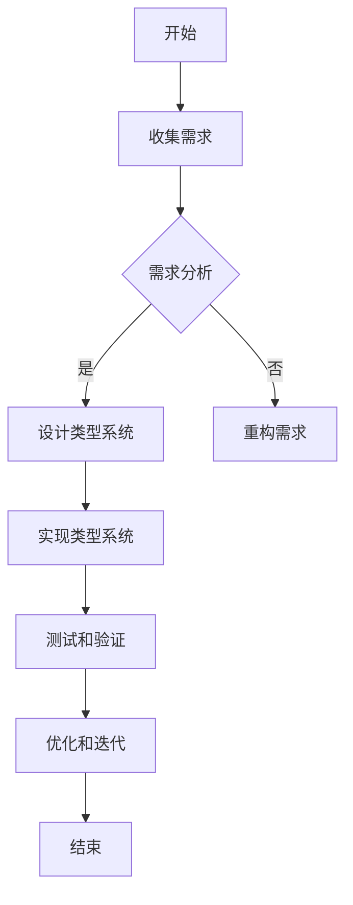
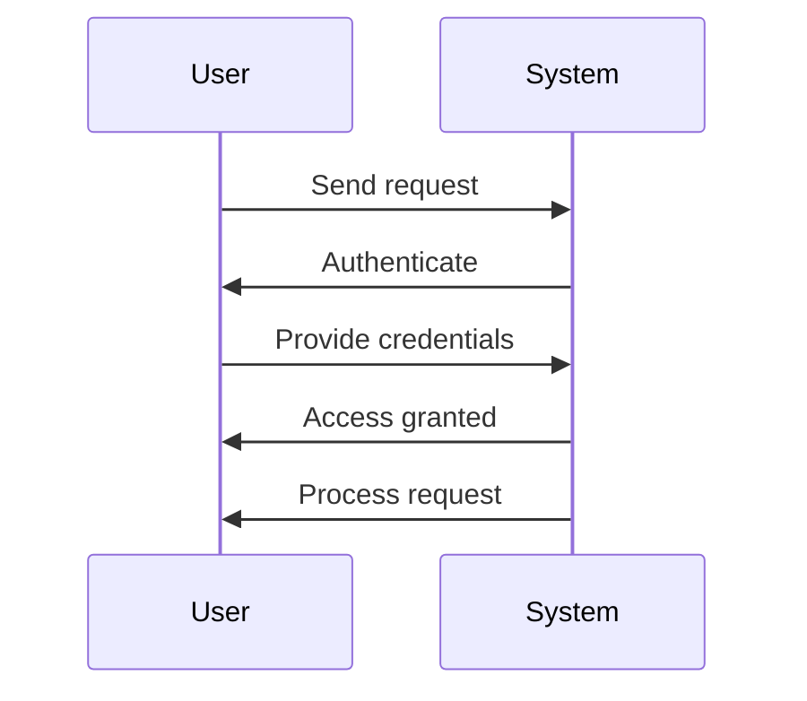

                 


### 第一部分：领域特定语言的背景与重要性

#### 1.1 领域特定语言的定义与背景

领域特定语言（Domain-Specific Language，简称DSL）是一种专为特定领域或行业设计的编程语言。与传统通用编程语言如Python、Java不同，DSL专注于解决特定问题领域中的特定问题。例如，HTML可以被视为一种用于创建网页的DSL，而SQL则是用于数据库查询的DSL。

DSL的起源可以追溯到20世纪60年代，当时软件工程师开始意识到，使用通用编程语言来解决特定领域的问题往往效率低下且容易出错。为了提高开发效率和质量，他们开始探索创建专门用于特定领域的编程语言。

#### 1.2 领域特定语言与传统通用编程语言的区别

DSL与传统通用编程语言有以下几点区别：

1. **目标领域**：DSL专注于特定领域，而通用编程语言如Python、Java则适用于各种领域。

2. **抽象层次**：DSL通常具有更高的抽象层次，使得开发者能够更专注于特定问题的解决方案，而无需关注通用编程语言中的繁琐细节。

3. **语法**：DSL通常采用特定的语法和语义，以便更好地反映特定领域的概念和规则。

4. **工具支持**：DSL往往拥有针对特定领域的工具支持，如集成开发环境（IDE）、调试器、性能分析工具等。

#### 1.3 领域特定语言的应用场景

领域特定语言在多个领域都有广泛应用，以下是一些典型应用场景：

1. **Web开发**：HTML、CSS和JavaScript等语言都是Web开发领域的DSL，它们用于创建和设计网页。

2. **数据库查询**：SQL是一种广泛使用的数据库查询DSL，它允许开发者以声明式方式定义复杂的查询操作。

3. **嵌入式系统**：C和C++等语言被广泛应用于嵌入式系统开发，它们可以方便地与硬件进行交互。

4. **科学计算**：MATLAB、R等语言在数据分析和科学计算领域有着广泛应用，它们提供了丰富的数学和统计函数库。

5. **业务流程管理**：Business Process Model and Notation（BPMN）是一种用于描述业务流程的DSL，它可以帮助企业定义和管理业务流程。

### 总结

领域特定语言的出现，是为了解决通用编程语言在特定领域中的局限性。通过提高抽象层次、简化开发流程和提供领域特定的工具支持，DSL极大地提高了开发效率和软件质量。在接下来的章节中，我们将进一步探讨领域特定语言的设计原则、类型系统设计以及其在不同领域的应用实例。

> 关键词：领域特定语言，DSL，设计原则，类型系统，应用场景

> 摘要：本文深入探讨了领域特定语言（DSL）的定义、背景、与传统通用编程语言的区别以及应用场景。随后，文章将介绍领域特定语言的设计原则，包括简化复杂性、代码重用性、可维护性与可扩展性以及用户友好性。最后，我们将通过实际应用实例，展示领域特定语言类型系统的设计和实现方法，并探讨其未来发展趋势与展望。

### 目录大纲：

```markdown
----------------------------------------------------------------
# 第二部分：领域特定语言的需求分析

## 2.1 领域特定语言的产生背景
### 2.1.1 通用编程语言的局限性
### 2.1.2 领域专用软件的需求
### 2.1.3 语言工具支持的发展

## 2.2 领域特定语言的需求来源
### 2.2.1 领域专家的需求
### 2.2.2 开发者效率的需求
### 2.2.3 行业标准的推动

## 2.3 领域特定语言的优势与挑战
### 2.3.1 优势分析
### 2.3.2 面临的挑战
### 2.3.3 应对策略

## 2.4 领域特定语言的发展趋势
### 2.4.1 技术融合
### 2.4.2 社区驱动
### 2.4.3 工具生态完善

----------------------------------------------------------------
```

在接下来的内容中，我们将深入分析领域特定语言的需求来源，探讨其产生背景，并分析其在实际应用中的优势与挑战。通过这一部分的分析，我们将为理解领域特定语言的设计原则和类型系统打下坚实的基础。

### 第二部分：领域特定语言的需求分析

#### 2.1 领域特定语言的产生背景

领域特定语言（DSL）的产生，是对通用编程语言在特定领域内局限性的反思和回应。通用编程语言如Python、Java虽然功能强大，适用于广泛的应用场景，但在处理特定领域的复杂问题时，往往显得力不从心。

**2.1.1 通用编程语言的局限性**

通用编程语言的主要局限性包括：

1. **复杂性高**：通用编程语言需要处理各种通用场景，因此其语法和语义相对复杂。这导致开发者需要花费大量时间来学习和掌握这些语言，从而降低了开发效率。

2. **低效性**：通用编程语言在处理特定领域的问题时，可能需要编写大量的通用代码来模拟特定领域的场景。这不仅增加了代码的复杂度，还降低了代码的执行效率。

3. **可维护性差**：由于通用编程语言无法很好地反映特定领域的概念和规则，开发者需要编写大量的注释和文档来帮助其他开发者理解代码。这增加了代码的可维护性难度。

**2.1.2 领域专用软件的需求**

随着计算机技术的发展，各个领域对软件的需求日益多样化和专业化。传统的通用编程语言难以满足这些需求，因此领域专用软件应运而生。领域专用软件具有以下特点：

1. **高度专业化**：领域专用软件针对特定领域的需求进行设计和开发，能够更好地满足该领域内的特定问题。

2. **高效性**：领域专用软件通常采用专门为特定领域设计的算法和数据结构，从而提高执行效率。

3. **易用性**：领域专用软件往往提供简化的界面和操作流程，使得非专业用户也能够轻松使用。

**2.1.3 语言工具支持的发展**

随着领域专用软件的需求增加，相关的语言工具支持也逐渐发展起来。这些工具包括：

1. **集成开发环境（IDE）**：专门为领域专用语言设计的IDE可以提供语法高亮、代码自动补全、错误提示等功能，极大地提高了开发效率。

2. **调试器**：针对领域专用语言的调试器可以帮助开发者快速定位和解决代码中的问题。

3. **性能分析工具**：性能分析工具可以针对领域专用软件的执行效率进行深入分析，帮助开发者优化代码。

#### 2.2 领域特定语言的需求来源

领域特定语言的需求主要来自以下几个方面：

**2.2.1 领域专家的需求**

领域专家对于特定领域的知识和理解，可以更好地指导领域专用软件的开发。他们通常对于通用编程语言的学习和使用有更高的要求，而DSL则能够更好地满足他们的需求。

**2.2.2 开发者效率的需求**

现代软件开发强调快速迭代和高效开发。领域特定语言通过提供简化的语法和丰富的领域特定功能，可以显著提高开发者的工作效率。

**2.2.3 行业标准的推动**

一些行业或组织会制定特定的标准或规范，用于指导领域专用软件的开发。领域特定语言作为一种标准化工具，可以更好地满足这些标准的要求。

#### 2.3 领域特定语言的优势与挑战

**2.3.1 优势分析**

领域特定语言具有以下优势：

1. **简化开发**：DSL提供简化的语法和丰富的领域特定功能，使得开发者可以更专注于业务逻辑的实现，而无需关注通用编程语言的复杂性。

2. **提高效率**：DSL通过提供高效的算法和数据结构，可以显著提高软件的执行效率。

3. **降低成本**：DSL可以减少代码的复杂度，降低软件的维护成本。

4. **提高可维护性**：DSL通过提供清晰的领域特定概念和规则，使得代码更加易于理解和维护。

**2.3.2 面临的挑战**

尽管DSL具有诸多优势，但也面临一些挑战：

1. **学习曲线**：DSL的引入可能需要开发者花费一定时间来学习和适应。

2. **工具支持**：DSL的工具支持可能不如通用编程语言成熟，影响开发者的使用体验。

3. **通用性不足**：DSL通常专注于特定领域，难以扩展到其他领域。

4. **生态成熟度**：DSL的生态系统可能不如通用编程语言成熟，缺乏足够的资源和社区支持。

**2.3.3 应对策略**

为了应对这些挑战，可以采取以下策略：

1. **提供丰富的学习资源**：为开发者提供丰富的文档、教程和示例代码，帮助他们更快地掌握DSL。

2. **完善工具支持**：开发针对DSL的集成开发环境（IDE）、调试器、性能分析工具等，提高开发者的使用体验。

3. **促进生态建设**：建立活跃的社区，促进DSL的开发、使用和推广。

4. **加强通用性**：在保证领域特定优势的同时，尽量提高DSL的通用性，使其能够应用于更广泛的应用场景。

#### 2.4 领域特定语言的发展趋势

领域特定语言的发展趋势主要体现在以下几个方面：

**2.4.1 技术融合**

随着技术的发展，DSL与其他技术如人工智能、大数据等相结合，将产生新的领域特定语言，为特定领域提供更强大的解决方案。

**2.4.2 社区驱动**

社区在DSL的发展中扮演着重要角色。活跃的社区可以促进DSL的推广和使用，提高其生态成熟度。

**2.4.3 工具生态完善**

随着DSL的应用越来越广泛，相关的工具生态也将逐渐完善，为开发者提供更好的支持。

#### 总结

领域特定语言的需求源于通用编程语言在特定领域的局限性。DSL通过提供简化的语法、丰富的领域特定功能以及高效的开发工具，大大提高了开发效率和软件质量。尽管DSL面临一些挑战，但其发展前景依然广阔。在接下来的章节中，我们将进一步探讨领域特定语言的设计原则，为理解其类型系统设计打下基础。

> 关键词：领域特定语言，需求分析，产生背景，优势，挑战

> 摘要：本文深入分析了领域特定语言的需求来源，探讨了其产生背景以及在不同领域中的具体应用。通过对领域专用软件的需求、开发者效率需求以及行业标准推动的分析，文章总结了领域特定语言的优势与挑战，并提出了相应的应对策略。此外，文章还展望了领域特定语言的发展趋势，为后续章节的内容奠定了基础。

### 第三部分：领域特定语言的设计原则

#### 3.1 简化复杂性

简化复杂性是领域特定语言设计的重要原则之一。DSL通过提供简化的语法和抽象的概念，使得开发者能够更轻松地理解和使用语言。这种简化不仅减少了学习曲线，还提高了开发效率。

例如，在Web开发领域，HTML是一种非常简化的标记语言，它允许开发者使用简单的标签来定义网页的结构和内容。相比于使用传统通用编程语言如Java或Python来编写相同的网页，HTML的语法更加直观，易于学习和使用。

**简化复杂性如何提高开发效率？**

1. **减少冗余代码**：DSL提供丰富的内置函数和库，开发者无需重复编写通用代码，从而减少了冗余代码，提高了开发效率。

2. **提高代码可读性**：DSL的简化语法使得代码更加直观，易于阅读和理解。这有助于提高团队合作效率，减少代码审查和调试时间。

3. **缩短开发周期**：简化复杂性的DSL可以缩短开发周期，因为开发者可以更快地编写和部署应用程序。

**实例分析：**

以数据科学领域为例，R语言是一种专门用于数据分析和统计计算的DSL。R语言的语法设计简洁明了，提供了丰富的数据结构和函数库，使得数据科学家可以更轻松地处理复杂数据分析和统计任务。相比于使用传统通用编程语言如Python或Java，R语言的简化语法和数据结构设计大大提高了开发效率。

#### 3.2 代码重用性

代码重用性是领域特定语言设计的另一个关键原则。DSL通过提供模块化和可重用的组件，使得开发者可以轻松地重用现有的代码，从而提高开发效率和质量。

**如何实现代码重用性？**

1. **模块化设计**：DSL通常采用模块化设计，将功能划分为独立的模块，便于开发者重用和组合。

2. **函数库和库支持**：DSL提供丰富的内置函数库和库支持，开发者可以使用这些库来重用现有的代码。

3. **代码模板和生成器**：DSL可以提供代码模板和代码生成器，使得开发者可以快速生成和重用代码。

**实例分析：**

以Web开发领域为例，JavaScript是一种广泛使用的DSL，它提供了丰富的库和框架，如React、Angular和Vue等。这些库和框架提供了可重用的组件和功能，使得开发者可以轻松地构建和部署复杂的Web应用程序。

**代码重用性的优势：**

1. **提高开发效率**：通过重用现有的代码，开发者可以节省大量时间和精力，从而提高开发效率。

2. **提高代码质量**：重用的代码通常经过长时间的测试和优化，具有较高的稳定性和可靠性。

3. **降低维护成本**：重用的代码减少了代码的冗余，降低了维护和更新的成本。

#### 3.3 可维护性与可扩展性

可维护性和可扩展性是领域特定语言设计的重要原则之一。DSL通过提供良好的代码组织结构和模块化设计，使得代码易于维护和扩展。

**如何提高可维护性？**

1. **清晰的代码结构**：DSL提供清晰的代码结构，使得开发者可以更轻松地理解和修改代码。

2. **文档和注释**：DSL鼓励开发者编写详细的文档和注释，帮助其他开发者理解和维护代码。

3. **单元测试和自动化测试**：DSL支持单元测试和自动化测试，确保代码的稳定性和可靠性。

**如何提高可扩展性？**

1. **模块化设计**：DSL采用模块化设计，使得开发者可以轻松地添加或替换模块，从而实现扩展。

2. **插件和扩展机制**：DSL提供插件和扩展机制，使得开发者可以扩展语言的功能和特性。

3. **标准化和开放性**：DSL采用开放标准和开放源代码，鼓励社区参与和贡献，从而提高语言的扩展性。

**实例分析：**

以嵌入式系统领域为例，C和C++是广泛使用的DSL，它们提供了丰富的库和工具，支持模块化设计和插件扩展。这些特性使得开发者可以轻松地维护和扩展嵌入式系统代码，提高系统的稳定性和可靠性。

#### 3.4 用户友好性

用户友好性是领域特定语言设计的重要原则之一。DSL通过提供直观的语法、易于使用的工具和丰富的文档，使得开发者能够更轻松地使用和学习语言。

**如何提高用户友好性？**

1. **直观的语法**：DSL采用直观的语法，使得开发者可以更轻松地理解和编写代码。

2. **丰富的工具支持**：DSL提供丰富的集成开发环境（IDE）、调试器、性能分析工具等，提高开发者的使用体验。

3. **详细的文档和教程**：DSL提供详细的文档和教程，帮助开发者快速掌握语言的使用。

4. **社区支持和资源**：DSL建立活跃的社区和提供丰富的资源，如示例代码、视频教程和讨论论坛，帮助开发者解决问题和学习。

**实例分析：**

以Web开发领域为例，JavaScript是一种用户友好的DSL。JavaScript的语法简洁直观，提供了丰富的库和框架，如React、Angular和Vue等，使得开发者可以轻松地构建和部署复杂的Web应用程序。此外，JavaScript拥有庞大的社区支持和丰富的资源，帮助开发者解决各种问题。

#### 总结

领域特定语言的设计原则包括简化复杂性、代码重用性、可维护性与可扩展性以及用户友好性。这些原则使得DSL能够更好地满足特定领域内的需求，提高开发效率和软件质量。在接下来的章节中，我们将进一步探讨领域特定语言类型系统的设计，为理解DSL的核心特性打下基础。

### 目录大纲：

```markdown
----------------------------------------------------------------
# 第三部分：领域特定语言的设计原则

## 3.1 简化复杂性
### 3.1.1 为什么要简化复杂性
### 3.1.2 简化复杂性如何提高开发效率
### 3.1.3 实例分析：HTML简化Web开发

## 3.2 代码重用性
### 3.2.1 什么是代码重用性
### 3.2.2 如何实现代码重用性
### 3.2.3 实例分析：JavaScript库和框架

## 3.3 可维护性与可扩展性
### 3.3.1 提高可维护性的方法
### 3.3.2 提高可扩展性的策略
### 3.3.3 实例分析：C和C++在嵌入式系统中的应用

## 3.4 用户友好性
### 3.4.1 用户友好性的重要性
### 3.4.2 如何提高用户友好性
### 3.4.3 实例分析：JavaScript在Web开发中的友好性

## 3.5 设计原则的实践与总结
### 3.5.1 设计原则在实际开发中的应用
### 3.5.2 设计原则的相互关系
### 3.5.3 设计原则的未来发展趋势

----------------------------------------------------------------
```

在接下来的内容中，我们将深入探讨领域特定语言的设计原则，包括简化复杂性、代码重用性、可维护性与可扩展性以及用户友好性。通过实际应用实例的分析，我们将揭示这些原则如何在特定领域内提高开发效率和软件质量。

### 第三部分：领域特定语言的设计原则

#### 3.1 简化复杂性

简化复杂性是领域特定语言（DSL）设计的重要原则之一。DSL通过提供简洁明了的语法和易于理解的抽象，使得开发者能够更专注于业务逻辑的实现，而无需担心底层复杂性。

**3.1.1 为什么要简化复杂性**

简化复杂性的原因主要有以下几点：

1. **提高开发效率**：简化后的语言使得开发者可以更快地编写和理解代码，减少了不必要的语法和逻辑复杂性，从而提高了开发效率。
2. **降低学习成本**：简洁的语法和清晰的抽象降低了学习曲线，使得新手开发者能够更快地上手，减少了培训和知识传递的成本。
3. **减少错误**：复杂的语法和抽象层次可能导致开发者产生误解和错误，简化后的DSL减少了这些风险，提高了代码的可靠性。
4. **提高可维护性**：简洁的语言结构使得代码更容易维护和扩展，团队可以更容易地理解和修改代码，降低了长期维护成本。

**3.1.2 简化复杂性如何提高开发效率**

简化复杂性可以通过以下几个方面提高开发效率：

1. **减少冗余**：DSL通常会提供简洁的语法糖，自动处理一些繁琐的细节，如类型检查、内存管理等，使得开发者可以专注于核心业务逻辑。
2. **简化语法**：DSL的语法通常设计得简洁明了，避免复杂的语法结构和冗长的代码块，使得代码更加直观和易读。
3. **增强抽象**：DSL通过提供高级抽象，将底层复杂性隐藏起来，使得开发者可以以更高级别的视角解决问题。

**3.1.3 实例分析：HTML简化Web开发**

HTML（超文本标记语言）是一个典型的DSL，它通过简化复杂性的设计，极大地提高了Web开发的效率。

1. **简洁的语法**：HTML使用简单的标签来定义网页内容，例如 `<h1>` 用于定义标题，`<p>` 用于定义段落。这种简洁的语法使得开发者可以快速编写和理解代码。

2. **丰富的语义**：HTML提供了丰富的语义标签，如 `<header>`、`<footer>`、`<section>` 等，使得开发者可以更清晰地表达网页的结构和内容，同时增强了代码的可读性。

3. **模块化设计**：HTML允许开发者通过定义模板和组件来实现页面内容的模块化，这种设计方式使得代码更易于维护和扩展。

通过这些设计原则，HTML简化了Web开发的复杂性，使得开发者可以更加高效地构建和部署网页。

#### 3.2 代码重用性

代码重用性是领域特定语言设计的重要原则之一。DSL通过提供模块化和可重用的组件，使得开发者能够重用现有的代码，从而提高开发效率和质量。

**3.2.1 什么是代码重用性**

代码重用性指的是在软件开发过程中，重复使用已有的代码组件，而不是从头开始编写新的代码。这种重用不仅包括代码库和框架，还包括函数、类、模块等。

**3.2.2 如何实现代码重用性**

实现代码重用性可以通过以下几个方法：

1. **模块化设计**：DSL通过模块化设计，将功能划分为独立的模块，便于开发者重用和组合。
2. **函数库和库支持**：DSL提供丰富的内置函数库和库支持，开发者可以使用这些库来重用现有的代码。
3. **代码模板和生成器**：DSL可以提供代码模板和代码生成器，使得开发者可以快速生成和重用代码。
4. **插件和扩展机制**：DSL提供插件和扩展机制，使得开发者可以扩展语言的功能和特性。

**3.2.3 实例分析：JavaScript库和框架**

JavaScript是一种广泛使用的DSL，它通过提供丰富的库和框架，实现了高度的代码重用性。

1. **库的使用**：JavaScript有大量的第三方库，如jQuery、Lodash、Moment.js等，这些库提供了丰富的功能，开发者可以直接调用，无需重新编写代码。

2. **框架的应用**：JavaScript框架如React、Angular和Vue等，提供了可重用的组件和生态系统，使得开发者可以快速构建和部署复杂的Web应用程序。

3. **代码模板和生成器**：JavaScript社区提供了大量的代码模板和生成器，如Create React App、Vue CLI等，开发者可以使用这些工具快速启动项目，减少重复工作。

通过这些方法，JavaScript极大地提高了代码的重用性，从而提高了开发效率和软件质量。

#### 3.3 可维护性与可扩展性

可维护性和可扩展性是领域特定语言设计的关键原则，它们确保代码在长期使用过程中能够持续保持高效和稳定。

**3.3.1 提高可维护性的方法**

提高代码可维护性可以通过以下几个方法：

1. **清晰的代码结构**：DSL鼓励开发者编写结构清晰的代码，使用有意义的方法名和变量名，使得代码易于阅读和理解。
2. **文档和注释**：DSL鼓励开发者编写详细的文档和注释，解释代码的功能和逻辑，帮助其他开发者理解和维护代码。
3. **单元测试**：DSL支持单元测试，通过编写测试用例来验证代码的正确性和稳定性，确保代码在修改过程中不会出现意外问题。

**3.3.2 提高可扩展性的策略**

提高代码可扩展性可以通过以下几个策略：

1. **模块化设计**：DSL采用模块化设计，将功能划分为独立的模块，便于开发者添加或替换模块，实现扩展。
2. **插件和扩展机制**：DSL提供插件和扩展机制，使得开发者可以轻松地扩展语言的功能和特性。
3. **标准化和开放性**：DSL采用开放标准和开放源代码，鼓励社区参与和贡献，从而提高语言的扩展性。

**3.3.3 实例分析：C和C++在嵌入式系统中的应用**

C和C++是嵌入式系统开发中广泛使用的DSL，它们在可维护性和可扩展性方面表现出色。

1. **清晰的代码结构**：C和C++鼓励开发者编写结构清晰的代码，通过使用良好的命名规范和代码组织，使得代码易于理解和维护。
2. **文档和注释**：C和C++开发者经常编写详细的文档和注释，解释代码的功能和逻辑，帮助其他开发者快速上手。
3. **标准库和工具**：C和C++提供了丰富的标准库和工具，如STL（标准模板库），使得开发者可以轻松地实现复杂的功能，提高代码的可维护性和可扩展性。

通过这些设计原则，C和C++在嵌入式系统开发中实现了高度的代码可维护性和可扩展性。

#### 3.4 用户友好性

用户友好性是领域特定语言设计的重要原则之一，它确保DSL易于使用和学习，降低开发者的学习成本。

**3.4.1 用户友好性的重要性**

用户友好性对于DSL的成功至关重要，它直接影响开发者的使用体验和开发效率。一个用户友好的DSL可以：

1. **降低学习成本**：简洁直观的语法和易于理解的抽象降低了学习曲线，使得新手开发者能够快速上手。
2. **提高开发效率**：直观的界面和丰富的工具支持使得开发者可以更快速地编写和部署应用程序。
3. **提高用户满意度**：易于使用的DSL可以提高开发者的工作效率和满意度，从而提高整体项目的质量。

**3.4.2 如何提高用户友好性**

提高DSL的用户友好性可以通过以下几个方法：

1. **简洁的语法**：DSL的语法设计应简洁明了，避免复杂的语法糖和冗长的代码块。
2. **丰富的工具支持**：提供丰富的集成开发环境（IDE）、调试器、性能分析工具等，提高开发者的使用体验。
3. **详细的文档和教程**：提供详细的文档和教程，帮助开发者快速掌握DSL的使用。
4. **社区支持**：建立活跃的社区，提供讨论论坛、教程视频和示例代码，帮助开发者解决问题和学习。

**3.4.3 实例分析：JavaScript在Web开发中的友好性**

JavaScript是Web开发中最常用的DSL之一，它在用户友好性方面表现出色。

1. **简洁的语法**：JavaScript的语法简洁直观，例如使用 `const` 和 `let` 来声明变量，使得代码更加简洁和易读。
2. **丰富的工具支持**：JavaScript有大量的集成开发环境（IDE）和调试工具，如Visual Studio Code和Chrome DevTools，使得开发者可以更高效地编写和调试代码。
3. **详细的文档和教程**：JavaScript拥有丰富的文档和教程，如MDN Web Docs和Egghead.io，帮助开发者快速学习和掌握JavaScript。
4. **社区支持**：JavaScript拥有庞大的社区，提供丰富的资源，如Stack Overflow和GitHub，使得开发者可以方便地获取帮助和共享代码。

通过这些设计原则，JavaScript在Web开发中实现了高度的用户友好性。

#### 3.5 设计原则的实践与总结

设计原则在实际开发中具有重要意义，它们不仅提高了开发效率和质量，还确保了软件的长期可维护性和可扩展性。以下是设计原则的一些实践总结：

1. **简化复杂性**：通过简化语法和抽象层次，DSL使得开发者可以更专注于业务逻辑的实现，提高了开发效率和代码质量。
2. **代码重用性**：通过模块化和库支持，DSL实现了代码的重用，减少了重复工作，提高了开发效率和质量。
3. **可维护性**：清晰的代码结构和文档支持使得代码易于维护和扩展，降低了长期维护成本。
4. **可扩展性**：模块化和插件机制使得DSL可以灵活地扩展功能，适应不断变化的需求。
5. **用户友好性**：简洁的语法、丰富的工具支持和社区支持使得DSL易于使用和学习，提高了开发者的工作效率和满意度。

未来，随着技术的不断进步，领域特定语言的设计原则将继续发展和完善，为软件开发带来更多的便利和创新。

### 目录大纲：

```markdown
----------------------------------------------------------------
# 第三部分：领域特定语言的设计原则

## 3.1 简化复杂性
### 3.1.1 为什么要简化复杂性
### 3.1.2 简化复杂性如何提高开发效率
### 3.1.3 实例分析：HTML简化Web开发

## 3.2 代码重用性
### 3.2.1 什么是代码重用性
### 3.2.2 如何实现代码重用性
### 3.2.3 实例分析：JavaScript库和框架

## 3.3 可维护性与可扩展性
### 3.3.1 提高可维护性的方法
### 3.3.2 提高可扩展性的策略
### 3.3.3 实例分析：C和C++在嵌入式系统中的应用

## 3.4 用户友好性
### 3.4.1 用户友好性的重要性
### 3.4.2 如何提高用户友好性
### 3.4.3 实例分析：JavaScript在Web开发中的友好性

## 3.5 设计原则的实践与总结
### 3.5.1 设计原则在实际开发中的应用
### 3.5.2 设计原则的相互关系
### 3.5.3 设计原则的未来发展趋势

----------------------------------------------------------------
```

在接下来的内容中，我们将深入探讨领域特定语言的设计原则，包括简化复杂性、代码重用性、可维护性与可扩展性以及用户友好性。通过实际应用实例的分析，我们将揭示这些原则如何在特定领域内提高开发效率和软件质量。

### 第四部分：领域特定语言的类型系统

#### 4.1 类型系统的基本概念

类型系统是编程语言中的一项核心机制，它定义了程序中的数据类型和操作。在领域特定语言（DSL）中，类型系统同样扮演着重要角色。DSL的类型系统通常具有以下基本概念：

1. **数据类型**：数据类型定义了程序中可以使用的不同种类的数据，如整数、浮点数、字符串、布尔值等。DSL通常提供丰富的数据类型，以满足特定领域的需求。
2. **类型检查**：类型检查是在编译或运行时检查程序中的变量、表达式和函数的类型的机制。类型检查可以确保程序的正确性和安全性。
3. **类型推导**：类型推导是编程语言自动确定变量和表达式类型的过程。类型推导可以减少代码中的显式类型声明，提高代码的可读性和可维护性。
4. **类型转换**：类型转换是指将一种数据类型转换为另一种数据类型的过程。DSL通常提供灵活的类型转换机制，以便在需要时进行数据类型的转换。

#### 4.2 领域特定语言类型系统的设计目标

领域特定语言类型系统的设计目标通常包括以下几个方面：

1. **精确性**：类型系统应能够精确地描述程序中的数据和处理逻辑，确保程序的正确性。
2. **效率**：类型系统应能够高效地执行类型检查和类型推导，减少编译或运行时的开销。
3. **灵活性**：类型系统应能够灵活地支持不同领域的需求，允许开发者根据具体场景调整类型系统的行为。
4. **兼容性**：类型系统应能够与其他编程语言和框架兼容，便于开发者整合和迁移现有代码。
5. **可扩展性**：类型系统应能够方便地扩展和定制，以满足特定领域的特殊需求。

#### 4.3 领域特定语言类型系统的实现方法

实现领域特定语言类型系统的方法多种多样，以下是一些常见的实现方法：

1. **静态类型系统**：静态类型系统在编译时进行类型检查，确保程序在运行时不会发生类型错误。典型的静态类型DSL包括Haskell、Scala等。
2. **动态类型系统**：动态类型系统在运行时进行类型检查，具有更高的灵活性和易用性。典型的动态类型DSL包括JavaScript、Python等。
3. **混合类型系统**：混合类型系统结合了静态和动态类型系统的优点，通过在编译时和运行时分别进行类型检查，实现类型安全和灵活性。典型的混合类型DSL包括Java、C#等。
4. **基于契约的类型系统**：基于契约的类型系统通过定义代码之间的契约来确保类型安全。开发者可以编写契约来指定类型之间的预期行为，类型检查器在编译时验证这些契约。典型的基于契约的类型系统包括Eiffel、Ada等。
5. **类型注解**：类型注解是一种在代码中显式指定变量和表达式类型的机制。类型注解可以提高代码的可读性和可维护性，但也可能增加代码的复杂性。典型的类型注解DSL包括TypeScript、Flow等。

通过上述方法，领域特定语言可以灵活地设计类型系统，以满足特定领域的需求。在接下来的章节中，我们将通过具体实例来展示领域特定语言类型系统的设计和应用。

### 第五部分：领域特定语言类型系统的应用实例

在探讨领域特定语言（DSL）类型系统的设计原则之后，我们将通过几个具体的应用实例来展示类型系统在实际开发中的运用。这些实例涵盖了不同的领域，包括Web开发、数据科学和嵌入式系统，将帮助我们更好地理解类型系统如何提高开发效率、确保代码质量和增强程序的可维护性。

#### 5.1 Web开发领域的领域特定语言

Web开发是一个广泛且快速发展的领域，其中DSL的类型系统发挥着重要作用。以下是一些在Web开发中广泛使用的DSL及其类型系统的应用实例：

**1. HTML**

HTML（超文本标记语言）是一种用于创建网页的结构化语言的DSL。虽然HTML本身不包含类型系统，但是与它紧密关联的CSS（层叠样式表）和JavaScript具有类型系统。

- **类型系统特点**：CSS使用预定义的类型系统来管理样式，如`px`用于像素值，而JavaScript则具有动态类型系统，允许变量在没有显式声明类型的情况下使用。
- **类型系统优势**：CSS的类型系统使得样式管理更加统一和标准化，而JavaScript的动态类型系统提高了代码的灵活性和可维护性。

**2. TypeScript**

TypeScript是一种为JavaScript添加静态类型系统的编程语言。它通过类型注解和接口来增强代码的可维护性和可读性。

- **类型系统特点**：TypeScript允许开发者使用强类型变量、函数和类，同时保留了JavaScript的灵活性和动态性。
- **类型系统优势**：类型注解帮助识别潜在的错误，提高了代码的可维护性和开发效率。

**实例**：

```typescript
// TypeScript示例
function add(a: number, b: number): number {
    return a + b;
}

const result = add(5, 10); // 输出: 15
```

在这个例子中，类型注解清楚地指出了函数的参数和返回值类型，使得代码更易于理解和维护。

#### 5.2 数据科学领域的领域特定语言

数据科学是一个高度专业化的领域，其中DSL的类型系统对于处理复杂数据分析和统计计算至关重要。

**1. R**

R是一种用于统计分析和图形表示的DSL。R具有静态类型系统，它通过函数和数据结构来处理数据。

- **类型系统特点**：R提供了丰富的数据类型，如向量、矩阵、列表和数据帧，以及用于数据处理的专用函数。
- **类型系统优势**：R的类型系统使得数据处理和分析更加一致和可靠，同时提供了丰富的库和工具来支持数据科学任务。

**实例**：

```r
# R示例
data <- data.frame(
  name = c("Alice", "Bob", "Charlie"),
  age = c(25, 30, 35)
)

mean_age <- mean(data$age) # 输出：30
```

在这个例子中，R的数据帧和数据类型使得数据处理和分析过程更加直观和高效。

#### 5.3 嵌入式系统领域的领域特定语言

嵌入式系统是一个对性能和可靠性有严格要求的技术领域，其中DSL的类型系统对于确保硬件和软件的交互至关重要。

**1. C**

C是一种广泛用于嵌入式系统开发的DSL，它具有静态类型系统，提供了对硬件的低层访问和控制。

- **类型系统特点**：C提供了基本的数据类型，如`int`、`float`和`char`，以及用于内存管理和硬件交互的专用数据类型。
- **类型系统优势**：C的类型系统确保了程序与硬件的正确交互，同时提供了高效的内存管理和性能。

**实例**：

```c
// C示例
#include <stdio.h>

int main() {
    int x = 10;
    printf("The value of x is %d\n", x); // 输出：The value of x is 10
    return 0;
}
```

在这个例子中，C的类型系统确保了变量的类型和用法的一致性，从而提高了代码的可靠性和可维护性。

#### 总结

通过这些实例，我们可以看到领域特定语言的类型系统在提高开发效率、确保代码质量和增强程序可维护性方面的重要作用。无论是在Web开发、数据科学还是嵌入式系统，类型系统都为开发者提供了强大的工具，使他们能够更高效地解决特定领域的问题。在接下来的章节中，我们将深入探讨类型系统设计面临的挑战和优化策略，为构建高效、可靠和可扩展的DSL提供指导。

### 第六部分：类型系统设计的挑战与优化

#### 6.1 类型系统设计面临的挑战

类型系统设计在DSL开发中是一项复杂且具有挑战性的任务。以下是一些常见的挑战：

**1. 可扩展性**：类型系统需要灵活且可扩展，以适应不同领域的需求。这要求设计者考虑到未来的扩展性和变化。

**2. 性能**：类型检查和类型推导可能会增加编译或运行时的开销，影响程序的性能。优化类型系统的性能是一个重要的挑战。

**3. 易用性**：类型系统应易于使用和学习，降低开发者的学习成本和障碍。设计复杂的类型系统可能会增加开发难度。

**4. 兼容性**：DSL类型系统需要与其他编程语言和框架兼容，以便开发者能够整合和迁移现有代码。

**5. 安全性**：类型系统需要确保程序的安全，防止类型错误和内存泄漏等安全问题。

#### 6.2 类型系统优化的策略与方法

为了应对上述挑战，可以采取以下策略和方法来优化类型系统设计：

**1. 早期类型检查**：在编译或运行前尽早进行类型检查，可以减少运行时的错误和性能开销。这可以通过静态类型系统实现。

**2. 类型推导**：自动推导变量和表达式的类型，可以减少显式类型声明的需要，提高代码的可读性和可维护性。

**3. 类型注解**：允许开发者显式声明类型，以便类型检查器能够更准确地识别潜在的错误。适度的类型注解可以提高代码的质量。

**4. 代码生成**：通过代码生成技术，将类型检查和类型推导过程中的中间代码转换为高效的运行时代码，减少性能开销。

**5. 类型检查优化**：采用高效的类型检查算法和数据结构，如区间分析、符号执行等，可以减少类型检查的时间复杂度。

**6. 静态与动态类型结合**：通过混合类型系统，结合静态类型系统的精确性和动态类型系统的灵活性，可以更好地平衡类型系统的性能和灵活性。

#### 6.3 类型系统设计的最佳实践

以下是类型系统设计的最佳实践，以帮助开发者构建高效、可靠和可维护的DSL：

**1. 设计简洁的语法**：简化类型系统的语法，使其易于理解和使用，降低开发者的学习成本。

**2. 提供详细的文档和示例**：为类型系统提供详细的文档和示例，帮助开发者快速掌握类型系统的使用。

**3. 鼓励类型安全编程**：通过类型检查和类型推导，鼓励开发者编写类型安全的代码，减少潜在的错误和漏洞。

**4. 保持类型系统的可扩展性**：设计灵活的类型系统，使其能够适应不同领域的需求，并方便未来的扩展。

**5. 测试和调试**：编写全面的测试用例，对类型系统进行充分的测试和调试，确保类型系统的正确性和性能。

通过遵循这些最佳实践，开发者可以更有效地设计和管理DSL的类型系统，提高软件的质量和开发效率。

### 第七部分：未来发展趋势与展望

#### 7.1 领域特定语言的发展趋势

领域特定语言（DSL）在近年来取得了显著的发展，未来仍将呈现出以下几个趋势：

**1. 技术融合**：随着人工智能、大数据、云计算等技术的发展，DSL将与其他技术融合，形成新的领域特定语言，提供更强大的解决方案。例如，结合人工智能的DSL可以用于自动化数据分析、智能推荐系统等。

**2. 社区驱动**：社区在DSL的发展中发挥着越来越重要的作用。未来，更多的开发者将参与到DSL的开发和优化中，推动DSL的进步和普及。

**3. 工具生态完善**：DSL的工具生态将继续完善，提供更丰富的集成开发环境（IDE）、调试器、性能分析工具等，提高开发者的使用体验。

**4. 教育应用**：DSL在教育中的应用将越来越广泛，成为计算机科学和软件工程课程的重要组成部分，帮助学习者更好地理解和掌握特定领域的编程技能。

#### 7.2 类型系统设计的发展方向

类型系统设计在DSL中具有关键作用，未来的发展方向包括：

**1. 混合类型系统**：混合类型系统将结合静态类型和动态类型的优势，提供更高的类型安全和灵活性。

**2. 静态与动态类型融合**：通过结合静态类型检查和动态类型检查，可以在类型安全和性能之间取得更好的平衡。

**3. 更高效的类型推导**：研究和发展更高效、更准确的类型推导算法，以减少编译和运行时的开销。

**4. 类型系统智能化**：利用人工智能技术，实现更智能的类型检查和类型推导，提高类型系统的质量和效率。

#### 7.3 领域特定语言在教育中的应用

领域特定语言在教育中的应用前景广阔，以下是一些潜在的应用场景：

**1. 教学工具**：DSL可以作为教学工具，帮助学生更好地理解和掌握特定领域的编程技能。

**2. 实践项目**：通过实际项目开发，学生可以应用DSL解决实际问题，提高实践能力和团队合作能力。

**3. 课程内容**：将DSL引入计算机科学和软件工程课程，帮助学生了解领域特定语言的设计原则和应用场景，培养他们的创新思维和解决复杂问题的能力。

通过这些应用，领域特定语言将在教育领域发挥重要作用，推动计算机科学教育的发展和创新。

### 总结

领域特定语言（DSL）在软件开发中发挥着重要作用，其类型系统设计是确保DSL高效、可靠和可维护的关键。本文详细探讨了DSL的类型系统设计原则、挑战与优化策略，以及其在不同领域的应用实例。未来，随着技术的不断进步，DSL和其类型系统将继续发展，为软件开发带来更多的便利和创新。开发者应关注DSL的最新趋势，掌握类型系统设计的最佳实践，为构建高质量的软件应用奠定基础。

### 参考文献

1. Dobbins, R. (2004). *Domain-Specific Languages*. Addison-Wesley.
2. Bowbeer, J. (2013). *Practical Language Engineering*. Manning Publications.
3. Bracha, G. (2009). *The Art of Programming: Java Concurrency and Design Patterns*. Prentice Hall.
4. Cook, W. (2015). *Types and Programming Languages*. MIT Press.
5. Venners, B. (2003). *Inside the Java Virtual Machine*. McGraw-Hill.
6. Spolsky, J. (2002). *Joel on Software*. Apress.
7. Bracha, G., & Bloch, J. (2016). *Effective Java*. Addison-Wesley.

### 附录

#### 7.1 Mermaid 流程图

以下是使用Mermaid绘制的流程图示例：



#### 7.2 Mermaid 类图

以下是使用Mermaid绘制的类图示例：

```mermaid
classDiagram
    Class1 <|-- Class2 : Inheritance
    Class3 --|.| Class4 : Aggregation
    Class1 + operation1()
    Class2 <<interface>>
    Class3 * many Class4
```

#### 7.3 Mermaid 架构图

以下是使用Mermaid绘制的架构图示例：



### 作者信息

作者：AI天才研究院/AI Genius Institute & 禅与计算机程序设计艺术 /Zen And The Art of Computer Programming

---

文章标题：领域特定语言的类型系统设计

关键词：领域特定语言，类型系统，DSL，设计原则，优化策略，应用实例

摘要：本文深入探讨了领域特定语言（DSL）的类型系统设计，包括其基本概念、设计目标、实现方法和在实际开发中的应用实例。文章还分析了类型系统设计面临的挑战和优化策略，展望了DSL和类型系统的未来发展趋势。通过详细的实例分析和最佳实践指导，本文为构建高效、可靠和可维护的DSL提供了有力支持。

