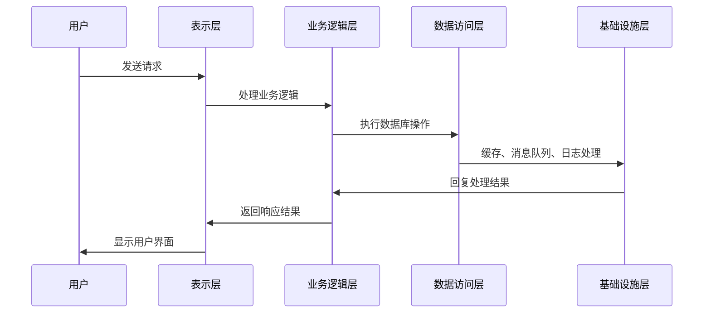

                 

# 《领域驱动设计：P9工程师的业务架构能力》

## 关键词：领域驱动设计、业务架构、P9工程师、分层架构、实体模型、领域服务、领域事件

## 摘要：

本文将深入探讨领域驱动设计（DDD）在业务架构中的重要性，特别是对于P9级别工程师的业务架构能力。我们将从基础概念出发，逐步展开讨论，涵盖DDD的核心原则和实践，分层架构与DDD的融合，实体模型与聚合设计，领域服务与领域事件，以及DDD在业务架构设计中的应用。通过详细的案例分析，我们将展示如何将DDD应用于实际项目，并提供最佳实践和未来趋势的展望。希望本文能为读者在业务架构设计方面提供有价值的指导。

----------------------------------------------------------------

# 《领域驱动设计：P9工程师的业务架构能力》目录大纲

## 第一部分：领域驱动设计基础

## 第1章：领域驱动设计概述

### 1.1 领域驱动设计（DDD）的基本概念

### 1.2 领域驱动设计与传统设计方法的对比

### 1.3 领域驱动设计的核心原则

## 第2章：领域驱动设计核心概念

### 2.1 领域的概念

### 2.2 实体与值的对象

### 2.3 领域服务

### 2.4 领域事件

## 第二部分：领域驱动设计实践

## 第3章：分层架构与领域驱动设计

### 3.1 分层架构的基本概念

### 3.2 领域驱动设计中的分层架构设计

### 3.3 实践分层架构与DDD的集成

## 第4章：实体模型与聚合设计

### 4.1 实体模型的基本原理

### 4.2 聚合的概念与设计

### 4.3 聚合根与成员关系

## 第5章：领域服务与领域事件

### 5.1 领域服务的角色与职责

### 5.2 领域事件的处理

### 5.3 领域服务与领域事件的协作

## 第三部分：领域驱动设计应用

## 第6章：业务架构设计与DDD

### 6.1 业务架构设计与DDD的融合

### 6.2 业务能力划分与DDD实践

### 6.3 业务架构设计的实战案例

## 第7章：领域驱动设计项目实战

### 7.1 项目背景介绍

### 7.2 系统功能设计

### 7.3 系统架构设计

### 7.4 项目实现与代码解读

### 7.5 项目总结与反思

## 第8章：领域驱动设计最佳实践

### 8.1 领域驱动设计的最佳实践

### 8.2 避免常见误区

### 8.3 持续改进与优化

## 第9章：领域驱动设计未来趋势

### 9.1 领域驱动设计的发展趋势

### 9.2 领域驱动设计的新应用领域

### 9.3 领域驱动设计的未来展望

----------------------------------------------------------------

### 第1章：领域驱动设计概述

### 1.1 领域驱动设计（DDD）的基本概念

领域驱动设计（Domain-Driven Design，简称DDD）是一种软件开发方法论，强调基于领域模型来驱动软件的设计与实现。DDD最初由埃文·海瑟（Evan Hatherly）在2004年提出，并迅速在软件工程领域引起了广泛关注。

在DDD中，“领域”指的是软件系统所操作的特定业务领域，例如银行、电商、物流等。领域模型则是用来表示领域概念、规则和关系的抽象模型。通过构建领域模型，开发者能够更清晰地理解业务需求，从而设计出更贴近业务需求的软件系统。

DDD的核心目标是解决软件开发中常见的业务逻辑复杂性，确保软件系统能够长期适应业务变化。与传统的设计方法不同，DDD强调开发者需要深入理解业务领域，并在设计过程中不断与业务专家沟通，以确保系统设计能够准确地反映业务需求。

### 1.2 领域驱动设计与传统设计方法的对比

传统设计方法，如面向对象设计（OOD）和三层架构设计，往往注重软件系统的技术实现，而较少关注业务领域的独特性。这种设计方法容易导致以下问题：

1. **业务与技术分离**：传统设计方法往往将业务逻辑与系统实现分离，导致业务专家和开发者在沟通上存在障碍，影响软件系统的业务适应性。

2. **代码复用困难**：传统设计方法注重模块化，但往往导致模块之间的依赖关系复杂，难以实现代码的复用。

3. **难以适应业务变化**：传统设计方法难以适应业务需求的变化，一旦业务规则发生变动，系统需要进行大规模的调整，增加了维护成本。

相比之下，DDD注重以下方面：

1. **领域模型驱动**：DDD的核心是领域模型，通过构建领域模型，能够直观地反映业务需求，确保软件系统能够更好地适应业务变化。

2. **业务和技术紧密结合**：DDD强调开发者需要深入理解业务领域，并在设计过程中与业务专家保持紧密沟通，从而确保软件系统能够准确地实现业务需求。

3. **代码可维护性**：DDD通过将业务逻辑封装在领域服务中，降低了模块之间的耦合度，提高了代码的可维护性和可复用性。

### 1.3 领域驱动设计的核心原则

DDD包含了一系列核心原则，这些原则有助于开发者更好地理解和应用DDD。以下是DDD的一些关键原则：

1. **实体与值对象**：实体具有唯一标识，是领域模型中的基本构成单位；值对象则用于表示领域中的基本数据类型。

2. **聚合**：聚合是实体和值对象的组合，用于表示领域中的业务单元。聚合内部具有一致性边界，确保聚合内的元素总是处于一致状态。

3. **领域服务**：领域服务用于实现领域中的业务逻辑，将复杂的业务规则封装在服务中，降低模块间的耦合度。

4. **领域事件**：领域事件是领域模型中的状态变化，用于表示领域中的业务行为。领域事件触发领域服务的执行，实现领域模型的动态更新。

5. **分层架构**：DDD通常与分层架构结合使用，通过分层架构来实现领域模型的隔离和扩展，提高系统的可维护性和可扩展性。

通过遵循这些核心原则，开发者能够更好地构建可维护、可扩展的软件系统，确保系统能够长期适应业务变化。

### 第2章：领域驱动设计核心概念

### 2.1 领域的概念

在领域驱动设计（DDD）中，“领域”是指软件系统所操作的特定业务领域，如银行、电商、物流等。领域模型则是用于表示这个业务领域中所有概念、规则和关系的抽象模型。理解领域是进行DDD的关键，因为领域模型将直接影响软件系统的设计质量和业务适应性。

#### 领域的不同层次

领域可以被划分为不同的层次，以适应不同粒度的业务需求。这些层次通常包括：

1. **概念层**：概念层是领域模型的最顶层，用于定义领域中的核心概念，如客户、订单、产品等。这些概念是业务专家和开发者共同理解的基础。

2. **抽象层**：抽象层是对概念层概念的进一步抽象，用于简化复杂的业务规则和逻辑。例如，在电商领域，订单可以是抽象层中的一个概念，它可以进一步细分为支付订单、发货订单等。

3. **实现层**：实现层是领域模型的具体实现，用于映射到数据库、服务层等底层技术架构。在实现层，领域模型的具体类和接口被定义，以实现抽象层的概念和规则。

#### 领域模型的特点

领域模型具有以下特点：

1. **面向业务**：领域模型专注于业务领域，将业务需求转化为具体的类和关系，确保软件系统能够准确反映业务逻辑。

2. **可变性和灵活性**：领域模型设计时考虑了业务的长期变化，通过抽象和封装，使系统能够适应业务规则的变化。

3. **可复用性**：领域模型中的组件，如实体、值对象、领域服务等，可以独立开发、测试和部署，提高了代码的可复用性。

#### 领域模型与数据库设计的关系

领域模型与数据库设计之间有着密切的关系。领域模型通常用于指导数据库设计，以确保数据库能够准确地反映业务需求。以下是一些关键点：

1. **实体与表**：领域模型中的实体通常映射到数据库表。每个实体对应一个表，实体属性对应表中的字段。

2. **关系与外键**：领域模型中的关系通常通过数据库表的外键来表示。例如，如果一个实体是另一个实体的集合，则可以通过外键实现这两个实体之间的关联。

3. **一致性约束**：领域模型中的规则和约束可以转化为数据库表的一致性约束，如主键、外键、唯一性约束等，确保数据库中的数据一致性和完整性。

### 2.2 实体与值对象

在领域驱动设计中，实体和值对象是领域模型中的基本构建块。

#### 实体的概念

实体是领域模型中的一个核心概念，具有唯一标识和持久化特性。实体通常表示领域中的具体对象，如客户、订单、产品等。实体的关键特性包括：

1. **唯一标识**：每个实体都有一个唯一的标识，用于区分不同的实体实例。这个标识通常是不可变的，即一旦生成，就不能更改。

2. **持久化**：实体通常与数据库表相对应，可以存储在数据库中。实体的状态变化会反映在数据库表中。

3. **行为**：实体可以包含行为（方法），用于实现领域逻辑。实体的行为通常与其标识和持久化特性紧密相关。

#### 值对象的概念

值对象是领域模型中的另一个核心概念，与实体不同，值对象不包含唯一标识，但通常与实体紧密相关。值对象通常表示领域中的基本数据类型，如金额、日期、地址等。值对象的关键特性包括：

1. **不可变**：值对象通常是不可变的，即一旦创建，就不能修改。这种不可变性确保了值对象在传递和存储过程中的安全性和一致性。

2. **轻量级**：值对象通常比较轻量，只包含少量的属性和方法。这使得值对象在传输和存储过程中更加高效。

3. **用于表示复杂数据类型**：值对象可以用于表示复杂的领域数据类型，如订单金额、产品重量等。这使得领域模型更加灵活，可以适应不同类型的业务需求。

#### 实体与值对象的区别

实体和值对象之间的主要区别在于唯一标识和持久化特性：

1. **唯一标识**：实体具有唯一标识，而值对象没有。

2. **持久化**：实体通常与数据库表相对应，可以存储在数据库中；值对象则通常不与数据库表直接对应，但可以存储在实体内部。

3. **行为**：实体通常包含与标识和持久化相关的行为，而值对象通常只包含与数据相关的行为。

#### 实体与值对象的应用场景

根据业务需求的不同，实体和值对象在不同场景下有不同的应用：

1. **客户订单系统**：在客户订单系统中，客户和订单是实体，因为它们具有唯一的标识和持久化特性。金额、日期、地址等是值对象，因为它们不包含唯一的标识，但用于表示复杂的业务数据。

2. **物流系统**：在物流系统中，包裹和运输路线是实体，因为它们具有唯一的标识和持久化特性。重量、尺寸、运输费用等是值对象，因为它们用于表示物流过程中的基本数据类型。

通过理解实体和值对象的概念和应用场景，开发者可以更好地构建领域模型，确保软件系统能够准确地反映业务需求。

### 2.3 领域服务

领域服务是领域驱动设计（DDD）中的一个核心概念，用于实现领域中的业务逻辑。领域服务封装了复杂的业务规则和行为，使领域模型更加清晰和易于维护。以下是对领域服务的详细探讨。

#### 领域服务的概念

领域服务是领域模型中的行为单元，用于实现领域中的业务逻辑。领域服务通常与实体和值对象紧密相关，但独立于具体的实现细节。领域服务的关键特性包括：

1. **业务逻辑的封装**：领域服务封装了领域中的业务逻辑，使业务规则和行为独立于具体的技术实现。

2. **独立性**：领域服务通常独立于其他组件（如数据库、界面等），降低了模块之间的耦合度，提高了系统的可维护性和可扩展性。

3. **可测试性**：由于领域服务独立于具体实现，它们更容易进行单元测试和集成测试，确保业务逻辑的正确性。

#### 领域服务的角色与职责

领域服务在领域模型中扮演着重要的角色，具体职责包括：

1. **处理业务请求**：领域服务接收来自外部系统（如用户界面、其他服务）的请求，并根据领域逻辑进行处理。

2. **实现业务规则**：领域服务实现了领域中的业务规则和逻辑，如订单创建、库存更新、支付处理等。

3. **协调领域模型组件**：领域服务在领域模型中扮演协调者的角色，负责协调不同实体和值对象之间的交互，确保领域模型的一致性和完整性。

#### 领域服务与实体、值对象的关系

领域服务与实体和值对象紧密相关，但它们之间有明显的区别：

1. **与实体的关系**：领域服务通常与实体紧密相关，因为实体是领域模型中的核心对象，包含业务逻辑的关键数据和行为。领域服务负责处理实体的创建、更新、删除等操作。

2. **与值对象的关系**：领域服务通常不直接与值对象交互，因为值对象主要用于表示领域中的基本数据类型。然而，领域服务可能会使用值对象作为输入参数或返回值，以实现具体的业务逻辑。

#### 领域服务的设计原则

设计领域服务时，应遵循以下原则：

1. **单一职责原则**：每个领域服务应专注于实现一个特定的业务功能，避免职责过于分散。

2. **高内聚低耦合原则**：领域服务应具有较高的内聚性，即服务内部的行为和逻辑紧密相关；同时应具有较低的耦合度，即服务之间相互独立。

3. **可测试性**：领域服务应易于测试，确保业务逻辑的正确性。这通常意味着服务不应依赖于具体的技术实现，而是依赖于领域模型中的抽象概念。

通过遵循这些设计原则，开发者可以构建出高效、可维护、可扩展的领域服务，确保软件系统能够长期适应业务变化。

### 2.4 领域事件

领域事件（Domain Events）是领域驱动设计（DDD）中的一个重要概念，用于表示领域中的状态变化和行为。领域事件是领域模型中的动态元素，能够触发领域服务的执行，从而实现领域逻辑的动态更新。以下是对领域事件的详细探讨。

#### 领域事件的定义

领域事件是指在领域模型中发生的重要状态变化或行为。领域事件通常由领域服务触发，用于通知系统中的其他组件关于领域状态的变化。领域事件具有以下关键特性：

1. **事件驱动**：领域事件以事件的形式传递信息，使得系统中的组件可以基于事件进行响应，而不是依赖于共享状态或轮询。

2. **无状态**：领域事件通常是不可变的，这意味着事件本身不包含任何状态信息。事件仅携带关于领域状态变化的信息，而不进行具体的处理。

3. **传递信息**：领域事件主要用于传递信息，例如一个订单的状态变化（如创建、支付、发货等）或库存的更新通知。事件可以携带数据，但不应包含业务逻辑。

#### 领域事件的类型

根据领域事件触发的原因和作用，可以将其分为以下几种类型：

1. **状态变更事件**：这类事件表示领域中的对象状态发生了变化，如订单状态从“待支付”变为“已支付”。

2. **行为事件**：这类事件表示领域中的特定行为发生了，如一个订单被创建或库存量发生变化。

3. **错误事件**：这类事件表示领域中的异常情况或错误发生了，如支付失败或库存不足。

4. **通知事件**：这类事件用于通知系统中的其他组件关于领域中的重要变化，如订单发货通知或库存警报。

#### 领域事件的处理

处理领域事件通常涉及以下步骤：

1. **事件生成**：领域服务在执行业务逻辑过程中，根据需要生成领域事件。例如，当订单状态发生变化时，会生成一个状态变更事件。

2. **事件存储**：领域事件通常需要被持久化存储，以便后续的处理和查询。事件可以存储在数据库、消息队列或其他持久化存储中。

3. **事件监听**：系统中的其他组件（如消息队列消费者、其他领域服务）可以监听领域事件，并在事件发生时触发相应的处理逻辑。

4. **事件处理**：监听器接收到领域事件后，会根据事件的类型和数据执行相应的处理逻辑。例如，对于订单状态变更事件，可能会更新订单的数据库记录，或者触发邮件通知。

#### 领域事件与领域服务的协作

领域事件与领域服务之间有着紧密的协作关系。领域事件通常由领域服务触发，用于通知领域模型中的其他组件关于状态变化或行为的发生。以下是一些关键点：

1. **事件触发**：当领域服务执行业务逻辑并导致领域状态变化时，会生成相应的领域事件。

2. **事件传播**：领域事件通常需要传播到系统中的其他组件。这可以通过发布/订阅模型或消息队列等方式实现。

3. **事件处理**：监听器接收到领域事件后，会根据事件的类型和数据执行相应的处理逻辑。领域服务可能会根据事件类型和数据执行进一步的操作。

通过事件驱动和领域服务的协作，领域模型可以更加灵活和动态，能够更好地适应业务需求的变化。

### 第3章：分层架构与领域驱动设计

#### 3.1 分层架构的基本概念

分层架构是一种常见的软件架构设计模式，它通过将系统划分为多个层次，实现组件之间的分离和模块化。分层架构的核心思想是将系统的不同功能分解为独立的层次，每个层次负责不同的职责和功能，从而提高系统的可维护性、可扩展性和灵活性。

在分层架构中，常见的层次包括：

1. **表示层**：负责处理用户界面和用户交互，将用户操作转化为系统请求。

2. **业务逻辑层**：负责处理业务逻辑和规则，实现对领域模型的操作。

3. **数据访问层**：负责与数据库或其他数据存储进行交互，实现数据的持久化和查询。

4. **基础设施层**：负责处理系统的底层基础设施，如网络通信、消息队列、缓存等。

#### 3.2 领域驱动设计中的分层架构设计

领域驱动设计（DDD）与分层架构相结合，可以有效地实现系统的模块化和业务逻辑的分离。在DDD中，分层架构的设计原则包括：

1. **领域模型分离**：将领域模型与表示层和数据访问层分离，确保领域模型专注于业务逻辑，而不受外部干扰。

2. **领域服务层**：在业务逻辑层中引入领域服务层，用于实现领域中的业务逻辑。领域服务层独立于数据访问层和表示层，确保业务逻辑的可维护性和可扩展性。

3. **事件驱动架构**：利用领域事件驱动系统中的不同组件，实现组件之间的解耦和异步通信。

#### 3.3 实践分层架构与DDD的集成

在实践分层架构与DDD的集成时，需要关注以下几个方面：

1. **领域模型与表示层的分离**：确保领域模型与用户界面分离，通过领域服务层实现领域模型与用户界面的交互。

2. **领域服务层的设计**：设计独立的领域服务层，封装业务逻辑和规则，确保业务逻辑的可维护性和可扩展性。

3. **事件驱动架构的应用**：利用领域事件驱动系统中的不同组件，实现组件之间的解耦和异步通信。

4. **数据访问层的优化**：优化数据访问层的设计，确保数据访问的高效性和可扩展性，同时保持与领域模型的分离。

通过实践分层架构与DDD的集成，可以构建出高效、可维护和可扩展的软件系统，确保系统能够长期适应业务需求的变化。

### 第4章：实体模型与聚合设计

#### 4.1 实体模型的基本原理

实体模型是领域驱动设计（DDD）中的核心概念之一，它用于表示领域中的核心业务对象。在DDD中，实体模型不仅包括实体的定义，还包括实体的属性、关系和行为。

**实体的定义**：
实体是领域模型中的基本构建块，它们具有唯一标识和持久性。实体的关键特性包括：

1. **唯一标识**：每个实体都有一个唯一的标识，通常是一个不变的唯一键，如客户ID、订单号等。这个标识用于区分不同的实体实例。

2. **持久性**：实体通常对应于数据库中的表，其状态变化需要持久化存储。

3. **行为**：实体可以包含行为，用于表示它们可以执行的操作。

**实体的属性**：
实体的属性是实体的特征或状态，用于描述实体的各个方面。实体的属性可以分为以下几类：

1. **标识属性**：标识实体的唯一性，如客户的客户ID。

2. **业务属性**：表示实体的业务状态，如客户的姓名、地址等。

3. **计算属性**：基于其他属性计算得出，如订单的总金额。

**实体之间的关系**：
实体之间的关系是领域模型中的重要组成部分，它们描述了实体之间的关联。实体之间的关系通常有以下几种：

1. **一对一关系**：表示两个实体之间一对一的关联，如每个客户只有一个客户账户。

2. **一对多关系**：表示一个实体与多个实体之间的关联，如每个订单可以有多个订单条目。

3. **多对多关系**：表示多个实体之间的关联，通常通过中间实体来实现，如多个学生可以参加多个课程。

**实体模型的设计原则**：
设计实体模型时，应遵循以下原则：

1. **单一职责**：每个实体应专注于一个明确的业务领域，避免职责过宽。

2. **最小标识原则**：实体的标识应尽可能简单，避免过度复杂的标识方案。

3. **属性设计**：确保实体的属性与业务需求紧密相关，避免无关或冗余的属性。

#### 4.2 聚合的概念与设计

聚合（Aggregate）是DDD中的另一个核心概念，它用于表示领域模型中的业务单元。聚合通常由一组关联的实体和值对象组成，这些实体和值对象在业务上具有一致性，共同表示一个业务概念。

**聚合的定义**：
聚合是一个逻辑上的封装，它将一组相关的实体和值对象组合在一起，形成一个独立的业务单元。聚合的关键特性包括：

1. **内部一致性**：聚合内部的实体和值对象总是处于一致状态，聚合根（Aggregate Root）负责维护这种一致性。

2. **外部边界**：聚合具有清晰的边界，外部系统只能通过聚合根与聚合内部进行交互。

**聚合根**：
聚合根是聚合中的核心实体，它负责聚合的创建、更新和删除。聚合根通常具有以下特性：

1. **唯一标识**：聚合根具有唯一的标识，用于区分不同的聚合实例。

2. **聚合控制**：聚合根负责聚合内部的其他实体和值对象，确保它们的一致性。

**聚合的关系**：
聚合之间的关系通常是一对一的，即一个聚合只能属于另一个聚合。这种关系确保了领域模型的一致性和简洁性。

**聚合的设计原则**：
设计聚合时，应遵循以下原则：

1. **最小化聚合**：确保每个聚合只包含与业务概念紧密相关的实体和值对象，避免过大的聚合。

2. **聚合根选择**：选择合适的实体作为聚合根，确保聚合根能够有效地控制聚合内部的其他实体和值对象。

3. **内部一致性**：确保聚合内部的一致性，避免外部系统通过聚合边界直接访问聚合内部的实体和值对象。

通过理解和应用实体模型和聚合设计，开发者可以构建出更加清晰、一致和可维护的领域模型，从而提高软件系统的质量和业务适应性。

### 第5章：领域服务与领域事件

#### 5.1 领域服务的角色与职责

领域服务在领域驱动设计（DDD）中扮演着核心的角色，它们负责实现领域模型中的业务逻辑和规则。理解领域服务的角色和职责对于设计和实现高效的软件系统至关重要。

**领域服务的定义**：
领域服务是DDD中的一个关键概念，它封装了领域模型中的业务逻辑，是业务规则和操作的实现单元。领域服务不直接涉及领域模型的外部接口或底层技术实现，而是专注于领域模型内部的复杂操作。

**领域服务的角色**：

1. **业务逻辑的实现**：领域服务负责实现领域模型中的业务规则和操作，如订单处理、库存管理、支付处理等。

2. **业务规则的执行**：领域服务封装了领域中的业务规则，如限制条件、验证逻辑、计算逻辑等，确保业务操作的正确性。

3. **领域模型的协调**：领域服务在领域模型中扮演协调者的角色，负责协调不同实体和值对象之间的交互，确保领域模型的一致性和完整性。

**领域服务的职责**：

1. **业务操作**：领域服务提供具体的业务操作接口，如创建订单、更新库存、处理支付等。

2. **业务验证**：领域服务负责验证业务操作的输入参数，确保输入数据的合法性和完整性。

3. **业务计算**：领域服务实现复杂的业务计算和逻辑，如订单金额的计算、库存预警的触发等。

4. **事件处理**：领域服务可以处理领域事件，根据事件类型和数据执行相应的业务操作。

**领域服务与实体、值对象的关系**：

1. **与实体的关系**：领域服务通常与实体紧密相关，因为实体是领域模型中的核心对象，包含业务逻辑的关键数据和行为。领域服务负责处理实体的创建、更新、删除等操作。

2. **与值对象的关系**：领域服务通常不直接与值对象交互，因为值对象主要用于表示领域中的基本数据类型。然而，领域服务可能会使用值对象作为输入参数或返回值，以实现具体的业务逻辑。

#### 5.2 领域事件的处理

领域事件在DDD中用于表示领域模型中的状态变化和业务行为。处理领域事件是领域服务的重要职责之一，它确保领域模型能够动态响应外部系统的变更和内部操作。

**领域事件的定义**：
领域事件是DDD中的一个重要概念，它表示领域模型中的状态变化或业务行为。领域事件通常是不可变的，它们携带关于领域状态变化的信息，而不进行具体的业务操作。

**领域事件的处理流程**：

1. **事件生成**：当领域模型中的实体或值对象的状态发生变化时，领域服务会生成相应的领域事件。例如，订单状态从“待支付”变为“已支付”，会生成一个“订单支付完成”事件。

2. **事件存储**：领域事件通常需要被持久化存储，以便后续的处理和查询。事件可以存储在数据库、消息队列或其他持久化存储中。

3. **事件监听**：系统中的其他组件（如消息队列消费者、其他领域服务）可以监听领域事件，并在事件发生时触发相应的处理逻辑。事件监听可以通过发布/订阅模型或消息队列等方式实现。

4. **事件处理**：监听器接收到领域事件后，会根据事件的类型和数据执行相应的处理逻辑。例如，对于“订单支付完成”事件，可能会更新订单的数据库记录，或者触发邮件通知。

**领域事件的应用场景**：

1. **状态变更通知**：领域事件可以用于通知系统中的其他组件关于领域状态的变化。例如，订单状态变化时，可以通过事件通知库存管理系统进行相应的更新。

2. **业务流程驱动**：领域事件可以驱动业务流程的执行。例如，当订单状态达到“发货”时，可以触发一个“订单发货”事件，从而启动发货流程。

3. **系统解耦**：通过领域事件，可以实现系统组件之间的解耦，使不同组件可以独立开发、测试和部署。

通过合理地处理领域事件，开发者可以构建出灵活、可扩展的领域模型，确保系统能够动态响应业务需求的变化。

#### 5.3 领域服务与领域事件的协作

领域服务与领域事件之间的协作是领域驱动设计（DDD）的核心机制之一，它们共同构成了领域模型中的动态交互和状态管理。理解领域服务与领域事件之间的协作机制对于设计和实现高效的软件系统至关重要。

**协作机制**：

1. **事件触发**：领域服务在执行业务逻辑时，会根据业务规则触发相应的领域事件。例如，当订单状态发生变化时，会生成一个“订单状态变更”事件。

2. **事件监听**：系统中的其他领域服务或组件可以监听领域事件，以便在事件发生时进行相应的处理。事件监听通常通过发布/订阅模型或消息队列实现。

3. **事件处理**：监听器接收到领域事件后，会根据事件的类型和数据执行相应的业务操作。例如，对于“订单状态变更”事件，监听器可能会更新订单的数据库记录或触发其他业务流程。

**协作优势**：

1. **解耦**：领域服务与领域事件之间的协作实现了系统组件之间的解耦。领域服务专注于业务逻辑的实现，而领域事件负责状态变化的通知和传播。这种解耦使得系统更加灵活和可维护。

2. **动态性**：领域事件的引入使得领域模型具有更高的动态性。系统可以通过监听和响应领域事件，实现业务逻辑的动态更新和扩展。

3. **可扩展性**：通过领域事件，开发者可以方便地添加新的业务规则和操作，而不需要修改现有的领域服务。这种可扩展性使得系统能够长期适应业务需求的变化。

**协作模式**：

1. **发布/订阅模式**：领域服务发布领域事件，系统中的其他领域服务或组件订阅这些事件。这种模式使得事件处理更加灵活和高效。

2. **消息队列模式**：领域服务将领域事件发布到消息队列中，其他组件从消息队列中读取并处理事件。这种模式实现了异步处理，提高了系统的性能和可靠性。

通过领域服务与领域事件的协作，开发者可以构建出高效、灵活和可扩展的领域模型，确保系统能够动态响应业务需求的变化。

### 第6章：业务架构设计与DDD

#### 6.1 业务架构设计与DDD的融合

业务架构设计（Business Architecture Design）与领域驱动设计（DDD）相结合，能够显著提升软件系统对业务需求的响应速度和适应性。业务架构设计主要关注业务流程、组织和信息的整合，而DDD则专注于业务领域的建模和业务逻辑的实现。将两者融合，可以构建出既符合业务需求又具备良好技术实现方案的软件系统。

**融合的原则**：

1. **业务驱动**：业务架构设计应以业务需求为中心，DDD则通过领域模型来具体实现这些业务需求。确保系统设计紧密围绕业务目标展开。

2. **一致性**：在融合过程中，要确保业务架构和DDD之间的概念和术语一致，避免出现信息不对称或理解上的偏差。

3. **可扩展性**：业务架构设计应考虑未来的业务扩展，DDD则通过模块化的领域模型实现系统的可扩展性。

**融合的优势**：

1. **更好的业务适应性**：通过DDD，系统能够更加准确地捕捉和实现业务需求，从而更好地适应业务变化。

2. **更高的系统质量**：业务架构设计与DDD的结合，有助于提高系统的可维护性和可扩展性，降低技术债务。

**融合的步骤**：

1. **业务需求分析**：首先，深入理解业务需求和业务流程，明确系统的核心功能和业务目标。

2. **领域模型构建**：基于业务需求，构建领域模型，定义实体、值对象、领域服务和领域事件。确保领域模型能够准确反映业务需求。

3. **业务架构设计**：结合领域模型，设计系统的业务架构，包括业务流程、组织架构、信息架构等。确保业务架构与领域模型的一致性。

4. **技术实现**：将领域模型和业务架构转化为具体的技术实现，包括数据库设计、服务接口、API设计等。

#### 6.2 业务能力划分与DDD实践

在业务架构设计中，合理划分业务能力是关键，这有助于提高系统的模块化和可维护性。通过DDD的方法，可以将业务能力划分为不同的领域，每个领域负责特定的业务功能。以下是如何进行业务能力划分和DDD实践：

**业务能力划分**：

1. **核心业务能力**：识别系统中最核心的业务能力，如订单处理、支付管理、库存管理等。

2. **辅助业务能力**：识别与核心业务能力相关的辅助功能，如用户管理、权限控制、日志记录等。

3. **跨领域业务能力**：识别需要跨多个领域协同工作的业务能力，如订单生成、报表生成等。

**DDD实践**：

1. **领域模型构建**：为每个业务能力构建独立的领域模型，确保领域模型能够准确表示业务逻辑和业务规则。

2. **领域服务设计**：为每个领域模型设计领域服务，封装业务逻辑和操作，确保服务之间的高内聚和低耦合。

3. **事件驱动架构**：利用领域事件驱动领域服务之间的交互，实现业务流程的动态控制和异步处理。

**案例分析**：

以电商系统为例，可以划分为以下领域：

1. **订单管理领域**：负责订单的创建、更新、取消等操作。

2. **商品管理领域**：负责商品信息的维护、分类、库存管理等。

3. **支付管理领域**：负责处理订单支付、退款等操作。

4. **用户管理领域**：负责用户注册、登录、权限管理等。

通过DDD的方法，可以为每个领域构建独立的领域模型和领域服务，实现业务能力的模块化和高内聚。例如，订单管理领域可以定义订单实体、订单服务、订单事件等，确保订单处理的完整性和一致性。

#### 6.3 业务架构设计的实战案例

为了更好地理解业务架构设计与DDD的融合，以下是一个业务架构设计的实战案例：一个在线电商平台的业务架构设计。

**项目背景**：

该电商平台是一个B2C（商家对消费者）电子商务平台，提供商品浏览、购买、支付、订单管理等核心功能。随着业务的发展，系统需要具备良好的可扩展性和可维护性，以便快速响应市场变化。

**业务架构设计**：

1. **核心业务能力划分**：

   - 订单管理领域：负责订单的创建、修改、取消、支付等操作。
   - 商品管理领域：负责商品信息的维护、分类、库存管理。
   - 支付管理领域：负责处理订单支付、退款等操作。
   - 用户管理领域：负责用户注册、登录、权限管理。

2. **领域模型构建**：

   - 订单管理领域：定义订单实体、订单条目实体、订单服务、订单事件等。
   - 商品管理领域：定义商品实体、分类实体、商品服务、商品事件等。
   - 支付管理领域：定义支付请求实体、支付结果实体、支付服务、支付事件等。
   - 用户管理领域：定义用户实体、用户服务、用户事件等。

3. **领域服务设计**：

   - 订单管理领域：实现订单创建、更新、取消、支付等操作。
   - 商品管理领域：实现商品信息的添加、修改、删除、查询等操作。
   - 支付管理领域：实现支付请求的发送、支付结果的处理、退款等操作。
   - 用户管理领域：实现用户注册、登录、权限管理等操作。

4. **事件驱动架构**：

   - 订单创建时，生成订单事件，通知商品管理领域更新库存。
   - 订单支付成功时，生成支付事件，通知支付管理领域进行支付处理。
   - 用户注册成功时，生成用户事件，通知用户管理领域进行权限分配。

**系统功能设计**：

1. **用户功能**：

   - 注册：用户注册并创建账户。
   - 登录：用户登录系统。
   - 查看订单：用户查看自己的订单历史。
   - 添加商品到购物车：用户将商品添加到购物车。

2. **商品功能**：

   - 查看商品列表：用户浏览商品列表。
   - 查看商品详情：用户查看商品详细信息。
   - 添加商品：管理员添加新商品。

3. **订单功能**：

   - 创建订单：用户提交订单。
   - 更改订单：用户修改订单信息。
   - 取消订单：用户取消订单。

4. **支付功能**：

   - 支付：用户完成支付。
   - 退款：用户申请退款。

**系统架构设计**：

1. **表示层**：负责处理用户请求，展示用户界面。
2. **业务逻辑层**：包括领域模型、领域服务和领域事件处理。
3. **数据访问层**：负责与数据库进行交互，实现数据的持久化。
4. **基础设施层**：包括缓存、消息队列、日志系统等底层基础设施。

**系统接口设计**：

1. **用户接口**：用于处理用户请求，返回响应结果。
2. **内部接口**：用于领域服务之间的通信。
3. **外部接口**：用于与其他系统（如支付网关、物流系统等）的集成。

**系统交互设计**：

1. **用户交互**：用户通过表示层与系统进行交互，如提交订单、查看订单等。
2. **内部交互**：领域服务之间通过事件驱动架构进行交互，如订单创建事件触发商品库存更新。
3. **外部交互**：系统通过外部接口与外部系统进行通信，如支付网关、物流系统等。

通过这个实战案例，可以看到业务架构设计与DDD的融合如何帮助构建一个灵活、可扩展的在线电商平台。领域模型和领域服务的使用确保了系统与业务需求的紧密对应，事件驱动架构则实现了系统组件之间的解耦和高效协作。

### 第7章：领域驱动设计项目实战

#### 7.1 项目背景介绍

在本章中，我们将通过一个实际的电商项目，详细讲解如何将领域驱动设计（DDD）应用于项目开发中。这个项目是一个在线电商平台，主要提供商品浏览、下单、支付和订单管理等核心功能。项目的目标是构建一个可扩展、可维护且具备良好业务适应性的系统。

**项目需求**：

1. **商品管理**：管理员可以添加、修改和删除商品信息，包括商品名称、价格、库存等。
2. **用户管理**：用户可以注册、登录、查看购物车、下单和查看订单历史。
3. **订单管理**：用户可以创建订单，订单状态包括待支付、已支付、已发货、已收货等。
4. **支付管理**：用户在下单后，需要完成支付操作，支持多种支付方式，如支付宝、微信支付等。
5. **物流管理**：订单发货后，需要记录物流信息，用户可以查看物流进度。

**项目环境**：

- 开发语言：Python
- 框架：Flask
- 数据库：MySQL
- 版本控制：Git
- 项目管理：Jira

#### 7.2 系统功能设计

在系统功能设计阶段，我们首先需要明确系统需要实现哪些功能，并定义每个功能的输入、输出和处理逻辑。

**1. 用户功能**：

- **注册**：用户输入邮箱、密码等信息，系统验证信息的合法性，生成用户账户。
- **登录**：用户输入邮箱和密码，系统验证登录信息，生成登录凭证。
- **查看购物车**：用户可以查看已添加到购物车的商品列表。
- **添加商品到购物车**：用户选择商品并添加到购物车。
- **删除购物车商品**：用户可以删除购物车中的商品。

**2. 商品功能**：

- **查看商品列表**：用户可以浏览平台上的商品列表。
- **查看商品详情**：用户可以查看商品的具体信息，如名称、价格、描述等。
- **添加商品**：管理员可以添加新的商品信息。
- **修改商品**：管理员可以修改现有商品的信息。
- **删除商品**：管理员可以删除商品信息。

**3. 订单功能**：

- **创建订单**：用户将购物车中的商品结算，生成订单。
- **更改订单**：用户可以修改订单信息，如地址、联系方式等。
- **取消订单**：用户可以取消未支付的订单。

**4. 支付功能**：

- **支付**：用户在下单后，选择支付方式并完成支付。
- **退款**：用户可以申请退款，系统根据退款规则进行处理。

**5. 物流功能**：

- **发货**：管理员在订单支付完成后，生成物流单号并发货。
- **查看物流进度**：用户可以查看订单的物流进度。

#### 7.3 系统架构设计

系统架构设计是项目开发的关键环节，它决定了系统的可扩展性、可维护性和性能。在电商项目中，我们采用了分层架构，将系统划分为表示层、业务逻辑层、数据访问层和基础设施层。

**1. 表示层**：

表示层负责处理用户请求，生成用户界面。我们使用了Flask框架来实现表示层，通过RESTful API与用户交互。

**2. 业务逻辑层**：

业务逻辑层是系统的核心，负责处理业务逻辑和规则。在这个项目中，我们采用了DDD的方法，将业务逻辑封装在领域模型中。领域模型包括用户、商品、订单、支付、物流等实体和领域服务。

**3. 数据访问层**：

数据访问层负责与数据库进行交互，实现数据的持久化。我们使用了MySQL数据库，并通过ORM（对象关系映射）框架（如SQLAlchemy）来实现数据访问。

**4. 基础设施层**：

基础设施层包括缓存、消息队列、日志系统等，提供系统的基础服务。我们使用了Redis作为缓存，RabbitMQ作为消息队列，以及ELK（Elasticsearch、Logstash、Kibana）作为日志系统。

**系统架构图**：



#### 7.4 项目实现与代码解读

在项目实现阶段，我们将根据系统架构设计和功能需求，逐步实现各个模块的功能。以下是对关键模块的代码解读。

**1. 用户模块**：

用户模块主要负责用户注册、登录、查看购物车等功能。

```python
# 用户注册
def register(email, password):
    # 验证邮箱格式
    if not validate_email(email):
        raise ValueError("Invalid email address")
    # 验证密码强度
    if not validate_password(password):
        raise ValueError("Invalid password")
    # 生成用户ID
    user_id = generate_user_id()
    # 存储用户信息
    save_user_info(user_id, email, password)
    return user_id

# 用户登录
def login(email, password):
    # 验证用户信息
    user_id = get_user_id_by_email(email)
    if user_id is None or not verify_password(user_id, password):
        raise ValueError("Invalid email or password")
    return user_id

# 查看购物车
def get_cart_items(user_id):
    items = get_cart_items_from_db(user_id)
    return items
```

**2. 商品模块**：

商品模块主要负责商品信息的添加、修改、删除和查询。

```python
# 添加商品
def add_product(name, price, stock):
    product_id = generate_product_id()
    save_product_info(product_id, name, price, stock)
    return product_id

# 修改商品
def update_product(product_id, name, price, stock):
    update_product_info(product_id, name, price, stock)

# 删除商品
def delete_product(product_id):
    delete_product_info(product_id)

# 查询商品
def get_product(product_id):
    product = get_product_info_from_db(product_id)
    return product
```

**3. 订单模块**：

订单模块主要负责订单的创建、修改、取消和查询。

```python
# 创建订单
def create_order(user_id, items):
    order_id = generate_order_id()
    save_order_info(order_id, user_id, items)
    return order_id

# 修改订单
def update_order(order_id, user_id, items):
    update_order_info(order_id, user_id, items)

# 取消订单
def cancel_order(order_id):
    cancel_order_info(order_id)

# 查询订单
def get_order(order_id):
    order = get_order_info_from_db(order_id)
    return order
```

**4. 支付模块**：

支付模块主要负责订单支付的处理。

```python
# 支付订单
def pay_order(order_id, payment_method):
    order = get_order_info_from_db(order_id)
    if order.status != '待支付':
        raise ValueError("Invalid order status")
    # 调用支付网关进行支付
    payment_result = gateway.pay(order.total_price, payment_method)
    if payment_result.success:
        update_order_status(order_id, '已支付')
    return payment_result
```

**5. 物流模块**：

物流模块主要负责订单发货和物流进度的查询。

```python
# 发货
def ship_order(order_id, logistics_company, tracking_number):
    order = get_order_info_from_db(order_id)
    if order.status != '已支付':
        raise ValueError("Invalid order status")
    update_order_status(order_id, '已发货')
    save_logistics_info(order_id, logistics_company, tracking_number)

# 查看物流进度
def get_logistics_progress(order_id):
    logistics_info = get_logistics_info_from_db(order_id)
    return logistics_info
```

通过以上代码，我们可以看到如何使用DDD的方法，将电商项目中的各个功能模块进行封装和实现。领域模型的使用使得代码更加模块化、可维护，而领域服务则确保了业务逻辑的完整性和一致性。

#### 7.5 项目总结与反思

在本章中，我们通过一个实际的电商项目，详细讲解了如何将领域驱动设计（DDD）应用于项目开发中。以下是对项目开发过程的一些总结和反思：

**成功之处**：

1. **模块化设计**：通过DDD的方法，我们将系统划分为多个领域，每个领域负责特定的业务功能。这种模块化设计提高了系统的可维护性和可扩展性。

2. **业务逻辑封装**：领域服务封装了业务逻辑，使得代码更加清晰、可维护。领域服务的设计原则，如单一职责和高内聚，确保了业务逻辑的完整性和一致性。

3. **事件驱动架构**：通过领域事件的引入，实现了系统组件之间的解耦和异步处理。事件驱动架构提高了系统的灵活性和响应速度。

**不足之处**：

1. **开发成本**：DDD的方法虽然可以提高系统的质量和可维护性，但相比传统方法，开发成本较高。特别是在项目初期，需要对DDD的理论和方法进行深入学习和实践。

2. **学习曲线**：DDD的方法论和术语较为复杂，开发者需要投入较多的时间和精力来理解和应用。对于新手来说，学习曲线可能较为陡峭。

**改进建议**：

1. **持续学习和实践**：开发者应持续学习和实践DDD的方法，积累经验，提高开发效率。

2. **适度使用DDD**：在实际项目中，应根据项目需求和规模适度使用DDD的方法。对于一些简单的项目，直接采用传统方法可能更加高效。

3. **团队协作**：DDD需要开发者与业务专家紧密协作，确保领域模型能够准确反映业务需求。建立良好的团队协作机制，有助于提高项目成功率。

通过本项目，我们不仅掌握了DDD的应用方法，还体会到了其在提升系统质量和业务适应性方面的优势。虽然存在一定的学习成本，但只要团队协作良好，DDD方法将为项目带来显著的价值。

### 第8章：领域驱动设计最佳实践

#### 8.1 领域驱动设计的最佳实践

领域驱动设计（DDD）作为一种强大的软件开发方法论，在实施过程中积累了许多最佳实践。以下是一些在DDD项目中广泛应用的实践：

1. **从业务需求出发**：DDD的核心是理解业务需求，因此在项目初期，开发者应与业务专家紧密合作，深入分析业务需求，确保领域模型能够准确反映业务逻辑。

2. **持续迭代**：DDD项目通常采用迭代开发的方法，每次迭代专注于实现一小部分功能。这种方式有助于快速响应业务变化，同时确保每个迭代的质量。

3. **实体与值对象的明确划分**：在领域模型中，正确划分实体与值对象是关键。实体应具有唯一标识和持久性，而值对象则用于表示基本数据类型。明确划分有助于简化领域模型，提高可维护性。

4. **领域服务的单一职责**：每个领域服务应专注于一个特定的业务功能，避免职责分散。单一职责原则有助于提高领域服务的可测试性和可维护性。

5. **事件驱动架构**：在DDD中，事件驱动架构是一种常见的架构模式。通过领域事件驱动系统组件之间的交互，可以降低组件间的耦合度，提高系统的灵活性和可扩展性。

6. **保持领域模型的简洁性**：领域模型应保持简洁，避免过度复杂。过多的实体和关系会导致模型难以维护和理解。通过适当地抽象和封装，可以简化领域模型。

7. **领域模型与数据库设计的一致性**：领域模型应与数据库设计保持一致，确保数据一致性和完整性。在数据库设计中，应遵循领域模型中的实体和关系。

8. **持续重构**：随着项目的进行，领域模型和代码可能需要不断重构，以确保系统保持良好的结构和可维护性。定期进行代码审查和重构，有助于发现和解决潜在问题。

#### 8.2 避免常见误区

在应用DDD时，开发者可能会遇到一些常见的误区，以下是一些需要注意的问题：

1. **过度设计**：DDD鼓励构建复杂的领域模型，但过度设计会导致模型难以理解和维护。应保持模型简洁，避免不必要的复杂性。

2. **忽略领域服务**：在DDD中，领域服务是核心概念之一，但有些开发者可能会忽视领域服务的重要性，导致业务逻辑散落在各个模块中，降低系统的可维护性。

3. **领域模型与UI绑定**：领域模型应与用户界面（UI）分离，避免将UI逻辑嵌入到领域模型中。这会导致领域模型难以适应不同的UI实现。

4. **忽略事件处理**：事件驱动架构是DDD的重要组成部分，但有些开发者可能会忽略领域事件的处理，导致系统难以实现动态响应。

5. **不合理的分层**：在分层架构中，应确保每一层的职责清晰，避免多层之间的职责混淆。不合理的分层会导致系统结构混乱，难以维护。

6. **缺乏业务专家参与**：DDD需要开发者与业务专家紧密合作，但有时业务专家的参与可能不足，导致领域模型不能准确反映业务需求。

#### 8.3 持续改进与优化

领域驱动设计是一个持续改进的过程，开发者应不断学习和优化实践。以下是一些建议：

1. **定期回顾和反思**：项目开发过程中，定期回顾和反思项目进展，分析遇到的问题和解决方法。通过持续改进，可以不断提高团队的开发效率和质量。

2. **技术交流与分享**：团队成员应定期进行技术交流与分享，介绍DDD的最新动态和最佳实践。这有助于团队共同成长，提高整体技术水平。

3. **培训和指导**：为新成员提供DDD相关的培训和指导，确保他们能够快速理解和应用DDD的方法。通过有效的培训，可以提高团队的整体能力。

4. **工具和自动化**：利用合适的工具和自动化手段，可以提高领域模型的设计和开发效率。例如，使用UML工具绘制领域模型，使用代码生成器自动生成代码等。

5. **代码审查和重构**：定期进行代码审查和重构，发现和解决潜在问题。通过代码审查，可以确保代码质量和一致性；通过重构，可以优化代码结构和性能。

6. **持续学习和探索**：DDD是一个不断发展的领域，开发者应持续学习和探索新的方法和实践。通过不断学习，可以保持技术的先进性和竞争力。

通过持续改进和优化，开发者可以构建出高效、可维护和可扩展的领域驱动设计系统，确保系统能够长期适应业务需求的变化。

### 第9章：领域驱动设计未来趋势

#### 9.1 领域驱动设计的发展趋势

领域驱动设计（DDD）作为一种先进的软件开发方法论，近年来在软件工程领域取得了显著的发展。以下是DDD的主要发展趋势：

1. **更加广泛的采纳**：随着软件开发复杂性的增加，DDD的方法逐渐受到更多开发者的关注和采纳。越来越多的企业开始采用DDD来提高软件系统的质量和业务适应性。

2. **领域模型的智能化**：随着人工智能技术的发展，领域模型也开始引入智能化元素。例如，通过机器学习算法，领域模型可以自动识别和优化业务规则，提高系统的智能化水平。

3. **云原生DD**：随着云计算的普及，DDD开始与云原生技术相结合。云原生DD（Domain-Driven Design for Cloud Native）强调在云环境下的领域模型设计，利用云服务提供灵活、可扩展的领域解决方案。

4. **事件驱动的微服务架构**：DDD与微服务架构的结合，使得事件驱动成为微服务架构中的重要组成部分。通过领域事件，微服务之间可以实现高效、低耦合的交互，提高系统的灵活性和可扩展性。

5. **领域特定语言（DSL）**：领域特定语言是DDD的一个重要发展趋势。通过DSL，开发者可以更直观地表达业务规则和逻辑，提高开发效率和系统质量。

6. **持续集成与持续交付**：DDD与持续集成和持续交付（CI/CD）的结合，使得系统能够更快速地迭代和部署。通过自动化测试和部署流程，DDD系统可以实现持续交付，提高开发效率和软件质量。

#### 9.2 领域驱动设计的新应用领域

随着技术的发展和市场需求的多样化，领域驱动设计（DDD）正在逐步扩展到新的应用领域。以下是DDD在新应用领域的应用：

1. **物联网（IoT）**：在物联网领域，DDD可以用于设计和管理复杂的物联网系统。通过领域模型，可以清晰地表示物联网设备之间的交互和数据处理逻辑。

2. **区块链**：在区块链领域，DDD可以用于设计区块链网络中的智能合约和业务逻辑。通过领域模型，可以更好地管理区块链中的数据和信息流转。

3. **大数据分析**：在大数据分析领域，DDD可以帮助开发者构建高效的领域模型，以处理和分析海量数据。领域模型可以清晰地表示数据之间的关系和业务逻辑。

4. **移动应用开发**：在移动应用开发领域，DDD可以用于设计和管理复杂的移动应用系统。通过领域模型，可以更好地管理移动应用中的业务逻辑和数据流。

5. **自动化与机器人流程自动化（RPA）**：在自动化和RPA领域，DDD可以用于设计和管理复杂的业务流程。通过领域模型，可以更好地实现业务流程的自动化和优化。

6. **边缘计算**：在边缘计算领域，DDD可以用于设计和管理边缘节点上的业务逻辑。通过领域模型，可以更好地处理边缘节点上的数据处理和交互。

#### 9.3 领域驱动设计的未来展望

领域驱动设计（DDD）作为软件开发方法论的重要趋势，未来的发展将更加深入和广泛。以下是DDD的未来展望：

1. **更加智能化的领域模型**：随着人工智能和机器学习技术的发展，领域模型将变得更加智能化。通过自动化算法，领域模型可以更加准确地识别和优化业务规则。

2. **跨领域协作**：未来的DDD将更加注重跨领域协作，通过领域模型之间的交互和集成，实现不同领域之间的无缝协作。这将有助于构建更加复杂和综合的软件系统。

3. **领域模型与数据科学的融合**：领域模型将更加紧密地与数据科学相结合，通过数据驱动的方法，实现更加精准和高效的业务决策。

4. **持续迭代和优化**：未来的DDD将更加注重持续迭代和优化，通过敏捷开发和持续改进，确保软件系统能够长期适应业务变化。

5. **广泛的行业应用**：DDD将在更多行业和领域得到应用，从金融、电商、物流到物联网、区块链等，DDD的方法论将帮助开发者构建出高效、可维护和可扩展的软件系统。

6. **标准化和规范化**：随着DDD的广泛应用，未来将出现更加标准化和规范化的DDD方法论和实践指南，帮助开发者更好地理解和应用DDD。

通过持续的技术创新和应用拓展，领域驱动设计将不断进化，为软件开发领域带来更多的价值和创新。

### 作者信息

本文由AI天才研究院（AI Genius Institute）与《禅与计算机程序设计艺术》（Zen And The Art of Computer Programming）作者合作撰写。AI天才研究院致力于推动人工智能与计算机科学的发展，探索计算机编程的新理论和实践方法。《禅与计算机程序设计艺术》则是一部经典的技术著作，深入探讨了计算机编程的本质和哲学。希望本文能为读者在领域驱动设计方面提供有价值的指导和启示。

