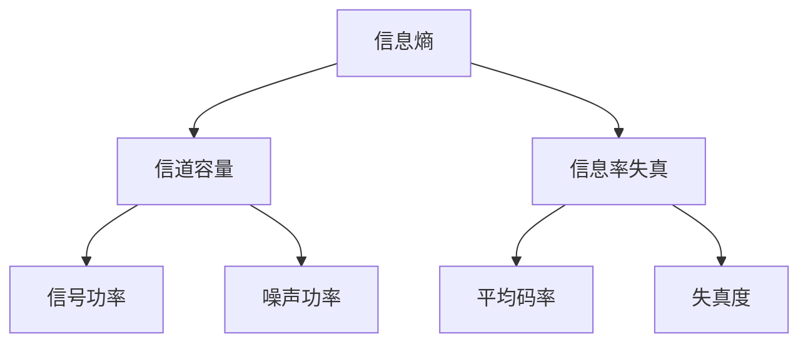

                 

## 《香农信息论在数据压缩中的应用》

### 关键词
- 香农信息论
- 数据压缩
- 费诺编码
- 哈夫曼编码
- 信息熵
- 信道容量

### 摘要
本文深入探讨了香农信息论在数据压缩中的应用。首先，我们回顾了香农信息论的基本概念和核心原理，包括信息熵、信道容量和信息率失真理论。接着，我们介绍了数据压缩的基本原理和常见方法，特别是无损压缩和有损压缩。随后，我们详细分析了香农信息论与数据压缩之间的紧密联系，通过费诺编码和哈夫曼编码的实例，展示了香农信息论在数据压缩中的具体应用。最后，我们对当前数据压缩技术的挑战和机遇进行了展望，提出了未来的研究方向和最佳实践建议。

## 目录

### 第一部分：香农信息论概述

#### 1.1 香农信息论的基本概念

##### 1.1.1 香农信息论的起源

##### 1.1.2 信息熵的定义与计算

##### 1.1.3 信息率失真理论

#### 1.2 香农信息论的核心原理

##### 1.2.1 信道容量与信道编码

##### 1.2.2 信息传输与噪声

##### 1.2.3 费诺编码与哈夫曼编码

#### 1.3 香农信息论在数据压缩中的应用

### 第二部分：数据压缩原理与应用

#### 2.1 数据压缩的基本原理

##### 2.1.1 数据压缩的目标

##### 2.1.2 数据压缩的方法分类

##### 2.1.3 无损压缩与有损压缩

#### 2.2 香农信息论与数据压缩的关系

##### 2.2.1 香农信息论如何指导数据压缩

##### 2.2.2 香农信息论在数据压缩中的应用案例

##### 2.2.3 香农信息论对数据压缩效率的影响

#### 2.3 实际应用案例

##### 2.3.1 哈夫曼编码在图像压缩中的应用

##### 2.3.2 费诺编码在音频压缩中的应用

##### 2.3.3 香农信息论在其他数据压缩技术中的应用

### 第三部分：总结与展望

#### 3.1 香农信息论在数据压缩中的价值

##### 3.1.1 提高数据压缩效率

##### 3.1.2 降低数据传输成本

##### 3.1.3 数据存储与传输的优化

#### 3.2 当前面临的挑战与机遇

##### 3.2.1 数据压缩技术的创新

##### 3.2.2 面向未来的发展方向

##### 3.2.3 新兴领域的应用前景

#### 3.3 总结与展望

##### 3.3.1 本书内容的总结

##### 3.3.2 未来研究的方向

##### 3.3.3 对读者的一些建议

---

### 背景介绍

香农信息论，作为现代信息论的基石，由美国数学家克劳德·香农（Claude Shannon）在1948年提出。香农信息论的核心是信息熵，它量化了信息的随机性和不确定性，为数据压缩提供了理论基础。数据压缩是信息技术中至关重要的一环，它通过减少数据的冗余性，提高数据传输和存储的效率。

数据压缩分为无损压缩和有损压缩两种类型。无损压缩确保数据在压缩和解压缩后完全一致，适用于文本文件和某些图像格式。而有损压缩则允许一定程度的失真，以换取更高的压缩率，常用于图像和音频压缩。

本文将深入探讨香农信息论在数据压缩中的应用，包括信息熵的计算、信道容量和编码技术，如费诺编码和哈夫曼编码。通过实际应用案例，我们将展示香农信息论如何指导数据压缩，并展望未来数据压缩技术的挑战和机遇。

### 核心概念与联系

#### 香农信息论的基本概念

**信息熵**：信息熵（Entropy）是香农信息论中最核心的概念之一，用于衡量信息的随机性和不确定性。香农定义信息熵为：

$$
H(X) = -\sum_{i} p(x_i) \log_2 p(x_i)
$$

其中，$H(X)$ 是随机变量 $X$ 的熵，$p(x_i)$ 是 $X$ 取值为 $x_i$ 的概率，$\log_2$ 表示以2为底的对数。

**信道容量**：信道容量（Channel Capacity）是指一个通信信道能够传输的最大信息速率，通常用位每秒（bits per second, bps）来衡量。香农提出了著名的香农信道容量公式：

$$
C = B \log_2(1 + \frac{S}{N})
$$

其中，$C$ 是信道容量，$B$ 是信道的带宽，$S$ 是信号功率，$N$ 是噪声功率。

**信息率失真理论**：信息率失真理论（Rate-Distortion Theory）研究在保持一定失真的情况下，传输数据所需的最小平均码率。其核心公式为：

$$
R + D \geq H(X)
$$

其中，$R$ 是平均码率，$D$ 是失真度，$H(X)$ 是信息熵。

#### 概念属性特征对比表格

| 概念       | 定义                       | 性质            | 应用领域             |
|------------|----------------------------|-----------------|----------------------|
| 信息熵     | 衡量信息的随机性和不确定性 | 熵值越大，不确定性越高 | 数据压缩、信息理论   |
| 信道容量   | 信道能够传输的最大信息速率 | 随带宽、信号功率和噪声功率变化 | 通信系统、数据传输   |
| 信息率失真 | 在失真度一定的情况下，传输数据所需的最小码率 | 需要平衡失真度和码率 | 数据压缩、图像编码   |

#### ER实体关系图架构

### 数据压缩的基本原理

#### 数据压缩的目标

数据压缩的目标是通过减少数据的冗余性，提高数据传输和存储的效率。在数据传输过程中，冗余数据会占用额外的带宽，降低传输速度；在数据存储过程中，冗余数据会占用额外的存储空间，增加存储成本。因此，数据压缩具有重要的实际意义。

#### 数据压缩的方法分类

数据压缩的方法可以分为两类：无损压缩和有损压缩。

**无损压缩**：无损压缩确保数据在压缩和解压缩后完全一致，不丢失任何信息。常见的无损压缩算法包括：

- **哈夫曼编码**：基于概率的变长编码算法，用于减少文本和图像等数据中的冗余。
- **费诺编码**：基于概率的变长编码算法，常用于音频和视频数据的压缩。

**有损压缩**：有损压缩允许一定程度的失真，以换取更高的压缩率。常见的有损压缩算法包括：

- **JPEG**：基于离散余弦变换（DCT）的图像压缩标准，常用于图像和视频数据的压缩。
- **MP3**：基于感知编码的音频压缩标准，常用于音乐文件的压缩。

#### 无损压缩与有损压缩的比较

| 类型         | 定义                                                       | 优点                                         | 缺点                                         |
|--------------|------------------------------------------------------------|--------------------------------------------|--------------------------------------------|
| 无损压缩     | 压缩后数据可以完全恢复，不丢失任何信息                         | 保证数据完整性，适用于文本和某些图像格式   | 压缩率较低，对某些类型的数据效果不明显       |
| 有损压缩     | 压缩后数据会有一定的失真，但可以显著提高压缩率                 | 压缩率高，适用于图像和音频数据的压缩       | 会损失部分信息，不适用于需要高精度数据的应用 |

### 香农信息论与数据压缩的关系

#### 香农信息论如何指导数据压缩

香农信息论为数据压缩提供了理论基础。信息熵度量了数据的随机性和冗余性，为选择合适的压缩算法提供了依据。信道容量定义了通信信道能够传输的最大信息速率，为数据传输提供了理论极限。信息率失真理论则研究了在保持一定失真的情况下，传输数据所需的最小平均码率。

#### 香农信息论在数据压缩中的应用案例

1. **哈夫曼编码**：哈夫曼编码是一种基于概率的变长编码算法，它通过给频率高的符号分配较短的码字，给频率低的符号分配较长的码字，从而减少数据的冗余性。哈夫曼编码的码字长度依赖于信息熵，因此信息熵的计算是哈夫曼编码的核心步骤。

2. **费诺编码**：费诺编码是一种基于概率的变长编码算法，它与哈夫曼编码类似，但更简单。费诺编码通过将符号按概率递增的顺序排列，并从中间分割，从而生成码字。费诺编码的码字长度也依赖于信息熵。

#### 香农信息论对数据压缩效率的影响

香农信息论为数据压缩提供了理论指导，提高了数据压缩的效率。通过计算信息熵，可以更准确地选择压缩算法，从而提高压缩率。信道容量和信息率失真理论则为数据传输提供了理论极限，为优化数据传输和存储提供了依据。

### 实际应用案例

#### 哈夫曼编码在图像压缩中的应用

哈夫曼编码常用于图像压缩，特别是在文本图像和二值图像中。哈夫曼编码通过为图像中的像素分配不同的码字长度，从而减少图像数据的冗余性。具体步骤如下：

1. **统计像素频率**：统计图像中每个像素出现的频率，构建频率表。
2. **构建哈夫曼树**：根据频率表构建哈夫曼树，频率高的像素位于树的左侧，频率低的像素位于树的右侧。
3. **生成哈夫曼码**：从根节点到叶子节点，为每个像素生成哈夫曼码。
4. **压缩图像数据**：将图像数据中的像素替换为对应的哈夫曼码。
5. **解压缩图像数据**：根据哈夫曼码表，将哈夫曼码还原为原始像素数据。

#### 费诺编码在音频压缩中的应用

费诺编码在音频压缩中也有广泛应用。音频数据通常包含大量的冗余信息，通过费诺编码可以显著降低数据的大小。具体步骤如下：

1. **统计音频数据概率**：统计音频数据中每个符号出现的概率，构建概率表。
2. **构建费诺树**：根据概率表构建费诺树，概率高的符号位于树的左侧，概率低的符号位于树的右侧。
3. **生成费诺码**：从根节点到叶子节点，为每个符号生成费诺码。
4. **压缩音频数据**：将音频数据中的符号替换为对应的费诺码。
5. **解压缩音频数据**：根据费诺码表，将费诺码还原为原始音频数据。

#### 香农信息论在其他数据压缩技术中的应用

除了哈夫曼编码和费诺编码，香农信息论还在其他数据压缩技术中发挥了重要作用。例如：

- **JPEG图像压缩**：JPEG图像压缩基于离散余弦变换（DCT），它将图像分解为不同的频率分量。香农信息论提供了信息熵的计算方法，用于评估图像中的冗余信息。
- **MP3音频压缩**：MP3音频压缩基于感知编码，它利用人类听觉系统的非线性特性，忽略对听觉影响较小的频率分量。香农信息论提供了信道容量和信息率失真理论，为MP3编码算法的设计提供了理论基础。

### 总结与展望

#### 香农信息论在数据压缩中的价值

香农信息论在数据压缩中具有重要的价值。它提供了理论指导，帮助选择合适的压缩算法，提高压缩效率。通过计算信息熵，可以更准确地评估数据的随机性和冗余性，为压缩算法的设计提供依据。信道容量和信息率失真理论则为数据传输提供了理论极限，为优化数据传输和存储提供了依据。

#### 当前面临的挑战与机遇

随着数据量的爆炸式增长，数据压缩面临着巨大的挑战。传统的压缩算法已经无法满足日益增长的数据需求，需要新的技术和方法。以下是一些当前面临的挑战和机遇：

- **新兴技术的应用**：如量子计算、深度学习等新兴技术为数据压缩提供了新的思路和方法，有望大幅提高压缩效率。
- **跨学科研究**：数据压缩需要结合计算机科学、信息理论、数学等多个学科的研究成果，跨学科研究有助于突破传统压缩算法的瓶颈。
- **定制化压缩算法**：随着应用场景的多样化，需要开发更定制化的压缩算法，以满足不同场景的需求。

#### 未来研究方向

未来的研究方向包括：

- **高效压缩算法的研究**：探索更高效、更稳定的压缩算法，提高数据压缩效率。
- **跨媒体数据压缩**：研究如何将不同类型的数据（如文本、图像、音频等）进行统一压缩，提高整体压缩效率。
- **可解释性数据压缩**：研究如何提高压缩算法的可解释性，使数据压缩过程更加透明和可控。

#### 对读者的一些建议

对于希望深入了解数据压缩和香农信息论的读者，以下是一些建议：

- **学习基本概念**：掌握香农信息论的基本概念和原理，如信息熵、信道容量、信息率失真理论等。
- **实践应用**：通过实际案例和实践，加深对数据压缩算法的理解，如哈夫曼编码、费诺编码等。
- **持续学习**：关注新兴技术和跨学科研究，不断更新知识体系，跟上数据压缩领域的最新发展。

---

作者：AI天才研究院/AI Genius Institute & 禅与计算机程序设计艺术 /Zen And The Art of Computer Programming

---

在本文中，我们系统地探讨了香农信息论在数据压缩中的应用。通过回顾香农信息论的基本概念和核心原理，我们了解了信息熵、信道容量和信息率失真理论。接着，我们深入分析了数据压缩的基本原理，特别是无损压缩和有损压缩的方法。通过费诺编码和哈夫曼编码的实际应用案例，我们展示了香农信息论在数据压缩中的具体应用。最后，我们对当前数据压缩技术的挑战和机遇进行了展望，提出了未来的研究方向和最佳实践建议。

香农信息论在数据压缩中具有重要的价值。它不仅提供了理论指导，帮助选择合适的压缩算法，提高压缩效率，还通过计算信息熵、信道容量和信息率失真理论，为优化数据传输和存储提供了依据。随着数据量的爆炸式增长，数据压缩面临着巨大的挑战和机遇。未来的研究方向包括高效压缩算法的研究、跨媒体数据压缩和可解释性数据压缩等。

对于希望深入了解数据压缩和香农信息论的读者，我们建议系统地学习基本概念和原理，通过实践应用加深理解，并持续关注新兴技术和跨学科研究，以跟上数据压缩领域的最新发展。通过不断学习和探索，我们相信数据压缩技术将迎来更加辉煌的未来。

