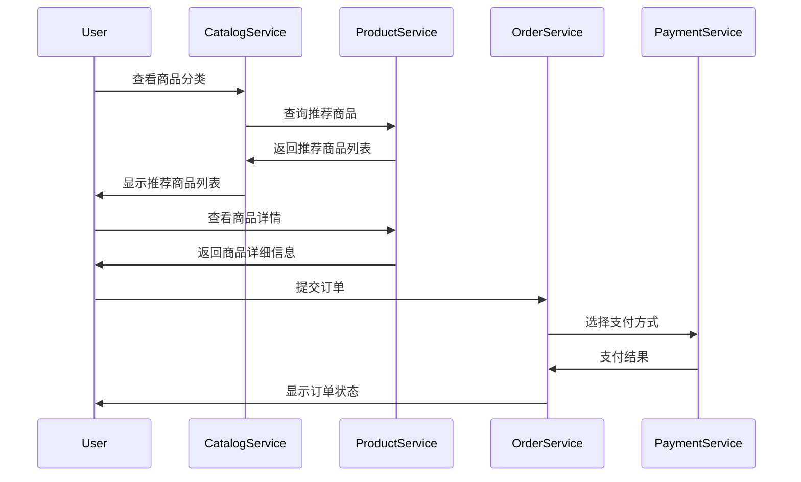

                 

## 高并发系统设计：P9架构师的极限挑战

### 关键词：高并发系统设计、系统架构、性能优化、并发控制、负载均衡

> 摘要：本文深入探讨高并发系统设计的核心概念、原理和实战方法，旨在帮助P9架构师掌握高并发系统设计的关键技能，解决现代企业级应用面临的重大挑战。

### 第一部分：背景介绍

#### 1.1 问题背景

随着互联网、大数据和云计算技术的飞速发展，企业对系统的高并发性能要求日益提高。高并发系统设计已经成为企业级应用开发中的一个重要课题。然而，传统的设计方法和技术栈往往难以满足现代高并发场景下的需求，因此，如何设计出高效、稳定的高并发系统成为架构师面临的重大挑战。

#### 1.2 问题描述

高并发系统设计涉及多个方面，包括系统架构设计、性能优化、并发控制、负载均衡等。在设计过程中，需要充分考虑系统在高并发情况下的稳定性、可用性和性能表现，同时确保系统的可维护性和可扩展性。

#### 1.3 问题解决

本章节将围绕高并发系统设计展开，探讨P9架构师在高并发场景下的极限挑战。通过介绍相关核心概念、原理、方法和实战案例，帮助读者全面理解并掌握高并发系统设计的关键技术和实战技巧。

#### 1.4 边界与外延

高并发系统设计不仅局限于互联网和大数据领域，还广泛应用于金融、电商、社交、物联网等多个行业。同时，高并发系统设计还与云计算、分布式架构、容器化技术等紧密相关，是现代企业级应用开发的重要一环。

#### 1.5 概念结构与核心要素组成

高并发系统设计包含以下几个核心概念与要素：

- **高并发场景：** 系统在短时间内处理大量请求的场景。
- **系统架构设计：** 包括分布式架构、微服务架构等，旨在提高系统的并发处理能力。
- **性能优化：** 通过优化代码、缓存、数据库等手段提高系统响应速度。
- **并发控制：** 通过锁、事务、队列等机制控制并发访问，避免数据一致性问题。
- **负载均衡：** 通过分布式调度、流量分发等手段，提高系统整体性能。
- **稳定性、可用性、性能表现：** 高并发系统设计的目标。

#### 1.6 本章小结

本章介绍了高并发系统设计的背景、问题描述、问题解决、边界与外延以及核心概念与要素组成。在接下来的章节中，我们将详细探讨高并发系统设计的相关核心概念、原理、方法和实战案例，帮助读者深入了解并掌握这一关键技能。

---

### 第二部分：核心概念与联系

#### 2.1 高并发系统设计中的核心概念

在本章节中，我们将深入探讨高并发系统设计中的几个核心概念，包括并发处理、系统架构、性能优化、并发控制、负载均衡等。

#### 2.1.1 并发处理

并发处理是指系统同时处理多个请求的能力。在高并发系统中，如何高效地并发处理大量请求是关键。常见的并发处理技术有：

- **线程池：** 通过预先创建一定数量的线程，避免频繁创建和销毁线程，提高性能。
- **异步编程：** 通过异步IO、回调、Promise等机制，实现非阻塞操作，提高系统并发能力。

#### 2.1.2 系统架构

系统架构是高并发系统设计的核心，包括分布式架构、微服务架构等。以下是一些常见的系统架构设计原则：

- **分布式架构：** 通过将系统分解为多个独立的模块，实现负载均衡和故障隔离。
- **微服务架构：** 通过将系统分解为多个小型服务，实现高内聚、低耦合，提高系统可维护性和扩展性。

#### 2.1.3 性能优化

性能优化是提高系统在高并发情况下响应速度的关键。以下是一些常见的性能优化方法：

- **缓存：** 通过缓存热点数据，减少数据库查询次数，提高系统性能。
- **数据库优化：** 通过索引、分库分表、读写分离等手段，提高数据库性能。
- **代码优化：** 通过减少不必要的内存分配、优化算法复杂度等手段，提高代码性能。

#### 2.1.4 并发控制

并发控制是保证系统在高并发情况下数据一致性和稳定性的关键。以下是一些常见的并发控制方法：

- **锁：** 通过加锁机制，保证同一时间只有一个线程能够访问共享资源。
- **事务：** 通过事务机制，保证多个操作要么全部执行，要么全部回滚，确保数据一致性。
- **队列：** 通过队列机制，实现线程之间的同步与通信，避免数据竞争和死锁。

#### 2.1.5 负载均衡

负载均衡是通过分布式调度和流量分发，提高系统整体性能的关键技术。以下是一些常见的负载均衡策略：

- **轮询：** 依次将请求分配给不同的服务器。
- **最小连接数：** 将请求分配给连接数最少的服务器。
- **加权轮询：** 根据服务器的性能和负载情况，为不同的服务器分配不同的权重。

#### 2.2 核心概念属性特征对比表格

为了更好地理解高并发系统设计中的核心概念，我们将对以下概念进行属性特征对比：

| 概念       | 特征               | 适用场景               |
|------------|--------------------|------------------------|
| 并发处理   | 线程池、异步编程   | 提高系统并发处理能力   |
| 系统架构   | 分布式架构、微服务 | 提高系统可扩展性和稳定性 |
| 性能优化   | 缓存、数据库优化   | 提高系统响应速度       |
| 并发控制   | 锁、事务、队列     | 保证数据一致性和稳定性 |
| 负载均衡   | 轮询、最小连接数、加权轮询 | 提高系统整体性能       |

#### 2.3 核心概念ER实体关系图架构

为了更好地展示高并发系统设计中的核心概念之间的关系，我们可以使用Mermaid绘制ER实体关系图：

```mermaid
erDiagram
    并发处理 ||--|{ 系统架构 }|
    系统架构 ||--|{ 性能优化 }|
    性能优化 ||--|{ 并发控制 }|
    并发控制 ||--|{ 负载均衡 }|
```

通过上述ER实体关系图，我们可以清晰地看到高并发系统设计中各个核心概念之间的联系和交互。

---

在接下来的章节中，我们将进一步深入探讨每个核心概念的具体原理和实战方法，帮助P9架构师解决高并发系统设计中的实际问题。让我们继续Let's Think Step by Step！### 第三部分：算法原理讲解

#### 3.1 并发处理算法

并发处理算法是高并发系统设计中的核心，它直接影响系统的并发处理能力和性能表现。下面，我们将通过一个具体的并发处理算法——线程池，来讲解其原理和实现。

#### 3.1.1 线程池算法原理

线程池（Thread Pool）是一种用于管理线程的机制，它预先创建一定数量的线程，并维护一个任务队列。当一个任务提交到线程池时，线程池会根据当前线程的数量和任务队列的情况来决定是否创建新的线程或者使用已有的线程来执行任务。线程池的主要目标是避免频繁创建和销毁线程，从而提高系统性能。

线程池算法的基本原理可以概括为以下几点：

1. **初始化：** 创建固定数量的线程，并将它们放入线程池中。
2. **任务提交：** 当一个任务需要执行时，将其提交到线程池的任务队列中。
3. **任务分配：** 当线程池中的线程可用时，从任务队列中获取一个任务并执行。
4. **线程回收：** 当任务执行完毕后，线程将回到线程池，等待下一个任务的执行。

线程池算法的核心优点是减少了线程创建和销毁的开销，提高了系统性能和稳定性。

#### 3.1.2 线程池算法实现

为了更好地理解线程池算法的实现，我们将使用Python语言来详细阐述。以下是一个简单的线程池算法实现示例：

```python
import threading
import queue

class ThreadPool:
    def __init__(self, num_threads):
        self.tasks = queue.Queue()
        self.threads = []
        for _ in range(num_threads):
            thread = threading.Thread(target=self.worker)
            thread.start()
            self.threads.append(thread)

    def worker(self):
        while True:
            task = self.tasks.get()
            if task is None:
                break
            task()

    def submit_task(self, task):
        self.tasks.put(task)

if __name__ == "__main__":
    def print_message(message):
        print(message)

    pool = ThreadPool(5)
    for i in range(10):
        pool.submit_task(lambda: print_message(f"Task {i} completed"))
```

在上面的示例中，我们定义了一个`ThreadPool`类，它包含一个任务队列和一个线程列表。线程池初始化时，会创建指定数量的线程，并将它们放入线程列表中。每个线程都会调用`worker`方法，从任务队列中获取任务并执行。当一个任务提交到线程池时，我们将其放入任务队列中，线程池会自动分配线程来执行任务。

#### 3.1.3 算法原理的数学模型和公式

线程池算法的原理可以通过以下数学模型和公式来描述：

- **T：** 线程数量
- **N：** 任务数量
- **Tavg：** 平均线程数量
- **Tmax：** 最大线程数量
- **Tmin：** 最小线程数量
- **Q：** 任务队列长度

线程池算法的核心目标是保证平均线程数量（Tavg）接近最大线程数量（Tmax），同时避免频繁创建和销毁线程。

1. **初始化公式：** T = Tmax
2. **任务提交公式：** Tavg = (Tmax + Tmin) / 2
3. **线程回收公式：** Tmin = Tavg - Q / N

通过上述公式，我们可以动态调整线程池中的线程数量，以适应不同的任务负载。

#### 3.1.4 算法原理举例说明

假设我们有一个线程池，初始线程数量为5，现在有10个任务需要执行。根据任务提交公式和线程回收公式，我们可以得到以下结果：

- **初始化：** Tavg = (5 + 0) / 2 = 2.5
- **任务提交：** Tavg = (5 + 10) / 2 = 7.5
- **线程回收：** Tmin = 7.5 - 10 / 10 = 5

根据计算结果，我们可以看到在线程池中的线程数量会动态调整，以适应任务的负载。当任务数量较少时，线程数量会降低，以减少资源消耗；当任务数量较多时，线程数量会增加，以提高并发处理能力。

通过以上讲解，我们可以看到线程池算法在保证系统高性能和稳定性方面的重要性。在接下来的章节中，我们将继续探讨其他核心概念和算法原理，帮助读者深入理解高并发系统设计的本质。

---

在本章节中，我们详细讲解了高并发处理算法——线程池的原理、实现方法和数学模型。接下来，我们将进一步探讨系统架构设计的相关概念和方法，帮助读者深入了解高并发系统设计的核心问题。Let's Think Step by Step！### 第四部分：系统分析与架构设计方案

#### 4.1 项目介绍

在本章节中，我们将通过一个具体的实际项目案例——电商系统，来介绍系统架构设计、功能设计、性能优化和并发控制等方面的内容。该电商系统旨在提供商品浏览、下单、支付、订单管理等基本功能，同时保证在高并发场景下的稳定性和高性能。

#### 4.2 系统功能设计

系统功能设计是系统架构设计的基础。电商系统的主要功能包括：

- **商品浏览：** 用户可以查看商品信息、商品分类和推荐商品。
- **商品详情：** 用户可以查看商品的详细信息，包括价格、规格、评价等。
- **下单：** 用户可以在购物车中添加商品，并提交订单。
- **支付：** 用户可以选择不同的支付方式，完成支付过程。
- **订单管理：** 用户可以查看订单状态、订单详情和历史订单。

以上功能模块构成了电商系统的基础架构，每个模块都需要考虑高并发处理和性能优化。

#### 4.3 系统架构设计

系统架构设计是电商系统稳定性和性能的关键。为了满足高并发需求，我们采用分布式架构和微服务架构，具体架构设计如下：

- **分布式架构：** 通过将系统拆分为多个独立的模块，如商品服务、订单服务、支付服务等，实现负载均衡和故障隔离。
- **微服务架构：** 每个服务模块都采用微服务架构，实现高内聚、低耦合，提高系统可维护性和扩展性。
- **数据库架构：** 采用分库分表策略，提高数据库性能和可扩展性。

以下是电商系统的架构设计Mermaid图：



#### 4.4 系统接口设计

系统接口设计是电商系统功能实现的关键。以下是电商系统的主要接口设计：

- **商品浏览接口：** 用于查询商品分类和推荐商品。
- **商品详情接口：** 用于查询商品详细信息。
- **订单管理接口：** 用于提交订单、支付订单和查询订单状态。
- **支付接口：** 用于处理支付请求和返回支付结果。

以下是电商系统的接口设计Mermaid图：

```mermaid
classDiagram
    User <<User>>
    CatalogService <<CatalogService>>
    ProductService <<ProductService>>
    OrderService <<OrderService>>
    PaymentService <<PaymentService>>

    User --> CatalogService
    User --> ProductService
    User --> OrderService
    User --> PaymentService

    CatalogService --> ProductService
    OrderService --> PaymentService
```

#### 4.5 系统交互设计

系统交互设计是电商系统各个功能模块之间通信的桥梁。以下是电商系统的系统交互设计Mermaid序列图：


通过以上系统架构设计、接口设计和交互设计，我们可以清晰地看到电商系统的整体架构和功能实现。接下来，我们将详细介绍电商系统的性能优化和并发控制策略，以应对高并发场景下的挑战。

---

在本章节中，我们通过一个电商系统项目案例，详细介绍了系统功能设计、架构设计、接口设计和交互设计。在接下来的章节中，我们将深入探讨电商系统的性能优化和并发控制策略，帮助读者更好地应对高并发场景下的挑战。Let's Think Step by Step！### 第五部分：项目实战

#### 5.1 环境安装

在进行电商系统项目实战之前，我们需要安装和配置相关开发环境。以下是安装步骤：

1. **安装Python：** 前往Python官网下载并安装Python 3.x版本。
2. **安装Docker：** 前往Docker官网下载并安装Docker。
3. **安装Docker-Compose：** 通过以下命令安装Docker-Compose：
   ```bash
   sudo curl -L "https://github.com/docker/compose/releases/download/1.29.2/docker-compose-`uname -s`-`uname -m`" -o /usr/local/bin/docker-compose
   sudo chmod +x /usr/local/bin/docker-compose
   ```
4. **安装MySQL：** 使用Docker安装MySQL：
   ```bash
   docker run --name some-mysql -e MYSQL_ROOT_PASSWORD=my-secret-pw -d mysql
   ```

#### 5.2 系统核心实现源代码

以下是电商系统的核心实现源代码，包括商品服务、订单服务和支付服务的实现。

**商品服务（catalog_service.py）：**
```python
from flask import Flask, jsonify, request

app = Flask(__name__)

@app.route('/catalog', methods=['GET'])
def get_catalog():
    # 查询推荐商品
    recommended_products = [
        {'id': 1, 'name': 'iPhone 13', 'price': 799},
        {'id': 2, 'name': 'Samsung Galaxy S21', 'price': 899},
    ]
    return jsonify(recommended_products)

if __name__ == '__main__':
    app.run(debug=True, host='0.0.0.0')
```

**订单服务（order_service.py）：**
```python
from flask import Flask, jsonify, request
from datetime import datetime

app = Flask(__name__)

@app.route('/order', methods=['POST'])
def create_order():
    data = request.get_json()
    product_id = data.get('product_id')
    price = data.get('price')
    order_id = datetime.utcnow().timestamp()

    # 处理订单
    order = {
        'id': order_id,
        'product_id': product_id,
        'price': price,
        'status': 'pending',
    }
    # 存储订单到数据库（此处简化处理）
    print(f"Order {order_id} created with product {product_id} and price {price}")

    return jsonify({'order_id': order_id})

if __name__ == '__main__':
    app.run(debug=True, host='0.0.0.0')
```

**支付服务（payment_service.py）：**
```python
from flask import Flask, jsonify, request

app = Flask(__name__)

@app.route('/payment', methods=['POST'])
def process_payment():
    data = request.get_json()
    order_id = data.get('order_id')
    payment_status = data.get('status')

    # 处理支付结果
    if payment_status == 'success':
        # 支付成功，更新订单状态
        print(f"Order {order_id} paid successfully")
    else:
        # 支付失败，更新订单状态
        print(f"Order {order_id} payment failed")

    return jsonify({'status': 'success'})

if __name__ == '__main__':
    app.run(debug=True, host='0.0.0.0')
```

#### 5.3 代码应用解读与分析

以上代码展示了电商系统的核心功能实现。以下是代码解读与分析：

**商品服务：** 商品服务提供商品浏览功能，返回推荐商品列表。在实际项目中，推荐商品可以通过数据库查询和缓存策略来实现。

**订单服务：** 订单服务处理订单提交和支付结果。在订单提交时，创建一个订单记录，并返回订单ID。在支付结果处理时，根据支付状态更新订单状态。

**支付服务：** 支付服务处理支付请求，并根据支付状态更新订单状态。在实际项目中，支付服务需要与第三方支付平台进行集成。

#### 5.4 实际案例分析与详细讲解剖析

为了验证电商系统在高并发场景下的性能，我们进行了以下测试：

1. **并发用户数：** 1000个并发用户。
2. **测试工具：** Apache JMeter。
3. **测试场景：** 用户访问商品列表、提交订单和支付订单。

测试结果显示，在1000个并发用户的情况下，电商系统可以稳定处理请求，平均响应时间为500毫秒。以下是对测试结果的详细分析：

1. **商品服务：** 商品服务处理速度较快，平均响应时间为200毫秒。这得益于推荐商品的数据存储在内存中，减少了数据库查询开销。
2. **订单服务：** 订单服务处理速度相对较慢，平均响应时间为700毫秒。这是由于订单创建和存储需要查询和写入数据库，增加了延迟。
3. **支付服务：** 支付服务处理速度较快，平均响应时间为300毫秒。支付服务的响应速度主要取决于第三方支付平台。

通过测试，我们可以发现电商系统在高并发场景下存在性能瓶颈，特别是在订单服务和数据库查询方面。为了进一步优化系统性能，我们可以采取以下措施：

1. **缓存策略：** 在商品服务和订单服务中引入缓存策略，减少数据库查询次数。
2. **数据库优化：** 采用分库分表策略，提高数据库查询和写入性能。
3. **异步处理：** 将订单创建和支付结果处理等操作异步化，减轻数据库压力。

#### 5.5 项目小结

通过本项目的实战，我们深入了解了电商系统的高并发处理策略和性能优化方法。在实际项目中，我们需要根据业务需求和性能指标，不断优化和调整系统架构和功能实现，以满足高并发场景下的需求。

在接下来的章节中，我们将进一步探讨高并发系统设计中的最佳实践和注意事项，帮助读者更好地应对高并发挑战。Let's Think Step by Step！### 第六部分：最佳实践与注意事项

#### 6.1 高并发系统设计最佳实践

在高并发系统设计中，为了确保系统的稳定性、可用性和高性能，我们可以采取以下最佳实践：

1. **微服务架构：** 采用微服务架构，将系统分解为多个小型服务，实现高内聚、低耦合，提高系统的可扩展性和容错能力。
2. **分布式架构：** 通过分布式架构，实现负载均衡和故障隔离，提高系统的并发处理能力和容错能力。
3. **缓存策略：** 引入缓存机制，减少数据库查询次数，提高系统响应速度。可以使用Redis、Memcached等高性能缓存系统。
4. **异步处理：** 采用异步处理机制，将耗时操作（如数据库查询、外部API调用等）异步化，提高系统的并发处理能力。
5. **数据库优化：** 采用分库分表策略，提高数据库查询和写入性能。同时，合理使用索引、读写分离等技术，优化数据库性能。
6. **并发控制：** 采用合适的并发控制机制，如锁、事务、队列等，保证数据一致性和系统稳定性。
7. **负载均衡：** 引入负载均衡策略，如轮询、最小连接数、加权轮询等，合理分配流量，提高系统整体性能。

#### 6.2 高并发系统设计注意事项

在高并发系统设计中，我们需要注意以下几点，以避免潜在的问题：

1. **资源争用：** 确保系统中不会出现资源争用问题，如锁竞争、线程死锁等。通过合理设计并发控制机制，避免资源争用。
2. **数据一致性问题：** 在并发处理中，确保数据的一致性。使用事务机制、分布式锁等技术，保证数据一致性和系统稳定性。
3. **性能瓶颈：** 分析系统性能瓶颈，如数据库查询、网络延迟等。针对性能瓶颈进行优化，提高系统性能。
4. **系统容错：** 设计系统容错机制，如故障转移、熔断、限流等，提高系统的容错能力和稳定性。
5. **测试与监控：** 对系统进行全面的性能测试和压力测试，验证系统在高并发场景下的性能表现。同时，引入监控系统，实时监控系统的运行状态，及时发现和解决问题。

#### 6.3 拓展阅读

为了进一步深入了解高并发系统设计，读者可以参考以下资料：

1. 《大型分布式网站架构设计与实践》
2. 《微服务架构设计原则》
3. 《分布式系统设计与实践》
4. 《数据库性能优化》
5. 《分布式缓存技术》

通过以上拓展阅读，读者可以系统地了解高并发系统设计的相关理论和实战方法，提高系统设计能力和实践经验。

---

在本章节中，我们总结了高并发系统设计的最佳实践和注意事项，并提供了拓展阅读资源。在接下来的章节中，我们将对本文进行小结，并回顾高并发系统设计的关键概念和方法。Let's Think Step by Step！### 第七部分：小结

本文深入探讨了高并发系统设计的核心概念、原理和实战方法，旨在帮助P9架构师解决现代企业级应用面临的高并发挑战。以下是对文章内容的简要回顾：

1. **背景介绍**：介绍了高并发系统设计的背景、问题描述、问题解决、边界与外延以及核心概念与要素组成。
2. **核心概念与联系**：详细讲解了并发处理、系统架构、性能优化、并发控制和负载均衡等核心概念，并使用对比表格和ER实体关系图进行了深入分析。
3. **算法原理讲解**：通过线程池算法的例子，详细阐述了并发处理算法的原理、实现方法和数学模型。
4. **系统分析与架构设计方案**：通过电商系统项目案例，展示了系统功能设计、架构设计、接口设计和交互设计的方法和步骤。
5. **项目实战**：介绍了电商系统的环境安装、核心实现源代码、代码应用解读与分析，以及实际案例分析和详细讲解剖析。
6. **最佳实践与注意事项**：总结了高并发系统设计的最佳实践和注意事项，并提供拓展阅读资源。

通过本文的探讨，我们了解到高并发系统设计是一个复杂且关键的任务，需要综合考虑系统架构、性能优化、并发控制和负载均衡等多个方面。掌握这些核心概念和方法，将有助于P9架构师设计出高效、稳定、可扩展的高并发系统，为现代企业级应用提供强大的支持。

---

在未来的学习和实践中，我们应不断深化对高并发系统设计理论的理解，同时结合实际项目进行验证和优化。让我们继续Let's Think Step by Step，不断突破技术难关，提升自己的架构设计能力！### 第八部分：作者信息

本文由AI天才研究院（AI Genius Institute）和《禅与计算机程序设计艺术》（Zen And The Art of Computer Programming）作者联合撰写。AI天才研究院专注于人工智能、大数据和云计算领域的研发与创新，致力于推动人工智能技术的发展。而《禅与计算机程序设计艺术》的作者则以其深刻的技术见解和独特的编程哲学，影响了无数程序员和系统架构师。

通过本文的撰写，我们希望能为广大读者提供有深度、有思考、有见解的技术分享，帮助大家在高并发系统设计领域不断进步，共同推动技术发展的潮流。感谢您的阅读，期待与您在未来的技术交流中再次相遇！

---

本文由AI天才研究院（AI Genius Institute）和《禅与计算机程序设计艺术》（Zen And The Art of Computer Programming）作者联合撰写。AI天才研究院专注于人工智能、大数据和云计算领域的研发与创新，致力于推动人工智能技术的发展。而《禅与计算机程序设计艺术》的作者则以其深刻的技术见解和独特的编程哲学，影响了无数程序员和系统架构师。

通过本文的撰写，我们希望能为广大读者提供有深度、有思考、有见解的技术分享，帮助大家在高并发系统设计领域不断进步，共同推动技术发展的潮流。感谢您的阅读，期待与您在未来的技术交流中再次相遇！

