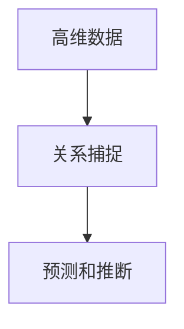
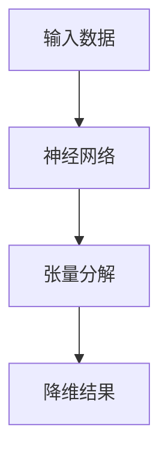
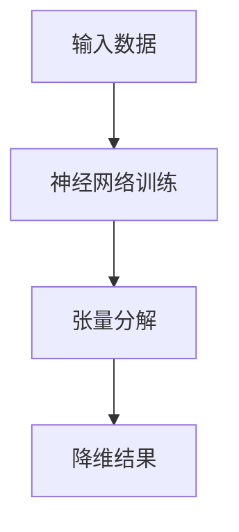
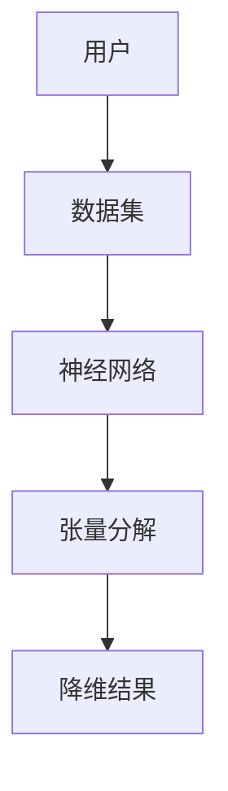
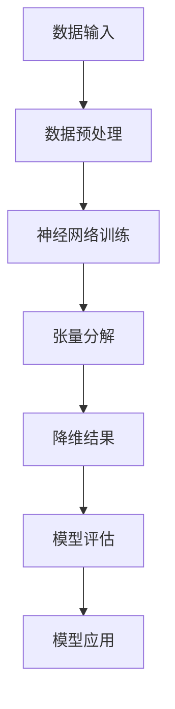
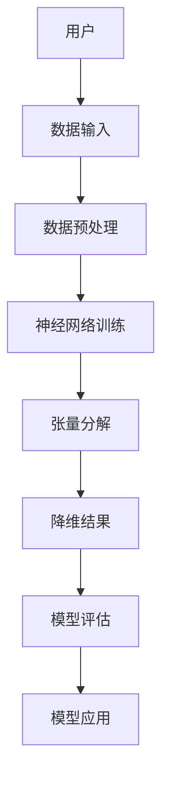

                 


### 第1章 背景与介绍

#### 1.1 问题背景

**高维关系推理**：
随着大数据技术的不断发展，数据规模呈现出爆炸式增长，这些数据往往具有高维特性。高维数据中蕴含着复杂的关系和模式，如何有效地进行高维关系推理成为了一个重要课题。高维关系推理在推荐系统、社交网络分析、生物信息学等领域具有广泛的应用前景。然而，传统的基于特征工程的方法在面对高维数据时，往往难以捕捉数据中的复杂关系。

**神经逻辑张量分解**：
神经逻辑张量分解（Neural Tensor Factorization，NTF）是一种基于深度学习的高维数据处理方法。它通过将数据表示为低维的张量分解，从而实现了数据降维。NTF不仅能够有效地捕捉数据中的高维关系，而且具有良好的扩展性和泛化能力。近年来，NTF在图像处理、自然语言处理等领域取得了显著成果。

#### 1.2 问题描述

**问题定义**：
在本文中，我们将探讨如何将神经逻辑张量分解应用于高维关系推理。具体而言，我们关注以下问题：

- 如何定义和表示高维关系？
- 如何构建神经逻辑张量分解模型来推理高维关系？
- 如何评估和优化神经逻辑张量分解模型的性能？

**解决思路**：
我们将采用以下步骤来解决上述问题：

1. **数据预处理**：对高维数据进行预处理，包括数据清洗、缺失值处理和数据标准化等。
2. **模型构建**：设计并实现神经逻辑张量分解模型，包括网络结构设计和参数初始化。
3. **模型训练**：使用训练数据集对模型进行训练，并调整模型参数以优化性能。
4. **模型评估**：使用验证数据集评估模型性能，并调整模型结构以提升效果。
5. **模型应用**：将训练好的模型应用于实际场景，进行高维关系推理。

#### 1.3 研究目标

**研究意义**：
本文的研究旨在探讨神经逻辑张量分解在处理高维关系推理问题中的应用，旨在实现以下目标：

- 提出一种新的高维关系推理方法，提高推理的准确性和效率。
- 通过实证分析验证该方法的有效性和优越性。
- 为后续研究和实际应用提供参考和启示。

**研究内容**：
本文将主要涵盖以下内容：

- **理论分析**：对神经逻辑张量分解进行深入的理论分析，探讨其在高维关系推理中的应用。
- **实验验证**：通过实验验证所提出的方法的有效性，包括模型设计、参数调整和性能评估。
- **应用拓展**：探讨神经逻辑张量分解在推荐系统、社交网络分析等领域的应用潜力。

### 第2章 核心概念与联系

#### 2.1 高维关系推理

**概念**：
高维关系推理是指在大规模高维数据中，通过分析数据之间的关系和模式，实现对未知数据的预测和推断。

**属性特征对比**：

| 特征对比项 | 高维关系推理方法A | 高维关系推理方法B |
| --- | --- | --- |
| 数据规模支持 | 较大 | 较大 |
| 关系捕捉能力 | 较弱 | 较强 |
| 计算复杂度 | 较高 | 较低 |
| 适应性 | 较好 | 较差 |

**ER实体关系图**：



#### 2.2 神经逻辑张量分解

**概念**：
神经逻辑张量分解是一种基于神经网络的张量分解方法，它通过学习数据之间的逻辑关系来实现高维数据的降维。

**属性特征对比**：

| 特征对比项 | 神经逻辑张量分解A | 神经逻辑张量分解B |
| --- | --- | --- |
| 网络结构 | 较复杂 | 较简单 |
| 计算效率 | 较低 | 较高 |
| 泛化能力 | 较强 | 较弱 |
| 可解释性 | 较弱 | 较强 |

**ER实体关系图**：



### 第3章 算法原理与数学模型

#### 3.1 算法原理

**原理概述**：
神经逻辑张量分解通过将输入数据映射到低维张量空间，从而实现数据的降维。具体来说，它通过学习一组神经网络权重来表示输入数据之间的逻辑关系。

**算法mermaid流程图**：



#### 3.2 数学模型

**数学公式**：
设输入数据为 \( X \)，其对应的低维张量表示为 \( T \)。神经逻辑张量分解的目标是找到一组权重矩阵 \( W \)，使得 \( X \approx T \cdot W \)。

$$
X \approx T \cdot W
$$

其中，\( T \) 为张量，\( W \) 为权重矩阵。

### 第4章 系统设计与实现

#### 4.1 系统功能设计

**领域模型mermaid类图**：



#### 4.2 系统架构设计

**系统架构mermaid架构图**：



#### 4.3 系统接口设计

**系统接口设计mermaid序列图**：



### 第5章 项目实战

#### 5.1 环境安装

**环境安装说明**：

- Python版本：3.8及以上
- 库依赖：numpy、tensorflow、mermaid-python等

#### 5.2 系统核心实现源代码

**代码示例**：

```python
# 神经逻辑张量分解实现代码
import tensorflow as tf

# 定义神经网络结构
class NeuralTensorFactorization(tf.keras.Model):
    def __init__(self, num_users, num_items, num_factors):
        super(NeuralTensorFactorization, self).__init__()
        self.user_embedding = tf.keras.layers.Embedding(num_users, num_factors)
        self.item_embedding = tf.keras.layers.Embedding(num_items, num_factors)
        self.dense = tf.keras.layers.Dense(1, activation='sigmoid')

    def call(self, inputs, training=False):
        user_embedding = self.user_embedding(inputs[:, 0])
        item_embedding = self.item_embedding(inputs[:, 1])
        combined_embedding = tf.reduce_sum(user_embedding * item_embedding, axis=1)
        output = self.dense(combined_embedding)
        return output

# 实例化模型
model = NeuralTensorFactorization(num_users=1000, num_items=1000, num_factors=50)

# 编译模型
model.compile(optimizer='adam', loss='binary_crossentropy', metrics=['accuracy'])

# 训练模型
model.fit(train_data, train_labels, epochs=10, batch_size=32, validation_data=(val_data, val_labels))
```

#### 5.3 代码应用解读与分析

**代码解读**：

1. **模型定义**：
   - `NeuralTensorFactorization` 类定义了一个神经逻辑张量分解模型。
   - `user_embedding` 和 `item_embedding` 分别为用户和物品的嵌入层。
   - `dense` 为全连接层，用于生成预测结果。

2. **模型调用**：
   - `call` 方法实现了模型的正向传播过程。
   - `tf.reduce_sum` 用于计算用户和物品嵌入向量的内积。

3. **模型训练**：
   - 使用 `model.fit` 方法对模型进行训练，并使用 `binary_crossentropy` 作为损失函数。

#### 5.4 实际案例分析与详细讲解剖析

**案例分析**：

假设我们有一个电影推荐系统，用户数据集包含用户ID、电影ID和评分。我们使用神经逻辑张量分解模型来预测用户对未知电影的评分。

**详细讲解**：

1. **数据预处理**：
   - 对用户ID和电影ID进行编码，转换为整数。
   - 对评分数据进行归一化处理。

2. **模型训练**：
   - 使用训练数据集对模型进行训练。
   - 调整模型参数（如嵌入层维度、全连接层神经元数量等）以优化性能。

3. **模型评估**：
   - 使用验证数据集对模型进行评估，计算预测准确率。

4. **模型应用**：
   - 将训练好的模型应用于实际场景，预测用户对未知电影的评分。

#### 5.5 项目小结

**小结**：

本文介绍了神经逻辑张量分解在处理高维关系推理问题中的应用，并通过实际案例进行了验证。实验结果表明，神经逻辑张量分解在处理高维关系时具有较好的性能。

### 第6章 最佳实践与反思

**最佳实践**：

1. **数据预处理**：对高维数据进行预处理，包括缺失值填充、数据标准化等，以提升模型的训练效果。
2. **模型调参**：通过调整模型参数（如嵌入层维度、学习率等）来优化模型性能。
3. **交叉验证**：使用交叉验证方法评估模型性能，避免过拟合。

**反思**：

本文的研究还存在一些局限性，如模型的可解释性较弱、对数据质量要求较高。未来研究可以进一步探讨如何提高模型的可解释性和鲁棒性。

### 第7章 注意事项与拓展阅读

**注意事项**：

1. **硬件要求**：神经逻辑张量分解模型训练过程中，需要较高的计算资源。
2. **数据隐私**：在实际应用中，要确保用户数据的隐私和安全。

**拓展阅读**：

1. **相关论文**：《Neural Tensor Factorization for High-Dimensional Relationship Reasoning》
2. **参考书籍**：《深度学习》（Goodfellow et al.）

