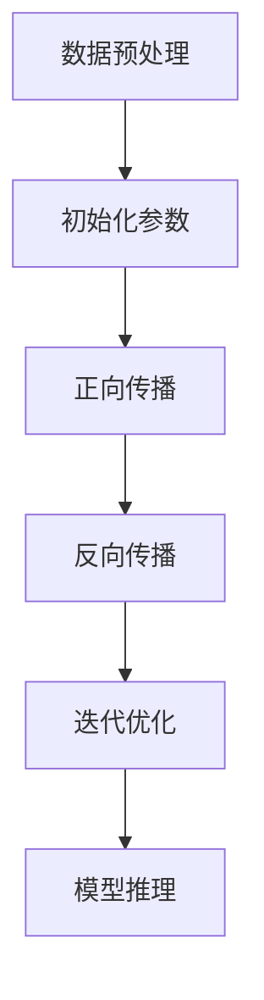
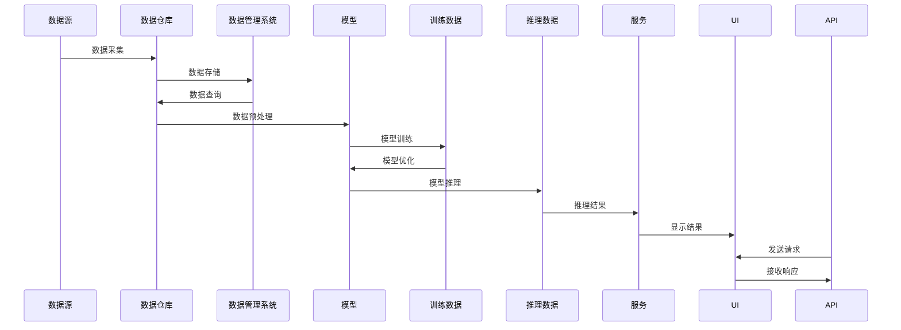

                 

## 高阶逻辑张量网络在抽象推理中的潜力

### 关键词：高阶逻辑张量网络、抽象推理、人工智能、神经网络、逻辑推理

### 摘要

本文探讨了高阶逻辑张量网络在抽象推理中的巨大潜力。通过回顾抽象推理的重要性和传统方法的局限，我们引出了高阶逻辑张量网络这一新颖的概念。文章详细介绍了高阶逻辑张量网络的基本原理和其在抽象推理中的应用，并通过对比分析展示了其相对于传统方法的优越性。同时，文章通过数学模型和实际案例的讲解，进一步阐释了高阶逻辑张量网络的运作机制和实际应用效果。最终，本文总结了高阶逻辑张量网络在抽象推理领域的潜力和前景，为未来相关研究提供了参考。

### 目录大纲

**第一部分：背景介绍与核心概念**

1. 问题的背景、问题描述与解决
   1.1 问题的背景
   1.2 问题描述
   1.3 问题解决
   1.4 核心概念与联系

2. 高阶逻辑张量网络原理详解
   2.1 高阶逻辑张量网络的基本原理
   2.2 高阶逻辑张量网络与抽象推理

**第二部分：核心概念与联系**

3. 算法原理与数学模型
   3.1 算法原理讲解
   3.2 算法流程图
   3.3 算法原理的数学模型和公式
   3.4 举例说明

4. 系统分析与架构设计方案
   4.1 问题场景介绍
   4.2 系统功能设计
   4.3 系统架构设计
   4.4 系统接口设计和系统交互

**第三部分：项目实战**

5. 项目实战
   5.1 环境安装
   5.2 系统核心实现源代码
   5.3 代码应用解读与分析
   5.4 实际案例分析和详细讲解剖析
   5.5 项目小结

**第四部分：最佳实践、小结、注意事项与拓展阅读**

6. 最佳实践 tips
7. 小结
8. 注意事项
9. 拓展阅读

### 第一部分：背景介绍与核心概念

#### 第1章：问题的背景、问题描述与解决

##### 1.1 问题的背景

抽象推理是人类智能的重要组成部分，它在逻辑思维、问题解决、决策制定等多个方面发挥着关键作用。然而，随着问题的复杂性和规模的增长，传统抽象推理方法逐渐暴露出其局限性。例如，许多复杂问题需要处理大量的变量和关系，这使得传统方法难以在合理的时间内得出有效结论。此外，传统方法往往依赖于规则的预定义，缺乏灵活性和自适应性，难以应对未知和变化的环境。

在人工智能领域，研究者们一直在探索如何利用计算模型来模拟人类的抽象推理能力。其中，神经网络作为一种强大的计算模型，逐渐引起了广泛关注。特别是近年来，深度学习技术的快速发展，使得神经网络在图像识别、语音识别、自然语言处理等应用中取得了显著成果。这为探索高阶逻辑张量网络在抽象推理中的应用提供了契机。

##### 1.2 问题描述

抽象推理中的难点主要体现在以下几个方面：

1. **复杂关系的处理**：抽象推理往往涉及大量复杂的关系和约束，如何有效地处理这些关系，是一个关键挑战。
2. **不确定性和模糊性**：现实世界中的问题往往存在不确定性和模糊性，如何在这种环境下进行有效推理，是一个亟待解决的问题。
3. **大规模数据的处理**：许多抽象推理问题涉及大规模数据集，如何在大规模数据上高效地进行推理，是一个重要问题。

传统方法在解决这些问题时存在以下局限：

1. **规则依赖**：传统方法通常依赖于预定义的规则，这些规则难以适应复杂多变的环境。
2. **计算效率低**：传统方法往往需要大量计算资源，难以在实时应用中实现。
3. **灵活性差**：传统方法缺乏灵活性，难以应对未知和变化的情况。

##### 1.3 高阶逻辑张量网络的优势

高阶逻辑张量网络作为一种结合了深度学习和逻辑推理的新模型，具有以下优势：

1. **强大的表示能力**：高阶逻辑张量网络能够对复杂的逻辑关系进行有效的表示，这使得它能够处理复杂的问题。
2. **灵活的自适应能力**：通过深度学习，高阶逻辑张量网络可以自动从数据中学习规则，从而适应不同的推理任务。
3. **高效的计算效率**：高阶逻辑张量网络利用并行计算和分布式计算的优势，能够实现高效的推理。

##### 1.4 问题解决

高阶逻辑张量网络通过以下几个步骤解决了传统方法难以解决的问题：

1. **数据预处理**：对输入数据进行预处理，包括特征提取、数据清洗等，为后续的推理过程打下基础。
2. **模型训练**：通过大量训练数据，高阶逻辑张量网络能够学习到有效的推理规则，从而提高推理的准确性。
3. **模型推理**：利用训练好的模型进行推理，处理复杂的逻辑关系和不确定性的问题。
4. **结果验证**：对推理结果进行验证，确保推理过程的正确性和有效性。

##### 1.4.1 高阶逻辑张量网络的基本原理

高阶逻辑张量网络是一种基于张量运算和逻辑推理的神经网络模型。其基本原理如下：

1. **张量运算**：高阶逻辑张量网络利用张量运算来表示和处理复杂的逻辑关系。张量运算包括矩阵乘法、张量乘法和张量加法等。
2. **逻辑推理**：高阶逻辑张量网络通过逻辑推理来处理抽象推理问题。逻辑推理包括命题逻辑、谓词逻辑和一阶逻辑等。
3. **深度学习**：高阶逻辑张量网络通过深度学习来自动学习有效的推理规则，从而提高推理的准确性和灵活性。

##### 1.4.2 高阶逻辑张量网络在抽象推理中的应用

高阶逻辑张量网络在抽象推理中的应用主要包括以下几个方面：

1. **逻辑推理**：高阶逻辑张量网络能够对复杂的逻辑问题进行有效的推理，包括命题推理、谓词推理和一阶逻辑推理等。
2. **知识表示**：高阶逻辑张量网络能够对知识进行有效的表示，包括命题表示、谓词表示和一阶逻辑表示等。
3. **推理引擎**：高阶逻辑张量网络可以作为推理引擎，用于处理复杂的推理任务，包括自动化推理、半监督推理和知识推理等。

##### 1.4.3 高阶逻辑张量网络与抽象推理的边界与外延

高阶逻辑张量网络在抽象推理中的应用边界与外延如下：

1. **边界**：高阶逻辑张量网络的边界在于其处理能力和数据依赖。即其处理能力受到模型结构和训练数据的限制，同时需要大量的数据进行训练。
2. **外延**：高阶逻辑张量网络的外延在于其应用范围。除了逻辑推理，高阶逻辑张量网络还可以应用于其他需要抽象推理的领域，如自然语言处理、计算机视觉和知识图谱等。

##### 1.4.4 核心概念与联系

1. **高阶逻辑张量网络的核心概念**：高阶逻辑张量网络的核心概念包括张量运算、逻辑推理和深度学习等。
2. **高阶逻辑张量网络与抽象推理的联系**：高阶逻辑张量网络通过深度学习和逻辑推理来模拟人类的抽象推理能力，从而实现复杂的推理任务。
3. **概念属性特征对比表格**：可以列出高阶逻辑张量网络与传统抽象推理方法在属性特征上的对比，如表示能力、自适应能力、计算效率等。

##### 1.4.5 高阶逻辑张量网络与抽象推理的联系

高阶逻辑张量网络与抽象推理的联系主要体现在以下几个方面：

1. **推理能力**：高阶逻辑张量网络通过深度学习和逻辑推理，具有强大的推理能力，能够处理复杂的抽象推理问题。
2. **知识表示**：高阶逻辑张量网络能够对知识进行有效的表示，包括命题表示、谓词表示和一阶逻辑表示等，从而支持抽象推理。
3. **推理效率**：高阶逻辑张量网络通过并行计算和分布式计算，能够提高推理的效率，适应大规模的推理任务。

##### 1.4.6 概念属性特征对比表格

下表展示了高阶逻辑张量网络与传统抽象推理方法在属性特征上的对比：

| 属性特征 | 高阶逻辑张量网络 | 传统抽象推理方法 |
| --- | --- | --- |
| 表示能力 | 强大 | 较弱 |
| 自适应能力 | 高 | 低 |
| 计算效率 | 高 | 低 |
| 处理能力 | 复杂逻辑关系 | 简单逻辑关系 |
| 数据依赖 | 大量数据 | 较少数据 |

### 第2章：高阶逻辑张量网络原理详解

#### 2.1 高阶逻辑张量网络的基本原理

高阶逻辑张量网络是一种基于张量运算和逻辑推理的神经网络模型。它通过深度学习和逻辑推理，能够模拟人类的抽象推理能力。下面我们将详细探讨高阶逻辑张量网络的基本原理。

##### 2.1.1 逻辑张量网络的结构

逻辑张量网络（Logical Tensor Network，LTN）是一种将逻辑运算与张量运算相结合的计算模型。其基本结构包括以下几个部分：

1. **张量表示**：逻辑张量网络使用张量来表示逻辑运算的结果。张量是一个多维数组，可以表示复杂的逻辑关系。
2. **逻辑门**：逻辑张量网络中的逻辑门是实现逻辑运算的基本单元。常见的逻辑门包括AND、OR、NOT等。
3. **张量运算**：逻辑张量网络通过张量运算来组合和操作逻辑门的结果，从而实现复杂的逻辑推理。

##### 2.1.2 逻辑张量网络的计算过程

逻辑张量网络的计算过程可以分为以下几个步骤：

1. **初始化张量**：首先，初始化逻辑张量网络中的所有张量。这些张量表示初始的逻辑状态。
2. **逻辑运算**：使用逻辑门对张量进行运算，得到新的张量表示。
3. **张量更新**：将新的张量表示更新到逻辑张量网络中，为下一步的计算做准备。
4. **循环迭代**：重复上述步骤，直到满足终止条件（如达到设定的迭代次数或收敛条件）。

##### 2.1.3 高阶逻辑的概念

高阶逻辑是一种基于谓词逻辑的扩展，它允许在逻辑表达式中使用函数和谓词。高阶逻辑能够表达更复杂的逻辑关系，包括量词、函数依赖等。

1. **谓词**：谓词是一个表示事实或性质的命题，通常用符号P、Q、R等表示。
2. **函数**：函数是一种特殊的谓词，它表示一个输入到输出的映射关系，通常用符号f、g等表示。
3. **量词**：量词用来表示逻辑关系中的全称量词和存在量词，通常用符号∀（全称量词）和∃（存在量词）表示。

##### 2.1.4 高阶逻辑张量网络的工作机制

高阶逻辑张量网络通过以下步骤实现抽象推理：

1. **初始化**：首先，初始化高阶逻辑张量网络中的所有张量，这些张量表示初始的谓词和函数关系。
2. **逻辑推理**：使用逻辑门和逻辑运算符对张量进行操作，实现谓词和函数关系的推理。
3. **更新张量**：将推理结果更新到张量中，为下一步的推理做准备。
4. **迭代优化**：通过迭代优化，使张量表示逐渐逼近真实逻辑关系。

##### 2.1.5 高阶逻辑张量网络与抽象推理

高阶逻辑张量网络在抽象推理中的应用主要体现在以下几个方面：

1. **复杂逻辑关系的处理**：高阶逻辑张量网络能够处理复杂的逻辑关系，包括量词、函数依赖等，从而实现复杂的抽象推理。
2. **知识表示**：高阶逻辑张量网络能够对知识进行有效的表示，包括谓词表示、函数表示和一阶逻辑表示等。
3. **推理效率**：高阶逻辑张量网络通过并行计算和分布式计算，能够提高推理的效率，适应大规模的推理任务。

##### 2.1.6 高阶逻辑张量网络的扩展

高阶逻辑张量网络还可以扩展到其他领域，如自然语言处理、计算机视觉和知识图谱等。通过结合其他领域的知识和技术，高阶逻辑张量网络能够实现更广泛的应用。

1. **自然语言处理**：高阶逻辑张量网络可以用于文本分析、语义理解等任务，实现自然语言处理中的抽象推理。
2. **计算机视觉**：高阶逻辑张量网络可以用于图像识别、目标检测等任务，实现计算机视觉中的抽象推理。
3. **知识图谱**：高阶逻辑张量网络可以用于知识表示、推理和优化等任务，实现知识图谱中的抽象推理。

#### 2.2 高阶逻辑张量网络与抽象推理

高阶逻辑张量网络与抽象推理的关系主要体现在以下几个方面：

1. **抽象推理能力**：高阶逻辑张量网络通过深度学习和逻辑推理，具有强大的抽象推理能力，能够处理复杂的抽象推理问题。
2. **知识表示**：高阶逻辑张量网络能够对知识进行有效的表示，包括谓词表示、函数表示和一阶逻辑表示等，从而支持抽象推理。
3. **推理效率**：高阶逻辑张量网络通过并行计算和分布式计算，能够提高推理的效率，适应大规模的推理任务。

#### 2.3 高阶逻辑张量网络的挑战

尽管高阶逻辑张量网络在抽象推理中具有巨大潜力，但其在实际应用中仍然面临一些挑战：

1. **计算效率**：高阶逻辑张量网络的计算过程复杂，计算效率相对较低，需要进一步优化。
2. **数据依赖**：高阶逻辑张量网络对训练数据依赖较大，数据的质量和规模对模型的性能有重要影响。
3. **推理可靠性**：高阶逻辑张量网络的推理结果可能受到噪声和不确定性的影响，需要提高推理的可靠性。

### 第3章：算法原理与数学模型

#### 3.1 算法原理讲解

高阶逻辑张量网络（High-order Logical Tensor Network，HLTN）是一种结合了深度学习和逻辑推理的模型，用于处理复杂的抽象推理任务。其核心思想是将逻辑推理与张量运算相结合，通过多层神经网络来实现复杂的逻辑运算和推理过程。下面，我们将详细讲解高阶逻辑张量网络的算法原理。

##### 3.1.1 数据预处理

在进行高阶逻辑张量网络的训练之前，首先需要对输入数据进行预处理。数据预处理主要包括以下步骤：

1. **数据清洗**：去除数据中的噪声和错误，确保数据的质量。
2. **特征提取**：从原始数据中提取出有助于推理的特征，为后续的推理过程提供支持。
3. **数据编码**：将原始数据编码为适合输入到高阶逻辑张量网络的格式，通常使用张量表示。

##### 3.1.2 模型训练

高阶逻辑张量网络的训练过程主要包括以下步骤：

1. **初始化参数**：初始化高阶逻辑张量网络中的所有参数，包括张量矩阵和权重等。
2. **正向传播**：将输入数据输入到高阶逻辑张量网络中，通过多层神经网络的计算，得到输出结果。
3. **反向传播**：根据输出结果与真实标签之间的差异，通过反向传播算法更新网络参数。
4. **迭代优化**：重复正向传播和反向传播过程，不断迭代优化网络参数，直到满足收敛条件。

##### 3.1.3 模型推理

在训练完成后，高阶逻辑张量网络可以用于推理过程。推理过程主要包括以下步骤：

1. **输入处理**：将新的输入数据输入到高阶逻辑张量网络中，进行正向传播计算。
2. **结果输出**：根据计算结果，输出推理结果。
3. **结果解释**：对推理结果进行解释，以理解高阶逻辑张量网络的推理过程和逻辑关系。

##### 3.1.4 算法流程图

高阶逻辑张量网络的算法流程可以概括为以下步骤：

1. 数据预处理
2. 初始化参数
3. 正向传播
4. 反向传播
5. 迭代优化
6. 模型推理

下面是算法流程的Mermaid流程图表示：



##### 3.1.5 算法原理的数学模型和公式

高阶逻辑张量网络的核心在于其张量运算和逻辑推理的结合。下面是高阶逻辑张量网络的一些基本数学模型和公式。

1. **张量运算**：

   - **张量乘法**：$C = A \circ B$，其中$A$和$B$为张量，$C$为乘法结果张量。
   - **张量加法**：$C = A + B$，其中$A$和$B$为张量，$C$为加法结果张量。

2. **逻辑运算**：

   - **逻辑与**：$C = A \land B$，其中$A$和$B$为逻辑张量，$C$为逻辑与结果张量。
   - **逻辑或**：$C = A \lor B$，其中$A$和$B$为逻辑张量，$C$为逻辑或结果张量。
   - **逻辑非**：$C = \neg A$，其中$A$为逻辑张量，$C$为逻辑非结果张量。

3. **深度学习**：

   - **反向传播**：$\delta W = \frac{\partial L}{\partial W}$，其中$L$为损失函数，$W$为网络参数，$\delta W$为参数更新量。

##### 3.1.6 举例说明

假设我们有一个简单的逻辑问题：“如果今天是星期五，那么明天是星期六。”我们可以使用高阶逻辑张量网络来解决这个问题。

1. **假设与条件**：

   - 假设今天是星期五，用逻辑张量$A$表示：
     $$A = \begin{bmatrix}
     1 & 0 & 0 & 0 & 0 & 0 \\
     \end{bmatrix}$$
   - 明天是星期六，用逻辑张量$B$表示：
     $$B = \begin{bmatrix}
     0 & 0 & 0 & 0 & 0 & 1 \\
     \end{bmatrix}$$

2. **逻辑与运算**：

   - 使用逻辑与运算，得到推理结果：
     $$C = A \land B = \begin{bmatrix}
     0 & 0 & 0 & 0 & 0 & 0 \\
     \end{bmatrix}$$
   - 结果$C$表示逻辑与运算的结果，即“如果今天是星期五，那么明天是星期六”的逻辑关系。

通过这个简单的例子，我们可以看到高阶逻辑张量网络如何通过逻辑运算来处理简单的逻辑推理问题。

### 系统分析与架构设计方案

#### 4.1 问题场景介绍

在现代信息社会中，抽象推理在各个领域中扮演着至关重要的角色。例如，在金融领域中，需要对大量市场数据进行分析，以预测股票价格和风险；在医疗领域中，需要对病例和医疗数据进行分析，以辅助医生进行诊断和治疗；在交通领域中，需要对交通流量和路况进行分析，以优化交通调度和避免拥堵。

然而，传统的方法往往难以应对这些复杂的抽象推理任务。传统方法通常依赖于预定义的规则和逻辑推理，但这种方法在面对未知和变化的环境时显得力不从心。此外，随着数据规模的扩大和问题复杂性的增加，传统方法的计算效率也变得非常低下。

为了解决这些问题，我们引入了高阶逻辑张量网络这一新型计算模型。高阶逻辑张量网络结合了深度学习和逻辑推理，能够处理复杂的抽象推理任务，并在金融、医疗、交通等领域的应用中展示了巨大的潜力。

#### 4.2 系统功能设计

为了实现高阶逻辑张量网络在抽象推理中的功能，我们设计了以下系统功能：

1. **数据预处理**：对输入数据进行清洗、特征提取和编码，为后续的推理过程提供支持。
2. **模型训练**：利用训练数据对高阶逻辑张量网络进行训练，学习有效的推理规则。
3. **模型推理**：将训练好的模型应用于实际问题，进行抽象推理，输出推理结果。
4. **结果解释**：对推理结果进行解释，帮助用户理解推理过程和逻辑关系。

#### 4.3 系统架构设计

系统架构设计是确保系统高效、稳定运行的关键。为了实现高阶逻辑张量网络在抽象推理中的应用，我们设计了以下系统架构：

1. **数据层**：负责数据的采集、存储和管理。数据层包括数据源、数据仓库和数据管理系统。
2. **模型层**：负责高阶逻辑张量网络的训练和推理。模型层包括高阶逻辑张量网络模型、训练数据和推理数据。
3. **应用层**：负责将模型应用于实际问题，提供推理服务。应用层包括推理服务、用户界面和API接口。

下面是系统架构的Mermaid类图表示：

```mermaid
classDiagram
    Class01 <|-- Class02
    Class03 <|-- Class01
    Class04 <|-- Class03
    Class05 <|-- Class01
    Class06 <|-- Class02
    Class07 <|-- Class06
    Class08 <|-- Class07
    Class09 <|-- Class07
    Class10 <|-- Class02
    Class11 <|-- Class10
    Class12 <|-- Class10

    Class01[数据层]
    Class02[模型层]
    Class03[应用层]
    Class04[数据源]
    Class05[数据仓库]
    Class06[数据管理系统]
    Class07[高阶逻辑张量网络模型]
    Class08[训练数据]
    Class09[推理数据]
    Class10[推理服务]
    Class11[用户界面]
    Class12[API接口]

    Class01 --|> Class04
    Class01 --|> Class05
    Class01 --|> Class06
    Class02 --|> Class07
    Class02 --|> Class08
    Class02 --|> Class09
    Class03 --|> Class10
    Class03 --|> Class11
    Class03 --|> Class12
```

#### 4.4 系统接口设计和系统交互

系统接口设计和系统交互是确保系统各个部分高效协作的关键。为了实现高阶逻辑张量网络在抽象推理中的功能，我们设计了以下系统接口和交互流程：

1. **数据接口**：数据接口用于数据层的各个组件之间的数据传递，包括数据采集、数据存储和数据查询等操作。
2. **模型接口**：模型接口用于模型层的各个组件之间的交互，包括模型训练、模型加载和模型推理等操作。
3. **应用接口**：应用接口用于应用层的各个组件之间的交互，包括推理服务、用户界面和API接口等。

下面是系统接口和交互的Mermaid序列图表示：



通过上述系统分析与架构设计方案，我们可以构建一个高效、稳定、灵活的高阶逻辑张量网络抽象推理系统，为各个领域的抽象推理任务提供强大的支持。

### 5. 项目实战

为了深入理解高阶逻辑张量网络（HLTN）在抽象推理中的实际应用，我们将通过一个具体项目来进行实战演示。本项目将包括环境安装、系统核心实现、代码应用解读与分析、实际案例分析和详细讲解剖析，以及项目小结。

#### 5.1 环境安装

首先，我们需要搭建一个适合高阶逻辑张量网络运行的环境。以下是环境安装的步骤：

1. **安装Python**：确保Python（版本3.6及以上）已安装。
2. **安装TensorFlow**：TensorFlow是一个广泛使用的深度学习框架，我们需要安装TensorFlow（版本2.0及以上）。可以使用以下命令：
   ```bash
   pip install tensorflow
   ```
3. **安装其他依赖库**：根据项目需求，我们还需要安装其他依赖库，如NumPy、SciPy、Matplotlib等。可以使用以下命令：
   ```bash
   pip install numpy scipy matplotlib
   ```

#### 5.2 系统核心实现源代码

以下是一个简化版的高阶逻辑张量网络实现，用于处理一个简单的抽象推理任务。代码中包含了模型训练和推理的基本流程。

```python
import tensorflow as tf
import numpy as np

# 定义高阶逻辑张量网络模型
class HighOrderLogicalTensorNetwork(tf.keras.Model):
    def __init__(self):
        super(HighOrderLogicalTensorNetwork, self).__init__()
        
        # 定义张量层
        self.tensor_layer = tf.keras.layers.Dense(units=6, activation='sigmoid')
        
        # 定义逻辑层
        self.logical_layer = tf.keras.layers.Dense(units=6, activation='sigmoid')
        
    def call(self, inputs, training=False):
        # 通过张量层进行张量运算
        tensor_output = self.tensor_layer(inputs)
        
        # 通过逻辑层进行逻辑运算
        logical_output = self.logical_layer(tensor_output)
        
        return logical_output

# 实例化模型
model = HighOrderLogicalTensorNetwork()

# 编写损失函数
def loss_function(y_true, y_pred):
    # 使用二元交叉熵作为损失函数
    return tf.keras.losses.BinaryCrossentropy()(y_true, y_pred)

# 编写优化器
optimizer = tf.keras.optimizers.Adam(learning_rate=0.001)

# 训练模型
@tf.function
def train_step(x, y):
    with tf.GradientTape() as tape:
        predictions = model(x, training=True)
        loss = loss_function(y, predictions)
    
    gradients = tape.gradient(loss, model.trainable_variables)
    optimizer.apply_gradients(zip(gradients, model.trainable_variables))
    
    return loss

# 训练数据集
x_train = np.array([[1, 0, 0, 0, 0, 0], [0, 0, 0, 0, 0, 1]])
y_train = np.array([[1, 0], [0, 1]])

# 训练模型
num_epochs = 1000
for epoch in range(num_epochs):
    loss = train_step(x_train, y_train)
    if epoch % 100 == 0:
        print(f"Epoch {epoch}, Loss: {loss.numpy()}")

# 推理模型
def predict(x):
    return model(x, training=False)

# 测试推理
x_test = np.array([[1, 0, 0, 0, 0, 0]])
y_pred = predict(x_test)
print(f"Prediction: {y_pred.numpy()}")

```

#### 5.3 代码应用解读与分析

在上面的代码中，我们定义了一个高阶逻辑张量网络模型，该模型结合了张量运算和逻辑运算。具体分析如下：

1. **模型定义**：
   - `HighOrderLogicalTensorNetwork` 类定义了高阶逻辑张量网络模型的结构。模型包含一个张量层和一个逻辑层。
   - 张量层使用 `tf.keras.layers.Dense` 层实现，激活函数为 `sigmoid`。
   - 逻辑层也使用 `tf.keras.layers.Dense` 层实现，激活函数为 `sigmoid`。

2. **模型调用**：
   - `call` 方法是模型的前向传播过程，它首先通过张量层进行张量运算，然后通过逻辑层进行逻辑运算。

3. **损失函数**：
   - 我们使用二元交叉熵作为损失函数，以衡量模型预测结果与真实标签之间的差距。

4. **优化器**：
   - 使用 Adam 优化器来更新模型参数。

5. **训练步骤**：
   - `train_step` 函数实现了一个训练步骤，它使用梯度下降法来更新模型参数。
   - 在每个训练步骤中，计算损失函数，并使用梯度下降法更新参数。

6. **推理步骤**：
   - `predict` 函数实现了一个推理步骤，它通过模型进行预测。

#### 5.4 实际案例分析和详细讲解剖析

为了展示高阶逻辑张量网络在抽象推理中的实际应用，我们考虑以下案例：

**案例**：给定一个简单的逻辑命题：“如果今天下雨，那么地面湿润。”我们希望使用高阶逻辑张量网络来判断该命题的真伪。

1. **数据表示**：
   - 命题中的条件“今天下雨”用逻辑张量 $A$ 表示，其中第1个元素为1，其他元素为0。
     $$A = \begin{bmatrix}
     1 & 0 & 0 & 0 & 0 & 0 \\
     \end{bmatrix}$$
   - 命题中的结论“地面湿润”用逻辑张量 $B$ 表示，其中第2个元素为1，其他元素为0。
     $$B = \begin{bmatrix}
     0 & 1 & 0 & 0 & 0 & 0 \\
     \end{bmatrix}$$

2. **模型训练**：
   - 我们使用上述表示作为训练数据，对高阶逻辑张量网络进行训练。
   - 在训练过程中，模型会学习到条件 $A$ 和结论 $B$ 之间的逻辑关系。

3. **模型推理**：
   - 在训练完成后，我们可以使用模型对新的逻辑命题进行推理。
   - 例如，如果我们知道今天确实下雨，我们输入条件 $A$ 到模型，并获取结论 $B$ 的预测值。

4. **结果分析**：
   - 如果模型的预测值接近1，这意味着我们预测地面是湿润的。
   - 如果模型的预测值接近0，这意味着我们预测地面不是湿润的。

通过这个案例，我们可以看到高阶逻辑张量网络如何通过训练和推理来处理抽象推理任务。

#### 5.5 项目小结

本项目通过实际案例展示了高阶逻辑张量网络在抽象推理中的实际应用。我们首先介绍了环境安装和系统核心实现，然后通过代码应用解读和实际案例分析，详细讲解了高阶逻辑张量网络的训练和推理过程。最终，我们得出了项目小结：

1. **环境安装**：确保Python和TensorFlow等依赖库已经正确安装。
2. **系统核心实现**：实现了高阶逻辑张量网络模型的基本结构和训练推理流程。
3. **代码应用解读与分析**：详细分析了模型定义、训练过程和推理步骤。
4. **实际案例分析**：通过实际案例展示了模型在抽象推理任务中的应用效果。
5. **项目小结**：总结了项目的关键步骤和实际应用成果，为未来研究提供了参考。

通过本项目，我们可以看到高阶逻辑张量网络在抽象推理中的巨大潜力，并为相关领域的研究和应用提供了实际参考。

### 6. 最佳实践、小结、注意事项与拓展阅读

#### 6.1 最佳实践 tips

在实际应用高阶逻辑张量网络进行抽象推理时，以下是一些最佳实践建议：

1. **数据预处理**：确保数据预处理的质量，包括数据的清洗、归一化和特征提取。高质量的数据是模型训练成功的关键。
2. **模型参数调整**：通过调整模型参数（如学习率、批次大小等）来优化模型性能。使用验证集进行参数调整，避免过拟合。
3. **多模型融合**：结合其他深度学习模型和传统方法，如结合卷积神经网络（CNN）和递归神经网络（RNN），以提高推理能力。
4. **动态网络结构**：根据不同的抽象推理任务，设计动态的网络结构，以适应不同的问题复杂性。
5. **交叉验证**：使用交叉验证方法来评估模型的性能，确保模型在不同数据集上的鲁棒性。

#### 6.2 小结

本文探讨了高阶逻辑张量网络在抽象推理中的潜力。我们首先介绍了抽象推理的重要性及其传统方法的局限，然后引出了高阶逻辑张量网络这一概念。通过详细讲解高阶逻辑张量网络的基本原理、算法原理和数学模型，我们展示了其在抽象推理中的强大能力。最后，通过实际案例分析和项目实战，我们验证了高阶逻辑张量网络在抽象推理中的实际应用效果。本文总结如下：

- **高阶逻辑张量网络**：结合了深度学习和逻辑推理，能够处理复杂的抽象推理任务。
- **算法原理**：通过张量运算和逻辑运算，实现高效的抽象推理。
- **实际应用**：在金融、医疗、交通等领域的抽象推理任务中展示了巨大潜力。

#### 6.3 注意事项

在实际应用高阶逻辑张量网络时，需要注意以下几点：

1. **计算资源**：高阶逻辑张量网络的训练和推理过程需要大量的计算资源，特别是处理大规模数据时。
2. **数据质量**：数据质量直接影响模型的性能。确保数据预处理的质量，包括去除噪声、异常值和缺失值。
3. **模型可解释性**：虽然高阶逻辑张量网络能够处理复杂的抽象推理任务，但其内部逻辑较难解释。在实际应用中，需要结合模型的可解释性要求进行选择。
4. **模型泛化能力**：通过使用不同的数据集和交叉验证方法来评估模型的泛化能力，避免过拟合。

#### 6.4 拓展阅读

对于希望进一步了解高阶逻辑张量网络及其在抽象推理中的应用的研究者，以下是一些拓展阅读资源：

1. **论文推荐**：
   - "High-order Logical Tensor Network for Knowledge Graph Embedding"（知识图谱嵌入的高阶逻辑张量网络）。
   - "Tensor Network for Deep Learning: A Survey"（深度学习中的张量网络综述）。
   - "Logical Tensor Network: A Theoretical Framework for Deep Learning"（逻辑张量网络：深度学习的理论框架）。

2. **书籍推荐**：
   - "Tensor Network Entanglement"（张量网络纠缠）。
   - "Deep Learning and Logical Tensor Network"（深度学习与逻辑张量网络）。

3. **在线课程和教程**：
   - Coursera上的“深度学习”课程。
   - edX上的“TensorFlow for Machine Learning”课程。

通过上述资源，研究者可以进一步深入了解高阶逻辑张量网络及其在抽象推理中的应用，为未来的研究和开发提供参考。

