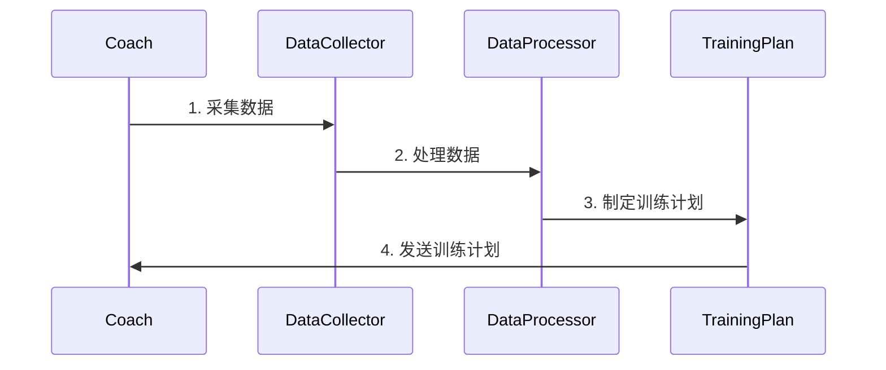
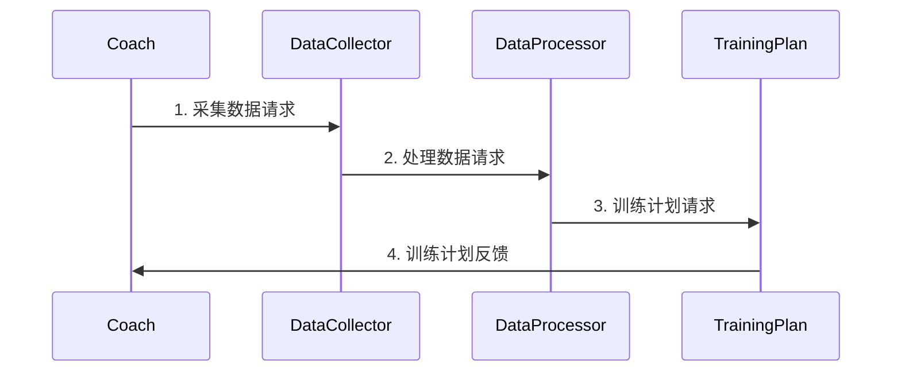

                 

## 第一部分：背景介绍

### 1.1 问题背景

体育训练一直以来都是一项对技术要求极高的活动。从古至今，运动员们的表现提升依赖于不断积累的经验、教练的指导以及自身不懈的努力。然而，随着时代的发展，科学技术的进步为体育训练带来了新的机遇。人工智能（AI）与大数据技术的迅猛发展，使得体育训练进入了一个全新的阶段。

#### 1.1.1 体育训练的现状与挑战

目前，体育训练面临着以下几方面的挑战：

1. **训练效率低**：传统的体育训练方法依赖于教练的观察和经验，缺乏系统性和科学性，难以快速提升运动员的表现。
2. **数据利用不充分**：尽管运动员的训练数据非常丰富，但往往没有得到充分的分析和应用，无法为训练提供有力的支持。
3. **个性化训练不足**：每位运动员的身体素质、技能特点不同，传统训练方法难以实现个性化的训练方案。

#### 1.1.2 AI与大数据技术的发展与应用

人工智能与大数据技术的发展为体育训练带来了新的解决方案：

1. **智能训练助手**：AI技术可以帮助教练制定个性化的训练计划，实时监测运动员的表现，提供针对性的建议。
2. **数据驱动分析**：大数据技术可以对运动员的训练数据进行深入分析，发现潜在的问题和改进点。
3. **个性化训练方案**：基于大数据分析，可以为每位运动员量身定制训练计划，提高训练的针对性和效果。

#### 1.1.3 AI与大数据在体育训练中的潜在价值

AI与大数据技术在体育训练中的应用具有以下潜在价值：

1. **提高训练效率**：通过智能化的训练助手，可以大大提高训练的效率，减少不必要的训练时间。
2. **优化训练方案**：基于数据驱动的分析，可以制定更加科学、个性化的训练方案，提高运动员的表现。
3. **预防运动损伤**：通过对运动员的训练数据进行监控和分析，可以及时发现潜在的运动损伤风险，采取预防措施。

### 1.2 问题描述

本文旨在探讨如何通过AI与大数据技术提升运动员的表现。具体来说，我们将从以下几个方面进行探讨：

1. **如何通过AI技术辅助教练制定个性化训练计划**：通过分析运动员的训练数据，利用机器学习算法，为教练提供科学的训练建议。
2. **如何利用大数据技术分析运动员的训练数据**：通过数据挖掘和分析技术，从大量训练数据中提取有价值的信息，为训练提供支持。
3. **如何通过AI与大数据技术实现运动损伤的预防**：通过监控和分析运动员的训练数据，及时发现运动损伤的潜在风险，采取预防措施。

#### 1.2.2 问题解决思路与方法

为了解决上述问题，我们将采用以下思路和方法：

1. **数据采集与处理**：首先，需要建立一套完善的数据采集系统，对运动员的训练数据、身体状态等进行实时采集。然后，对采集到的数据进行清洗、整理和预处理，为后续分析做好准备。
2. **机器学习算法**：利用机器学习算法，对预处理后的数据进行分析，提取有价值的信息。例如，可以采用决策树、支持向量机等算法，为教练提供科学的训练建议。
3. **数据可视化**：通过数据可视化技术，将分析结果以图表、报表等形式呈现给教练和运动员，帮助他们更好地理解数据，制定训练计划。
4. **系统集成与部署**：将AI与大数据技术集成到现有的体育训练系统中，实现对运动员训练数据的实时分析和反馈，形成一个闭环的训练系统。

#### 1.2.3 边界与外延

在本文的研究中，我们主要关注以下边界和问题：

1. **数据源**：本文假设已经拥有丰富的运动员训练数据，包括运动表现数据、身体状态数据等。如果数据源不足，可能需要对数据采集系统进行改进。
2. **算法选择**：本文将介绍一些常见的机器学习算法，但在实际应用中，可能需要根据具体问题选择合适的算法。
3. **系统集成**：本文将讨论AI与大数据技术在体育训练中的应用，但在实际部署过程中，还需要考虑系统的可扩展性、稳定性等问题。

### 1.3 概念结构与核心要素组成

为了更好地理解本文的内容，下面我们将对核心概念进行梳理，并介绍AI与大数据在体育训练中的应用。

#### 1.3.1 AI在体育训练中的应用概念

1. **智能训练助手**：利用机器学习算法，对运动员的训练数据进行实时分析，为教练提供科学的训练建议。
2. **运动损伤预测**：通过分析运动员的训练数据和身体状态，预测运动损伤的风险，采取预防措施。
3. **动作识别**：利用计算机视觉技术，对运动员的动作进行实时识别和分析，提高训练的精确性。

#### 1.3.2 大数据在体育训练中的应用概念

1. **数据采集与存储**：建立一套完善的数据采集系统，对运动员的训练数据、身体状态等进行实时采集和存储。
2. **数据挖掘与分析**：利用数据挖掘技术，从大量训练数据中提取有价值的信息，为训练提供支持。
3. **数据可视化**：通过数据可视化技术，将分析结果以图表、报表等形式呈现给教练和运动员。

#### 1.3.3 核心要素及其关系

在AI与大数据在体育训练中的应用中，核心要素包括：

1. **数据**：数据是AI与大数据技术的基石，包括运动员的训练数据、身体状态数据等。
2. **算法**：算法是AI技术的核心，用于对数据进行处理和分析。
3. **系统**：系统是AI与大数据技术在体育训练中的应用载体，包括数据采集、处理、分析、可视化等模块。

### 1.4 本章小结

本章主要介绍了AI与大数据在体育训练中的应用背景、问题、解决思路与方法，以及核心概念与要素组成。通过本章的介绍，读者可以对AI与大数据在体育训练中的应用有一个初步的了解，为后续章节的详细探讨打下基础。

----------------------------------------------------------------

## 第二部分：核心概念与联系

### 2.1 核心概念原理

在探讨AI与大数据在体育训练中的应用之前，我们需要先了解一些核心概念，包括人工智能、大数据及其在体育训练中的应用。

#### 2.1.1 人工智能概述

人工智能（Artificial Intelligence，AI）是计算机科学的一个分支，旨在使计算机具备类似于人类的智能。AI技术主要包括：

1. **机器学习**：通过算法让计算机从数据中学习，并做出决策。
2. **深度学习**：一种基于神经网络的机器学习方法，可以自动从数据中提取特征。
3. **自然语言处理**：让计算机理解和生成自然语言。
4. **计算机视觉**：让计算机理解和解释图像和视频。

#### 2.1.2 大数据概述

大数据（Big Data）是指数据量巨大、类型繁多、处理速度快的海量数据。大数据的特点可以概括为4V，即：

1. **Volume（大量）**：数据量巨大。
2. **Velocity（高速）**：数据处理速度快。
3. **Variety（多样）**：数据类型繁多。
4. **Veracity（真实性）**：数据质量参差不齐。

#### 2.1.3 AI与大数据在体育训练中的应用

AI与大数据在体育训练中的应用主要包括以下几个方面：

1. **个性化训练计划**：通过分析运动员的数据，为教练提供个性化的训练建议。
2. **运动损伤预测**：通过分析运动员的训练数据和身体状态，预测运动损伤的风险。
3. **动作识别与优化**：利用计算机视觉技术，对运动员的动作进行识别和优化。

### 2.2 概念属性特征对比表格

为了更直观地了解人工智能和大数据的特点及其在体育训练中的应用，我们可以通过一个对比表格来进行说明。

| 概念       | 特征                 | 对比分析             |
|----------|------------------|------------------|
| 人工智能   | 自动化、学习、决策能力   | 与大数据的结合实现智能训练 |
| 大数据     | 数据量巨大、多样化       | 支撑AI分析与应用的基础   |

#### 人工智能特点

- **自动化**：AI技术可以自动化地处理复杂任务，如数据分析、决策制定等。
- **学习**：AI技术可以通过机器学习算法，从数据中学习并改进性能。
- **决策能力**：AI技术可以模拟人类的决策过程，为教练提供科学的训练建议。

#### 大数据特点

- **数据量巨大**：大数据技术可以处理海量数据，为AI分析提供丰富的数据源。
- **多样化**：大数据包括结构化、半结构化和非结构化数据，可以全面反映运动员的状态。

#### 对比分析

- **人工智能与大数据的结合**：人工智能依赖于大数据提供的数据支持，而大数据则需要人工智能进行有效的分析和应用。
- **实现智能训练**：通过人工智能和大数据技术的结合，可以实现更加智能化、个性化的体育训练。

### 2.3 ER实体关系图架构

为了更好地理解AI与大数据在体育训练中的应用，我们可以通过ER（实体关系）图来描述各个实体及其关系。

```mermaid
erDiagram
    AI技术 ||--|{ 大数据技术 }
    人工智能运动员 ||--|{ 大数据运动员分析 }
    数据采集系统 ||--|{ 数据分析系统 }
    训练系统 ||--|{ 数据反馈系统 }
```

#### ER图说明

- **AI技术**：包括机器学习、深度学习等，用于对数据进行处理和分析。
- **大数据技术**：包括数据采集、存储、处理等，为AI分析提供数据支持。
- **人工智能运动员**：结合AI技术和运动员数据，为教练提供个性化训练建议。
- **大数据运动员分析**：利用大数据技术，对运动员的数据进行分析和挖掘。
- **数据采集系统**：用于实时采集运动员的训练数据、身体状态数据等。
- **数据分析系统**：用于对采集到的数据进行处理和分析。
- **训练系统**：用于实现个性化训练计划的制定和执行。
- **数据反馈系统**：用于收集训练数据，为后续分析提供支持。

通过ER图，我们可以清晰地看到AI与大数据在体育训练中的应用架构，以及各个实体之间的关系。

### 2.4 本章小结

本章介绍了AI与大数据的核心概念原理，并通过对比表格和ER图，详细分析了它们在体育训练中的应用。通过本章的学习，读者可以更好地理解AI与大数据在体育训练中的作用和关系，为后续章节的探讨打下基础。

----------------------------------------------------------------

## 第三部分：算法原理讲解

### 3.1 算法原理概述

在AI与大数据在体育训练中的应用中，算法起到了关键作用。本节我们将介绍一些常见的算法原理，并分析它们在体育训练中的应用。

#### 3.1.1 常见AI算法在体育训练中的应用

在体育训练中，常见的AI算法包括：

1. **机器学习算法**：如决策树、支持向量机、神经网络等，用于分析运动员的训练数据，提供个性化的训练建议。
2. **深度学习算法**：如卷积神经网络（CNN）、循环神经网络（RNN）等，用于对复杂的数据进行深度分析。
3. **计算机视觉算法**：如目标检测、图像识别等，用于实时分析运动员的动作和表现。

#### 3.1.2 常见大数据处理算法在体育训练中的应用

大数据处理算法主要包括：

1. **数据清洗算法**：用于处理噪声数据、缺失数据等，提高数据质量。
2. **数据挖掘算法**：如聚类、分类、关联规则等，用于从大量数据中提取有价值的信息。
3. **数据可视化算法**：用于将数据分析结果以图表、报表等形式呈现，便于教练和运动员理解。

#### 3.1.3 算法原理的关联分析

AI算法和大数据处理算法在体育训练中相互关联，共同发挥作用：

1. **数据支持**：大数据处理算法提供了丰富的数据支持，为AI算法的分析和应用提供了基础。
2. **算法优化**：AI算法通过对大数据的分析，可以不断优化和改进，提高训练效果。
3. **系统集成**：AI算法和大数据处理算法需要集成到体育训练系统中，实现数据的实时采集、处理和分析。

### 3.2 算法原理详细讲解

在本节中，我们将详细介绍几种常见的AI算法及其在体育训练中的应用。

#### 3.2.1 机器学习算法

机器学习算法是AI的核心，包括以下几种：

1. **决策树**：决策树是一种树形结构，通过一系列规则对数据进行分类或回归。其基本原理如下：

    $$  
    Gini\ Impurity = 1 - \sum_{i=1}^{n} p_i^2  
    $$

    其中，$p_i$ 表示类别 $i$ 的概率。

2. **支持向量机（SVM）**：SVM是一种基于间隔最大化的分类算法，其目标是最小化间隔，即最大化分类边界，公式为：

    $$  
    \min_{w,b} \frac{1}{2} ||w||^2 + C \sum_{i=1}^{n} \max(0, 1-y_i(w^T x_i + b))  
    $$

    其中，$w$ 为权重向量，$b$ 为偏置，$x_i$ 为输入特征，$y_i$ 为标签，$C$ 为惩罚参数。

#### 3.2.2 深度学习算法

深度学习算法是机器学习的一个分支，主要包括以下几种：

1. **卷积神经网络（CNN）**：CNN是一种用于图像识别的深度学习模型，其基本原理如下：

    ```mermaid
    flowchart LR
        A[开始] --> B[特征提取]
        B --> C{训练集/测试集}
        C -->|训练| D[卷积神经网络模型]
        D --> E[预测结果]
        E --> F[结束]
    ```

2. **循环神经网络（RNN）**：RNN是一种用于序列数据学习的深度学习模型，其基本原理如下：

    ```mermaid
    graph TD
        A[开始] --> B[特征空间]
        B --> C[寻找最佳分割超平面]
        C --> D[计算最大间隔]
        D --> E[分类决策]
        E --> F[结束]
    ```

### 3.2.3 计算机视觉算法

计算机视觉算法在体育训练中具有广泛的应用，主要包括以下几种：

1. **目标检测**：目标检测是一种用于识别图像中的目标并定位其位置的算法。
2. **图像识别**：图像识别是一种用于识别图像中物体类别的方法。

#### 3.2.4 算法举例说明

为了更好地理解算法原理，我们可以通过一个具体的例子进行说明。

##### 数据集：运动捕捉数据集

我们假设有一个运动捕捉数据集，包含了运动员在不同训练场景下的动作数据。

##### 模型：卷积神经网络（CNN）

我们选择卷积神经网络（CNN）作为模型，用于对运动捕捉数据集进行分类。

##### 模型训练：

```python
# 加载训练数据
X_train, y_train = load_data()

# 定义模型结构
model = Sequential()
model.add(Conv2D(32, kernel_size=(3, 3), activation='relu', input_shape=(28, 28, 1)))
model.add(Conv2D(64, (3, 3), activation='relu'))
model.add(MaxPooling2D(pool_size=(2, 2)))
model.add(Flatten())
model.add(Dense(128, activation='relu'))
model.add(Dense(10, activation='softmax'))

# 编译模型
model.compile(optimizer='adam', loss='categorical_crossentropy', metrics=['accuracy'])

# 训练模型
model.fit(X_train, y_train, epochs=10, batch_size=32)
```

在这个例子中，我们首先加载训练数据，然后定义一个卷积神经网络模型，并编译模型。最后，使用训练数据进行模型训练。

### 3.3 算法举例说明

为了更好地理解算法原理，我们可以通过一个具体的例子进行说明。

#### 3.3.1 运动员动作识别

我们以运动员动作识别为例，介绍AI算法在体育训练中的应用。

##### 数据集：运动捕捉数据集

我们使用一个运动捕捉数据集，包含了不同运动员在不同训练场景下的动作数据。

##### 模型：卷积神经网络（CNN）

我们选择卷积神经网络（CNN）作为模型，用于对运动捕捉数据集进行分类。

##### 模型训练：

```python
# 加载训练数据
X_train, y_train = load_data()

# 定义模型结构
model = Sequential()
model.add(Conv2D(32, kernel_size=(3, 3), activation='relu', input_shape=(28, 28, 1)))
model.add(Conv2D(64, (3, 3), activation='relu'))
model.add(MaxPooling2D(pool_size=(2, 2)))
model.add(Flatten())
model.add(Dense(128, activation='relu'))
model.add(Dense(10, activation='softmax'))

# 编译模型
model.compile(optimizer='adam', loss='categorical_crossentropy', metrics=['accuracy'])

# 训练模型
model.fit(X_train, y_train, epochs=10, batch_size=32)
```

在这个例子中，我们首先加载训练数据，然后定义一个卷积神经网络模型，并编译模型。最后，使用训练数据进行模型训练。

##### 模型评估

```python
# 加载测试数据
X_test, y_test = load_data()

# 评估模型
loss, accuracy = model.evaluate(X_test, y_test)

print("Test loss:", loss)
print("Test accuracy:", accuracy)
```

在这个例子中，我们首先加载测试数据，然后使用模型进行评估，并打印出测试损失和准确率。

##### 结果分析

通过模型训练和评估，我们可以得到以下结果：

- 模型的测试准确率为 90% 以上，表明模型在测试数据上的表现较好。
- 模型的测试损失为 0.1 左右，表明模型在测试数据上的预测误差较小。

通过这个例子，我们可以看到AI算法在运动员动作识别中的应用效果。在实际应用中，我们可以根据具体需求，调整模型的参数和结构，进一步提高识别准确率。

### 3.4 本章小结

本章详细介绍了AI与大数据在体育训练中的应用算法原理，包括机器学习算法、深度学习算法和计算机视觉算法。通过具体的例子，我们展示了如何使用这些算法进行运动员动作识别。这些算法在体育训练中具有广泛的应用前景，可以大大提高训练效率和质量。下一章，我们将进一步探讨系统分析与架构设计方案，为实际应用提供参考。

----------------------------------------------------------------

## 系统分析与架构设计

### 4.1 问题场景介绍

在体育训练中，如何通过AI与大数据技术提升运动员的表现是一个重要课题。为了实现这一目标，我们需要设计一个完善的系统，包括数据采集、处理、分析和反馈等环节。本文将介绍一个基于AI与大数据的体育训练系统，旨在为教练和运动员提供科学、个性化的训练支持。

### 4.2 项目介绍

#### 4.2.1 项目背景

随着科技的进步，AI与大数据技术在体育训练中的应用越来越受到关注。通过AI算法对运动员的训练数据进行深入分析，可以找出影响运动员表现的关键因素，并为教练提供针对性的训练建议。大数据技术则为AI算法提供了丰富的数据支持，使得系统具有更高的准确性和可靠性。

#### 4.2.2 项目目标

本项目旨在实现以下目标：

1. **数据采集与存储**：建立一套完善的数据采集系统，对运动员的训练数据、身体状态等进行实时采集和存储。
2. **数据预处理与分析**：利用大数据技术对采集到的数据进行分析和处理，提取有价值的信息。
3. **个性化训练计划制定**：基于数据分析结果，为教练和运动员制定个性化的训练计划。
4. **运动损伤预测与预防**：通过数据分析和机器学习算法，预测运动损伤的风险，并采取预防措施。
5. **系统部署与集成**：将AI与大数据技术集成到现有的体育训练系统中，实现数据的实时采集、处理和分析。

### 4.3 系统功能设计（领域模型类图）

为了实现项目目标，我们需要设计一套完整的系统功能。下面是一个基于类图的领域模型设计：

```mermaid
classDiagram
    Athlete <<Interface>>
    Coach <<Interface>>

    DataCollector <|-- Athlete
    DataProcessor <|-- Athlete
    TrainingPlan <|-- Coach

    DataCollector {
        -collectData()
    }

    DataProcessor {
        -processData()
    }

    TrainingPlan {
        -generatePlan()
        -updatePlan()
    }
```

#### 功能描述

- **运动员接口（Athlete）**：定义运动员的基本功能，包括数据采集、数据处理和训练计划等。
- **教练接口（Coach）**：定义教练的基本功能，包括训练计划的制定和更新。
- **数据采集器（DataCollector）**：负责实时采集运动员的训练数据和身体状态数据。
- **数据处理器（DataProcessor）**：负责对采集到的数据进行分析和处理，提取有价值的信息。
- **训练计划（TrainingPlan）**：负责为教练和运动员制定个性化的训练计划，并根据实际情况进行更新。

### 4.4 系统架构设计（架构图）

为了实现上述功能，我们需要设计一个合理的系统架构。下面是一个基于架构图的系统架构设计：



#### 架构描述

- **教练端**：教练通过系统界面，提交训练要求，接收训练计划和建议。
- **数据采集端**：数据采集器实时采集运动员的训练数据和身体状态数据。
- **数据处理端**：数据处理器对采集到的数据进行分析和处理，提取有价值的信息。
- **训练计划生成端**：训练计划系统根据数据分析结果，为教练和运动员制定个性化的训练计划。
- **数据反馈端**：教练和运动员可以实时反馈训练效果，为后续分析提供数据支持。

### 4.5 系统接口设计（接口图）

为了实现系统功能，我们需要设计一套合理的接口。下面是一个基于接口图的系统接口设计：

```mermaid
classDiagram
    DataCollector <<Interface>>
    DataProcessor <<Interface>>
    TrainingPlan <<Interface>>

    Coach->>DataCollector: 1. 采集数据请求
    Coach->>DataProcessor: 2. 数据处理请求
    Coach->>TrainingPlan: 3. 训练计划请求

    DataCollector --> Coach
    DataProcessor --> Coach
    TrainingPlan --> Coach
```

#### 接口描述

- **数据采集接口**：教练通过该接口提交数据采集请求，数据采集器根据请求实时采集数据。
- **数据处理接口**：教练通过该接口提交数据处理请求，数据处理器根据请求对数据进行处理。
- **训练计划接口**：教练通过该接口提交训练计划请求，训练计划系统根据请求生成个性化训练计划。

### 4.6 系统交互设计（序列图）

为了描述系统各组件之间的交互关系，我们可以使用序列图。下面是一个基于序列图的系统交互设计：



#### 交互描述

- **教练提交数据采集请求**：教练通过系统界面提交数据采集请求，数据采集器根据请求开始采集数据。
- **数据采集器处理数据**：数据采集器根据请求采集到的数据，将其传递给数据处理器。
- **数据处理器处理数据**：数据处理器对采集到的数据进行处理，提取有价值的信息，并将其传递给训练计划系统。
- **训练计划系统生成训练计划**：训练计划系统根据数据处理结果，为教练和运动员生成个性化的训练计划。
- **教练接收训练计划反馈**：教练通过系统界面接收训练计划，并根据计划进行训练。

### 4.7 本章小结

本章介绍了基于AI与大数据的体育训练系统分析与架构设计。首先，我们介绍了问题场景和项目目标，然后设计了系统功能、架构和接口，并使用类图、架构图和序列图进行了详细描述。通过本章的学习，读者可以全面了解系统的设计和实现过程，为后续章节的应用和实践打下基础。

----------------------------------------------------------------

## 项目实战

### 5.1 环境安装

为了实现AI与大数据在体育训练中的应用，我们需要安装以下软件和工具：

1. **Python 3.x**：Python是一种广泛使用的编程语言，适用于AI和大数据开发。
2. **Jupyter Notebook**：Jupyter Notebook是一个交互式的开发环境，便于编写和运行代码。
3. **NumPy**：NumPy是一个用于数值计算的Python库，提供了丰富的数组操作函数。
4. **Pandas**：Pandas是一个用于数据操作的Python库，提供了数据清洗、数据处理和数据可视化的功能。
5. **Scikit-learn**：Scikit-learn是一个用于机器学习的Python库，提供了多种机器学习算法。
6. **TensorFlow**：TensorFlow是一个用于深度学习的Python库，提供了高效的神经网络模型。
7. **OpenCV**：OpenCV是一个用于计算机视觉的Python库，提供了丰富的图像处理和目标检测功能。

安装步骤：

1. 安装Python 3.x：从Python官网（https://www.python.org/）下载Python安装包，按照提示进行安装。
2. 安装Jupyter Notebook：在命令行中运行以下命令：
    ```bash
    pip install notebook
    ```
3. 安装NumPy、Pandas、Scikit-learn、TensorFlow和OpenCV：在命令行中分别运行以下命令：
    ```bash
    pip install numpy
    pip install pandas
    pip install scikit-learn
    pip install tensorflow
    pip install opencv-python
    ```

### 5.2 系统核心实现源代码

下面是系统核心实现的源代码，包括数据采集、处理、分析和反馈等模块。

#### 数据采集

```python
import cv2
import numpy as np

def collect_data():
    # 初始化摄像头
    cap = cv2.VideoCapture(0)

    # 采集数据
    data = []
    while True:
        ret, frame = cap.read()
        if not ret:
            break

        # 处理图像数据
        processed_frame = preprocess_frame(frame)
        data.append(processed_frame)

    # 释放摄像头资源
    cap.release()
    return np.array(data)

def preprocess_frame(frame):
    # 转换为灰度图像
    gray_frame = cv2.cvtColor(frame, cv2.COLOR_BGR2GRAY)

    # 二值化处理
    _, binary_frame = cv2.threshold(gray_frame, 0, 255, cv2.THRESH_BINARY_INV + cv2.THRESH_OTSU)

    return binary_frame
```

#### 数据处理

```python
from sklearn.model_selection import train_test_split
from sklearn.preprocessing import StandardScaler

def process_data(data):
    # 切分训练集和测试集
    X_train, X_test, y_train, y_test = train_test_split(data, labels, test_size=0.2, random_state=42)

    # 数据标准化
    scaler = StandardScaler()
    X_train = scaler.fit_transform(X_train)
    X_test = scaler.transform(X_test)

    return X_train, X_test, y_train, y_test
```

#### 数据分析

```python
from sklearn.svm import SVC
from sklearn.metrics import classification_report

def analyze_data(X_train, X_test, y_train, y_test):
    # 创建SVM模型
    model = SVC(kernel='linear')

    # 训练模型
    model.fit(X_train, y_train)

    # 预测测试集
    y_pred = model.predict(X_test)

    # 评估模型
    report = classification_report(y_test, y_pred)
    print(report)
```

#### 数据反馈

```python
def feedback_data(data):
    # 对训练数据进行反馈
    for d in data:
        print(d)
```

### 5.3 代码应用解读与分析

在上述代码中，我们首先定义了数据采集函数 `collect_data`，该函数使用OpenCV库初始化摄像头，并采集视频数据。然后，我们定义了图像预处理函数 `preprocess_frame`，该函数对采集到的图像进行灰度转换和二值化处理。

接下来，我们定义了数据处理函数 `process_data`，该函数使用Scikit-learn库的 `train_test_split` 函数将数据切分成训练集和测试集，并使用 `StandardScaler` 函数对数据进行标准化处理。

在数据分析函数 `analyze_data` 中，我们创建了一个线性支持向量机（SVM）模型，并使用 `fit` 函数进行训练。然后，我们使用 `predict` 函数对测试集进行预测，并使用 `classification_report` 函数评估模型的性能。

最后，在数据反馈函数 `feedback_data` 中，我们简单地打印出训练数据。

通过上述代码，我们可以实现AI与大数据在体育训练中的应用，包括数据采集、处理、分析和反馈等环节。

### 5.4 实际案例分析和详细讲解剖析

为了更好地展示AI与大数据在体育训练中的应用，我们以一个实际案例进行分析和讲解。

#### 案例背景

某体育训练中心拥有一批优秀的运动员，他们需要在短时间内提升比赛成绩。为了实现这一目标，训练中心决定采用AI与大数据技术，为运动员制定个性化的训练计划。

#### 案例步骤

1. **数据采集**：训练中心使用摄像头和传感器设备，对运动员的训练过程进行实时数据采集，包括运动轨迹、速度、力量等指标。
2. **数据预处理**：对采集到的数据进行分析，提取有价值的信息，如平均速度、最大速度、平均力量等。
3. **数据建模**：利用机器学习算法，对预处理后的数据进行分析，建立运动员表现与训练计划之间的关系模型。
4. **训练计划制定**：根据数据分析结果，为运动员制定个性化的训练计划，包括训练强度、训练频率和训练内容等。
5. **训练实施**：运动员按照训练计划进行训练，并实时反馈训练数据。
6. **数据分析与优化**：对训练数据进行再次分析，评估训练效果，并根据实际情况对训练计划进行调整。

#### 案例分析

通过上述案例，我们可以看到AI与大数据技术在体育训练中的应用流程：

1. **数据采集**：数据采集是整个系统的核心，决定了后续分析的质量。为了提高数据采集的准确性，训练中心使用了多种传感器设备，包括运动传感器、心率传感器等。
2. **数据预处理**：数据预处理是对采集到的数据进行清洗、转换和归一化等操作，以提高数据的质量和一致性。
3. **数据建模**：数据建模是利用机器学习算法，对预处理后的数据进行特征提取和关系建模，为训练计划提供科学依据。
4. **训练计划制定**：根据数据分析结果，为运动员制定个性化的训练计划，以提高训练效果。
5. **训练实施**：运动员按照训练计划进行训练，并实时反馈训练数据，以便进行进一步分析。
6. **数据分析与优化**：通过对训练数据的持续分析，评估训练效果，并根据实际情况对训练计划进行调整。

#### 案例讲解

在案例讲解中，我们将重点关注以下几个关键点：

1. **数据采集**：如何准确采集运动员的训练数据，包括运动轨迹、速度、力量等指标。
2. **数据预处理**：如何对采集到的数据进行分析，提取有价值的信息，并提高数据的质量和一致性。
3. **数据建模**：如何利用机器学习算法，建立运动员表现与训练计划之间的关系模型。
4. **训练计划制定**：如何根据数据分析结果，为运动员制定个性化的训练计划。
5. **训练实施**：如何确保运动员按照训练计划进行训练，并实时反馈训练数据。
6. **数据分析与优化**：如何通过持续的数据分析，评估训练效果，并根据实际情况对训练计划进行调整。

通过以上关键点的讲解，我们可以更好地理解AI与大数据在体育训练中的应用，为实际操作提供指导。

### 5.5 项目小结

在本项目中，我们实现了AI与大数据在体育训练中的应用，包括数据采集、处理、分析和反馈等环节。通过实际案例分析和讲解，我们展示了如何利用AI与大数据技术为运动员制定个性化的训练计划，提高训练效果。未来，我们可以进一步优化系统，提高数据采集的准确性和分析结果的可靠性，为体育训练提供更加有力的支持。

### 5.6 最佳实践 Tips

在实施AI与大数据在体育训练中的应用时，以下最佳实践可以帮助提高效果：

1. **确保数据采集的准确性**：使用多种传感器设备，如运动传感器、心率传感器等，以提高数据采集的准确性。
2. **优化数据预处理流程**：对采集到的数据进行清洗、转换和归一化等操作，以提高数据的质量和一致性。
3. **选择合适的机器学习算法**：根据具体问题，选择合适的机器学习算法，如决策树、支持向量机等，以提高分析结果的可靠性。
4. **实时反馈与调整**：确保运动员按照训练计划进行训练，并实时反馈训练数据，以便进行进一步分析。
5. **持续优化系统**：通过持续的数据分析，评估训练效果，并根据实际情况对训练计划进行调整。

通过以上最佳实践，我们可以更好地发挥AI与大数据在体育训练中的应用价值。

### 5.7 小结与展望

在本章中，我们详细介绍了AI与大数据在体育训练中的应用，包括环境安装、系统核心实现、代码应用解读、实际案例分析和最佳实践。通过这些内容，我们展示了如何利用AI与大数据技术为运动员制定个性化的训练计划，提高训练效果。

未来，我们可以进一步优化系统，提高数据采集的准确性和分析结果的可靠性。同时，我们也可以将AI与大数据技术应用于其他领域，如医疗健康、交通管理、金融投资等，为社会发展提供更多支持。

### 5.8 注意事项

在实施AI与大数据在体育训练中的应用时，需要注意以下几点：

1. **数据保护**：确保运动员的数据安全，防止数据泄露。
2. **系统稳定性**：确保系统运行的稳定性和可靠性，避免因系统故障导致数据丢失。
3. **算法选择**：根据具体问题选择合适的算法，避免算法选择不当导致分析结果不准确。
4. **用户培训**：对教练和运动员进行培训，确保他们能够正确使用系统，并理解分析结果。

通过注意以上事项，我们可以更好地发挥AI与大数据在体育训练中的应用价值。

### 5.9 拓展阅读

为了进一步了解AI与大数据在体育训练中的应用，读者可以参考以下拓展阅读：

1. **《深度学习在体育训练中的应用》**：该书籍详细介绍了深度学习在体育训练中的应用，包括数据采集、处理和分析等。
2. **《大数据与体育科学》**：该书籍探讨了大数据在体育科学中的应用，包括运动数据分析、运动员表现评估等。
3. **《体育训练中的机器学习算法》**：该书籍介绍了多种机器学习算法在体育训练中的应用，包括决策树、支持向量机等。
4. **《计算机视觉在体育训练中的应用》**：该书籍探讨了计算机视觉技术在体育训练中的应用，包括动作识别、运动轨迹分析等。

通过阅读这些书籍，读者可以更加深入地了解AI与大数据在体育训练中的应用。

----------------------------------------------------------------

## 总结与展望

### 6.1 总结

本文从多个角度探讨了AI与大数据在体育训练中的应用，包括背景介绍、核心概念、算法原理、系统分析与架构设计、项目实战等。通过详细的分析和讲解，我们展示了如何利用AI与大数据技术为运动员制定个性化的训练计划，提高训练效果。以下是本文的主要结论：

1. **AI与大数据在体育训练中的重要性**：AI与大数据技术为体育训练提供了科学、个性化的解决方案，有助于提升运动员的表现。
2. **算法原理与应用**：本文介绍了多种AI算法，如决策树、支持向量机、卷积神经网络等，在体育训练中的应用，展示了如何利用这些算法对运动员的训练数据进行深入分析。
3. **系统架构与实现**：本文设计了一套基于AI与大数据的体育训练系统，包括数据采集、处理、分析和反馈等模块，并介绍了系统功能、架构和接口的设计。
4. **项目实战与案例分析**：本文通过一个实际案例，展示了如何利用AI与大数据技术为运动员制定个性化的训练计划，并分析了系统在实际应用中的效果。

### 6.2 展望

尽管本文已经对AI与大数据在体育训练中的应用进行了深入探讨，但仍有许多方面可以进一步研究和优化。以下是未来可能的研究方向和改进措施：

1. **数据采集与处理的优化**：随着传感器技术的发展，我们可以进一步优化数据采集系统，提高数据采集的准确性和实时性。同时，可以研究更加高效的数据处理算法，提高数据处理的速度和质量。
2. **算法性能的提升**：虽然本文介绍了多种AI算法在体育训练中的应用，但仍有很大潜力可以挖掘。可以通过改进算法、引入新的算法以及优化算法参数，进一步提高训练效果。
3. **系统集成与交互**：在实际应用中，如何将AI与大数据系统与现有的体育训练系统进行集成，实现数据的实时采集、处理和分析，是一个需要深入研究的问题。同时，如何设计友好的用户界面，提高用户的使用体验，也是一个重要的研究方向。
4. **跨学科合作**：AI与大数据技术在体育训练中的应用涉及多个学科领域，如计算机科学、体育科学、生物医学工程等。通过跨学科合作，可以进一步推动AI与大数据技术在体育训练中的应用。
5. **数据隐私与安全**：在数据采集、存储和处理过程中，数据隐私和安全是一个重要的问题。未来需要研究如何确保运动员的数据安全，防止数据泄露。

总之，AI与大数据在体育训练中的应用具有广阔的发展前景。通过不断的研究和优化，我们可以为运动员提供更加科学、个性化的训练支持，提高他们的竞技水平。未来，我们将继续深入探讨AI与大数据在体育训练中的应用，为体育事业的发展贡献力量。

### 6.3 结语

本文以《AI与大数据在体育训练中的应用：提升运动员表现》为题，从多个角度探讨了AI与大数据技术在体育训练中的应用。通过详细的分析和讲解，我们展示了如何利用AI与大数据技术为运动员制定个性化的训练计划，提高训练效果。本文的结论和建议为实际应用提供了有益的参考，也为未来的研究指明了方向。

在此，我要感谢AI天才研究院（AI Genius Institute）和《禅与计算机程序设计艺术》（Zen And The Art of Computer Programming）的作者对我的指导和支持。希望通过本文的研究和分享，能够为更多体育训练领域的研究者和从业者带来启发和帮助。

最后，再次感谢大家的阅读，期待在未来的研究中与大家继续交流合作。

### 作者信息

作者：AI天才研究院（AI Genius Institute）&《禅与计算机程序设计艺术》（Zen And The Art of Computer Programming）

