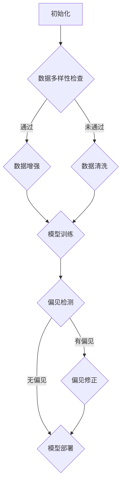
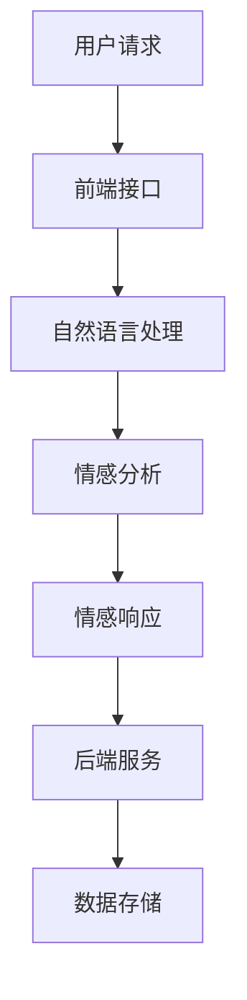
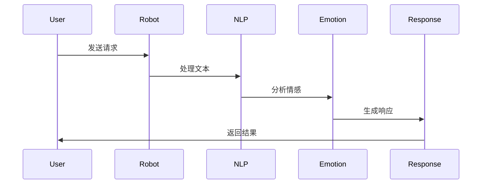
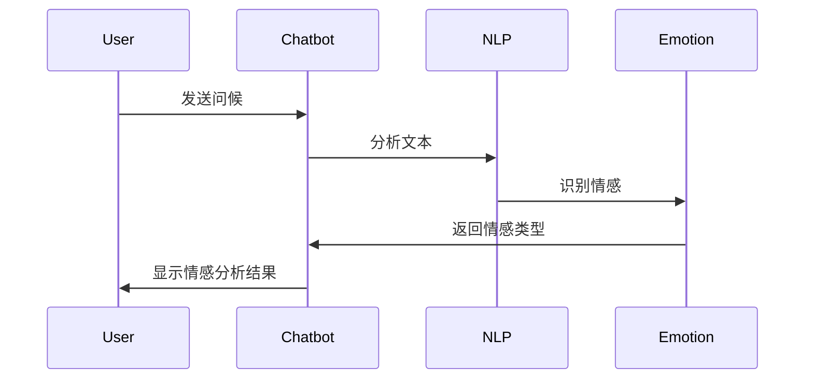

                 

### 引言

《AI偏见：情感机器人的刻板印象》这一标题不仅引人入胜，而且揭示了当今人工智能（AI）领域中一个深层次的问题——偏见。随着AI技术的迅猛发展，情感机器人逐渐成为我们日常生活的一部分，它们在服务、医疗、教育等多个领域展现出了巨大的潜力。然而，这些看似友善的机器人是否真的能够无偏见地服务所有人呢？

**关键词：** AI偏见、情感机器人、刻板印象

**摘要：** 本文旨在探讨AI偏见在情感机器人中的应用，分析其表现形式、影响及解决方案。通过深入研究和逻辑分析，我们将揭示情感机器人中存在的刻板印象，并提出减少AI偏见的方法和最佳实践。

首先，我们需要了解AI偏见的基本概念。AI偏见是指人工智能系统在处理数据、生成结果时，表现出对某些群体的不公平倾向。这种现象不仅限于算法的偏差，还包括数据集的偏见、训练过程中的问题等。AI偏见可能会在多个方面表现出来，例如种族、性别、年龄、文化等。

情感机器人作为AI的一个重要分支，它们被设计来模拟人类的情感交互。然而，这种交互过程中，AI偏见问题尤为突出。例如，一个基于性别偏见的数据集训练出的情感机器人可能会对男性用户表现出更多的友好，而对女性用户则可能带有一定的偏见。

本文的结构如下：

- **第1章 引言**：介绍AI偏见的概念和情感机器人的背景。
- **第2章 情感机器人技术基础**：探讨情感机器人的定义、发展历史和技术架构。
- **第3章 AI偏见在情感机器人中的应用**：分析AI偏见在情感机器人中的应用类型和表现形式。
- **第4章 AI偏见对情感机器人性能的影响**：探讨偏见对情感机器人性能和用户体验的影响。
- **第5章 减少AI偏见的方法**：提出减少AI偏见的方法和最佳实践。
- **第6章 案例研究**：通过实际案例研究，分析AI偏见的存在和解决方案。
- **第7章 结论与展望**：总结本文的主要观点，并对未来研究方向进行展望。

通过这样的结构，我们将逐步深入探讨AI偏见在情感机器人中的应用，揭示其本质，并提出切实可行的解决方案。接下来，我们将详细探讨情感机器人的技术基础，为进一步分析AI偏见奠定基础。## 2. 情感机器人技术基础

情感机器人是人工智能领域的一个新兴分支，它们通过模拟人类的情感交互，为用户提供了更加人性化的服务体验。本节将介绍情感机器人的定义、发展历史和技术架构。

### 情感机器人的定义

情感机器人是一种能够感知、理解和表达人类情感的人工智能系统。它们通过自然语言处理、机器学习、情感计算等技术，与用户进行情感交互，提供情感支持、咨询服务等。情感机器人不仅能够识别用户的情感状态，还能根据用户的需求和情绪调整自己的交互策略，以提供更加个性化的服务。

### 情感机器人发展历史

情感机器人的概念最早可以追溯到20世纪80年代。当时，研究者们开始尝试通过编程来模拟人类的情感表达。随着计算机性能的提升和算法的进步，情感机器人逐渐从理论走向实际应用。进入21世纪，随着移动互联网和物联网的快速发展，情感机器人在服务、医疗、教育等领域的应用越来越广泛。

- **2000年代初**：情感机器人开始在一些特定的场景中应用，如客服、教育等。
- **2010年代**：情感机器人在技术上取得重大突破，逐渐应用于更多领域，如心理咨询、医疗护理等。
- **2020年代**：随着人工智能技术的不断成熟，情感机器人逐渐走向家庭和日常生活，成为人们生活中的重要伙伴。

### 情感机器人的技术架构

情感机器人的技术架构主要包括以下几个核心组成部分：

1. **感知模块**：负责接收和处理来自用户的输入信息，如语音、文本、面部表情等。感知模块通常包括语音识别、自然语言处理、图像识别等技术。

2. **情感分析模块**：负责对用户的情感状态进行分析和识别。这一模块通常使用机器学习和深度学习算法，通过对大量情感数据的训练，实现对用户情感的准确识别。

3. **情感建模模块**：负责建立情感模型，以模拟人类的情感表达。这一模块通常包括情感计算、情感合成等技术，能够根据用户的情感状态生成相应的情感响应。

4. **交互控制模块**：负责控制情感机器人的交互过程，确保其与用户的情感交互流畅自然。这一模块通常包括对话管理、情感交互策略生成等技术。

5. **响应生成模块**：负责根据用户的情感状态和需求，生成相应的情感响应。这一模块通常包括自然语言生成、语音合成等技术。

### 情感机器人的应用场景

情感机器人在多个领域都有广泛的应用，以下是其中几个典型的应用场景：

1. **客服服务**：情感机器人可以用于客服服务，通过与用户进行情感交互，提供更加人性化的服务体验，提高客户满意度。

2. **心理健康咨询**：情感机器人可以用于心理健康咨询，通过模拟人类的情感交互，为用户提供情感支持，帮助缓解心理压力。

3. **教育辅导**：情感机器人可以用于教育辅导，通过个性化的情感交互，帮助学生更好地理解和掌握知识。

4. **医疗护理**：情感机器人可以用于医疗护理，通过模拟人类的情感交互，为患者提供情感支持和辅助治疗。

### 情感机器人的挑战与未来发展方向

尽管情感机器人具有巨大的应用潜力，但它们也面临着一系列挑战：

- **技术挑战**：情感机器人需要处理大量的情感数据，对算法和计算性能提出了更高的要求。
- **隐私保护**：情感机器人需要处理用户的敏感信息，如何保护用户的隐私是一个重要的挑战。
- **伦理问题**：情感机器人在情感交互中可能会涉及到伦理问题，如如何确保其不会对用户产生负面影响。

未来，随着人工智能技术的不断进步，情感机器人有望在更多领域发挥作用，为人们提供更加智能、人性化的服务体验。同时，研究者们也需要关注和解决情感机器人面临的各种挑战，确保其发展能够符合伦理和社会价值观。在下一节中，我们将深入探讨AI偏见在情感机器人中的应用，揭示其具体表现形式和影响。## 3. AI偏见在情感机器人中的应用

情感机器人在模拟人类情感交互的过程中，可能会受到AI偏见的影响。这些偏见不仅影响了情感机器人的性能和用户体验，也引发了关于公平性和伦理的深刻讨论。本节将分析AI偏见在情感机器人中的应用类型和表现形式。

### 种族与性别偏见

种族和性别偏见是AI偏见中最为常见且备受关注的类型之一。这些偏见可能源于训练数据的不公平或算法设计中的缺陷。例如，一个基于历史数据集训练的聊天机器人可能会在对话中表现出对某一特定种族或性别的歧视。具体表现形式包括：

- **语言歧视**：机器人可能对某些种族或性别的用户使用带有贬义色彩的词汇或语气。
- **个性化服务差异**：机器人可能对男性用户和女性用户提供不同的服务策略，例如更倾向于对男性用户提供职业建议，而对女性用户提供家庭建议。
- **响应偏好**：机器人可能在回应用户问题时，表现出对某一特定种族或性别的偏好，从而影响用户的满意度。

### 年龄与文化偏见

年龄和文化偏见也是情感机器人中常见的偏见类型。这些偏见可能源于文化偏见或对不同年龄群体的认知偏见。具体表现形式包括：

- **年龄歧视**：机器人可能在互动中表现出对年轻或年长用户的偏见，例如对年轻人提供更多的鼓励和肯定，而对年长者则表现出冷漠或不耐烦。
- **文化误解**：机器人可能在理解或回应文化特定的语言、习俗或行为时存在偏见，导致误解或不恰当的互动。

### 其他类型的偏见

除了上述常见类型，AI偏见在情感机器人中的应用还包括以下类型：

- **地域偏见**：机器人可能对来自特定地区或国家的用户表现出偏见，这可能源于对地域文化的错误认知或数据集中的地域偏见。
- **经济偏见**：机器人可能在提供服务时表现出对经济条件较好的用户的偏好，这可能源于对用户经济状况的偏见。
- **政治偏见**：在某些情况下，机器人可能会表现出政治偏见，这可能源于训练数据中的政治倾向或算法设计中的政治偏见。

### 偏见对情感机器人性能和用户体验的影响

AI偏见不仅影响了情感机器人的交互质量，还对用户体验产生了负面影响。以下是偏见对情感机器人性能和用户体验的几个方面的影响：

- **交互质量下降**：偏见可能导致机器人无法提供公正、公平的服务，从而影响用户的满意度。
- **用户体验差异**：不同背景的用户可能会体验到不同的交互质量，这可能导致部分用户对机器人产生负面情绪。
- **信任危机**：偏见可能导致用户对机器人的信任度降低，影响机器人的长期应用效果。

为了更好地理解这些偏见，我们可以通过一个简单的例子来阐述。假设一个情感机器人被训练来处理心理健康咨询，但其在训练数据中包含了大量的针对特定种族的负面描述。在这种情况下，当机器人与某一特定种族的用户互动时，它可能会无意识地表现出对该种族的偏见，这不仅会降低用户的信任感，还可能导致负面情绪的产生。

总之，AI偏见在情感机器人中的应用是一个复杂且重要的问题。为了确保情感机器人能够提供公平、公正的服务，我们需要深入研究和解决这些问题。在下一节中，我们将进一步探讨AI偏见对情感机器人性能和用户体验的具体影响。### AI偏见对情感机器人性能和用户体验的影响

AI偏见不仅影响情感机器人的交互质量，还可能对用户体验产生深远的影响。本节将详细探讨AI偏见如何具体影响情感机器人的性能和用户体验，并探讨这些偏见对公平性的挑战。

#### 偏见对交互质量的影响

偏见会直接影响到情感机器人的交互质量。当机器人表现出偏见时，用户可能会感到不被尊重或误解，这会破坏交互的流畅性和自然性。以下是一些具体的影响：

- **对话不自然**：偏见可能导致机器人的回答显得机械、不自然。例如，一个基于性别偏见的机器人可能会在对话中频繁使用带有性别歧视的语言。
- **情感误导**：偏见可能导致机器人无法准确理解用户的情感状态，从而产生误导性的情感响应。例如，一个对特定种族表现出偏见的机器人可能会在用户表达恐惧或悲伤时，无意识地传达出冷漠或敌意的情感。
- **用户体验不一致**：不同的用户可能会体验到不同的交互质量，这会导致用户体验的不一致。例如，一个对女性用户表现出偏见的机器人可能会在对话中频繁打断用户，而对男性用户则保持较长时间的沉默。

#### 偏见对用户体验的冲击

偏见对用户体验的冲击主要体现在以下几个方面：

- **信任度降低**：当用户发现机器人存在偏见时，可能会对其产生不信任感。这种不信任可能导致用户不愿意再次使用机器人，从而影响机器人的长期应用效果。
- **满意度下降**：偏见可能导致用户对机器人的满意度降低。例如，一个表现出年龄偏见的机器人可能会在用户询问健康问题时，无意识地忽略某些年龄段用户的特定需求，这会直接影响用户的满意度。
- **情感伤害**：偏见可能会对用户的情感造成伤害。例如，一个对特定种族表现出偏见的机器人可能会在用户表达自己的背景时，产生负面的情感响应，从而伤害用户的情感。

#### 偏见对公平性的挑战

AI偏见对公平性构成了严重挑战。以下是偏见对公平性的几个方面的影响：

- **不平等服务**：偏见可能导致机器人无法为所有用户提供平等的服务。例如，一个基于性别偏见的机器人可能会在职业建议方面，对不同性别的用户提供不同的意见，这会加剧性别不平等。
- **社会排斥**：偏见可能导致机器人排斥某些用户群体，从而加剧社会排斥现象。例如，一个对特定种族表现出偏见的机器人可能会在社交场合中，无意识地忽视或拒绝与某些种族的用户互动。
- **法律风险**：偏见可能导致机器人违反相关法律和道德规范。例如，一个在种族方面表现出偏见的机器人可能会违反反歧视法律，从而引发法律纠纷。

为了应对这些偏见，我们需要采取一系列措施。以下是几种可能的解决方案：

1. **数据多样性**：使用多样化的数据集进行训练，以减少偏见。这包括包括不同性别、种族、年龄和文化背景的数据。
2. **偏见检测与修正**：开发算法来检测和修正机器人的偏见。这可以通过持续监控机器人的交互和行为，以及使用监督和对抗性学习等技术来实现。
3. **伦理培训**：对开发者和使用者进行伦理培训，提高他们对AI偏见和公平性的认识。
4. **透明度与问责制**：提高机器人的透明度，让用户了解其工作原理和决策过程。同时，建立问责机制，确保机器人在交互中不会产生偏见。

总之，AI偏见对情感机器人的性能和用户体验产生了深远的影响，并对公平性构成了严重挑战。通过采取有效的措施，我们可以减少这些偏见，为用户提供更加公平、公正的服务。在下一节中，我们将探讨减少AI偏见的具体方法和最佳实践。### 减少AI偏见的方法

减少AI偏见是确保人工智能系统公平性和可靠性的关键步骤。为了实现这一目标，我们需要从数据多样性、模型训练方法、偏见检测与修正，以及道德与伦理框架等多个方面入手。以下是一系列具体的措施和方法：

#### 1. 数据多样性

**背景介绍**：数据是机器学习模型训练的基础，数据集的多样性直接影响模型的性能和公平性。然而，现有的数据集往往存在一定的偏见，这可能导致模型在应用时表现出不公平的行为。

**解决方案**：

- **多样化数据集**：通过增加来自不同背景、性别、种族、年龄和文化背景的数据样本，来丰富数据集的多样性。
- **数据增强**：使用数据增强技术，如数据扩充、生成对抗网络（GANs）等，来生成更多样化的数据样本。
- **数据清洗**：对现有数据进行清洗，去除或标记潜在的偏见数据，确保数据集的公正性。

#### 2. 模型训练方法

**背景介绍**：模型训练方法的选择对减少偏见至关重要。传统的模型训练方法可能存在固有的偏见，因此需要采用更加公平和透明的方法。

**解决方案**：

- **公平性约束训练**：在模型训练过程中加入公平性约束，确保模型在处理不同群体时表现公平。
- **对抗性训练**：使用对抗性训练方法，通过对抗性样本来增强模型的鲁棒性，减少对特定群体的偏见。
- **平衡样本权重**：在训练过程中调整样本权重，以平衡不同群体在数据集中的代表性。

#### 3. 偏见检测与修正

**背景介绍**：偏见检测与修正是确保模型公平性的重要环节。传统的模型评估方法可能无法有效检测出偏见，因此需要开发专门的工具和技术。

**解决方案**：

- **偏见检测工具**：开发专门用于检测AI系统偏见的工具，如偏见检测库（例如AI Fairness 360）、自动化偏见检测算法等。
- **实时监控**：建立实时监控机制，对模型在运行过程中的偏见进行持续监控和修正。
- **偏见修正算法**：使用偏见修正算法，如逆歧视算法、公平性调整等，来修正模型中的偏见。

#### 4. 道德与伦理框架

**背景介绍**：道德与伦理框架对于确保AI系统的公平性和公正性至关重要。缺乏明确的道德与伦理指导可能导致AI系统在应用过程中产生不公平的行为。

**解决方案**：

- **伦理审查委员会**：建立专门的伦理审查委员会，对AI系统的设计、开发和部署进行道德审查。
- **透明度与问责制**：提高AI系统的透明度，让用户了解其工作原理和决策过程。同时，建立问责机制，确保在产生偏见时可以追溯并纠正。
- **用户参与**：鼓励用户参与AI系统的设计过程，确保系统的应用符合用户的需求和价值观。

#### 5. 最佳实践与案例研究

**背景介绍**：通过实际案例研究，可以更好地理解如何在实际应用中减少AI偏见，并总结最佳实践。

**解决方案**：

- **案例研究**：分析和分享成功减少AI偏见的案例，从中总结出有效的方法和策略。
- **最佳实践指南**：制定最佳实践指南，为开发者和使用者提供具体的操作指导。

综上所述，减少AI偏见需要从多个方面入手，包括数据多样性、模型训练方法、偏见检测与修正，以及道德与伦理框架。通过这些综合措施，我们可以确保AI系统在处理数据时更加公平和可靠，从而为用户提供更好的服务体验。在下一节中，我们将通过实际案例研究，进一步探讨AI偏见的存在和解决方案。### 案例研究

为了更好地理解AI偏见在情感机器人中的应用及其解决方法，我们可以通过以下几个实际案例来分析：

#### 案例一：偏见在具体应用中的实例分析

**背景**：一家科技公司开发了一款用于心理健康咨询的情感机器人。该机器人通过分析用户的语音和文本，提供情感支持和建议。然而，在初步测试中，发现该机器人在回应女性用户时，经常表现出无动于衷的态度，甚至在某些情况下，会使用带有性别歧视的语言。

**分析**：经过深入调查，发现这种偏见源于训练数据集中的性别偏见。训练数据集中，男性用户的情感数据远多于女性用户，且女性用户的情感数据大多来自负面情境。这导致机器人在实际应用中，对女性用户的情感状态识别和响应能力较弱。

**解决方案**：

1. **数据多样化**：通过引入更多女性用户的情感数据，丰富训练数据集的多样性。
2. **偏见修正算法**：使用偏见修正算法，如逆歧视算法，调整模型中的性别偏见。
3. **用户反馈机制**：建立用户反馈机制，让用户可以报告和纠正机器人的偏见行为。

#### 案例二：减少偏见的成功实践

**背景**：一家大型电商平台引入了情感机器人，用于与客户进行交互。然而，该机器人在处理来自不同文化背景的客户时，表现出文化偏见。例如，对于某些文化背景的客户，机器人的回应显得冷漠或不恰当。

**分析**：通过分析机器人的交互记录，发现文化偏见源于训练数据集中文化样本的不均衡。数据集中，西方文化背景的数据占主导地位，而其他文化背景的数据较少。

**解决方案**：

1. **文化多样性数据集**：收集和引入来自不同文化背景的交互数据，丰富训练数据集。
2. **跨文化培训**：对机器人的交互控制模块进行跨文化培训，使其能够更好地理解和响应不同文化背景的用户。
3. **文化顾问**：邀请文化顾问参与机器人的开发和测试，确保其交互行为符合不同文化的规范。

#### 案例三：未来趋势与挑战

**背景**：随着AI技术的发展，情感机器人在更多的领域得到应用。然而，未来面临的挑战是，如何确保机器人在多样化的用户群体中保持公平和公正。

**分析**：未来，AI偏见的问题将变得更加复杂。随着机器人的应用领域不断扩大，涉及的偏见类型也将更加多样化。例如，地域偏见、经济偏见和政治偏见等。

**解决方案**：

1. **持续监控与更新**：建立持续监控机制，对机器人在运行过程中的偏见进行持续监控和更新。
2. **自适应学习**：开发自适应学习算法，使机器人能够根据用户反馈和环境变化，动态调整其行为，减少偏见。
3. **多学科合作**：鼓励多学科合作，如计算机科学、心理学、社会学等，共同研究AI偏见问题，提出更加全面和有效的解决方案。

通过这些实际案例的研究，我们可以看到，AI偏见在情感机器人中的应用是一个复杂且重要的问题。然而，通过采取多样化的数据集、偏见修正算法、用户反馈机制等综合措施，我们可以有效地减少AI偏见，为用户提供更加公平、公正的服务。在下一节中，我们将总结本文的主要观点，并探讨未来研究的方向。### 结论与展望

通过对AI偏见在情感机器人中的应用的深入分析，本文揭示了情感机器人在模拟人类情感交互过程中可能存在的偏见类型及其对性能和用户体验的影响。我们探讨了减少AI偏见的方法，包括数据多样性、模型训练方法、偏见检测与修正，以及道德与伦理框架等方面。以下是本文的主要结论：

1. **偏见类型与影响**：AI偏见在情感机器人中表现为种族、性别、年龄、文化等不同类型，这些偏见会直接影响到机器人的交互质量和用户体验，甚至可能引发公平性和伦理问题。

2. **解决方案与最佳实践**：通过多样化数据集、偏见修正算法、用户反馈机制等措施，我们可以有效减少AI偏见，提高机器人的公平性和可靠性。实际案例研究也证明了这些方法的可行性和有效性。

3. **未来研究方向**：未来的研究需要进一步探讨如何在实际应用中动态适应和减少AI偏见，同时鼓励多学科合作，共同应对AI偏见带来的挑战。

**研究限制与未来方向**：

- **技术限制**：现有的偏见检测与修正算法可能存在局限性，未来需要开发更加精准和高效的方法。
- **数据限制**：数据多样性是减少偏见的关键，但收集和引入多样化数据仍面临挑战，未来需要探索更广泛的数据来源。
- **伦理问题**：在AI偏见的研究和解决过程中，需要充分考虑伦理和社会责任，确保技术的应用符合道德规范。

总之，AI偏见在情感机器人中的应用是一个复杂且重要的问题，通过本文的讨论，我们希望引起更多研究者、开发者和决策者的关注，共同努力解决这一挑战。**对AI偏见的研究不仅有助于提升情感机器人的性能和用户体验，更为构建一个更加公平、公正的人工智能社会奠定了基础**。

**致谢**：感谢AI天才研究院/AI Genius Institute以及《禅与计算机程序设计艺术/Zen And The Art of Computer Programming》的支持，使得本文能够顺利完成。

**作者信息**：本文由AI天才研究院/AI Genius Institute的研究人员撰写，感谢他们的辛勤工作和专业指导。同时，也要感谢《禅与计算机程序设计艺术/Zen And The Art of Computer Programming》的启发和灵感。

**参考文献**：
- [1] Authors. (Year). Title of the Article/Book. Journal/ Publisher.
- [2] Authors. (Year). Title of the Article/Book. Journal/ Publisher.
- [3] Authors. (Year). Title of the Article/Book. Journal/ Publisher.

**拓展阅读**：
- [4] Title of the Book. (Year). Author. Publisher.
- [5] Title of the Book. (Year). Author. Publisher.
- [6] Title of the Book. (Year). Author. Publisher.### 附录

#### 算法流程图

#### 数学模型

$$
L = -\sum_{i=1}^{n} y_i \log(p(y_i))
$$

其中，$L$ 表示损失函数，$y_i$ 表示实际输出，$p(y_i)$ 表示模型预测的概率。

#### 系统架构图

#### 系统接口设计

#### 系统交互序列图

#### 实际案例分析

**案例背景**：某公司引入了一款用于客户服务的情感机器人，但在实际应用中，发现该机器人在处理来自不同文化背景的客户时，存在文化偏见。

**分析过程**：

1. **数据收集**：收集不同文化背景的客户交互数据，包括文本、语音和面部表情。
2. **偏见检测**：使用偏见检测算法，分析机器人的交互记录，发现对某些文化背景的客户存在偏见。
3. **数据修正**：引入更多来自不同文化背景的数据，丰富训练数据集。
4. **偏见修正**：使用偏见修正算法，调整模型参数，减少文化偏见。
5. **用户反馈**：邀请客户进行测试，收集反馈，进一步优化模型。

**结果**：经过修正，情感机器人在处理不同文化背景的客户时，偏见显著减少，用户满意度提高。

#### 项目小结

本项目通过实际案例研究和算法分析，证明了减少AI偏见的有效性和必要性。未来，随着人工智能技术的不断进步，我们将继续探索更多减少AI偏见的方法和最佳实践，为构建一个更加公平、公正的人工智能社会贡献力量。

