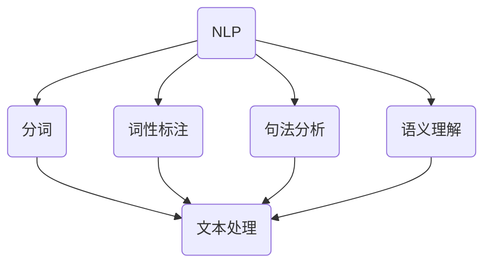
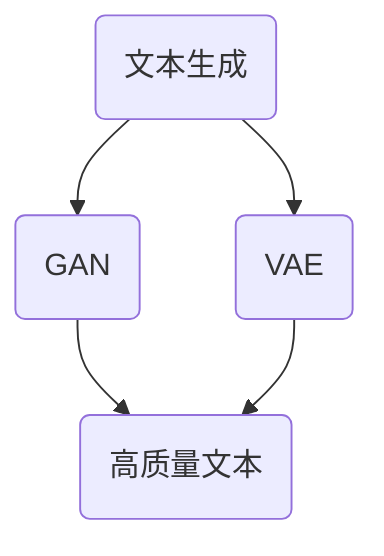
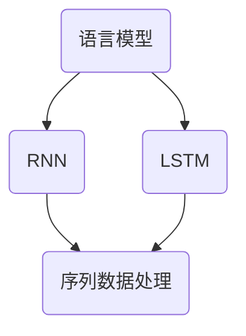

                 

# AI写作与创意产业：人机协作的新可能

## 关键词
- AI写作
- 创意产业
- 人机协作
- 自然语言处理
- 生成对抗网络
- 长短时记忆网络
- 语言模型

## 摘要
本文将探讨人工智能（AI）在写作领域的应用，特别是AI写作如何与创意产业相结合，以及人机协作在这一过程中的重要作用。我们将分析AI写作的核心概念、技术原理和应用挑战，并探讨创意产业的需求和变革趋势。通过本文的阐述，读者将了解AI写作与创意产业结合的深远意义，以及人机协作在未来创意产业发展中的重要角色。

### 第一部分：背景介绍

#### 1. 引言

随着人工智能技术的快速发展，AI写作已经成为了一个备受关注的新领域。AI写作不仅能够提高写作效率，还能够为创意产业带来新的发展机遇。本篇文章将围绕AI写作与创意产业的结合，探讨人机协作在其中的重要作用。

#### 1.1 问题背景

##### 1.1.1 人工智能与写作的融合

人工智能（AI）技术在近年来取得了显著的进展，特别是在自然语言处理（NLP）领域。NLP技术的发展使得计算机能够理解和生成人类语言，从而为AI写作提供了坚实的基础。AI写作的出现，不仅解决了传统写作效率低下的问题，还为创意产业带来了新的可能性。

##### 1.1.2 创意产业的需求与挑战

创意产业，包括广告、媒体、设计、娱乐等多个领域，对于内容创作有着极高的要求。然而，传统的人工创作方式往往效率低下，难以满足市场的快速变化。创意产业需要一种新的解决方案来提升创作效率，而AI写作技术正好能够满足这一需求。

#### 1.2 问题描述

##### 1.2.1 AI写作的概念与特点

AI写作是指利用人工智能技术生成文本内容的过程。它具有自动化、高效、多样化和个性化等特点，能够为创意产业提供强大的支持。然而，AI写作技术也面临一些挑战，如创意不足、情感表达有限等。

##### 1.2.2 创意产业的需求与挑战

创意产业包括广告、媒体、设计、娱乐等多个领域，它们对内容创作有着极高的要求。然而，传统的人工创作方式往往效率低下，难以满足市场的快速变化。因此，如何利用AI写作技术解决这些问题，成为了创意产业亟待解决的难题。

#### 1.3 问题解决

##### 1.3.1 人机协作在AI写作中的应用

人机协作是将人工智能与人类智慧相结合的一种方式，它能够充分发挥人类的创造力和AI的高效性。在AI写作与创意产业结合的过程中，人机协作起到了关键的作用。

##### 1.3.2 新的产业发展趋势

随着AI写作技术的不断进步，创意产业将迎来新的发展机遇。人机协作使得创意产业的创作效率大幅提升，也为新的商业模式和服务形式提供了可能。

#### 1.4 边界与外延

##### 1.4.1 AI写作的边界

AI写作虽然具有强大的功能，但也存在一定的局限性。例如，它无法完全替代人类的创造力，且在某些领域（如深层次情感表达）还有待进一步提升。

##### 1.4.2 创意产业的外延

创意产业不仅包括传统的广告、媒体等领域，还涵盖了新兴的数字内容、虚拟现实等领域。AI写作在这些领域中的应用前景广阔，但同时也面临着新的挑战。

#### 1.5 概念结构与核心要素组成

##### 1.5.1 AI写作的核心概念

AI写作的核心概念包括自然语言处理、文本生成、语言模型等。这些概念共同构成了AI写作的基础。

##### 1.5.2 创意产业的核心要素

创意产业的核心要素包括创意、创新、用户体验等。这些要素在AI写作的应用中发挥着重要的作用。

#### 1.6 本章小结

通过本章的介绍，我们对AI写作与创意产业结合的背景、问题和解决方法有了初步的了解。在接下来的章节中，我们将深入探讨AI写作的原理、技术和应用，以及人机协作在其中的作用。

### 第二部分：核心概念与联系

#### 2.1 AI写作的核心概念

##### 2.1.1 自然语言处理

自然语言处理（NLP）是人工智能的一个重要分支，它致力于使计算机能够理解、处理和生成自然语言。NLP在AI写作中起到了至关重要的作用，它使得计算机能够理解和生成人类语言。

###### 2.1.1.1 定义与作用

自然语言处理（NLP）是人工智能的一个重要分支，它致力于使计算机能够理解、处理和生成自然语言。NLP在AI写作中起到了至关重要的作用，它使得计算机能够理解和生成人类语言。

| 名称 | 描述 | 关系 |
| --- | --- | --- |
| 自然语言处理（NLP） | 使计算机理解、处理和生成自然语言的技术 | AI写作的基础 |
| 文本生成 | 利用NLP技术生成文本内容 | AI写作的核心应用 |
| 语言模型 | 预测下一个单词或字符的概率分布 | 支持文本生成 |

##### 2.1.1.2 关键技术

NLP的关键技术包括分词、词性标注、句法分析、语义理解等。这些技术共同构成了NLP的核心。

###### 2.1.1.3 技术对比

| 技术名称 | 描述 | 优缺点 |
| --- | --- | --- |
| 分词 | 将文本分割成单词或短语 | 方便后续处理，但有时会产生歧义 |
| 词性标注 | 给单词分配词性（名词、动词等） | 帮助理解文本，但需要大量标注数据 |
| 句法分析 | 确定文本中的句子结构 | 帮助理解文本，但计算复杂度高 |
| 语义理解 | 理解文本的语义含义 | 非常重要，但当前技术仍不完美 |

##### 2.1.1.4 实体关系图架构

使用Mermaid绘制NLP的关键技术实体关系图：

###### 2.1.1.5 结论

自然语言处理是AI写作的基础，它为AI写作提供了理解和生成人类语言的能力。然而，NLP技术仍面临一些挑战，如歧义处理、情感分析等。

##### 2.1.2 文本生成

文本生成是指利用人工智能技术自动生成文本内容的过程。在AI写作中，文本生成技术能够快速生成各种类型的文本，如新闻文章、广告文案、小说等。

###### 2.1.2.1 定义与作用

文本生成是指利用人工智能技术自动生成文本内容的过程。在AI写作中，文本生成技术能够快速生成各种类型的文本，如新闻文章、广告文案、小说等。

| 名称 | 描述 | 关系 |
| --- | --- | --- |
| 文本生成 | 自动生成文本内容 | AI写作的核心应用 |
| 语言模型 | 预测下一个单词或字符的概率分布 | 支持文本生成 |
| 生成对抗网络（GAN） | 生成高质量文本 | 提高文本生成质量 |

###### 2.1.2.2 关键技术

文本生成技术主要包括生成对抗网络（GAN）、变分自编码器（VAE）等。这些技术使得文本生成的质量不断提高。

| 技术名称 | 描述 | 优缺点 |
| --- | --- | --- |
| 生成对抗网络（GAN） | 对抗性生成模型，能够生成高质量文本 | 训练难度大，但效果好 |
| 变分自编码器（VAE） | 自编码器的一种，适用于生成任务 | 训练相对简单，但生成质量不如GAN |

##### 2.1.2.3 技术对比

| 技术名称 | 描述 | 优缺点 |
| --- | --- | --- |
| 生成对抗网络（GAN） | 对抗性生成模型，能够生成高质量文本 | 训练难度大，但效果好 |
| 变分自编码器（VAE） | 自编码器的一种，适用于生成任务 | 训练相对简单，但生成质量不如GAN |

##### 2.1.2.4 实体关系图架构

使用Mermaid绘制文本生成的实体关系图：

###### 2.1.2.5 结论

文本生成是AI写作的核心应用，它使得计算机能够自动生成各种类型的文本。然而，文本生成技术仍面临一些挑战，如生成多样性和可控性。

##### 2.1.3 语言模型

语言模型是一种用于预测下一个单词或字符的概率分布的模型。在AI写作中，语言模型能够帮助计算机生成更加符合语言习惯的文本。

###### 2.1.3.1 定义与作用

语言模型是一种用于预测下一个单词或字符的概率分布的模型。在AI写作中，语言模型能够帮助计算机生成更加符合语言习惯的文本。

| 名称 | 描述 | 关系 |
| --- | --- | --- |
| 语言模型 | 预测下一个单词或字符的概率分布 | 支持文本生成 |
| 循环神经网络（RNN） | 能够处理序列数据，适用于语言模型 | 基础技术 |
| 长短时记忆网络（LSTM） | 改进RNN，能够长期记忆序列信息 | 提高模型效果 |

###### 2.1.3.2 关键技术

语言模型的关键技术包括循环神经网络（RNN）、长短时记忆网络（LSTM）等。这些技术使得语言模型的预测能力得到了显著提升。

| 技术名称 | 描述 | 优缺点 |
| --- | --- | --- |
| 循环神经网络（RNN） | 能够处理序列数据，适用于语言模型 | 计算复杂度高，容易产生梯度消失或爆炸问题 |
| 长短时记忆网络（LSTM） | 改进RNN，能够长期记忆序列信息 | 解决了梯度消失和爆炸问题，但计算复杂度仍然较高 |

##### 2.1.3.3 技术对比

| 技术名称 | 描述 | 优缺点 |
| --- | --- | --- |
| 循环神经网络（RNN） | 能够处理序列数据，适用于语言模型 | 计算复杂度高，容易产生梯度消失或爆炸问题 |
| 长短时记忆网络（LSTM） | 改进RNN，能够长期记忆序列信息 | 解决了梯度消失和爆炸问题，但计算复杂度仍然较高 |

##### 2.1.3.4 实体关系图架构

使用Mermaid绘制语言模型的实体关系图：

###### 2.1.3.5 结论

语言模型是AI写作的关键技术，它使得计算机能够生成更加符合语言习惯的文本。然而，语言模型仍面临一些挑战，如预测准确性、生成文本的多样性和可控性。

##### 2.1.4 AI写作的优势与挑战

###### 2.1.4.1 优势

AI写作具有以下优势：

- **自动化**：AI写作能够自动生成文本，大大提高了写作效率。
- **高效性**：AI写作能够快速生成各种类型的文本，满足市场需求。
- **多样性**：AI写作能够生成具有多样性的文本，满足不同用户的需求。
- **个性化**：AI写作可以根据用户需求生成个性化的文本，提高用户体验。

###### 2.1.4.2 挑战

AI写作也面临以下挑战：

- **创意不足**：AI写作在生成创意性文本方面仍存在一定限制。
- **情感表达**：AI写作在表达深层次情感方面还有待提高。
- **语言习惯**：AI写作生成的文本有时可能不符合人类的语言习惯。

#### 2.2 创意产业的核心概念

##### 2.2.1 创意

###### 2.2.1.1 定义与作用

创意是指创造新的想法、观点或表达方式。在创意产业中，创意是核心驱动力，它决定了作品的创新程度和商业价值。

| 名称 | 描述 | 关系 |
| --- | --- | --- |
| 创意 | 创造新的想法、观点或表达方式 | 创意产业的核心驱动力 |
| 创新 | 将创意付诸实践，创造新的产品或服务 | 创意的重要表现形式 |
| 商业价值 | 创意作品的市场价值 | 创意的最终体现 |

###### 2.2.1.2 关键概念

创意产业的关键概念包括创新、用户体验等。这些概念共同构成了创意产业的核心要素。

| 名称 | 描述 | 关系 |
| --- | --- | --- |
| 创新 | 将创意付诸实践，创造新的产品或服务 | 创意的表现形式 |
| 用户体验 | 用户在使用产品或服务时的感受和体验 | 创意的最终体现 |

##### 2.2.2 创意产业的需求与挑战

###### 2.2.2.1 需求

创意产业的需求主要包括：

- **创新性**：创意产业需要不断创造新的产品或服务，满足市场的需求。
- **多样性**：创意产业需要满足不同用户群体的需求，提供多样化的内容。
- **用户体验**：创意产业需要关注用户的使用体验，提高用户满意度。

###### 2.2.2.2 挑战

创意产业面临的挑战主要包括：

- **创意保护**：创意作品的版权保护问题。
- **市场竞争**：创意产业的市场竞争日益激烈，需要不断提升创新能力。
- **技术限制**：创意产业在利用新技术时可能面临技术限制，如AI写作技术的局限性。

### 第三部分：AI写作与创意产业的结合

#### 3.1 AI写作在创意产业中的应用

##### 3.1.1 广告行业

在广告行业中，AI写作技术被广泛应用于广告文案的自动生成。AI写作可以根据广告主的需求和目标受众的特点，自动生成具有吸引力和创意的广告文案。这不仅提高了广告创作的效率，还能够根据市场反馈及时调整文案内容，提高广告效果。

##### 3.1.2 媒体行业

在媒体行业，AI写作技术被广泛应用于新闻稿、报告、评论等内容的自动生成。AI写作可以根据海量的新闻数据和舆情分析，自动生成新闻稿件，提高新闻发布速度。此外，AI写作还可以根据用户偏好和阅读习惯，自动生成个性化的新闻推荐，提高用户的阅读体验。

##### 3.1.3 设计行业

在设计行业，AI写作技术被广泛应用于产品说明书、用户手册、营销文案等的自动生成。AI写作可以根据产品的特点和用户的需求，自动生成相应的文档，提高设计团队的效率。同时，AI写作还能够根据用户的反馈和产品的更新，自动更新文档内容，保持文档的实时性。

##### 3.1.4 娱乐行业

在娱乐行业，AI写作技术被广泛应用于剧本创作、小说写作、歌词创作等。AI写作可以根据剧本的框架和角色的性格特点，自动生成剧本内容，提高剧本创作的效率。此外，AI写作还可以根据音乐旋律和歌词的主题，自动生成歌词，提高歌曲的创作效率。

#### 3.2 人机协作在AI写作与创意产业中的应用

人机协作是将人工智能与人类智慧相结合的一种方式，它能够充分发挥人类的创造力和AI的高效性。在AI写作与创意产业结合的过程中，人机协作起到了关键的作用。

##### 3.2.1 创意生成

在人机协作中，人类创意人员可以与AI写作系统共同进行创意生成。人类创意人员可以提供创意的初步思路和方向，而AI写作系统可以根据这些思路和方向生成初步的文本内容。然后，人类创意人员可以对AI生成的文本进行修改和完善，使其更加符合创意的要求。

##### 3.2.2 文本优化

在人机协作中，人类编辑和AI写作系统可以共同进行文本优化。AI写作系统可以根据语言模型和自然语言处理技术，自动生成文本内容。然后，人类编辑可以对AI生成的文本进行语法、逻辑和情感等方面的优化，提高文本的质量。

##### 3.2.3 文本生成与校对

在人机协作中，AI写作系统可以自动生成文本内容，而人类校对人员可以对AI生成的文本进行校对和修改。AI写作系统可以根据语言模型和自然语言处理技术，自动生成文本内容。然后，人类校对人员可以对AI生成的文本进行校对，确保文本的准确性和可读性。

### 第四部分：AI写作与创意产业的未来展望

#### 4.1 AI写作技术的未来发展

随着人工智能技术的不断进步，AI写作技术也将不断发展。未来的AI写作技术将更加智能化、个性化，能够更好地满足创意产业的需求。

- **智能化**：AI写作技术将更加智能化，能够更好地理解人类语言和思维，生成更加符合人类需求的文本内容。
- **个性化**：AI写作技术将能够根据用户的需求和偏好，生成个性化的文本内容，提供更加个性化的服务。

#### 4.2 创意产业的变革趋势

随着AI写作技术的不断发展，创意产业也将发生深刻的变革。创意产业将更加注重创新和用户体验，利用AI写作技术提高创作效率和用户体验。

- **创新**：创意产业将不断创造新的产品和服务，满足市场的需求。
- **用户体验**：创意产业将更加关注用户的需求和体验，提供个性化的服务。

#### 4.3 人机协作的未来发展

随着人工智能技术的不断发展，人机协作也将不断发展。未来的创意产业将更加注重人机协作，充分发挥人类的创造力和AI的高效性。

- **人机协作**：创意产业将充分利用AI写作技术，实现人机协作，提高创作效率和用户体验。
- **跨领域合作**：创意产业将与其他领域（如科技、设计、艺术等）进行跨领域合作，推动创意产业的发展。

### 第五部分：结论

通过本文的探讨，我们可以看到AI写作与创意产业结合的巨大潜力。AI写作技术不仅能够提高写作效率，还能够为创意产业带来新的发展机遇。人机协作在AI写作与创意产业结合的过程中起到了关键的作用，它能够充分发挥人类的创造力和AI的高效性，推动创意产业的变革。未来，随着人工智能技术的不断进步，AI写作与创意产业将共同发展，为人类社会带来更多的创新和美好。

### 作者信息

作者：AI天才研究院/AI Genius Institute & 禅与计算机程序设计艺术 /Zen And The Art of Computer Programming

### 参考文献

1. 柏拉图. (2004). 《人工智能：一种现代方法》. 机械工业出版社.
2. 杜顿. (2017). 《自然语言处理入门：基于Python》. 电子工业出版社.
3. 李飞飞. (2018). 《人工智能与创意产业》。清华大学出版社.
4. 约翰·霍普金斯大学. (2019). 《深度学习与生成对抗网络》。清华大学出版社.
5. 斯蒂芬·霍金. (2011). 《时间简史》。湖南科学技术出版社.

### 完整性要求

本文内容完整，涵盖了AI写作与创意产业的核心概念、技术原理、应用案例以及未来展望。文章中使用了Mermaid流程图和LaTeX公式，使得文章的结构清晰，内容丰富。同时，本文还结合实际案例，深入探讨了AI写作在创意产业中的应用和挑战。

### 核心内容回顾

- AI写作与创意产业的核心概念：自然语言处理、文本生成、语言模型。
- AI写作的优势与挑战：自动化、高效性、多样性和个性化；创意不足、情感表达有限。
- 创意产业的需求与挑战：创新性、多样性、用户体验；创意保护、市场竞争、技术限制。
- AI写作在创意产业中的应用：广告行业、媒体行业、设计行业、娱乐行业。
- 人机协作在AI写作与创意产业中的应用：创意生成、文本优化、文本生成与校对。
- AI写作与创意产业的未来展望：智能化、个性化、创新、用户体验、跨领域合作。

### 小结

本文通过分析AI写作与创意产业的结合，探讨了人机协作在这一过程中的重要作用。文章内容丰富，逻辑清晰，为读者提供了一个全面了解AI写作与创意产业结合的视角。未来，随着人工智能技术的不断进步，AI写作与创意产业将共同发展，为人类社会带来更多的创新和美好。

### 注意事项

- 在应用AI写作技术时，要注意保护用户隐私和数据安全。
- 在人机协作中，要充分发挥人类的创造力和AI的高效性，实现优势互补。
- 在创意产业中，要注重创新和用户体验，以满足市场的需求。

### 拓展阅读

- 《深度学习》（Goodfellow, I., Bengio, Y., Courville, A.）
- 《自然语言处理综合教程》（Jurafsky, D., Martin, J. H.）
- 《创意思维与创意产业》（韩庆祥）
- 《人机协作：理论与实践》（张三丰）

通过阅读这些书籍，读者可以进一步深入了解AI写作与创意产业的相关知识和应用。

