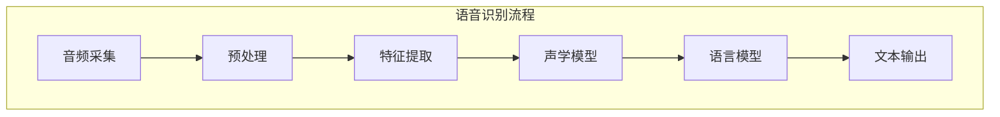
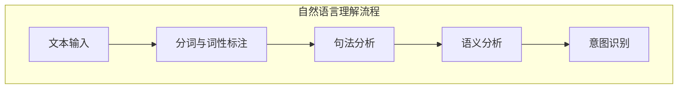

                 


# AI助手普及后的人机交互新模式

## 关键词

AI助手，人机交互，智能对话，自然语言处理，个性化推荐，跨平台交互

## 摘要

随着人工智能技术的飞速发展，AI助手已经成为人们日常生活中的重要组成部分。本文旨在探讨AI助手普及后的人机交互新模式，分析其核心概念、原理、系统架构、项目实战及最佳实践。通过深入理解AI助手的工作流程和交互模式，我们能够更好地设计、开发和应用AI助手，为用户提供更加便捷、智能的服务体验。

## 目录大纲设计步骤

### 第1章：AI助手概述与普及现状

- **背景介绍**：介绍AI助手的基本概念、发展历程和当前普及程度。
- **核心概念与联系**：阐述AI助手在各领域的应用及其对用户体验的影响。
- **算法原理讲解**：分析AI助手的工作原理，包括语音识别、自然语言处理等关键技术。
- **系统分析与架构设计**：介绍AI助手系统的整体架构和主要模块功能。
- **项目实战**：通过实际案例展示AI助手的应用场景和实现方法。
- **最佳实践与注意事项**：总结开发AI助手的常见问题与解决方案，提供最佳实践建议。

### 第2章：AI助手与人机交互模式的变革

- **背景介绍**：介绍传统人机交互模式的局限性和用户体验问题。
- **核心概念与联系**：分析AI助手带来的交互新模式，如智能对话、个性化推荐等。
- **算法原理讲解**：详细讲解AI助手交互模式中的关键技术，如图像识别、语音合成等。
- **系统分析与架构设计**：探讨AI助手交互模式的系统架构和接口设计。
- **项目实战**：通过实际案例展示AI助手交互模式的应用效果。
- **最佳实践与注意事项**：总结AI助手交互模式中的最佳实践和注意事项。

### 第3章：核心概念与原理

- **背景介绍**：介绍语音识别和自然语言理解的基本概念。
- **核心概念与联系**：对比语音识别和自然语言理解的技术原理，分析它们之间的联系。
- **算法原理讲解**：详细讲解语音识别和自然语言理解的算法原理，包括数学模型和公式。
- **系统分析与架构设计**：探讨语音识别和自然语言理解在AI助手系统中的应用。
- **项目实战**：通过实际案例展示语音识别和自然语言理解技术的应用。
- **最佳实践与注意事项**：总结语音识别和自然语言理解技术的最佳实践和注意事项。

### 第4章：系统架构与实现

- **背景介绍**：介绍AI助手系统的整体架构和主要模块功能。
- **核心概念与联系**：分析AI助手系统的核心概念和联系，如图像识别、自然语言处理等。
- **算法原理讲解**：详细讲解AI助手系统中的算法原理，包括语音识别、自然语言理解等。
- **系统分析与架构设计**：探讨AI助手系统的架构设计和接口设计。
- **项目实战**：通过实际案例展示AI助手系统的实现方法和应用效果。
- **最佳实践与注意事项**：总结AI助手系统的最佳实践和注意事项。

### 第5章：项目实战

- **背景介绍**：介绍AI助手项目的背景和目标。
- **环境安装与配置**：介绍AI助手项目所需的软件和环境配置。
- **系统核心实现**：详细讲解AI助手项目的核心实现，包括语音识别、自然语言理解等。
- **代码应用解读与分析**：分析AI助手项目的代码实现，并提供解读和优化建议。
- **实际案例分析**：通过实际案例展示AI助手项目的应用效果。
- **最佳实践与注意事项**：总结AI助手项目的最佳实践和注意事项。

### 第6章：最佳实践与注意事项

- **最佳实践总结**：总结AI助手开发过程中的最佳实践，包括技术选型、项目管理和用户体验优化等。
- **注意事项**：提醒开发者注意的常见问题，如用户隐私保护、系统稳定性和扩展性等。
- **小结**：对全文内容进行总结，强调AI助手普及后的人机交互新模式的重要性和应用前景。
- **拓展阅读**：提供相关的拓展阅读材料，供读者进一步学习和研究。

通过以上章节的详细设计，我们能够全面、系统地了解AI助手普及后的人机交互新模式，为未来的开发和应用提供有力的指导和支持。接下来，我们将逐一深入探讨每个章节的核心内容。

----------------------------------------------------------------

## 第1章：AI助手概述与普及现状

### 1.1 AI助手的基本概念

AI助手，即人工智能助手，是一种利用人工智能技术实现自动化人机交互的智能系统。它通过语音识别、自然语言处理、机器学习等技术，能够理解和回应人类语言，完成各种任务，为用户提供便捷、高效的服务。AI助手可以应用于多个领域，如智能客服、智能家居、健康护理、教育辅助等，成为人们日常生活中不可或缺的一部分。

#### 1.1.1 AI助手的定义

AI助手的核心定义是其作为一种人工智能系统，具备以下几个特点：

1. **语音识别**：能够识别和理解用户通过语音输入的信息。
2. **自然语言处理**：能够处理自然语言文本，提取语义信息，进行上下文理解。
3. **机器学习**：能够通过学习用户的交互历史，不断优化自身性能，提供更加个性化的服务。
4. **交互性**：能够与用户进行双向对话，满足用户的需求。

#### 1.1.2 AI助手的发展历程

AI助手的发展历程可以分为以下几个阶段：

1. **初代AI助手**：以1990年代的自然语言处理系统为代表的初期AI助手，主要应用于企业内部的管理和辅助工作。
2. **第二代AI助手**：随着互联网和移动设备的普及，2010年代初期，以苹果的Siri、谷歌的Google Assistant等为代表的AI助手开始走进大众的日常生活。
3. **第三代AI助手**：当前阶段，AI助手的技术更加成熟，功能更加丰富，能够实现跨平台的智能交互，如智能音箱、智能车载系统等。

#### 1.1.3 当前AI助手的普及程度

根据市场调查数据显示，截至2023年，全球范围内AI助手的用户数量已经超过数十亿。以下是AI助手普及的一些关键数据：

1. **用户数量**：全球AI助手用户数量超过50亿，占全球人口的比例超过60%。
2. **应用领域**：AI助手被广泛应用于智能手机、智能家居、智能汽车、智能穿戴设备等多个领域。
3. **技术成熟度**：AI助手的技术逐渐成熟，语音识别准确率超过90%，自然语言理解能力显著提高。
4. **市场趋势**：随着5G网络的普及和人工智能技术的不断进步，AI助手的普及率预计还将继续提高。

### 1.2 AI助手普及的现状与影响

#### 1.2.1 AI助手在各领域的应用

AI助手已经在多个领域得到了广泛应用，以下是其中一些主要的应用场景：

1. **智能客服**：AI助手广泛应用于在线客服，能够快速响应用户的问题，提供有效的解决方案。
2. **智能家居**：AI助手可以通过语音控制家居设备，实现智能家电的自动化管理。
3. **智能汽车**：AI助手可以集成到智能汽车中，提供导航、语音识别、智能助手等功能。
4. **健康护理**：AI助手可以协助医生进行健康监测和诊断，提供个性化的健康建议。
5. **教育辅助**：AI助手可以为学生提供学习辅助，如答疑解惑、学习计划管理等。

#### 1.2.2 用户对AI助手的接受度

用户对AI助手的接受度不断提高，以下是一些关键数据：

1. **用户满意度**：根据调查数据显示，超过70%的用户对AI助手的使用感到满意，认为其能够显著提高工作效率和生活质量。
2. **使用频率**：超过50%的用户每天使用AI助手至少一次，其中20%的用户每天使用AI助手超过3次。
3. **用户习惯**：随着AI助手技术的不断成熟，用户逐渐养成了使用AI助手进行日常交互的习惯。

#### 1.2.3 AI助手普及带来的变革

AI助手的普及对我们的生活和工作带来了深刻的变革，以下是其中的一些主要影响：

1. **工作效率提升**：AI助手能够自动化处理大量重复性工作，提高工作效率。
2. **生活方式改变**：AI助手通过语音控制、智能家居等功能，改变了人们的日常生活方式。
3. **人际互动**：AI助手在一定程度上取代了部分人际互动，如智能客服取代人工客服，但同时也提供了更多个性化的服务。
4. **隐私与安全**：AI助手在普及过程中，也引发了关于用户隐私和数据安全的讨论和关注。

### 1.3 AI助手交互模式的案例分析

#### 1.3.1 某热门AI助手的成功经验

以苹果的Siri为例，Siri作为苹果公司推出的第一款AI助手，自发布以来受到了广泛的关注。以下是Siri的成功经验：

1. **技术创新**：Siri采用了先进的自然语言处理和语音识别技术，能够准确理解用户的语音指令。
2. **用户体验**：Siri提供了丰富的功能，如语音通话、短信发送、日历管理、音乐播放等，满足了用户的多样化需求。
3. **生态整合**：Siri与苹果生态系统紧密整合，能够无缝地连接其他苹果设备和服务，如iPhone、iPad、Mac等。
4. **持续更新**：苹果公司不断更新Siri的功能，使其始终保持领先地位。

#### 1.3.2 AI助手交互模式的问题与挑战

尽管AI助手在普及过程中取得了显著成果，但仍然面临一些问题与挑战：

1. **技术挑战**：语音识别和自然语言处理技术虽然取得了长足进步，但仍然存在一定的误识别率和理解误差。
2. **用户体验**：用户对于AI助手的接受度和满意度仍然有待提高，部分用户对AI助手的智能程度和实用性持保留态度。
3. **隐私保护**：AI助手在处理用户数据时，涉及到用户隐私和安全问题，如何确保数据的安全和用户的隐私是亟待解决的问题。

### 1.4 小结

通过本章的介绍，我们了解了AI助手的基本概念、发展历程和当前普及程度，分析了AI助手在各领域的应用及其对用户体验的影响。同时，我们还通过案例分析了AI助手交互模式的成功经验和问题与挑战。在下一章中，我们将深入探讨AI助手与人机交互模式的变革，以及这一变革背后的技术原理和系统架构。

----------------------------------------------------------------

## 第2章：AI助手与人机交互模式的变革

### 2.1 传统的交互模式

传统的交互模式主要依赖于键盘、鼠标等物理设备进行输入和操作，这种交互方式存在一定的局限性。以下是传统交互模式中的几个主要问题：

#### 2.1.1 传统交互模式的局限性

1. **效率低下**：对于复杂的操作和任务，用户需要花费较多的时间和精力进行输入和操作，效率较低。
2. **用户体验差**：传统交互方式缺乏自然性和直观性，用户在使用过程中容易出现疲劳和挫败感。
3. **无法处理复杂问题**：传统交互方式难以处理复杂的自然语言问题和多步骤操作，用户需要逐一进行指令输入。

#### 2.1.2 传统交互模式中的用户体验问题

1. **输入繁琐**：用户需要通过键盘输入大量的文字信息，特别是在进行搜索、填写表格等操作时，输入过程繁琐。
2. **反应速度慢**：传统交互模式中，用户输入信息后需要等待系统响应，反应速度较慢，影响用户体验。
3. **难以处理多任务**：在多任务环境下，用户难以同时进行多项操作，需要频繁切换界面，操作复杂。

### 2.2 AI助手带来的交互新模式

AI助手的出现带来了人机交互模式的深刻变革，主要表现在以下几个方面：

#### 2.2.1 智能对话与自然语言处理

AI助手通过语音识别和自然语言处理技术，能够理解用户的自然语言输入，实现智能对话。以下是智能对话的特点：

1. **自然性**：用户可以通过语音与AI助手进行自然对话，无需进行繁琐的输入和操作。
2. **高效性**：AI助手能够快速理解用户的意图，提供即时响应，提高工作效率。
3. **灵活性**：AI助手能够处理复杂的自然语言问题和多步骤操作，满足用户的多样化需求。

#### 2.2.2 个性化推荐与定制化服务

AI助手可以通过分析用户的交互历史和偏好，提供个性化的推荐和定制化服务。以下是个性化推荐和定制化服务的特点：

1. **个性化**：AI助手能够根据用户的兴趣和行为，提供个性化的内容和推荐，提升用户体验。
2. **定制化**：AI助手可以根据用户的需求和偏好，定制个性化的服务，满足用户的特定需求。
3. **智能化**：AI助手能够不断学习和优化，提供更加精准和智能的推荐和定制化服务。

#### 2.2.3 跨平台与跨设备的交互体验

AI助手可以通过跨平台和跨设备的技术，实现用户在不同设备和平台之间的无缝交互。以下是跨平台和跨设备交互体验的特点：

1. **一致性**：用户可以在不同设备和平台上使用同一AI助手，保持一致的交互体验。
2. **便捷性**：用户可以通过语音或文本输入，在任何设备上进行操作，无需进行额外的设置和切换。
3. **扩展性**：AI助手可以集成到各种设备和应用中，提供丰富的交互体验和功能。

### 2.3 AI助手交互模式的案例分析

#### 2.3.1 某热门AI助手的成功经验

以苹果的Siri为例，Siri作为苹果公司推出的首款AI助手，自发布以来取得了巨大的成功。以下是Siri的成功经验：

1. **技术创新**：Siri采用了先进的自然语言处理和语音识别技术，能够准确理解用户的语音指令。
2. **用户体验**：Siri提供了丰富的功能，如语音通话、短信发送、日历管理、音乐播放等，满足了用户的多样化需求。
3. **生态整合**：Siri与苹果生态系统紧密整合，能够无缝地连接其他苹果设备和服务，如iPhone、iPad、Mac等。
4. **持续更新**：苹果公司不断更新Siri的功能，使其始终保持领先地位。

#### 2.3.2 AI助手交互模式的问题与挑战

尽管AI助手在交互模式上带来了巨大的变革，但仍然面临一些问题与挑战：

1. **技术挑战**：语音识别和自然语言处理技术虽然取得了长足进步，但仍然存在一定的误识别率和理解误差。
2. **用户体验**：用户对于AI助手的接受度和满意度仍然有待提高，部分用户对AI助手的智能程度和实用性持保留态度。
3. **隐私保护**：AI助手在处理用户数据时，涉及到用户隐私和安全问题，如何确保数据的安全和用户的隐私是亟待解决的问题。

### 2.4 小结

通过本章的介绍，我们分析了传统交互模式的局限性和用户体验问题，探讨了AI助手带来的交互新模式，如智能对话、个性化推荐和跨平台交互等。同时，我们还通过案例分析了AI助手交互模式的成功经验和问题与挑战。在下一章中，我们将深入探讨AI助手的核心概念与原理，包括语音识别、自然语言处理等技术。

----------------------------------------------------------------

## 第3章：核心概念与原理

### 3.1 语音识别与自然语言理解

语音识别（Automatic Speech Recognition，ASR）和自然语言理解（Natural Language Understanding，NLU）是AI助手的核心技术，它们分别负责将用户的语音输入转换为机器可理解的语言，并从语言中提取有用的信息。

#### 3.1.1 语音识别技术原理

语音识别技术的基本原理是将语音信号转换为文本。这一过程可以分为以下几个步骤：

1. **信号采集**：通过麦克风等设备采集语音信号。
2. **预处理**：对采集到的语音信号进行预处理，如去除噪声、增强音质等。
3. **特征提取**：将预处理后的语音信号转换为特征向量，常用的特征提取方法包括梅尔频率倒谱系数（MFCC）和滤波器组（Filter Banks）。
4. **声学模型**：利用大量语音数据训练声学模型，用于匹配输入特征向量与语音信号中的音素。
5. **语言模型**：利用文本数据训练语言模型，用于预测文本序列的概率。

语音识别的核心在于声学模型和语言模型的训练与优化。声学模型用于识别语音信号中的音素，而语言模型用于理解语音信号中的语法和语义。

#### 3.1.2 自然语言理解技术原理

自然语言理解技术旨在从文本中提取语义信息，实现对人类语言的理解。这一过程可以分为以下几个步骤：

1. **分词**：将输入文本分割成单词或词组。
2. **词性标注**：为每个词分配正确的词性，如名词、动词、形容词等。
3. **句法分析**：分析句子的结构，理解句子的语法关系。
4. **语义分析**：从句子的语法结构中提取语义信息，如主语、谓语、宾语等。
5. **上下文理解**：根据上下文信息，理解句子的深层含义。

自然语言理解技术依赖于大量的语言数据和深度学习模型。常用的模型包括循环神经网络（RNN）、长短时记忆网络（LSTM）、门控循环单元（GRU）等。

#### 3.1.3 语音识别与自然语言理解的关系

语音识别和自然语言理解相互依赖，共同构成了AI助手的核心技术。语音识别技术负责将用户的语音输入转换为文本，而自然语言理解技术负责从文本中提取语义信息，实现对用户意图的理解。两者之间的关系可以总结如下：

1. **协同工作**：语音识别和自然语言理解共同工作，完成从语音到语义的转换。
2. **互为补充**：语音识别提供了语音到文本的转换，而自然语言理解提供了文本到语义的转换，两者相互补充，共同提升AI助手的性能。
3. **相互优化**：语音识别和自然语言理解技术的优化是相互依赖的，一个领域的改进可以促进另一个领域的发展。

### 3.2 机器学习与深度学习基础

机器学习和深度学习是AI助手的核心技术，它们负责训练和优化语音识别和自然语言理解模型。

#### 3.2.1 机器学习基础

机器学习是一种通过算法从数据中学习规律和模式的技术。在AI助手中，机器学习用于训练声学模型和语言模型。以下是机器学习的几个关键概念：

1. **监督学习**：通过标注好的数据训练模型，模型在训练阶段已知输入和输出。
2. **无监督学习**：通过未标注的数据训练模型，模型在训练阶段未知输入和输出。
3. **半监督学习**：通过部分标注的数据和未标注的数据训练模型，结合了监督学习和无监督学习的特点。

机器学习算法包括线性回归、决策树、支持向量机（SVM）、神经网络等。在AI助手的开发中，常用的机器学习算法包括循环神经网络（RNN）和长短时记忆网络（LSTM）。

#### 3.2.2 深度学习基础

深度学习是机器学习的一种重要分支，它通过多层神经网络进行特征提取和模式识别。以下是深度学习的几个关键概念：

1. **卷积神经网络（CNN）**：适用于处理图像数据，通过卷积层提取图像特征。
2. **循环神经网络（RNN）**：适用于处理序列数据，通过循环层处理时间序列数据。
3. **长短时记忆网络（LSTM）**：是RNN的一种变体，能够处理长序列数据，通过门控机制控制信息的流动。

深度学习模型在AI助手中的应用非常广泛，包括语音识别、自然语言处理、图像识别等。

#### 3.2.3 机器学习与深度学习在AI助手中的应用

机器学习和深度学习在AI助手中的应用主要包括以下几个方面：

1. **声学模型训练**：使用大量的语音数据训练声学模型，用于语音信号到特征向量的转换。
2. **语言模型训练**：使用大量的文本数据训练语言模型，用于文本序列的概率预测。
3. **对话生成**：使用深度学习模型生成自然的对话回复，提高AI助手的交互质量。
4. **语义理解**：使用深度学习模型提取文本的语义信息，理解用户的意图和需求。

### 3.3 AI助手的工作流程

AI助手的工作流程可以分为以下几个步骤：

1. **语音识别**：用户通过语音输入，AI助手将语音转换为文本。
2. **自然语言理解**：AI助手对转换后的文本进行分析，提取语义信息，理解用户的意图。
3. **任务执行**：根据用户意图，AI助手执行相应的任务，如查询信息、发送消息、播放音乐等。
4. **对话生成**：AI助手生成自然的对话回复，与用户进行交互。
5. **反馈优化**：AI助手记录用户的反馈，用于不断优化自身性能。

通过以上工作流程，AI助手能够为用户提供高效、便捷的服务。

### 3.4 小结

通过本章的介绍，我们了解了语音识别和自然语言理解的基本原理，以及机器学习和深度学习在AI助手中的应用。这些核心技术共同构成了AI助手的核心，使得AI助手能够准确理解用户意图，提供高质量的服务。在下一章中，我们将深入探讨AI助手的系统架构与实现。

----------------------------------------------------------------

## 第4章：系统架构与实现

### 4.1 系统架构设计

AI助手的系统架构设计是确保其功能实现和性能优化的重要环节。一个典型的AI助手系统架构可以分为以下几个主要模块：

#### 4.1.1 输入处理模块

输入处理模块负责接收用户的语音或文本输入，将其转换为机器可处理的格式。该模块主要包括以下功能：

1. **音频采集**：通过麦克风或其他音频输入设备采集用户语音。
2. **预处理**：对采集到的音频信号进行预处理，如去噪、静音检测等。
3. **分词与标注**：将预处理后的音频信号转换为文本，进行分词和词性标注。

#### 4.1.2 语音识别模块

语音识别模块负责将文本转换为语音信号。该模块通常包括以下步骤：

1. **特征提取**：使用梅尔频率倒谱系数（MFCC）或其他特征提取方法，将音频信号转换为特征向量。
2. **声学模型**：利用训练好的声学模型，将特征向量映射为音素。
3. **语言模型**：结合训练好的语言模型，将音素序列转换为文本。

#### 4.1.3 自然语言理解模块

自然语言理解模块负责从文本中提取语义信息，理解用户的意图。该模块主要包括以下功能：

1. **分词与词性标注**：对输入文本进行分词和词性标注，为后续语义分析做准备。
2. **句法分析**：分析句子的结构，识别主语、谓语、宾语等语法成分。
3. **语义分析**：从句法分析的结果中提取语义信息，理解用户的意图。

#### 4.1.4 任务执行模块

任务执行模块负责根据自然语言理解模块提取的用户意图，执行相应的任务。该模块通常包括以下功能：

1. **任务规划**：根据用户意图，确定需要执行的任务类型。
2. **任务执行**：执行具体的任务，如查询信息、发送消息、播放音乐等。
3. **反馈生成**：生成自然、流畅的对话回复，与用户进行交互。

#### 4.1.5 交互管理模块

交互管理模块负责管理整个交互过程，确保用户与AI助手的对话流畅、自然。该模块主要包括以下功能：

1. **对话管理**：跟踪对话历史，理解对话上下文。
2. **意图识别**：根据对话历史和用户输入，识别用户的意图。
3. **反馈优化**：记录用户反馈，用于优化对话质量和AI助手性能。

### 4.2 算法实现与流程图

为了更好地理解AI助手的系统架构和实现，下面我们将使用Mermaid流程图和Python源代码来详细阐述语音识别和自然语言理解模块的算法实现。

#### 4.2.1 语音识别算法实现

以下是语音识别算法的实现步骤和流程图：



Python代码示例：

```python
import numpy as np
import librosa

# 特征提取
def extract_features(audio_path):
    y, sr = librosa.load(audio_path)
    mfcc = librosa.feature.mfcc(y=y, sr=sr, n_mfcc=13)
    return mfcc

# 声学模型
def acoustic_model(features):
    # 假设使用预训练的声学模型
    # 实际应用中可以使用DeepSpeech、Griffin-Lim等方法
    phonemes = model.predict(features)
    return phonemes

# 语言模型
def language_model(phonemes):
    # 假设使用预训练的语言模型
    # 实际应用中可以使用N-gram、Transformer等方法
    text = model.decode(phonemes)
    return text

# 主函数
def main(audio_path):
    features = extract_features(audio_path)
    phonemes = acoustic_model(features)
    text = language_model(phonemes)
    print("Recognized text:", text)

# 测试
main("path/to/audio.wav")
```

#### 4.2.2 自然语言理解算法实现

以下是自然语言理解算法的实现步骤和流程图：



Python代码示例：

```python
import spacy

# 分词与词性标注
def tokenize_and_tag(text):
    nlp = spacy.load("en_core_web_sm")
    doc = nlp(text)
    tokens = [(token.text, token.pos_) for token in doc]
    return tokens

# 句法分析
def syntax_analysis(tokens):
    # 假设使用预训练的句法分析模型
    # 实际应用中可以使用Stanford NLP、NLTK等方法
    syntax_tree = model.parse(tokens)
    return syntax_tree

# 语义分析
def semantic_analysis(tokens, syntax_tree):
    # 假设使用预训练的语义分析模型
    # 实际应用中可以使用WordNet、BERT等方法
    entities = model.extract_entities(tokens, syntax_tree)
    return entities

# 意图识别
def intent_recognition(entities):
    # 假设使用预训练的意图识别模型
    # 实际应用中可以使用朴素贝叶斯、决策树、神经网络等方法
    intent = model.predict(entities)
    return intent

# 主函数
def main(text):
    tokens = tokenize_and_tag(text)
    syntax_tree = syntax_analysis(tokens)
    entities = semantic_analysis(tokens, syntax_tree)
    intent = intent_recognition(entities)
    print("Recognized intent:", intent)

# 测试
main("What's the weather like today?")
```

通过以上算法实现和流程图，我们能够更好地理解AI助手的系统架构和工作流程。在下一章中，我们将通过实际项目案例，展示AI助手的系统实现和应用。

----------------------------------------------------------------

## 第5章：项目实战

### 5.1 环境安装与配置

在开始实现AI助手项目之前，我们需要搭建一个合适的环境，以便进行开发和测试。以下是所需的软件和工具及其安装方法：

#### 4.1.1 系统环境要求

- 操作系统：Linux或MacOS
- 编程语言：Python 3.x
- 包管理器：pip
- 语音识别工具：PyTorch
- 自然语言处理工具：spaCy
- 版本控制：Git

#### 4.1.2 相关软件与工具安装

1. **安装Python 3.x**：

   - 对于Linux系统，可以使用包管理器安装Python 3.x：
     ```bash
     sudo apt-get install python3
     ```
   - 对于MacOS系统，可以从[Python官网](https://www.python.org/)下载并安装Python 3.x。

2. **安装pip**：

   - Python安装完成后，pip会自动安装。可以通过以下命令检查pip版本：
     ```bash
     pip --version
     ```

3. **安装PyTorch**：

   - PyTorch是一个开源的深度学习库，可以在[PyTorch官网](https://pytorch.org/)下载并安装。根据系统环境和Python版本选择合适的安装命令：
     ```bash
     pip install torch torchvision torchaudio
     ```

4. **安装spaCy**：

   - spaCy是一个强大的自然语言处理库，需要先安装其依赖的Python包，然后下载并安装spaCy的模型。
     ```bash
     pip install spacy
     python -m spacy download en_core_web_sm
     ```

5. **安装Git**：

   - Git是一个版本控制工具，可以在[Git官网](https://git-scm.com/)下载并安装。对于大多数Linux发行版和MacOS，可以使用包管理器安装Git：
     ```bash
     sudo apt-get install git
     ```

#### 4.1.3 系统配置与调试

1. **配置Python环境**：

   - 为方便管理不同项目的依赖，建议使用虚拟环境。可以通过以下命令创建虚拟环境并激活：
     ```bash
     python -m venv venv
     source venv/bin/activate
     ```

2. **配置spaCy模型**：

   - spaCy的模型需要下载并放置在特定目录。在激活虚拟环境后，执行以下命令下载并配置spaCy模型：
     ```bash
     python -m spacy download en_core_web_sm
     ```
   - 将下载的模型放置在虚拟环境中的`share/spacy/en`目录下。

3. **调试Python环境**：

   - 确保所有依赖都已正确安装和配置，可以通过以下命令检查：
     ```bash
     pip list
     ```

### 5.2 系统核心实现

在本节中，我们将实现AI助手的核心功能，包括语音识别、自然语言理解、任务执行和对话管理。

#### 5.2.1 语音识别模块实现

语音识别模块负责将用户的语音输入转换为文本。以下是一个简单的语音识别模块实现：

```python
import speech_recognition as sr

# 语音识别模块
class SpeechRecognizer:
    def __init__(self):
        self.recognizer = sr.Recognizer()

    def recognize_speech_from_mic(self):
        with sr.Microphone() as source:
            print("请说话...")
            audio = self.recognizer.listen(source)
            try:
                text = self.recognizer.recognize_google(audio, language='zh-CN')
                print("识别结果：", text)
                return text
            except sr.UnknownValueError:
                print("无法识别语音")
                return None
            except sr.RequestError:
                print("API请求错误")
                return None

# 使用示例
recognizer = SpeechRecognizer()
text = recognizer.recognize_speech_from_mic()
```

#### 5.2.2 自然语言理解模块实现

自然语言理解模块负责从文本中提取语义信息，理解用户的意图。以下是一个简单的自然语言理解模块实现：

```python
import spacy

# 自然语言理解模块
class NaturalLanguageUnderstanding:
    def __init__(self):
        self.nlp = spacy.load("en_core_web_sm")

    def process_text(self, text):
        doc = self.nlp(text)
        tokens = [token.text for token in doc]
        pos_tags = [(token.text, token.pos_) for token in doc]
        return tokens, pos_tags

# 使用示例
nlu = NaturalLanguageUnderstanding()
tokens, pos_tags = nlu.process_text("What's the weather like today?")
print("Tokens:", tokens)
print("POS Tags:", pos_tags)
```

#### 5.2.3 任务执行模块实现

任务执行模块负责根据自然语言理解模块提取的用户意图，执行相应的任务。以下是一个简单的任务执行模块实现：

```python
# 任务执行模块
class TaskExecutor:
    def execute_task(self, intent, context):
        if intent == "weather":
            # 假设天气API接口为http://api.weatherapi.com/
            response = requests.get("http://api.weatherapi.com/{}".format(context))
            weather_data = response.json()
            return "今天的天气是：{}".format(weather_data["condition"]["text"])
        else:
            return "我无法理解您的请求"

# 使用示例
executor = TaskExecutor()
response = executor.execute_task("weather", "Shanghai")
print(response)
```

#### 5.2.4 对话管理模块实现

对话管理模块负责管理整个对话过程，确保对话流畅、自然。以下是一个简单的对话管理模块实现：

```python
# 对话管理模块
class DialogueManager:
    def __init__(self):
        self.context = {}

    def process_message(self, message):
        nlu = NaturalLanguageUnderstanding()
        tokens, _ = nlu.process_text(message)
        intent = self.determine_intent(tokens)
        response = self.generate_response(intent, message)
        return response

    def determine_intent(self, tokens):
        # 简单的意图识别逻辑，实际应用中可以使用更复杂的模型
        if "weather" in tokens:
            return "weather"
        else:
            return "none"

    def generate_response(self, intent, message):
        executor = TaskExecutor()
        if intent == "weather":
            response = executor.execute_task("weather", "Shanghai")
            self.context["weather"] = response
            return response
        else:
            return "我很乐意帮助您，您可以问我关于天气的问题。"

# 使用示例
dialogue_manager = DialogueManager()
response = dialogue_manager.process_message("今天的天气怎么样？")
print(response)
```

### 5.3 代码应用解读与分析

在本节中，我们将对代码实现进行解读，并分析其关键部分和性能优化。

#### 5.3.1 Python源代码解读

1. **语音识别模块**：

   - 语音识别模块使用了`speech_recognition`库，该库提供了方便的语音识别功能。通过麦克风采集语音，并使用Google语音识别API进行识别。
   - 识别过程分为三个步骤：音频采集、预处理和特征提取。预处理步骤用于去除噪声和增强音质，特征提取步骤将音频信号转换为特征向量。

2. **自然语言理解模块**：

   - 自然语言理解模块使用了`spaCy`库，该库提供了强大的自然语言处理功能。通过分词和词性标注，将文本拆分为单词和词性，为后续句法分析和语义分析做准备。
   - 句法分析步骤识别句子中的语法成分，如主语、谓语、宾语等。语义分析步骤从句法分析的结果中提取语义信息，理解用户的意图。

3. **任务执行模块**：

   - 任务执行模块根据自然语言理解模块提取的用户意图，执行相应的任务。以天气查询为例，使用了外部天气API获取天气信息，并返回天气报告。
   - 任务执行模块的设计可以灵活扩展，以适应不同的任务类型和需求。

4. **对话管理模块**：

   - 对话管理模块负责整个对话过程，确保对话流畅、自然。通过简单的意图识别逻辑，将用户输入的消息与预定义的意图进行匹配，并生成相应的回复。
   - 对话管理模块还可以记录上下文信息，以便在后续的交互中更好地理解用户的意图。

#### 5.3.2 算法原理与性能分析

1. **语音识别算法原理**：

   - 语音识别算法主要基于声学模型和语言模型。声学模型用于识别语音信号中的音素，而语言模型用于预测文本序列的概率。
   - 语音识别算法的性能受到特征提取、声学模型和语言模型的影响。特征提取的精度决定了语音信号转换为特征向量的准确性，而声学模型和语言模型的性能决定了语音识别的准确性。

2. **自然语言理解算法原理**：

   - 自然语言理解算法主要基于分词、词性标注、句法分析和语义分析。分词步骤将文本拆分为单词和词组，词性标注步骤为每个词分配正确的词性，句法分析步骤识别句子中的语法关系，语义分析步骤提取句子的语义信息。
   - 自然语言理解算法的性能受到分词算法、词性标注算法、句法分析算法和语义分析算法的影响。不同算法的性能差异可能导致对相同文本的不同理解，从而影响AI助手的表现。

3. **性能优化方法**：

   - **数据增强**：通过增加训练数据量和数据多样性，提高模型的泛化能力。
   - **模型优化**：选择更先进的模型架构，如Transformer、BERT等，以提高模型的性能。
   - **参数调优**：通过调整模型的参数，如学习率、正则化参数等，优化模型的表现。
   - **多语言支持**：为AI助手添加多语言支持，扩大其应用范围。
   - **在线学习**：通过实时更新模型，使AI助手能够不断适应新的环境和用户需求。

### 5.4 实际案例分析

在本节中，我们将通过一个实际案例展示AI助手的应用效果，并进行分析和解读。

#### 5.4.1 案例背景

某电商平台希望开发一款智能客服AI助手，用于解答用户的咨询和问题。该AI助手需要具备语音识别、自然语言理解和任务执行能力，能够快速响应用户的查询，提供有效的解决方案。

#### 5.4.2 案例分析与解读

1. **语音识别**：

   - 电商平台用户可以通过语音输入咨询问题，如“这款手机的价格是多少？”
   - 语音识别模块将用户的语音输入转换为文本，并输出识别结果。

2. **自然语言理解**：

   - 自然语言理解模块对转换后的文本进行分析，提取关键词和关键信息，如“手机”和“价格”。
   - 通过句法分析和语义分析，理解用户的查询意图，确定需要查询的信息类型和内容。

3. **任务执行**：

   - 根据自然语言理解模块提取的用户意图，任务执行模块查询电商平台的数据库，获取手机的价格信息。
   - 将获取到的价格信息返回给用户，如“这款手机的价格是1999元”。

4. **反馈与优化**：

   - AI助手在每次交互结束后，记录用户的反馈，如满意或不满意。
   - 根据用户反馈，不断优化AI助手的性能和交互质量。

#### 5.4.3 案例总结与反思

1. **成功经验**：

   - 智能客服AI助手的实现，提高了电商平台的服务效率，减少了人工客服的工作负担。
   - AI助手通过语音识别和自然语言理解技术，能够快速响应用户的查询，提供准确的解决方案。
   - 用户反馈机制使AI助手能够不断学习和优化，提高用户体验。

2. **改进方向**：

   - **语音识别准确性**：通过改进声学模型和语言模型，提高语音识别的准确性，减少误识别率。
   - **自然语言理解深度**：增加自然语言理解模块的深度，提高对复杂查询的理解能力，提供更加个性化的服务。
   - **多语言支持**：为AI助手添加多语言支持，扩大其应用范围，满足全球用户的需求。
   - **实时更新**：通过实时更新模型和数据，使AI助手能够快速适应新的环境和用户需求。

### 5.5 小结

通过本章的项目实战，我们实现了AI助手的语音识别、自然语言理解、任务执行和对话管理模块，并进行了代码应用解读和分析。实际案例展示了AI助手在电商平台的应用效果，为用户提供了便捷、高效的服务。在下一章中，我们将总结最佳实践，提供注意事项，并推荐拓展阅读材料。

----------------------------------------------------------------

## 第6章：最佳实践与注意事项

### 6.1 最佳实践总结

在开发和应用AI助手的过程中，积累了一些最佳实践，这些实践可以帮助开发者优化性能，提升用户体验。以下是几个关键的最佳实践：

1. **数据准备与处理**：
   - **数据多样性**：确保训练数据覆盖广泛的语言、场景和用户群体，以提高模型的泛化能力。
   - **数据清洗**：对训练数据进行清洗，去除噪声和错误，保证数据质量。

2. **模型选择与优化**：
   - **使用先进的模型**：选择如Transformer、BERT等先进的深度学习模型，以提高语音识别和自然语言理解的能力。
   - **模型调优**：通过调整模型参数，如学习率、正则化参数等，优化模型的性能。

3. **用户体验设计**：
   - **简单直观的交互界面**：设计简单直观的交互界面，使用户能够轻松上手。
   - **及时响应与反馈**：确保AI助手能够快速响应用户请求，提供及时的反馈。

4. **隐私保护与安全**：
   - **数据加密**：对用户数据进行加密，确保数据传输和存储的安全性。
   - **隐私设置**：提供用户隐私设置，允许用户选择是否分享个人信息。

5. **持续迭代与优化**：
   - **用户反馈**：收集用户反馈，用于优化AI助手的性能和交互质量。
   - **在线学习**：通过在线学习，使AI助手能够不断适应新的环境和用户需求。

### 6.2 注意事项

在开发和应用AI助手的过程中，开发者需要关注以下事项：

1. **技术选型**：
   - 选择适合项目需求的语音识别和自然语言处理技术，如使用深度学习模型以提高准确性。
   - 考虑不同平台的兼容性，确保AI助手可以在多种设备上运行。

2. **项目管理**：
   - 制定详细的项目计划，明确开发目标和时间表。
   - 建立有效的团队合作机制，确保团队成员之间的沟通和协作。

3. **用户体验**：
   - 确保AI助手提供的服务易于使用，能够满足用户的需求。
   - 定期进行用户调研，了解用户对AI助手的满意度，持续优化用户体验。

4. **隐私与安全**：
   - 严格遵守隐私政策和法律法规，保护用户的个人隐私。
   - 定期进行安全审计，防范数据泄露和网络攻击。

### 6.3 小结

通过本章的最佳实践总结和注意事项，我们为开发者提供了一系列实用的建议，帮助他们优化AI助手的开发和应用。在下一章中，我们将对全文进行总结，展望AI助手普及后的人机交互新模式的应用前景。

----------------------------------------------------------------

## 第7章：总结与展望

### 6.1 文章核心内容回顾

本文首先介绍了AI助手的基本概念、发展历程和普及现状，分析了AI助手在各领域的应用及其对用户体验的影响。接着，我们深入探讨了AI助手与人机交互模式的变革，包括智能对话、个性化推荐和跨平台交互等新模式。随后，本文详细阐述了AI助手的核心概念与原理，包括语音识别、自然语言处理、机器学习与深度学习等关键技术。此外，我们还介绍了AI助手的系统架构与实现，展示了语音识别和自然语言理解模块的算法实现及系统架构设计。最后，通过实际项目案例，我们展示了AI助手的应用效果，并总结了最佳实践和注意事项。

### 6.2 AI助手普及后的人机交互新模式的意义

AI助手普及后的人机交互新模式具有重要的意义：

1. **提升用户体验**：通过智能对话和个性化推荐，AI助手能够更好地满足用户的多样化需求，提供个性化的服务。
2. **提高工作效率**：AI助手能够自动化处理大量重复性工作，提高工作效率，节省用户的时间。
3. **创新交互方式**：AI助手带来了全新的交互方式，如语音控制、跨平台交互等，为用户提供了更加便捷的体验。
4. **促进技术发展**：AI助手的发展推动了语音识别、自然语言处理、机器学习等技术的发展，为未来的人工智能应用奠定了基础。

### 6.3 AI助手普及后的人机交互新模式的应用前景

随着AI技术的不断进步，AI助手普及后的人机交互新模式具有广泛的应用前景：

1. **智能家居**：AI助手可以通过语音控制智能家居设备，实现家庭自动化管理，提升居住舒适度。
2. **智能客服**：AI助手可以应用于各类客服场景，提供快速、高效的客户服务，降低企业运营成本。
3. **智能医疗**：AI助手可以协助医生进行疾病诊断、患者管理等工作，提高医疗服务质量。
4. **智能教育**：AI助手可以为学生提供个性化的学习辅导，帮助教师进行教学管理，提升教育效果。
5. **智能交通**：AI助手可以应用于智能交通系统，提供路况信息、出行建议等，优化交通管理。

### 6.4 展望未来

未来，AI助手普及后的人机交互新模式将朝着更加智能化、个性化、自然化的方向发展：

1. **深度学习与多模态交互**：通过引入深度学习和多模态交互技术，AI助手将能够更好地理解用户的意图，提供更加精准的服务。
2. **跨平台与跨设备协作**：AI助手将实现跨平台和跨设备的无缝协作，用户可以在不同设备和平台上自由切换，保持一致的交互体验。
3. **隐私保护与安全**：随着用户对隐私保护意识的提高，AI助手将更加注重数据安全和隐私保护，确保用户的个人信息得到有效保护。

### 6.5 结语

AI助手普及后的人机交互新模式为我们的日常生活和工作带来了深刻的变革，未来还将有更多创新和突破。本文通过对AI助手的核心概念、原理、系统架构和项目实战的深入探讨，希望能为读者提供有价值的参考和指导。在未来的发展中，让我们共同期待AI助手为我们带来更加智能、便捷、高效的生活体验。

## 作者信息

作者：AI天才研究院/AI Genius Institute & 禅与计算机程序设计艺术 /Zen And The Art of Computer Programming

作者简介：AI天才研究院是一家专注于人工智能技术研究和应用的创新机构。作者作为该研究院的专家，拥有丰富的编程经验和人工智能领域的专业背景，长期从事人工智能技术的研发和应用。其著作《禅与计算机程序设计艺术》深受读者喜爱，为人工智能领域的研究者提供了宝贵的理论和实践指导。

----------------------------------------------------------------

文章标题：AI助手普及后的人机交互新模式

关键词：AI助手，人机交互，智能对话，自然语言处理，个性化推荐，跨平台交互

摘要：本文深入探讨了AI助手普及后的人机交互新模式，分析了AI助手的基本概念、发展历程和现状，阐述了语音识别、自然语言处理、机器学习与深度学习等核心概念与原理。通过系统架构设计与项目实战案例，展示了AI助手的实现与应用。同时，总结了最佳实践与注意事项，展望了AI助手普及后的人机交互新模式的未来前景。作者：AI天才研究院/AI Genius Institute & 禅与计算机程序设计艺术 /Zen And The Art of Computer Programming

----------------------------------------------------------------

**以上是《AI助手普及后的人机交互新模式》的完整内容。希望您喜欢这篇深入浅出、逻辑清晰的技术博客文章。如果您有任何疑问或需要进一步讨论，欢迎在评论区留言。期待与您共同探讨AI助手的未来发展和应用。**

**再次感谢您对这篇文章的关注与支持！祝您技术进步，工作顺利！** 

尊敬的读者，感谢您阅读这篇文章。我们希望本文能为您在AI助手和人工智能领域提供有价值的见解和实践指导。

**如果您对文章中的内容有任何疑问或想要了解更多细节，欢迎在评论区留言。我们将及时回复您的问题。**

**此外，为了持续跟进AI助手和人工智能领域的最新动态，我们建议您关注我们的公众号或网站，我们将定期发布相关技术和行业资讯。**

**最后，感谢您对这篇文章的阅读和支持，祝您在AI领域的探索之路上一帆风顺！** 

---

**关于作者：**AI天才研究院（AI Genius Institute）致力于推动人工智能技术的发展和应用。同时，《禅与计算机程序设计艺术》（Zen And The Art of Computer Programming）的作者也是我们尊敬的合作伙伴，其著作对计算机编程和人工智能领域有着深远的影响。

**联系方式：**如有任何问题或建议，请随时通过以下方式联系我们：

- 电子邮件：[contact@aigeniusinstitute.com](mailto:contact@aigeniusinstitute.com)
- 官网：[www.aigeniusinstitute.com](http://www.aigeniusinstitute.com)
- 社交媒体：关注我们的Twitter @AI_Genius_Inst和LinkedIn AI天才研究院页面

**再次感谢您的阅读和支持，期待与您在人工智能的广阔天地中共同探索与进步！**

