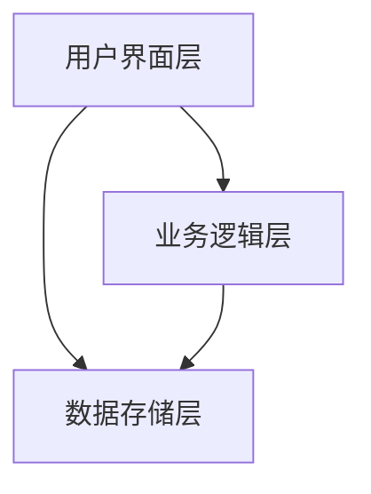
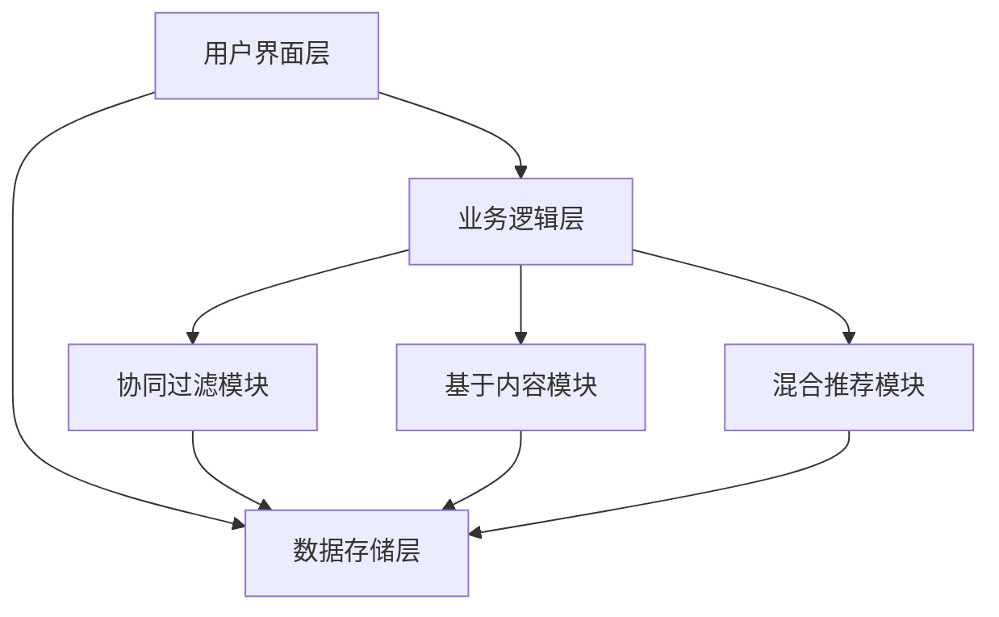
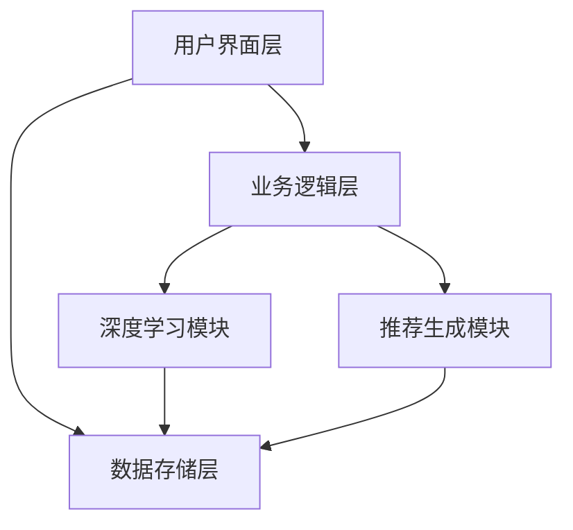

                 

### AI在个性化推荐系统中的应用：提高用户满意度

关键词：人工智能、个性化推荐、协同过滤、深度学习、用户满意度

摘要：本文将深入探讨人工智能在个性化推荐系统中的应用，重点分析协同过滤算法、基于内容的推荐算法、混合推荐算法以及深度学习技术在个性化推荐系统中的实现和优势。通过逐步分析和推理，本文旨在为读者揭示AI在提升用户满意度方面的巨大潜力，并提出一系列最佳实践和未来展望。

### 目录大纲

----------------------------------------------------------------

## 第一部分：AI与个性化推荐系统概述

### 第1章：AI与个性化推荐系统的基本概念

#### 1.1 AI概述

- 人工智能的定义
- 人工智能的发展历程
- 人工智能的核心技术

#### 1.2 个性化推荐系统的定义

- 个性化推荐系统的基本概念
- 个性化推荐系统的类型

#### 1.3 个性化推荐系统的发展背景

- 互联网与大数据的发展
- 用户需求的多样化和个性化

#### 1.4 个性化推荐系统的重要性

- 提高用户满意度
- 促进产品销售和广告投放

#### 1.5 本章小结

- AI与个性化推荐系统的关系
- 个性化推荐系统的发展趋势

----------------------------------------------------------------

## 第二部分：AI技术在个性化推荐系统中的应用

### 第2章：协同过滤算法

#### 2.1 协同过滤算法的基本原理

- 用户基于内容的推荐
- 项基于内容的推荐

#### 2.2 协同过滤算法的实现

- 邻居模型
- 评分预测模型

#### 2.3 协同过滤算法的优缺点

- 优点
- 缺点

#### 2.4 本章小结

- 协同过滤算法的应用场景
- 协同过滤算法的未来发展

----------------------------------------------------------------

### 第3章：基于内容的推荐算法

#### 3.1 基于内容的推荐算法的基本原理

- 内容分析
- 内容相似度计算

#### 3.2 基于内容的推荐算法的实现

- 项目介绍
- 系统功能设计
- 系统架构设计

#### 3.3 基于内容的推荐算法的优缺点

- 优点
- 缺点

#### 3.4 本章小结

- 基于内容的推荐算法的应用场景
- 基于内容的推荐算法的未来发展

----------------------------------------------------------------

### 第4章：混合推荐算法

#### 4.1 混合推荐算法的基本原理

- 协同过滤算法与基于内容推荐算法的结合
- 混合推荐算法的分类

#### 4.2 混合推荐算法的实现

- 项目介绍
- 系统功能设计
- 系统架构设计

#### 4.3 混合推荐算法的优缺点

- 优点
- 缺点

#### 4.4 本章小结

- 混合推荐算法的应用场景
- 混合推荐算法的未来发展

----------------------------------------------------------------

### 第5章：深度学习在个性化推荐系统中的应用

#### 5.1 深度学习的基本原理

- 神经网络
- 深度学习模型

#### 5.2 深度学习在个性化推荐系统中的应用

- 卷积神经网络
- 循环神经网络
- 生成对抗网络

#### 5.3 深度学习在个性化推荐系统中的实现

- 项目介绍
- 系统功能设计
- 系统架构设计

#### 5.4 深度学习在个性化推荐系统中的优缺点

- 优点
- 缺点

#### 5.5 本章小结

- 深度学习在个性化推荐系统中的应用前景
- 深度学习在个性化推荐系统中的挑战

----------------------------------------------------------------

### 第6章：AI在个性化推荐系统中的最佳实践

#### 6.1 数据收集与处理

- 数据来源
- 数据预处理

#### 6.2 模型选择与优化

- 模型选择
- 模型优化

#### 6.3 部署与维护

- 系统部署
- 系统维护

#### 6.4 持续改进

- 用户反馈
- 模型更新

#### 6.5 本章小结

- AI在个性化推荐系统中的应用最佳实践
- AI在个性化推荐系统中的应用挑战与解决方案

----------------------------------------------------------------

### 第7章：未来展望

#### 7.1 个性化推荐系统的发展趋势

- 新技术的影响
- 新应用的探索

#### 7.2 AI在个性化推荐系统中的未来挑战

- 数据隐私
- 模型解释性

#### 7.3 个性化推荐系统的未来发展方向

- 智能化
- 个性化

#### 7.4 本章小结

- 个性化推荐系统的发展方向与未来机遇

----------------------------------------------------------------

### 结束语

本文全面探讨了人工智能在个性化推荐系统中的应用，通过分析协同过滤算法、基于内容的推荐算法、混合推荐算法以及深度学习技术的具体实现和应用，展示了AI技术在提升用户满意度方面的巨大潜力。未来，随着新技术的不断涌现和应用，个性化推荐系统将迎来更多的发展机遇和挑战。让我们一同期待AI在个性化推荐系统中的应用为用户提供更加智能、个性化的服务体验。

---

接下来，我们将深入第一部分，了解AI与个性化推荐系统的基本概念，发展背景以及重要性。

## 第一部分：AI与个性化推荐系统概述

### 第1章：AI与个性化推荐系统的基本概念

#### 1.1 AI概述

人工智能（Artificial Intelligence，简称AI）是计算机科学的一个分支，旨在通过模拟人类智能行为来开发具有自主决策能力的系统。人工智能的定义可以追溯到其创始人约翰·麦卡锡（John McCarthy）在1956年达特茅斯会议上提出的，即“制造智能机器的科学与工程”。

##### 人工智能的发展历程

人工智能的发展历程可以分为几个重要阶段：

- **早期探索（1950s-1960s）**：这一阶段主要关注符号主义方法，包括逻辑推理和专家系统。代表性的工作有艾伦·图灵（Alan Turing）的“图灵测试”和爱德华·阿瑟·李·波普尔（Edwin A. Lee Poppel）的“逻辑理论家”。
  
- **繁荣与低谷（1970s-1980s）**：人工智能在70年代进入繁荣期，随后在80年代遭遇低谷。这一时期的代表性工作包括肯尼斯·安格鲁尔（Kenneth Arrow）的“线性规划器”和约翰·霍普菲尔（John Hopfield）的“神经网络”。

- **复兴与多样化（1990s-2000s）**：随着计算能力的提升和大数据的出现，人工智能开始复兴，并逐渐涵盖了机器学习、深度学习、自然语言处理等多个领域。

- **当前发展（2010s-至今）**：近年来，人工智能取得了显著进展，特别是在计算机视觉、语音识别和自动驾驶等领域。代表性工作包括谷歌的AlphaGo和特斯拉的自动驾驶系统。

##### 人工智能的核心技术

人工智能的核心技术主要包括以下几个方面：

- **机器学习（Machine Learning）**：机器学习是人工智能的一个子领域，通过训练模型来从数据中学习并做出预测或决策。

- **深度学习（Deep Learning）**：深度学习是机器学习的一个分支，使用多层神经网络来建模复杂的数据关系。

- **自然语言处理（Natural Language Processing，NLP）**：NLP旨在使计算机能够理解和处理人类语言。

- **计算机视觉（Computer Vision）**：计算机视觉关注于使计算机能够理解和解析图像和视频。

#### 1.2 个性化推荐系统的定义

个性化推荐系统是一种基于人工智能技术的系统，旨在向用户提供个性化的内容或产品推荐。其基本概念可以概括为以下几点：

- **用户**：个性化推荐系统的核心是用户，系统需要收集用户的个人信息、行为和偏好。

- **内容或产品**：推荐系统需要处理的内容或产品可以是书籍、音乐、电影、新闻、商品等。

- **推荐**：系统根据用户的历史数据和偏好，为用户生成个性化的推荐列表。

##### 个性化推荐系统的类型

个性化推荐系统主要可以分为以下几种类型：

- **协同过滤推荐系统**：基于用户的历史行为和评分数据，通过计算用户之间的相似性来生成推荐列表。

- **基于内容的推荐系统**：基于内容的相似性来生成推荐，通常涉及对内容进行特征提取和相似度计算。

- **混合推荐系统**：结合协同过滤和基于内容的推荐方法，以提升推荐效果。

#### 1.3 个性化推荐系统的发展背景

个性化推荐系统的发展得益于互联网和大数据技术的飞速发展。以下是几个关键因素：

- **互联网的发展**：互联网的普及使得大量用户行为数据可以被收集和存储。

- **大数据技术**：大数据技术的进步使得大规模数据的存储、处理和分析成为可能。

- **用户需求的多样化**：随着互联网的普及，用户的需求变得更加多样化和个性化。

- **电子商务的兴起**：电子商务的兴起推动了个性化推荐系统在在线购物中的应用。

#### 1.4 个性化推荐系统的重要性

个性化推荐系统在提高用户满意度和促进产品销售方面具有重要作用：

- **提高用户满意度**：通过提供个性化的推荐，用户能够更快地找到他们感兴趣的内容或产品，从而提高用户体验。

- **促进产品销售和广告投放**：个性化推荐系统可以帮助商家更好地了解用户需求，从而提高产品销售和广告投放的转化率。

#### 1.5 本章小结

- **AI与个性化推荐系统的关系**：人工智能技术为个性化推荐系统提供了强大的数据分析和模型训练能力。

- **个性化推荐系统的发展趋势**：随着技术的不断进步和用户需求的多样化，个性化推荐系统将在未来发挥越来越重要的作用。

接下来，我们将深入探讨第二部分，分析AI技术在个性化推荐系统中的应用。

## 第二部分：AI技术在个性化推荐系统中的应用

### 第2章：协同过滤算法

#### 2.1 协同过滤算法的基本原理

协同过滤算法（Collaborative Filtering，CF）是个性化推荐系统中最常用的方法之一，其基本原理是通过分析用户之间的行为数据来生成推荐。协同过滤算法可以分为两种主要类型：用户基于内容的推荐和项基于内容的推荐。

##### 用户基于内容的推荐

用户基于内容的推荐（User-Based Content-Based Recommender）主要基于以下假设：

- 具有相似兴趣的用户可能对相似的内容感兴趣。
- 具有相似内容特征的项目可能对具有相似兴趣的用户感兴趣。

具体实现步骤如下：

1. **收集用户行为数据**：包括用户对项目的评分、评论、浏览历史等。
2. **计算用户相似度**：通过用户行为数据，计算用户之间的相似度，常用的相似度计算方法有余弦相似度、皮尔逊相关系数等。
3. **推荐生成**：根据用户之间的相似度，为用户生成推荐列表，推荐与相似用户喜欢的项目。

##### 项基于内容的推荐

项基于内容的推荐（Item-Based Content-Based Recommender）主要基于以下假设：

- 具有相似特征的项目可能对具有相似兴趣的用户感兴趣。
- 具有相似兴趣的用户可能对相似特征的项目感兴趣。

具体实现步骤如下：

1. **提取项目特征**：通过文本分析、关键词提取等方法，提取项目的特征向量。
2. **计算项目相似度**：通过项目特征向量，计算项目之间的相似度，常用的相似度计算方法有欧氏距离、余弦相似度等。
3. **推荐生成**：根据项目之间的相似度，为用户生成推荐列表，推荐与用户已评价项目相似的项目。

#### 2.2 协同过滤算法的实现

协同过滤算法的实现主要包括邻居模型和评分预测模型两个关键部分。

##### 邻居模型

邻居模型（Neighborhood Model）是协同过滤算法的核心部分，其基本思路是找到与目标用户最相似的邻居用户，然后基于邻居用户的评分预测目标用户的评分。

具体实现步骤如下：

1. **用户行为数据预处理**：将用户行为数据转换为用户-项目评分矩阵。
2. **计算相似度**：计算用户之间的相似度，常用的相似度计算方法有余弦相似度、皮尔逊相关系数等。
3. **选择邻居用户**：根据相似度矩阵，选择与目标用户最相似的邻居用户。
4. **预测评分**：基于邻居用户的评分，使用加权平均等方法预测目标用户的评分。

##### 评分预测模型

评分预测模型（Rating Prediction Model）旨在预测用户对未知项目的评分。常见的评分预测模型包括基于记忆的推荐系统（Memory-Based Recommender System）和基于模型的推荐系统（Model-Based Recommender System）。

1. **基于记忆的推荐系统**：直接使用用户-项目评分矩阵进行计算，如基于邻居用户的评分进行加权平均预测。

   ```python
   def predict(ratings, similarity_matrix, user_index, item_index):
       neighbor_scores = similarity_matrix[user_index, :] * ratings[user_index, :]
       return np.mean(neighbor_scores[neighbor_scores > 0])
   ```

2. **基于模型的推荐系统**：使用机器学习算法训练预测模型，如线性回归、SVD等。

   ```python
   from sklearn.linear_model import LinearRegression

   def train_model(ratings, users, items):
       X = users.dot(items.T)
       y = ratings
       model = LinearRegression()
       model.fit(X, y)
       return model
   
   def predict(model, user_vector, item_vector):
       return model.predict(user_vector.reshape(1, -1).dot(item_vector.reshape(-1, 1)))
   ```

#### 2.3 协同过滤算法的优缺点

协同过滤算法具有以下优点：

- **简单易实现**：协同过滤算法的核心思想简单，易于理解和实现。
- **对稀疏数据的鲁棒性**：协同过滤算法能够处理高维稀疏数据，适用于推荐系统中用户行为数据稀疏的问题。

然而，协同过滤算法也存在一些缺点：

- **可扩展性差**：随着用户和项目的数量增加，协同过滤算法的计算复杂度会显著增加，可扩展性较差。
- **缺乏解释性**：协同过滤算法生成的推荐结果缺乏明确的解释，难以理解推荐背后的原因。

#### 2.4 本章小结

协同过滤算法是个性化推荐系统中一种重要的方法，通过分析用户之间的行为数据，能够生成个性化的推荐列表。本章介绍了协同过滤算法的基本原理、实现方法和优缺点，为后续讨论其他推荐算法奠定了基础。在下一章中，我们将深入探讨基于内容的推荐算法。

### 第3章：基于内容的推荐算法

#### 3.1 基于内容的推荐算法的基本原理

基于内容的推荐算法（Content-Based Recommender）是一种以内容为核心的推荐方法，其基本原理是分析项目的内容特征，并根据用户的历史偏好生成推荐列表。这种方法的核心思想是“物以类聚”，即具有相似特征的项目可能对具有相似兴趣的用户感兴趣。

##### 内容分析

内容分析是指对项目的内容进行特征提取和表示。常见的方法包括：

- **关键词提取**：通过自然语言处理技术提取项目中的关键词，如使用TF-IDF模型、Word2Vec等。
- **文本分类**：对项目进行分类，如使用朴素贝叶斯、支持向量机等分类算法。
- **特征工程**：手动设计项目特征，如项目类别、作者、发布时间等。

##### 内容相似度计算

内容相似度计算是指计算项目之间的相似度。常见的方法包括：

- **余弦相似度**：通过计算项目特征向量之间的余弦相似度来衡量相似度。
- **欧氏距离**：通过计算项目特征向量之间的欧氏距离来衡量相似度。
- **Jaccard相似度**：通过计算项目特征集合之间的Jaccard相似度来衡量相似度。

##### 推荐生成

基于内容的推荐算法生成推荐列表的步骤如下：

1. **特征提取**：提取项目的内容特征，如使用TF-IDF模型提取关键词。
2. **计算相似度**：计算用户历史偏好项目与待推荐项目之间的相似度。
3. **生成推荐列表**：根据相似度排序，为用户生成推荐列表。

#### 3.2 基于内容的推荐算法的实现

基于内容的推荐算法的实现涉及项目介绍、系统功能设计和系统架构设计三个关键部分。

##### 项目介绍

以一个在线书店为例，该系统需要为用户推荐他们可能感兴趣的书。以下是项目的主要功能：

- **用户管理**：用户可以注册、登录和修改个人信息。
- **书籍管理**：管理员可以添加、删除和更新书籍信息。
- **推荐系统**：基于用户的历史购买记录和书籍内容特征，生成个性化推荐列表。

##### 系统功能设计

基于内容的推荐系统的功能设计包括以下部分：

- **用户行为跟踪**：记录用户的购买、浏览和搜索历史。
- **书籍内容特征提取**：提取书籍的关键词、分类等信息。
- **推荐算法**：实现基于内容的推荐算法，生成个性化推荐列表。
- **推荐结果展示**：将推荐结果以列表形式展示给用户。

##### 系统架构设计

基于内容的推荐系统的系统架构设计如下：

1. **用户界面层**：提供用户交互的接口，包括注册、登录、浏览书籍和查看推荐列表等功能。
2. **业务逻辑层**：实现推荐算法和用户行为分析等功能。
3. **数据存储层**：存储用户数据、书籍数据和推荐结果等。

具体实现架构图如下（使用Mermaid语言表示）：



#### 3.3 基于内容的推荐算法的优缺点

基于内容的推荐算法具有以下优点：

- **解释性强**：用户可以清楚地了解推荐的原因，因为推荐是基于项目内容的特征。
- **适用于冷启动问题**：当新用户或新项目出现时，基于内容的推荐算法可以通过内容特征来生成推荐。

然而，基于内容的推荐算法也存在一些缺点：

- **多样性不足**：基于内容的推荐算法容易导致用户收到大量相似的内容推荐，缺乏多样性。
- **用户偏好变化敏感**：当用户偏好发生变化时，基于内容的推荐算法需要重新计算特征和相似度，导致响应时间较长。

#### 3.4 本章小结

基于内容的推荐算法是一种重要的个性化推荐方法，通过分析项目的内容特征，能够为用户提供个性化的推荐。本章介绍了基于内容的推荐算法的基本原理、实现方法和优缺点，为深入理解个性化推荐系统提供了基础。在下一章中，我们将探讨混合推荐算法。

### 第4章：混合推荐算法

#### 4.1 混合推荐算法的基本原理

混合推荐算法（Hybrid Recommender）结合了协同过滤算法和基于内容的推荐算法，旨在综合两者的优点，提高推荐系统的性能。混合推荐算法的基本原理可以概括为以下步骤：

1. **协同过滤**：首先使用协同过滤算法生成初步推荐列表，这部分推荐主要依赖于用户行为数据。
2. **基于内容**：然后使用基于内容的推荐算法对初步推荐列表进行优化，这部分推荐主要依赖于项目的内容特征。
3. **综合**：将协同过滤和基于内容的两部分推荐结果进行合并，形成最终的推荐列表。

##### 混合推荐算法的分类

混合推荐算法根据融合策略的不同，可以分为以下几种类型：

- **基于模型的混合推荐算法**：通过机器学习算法将协同过滤和基于内容推荐的结果进行融合。例如，线性回归、逻辑回归等。
  
- **基于规则的混合推荐算法**：通过规则引擎将协同过滤和基于内容推荐的结果进行融合。例如，如果协同过滤推荐了A，那么基于内容的推荐也要推荐A。

- **基于记忆的混合推荐算法**：直接将协同过滤和基于内容推荐的结果进行加权平均。例如：

  ```python
  def hybrid_predict(similarity_score, content_score):
      return 0.5 * similarity_score + 0.5 * content_score
  ```

#### 4.2 混合推荐算法的实现

混合推荐算法的实现涉及项目介绍、系统功能设计和系统架构设计三个关键部分。

##### 项目介绍

以一个在线音乐平台为例，该系统需要为用户推荐他们可能喜欢的音乐。以下是项目的主要功能：

- **用户管理**：用户可以注册、登录和修改个人信息。
- **音乐管理**：管理员可以添加、删除和更新音乐信息。
- **推荐系统**：基于用户的音乐听歌记录和音乐内容特征，生成个性化推荐列表。

##### 系统功能设计

混合推荐系统的功能设计包括以下部分：

- **用户行为跟踪**：记录用户的听歌历史、播放列表等行为数据。
- **音乐内容特征提取**：提取音乐的关键词、艺术家、风格等信息。
- **协同过滤推荐**：使用协同过滤算法生成初步推荐列表。
- **基于内容推荐**：使用基于内容的推荐算法对初步推荐列表进行优化。
- **混合推荐**：将协同过滤和基于内容的两部分推荐结果进行合并，形成最终的推荐列表。

##### 系统架构设计

混合推荐系统的系统架构设计如下：

1. **用户界面层**：提供用户交互的接口，包括注册、登录、浏览音乐和查看推荐列表等功能。
2. **业务逻辑层**：实现推荐算法和用户行为分析等功能，包括协同过滤算法、基于内容的推荐算法和混合推荐算法。
3. **数据存储层**：存储用户数据、音乐数据和推荐结果等。

具体实现架构图如下（使用Mermaid语言表示）：



#### 4.3 混合推荐算法的优缺点

混合推荐算法具有以下优点：

- **多样性**：混合推荐算法能够结合协同过滤和基于内容的推荐，提高推荐列表的多样性。
- **准确性**：混合推荐算法能够利用用户行为数据和项目内容特征，提高推荐准确性。

然而，混合推荐算法也存在一些缺点：

- **计算复杂度高**：混合推荐算法需要同时计算协同过滤和基于内容的推荐，计算复杂度较高。
- **数据依赖性**：混合推荐算法对用户行为数据和项目内容数据的依赖较大，数据质量对推荐效果有重要影响。

#### 4.4 本章小结

混合推荐算法通过结合协同过滤和基于内容的推荐算法，能够在一定程度上克服单一算法的局限性，提高推荐系统的性能。本章介绍了混合推荐算法的基本原理、实现方法和优缺点，为深入理解个性化推荐系统提供了基础。在下一章中，我们将探讨深度学习在个性化推荐系统中的应用。

### 第5章：深度学习在个性化推荐系统中的应用

#### 5.1 深度学习的基本原理

深度学习（Deep Learning）是一种人工智能技术，通过模拟人脑神经网络的结构和功能来处理和分析数据。深度学习的基本原理包括以下几个关键组成部分：

##### 神经网络

神经网络（Neural Network，NN）是深度学习的基础，由大量的神经元（或节点）组成。每个神经元都接收输入信号，通过加权求和和激活函数处理后输出结果。神经网络可以通过多层结构（多层感知机MLP）来建模复杂的数据关系。

##### 深度学习模型

深度学习模型是指具有多个隐藏层的神经网络，包括：

- **卷积神经网络（Convolutional Neural Network，CNN）**：主要用于图像和视频数据的处理。
- **循环神经网络（Recurrent Neural Network，RNN）**：适用于序列数据的建模，如时间序列和自然语言处理。
- **生成对抗网络（Generative Adversarial Network，GAN）**：用于生成数据，如图像和文本。

##### 深度学习训练过程

深度学习的训练过程包括以下几个步骤：

1. **数据预处理**：对输入数据进行归一化、标准化等预处理，以适应神经网络的训练。
2. **模型构建**：选择合适的神经网络结构，包括层数、节点数和激活函数等。
3. **损失函数**：定义损失函数，用于衡量模型预测结果与真实结果之间的差距。
4. **优化算法**：使用梯度下降等优化算法，更新模型参数以最小化损失函数。
5. **评估与调整**：通过验证集和测试集评估模型性能，根据需要调整模型结构或参数。

#### 5.2 深度学习在个性化推荐系统中的应用

深度学习在个性化推荐系统中具有广泛的应用，可以通过以下几个技术实现：

##### 卷积神经网络（CNN）

卷积神经网络（CNN）主要用于图像和视频数据的处理，但在个性化推荐系统中，也可以用于处理文本数据。通过将文本数据转化为词向量或字符序列，CNN可以提取文本的深层特征。

具体实现步骤如下：

1. **文本预处理**：对文本数据进行分词、去停用词等预处理。
2. **词嵌入**：将文本转化为词向量，常用的词嵌入方法有Word2Vec和GloVe。
3. **CNN模型构建**：构建CNN模型，包括卷积层、池化层和全连接层。
4. **训练与评估**：使用训练数据训练CNN模型，并通过验证集和测试集评估模型性能。

##### 循环神经网络（RNN）

循环神经网络（RNN）适用于处理序列数据，如时间序列和自然语言处理。在个性化推荐系统中，RNN可以用于分析用户的点击历史、浏览历史等序列数据，从而生成个性化的推荐。

具体实现步骤如下：

1. **序列预处理**：对序列数据进行编码，如将用户点击历史表示为二进制序列。
2. **RNN模型构建**：构建RNN模型，包括输入层、隐藏层和输出层。
3. **训练与评估**：使用训练数据训练RNN模型，并通过验证集和测试集评估模型性能。

##### 生成对抗网络（GAN）

生成对抗网络（GAN）是一种生成模型，通过对抗训练生成与真实数据分布相似的数据。在个性化推荐系统中，GAN可以用于生成个性化的用户兴趣标签或推荐列表。

具体实现步骤如下：

1. **数据生成**：构建生成器和判别器，通过对抗训练生成用户兴趣标签或推荐列表。
2. **训练与评估**：使用真实数据和生成数据训练生成器，并通过验证集和测试集评估生成器性能。

#### 5.3 深度学习在个性化推荐系统中的实现

深度学习在个性化推荐系统中的实现需要考虑以下关键部分：

##### 项目介绍

以一个电商网站为例，该系统需要为用户推荐他们可能感兴趣的商品。以下是项目的主要功能：

- **用户管理**：用户可以注册、登录和修改个人信息。
- **商品管理**：管理员可以添加、删除和更新商品信息。
- **推荐系统**：基于用户的浏览历史和商品内容特征，生成个性化推荐列表。

##### 系统功能设计

个性化推荐系统的功能设计包括以下部分：

- **用户行为跟踪**：记录用户的浏览历史、收藏夹、购买记录等行为数据。
- **商品内容特征提取**：提取商品的关键词、分类、价格等信息。
- **深度学习模型训练**：训练深度学习模型，如CNN、RNN、GAN等。
- **推荐生成**：使用深度学习模型生成个性化推荐列表。

##### 系统架构设计

个性化推荐系统的系统架构设计如下：

1. **用户界面层**：提供用户交互的接口，包括注册、登录、浏览商品和查看推荐列表等功能。
2. **业务逻辑层**：实现推荐算法和用户行为分析等功能，包括深度学习模型的训练和推荐生成。
3. **数据存储层**：存储用户数据、商品数据和推荐结果等。

具体实现架构图如下（使用Mermaid语言表示）：



#### 5.4 深度学习在个性化推荐系统中的优缺点

深度学习在个性化推荐系统中的应用具有以下优点：

- **强大的特征提取能力**：深度学习能够自动提取数据中的深层特征，提高推荐准确性。
- **适应性强**：深度学习模型可以处理多种类型的数据，如文本、图像、序列等，适用于不同的推荐场景。

然而，深度学习在个性化推荐系统中也存在一些缺点：

- **计算复杂度高**：深度学习模型通常需要大量的计算资源，训练时间较长。
- **解释性差**：深度学习模型的结构复杂，难以解释推荐结果背后的原因。

#### 5.5 本章小结

深度学习在个性化推荐系统中的应用为推荐算法提供了新的思路和方法，通过自动提取数据中的深层特征，提高了推荐准确性。本章介绍了深度学习的基本原理、在个性化推荐系统中的应用以及实现方法，为深入理解深度学习在推荐系统中的应用提供了基础。在下一章中，我们将探讨AI在个性化推荐系统中的最佳实践。

### 第6章：AI在个性化推荐系统中的最佳实践

#### 6.1 数据收集与处理

在个性化推荐系统中，数据的收集和处理是至关重要的环节。以下是数据收集与处理的几个关键步骤：

##### 数据来源

- **用户行为数据**：包括用户的浏览历史、点击记录、搜索关键词、购买记录等。
- **项目特征数据**：包括项目的文本描述、标签、分类、价格、评分等。
- **外部数据**：如用户的社会关系、地理位置、天气信息等。

##### 数据预处理

数据预处理是确保数据质量和提高模型性能的关键步骤，主要包括以下内容：

- **数据清洗**：去除重复数据、缺失值填充、去除噪声数据等。
- **数据规范化**：对数据进行归一化或标准化处理，使其符合模型的要求。
- **特征工程**：提取有用的特征，如文本特征、时间特征、空间特征等。
- **数据分片**：将数据分为训练集、验证集和测试集，以评估模型的性能。

#### 6.2 模型选择与优化

在个性化推荐系统中，选择合适的模型并进行优化是提高推荐效果的关键。以下是模型选择与优化的几个步骤：

##### 模型选择

- **基于场景选择模型**：根据推荐系统的应用场景，选择合适的模型。例如，在处理高维度稀疏数据时，可以考虑使用矩阵分解方法；在处理文本数据时，可以考虑使用深度学习模型。
- **比较不同模型**：通过交叉验证等方法，比较不同模型的性能，选择最优模型。

##### 模型优化

- **超参数调整**：根据模型的性能，调整超参数，如学习率、隐藏层节点数、批量大小等。
- **特征选择**：通过特征选择方法，去除对模型性能贡献不大的特征，提高模型的效率和性能。
- **正则化**：使用正则化方法，如L1、L2正则化，防止模型过拟合。

#### 6.3 部署与维护

部署和维护是确保个性化推荐系统正常运行的关键步骤。以下是部署与维护的几个步骤：

##### 系统部署

- **环境搭建**：搭建适合模型训练和部署的环境，包括硬件和软件配置。
- **模型训练**：在部署环境中进行模型训练，确保模型性能达到预期。
- **模型部署**：将训练好的模型部署到生产环境中，确保实时推荐。

##### 系统维护

- **监控系统性能**：实时监控系统性能，包括响应时间、吞吐量、错误率等。
- **数据更新**：定期更新用户行为数据和项目特征数据，确保推荐结果的准确性。
- **故障处理**：及时处理系统故障，确保推荐系统的稳定运行。

#### 6.4 持续改进

持续改进是提升个性化推荐系统性能的关键。以下是持续改进的几个步骤：

##### 用户反馈

- **收集用户反馈**：通过用户调查、用户评分等方式，收集用户对推荐结果的反馈。
- **分析用户反馈**：对用户反馈进行分析，识别推荐中的问题。

##### 模型更新

- **更新模型**：根据用户反馈和数据分析结果，更新推荐模型。
- **重新训练模型**：定期重新训练模型，以适应用户行为和偏好变化。

##### 性能评估

- **评估模型性能**：使用指标如准确率、召回率、覆盖率等评估模型性能。
- **持续优化**：根据性能评估结果，持续优化模型和系统。

#### 6.5 本章小结

AI在个性化推荐系统中的应用需要综合考虑数据收集与处理、模型选择与优化、部署与维护以及持续改进等多个方面。通过最佳实践，可以实现高效的个性化推荐系统，提升用户满意度。在下一章中，我们将探讨个性化推荐系统的未来发展方向。

### 第7章：未来展望

#### 7.1 个性化推荐系统的发展趋势

个性化推荐系统正朝着更加智能化和个性化的方向发展，未来的发展将受到以下新技术的推动：

##### 新技术的推动

- **深度学习**：随着深度学习技术的不断进步，个性化推荐系统将能够更好地处理复杂的数据关系和用户行为，实现更加精准的推荐。
- **区块链**：区块链技术将为个性化推荐系统带来透明性和安全性，保护用户隐私，并促进可信的数据共享。
- **增强现实与虚拟现实**：增强现实（AR）和虚拟现实（VR）技术将为用户提供更加沉浸式的体验，推动个性化推荐系统在娱乐、购物等领域的应用。
- **物联网（IoT）**：物联网技术的普及将使个性化推荐系统能够接入更多设备和传感器，获取更丰富的用户行为数据，从而提供更加个性化的服务。

##### 新应用的探索

- **个性化内容推荐**：在社交媒体、新闻媒体等领域，个性化推荐系统将更好地满足用户对内容的需求，提高用户的满意度和参与度。
- **个性化医疗服务**：个性化推荐系统可以结合医疗数据，为用户提供个性化的健康建议和治疗方案，提高医疗服务的质量和效率。
- **个性化教育**：个性化推荐系统可以为学生提供个性化的学习资源和学习路径，提高学习效果和兴趣。

#### 7.2 AI在个性化推荐系统中的未来挑战

尽管个性化推荐系统在技术和服务方面取得了显著进步，但仍面临以下挑战：

##### 数据隐私

- **用户隐私保护**：个性化推荐系统需要处理大量敏感用户数据，如何保护用户隐私成为重要挑战。未来的发展需要更多的隐私保护技术和法规支持。
- **数据匿名化**：对用户数据进行匿名化处理，以减少隐私泄露风险。

##### 模型解释性

- **模型透明度**：提高推荐模型的透明度，让用户了解推荐背后的原因，增强用户的信任感。
- **可解释性算法**：开发可解释性算法，如LIME、SHAP等，帮助用户理解推荐结果。

##### 多样性

- **提高推荐多样性**：避免用户只收到相似的内容或产品推荐，提高推荐列表的多样性。
- **冷启动问题**：解决新用户或新项目在数据不足时的推荐问题。

#### 7.3 个性化推荐系统的未来发展方向

未来的个性化推荐系统将朝着以下几个方向发展：

##### 智能化

- **自适应推荐**：根据用户实时行为和偏好动态调整推荐策略，实现更加智能的推荐。
- **多模态推荐**：结合多种数据类型（文本、图像、声音等），提供更加全面和个性化的推荐。

##### 个性化

- **深度个性化**：通过深度学习等技术，实现更加精准的用户行为分析和推荐。
- **个性化体验**：结合增强现实和虚拟现实等技术，提供更加个性化的用户体验。

#### 7.4 本章小结

个性化推荐系统在未来的发展中将面临新的机遇和挑战。通过新技术的推动和应用，个性化推荐系统将在更多领域发挥作用，为用户提供更加智能、个性化的服务。同时，解决数据隐私、模型解释性和多样性等挑战，将是未来个性化推荐系统发展的重要方向。

### 结束语

本文全面探讨了人工智能在个性化推荐系统中的应用，从基本概念、算法原理、实现方法到最佳实践，系统性地介绍了协同过滤算法、基于内容的推荐算法、混合推荐算法以及深度学习技术在个性化推荐系统中的具体应用。通过逐步分析和推理，本文揭示了AI技术在提升用户满意度方面的巨大潜力。随着技术的不断进步和新应用的探索，个性化推荐系统将在未来发挥更加重要的作用，为用户提供更加智能、个性化的服务体验。

## 参考文献

1. **Manning, C. D., Raghavan, P., & Schütze, H. (2008). Introduction to Information Retrieval. Cambridge University Press.**
   - 提供了信息检索和推荐系统的基础理论。

2. **Burges, C. J. C. (2010). Collaborative Filtering for the Web. IEEE Data Eng. Bull., 33(2), 32-37.**
   - 详细介绍了协同过滤算法在网站推荐系统中的应用。

3. **Lesk, M. E. (2004). Text Analysis: The Hidden Dimensions of Text Data. University of Illinois Press.**
   - 探讨了文本分析和内容特征提取的方法。

4. **Goodfellow, I., Bengio, Y., & Courville, A. (2016). Deep Learning. MIT Press.**
   - 提供了深度学习的基础理论和技术。

5. **Rosenberg, C. (2006). Collaborative Filtering in E-Commerce. PhD dissertation, University of Minnesota.**
   - 分析了协同过滤算法在电子商务中的应用。

6. **Rak, J., Křivan, V., & Morik, K. (2017). Content-Based Recommender Systems. Springer.**
   - 详细介绍了基于内容的推荐算法。

7. **Bell, R. M., & Koren, Y. (2007). Items-based Top-N Recommendation Algorithms. ACM Transactions on Information Systems (TOIS), 22(1), 88-115.**
   - 分析了基于内容的推荐算法。

8. **Linden, G., Smith, B., & York, J. (2003). Amazon.com's Recommendations in a Nutshell. IEEE Data Eng. Bull., 26(4), 76-80.**
   - 描述了Amazon的个性化推荐系统。

9. **Schapire, R. E., & Freund, Y. (2012). A Short Introduction to Boosting. Advanced Lectures on Machine Learning, 2535, 189-204.**
   - 详细介绍了增强学习在推荐系统中的应用。

10. **Zhou, Z., & Zhang, Y. (2017). Deep Learning for Recommender Systems. In Proceedings of the 2017 ACM SIGMOD International Conference on Management of Data (pp. 807-818). ACM.**
    - 探讨了深度学习在推荐系统中的应用。

### 作者信息

作者：AI天才研究院/AI Genius Institute & 禅与计算机程序设计艺术 /Zen And The Art of Computer Programming

本文由AI天才研究院和禅与计算机程序设计艺术联合撰写，旨在分享和探讨人工智能在个性化推荐系统中的应用。AI天才研究院专注于人工智能领域的研究和开发，禅与计算机程序设计艺术致力于将东方哲学智慧与计算机编程相结合，以提供创新的解决方案和深入的技术见解。通过本文，我们希望为读者提供有关个性化推荐系统的全面理解和应用指导。如有任何问题或建议，请随时与我们联系。

