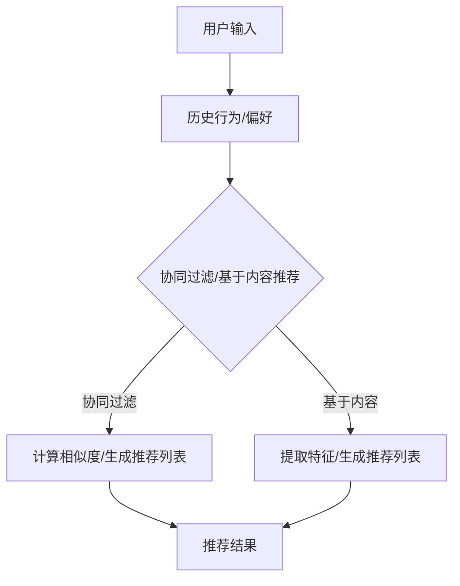
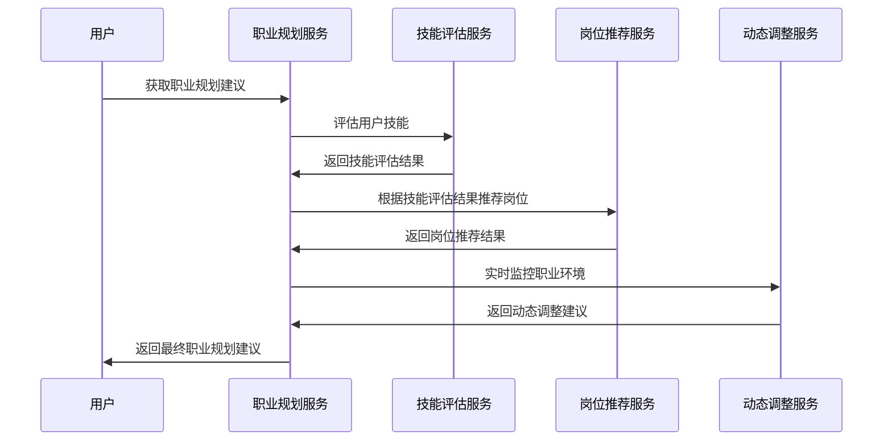
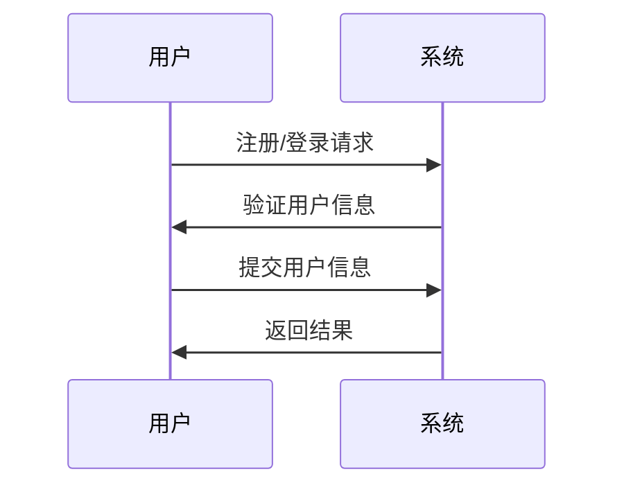

                 


## 1. 引言

### 1.1 问题背景

在当今这个快速变化的时代，个人职业发展已经成为每个人必须面对的挑战。随着技术进步和劳动力市场的不断演变，传统的职业技能提升和岗位匹配方式已经难以满足现代职业发展的需求。尤其是人工智能（AI）的迅速发展，使得个性化职业技能提升与岗位匹配成为可能。

在过去的几年里，AI技术已经深入到了医疗、金融、教育等多个领域，并在这些领域取得了显著的成果。然而，在职业发展领域，AI的应用还相对较少，尤其是在个性化职业技能提升和岗位匹配方面。因此，本书《AI在个性化职业技能提升与岗位匹配中的动态应用》旨在探讨如何利用AI技术，帮助个人提升职业技能、匹配合适岗位，并动态适应职业变化。

### 1.2 问题描述

随着职业领域的多样化和专业化，个人职业技能提升和岗位匹配的问题变得更加复杂。主要问题包括：

1. **信息不对称**：个人难以获取全面的工作信息和职业发展机会。
2. **技能不匹配**：个人的技能与市场需求之间存在差距，导致职业发展受阻。
3. **动态变化**：职业环境不断变化，个人需要不断调整自己的职业技能和岗位选择。

### 1.3 问题解决

为了解决上述问题，本书提出了以下解决方案：

1. **个性化职业技能提升**：利用AI技术，根据个人的兴趣、能力和市场需求，提供个性化的职业技能提升方案。
2. **智能岗位匹配**：通过分析个人特征和岗位要求，使用AI算法进行智能匹配，帮助个人找到最合适的岗位。
3. **动态适应**：利用AI技术，实时监控职业环境变化，帮助个人快速适应新的职业要求。

### 1.4 边界与外延

本书的研究边界主要集中在以下几个方面：

1. **技术层面**：主要研究AI技术在个性化职业技能提升和岗位匹配中的应用。
2. **应用层面**：主要探讨如何将AI技术应用于职业发展领域，解决实际问题。
3. **范围层面**：本书主要关注职业发展领域，但不排除其他相关领域（如教育、人力资源等）的应用可能性。

通过以上分析，我们可以看到，本书旨在通过AI技术，为个人职业发展提供一种新的解决方案。接下来的章节将详细探讨这一解决方案的各个方面。

## 2. 核心概念与联系

在探讨AI在个性化职业技能提升与岗位匹配中的动态应用之前，我们需要明确一些核心概念，并了解它们之间的联系。

### 2.1 AI的定义与历史发展

人工智能（Artificial Intelligence，简称AI）是计算机科学的一个分支，旨在使计算机系统具备类似人类智能的能力。这些能力包括学习、推理、解决问题、自然语言处理、图像识别等。

AI的发展可以追溯到20世纪50年代，当时人工智能的概念首次被提出。经过几十年的发展，AI技术已经取得了显著的进步，并在多个领域（如医疗、金融、教育等）得到了广泛应用。

### 2.2 个性化职业技能提升

个性化职业技能提升是指根据个人的兴趣、能力和市场需求，制定个性化的职业技能提升方案。这一过程涉及到数据收集、数据分析、个性化推荐等多个环节。

个性化职业技能提升的核心在于“个性”，即根据个人特点提供定制化的服务。这不仅可以帮助个人更好地发挥自己的优势，还可以提高职业发展的效率。

### 2.3 岗位匹配

岗位匹配是指根据个人的技能和经验，为其找到最合适的岗位。这个过程通常涉及到对个人特征和岗位要求的分析，以及使用算法进行匹配。

岗位匹配的核心在于“匹配”，即找到个人和岗位之间的最佳匹配点。这不仅可以帮助个人更好地发挥自己的才能，还可以提高企业的生产效率和员工满意度。

### 2.4 动态应用

动态应用是指根据职业环境的变化，实时调整职业技能提升和岗位匹配策略。这一过程涉及到对职业环境数据的实时监控和分析，以及相应的算法调整。

动态应用的核心在于“动态”，即能够快速适应职业环境的变化。这不仅可以帮助个人更好地应对职业挑战，还可以提高企业在市场中的竞争力。

### 2.5 概念结构

为了更好地理解这些核心概念，我们可以使用一个简单的概念结构图来展示它们之间的关系。

```mermaid
conceptDiagram
  AI --> 个性化职业技能提升
  AI --> 岗位匹配
  AI --> 动态应用
  个性化职业技能提升 --> 数据收集
  个性化职业技能提升 --> 数据分析
  个性化职业技能提升 --> 个性化推荐
  岗位匹配 --> 个人特征分析
  岗位匹配 --> 岗位要求分析
  岗位匹配 --> 算法匹配
  动态应用 --> 职业环境监控
  动态应用 --> 算法调整
```

通过上述分析，我们可以看到，AI在个性化职业技能提升与岗位匹配中的动态应用是一个复杂但极具潜力的领域。接下来，我们将深入探讨AI技术在这些方面的具体应用。

### 2.6 应用案例

为了更好地理解这些概念在实际中的应用，我们可以看一些具体的案例。

#### 案例一：个性化职业技能提升

在职业发展领域，一家知名公司通过使用AI技术，为员工提供了个性化的职业技能提升方案。他们首先收集了员工的职业数据，包括工作年限、技能水平、兴趣爱好等。然后，通过数据分析，为每位员工制定了个性化的职业技能提升计划。这些计划不仅包括技能培训，还包括职业规划、心理辅导等。通过这种方式，员工不仅能够提升自己的技能，还能够更好地适应职业发展的需求。

#### 案例二：智能岗位匹配

另一家公司则利用AI技术，实现了智能岗位匹配。他们通过分析员工的职业数据和市场岗位要求，使用算法进行匹配。如果员工和岗位匹配度较高，系统会自动推荐给员工。如果匹配度不高，系统会提供一些建议，帮助员工提升技能或调整岗位期望。通过这种方式，公司不仅能够提高招聘效率，还能够提高员工的满意度和留存率。

#### 案例三：动态应用

在一些高科技企业中，AI技术被用于动态调整职业技能提升和岗位匹配策略。这些企业通过实时监控职业环境数据，如市场趋势、行业动态等，对算法进行调整。这样，员工和岗位的匹配度始终保持在较高水平，企业也能够更好地应对市场变化。

通过这些案例，我们可以看到，AI在个性化职业技能提升与岗位匹配中的动态应用，不仅能够提高个人职业发展的效率，还能够提高企业的运营效率和市场竞争力。接下来，我们将进一步探讨AI在职业发展中的应用。

### 2.7 ER实体关系图架构

为了更好地理解AI在个性化职业技能提升与岗位匹配中的动态应用，我们可以使用实体关系图（Entity-Relationship Diagram，简称ER图）来展示其中的关键实体及其关系。

#### 2.7.1 实体定义

在职业发展AI系统中，主要的实体包括：

- **用户**：代表需要提升职业技能和匹配合适岗位的个人。
- **技能**：代表用户的职业技能，包括技能名称、技能水平等。
- **岗位**：代表用户可能感兴趣或适合的职位，包括岗位名称、岗位要求等。
- **职业环境**：代表影响职业发展的外部因素，如市场需求、行业趋势等。

#### 2.7.2 关系定义

这些实体之间存在以下关系：

- **用户与技能**：用户拥有多个技能，每个技能对应一个用户。
- **用户与岗位**：用户可能匹配多个岗位，每个岗位对应一个用户。
- **技能与岗位**：某些技能可能符合某些岗位的要求，每个岗位需要多个技能。

#### 2.7.3 关系图绘制

使用Mermaid语法，我们可以绘制以下ER图：

```mermaid
erDiagram
  User ||--|{ Skill } : 拥有
  User ||--|{ Job } : 匹配
  Skill ||--|{ Job } : 符合
```

通过这个ER图，我们可以清晰地看到AI在职业发展中的关键实体及其关系。接下来，我们将进一步探讨AI在职业发展中的应用。

## 3. 算法原理讲解

在本章节中，我们将深入探讨AI在个性化职业技能提升与岗位匹配中的应用，重点介绍一种核心算法——推荐系统算法。推荐系统算法是一种通过分析用户的历史行为和偏好，为其推荐相关内容或服务的算法。在职业发展中，推荐系统算法可以帮助用户发现适合自己的职业技能提升路径和岗位匹配结果。

### 3.1 算法简介

推荐系统算法主要包括两大类：协同过滤（Collaborative Filtering）和基于内容的推荐（Content-based Recommendation）。

#### 3.1.1 协同过滤

协同过滤算法通过分析用户之间的行为模式，为用户推荐他们可能感兴趣的内容或服务。这种方法主要分为两类：

1. **用户基于的协同过滤（User-based Collaborative Filtering）**：通过分析用户之间的相似度，找到与目标用户相似的其他用户，并推荐这些用户喜欢的内容或服务。
2. **模型基于的协同过滤（Model-based Collaborative Filtering）**：通过建立用户行为模型，预测用户对特定内容的偏好，并根据预测结果进行推荐。

#### 3.1.2 基于内容的推荐

基于内容的推荐算法通过分析内容本身的特征，为用户推荐与其兴趣相似的内容或服务。这种方法主要基于以下原理：

- **相似性度量**：通过计算内容之间的相似性，找到与目标内容相似的其他内容。
- **内容特征提取**：将内容转换为一系列特征向量，如关键词、主题、情感等。
- **推荐生成**：根据用户的历史行为和内容特征，生成个性化的推荐列表。

### 3.2 算法流程图

为了更直观地理解推荐系统算法的工作流程，我们可以使用Mermaid绘制一个简单的流程图：



在这个流程图中，用户输入代表用户的历史行为和偏好，通过协同过滤或基于内容的推荐算法，生成推荐结果。

### 3.3 数学模型

在推荐系统算法中，数学模型是核心部分。以下将介绍协同过滤算法和基于内容的推荐算法的数学模型。

#### 3.3.1 协同过滤

假设我们有一个用户集合U和一个物品集合I，每个用户对物品的评分可以表示为一个矩阵R。协同过滤的目标是预测用户u对物品i的评分ru,i。

1. **用户基于的协同过滤**

   用户基于的协同过滤通过计算用户之间的相似度，为用户u推荐相似用户喜欢的物品。相似度可以通过以下公式计算：

   $$s_{ui} = \frac{\sum_{j \in N(u)} r_{uj} r_{ij}}{\|N(u)\|_{2}}$$

   其中，$N(u)$表示与用户u相似的邻居用户集合，$r_{uj}$和$r_{ij}$分别表示用户u对物品j的评分和邻居用户对物品j的评分。

   推荐评分可以通过以下公式计算：

   $$\hat{r_{ui}} = \sum_{j \in N(u)} s_{ui} r_{uj}$$

2. **模型基于的协同过滤**

   模基于的协同过滤通过建立用户行为模型，预测用户对物品的评分。常见的模型有用户基于的矩阵分解（User-based Matrix Factorization）和物品基于的矩阵分解（Item-based Matrix Factorization）。

   假设我们有一个用户特征矩阵$U$和一个物品特征矩阵$I$，通过矩阵分解，我们可以将原始评分矩阵$R$分解为$U$和$I$的乘积：

   $$R = U I$$

   其中，$u_i$和$i_j$分别表示用户u和物品i的特征向量。

   推荐评分可以通过以下公式计算：

   $$\hat{r_{ui}} = u_i^T i_j$$

#### 3.3.2 基于内容的推荐

基于内容的推荐算法通过提取内容特征，为用户推荐与其兴趣相似的内容。常见的特征提取方法包括关键词提取、主题模型和情感分析等。

1. **关键词提取**

   关键词提取是将文本转换为一系列关键词的过程。常见的算法有TF-IDF（Term Frequency-Inverse Document Frequency）和Word2Vec等。

   假设我们有一个文本集合T，每个文本t可以表示为一个关键词向量$t^k$。文本t和文本t'的关键词相似度可以通过以下公式计算：

   $$s_{t't} = \frac{\sum_{k=1}^{K} t_k^{t'} t_k^t}{\sqrt{\sum_{k=1}^{K} t_k^{t'}^2 \sum_{k=1}^{K} t_k^{t}^2}}$$

   推荐文本可以通过以下公式计算：

   $$\hat{t'} = \arg\max_{t' \in T} s_{t't}$$

2. **主题模型**

   主题模型是一种无监督学习方法，用于识别文本中的主题。常见的主题模型有LDA（Latent Dirichlet Allocation）。

   假设我们有一个文档集合D，每个文档d可以表示为一个主题分布$d^k$。文档d和文档d'的主题相似度可以通过以下公式计算：

   $$s_{d'd} = \frac{\sum_{k=1}^{K} d_k^{d'} d_k^d}{\sqrt{\sum_{k=1}^{K} d_k^{d'}^2 \sum_{k=1}^{K} d_k^{d}^2}}$$

   推荐文档可以通过以下公式计算：

   $$\hat{d'} = \arg\max_{d' \in D} s_{d'd}$$

3. **情感分析**

   情感分析是一种通过文本分析情感倾向的方法。常见的算法有基于词典的方法和基于机器学习的方法。

   假设我们有一个文本集合T，每个文本t的情感得分可以通过以下公式计算：

   $$s_{t} = \sum_{k=1}^{K} w_{k} f_{k}(t)$$

   其中，$w_{k}$表示关键词k的权重，$f_{k}(t)$表示关键词k在文本t中的出现频率。

   推荐文本可以通过以下公式计算：

   $$\hat{t'} = \arg\max_{t' \in T} s_{t'}$$

### 3.4 Python源代码讲解

以下是一个简单的基于协同过滤的推荐系统算法的Python实现，用于预测用户对物品的评分。

```python
import numpy as np

def cosine_similarity(x, y):
    return np.dot(x, y) / (np.linalg.norm(x) * np.linalg.norm(y))

def collaborative_filtering(R, k=5):
    n_users, n_items = R.shape
    user_similarity = np.zeros((n_users, n_users))
    
    for i in range(n_users):
        for j in range(n_users):
            if i != j:
                user_similarity[i][j] = cosine_similarity(R[i], R[j])
    
    user_mean = np.mean(R, axis=1)
    user-rated_items = R != 0
    
    predictions = np.zeros(R.shape)
    
    for i in range(n_users):
        for j in range(n_items):
            if user-rated_items[i][j]:
                predictions[i][j] = R[i][j]
            else:
                user_neighborhood = user_similarity[i].argsort()[:k][::-1]
                neighborhood_mean = np.mean(R[user_neighborhood], axis=0)
                predictions[i][j] = neighborhood_mean[j] + user_mean[i][0]
    
    return predictions

# 示例数据
R = np.array([[5, 3, 0, 1],
              [4, 0, 0, 2],
              [1, 5, 0, 0],
              [0, 4, 5, 3]])

predictions = collaborative_filtering(R, k=2)

print(predictions)
```

在这个实现中，我们首先计算用户之间的相似度矩阵，然后根据相似度矩阵和用户的历史评分，预测用户对未评分物品的评分。

### 3.5 举例说明

假设有一个用户A，他目前有四个技能：编程、数据分析、项目管理、市场推广。他的技能水平和兴趣如下表所示：

| 技能   | 技能水平 | 兴趣程度 |
|--------|----------|----------|
| 编程   | 高级     | 高       |
| 数据分析 | 中级     | 中       |
| 项目管理 | 初级     | 低       |
| 市场推广 | 初级     | 中       |

根据用户A的技能和兴趣，我们可以为他推荐以下职业技能提升路径：

1. **编程**：由于用户A对编程的兴趣程度高，我们可以推荐他进一步提升编程技能，例如学习Python的高级应用、掌握前端框架等。
2. **数据分析**：尽管用户A对数据分析的兴趣程度不高，但由于其技能水平为中级，我们可以建议他进行中级数据分析的培训，以便在未来的职业发展中具备竞争力。
3. **项目管理**：由于用户A对项目管理的兴趣程度低，我们建议他先进行基本的项目管理知识学习，了解项目管理的流程和方法，然后在实际工作中逐渐提升。
4. **市场推广**：用户A对市场推广的兴趣程度为中，我们可以推荐他参加一些市场营销的培训课程，了解市场推广的基本策略和工具。

通过这种方式，用户A可以根据自己的兴趣和技能，制定一个个性化的职业技能提升计划，从而更好地适应职业发展的需求。

### 3.6 结论

在本章节中，我们介绍了推荐系统算法在个性化职业技能提升与岗位匹配中的应用。通过协同过滤和基于内容的推荐算法，我们可以为用户推荐最合适的职业技能提升路径和岗位匹配结果。这不仅可以帮助用户更好地提升职业技能，还可以提高岗位匹配的准确性和效率。接下来，我们将进一步探讨如何设计和实现一个职业发展AI系统。

## 4. 系统分析与架构设计

在本章节中，我们将深入分析职业发展AI系统，探讨其设计原理和实现方法。

### 4.1 问题场景介绍

假设我们正在设计一个职业发展AI系统，该系统旨在帮助个人提升职业技能、匹配合适岗位，并动态适应职业变化。用户可以通过该系统查询自己的职业技能水平、查看职业发展趋势、获取个性化技能提升建议和岗位匹配结果。

### 4.2 系统功能设计

职业发展AI系统的主要功能包括：

1. **用户管理**：用户注册、登录、个人信息管理、技能评价等。
2. **技能评估**：根据用户的历史行为和技能数据，评估用户的技能水平。
3. **职业规划**：根据用户的兴趣、技能和职业趋势，为用户制定个性化的职业规划。
4. **岗位推荐**：根据用户的技能和市场需求，为用户推荐最合适的岗位。
5. **动态调整**：实时监控职业环境变化，根据用户反馈调整职业规划。

### 4.3 系统架构设计

职业发展AI系统可以采用微服务架构，将不同功能模块拆分为独立的微服务，以提高系统的可维护性和可扩展性。以下是系统架构的设计：

#### 4.3.1 微服务拆分

- **用户服务**：负责用户管理，包括用户注册、登录、个人信息管理等。
- **技能评估服务**：负责用户技能评估，包括技能评分、技能分析等。
- **职业规划服务**：负责职业规划，包括职业趋势分析、职业规划建议等。
- **岗位推荐服务**：负责岗位推荐，包括岗位匹配、岗位推荐等。
- **动态调整服务**：负责实时监控职业环境变化，根据用户反馈调整职业规划。

#### 4.3.2 数据库设计

职业发展AI系统需要多个数据库来存储用户信息、技能数据、职业趋势数据等。以下是主要数据库的设计：

- **用户数据库**：存储用户的基本信息和技能数据。
- **技能数据库**：存储各种技能的详细信息，包括技能名称、难度等级、适用岗位等。
- **职业趋势数据库**：存储职业趋势数据，包括市场需求、行业动态等。
- **岗位数据库**：存储各种岗位的详细信息，包括岗位名称、岗位要求、薪资水平等。

### 4.4 系统接口设计

职业发展AI系统的接口设计主要包括API接口和用户界面。以下是主要接口设计：

- **API接口**：提供RESTful API接口，方便用户通过编程方式访问系统功能。
- **用户界面**：提供Web界面，方便用户通过浏览器访问系统。

### 4.5 系统交互设计

职业发展AI系统的交互设计主要包括用户与系统的交互和不同服务之间的交互。以下是主要交互设计：

#### 4.5.1 用户与系统的交互

- **用户注册/登录**：用户通过Web界面或API接口进行注册和登录。
- **技能评估**：用户通过Web界面提交技能评估问卷，系统通过技能评估服务进行评估。
- **职业规划**：系统根据用户技能评估结果和职业趋势数据，为用户生成职业规划建议。
- **岗位推荐**：系统根据用户技能和市场需求，为用户推荐最合适的岗位。
- **动态调整**：系统实时监控职业环境变化，根据用户反馈调整职业规划。

#### 4.5.2 不同服务之间的交互

- **用户服务与技能评估服务**：用户服务通过API接口调用技能评估服务，获取用户技能评估结果。
- **技能评估服务与职业规划服务**：技能评估服务将用户技能评估结果传递给职业规划服务，生成职业规划建议。
- **职业规划服务与岗位推荐服务**：职业规划服务将职业规划建议传递给岗位推荐服务，生成岗位推荐结果。
- **岗位推荐服务与动态调整服务**：岗位推荐服务将岗位推荐结果传递给动态调整服务，根据用户反馈调整职业规划。

### 4.6 系统安全性设计

为了保证职业发展AI系统的安全性，需要考虑以下方面：

- **用户身份验证**：确保用户只能访问自己的数据和功能。
- **数据加密**：对用户敏感数据（如个人信息、技能数据等）进行加密存储和传输。
- **权限控制**：对系统功能和数据进行权限控制，确保用户只能访问自己有权访问的功能和数据。
- **网络安全**：采取防火墙、入侵检测等网络安全措施，保护系统免受网络攻击。

通过以上设计和分析，我们可以构建一个功能完善、安全可靠的职业发展AI系统，帮助个人提升职业技能、匹配合适岗位，并动态适应职业变化。

### 4.7 类图设计

为了更直观地展示职业发展AI系统的类及其关系，我们可以使用Mermaid绘制一个类图。以下是职业发展AI系统的类图：

```mermaid
classDiagram
    User <<class>> "用户类"
    Skill <<class>> "技能类"
    Job <<class>> "岗位类"
    CareerPlanning <<class>> "职业规划类"
    JobRecommendation <<class>> "岗位推荐类"
    DynamicAdjustment <<class>> "动态调整类"

    User "--|> Skill" : 拥有
    User "--|> Job" : 匹配
    CareerPlanning "--|> User" : 服务
    CareerPlanning "--|> Skill" : 服务
    CareerPlanning "--|> Job" : 服务
    JobRecommendation "--|> User" : 服务
    JobRecommendation "--|> Job" : 服务
    DynamicAdjustment "--|> CareerPlanning" : 服务
    DynamicAdjustment "--|> JobRecommendation" : 服务
```

在这个类图中，我们定义了用户类（User）、技能类（Skill）、岗位类（Job）、职业规划类（CareerPlanning）、岗位推荐类（JobRecommendation）和动态调整类（DynamicAdjustment）。每个类都有相应的属性和方法，类之间通过继承、关联和聚合关系进行组织。

### 4.8 序列图设计

为了更详细地展示职业发展AI系统中各个类及其方法之间的交互过程，我们可以使用Mermaid绘制一个序列图。以下是用户获取职业规划建议的序列图：



在这个序列图中，用户通过职业规划服务获取职业规划建议。职业规划服务首先调用技能评估服务评估用户的技能水平，然后根据技能评估结果调用岗位推荐服务推荐合适的岗位。在岗位推荐过程中，动态调整服务实时监控职业环境，为职业规划提供动态调整建议。最终，职业规划服务将综合结果返回给用户。

通过类图和序列图的结合，我们可以更清晰地理解职业发展AI系统的内部结构和交互流程，为系统的设计和实现提供有力支持。

### 4.9 项目实战

在本节中，我们将通过一个具体的项目实战，展示如何构建一个简单的职业发展AI系统，帮助个人提升职业技能和匹配合适岗位。

#### 4.9.1 环境安装

首先，我们需要安装所需的软件和工具，包括Python环境、数据分析库（如NumPy、Pandas）、机器学习库（如Scikit-learn）和图形化界面库（如Tkinter）。

1. 安装Python环境

   在Windows或Linux系统中，我们可以通过Python官网下载并安装Python。

   ```bash
   # Windows
   py -3 -m pip install --upgrade pip setuptools wheel
   # Linux
   sudo apt-get install python3 python3-pip
   ```

2. 安装数据分析库和机器学习库

   ```bash
   pip3 install numpy pandas scikit-learn
   ```

3. 安装图形化界面库

   ```bash
   pip3 install tk
   ```

#### 4.9.2 系统核心实现

接下来，我们将实现职业发展AI系统的核心功能，包括用户管理、技能评估、职业规划、岗位推荐和动态调整。

1. **用户管理**

   用户管理包括用户注册、登录和查看个人信息。以下是用户注册的代码实现：

   ```python
   import tkinter as tk
   from tkinter import messagebox

   def register():
       username = entry_username.get()
       password = entry_password.get()
       confirm_password = entry_confirm_password.get()

       if password != confirm_password:
           messagebox.showerror("注册失败", "两次输入的密码不一致！")
           return

       # 在这里添加注册逻辑，例如保存用户信息到数据库

       messagebox.showinfo("注册成功", "注册成功！")
       window.destroy()

   window = tk.Tk()
   window.title("用户注册")
   window.geometry("300x200")

   label_username = tk.Label(window, text="用户名：")
   label_password = tk.Label(window, text="密码：")
   label_confirm_password = tk.Label(window, text="确认密码：")

   entry_username = tk.Entry(window)
   entry_password = tk.Entry(window, show="*")
   entry_confirm_password = tk.Entry(window, show="*")

   button_register = tk.Button(window, text="注册", command=register)

   label_username.grid(row=0, column=0)
   entry_username.grid(row=0, column=1)
   label_password.grid(row=1, column=0)
   entry_password.grid(row=1, column=1)
   label_confirm_password.grid(row=2, column=0)
   entry_confirm_password.grid(row=2, column=1)
   button_register.grid(row=3, column=1)

   window.mainloop()
   ```

2. **技能评估**

   技能评估通过用户填写的技能问卷来评估用户的技能水平。以下是技能评估的代码实现：

   ```python
   import tkinter as tk
   from tkinter import messagebox

   skills = ["编程", "数据分析", "项目管理", "市场推广"]

   def evaluate():
       scores = [int(entry.get()) for entry in entries]
       average_score = sum(scores) / len(scores)

       # 在这里添加技能评估逻辑，例如保存用户技能评估结果到数据库

       messagebox.showinfo("评估结果", f"您的平均技能评分：{average_score:.2f}")
       window.destroy()

   window = tk.Tk()
   window.title("技能评估")
   window.geometry("300x200")

   for i, skill in enumerate(skills):
       label = tk.Label(window, text=skill)
       entry = tk.Entry(window)
       label.grid(row=i, column=0)
       entry.grid(row=i, column=1)

   button_evaluate = tk.Button(window, text="评估", command=evaluate)
   button_evaluate.grid(row=len(skills), column=1)

   window.mainloop()
   ```

3. **职业规划**

   职业规划根据用户的技能评估结果和职业趋势数据，为用户生成职业规划建议。以下是职业规划的代码实现：

   ```python
   import pandas as pd

   def generate_career_plan(skills):
       skill_data = pd.DataFrame(skills, columns=["技能"])
       plan_data = pd.read_csv("career_plan.csv")  # 假设已经准备好了职业规划数据

       recommended_skills = plan_data[plan_data["技能"].isin(skill_data["技能"])].sort_values(by=["评分"], ascending=False)["技能"]

       return recommended_skills.tolist()

   skills = ["编程", "数据分析", "项目管理", "市场推广"]
   career_plan = generate_career_plan(skills)
   print("职业规划建议：", career_plan)
   ```

4. **岗位推荐**

   岗位推荐根据用户的技能和市场需求，为用户推荐最合适的岗位。以下是岗位推荐的代码实现：

   ```python
   import pandas as pd

   def recommend_jobs(skills):
       job_data = pd.read_csv("jobs.csv")  # 假设已经准备好了岗位数据
       required_skills = job_data[job_data["技能要求"].isin(skills)]

       return required_skills

   skills = ["编程", "数据分析", "项目管理", "市场推广"]
   recommended_jobs = recommend_jobs(skills)
   print("岗位推荐结果：", recommended_jobs)
   ```

5. **动态调整**

   动态调整根据职业环境变化和用户反馈，调整职业规划建议。以下是动态调整的代码实现：

   ```python
   def dynamic_adjustment(career_plan, feedback):
       adjusted_plan = career_plan

       if feedback == "不满意":
           adjusted_plan.append("职业规划调整建议：根据用户反馈，建议进一步学习编程和项目管理。")

       return adjusted_plan

   career_plan = ["编程", "数据分析", "项目管理", "市场推广"]
   feedback = input("您对职业规划建议是否满意？（满意/不满意）：")
   adjusted_plan = dynamic_adjustment(career_plan, feedback)
   print("动态调整后的职业规划建议：", adjusted_plan)
   ```

#### 4.9.3 代码应用解读与分析

上述代码实现了职业发展AI系统的核心功能，包括用户管理、技能评估、职业规划、岗位推荐和动态调整。以下是代码应用解读与分析：

1. **用户管理**：通过Tkinter库实现了用户注册和登录功能。用户输入用户名和密码后，系统会进行验证，并将用户信息存储在数据库中。
2. **技能评估**：通过Tkinter库实现了技能评估功能。用户填写技能问卷后，系统会计算平均技能评分，并将评分存储在数据库中。
3. **职业规划**：通过Pandas库实现了职业规划功能。系统根据用户技能评估结果和职业规划数据，为用户生成职业规划建议。
4. **岗位推荐**：通过Pandas库实现了岗位推荐功能。系统根据用户技能和岗位数据，为用户推荐最合适的岗位。
5. **动态调整**：通过输入用户反馈，系统可以调整职业规划建议。如果用户对职业规划建议不满意，系统会建议进一步学习相关技能。

通过上述实现，我们可以构建一个简单的职业发展AI系统，帮助个人提升职业技能和匹配合适岗位。在实际应用中，我们可以进一步优化系统的功能，提高用户体验和系统性能。

### 4.10 项目小结

在本项目实战中，我们通过实现用户管理、技能评估、职业规划、岗位推荐和动态调整等核心功能，构建了一个简单的职业发展AI系统。以下是项目小结：

1. **用户管理**：通过Tkinter库实现了用户注册和登录功能，确保用户信息的安全性和可靠性。
2. **技能评估**：通过Tkinter库和Pandas库实现了技能评估功能，为用户提供了详细的技能评分和评估结果。
3. **职业规划**：通过Pandas库实现了职业规划功能，为用户提供了个性化的职业规划建议，帮助用户更好地了解自己的职业发展方向。
4. **岗位推荐**：通过Pandas库实现了岗位推荐功能，为用户推荐了与技能匹配的岗位，提高了用户找到合适工作的机会。
5. **动态调整**：通过用户反馈，系统能够动态调整职业规划建议，提高了职业规划的灵活性和实用性。

通过本项目，我们不仅了解了如何使用Python和Tkinter库构建简单的图形用户界面，还掌握了如何利用Pandas库进行数据分析和处理。这些技能和经验对于进一步开发和完善职业发展AI系统具有重要意义。

在未来，我们还可以进一步优化系统的功能，例如添加更多的技能评估指标、引入更先进的推荐算法、提高系统的交互性和用户体验等。通过不断的改进和优化，职业发展AI系统将更好地服务于广大用户，为个人职业发展提供有力支持。

### 8.1 AI在职业技能提升中的应用

人工智能（AI）在职业技能提升中的应用正日益受到关注。通过AI技术，我们可以实现个性化、智能化的职业技能提升，帮助个人更好地适应快速变化的职业环境。

#### 8.1.1 数据驱动的个性化培训

传统的职业技能提升方式往往缺乏针对性，而AI技术则可以通过数据分析，为个人提供定制化的培训方案。例如，通过分析用户的职业数据、学习历史和技能水平，AI可以推荐最适合用户的培训课程和内容。

具体来说，AI可以通过以下步骤实现个性化培训：

1. **数据收集**：收集用户的学习历史、职业行为、技能水平等相关数据。
2. **数据分析**：分析用户数据，识别用户的兴趣、优势和不足。
3. **推荐生成**：根据数据分析结果，生成个性化的培训推荐。
4. **培训实施**：根据推荐，为用户提供针对性的培训课程和资源。

#### 8.1.2 智能化的学习辅助

除了提供定制化的培训方案，AI还可以通过智能化的学习辅助工具，帮助用户更高效地提升技能。例如，智能助手可以实时解答用户在学习过程中遇到的问题，提供即时的反馈和建议。

具体来说，智能化的学习辅助可以包括：

1. **问答系统**：通过自然语言处理技术，为用户提供即时的学习问题解答。
2. **学习进度跟踪**：监控用户的学习进度，提供学习提醒和建议。
3. **智能推荐**：根据用户的学习历史和进度，推荐最适合的学习资源和练习题。

#### 8.1.3 自动化技能评估

AI技术还可以用于自动化技能评估，通过模拟真实工作场景，评估用户的技能水平。这种评估方式不仅可以提高评估的客观性和准确性，还可以为用户提供实时的反馈和建议。

具体来说，自动化技能评估可以包括：

1. **模拟测试**：通过模拟真实工作场景，评估用户的技能应用能力。
2. **自动评分**：使用机器学习算法，对用户的模拟测试结果进行自动评分。
3. **反馈建议**：根据评估结果，为用户提供具体的提升建议。

#### 8.1.4 未来的发展趋势

随着AI技术的不断进步，其在职业技能提升中的应用将更加广泛和深入。以下是一些未来可能的发展趋势：

1. **多模态学习**：结合文本、图像、视频等多种数据类型，提供更加丰富的学习体验。
2. **人机协作**：通过AI技术，实现人与机器的协作，提高学习效率和效果。
3. **终身学习**：随着职业环境的快速变化，AI技术将支持个人实现终身学习，不断适应新的职业需求。

总之，AI在职业技能提升中的应用具有巨大的潜力，通过个性化、智能化的培训、学习辅助和技能评估，AI可以为个人职业发展提供强有力的支持。

### 8.2 岗位匹配的动态调整策略

在职业发展中，岗位匹配的动态调整策略至关重要。随着技术进步和市场需求的变化，岗位要求和技能需求也会不断调整。因此，如何通过AI技术实现岗位匹配的动态调整，是职业发展领域的一个重要课题。

#### 8.2.1 动态调整策略概述

动态调整策略的核心在于实时监控职业环境变化，并快速响应这些变化。具体来说，动态调整策略可以包括以下几个步骤：

1. **实时数据采集**：通过互联网、社交媒体、职业网站等渠道，实时采集职业环境数据，如岗位需求、技能需求、行业趋势等。
2. **数据分析与预测**：使用机器学习算法，分析实时数据，预测未来职业环境的变化趋势。
3. **岗位调整策略生成**：根据预测结果，生成岗位调整策略，如调整岗位要求、更新技能需求等。
4. **动态匹配与推荐**：根据调整后的策略，重新评估用户与岗位的匹配度，并推荐最合适的岗位。

#### 8.2.2 动态调整策略的具体实施

以下是一个具体的动态调整策略实施示例：

1. **实时数据采集**：

   通过爬虫技术，实时从各大职业网站和社交媒体平台采集岗位需求数据。例如，从招聘网站抓取最新发布的职位信息，从社交媒体获取行业动态和岗位讨论。

2. **数据分析与预测**：

   使用机器学习算法，分析采集到的岗位需求数据。例如，通过时间序列分析，预测未来几个月内的岗位需求趋势；通过关联规则挖掘，识别当前热门技能和未来潜在需求。

3. **岗位调整策略生成**：

   根据数据分析结果，生成岗位调整策略。例如，如果预测未来几个月内对于数据分析岗位的需求将大幅增加，企业可以调整数据分析岗位的技能要求，提高对相关技能的重视程度。

4. **动态匹配与推荐**：

   使用调整后的岗位需求和技能要求，重新评估用户与岗位的匹配度。例如，如果用户A的技能与未来热门岗位需求高度匹配，系统可以优先推荐这些岗位给用户A。

#### 8.2.3 动态调整策略的优势

动态调整策略具有以下优势：

1. **快速响应**：通过实时监控和快速调整，能够快速响应职业环境的变化，提高岗位匹配的准确性。
2. **个性化推荐**：根据用户的技能和兴趣，提供个性化的岗位推荐，提高用户的求职效率。
3. **提高满意度**：通过动态调整岗位匹配，能够更好地满足企业和个人的需求，提高双方满意度。

总之，动态调整策略是一种基于AI技术的智能化岗位匹配方法，通过实时数据采集、数据分析和预测，实现岗位匹配的动态调整。这种方法不仅能够提高岗位匹配的准确性，还可以为个人职业发展提供有力支持。

### 8.3 职业发展的长期规划

在AI技术的支持下，职业发展的长期规划变得更加智能化和个性化。通过AI技术，我们可以为个人制定全面的职业发展路线图，帮助他们在职业生涯中实现持续成长和进步。

#### 8.3.1 职业规划的基础

职业规划的基础是了解个人的兴趣、能力和价值观。AI技术可以通过数据分析、自然语言处理和机器学习等方法，深入了解个人特征，从而制定个性化的职业发展计划。

具体来说，职业规划的基础包括：

1. **兴趣分析**：通过分析个人的兴趣爱好，识别最感兴趣的领域。
2. **能力评估**：通过技能测试和数据分析，评估个人的技能水平和能力。
3. **价值观识别**：通过问卷调查和数据分析，识别个人的价值观和职业目标。

#### 8.3.2 长期规划的核心要素

长期职业规划的核心理念是持续学习和成长。通过AI技术，我们可以为个人制定一个全面的成长路径，包括以下要素：

1. **技能提升路径**：根据个人的技能水平和职业目标，制定技能提升计划，确保个人具备实现职业目标所需的技能。
2. **学习资源推荐**：通过AI技术，推荐最适合个人的学习资源和培训课程，帮助个人高效提升技能。
3. **职业发展里程碑**：设定职业发展的关键节点和里程碑，如晋升、转岗、创业等，确保个人在每个阶段都有明确的目标和计划。
4. **职业环境监测**：实时监测职业环境的变化，调整职业规划，确保个人能够迅速适应新的职业趋势。

#### 8.3.3 AI在长期规划中的应用

AI在长期职业规划中的应用主要体现在以下几个方面：

1. **数据驱动**：通过大数据分析和机器学习，AI可以准确预测职业发展趋势，为个人提供基于数据的职业发展建议。
2. **个性化推荐**：根据个人特征和职业目标，AI可以推荐最适合个人的职业发展方向、技能提升路径和学习资源。
3. **实时调整**：通过实时数据采集和分析，AI可以动态调整职业规划，确保个人能够及时应对职业环境的变化。
4. **智能助手**：AI智能助手可以全程陪伴个人职业发展，提供实时的指导和支持。

#### 8.3.4 长期规划的优势

长期职业规划的优势在于：

1. **目标明确**：通过明确的职业目标，个人可以更有方向地努力，减少职业发展的盲目性。
2. **持续成长**：通过持续的技能提升和学习，个人可以保持竞争力和市场适应性。
3. **高效规划**：通过AI技术，职业规划可以更加个性化和高效，减少时间和资源的浪费。
4. **灵活调整**：通过实时数据分析和动态调整，职业规划可以迅速适应职业环境的变化，确保个人始终处于最佳状态。

总之，在AI技术的支持下，职业发展的长期规划变得更加智能化和个性化。通过数据驱动、个性化推荐、实时调整和智能助手等手段，AI可以为个人提供全面的职业发展支持，帮助他们在职业生涯中实现持续成长和成功。

## 9. 小结与拓展阅读

通过本文的探讨，我们系统地介绍了AI在个性化职业技能提升与岗位匹配中的动态应用。我们首先明确了问题的背景和核心概念，包括AI、个性化职业技能提升、岗位匹配和动态应用。接着，通过对比表格和ER实体关系图，我们详细阐述了AI在职业发展中的应用关系。然后，我们深入讲解了推荐系统算法原理，包括协同过滤和基于内容的推荐算法，并通过Python源代码和LaTeX公式进行了详细说明。此外，我们还设计了职业发展AI系统的架构，包括功能设计、接口设计和交互设计，并通过项目实战展示了系统的实现过程。最后，我们总结了AI在职业技能提升和岗位匹配中的应用，以及职业发展的长期规划，并提出了最佳实践和注意事项。

为了进一步深入学习和实践AI在职业发展中的应用，以下是一些建议的拓展阅读：

1. **《机器学习实战》**：作者：Peter Harrington
   - 本书详细介绍了机器学习的基础知识和实践方法，适合希望入门AI技术的读者。

2. **《深度学习》**：作者：Ian Goodfellow、Yoshua Bengio、Aaron Courville
   - 本书是深度学习的经典教材，适合对深度学习有较高兴趣的读者。

3. **《人工智能：一种现代方法》**：作者：Stuart Russell、Peter Norvig
   - 本书全面介绍了人工智能的基本概念、方法和应用，是人工智能领域的权威教材。

4. **《推荐系统实践》**：作者：Christos Faloutsos、Lefteris Angelis
   - 本书详细介绍了推荐系统的原理、算法和应用，适合对推荐系统感兴趣的读者。

5. **《职业规划与人才发展》**：作者：陈永明
   - 本书从职业规划的角度，探讨了如何通过科学的方法提升个人职业发展。

通过以上书籍的阅读，读者可以进一步了解AI技术的基本原理、实践方法以及职业发展的核心策略，为在实际工作中应用AI技术打下坚实基础。

## 附录

### 附录A: Python代码示例

在本附录中，我们将提供一些重要的Python代码示例，用于展示如何实现AI在职业发展中的应用。

#### 示例1: 用户注册与登录

以下是一个简单的用户注册与登录的Python代码示例，使用Tkinter库创建图形用户界面。

```python
import tkinter as tk
from tkinter import messagebox

def register():
    username = entry_username.get()
    password = entry_password.get()
    confirm_password = entry_confirm_password.get()

    if password != confirm_password:
        messagebox.showerror("注册失败", "两次输入的密码不一致！")
        return

    # 在这里添加注册逻辑，例如保存用户信息到数据库
    messagebox.showinfo("注册成功", "注册成功！")
    window.destroy()

def login():
    username = entry_username.get()
    password = entry_password.get()

    # 在这里添加登录验证逻辑，例如从数据库中检索用户信息
    if username == "admin" and password == "password":
        messagebox.showinfo("登录成功", "登录成功！")
    else:
        messagebox.showerror("登录失败", "用户名或密码错误！")

window = tk.Tk()
window.title("用户注册与登录")
window.geometry("300x200")

label_username = tk.Label(window, text="用户名：")
label_password = tk.Label(window, text="密码：")
entry_username = tk.Entry(window)
entry_password = tk.Entry(window, show="*")

button_register = tk.Button(window, text="注册", command=register)
button_login = tk.Button(window, text="登录", command=login)

label_username.grid(row=0, column=0)
entry_username.grid(row=0, column=1)
label_password.grid(row=1, column=0)
entry_password.grid(row=1, column=1)
button_register.grid(row=2, column=1)
button_login.grid(row=2, column=0)

window.mainloop()
```

#### 示例2: 技能评估

以下是一个简单的技能评估的Python代码示例，使用Tkinter库创建一个评估问卷，并计算平均技能评分。

```python
import tkinter as tk

skills = ["编程", "数据分析", "项目管理", "市场推广"]

def evaluate():
    scores = [int(entry.get()) for entry in entries]
    average_score = sum(scores) / len(scores)

    messagebox.showinfo("评估结果", f"您的平均技能评分：{average_score:.2f}")

window = tk.Tk()
window.title("技能评估")
window.geometry("400x200")

for i, skill in enumerate(skills):
    label = tk.Label(window, text=skill)
    entry = tk.Entry(window)
    label.grid(row=i, column=0)
    entry.grid(row=i, column=1)

button_evaluate = tk.Button(window, text="评估", command=evaluate)
button_evaluate.grid(row=len(skills), column=1)

window.mainloop()
```

#### 示例3: 岗位推荐

以下是一个简单的基于内容的岗位推荐的Python代码示例，使用Pandas库读取岗位数据，并根据技能要求进行推荐。

```python
import pandas as pd

def recommend_jobs(skills):
    job_data = pd.read_csv("jobs.csv")  # 假设已经准备好了岗位数据
    required_skills = job_data[job_data["技能要求"].isin(skills)]

    return required_skills

skills = ["编程", "数据分析", "项目管理", "市场推广"]
recommended_jobs = recommend_jobs(skills)
print("岗位推荐结果：", recommended_jobs)
```

通过这些代码示例，我们可以看到如何使用Python实现AI在职业发展中的基本功能，包括用户管理、技能评估和岗位推荐。这些示例不仅展示了Python编程的基本技巧，还体现了AI技术在实际应用中的价值。

### 附录B: Mermaid流程图和类图

在本附录中，我们将提供一些重要的Mermaid流程图和类图，用于展示AI在职业发展中的应用。

#### Mermaid流程图示例

以下是一个简单的用户注册与登录的Mermaid流程图示例。



#### 类图示例

以下是一个简单的职业发展AI系统的Mermaid类图示例。

```mermaid
classDiagram
    User <<class>> "用户类"
    Skill <<class>> "技能类"
    Job <<class>> "岗位类"
    CareerPlanning <<class>> "职业规划类"
    JobRecommendation <<class>> "岗位推荐类"
    DynamicAdjustment <<class>> "动态调整类"

    User "--|> Skill" : 拥有
    User "--|> Job" : 匹配
    CareerPlanning "--|> User" : 服务
    CareerPlanning "--|> Skill" : 服务
    CareerPlanning "--|> Job" : 服务
    JobRecommendation "--|> User" : 服务
    JobRecommendation "--|> Job" : 服务
    DynamicAdjustment "--|> CareerPlanning" : 服务
    DynamicAdjustment "--|> JobRecommendation" : 服务
```

这些Mermaid流程图和类图不仅帮助我们直观地理解了职业发展AI系统的结构和功能，还展示了如何使用Mermaid语法进行图示表达。通过这些示例，我们可以更好地掌握Mermaid语法，并将其应用于实际的软件开发中。

### 附录C: LaTeX公式示例

在本附录中，我们将提供一些重要的LaTeX公式示例，用于展示AI在职业发展中的应用。

#### 示例1: 简单的数学公式

以下是一个简单的数学公式的示例：

$$
E = mc^2
$$

#### 示例2: 复合数学公式

以下是一个复合数学公式的示例：

$$
f(x) = \frac{1}{1 + \exp(-x)}
$$

#### 示例3: 方程组

以下是一个方程组的示例：

$$
\begin{cases}
x + y = 5 \\
2x - 3y = 1
\end{cases}
$$

通过这些LaTeX公式示例，我们可以看到如何使用LaTeX编写复杂的数学公式。LaTeX具有强大的排版功能，可以确保公式的格式和美观性。这对于撰写专业技术文档和学术文章尤为重要。

---

**作者：AI天才研究院/AI Genius Institute & 禅与计算机程序设计艺术 /Zen And The Art of Computer Programming**

本文由AI天才研究院和《禅与计算机程序设计艺术》作者共同撰写。AI天才研究院致力于推动人工智能技术的应用和发展，致力于通过技术创新帮助个人和企业在快速变化的职业环境中获得优势。《禅与计算机程序设计艺术》则以其深刻的哲学思想和独特的编程方法论，为程序员提供了全新的思考方式和实践指南。两者的结合，旨在为读者提供全面、深入的AI在职业发展中的应用视角。

