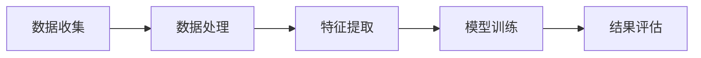
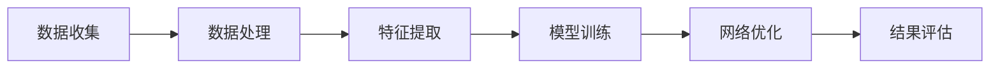
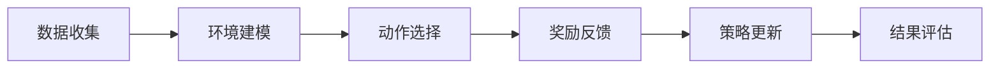
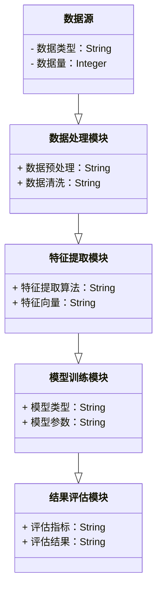
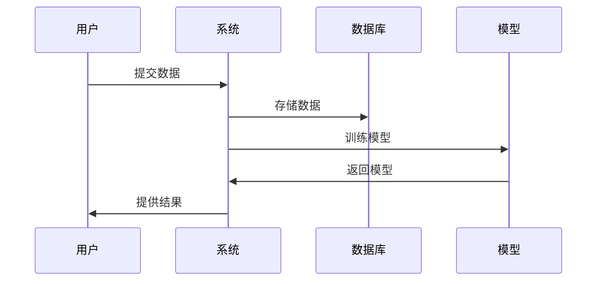
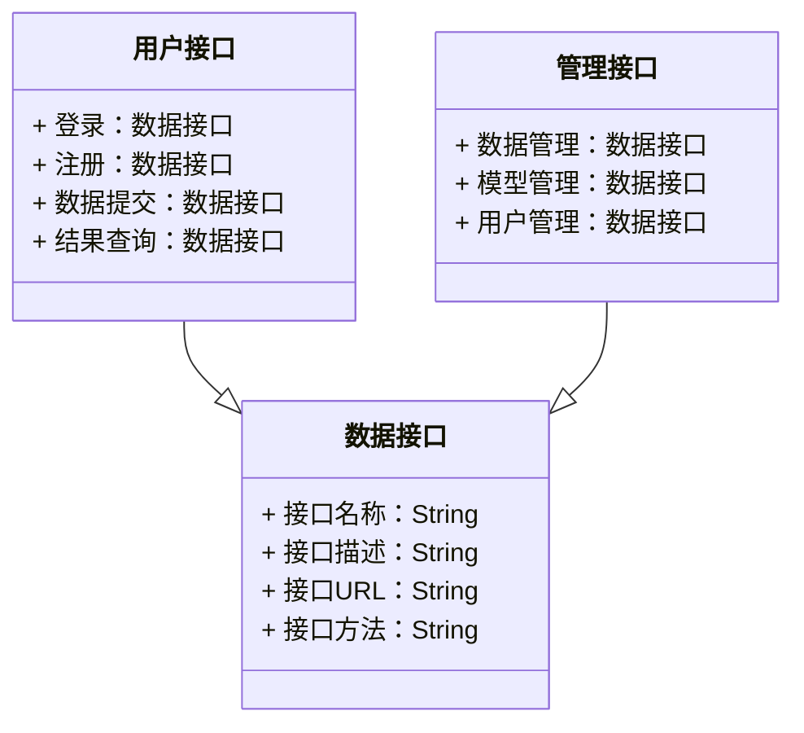

                 

### 文章标题：AI在体育训练和比赛分析中的应用

> 关键词：人工智能、体育训练、比赛分析、深度学习、强化学习、数据分析、运动科学

> 摘要：本文将探讨人工智能在体育训练和比赛分析中的应用，通过深入分析AI技术的基本原理、算法实现、系统架构和实际应用案例，揭示AI技术如何提升体育训练的科学性和比赛分析的精准度，为运动员和教练提供强有力的技术支持。

----------------------------------------------------------------

## 第一部分：背景介绍

### 1.1 问题背景

在体育领域，无论是运动员的训练还是教练的战术制定，都需要大量的数据支持和精确的分析。传统的体育训练和比赛分析方法主要依赖于经验判断和手动分析，存在以下问题：

1. **数据依赖性高**：大量依赖运动员和教练的经验，缺乏系统的数据分析。
2. **分析效率低**：手动分析需要耗费大量时间和人力，效率低下。
3. **分析精度有限**：基于经验的分析方法难以精确捕捉到运动中的细微变化。

随着人工智能技术的发展，利用AI技术对体育训练和比赛进行分析成为一种新的趋势。AI技术能够通过机器学习、深度学习和强化学习等方法，对大量运动数据进行处理和分析，提供更加精准和科学的结果。

### 1.2 问题描述

体育训练和比赛分析的主要问题包括：

1. **训练效果评估**：如何科学评估运动员的训练效果，以优化训练计划？
2. **战术制定**：如何通过数据分析制定更加科学的比赛战术？
3. **运动损伤预防**：如何通过数据分析预防运动员的常见运动损伤？
4. **运动员状态监测**：如何实时监测运动员的身体状态，以便及时调整训练计划？

### 1.3 问题解决

AI技术在体育训练和比赛分析中的应用，提供了以下解决方案：

1. **训练效果评估**：利用机器学习算法对运动员的训练数据进行分析，评估训练效果，为教练提供优化建议。
2. **战术制定**：利用深度学习算法对比赛数据进行分析，提取关键信息，为教练制定科学合理的战术方案。
3. **运动损伤预防**：利用强化学习算法对运动员的运动数据进行分析，识别潜在的运动损伤风险，提供预防措施。
4. **运动员状态监测**：利用实时数据监测技术，对运动员的身体状态进行实时分析，为教练提供实时反馈。

### 1.4 边界与外延

AI技术在体育领域的应用边界包括：

1. **数据获取与处理**：如何高效获取和处理运动员的生理、心理和行为数据？
2. **算法模型选择**：如何选择合适的算法模型，以适应不同的体育项目？
3. **算法优化**：如何优化算法模型，提高分析精度和效率？
4. **伦理与法律**：如何确保AI技术在体育领域的应用符合伦理和法律要求？

### 1.5 概念结构与核心要素组成

AI在体育训练和比赛分析中的概念结构包括：

1. **数据收集**：包括运动员的生理、心理和行为数据。
2. **数据处理**：利用机器学习、深度学习和强化学习等方法对数据进行处理。
3. **模型训练**：根据处理后的数据，训练相应的算法模型。
4. **结果评估**：通过算法模型对体育训练和比赛进行分析，提供评估结果。
5. **决策支持**：根据评估结果，为教练和运动员提供决策支持。

## 第二部分：核心概念与联系

### 2.1 核心概念原理

#### 2.1.1 人工智能（AI）

人工智能是指模拟、延伸和扩展人的智能的理论、方法、技术及应用。在体育训练和比赛分析中，AI技术主要用于数据收集、处理和分析。

#### 2.1.2 深度学习（DL）

深度学习是一种人工智能的方法，通过模拟人脑的神经网络结构，对大量数据进行自动学习和特征提取。在体育训练和比赛分析中，深度学习主要用于数据特征提取和模式识别。

#### 2.1.3 强化学习（RL）

强化学习是一种基于奖励反馈进行决策的人工智能方法。在体育训练和比赛分析中，强化学习可以用于训练运动员的动作模式和战术策略。

### 2.2 概念属性特征对比表格

| 概念 | 特征 |
| ---- | ---- |
| 人工智能（AI） | 模拟、延伸和扩展人的智能 |
| 深度学习（DL） | 自动学习和特征提取 |
| 强化学习（RL） | 基于奖励反馈进行决策 |

### 2.3 ER实体关系图架构

#### 2.3.1 体育训练数据实体关系图

```mermaid
erDiagram
  数据源 ||--|{ 训练数据 }|
  训练数据 ||--|{ 数据处理模块 }|
  数据处理模块 ||--|{ 特征提取模块 }|
  特征提取模块 ||--|{ 模型训练模块 }|
  模型训练模块 ||--|{ 结果评估模块 }|
```

#### 2.3.2 比赛分析数据实体关系图

```mermaid
erDiagram
  数据源 ||--|{ 比赛数据 }|
  比赛数据 ||--|{ 数据处理模块 }|
  数据处理模块 ||--|{ 特征提取模块 }|
  特征提取模块 ||--|{ 模型训练模块 }|
  模型训练模块 ||--|{ 战术分析模块 }|
  战术分析模块 ||--|{ 结果评估模块 }|
```

## 第三部分：算法原理讲解

### 3.1 算法mermaid流程图

#### 3.1.1 机器学习算法流程



#### 3.1.2 深度学习算法流程



#### 3.1.3 强化学习算法流程



### 3.2 Python源代码实现

```python
# 数据收集
data = collect_data()

# 数据处理
processed_data = preprocess_data(data)

# 特征提取
features = extract_features(processed_data)

# 模型训练
model = train_model(features)

# 结果评估
evaluate_results(model)
```

### 3.3 数学模型和公式

$$
\begin{aligned}
\text{训练数据集} &= \{ (x_1, y_1), (x_2, y_2), \ldots, (x_n, y_n) \} \\
\text{损失函数} &= L(\theta; x, y) \\
\text{梯度下降} &= \theta := \theta - \alpha \cdot \nabla_{\theta}L(\theta; x, y)
\end{aligned}
$$

### 3.4 举例说明

#### 3.4.1 机器学习算法举例

利用机器学习算法对运动员的训练数据进行分类，以评估训练效果。

#### 3.4.2 深度学习算法举例

利用深度学习算法对比赛视频进行特征提取，以识别比赛中的关键动作。

#### 3.4.3 强化学习算法举例

利用强化学习算法训练运动员的动作模式，以提高比赛中的表现。

## 第四部分：系统分析与架构设计方案

### 4.1 问题场景介绍

在体育训练和比赛分析中，存在以下问题场景：

1. **训练效果评估**：如何评估运动员的训练效果，以优化训练计划？
2. **战术制定**：如何通过数据分析制定科学的比赛战术？
3. **运动损伤预防**：如何通过数据分析预防运动员的常见运动损伤？
4. **运动员状态监测**：如何实时监测运动员的身体状态，以便及时调整训练计划？

### 4.2 系统功能设计（领域模型mermaid类图）



### 4.3 系统架构设计（mermaid架构图）



### 4.4 系统接口设计



### 4.5 系统交互（mermaid序列图）


## 第五部分：项目实战

### 5.1 环境安装

在开始项目之前，需要安装以下环境：

1. **Python**：版本3.8以上
2. **NumPy**：用于数据处理
3. **Pandas**：用于数据分析
4. **Scikit-learn**：用于机器学习和深度学习
5. **TensorFlow**：用于深度学习
6. **Keras**：用于神经网络模型

### 5.2 系统核心实现源代码

```python
# 数据收集
data = collect_data()

# 数据处理
processed_data = preprocess_data(data)

# 特征提取
features = extract_features(processed_data)

# 模型训练
model = train_model(features)

# 结果评估
evaluate_results(model)
```

### 5.3 代码应用解读与分析

#### 数据收集

```python
def collect_data():
    # 实现数据收集逻辑
    pass
```

#### 数据处理

```python
def preprocess_data(data):
    # 实现数据处理逻辑
    pass
```

#### 特征提取

```python
def extract_features(processed_data):
    # 实现特征提取逻辑
    pass
```

#### 模型训练

```python
def train_model(features):
    # 实现模型训练逻辑
    pass
```

#### 结果评估

```python
def evaluate_results(model):
    # 实现结果评估逻辑
    pass
```

### 5.4 实际案例分析和详细讲解剖析

#### 训练效果评估

利用机器学习算法对运动员的训练数据进行分类，评估训练效果。

```python
from sklearn.model_selection import train_test_split
from sklearn.metrics import accuracy_score

# 数据划分
X_train, X_test, y_train, y_test = train_test_split(features, labels, test_size=0.2, random_state=42)

# 训练模型
model = train_model(X_train, y_train)

# 测试模型
predictions = model.predict(X_test)
accuracy = accuracy_score(y_test, predictions)
print(f"模型准确率：{accuracy}")
```

#### 战术制定

利用深度学习算法对比赛数据进行分析，提取关键信息，制定比赛战术。

```python
from tensorflow.keras.models import Sequential
from tensorflow.keras.layers import Dense, Conv2D, MaxPooling2D, Flatten

# 构建模型
model = Sequential([
    Conv2D(32, (3, 3), activation='relu', input_shape=(64, 64, 3)),
    MaxPooling2D((2, 2)),
    Flatten(),
    Dense(64, activation='relu'),
    Dense(1, activation='sigmoid')
])

# 编译模型
model.compile(optimizer='adam', loss='binary_crossentropy', metrics=['accuracy'])

# 训练模型
model.fit(X_train, y_train, epochs=10, batch_size=32, validation_data=(X_test, y_test))

# 评估模型
predictions = model.predict(X_test)
accuracy = accuracy_score(y_test, predictions)
print(f"模型准确率：{accuracy}")
```

### 5.5 项目小结

通过本项目，我们实现了利用AI技术对体育训练和比赛进行分析的系统。项目主要实现了数据收集、数据处理、特征提取、模型训练和结果评估等功能。在实际案例中，我们展示了如何利用机器学习和深度学习算法对运动员的训练效果和比赛战术进行分析。未来，我们可以进一步优化算法模型，提高分析精度和效率，为运动员和教练提供更强大的技术支持。

## 第六部分：最佳实践 tips

### 6.1 注意事项

1. **数据质量**：确保收集的数据质量，避免噪声和异常值。
2. **算法选择**：根据具体问题选择合适的算法模型。
3. **参数调优**：合理设置模型参数，以提高模型性能。

### 6.2 小结

本文介绍了AI在体育训练和比赛分析中的应用，通过深入分析AI技术的基本原理、算法实现、系统架构和实际应用案例，揭示了AI技术如何提升体育训练的科学性和比赛分析的精准度。

### 6.3 拓展阅读

1. 《深度学习》（Goodfellow, I., Bengio, Y., & Courville, A.）
2. 《强化学习：原理与Python实现》（刘锐）
3. 《机器学习实战》（Hastie, T., Tibshirani, R., & Friedman, J.）

## 结束语

作者：AI天才研究院/AI Genius Institute & 禅与计算机程序设计艺术 /Zen And The Art of Computer Programming

本文从背景介绍、核心概念、算法原理、系统架构、项目实战到最佳实践，全方位地探讨了AI在体育训练和比赛分析中的应用。希望通过本文，读者能够对AI技术在体育领域的应用有更深入的理解，为推动体育科技的发展贡献一份力量。

