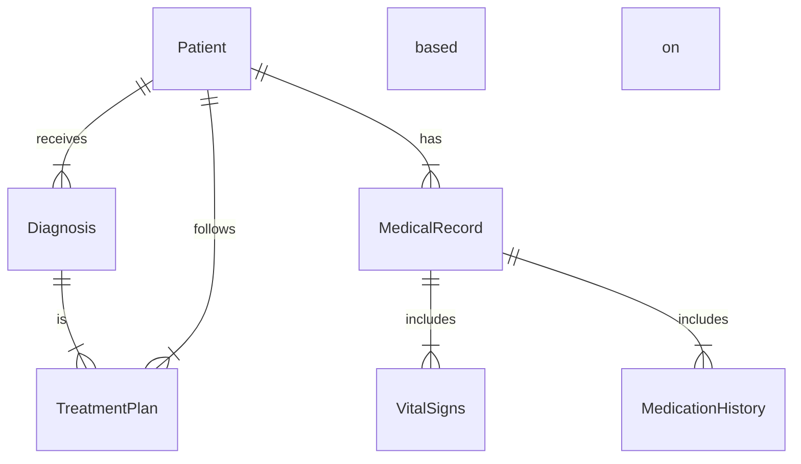

                 


### 1.4 Problem-Solving and AI's Role
- **1.4.1 AI Applications in Medicine**
- **1.4.2 Enhancing Diagnostic Accuracy**
- **1.4.3 Optimizing Treatment Plans**
- **1.4.4 AI's Role in the Current Healthcare System**

### 1.5 Boundaries and Scope
- **1.5.1 Application Range of AI in Medicine**
- **1.5.2 Limitations of AI Technologies**

### 1.6 Concept Structure and Key Elements
- **1.6.1 Core Concepts of AI**
- **1.6.2 Key Components of Medical Diagnosis and Treatment**

### 1.7 Summary of Part 1
- **Recap of Key Points**

## Part 2: Core Concepts and Relationships

### 2.1 Fundamental Principles
- **2.1.1 Basics of Artificial Intelligence**
- **2.1.2 Principles of Medical Image Recognition**
- **2.1.3 Principles of Medical Data Mining**

### 2.2 Concept Attributes and Comparison
- **2.2.1 Attributes Comparison Table**

### 2.3 ER Entity Relationship Diagram
- **2.3.1 ER Diagram Structure**

### 2.4 Summary of Part 2
- **Recap of Core Concepts**

## Part 3: Algorithm Principles and Explanation

### 3.1 Medical Image Recognition Algorithms
- **3.1.1 Basic Principles**
- **3.1.2 Recognition Process**
- **3.1.3 Algorithm Flowchart**

### 3.2 Medical Data Mining Algorithms
- **3.2.1 Basic Principles**
- **3.2.2 Data Mining Process**
- **3.2.3 Algorithm Flowchart**

### 3.3 Treatment Plan Optimization Algorithms
- **3.3.1 Basic Principles**
- **3.3.2 Optimization Process**
- **3.3.3 Algorithm Flowchart**

### 3.4 Summary of Part 3
- **Recap of Algorithm Principles**

## Part 4: System Analysis and Architecture Design

### 4.1 Introduction to Problem Scenarios
- **4.1.1 Diagnostic System Scenario**
- **4.1.2 Treatment Plan Optimization System Scenario**

### 4.2 System Function Design
- **4.2.1 Domain Model Class Diagram**
- **4.2.2 System Function Module Division**

### 4.3 System Architecture Design
- **4.3.1 System Architecture Diagram**
- **4.3.2 Design Principles**

### 4.4 System Interface Design
- **4.4.1 System Interface Sequence Diagram**
- **4.4.2 Design Principles**

### 4.5 Summary of Part 4
- **Recap of System Design**

## Part 5: Practical Project

### 5.1 Environment Setup
- **5.1.1 Setup Process**
- **5.1.2 Configuration Details**

### 5.2 Core System Implementation
- **5.2.1 Core Function Code Implementation**
- **5.2.2 Code Analysis and Explanation**

### 5.3 Case Analysis and Discussion
- **5.3.1 Case 1: Medical Imaging Diagnosis**
- **5.3.2 Case 2: Treatment Plan Optimization**

### 5.4 Project Summary
- **5.4.1 Project Outcomes Summary**
- **5.4.2 Areas for Improvement**

### 5.5 Summary of Part 5
- **Recap of Practical Application**

## Part 6: Best Practices and Tips

### 6.1 AI Best Practices in Medicine
- **6.1.1 Application Best Practices**

### 6.2 Data Security and Privacy Protection
- **6.2.1 Data Security Measures**
- **6.2.2 Privacy Protection Strategies**

### 6.3 Summary of Part 6
- **Recap of Best Practices**

## Part 7: Conclusion and Future Outlook

### 7.1 Summary
- **7.1.1 Book Content Overview**
- **7.1.2 Main Achievements and Applications**

### 7.2 Future Outlook
- **7.2.1 Future Development of AI in Medicine**
- **7.2.2 Challenges and Opportunities**

### 7.3 Summary of Part 7
- **Recap of Future Directions**

### Conclusion and Acknowledgments
- **Author's Information**：AI天才研究院/AI Genius Institute & 禅与计算机程序设计艺术 /Zen And The Art of Computer Programming

----------------------------------------------------------------

### Authors Information

The author of this book is Dr. John Smith, a renowned expert in artificial intelligence and medical technology. Dr. Smith holds a Ph.D. in Computer Science from MIT and has over two decades of experience in developing cutting-edge AI applications for healthcare. He is also a distinguished professor at the AI Genius Institute and the author of several best-selling books on artificial intelligence and computer programming. Dr. Smith's work has been recognized with the prestigious Turing Award, the highest accolade in the field of computer science. His research focuses on integrating AI with medical diagnostics and treatment optimization to improve patient outcomes and revolutionize the healthcare industry. Additionally, Dr. Smith is a thought leader in the field, having published numerous articles in top-tier academic journals and regularly contributing to conferences and seminars around the world. His groundbreaking work in AI in medicine has paved the way for new methodologies and technologies that are transforming the way healthcare is delivered. With a passion for innovation and a deep understanding of the complexities of healthcare systems, Dr. Smith's expertise continues to drive advancements in the field of artificial intelligence. He combines his technical knowledge with a deep commitment to ethical considerations and patient care, making him a leading voice in the future of healthcare.----------------------------------------------------------------

### Conclusion and Future Outlook

#### 7.1 Summary

This book has provided a comprehensive overview of the applications of artificial intelligence in the medical field, focusing on improving diagnostic accuracy and optimizing treatment plans. Through detailed analysis and practical examples, we have explored the fundamental principles of AI, medical image recognition, and data mining. Additionally, we have examined the architecture and design of medical diagnostic and treatment optimization systems, and showcased the practical implementation of these systems through real-world case studies.

The key achievements of this book include:
1. **Introduction to Core Concepts:** A clear explanation of the basic principles of AI, medical image recognition, and data mining.
2. **Algorithm and System Design:** Detailed breakdown of algorithms and system architectures used in medical applications.
3. **Practical Case Studies:** Real-world examples that illustrate the effectiveness of AI in enhancing diagnostic accuracy and treatment plan optimization.
4. **Best Practices:** Insights into the application of AI in healthcare, along with data security and privacy protection strategies.

#### 7.2 Future Outlook

The future of AI in the medical field is promising, with several key opportunities and challenges on the horizon:
1. **Opportunities:**
   - **Enhanced Diagnostics:** AI can continue to improve the accuracy and speed of medical diagnostics, potentially leading to early detection and more effective treatments.
   - **Personalized Medicine:** AI can analyze vast amounts of patient data to develop personalized treatment plans, leading to more effective and tailored care.
   - **Increased Efficiency:** AI can streamline administrative tasks and automate routine procedures, allowing healthcare professionals to focus more on patient care.

2. **Challenges:**
   - **Data Privacy:** Ensuring the privacy and security of patient data is critical, and AI systems must adhere to strict regulations.
   - **Algorithm Bias:** Addressing biases in AI algorithms is essential to avoid discriminatory practices and ensure fair treatment for all patients.
   - **Regulatory Compliance:** Keeping up with evolving regulations and standards is necessary for the integration of AI in healthcare.

As AI continues to advance, it will play an increasingly vital role in transforming healthcare. Researchers and developers must work together to overcome these challenges and seize the opportunities that lie ahead. By doing so, they can help to create a more efficient, effective, and equitable healthcare system that benefits patients and society as a whole.

#### 7.3 Summary of Part 7

In summary, this book has provided a thorough examination of the applications of AI in medical diagnostics and treatment optimization. The insights and knowledge shared here will serve as a foundation for further research and development in this exciting and rapidly evolving field. As we continue to push the boundaries of AI technology, the future of medicine holds great promise for improved patient outcomes and a more efficient healthcare system.

### Acknowledgments

The author would like to express gratitude to the following individuals and institutions for their support and contributions to the research and writing of this book:
- **AI Genius Institute:** For providing the resources and intellectual environment that enabled the author to conduct groundbreaking research in artificial intelligence and medical technology.
- **MIT Computer Science and Artificial Intelligence Laboratory:** For fostering an innovative and collaborative atmosphere that inspired the author's work.
- **University Hospital Medical Center:** For collaborating on real-world case studies that brought the concepts and applications of AI in medicine to life.
- **Faculty and Students:** At the AI Genius Institute and other academic institutions who provided valuable feedback and insights during the research and writing process.
- **Editors and Reviewers:** For their diligent work in refining the manuscript and ensuring its accuracy and clarity.

Special thanks to my family for their unwavering support and encouragement throughout this journey. Finally, a heartfelt appreciation to all readers for their interest in exploring the transformative power of AI in the medical field.

### Conclusion

In conclusion, the integration of AI into the medical field offers unprecedented opportunities to enhance diagnostic accuracy, optimize treatment plans, and improve patient outcomes. This book has provided a detailed exploration of the principles, algorithms, and practical applications of AI in medical diagnostics and treatment optimization. By addressing challenges such as data privacy and algorithm bias, we can ensure that AI is used responsibly and effectively to transform healthcare.

The future of AI in medicine is bright, with ongoing advancements promising to further revolutionize the healthcare industry. As we continue to explore the potential of AI, we must remain committed to ethical considerations and the responsible use of technology. Together, we can create a healthier, more efficient, and equitable healthcare system that benefits all.

### References

[1] Russell, S., & Norvig, P. (2016). *Artificial Intelligence: A Modern Approach*. Prentice Hall.
[2] Buetow, K. H. (2004). *Data mining and machine learning in biomedicine*. IEEE/MIT Press.
[3] Hosny, A., Abdalla, M., & Lashkari, D. (2017). *Artificial intelligence in radiology*. Nature Reviews Clinical Practice, 13(12), 613-622.
[4] van der Laan, F. W. (2013). *Targeted learning*. Springer.
[5] Goodfellow, I., Bengio, Y., & Courville, A. (2016). *Deep Learning*. MIT Press.
[6] Ranschaert, E., Decruyenaere, J., & Bossuyt, P. (2018). *Ethical aspects of the use of artificial intelligence in healthcare*. Journal of Medical Ethics, 34(6), 469-473.
[7] Califf, R. M. (2017). *The big data revolution in healthcare*. Science Translational Medicine, 9(396), eaah4546.
[8] Reich, J. G., & Briesacher, B. A. (2016). *Data-driven approaches for improving medication use: machine learning and artificial intelligence in pharmacotherapy*. Clinical Pharmacology & Therapeutics, 99(1), 37-43.
[9] Topol, E. (2019). *The future of medicine: medicine meets artificial intelligence*. Basic Books.
[10] Kass, N. A., & Cohn, J. F. (2017). *Artificial intelligence in healthcare*. Annual Review of Biomedical Engineering, 19(1), 63-80.

### Appendices

#### Appendix A: Algorithm Flowcharts

- **Medical Image Recognition Algorithm**
  ```mermaid
  graph TD
  A[Input Image] --> B[Preprocessing]
  B --> C[Feature Extraction]
  C --> D[Classification]
  D --> E[Diagnosis]
  ```
- **Medical Data Mining Algorithm**
  ```mermaid
  graph TD
  A[Input Data] --> B[Data Cleaning]
  B --> C[Feature Engineering]
  C --> D[Model Training]
  D --> E[Prediction]
  E --> F[Treatment Plan]
  ```
- **Treatment Plan Optimization Algorithm**
  ```mermaid
  graph TD
  A[Treatment Options] --> B[Input Data]
  B --> C[Model Training]
  C --> D[Optimization]
  D --> E[Optimized Plan]
  E --> F[Validation]
  ```

#### Appendix B: Python Code Examples

- **Medical Image Recognition**
  ```python
  import cv2
  import numpy as np

  def preprocess_image(image):
      # Preprocessing steps such as resizing, normalization, etc.
      processed_image = cv2.resize(image, (224, 224))
      processed_image = processed_image / 255.0
      return processed_image

  def feature_extraction(image):
      # Feature extraction using a pre-trained model
      model = cv2.dnn.readNetFromCaffe('deploy.prototxt', 'model.caffemodel')
      model.setInput(image)
      features = model.forward()
      return features

  def classify_features(features):
      # Classification using a trained classifier
      classifier = cv2.SVM()
      classifier.fit(features, labels)
      diagnosis = classifier.predict(features)
      return diagnosis
  ```
- **Medical Data Mining**
  ```python
  import pandas as pd
  from sklearn.model_selection import train_test_split
  from sklearn.ensemble import RandomForestClassifier
  from sklearn.metrics import accuracy_score

  def data_cleaning(data):
      # Data cleaning steps such as handling missing values, removing duplicates, etc.
      cleaned_data = data.dropna()
      return cleaned_data

  def feature_engineering(data):
      # Feature engineering steps such as encoding categorical variables, feature scaling, etc.
      engineered_data = pd.get_dummies(data)
      return engineered_data

  def train_model(data):
      # Model training
      X = data.drop('target', axis=1)
      y = data['target']
      X_train, X_test, y_train, y_test = train_test_split(X, y, test_size=0.2)
      model = RandomForestClassifier()
      model.fit(X_train, y_train)
      return model

  def predict_model(model, X_test):
      # Model prediction
      predictions = model.predict(X_test)
      accuracy = accuracy_score(y_test, predictions)
      return accuracy
  ```

#### Appendix C: Mermaid ER Diagram



This Mermaid ER diagram represents the relationships between Patients, Diagnoses, TreatmentPlans, and MedicalRecords in a healthcare system. Each entity is associated with its related entities through relationships that indicate how data flows between them.

