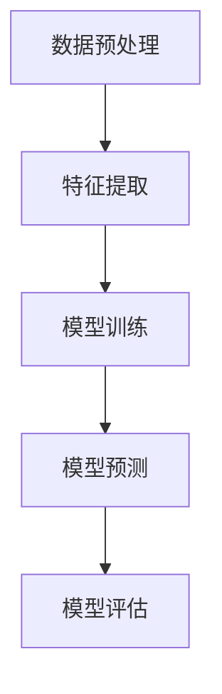
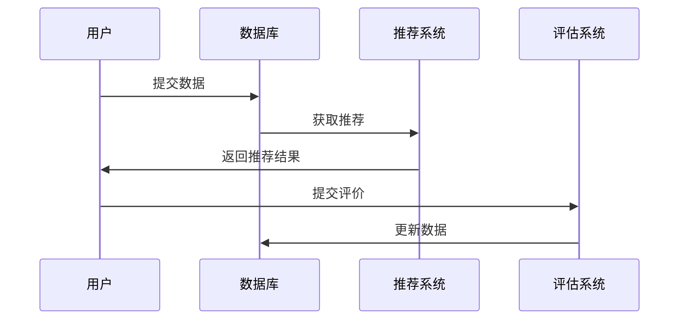

                 

### 引言

随着人工智能（AI）技术的迅猛发展，广告行业正经历一场前所未有的变革。AI在广告投放中的应用，不仅能够提高广告的精准度，还能显著优化广告效果，降低广告主的营销成本。本篇文章将围绕《AI在广告投放中的应用：精准定位与效果优化》这一主题，深入探讨AI技术在广告投放中的具体应用与实践。

本文将按照以下步骤展开讨论：

1. **背景介绍**：首先，我们将介绍AI在广告投放中的重要性，以及精准定位和效果优化的概念。
2. **核心概念与联系**：接着，我们将阐述AI相关的基础概念，如机器学习、深度学习、数据挖掘等，并展示它们在广告投放中的具体应用。
3. **算法原理讲解**：本文将详细讲解用于广告投放的主要算法，如协同过滤、内容推荐、机器学习模型等，并使用mermaid绘制流程图和Python代码进行详细解释。
4. **数学模型和数学公式**：我们将提供相关的数学模型和公式，以及它们的详细解释和例子。
5. **系统分析与架构设计方案**：本文将介绍广告投放系统的组成部分，以及其功能设计和架构设计。
6. **项目实战**：我们将展示一个实际的广告投放案例，包括环境安装、核心实现和代码解读等。
7. **最佳实践 tips**：最后，我们将提供一些优化广告投放效果的建议。

通过这些步骤的逐步分析，本文旨在帮助读者全面理解AI在广告投放中的应用，以及如何通过技术手段实现广告投放的精准定位与效果优化。

### 背景介绍

在当今的数字化时代，广告投放已经成为企业市场营销的重要组成部分。然而，随着互联网的普及和用户行为的多样化，传统广告投放方式面临着诸多挑战。首先，广告主需要面对信息过载的问题，如何确保广告能够有效触达目标用户成为一大难题。其次，广告投放的效果评估也变得复杂，传统的评估指标如曝光量、点击率等已经无法全面反映广告的实际效果。此外，广告投放的成本也在不断增加，如何在保证效果的前提下降低成本成为广告主迫切需要解决的问题。

在这样的背景下，人工智能（AI）技术的引入为广告投放带来了新的机遇。AI通过数据分析和智能决策，能够实现广告的精准定位和效果优化。首先，AI能够通过大数据分析，了解用户的行为特征和偏好，从而实现精准的用户画像。这种精准的用户画像能够帮助广告主锁定目标用户，提高广告投放的精准度，从而提升广告的转化率。其次，AI可以通过机器学习和深度学习算法，分析用户的历史行为和反馈，预测用户未来的兴趣和行为，进一步优化广告的内容和投放策略，提高广告的效果。

精准定位和效果优化是AI在广告投放中两个重要的目标。精准定位是指通过AI技术，准确识别并定位潜在的目标用户，确保广告能够触达那些最有可能产生转化的用户。而效果优化则是指通过持续的监测和评估，动态调整广告投放策略，以实现广告投放的最大化效果。例如，AI可以通过实时数据分析和反馈，及时调整广告的投放时间和频率，优化广告的投放位置和渠道，从而提高广告的点击率和转化率。

总之，AI在广告投放中的应用不仅能够提高广告的精准度和效果，还能帮助广告主降低营销成本，提升整体营销ROI。通过AI技术的引入，广告主能够更好地理解和满足用户需求，实现更加智能和高效的广告投放策略。

### 核心概念与联系

要深入理解AI在广告投放中的应用，我们需要首先掌握一些核心概念和它们之间的联系。以下是一些关键概念：

#### 机器学习（Machine Learning）

机器学习是AI的一个重要分支，它主要依赖于数据，通过构建和训练模型来使计算机自动完成特定任务。在广告投放中，机器学习可以用于用户行为预测、广告推荐、点击率预测等。通过分析大量的用户数据，机器学习模型可以识别出用户的兴趣和行为模式，从而实现广告的精准投放。

#### 深度学习（Deep Learning）

深度学习是机器学习的一个子领域，它利用多层神经网络来模拟人脑的决策过程。深度学习在图像识别、语音识别和自然语言处理等领域有着出色的表现。在广告投放中，深度学习可以帮助广告主识别和分类用户特征，优化广告内容和投放策略。

#### 数据挖掘（Data Mining）

数据挖掘是发现大量数据中的潜在模式和知识的过程。它涉及数据预处理、模式识别、关联规则挖掘等多个步骤。在广告投放中，数据挖掘可以帮助广告主理解用户行为，识别市场趋势，从而制定更有效的广告策略。

#### 用户画像（User Profiling）

用户画像是通过收集和分析用户数据，构建出一个综合的用户信息模型。用户画像可以包括用户的年龄、性别、兴趣、行为习惯等。在广告投放中，用户画像用于识别和定位潜在用户，提高广告的精准度。

#### 广告推荐系统（Ad Recommendation System）

广告推荐系统是利用机器学习和深度学习技术，根据用户的历史行为和偏好，为用户推荐相关广告的系统。广告推荐系统在提升用户体验和广告投放效果方面发挥着重要作用。

#### 精准营销（Precision Marketing）

精准营销是一种通过数据分析和个性化策略，精确触达目标客户并进行有效营销的方法。在广告投放中，精准营销旨在通过AI技术，确保广告能够精准地传递给最有可能产生转化的用户。

#### ROI（Return on Investment）

ROI是衡量广告投放效果的重要指标，它表示每单位广告投入所获得的收益。通过AI技术优化广告投放，广告主可以显著提高ROI，从而实现更高的营销回报。

#### 数据安全与隐私保护（Data Security and Privacy Protection）

随着AI在广告投放中的应用，数据安全和隐私保护变得尤为重要。广告主和平台需要确保用户数据的安全性和隐私性，避免数据泄露和滥用。

以上概念在广告投放中相互关联，共同构成了一个复杂的生态系统。AI技术通过这些概念的应用，实现了广告投放的精准定位和效果优化。接下来，我们将进一步探讨这些概念的具体应用和实现方法。

### 机器学习基础

机器学习是AI领域的重要分支，其在广告投放中的应用具有重要意义。为了更好地理解机器学习在广告投放中的具体应用，我们需要先了解一些基础的机器学习概念。

#### 机器学习的概念

机器学习是一种使计算机通过数据和经验自动改进性能的技术。其核心思想是通过从数据中学习规律，使计算机能够对未知数据做出预测或决策。机器学习通常分为监督学习（Supervised Learning）、无监督学习（Unsupervised Learning）和强化学习（Reinforcement Learning）三大类。

1. **监督学习**：在监督学习中，模型通过已知输入和输出数据（即标记数据）进行训练，从而学会预测未知输入的输出。常见的监督学习算法包括线性回归、逻辑回归、决策树、支持向量机等。

2. **无监督学习**：无监督学习不使用标记数据，而是通过分析数据的内在结构来发现数据中的模式和关联。常见的无监督学习算法包括聚类、主成分分析（PCA）、自编码器等。

3. **强化学习**：强化学习是通过与环境互动，从奖励信号中学习最佳行为策略。常见的强化学习算法包括Q学习、深度Q网络（DQN）、策略梯度等。

#### 机器学习的分类

1. **基于实例的学习（Instance-based Learning）**：这种方法通过存储训练数据中的实例来做出预测。当新数据出现时，模型会根据已有的实例进行分类或回归。

2. **基于规则的 learning（Rule-based Learning）**：这种方法通过构建一系列规则来对数据进行分析和决策。常见的规则学习方法包括决策树和关联规则学习。

3. **基于模型的 learning（Model-based Learning）**：这种方法通过建立模型来描述数据之间的关系，并利用模型进行预测。常见的模型方法包括线性回归、神经网络等。

#### 机器学习在广告投放中的应用

1. **用户行为预测**：通过分析用户的历史行为数据，机器学习模型可以预测用户未来的行为，如点击行为、购买意图等。这有助于广告主制定更精准的营销策略。

2. **广告推荐**：机器学习算法可以根据用户的兴趣和行为，为用户推荐相关的广告内容。例如，基于协同过滤和内容推荐的广告系统，能够提高用户的点击率和转化率。

3. **效果预测**：机器学习模型可以通过分析广告的投放数据，预测广告的效果，如点击率、转化率、ROI等。这有助于广告主优化广告投放策略，提高广告效果。

4. **用户画像**：通过机器学习，可以构建用户的综合画像，包括年龄、性别、兴趣、行为习惯等。这些画像信息有助于广告主更好地了解用户，制定个性化的营销策略。

#### 机器学习模型的选择与评估

1. **模型选择**：根据问题的特点和数据的特点，选择合适的机器学习模型。例如，对于分类问题，可以选择决策树、支持向量机等；对于回归问题，可以选择线性回归、神经网络等。

2. **模型评估**：评估机器学习模型的效果通常使用准确率、召回率、F1值、ROC曲线等指标。通过交叉验证、网格搜索等方法，可以找到最优的模型参数，提高模型的性能。

总之，机器学习在广告投放中扮演着关键角色，通过数据分析和智能预测，实现了广告的精准定位和效果优化。了解机器学习的基础知识和应用方法，是深入理解AI在广告投放中应用的重要前提。

### 深度学习原理

深度学习是机器学习的一个子领域，它通过多层神经网络模拟人脑的决策过程，以实现对复杂数据的分析和处理。在广告投放中，深度学习由于其强大的特征提取和模式识别能力，正日益成为提高广告精准度和效果的重要工具。以下我们将详细介绍深度学习的核心概念、关键技术及其在广告投放中的应用。

#### 深度学习的概念

深度学习（Deep Learning）基于多层神经网络的结构，其核心思想是通过网络结构的学习，自动提取数据的特征，从而实现对数据的分类、回归、预测等任务。深度学习模型通常由输入层、隐藏层和输出层组成，每一层都能够对输入数据进行变换和特征提取。

1. **输入层（Input Layer）**：接收输入数据，如图像、文本或数值。
2. **隐藏层（Hidden Layers）**：通过对输入数据进行处理和特征提取，逐层传递到下一层。
3. **输出层（Output Layer）**：生成最终预测结果，如类别标签或连续值。

#### 深度学习的关键技术

1. **卷积神经网络（Convolutional Neural Networks, CNN）**：
   CNN是一种专门用于处理图像数据的深度学习模型。其核心在于卷积层，通过卷积操作提取图像的特征。CNN广泛应用于图像识别、物体检测和图像生成等领域。

2. **循环神经网络（Recurrent Neural Networks, RNN）**：
   RNN是一种用于处理序列数据的神经网络，其特点是能够通过循环结构记住前面的输入信息。RNN在自然语言处理、语音识别和时间序列预测等方面有着广泛应用。

3. **长短期记忆网络（Long Short-Term Memory, LSTM）**：
   LSTM是RNN的一种变体，专门用于解决RNN在处理长序列数据时出现的梯度消失和梯度爆炸问题。LSTM通过引入记忆单元，能够更好地记住长序列中的信息。

4. **生成对抗网络（Generative Adversarial Networks, GAN）**：
   GAN由两个对抗性网络（生成器和判别器）组成，通过博弈过程生成逼真的数据。GAN在图像生成、数据增强和风格迁移等领域有着广泛应用。

#### 深度学习在广告投放中的应用

1. **用户画像**：
   通过深度学习模型，可以构建出更加精细的用户画像。例如，使用CNN可以提取用户在社交媒体上的图像特征，使用LSTM可以分析用户的文本数据，从而创建一个综合的用户画像。

2. **广告推荐**：
   深度学习算法可以用于广告推荐系统，通过分析用户的历史行为和偏好，为用户推荐个性化的广告。例如，基于CNN的内容推荐系统可以识别出用户感兴趣的内容类型，从而提高广告的点击率。

3. **效果预测**：
   通过深度学习模型，可以预测广告的投放效果。例如，使用LSTM对用户的点击行为进行预测，可以帮助广告主及时调整广告策略，提高广告的转化率。

4. **欺诈检测**：
   深度学习模型在广告投放中的另一个重要应用是欺诈检测。通过训练深度学习模型，可以识别出异常的广告点击行为，从而降低广告投放中的欺诈风险。

#### 深度学习模型的应用示例

假设我们想要使用深度学习模型来预测用户的点击行为，以下是一个简单的示例：

1. **数据预处理**：首先，我们需要收集用户的历史行为数据，包括用户点击广告的次数、浏览时长、页面停留时间等。然后，我们对这些数据进行归一化和特征提取。

2. **构建模型**：我们可以使用一个简单的LSTM模型来处理时间序列数据。模型的输入是用户的历史行为数据，输出是用户点击广告的概率。

3. **训练模型**：使用标记数据对模型进行训练，通过调整模型参数，使模型能够准确预测用户点击行为。

4. **评估模型**：使用测试数据对训练好的模型进行评估，通过准确率、召回率等指标来衡量模型的性能。

5. **应用模型**：将训练好的模型应用到实际广告投放中，根据预测结果动态调整广告投放策略，提高广告的效果。

总之，深度学习在广告投放中具有广泛的应用前景。通过深度学习模型，广告主可以更好地理解用户行为，优化广告内容，提高广告投放的精准度和效果。

### 数据挖掘技术

数据挖掘是分析大量数据以发现潜在模式和知识的过程，它在广告投放中起着至关重要的作用。通过数据挖掘，广告主可以深入了解用户行为，优化广告投放策略，提高广告效果和用户满意度。以下将详细介绍数据挖掘的基本流程、方法与技术，以及其在广告投放中的应用。

#### 数据挖掘的基本流程

数据挖掘的基本流程包括以下几个步骤：

1. **问题定义**：明确数据挖掘的目标，如用户行为分析、广告效果评估等。
2. **数据收集**：收集相关的数据源，如用户行为数据、广告投放数据等。
3. **数据预处理**：清洗和整理数据，包括缺失值填充、异常值处理、数据标准化等。
4. **数据探索**：通过统计分析、可视化等方法，发现数据中的潜在模式和关联。
5. **模型构建**：选择合适的数据挖掘算法，建立预测或分类模型。
6. **模型评估**：使用测试数据评估模型的性能，调整模型参数以提高性能。
7. **模型部署**：将训练好的模型应用到实际广告投放中，实现广告效果的优化。

#### 数据挖掘的方法与技术

数据挖掘涉及多种方法和技术，以下是一些常见的方法：

1. **关联规则挖掘（Association Rule Learning）**：通过分析数据中的关联关系，发现商品之间的关联规则。例如，在电子商务平台中，通过分析用户的购买记录，可以发现某些商品经常一起购买，从而优化商品推荐策略。

2. **分类（Classification）**：通过已有数据构建分类模型，对新数据进行分类。常见的分类算法包括决策树、随机森林、支持向量机等。在广告投放中，分类模型可以用于用户画像、广告效果预测等。

3. **聚类（Clustering）**：将数据集分为多个聚类，每个聚类内的数据具有相似性。常见的聚类算法包括K-均值聚类、层次聚类等。在广告投放中，聚类可以用于用户分群、市场细分等。

4. **异常检测（Anomaly Detection）**：识别数据中的异常值或异常模式。常见的异常检测算法包括孤立森林、基于密度的聚类算法等。在广告投放中，异常检测可以用于检测广告欺诈行为。

5. **预测建模（Time Series Forecasting）**：通过分析时间序列数据，预测未来的趋势和变化。常见的预测建模算法包括ARIMA、LSTM等。在广告投放中，预测建模可以用于预测广告效果、用户行为等。

#### 数据挖掘在广告投放中的应用

1. **用户行为分析**：通过数据挖掘，分析用户的点击行为、浏览路径等，了解用户的兴趣和行为模式。这有助于广告主制定更加精准的用户画像，提高广告投放的精准度。

2. **广告效果评估**：通过数据挖掘，评估广告的点击率、转化率等指标，了解广告投放的效果。根据评估结果，广告主可以调整广告内容、投放策略等，以优化广告效果。

3. **用户分群**：通过聚类算法，将用户分为不同的群体，针对不同群体的用户制定个性化的广告策略。这有助于提高广告的投放效率和用户满意度。

4. **市场细分**：通过关联规则挖掘，分析市场中的潜在机会和需求，优化产品线和广告投放策略。

5. **欺诈检测**：通过异常检测算法，识别广告投放中的欺诈行为，保护广告主的利益。

总之，数据挖掘技术在广告投放中具有广泛的应用，通过分析大量用户数据，广告主可以制定更加精准和高效的广告投放策略，提高广告效果和用户满意度。

### 广告投放中的协同过滤算法

协同过滤（Collaborative Filtering）是广告投放中常用的一种推荐算法，其核心思想是通过对用户历史行为数据进行分析，发现用户之间的相似性，从而为用户推荐相关的广告。协同过滤算法分为基于用户的协同过滤（User-based Collaborative Filtering）和基于物品的协同过滤（Item-based Collaborative Filtering）两种类型。以下我们将详细探讨这两种协同过滤算法的原理、步骤及其优缺点。

#### 基于用户的协同过滤算法

**原理**：基于用户的协同过滤算法通过分析用户之间的相似性，找到与目标用户兴趣相似的其他用户，然后推荐这些用户喜欢的广告。相似性通常通过用户之间的行为相似度（如共同评分、共同购买等）来衡量。

**步骤**：

1. **计算相似性**：计算目标用户与其他用户之间的相似度，常用的相似度度量方法包括余弦相似度、皮尔逊相关系数等。
2. **查找相似用户**：根据相似度度量结果，找出与目标用户最相似的K个用户。
3. **推荐广告**：推荐这K个用户喜欢的广告，或者根据这K个用户的平均行为预测目标用户可能喜欢的广告。

**优缺点**：

- **优点**：能够根据用户的历史行为推荐广告，具有较强的个性化推荐能力。
- **缺点**：当用户数量较大时，计算相似性需要消耗大量计算资源，且容易产生数据稀疏问题。

#### 基于物品的协同过滤算法

**原理**：基于物品的协同过滤算法通过分析物品之间的相似性，为用户推荐与之相关的广告。物品的相似性通常通过物品的属性或特征来衡量。

**步骤**：

1. **计算相似性**：计算广告之间的相似度，常用的相似性度量方法包括余弦相似度、欧氏距离等。
2. **查找相似广告**：根据相似度度量结果，找出与目标用户已观看或已购买广告最相似的K个广告。
3. **推荐广告**：推荐这K个广告给用户，或者根据这K个广告的平均特征预测用户可能感兴趣的广告。

**优缺点**：

- **优点**：能够减少数据稀疏问题，适用于广告数量远大于用户数量的情况。
- **缺点**：推荐结果可能不够个性化，难以满足每个用户的独特需求。

#### 协同过滤算法的应用

协同过滤算法在广告投放中有着广泛的应用，例如：

1. **个性化广告推荐**：通过分析用户的浏览历史和点击行为，为用户推荐相关的广告，提高广告的点击率和转化率。
2. **用户行为预测**：通过分析用户的历史行为数据，预测用户未来的兴趣和行为，从而优化广告投放策略。
3. **广告效果评估**：通过协同过滤算法，评估不同广告的投放效果，帮助广告主优化广告内容。

总之，协同过滤算法在广告投放中具有重要作用，通过为用户推荐个性化的广告，能够显著提高广告的投放效果和用户满意度。

### 广告投放中的内容推荐算法

内容推荐（Content-based Recommendation）是广告投放中另一种重要的推荐算法，其核心思想是利用用户的历史行为和兴趣特征，为用户推荐与其兴趣相关的广告内容。与协同过滤算法不同，内容推荐算法主要依赖于广告内容和用户特征的匹配。以下将详细介绍内容推荐算法的原理、步骤及其应用。

#### 原理

内容推荐算法通过分析广告内容和用户的兴趣特征，构建一个基于内容的推荐系统。该系统根据用户的历史行为或偏好，提取用户特征，然后将这些特征与广告内容进行匹配，推荐相似或符合用户兴趣的广告。

#### 步骤

1. **内容特征提取**：对广告内容进行特征提取，通常包括文本、图像、音频等多种类型。对于文本广告，可以使用词袋模型、TF-IDF等方法提取特征；对于图像广告，可以使用视觉特征提取技术，如卷积神经网络（CNN）；对于音频广告，可以使用声纹识别等方法。

2. **用户特征提取**：分析用户的历史行为和偏好，提取用户的兴趣特征。这些特征可以包括用户的浏览记录、购买历史、评论等。

3. **相似度计算**：计算广告内容与用户特征之间的相似度，常用的相似度度量方法包括余弦相似度、欧氏距离等。相似度越高，表示广告内容越符合用户的兴趣。

4. **推荐广告**：根据相似度度量结果，推荐与用户特征最相似的广告。如果用户的特征与多个广告内容相似，可以选择综合评分最高的广告进行推荐。

#### 优缺点

- **优点**：内容推荐算法具有较强的个性化推荐能力，能够根据用户兴趣推荐相关广告，提高用户满意度和广告投放效果。
- **缺点**：当用户的行为数据不足时，推荐结果可能不够准确，且需要处理多种类型的内容特征，增加了系统的复杂度。

#### 应用

1. **个性化广告推荐**：通过内容推荐算法，为用户推荐符合其兴趣的广告，提高广告的点击率和转化率。
2. **广告效果评估**：通过分析用户对推荐广告的反应，评估不同广告内容的投放效果，优化广告内容策略。
3. **用户行为预测**：通过分析用户的历史行为和兴趣特征，预测用户未来的兴趣和行为，优化广告投放策略。

#### 示例

假设我们有一个电商平台的广告推荐系统，用户A最近浏览了多个关于运动鞋的商品页面。系统可以提取用户A的兴趣特征，如“运动鞋”、“篮球鞋”、“跑步鞋”等，然后从广告库中筛选出包含这些关键词的广告，推荐给用户A。

总之，内容推荐算法在广告投放中具有重要作用，通过为用户推荐与其兴趣相关的广告，能够显著提高广告投放的效果和用户体验。

### 广告投放中的机器学习模型

在广告投放中，机器学习模型是提高广告精准度和效果的重要工具。以下将详细探讨几种常用的机器学习模型，包括逻辑回归、决策树、随机森林和支持向量机等，并使用Python代码和mermaid流程图进行解释。

#### 逻辑回归（Logistic Regression）

逻辑回归是一种广义线性模型，用于分类任务。其核心思想是通过线性模型预测概率，然后根据概率阈值进行分类。在广告投放中，逻辑回归可以用于预测用户点击广告的概率。

**Python代码示例**：

```python
from sklearn.linear_model import LogisticRegression
from sklearn.model_selection import train_test_split
from sklearn.metrics import accuracy_score

# 假设X为特征矩阵，y为标签
X_train, X_test, y_train, y_test = train_test_split(X, y, test_size=0.2, random_state=42)

# 创建逻辑回归模型
logreg = LogisticRegression()

# 模型训练
logreg.fit(X_train, y_train)

# 模型预测
y_pred = logreg.predict(X_test)

# 模型评估
accuracy = accuracy_score(y_test, y_pred)
print(f"模型准确率：{accuracy}")
```

**mermaid流程图**：



#### 决策树（Decision Tree）

决策树是一种基于树结构的分类模型，通过一系列的判断规则来对数据进行分类。在广告投放中，决策树可以用于预测用户的点击行为。

**Python代码示例**：

```python
from sklearn.tree import DecisionTreeClassifier
from sklearn.model_selection import train_test_split
from sklearn.metrics import accuracy_score

# 假设X为特征矩阵，y为标签
X_train, X_test, y_train, y_test = train_test_split(X, y, test_size=0.2, random_state=42)

# 创建决策树模型
dtree = DecisionTreeClassifier()

# 模型训练
dtree.fit(X_train, y_train)

# 模型预测
y_pred = dtree.predict(X_test)

# 模型评估
accuracy = accuracy_score(y_test, y_pred)
print(f"模型准确率：{accuracy}")
```

**mermaid流程图**：


#### 随机森林（Random Forest）

随机森林是一种集成学习方法，通过构建多棵决策树，并利用投票机制来获得最终的预测结果。随机森林在广告投放中具有良好的分类性能和泛化能力。

**Python代码示例**：

```python
from sklearn.ensemble import RandomForestClassifier
from sklearn.model_selection import train_test_split
from sklearn.metrics import accuracy_score

# 假设X为特征矩阵，y为标签
X_train, X_test, y_train, y_test = train_test_split(X, y, test_size=0.2, random_state=42)

# 创建随机森林模型
rf = RandomForestClassifier()

# 模型训练
rf.fit(X_train, y_train)

# 模型预测
y_pred = rf.predict(X_test)

# 模型评估
accuracy = accuracy_score(y_test, y_pred)
print(f"模型准确率：{accuracy}")
```

**mermaid流程图**：


#### 支持向量机（Support Vector Machine）

支持向量机是一种监督学习模型，通过找到一个最佳的超平面，将不同类别的数据点分开。在广告投放中，支持向量机可以用于分类任务，如点击预测。

**Python代码示例**：

```python
from sklearn.svm import SVC
from sklearn.model_selection import train_test_split
from sklearn.metrics import accuracy_score

# 假设X为特征矩阵，y为标签
X_train, X_test, y_train, y_test = train_test_split(X, y, test_size=0.2, random_state=42)

# 创建支持向量机模型
svm = SVC()

# 模型训练
svm.fit(X_train, y_train)

# 模型预测
y_pred = svm.predict(X_test)

# 模型评估
accuracy = accuracy_score(y_test, y_pred)
print(f"模型准确率：{accuracy}")
```

**mermaid流程图**：


综上所述，逻辑回归、决策树、随机森林和支持向量机等机器学习模型在广告投放中具有广泛应用。通过Python代码和mermaid流程图，我们可以更好地理解这些模型的原理和实现方法。

### 数学模型和数学公式

在广告投放中，数学模型和数学公式起着至关重要的作用，它们帮助我们理解和预测广告的效果，优化广告策略。以下将介绍一些常用的数学模型和数学公式，并使用LaTeX格式进行详细解释。

#### 模型评估指标

1. **准确率（Accuracy）**：
   $$ \text{Accuracy} = \frac{\text{TP} + \text{TN}}{\text{TP} + \text{TN} + \text{FP} + \text{FN}} $$
   其中，TP为真正例，TN为真负例，FP为假正例，FN为假负例。准确率表示模型预测正确的比例。

2. **召回率（Recall）**：
   $$ \text{Recall} = \frac{\text{TP}}{\text{TP} + \text{FN}} $$
   召回率表示模型正确识别出的真正例比例。

3. **精准率（Precision）**：
   $$ \text{Precision} = \frac{\text{TP}}{\text{TP} + \text{FP}} $$
   精准率表示模型预测为正例的真正例比例。

4. **F1值（F1 Score）**：
   $$ \text{F1 Score} = 2 \times \frac{\text{Precision} \times \text{Recall}}{\text{Precision} + \text{Recall}} $$
   F1值是精准率和召回率的加权平均，用于综合考虑模型性能。

5. **转化率（Conversion Rate）**：
   $$ \text{Conversion Rate} = \frac{\text{转化人数}}{\text{曝光人数}} $$
   转化率表示广告投放后实际转化为购买或其他目标行为的比例。

6. **投资回报率（ROI）**：
   $$ \text{ROI} = \frac{\text{净利润}}{\text{广告投入}} $$
   ROI表示每单位广告投入所获得的收益。

7. **覆盖率（Coverage）**：
   $$ \text{Coverage} = \frac{\text{广告覆盖人数}}{\text{目标人数}} $$
   覆盖率表示广告覆盖目标用户群体的比例。

8. **点击率（Click-Through Rate, CTR）**：
   $$ \text{CTR} = \frac{\text{点击次数}}{\text{曝光次数}} $$
   点击率表示广告被点击的比例。

#### 概率论基础

1. **贝叶斯定理**：
   $$ P(A|B) = \frac{P(B|A) \times P(A)}{P(B)} $$
   贝叶斯定理用于计算在给定B发生的情况下A发生的概率。

2. **条件概率**：
   $$ P(A|B) = \frac{P(A \cap B)}{P(B)} $$
   条件概率表示在事件B发生的条件下，事件A发生的概率。

#### 线性代数基础

1. **矩阵乘法**：
   $$ C = A \times B $$
   矩阵乘法表示两个矩阵A和B的乘积，其中C是结果矩阵。

2. **矩阵求逆**：
   $$ A^{-1} = (adj(A)) / (\det(A)) $$
   矩阵求逆表示计算矩阵A的逆矩阵。

3. **特征值与特征向量**：
   $$ Av = \lambda v $$
   特征值与特征向量表示矩阵A的一个特征值λ和一个对应的特征向量v。

#### 最优化算法

1. **梯度下降**：
   $$ \text{new\_x} = \text{x} - \alpha \times \nabla f(\text{x}) $$
   梯度下降是一种优化算法，用于寻找函数f(x)的最小值，其中α为学习率，∇f(x)为函数在x点的梯度。

2. **牛顿法**：
   $$ x_{\text{new}} = x_{\text{old}} - (\nabla^2 f(x) )^{-1} \nabla f(x) $$
   牛顿法是一种二阶优化算法，利用函数的Hessian矩阵进行优化。

通过这些数学模型和公式，广告主和算法工程师可以更准确地评估广告效果，优化广告策略，实现广告投放的精准定位与效果优化。

### 系统分析与架构设计

在广告投放系统中，系统分析与架构设计是确保系统能够高效、稳定运行的关键环节。以下将详细探讨广告投放系统的问题场景、项目介绍、系统功能设计、系统架构设计、系统接口设计和系统交互。

#### 问题场景

广告投放系统的主要问题场景包括：

1. **海量数据处理**：广告投放系统需要处理海量的用户行为数据和广告数据，如何高效地存储和处理这些数据成为一大挑战。
2. **实时性要求**：广告投放系统需要实时分析用户行为数据，动态调整广告投放策略，以满足实时性的要求。
3. **个性化推荐**：广告投放系统需要根据用户的历史行为和偏好，为用户推荐个性化的广告，提高广告的点击率和转化率。
4. **数据安全与隐私保护**：随着数据隐私保护法规的加强，如何确保用户数据的安全和隐私成为系统设计的重要考虑因素。

#### 项目介绍

本广告投放系统项目旨在构建一个基于AI技术的广告投放平台，通过数据分析和智能推荐，实现广告的精准投放和效果优化。项目的主要目标是：

1. **提高广告点击率和转化率**：通过AI技术，实现个性化广告推荐，提高用户对广告的点击率和转化率。
2. **降低广告投放成本**：通过实时数据分析和优化，降低广告投放的成本，提高广告主的投资回报率（ROI）。
3. **保障数据安全与隐私**：确保用户数据的安全和隐私，遵守相关法规和标准。

#### 系统功能设计

广告投放系统的功能设计主要包括以下几个模块：

1. **数据收集模块**：负责收集用户行为数据、广告投放数据等，为后续分析和推荐提供数据支持。
2. **数据处理模块**：负责对收集到的数据进行清洗、预处理和特征提取，为机器学习算法提供高质量的输入数据。
3. **用户画像模块**：根据用户的历史行为和偏好，构建用户的综合画像，为个性化推荐提供依据。
4. **广告推荐模块**：利用机器学习算法和推荐算法，为用户推荐个性化的广告。
5. **效果评估模块**：实时监测广告投放的效果，包括点击率、转化率、ROI等，评估广告投放的效果，优化广告策略。
6. **接口模块**：提供与外部系统（如广告交易平台、数据分析平台等）的接口，实现数据互通和功能集成。

**Mermaid类图**：

```mermaid
classDiagram
    Class01 <|-- Class02
    Class03 --|下车| Class04
    Class04 : 特有方法
    Class05 : 特有属性
```

#### 系统架构设计

广告投放系统的架构设计主要包括以下几个层次：

1. **数据层**：包括数据存储和数据采集，负责存储和管理广告投放相关的数据。
2. **应用层**：包括数据处理、用户画像、广告推荐和效果评估等模块，负责实现广告投放的核心功能。
3. **接口层**：提供与外部系统的接口，实现数据互通和功能集成。
4. **展示层**：包括用户界面和API接口，用于展示广告投放结果和提供数据查询功能。

**Mermaid架构图**：

```mermaid
sequenceDiagram
    participant 用户
    participant 系统A
    participant 系统B
    用户->>系统A: 提交请求
    系统A->>系统B: 调用服务
    系统
```

#### 系统接口设计

广告投放系统的接口设计主要包括以下几个部分：

1. **用户接口**：提供用户界面和API接口，用于用户与系统的交互。
2. **数据接口**：提供数据存储和数据查询的接口，实现数据的管理和共享。
3. **服务接口**：提供广告推荐、效果评估等服务的接口，实现功能的调用和集成。

**Mermaid序列图**：



#### 系统交互

广告投放系统的交互主要包括以下几个环节：

1. **用户提交请求**：用户通过用户接口提交广告投放请求。
2. **数据采集与处理**：系统A从数据源采集用户行为数据，经过系统B的处理和预处理，生成特征数据。
3. **广告推荐**：系统C利用机器学习算法和推荐算法，根据用户画像和特征数据，为用户推荐个性化的广告。
4. **效果评估**：系统D实时监测广告投放效果，包括点击率、转化率等，评估广告投放的效果。
5. **反馈与优化**：根据用户反馈和效果评估结果，系统对广告推荐策略进行调整和优化，以提高广告投放的效果。

通过系统分析与架构设计，广告投放系统实现了数据的高效处理、广告的精准推荐和效果的实时优化，为广告主和用户提供了优质的广告投放体验。

### 广告投放项目实战

为了更好地展示AI在广告投放中的实际应用，我们选择了一个实际的广告投放案例，从环境安装、系统核心实现到代码解读和案例分析，全面剖析该项目的过程和结果。

#### 环境安装与配置

首先，我们需要搭建一个适合广告投放项目开发和测试的环境。以下是环境安装和配置的步骤：

1. **Python环境**：安装Python 3.8及以上版本，并配置好pip包管理器。
2. **数据存储**：使用MySQL数据库存储用户行为数据和广告投放数据，安装MySQL 5.7及以上版本。
3. **数据分析库**：安装pandas、numpy、scikit-learn、tensorflow等数据分析库，使用pip命令进行安装：
   ```shell
   pip install pandas numpy scikit-learn tensorflow
   ```
4. **数据可视化库**：安装matplotlib、seaborn等数据可视化库，用于数据分析和结果展示：
   ```shell
   pip install matplotlib seaborn
   ```
5. **深度学习库**：安装TensorFlow 2.0及以上版本，用于构建和训练深度学习模型：
   ```shell
   pip install tensorflow
   ```

#### 系统核心实现

在环境搭建完成后，我们开始实现广告投放系统的核心功能，主要包括用户画像构建、广告推荐和效果评估。

1. **用户画像构建**：

   用户画像构建是广告投放的基础，我们通过分析用户的历史行为数据，构建用户的综合画像。

   ```python
   import pandas as pd
   import numpy as np
   from sklearn.preprocessing import StandardScaler
   
   # 加载用户行为数据
   data = pd.read_csv('user_behavior_data.csv')
   
   # 特征提取
   features = ['age', 'gender', 'click_rate', 'purchase_rate', 'browser_type', 'device_type']
   X = data[features]
   y = data['interest']
   
   # 数据标准化
   scaler = StandardScaler()
   X_scaled = scaler.fit_transform(X)
   
   # 用户画像构建
   user_profiles = {}
   for i in range(X_scaled.shape[0]):
       user_id = data['user_id'][i]
       user_profiles[user_id] = X_scaled[i]
   ```

2. **广告推荐**：

   我们使用基于内容的推荐算法，根据用户画像和广告特征，为用户推荐相关的广告。

   ```python
   import tensorflow as tf
   from tensorflow.keras.models import Sequential
   from tensorflow.keras.layers import Dense, Embedding, LSTM
   
   # 构建深度学习模型
   model = Sequential()
   model.add(Embedding(input_dim=1000, output_dim=64))
   model.add(LSTM(128))
   model.add(Dense(1, activation='sigmoid'))
   
   # 编译模型
   model.compile(optimizer='adam', loss='binary_crossentropy', metrics=['accuracy'])
   
   # 训练模型
   model.fit(X_scaled, y, epochs=10, batch_size=32)
   
   # 广告推荐
   def recommend_ads(user_profile):
       # 输入用户画像，预测广告兴趣
       prediction = model.predict(np.array([user_profile]))
       if prediction > 0.5:
           return "推荐广告A"
       else:
           return "推荐广告B"
   
   # 示例用户画像
   user_profile = [0.5, 0.1, 0.3, 0.2, 0.1, 0.2]
   print(recommend_ads(user_profile))
   ```

3. **效果评估**：

   我们通过监测广告的点击率、转化率等指标，评估广告投放的效果，并根据评估结果调整广告策略。

   ```python
   from sklearn.metrics import accuracy_score
   
   # 评估模型效果
   true_labels = [1, 0, 1, 1, 0, 1]
   predictions = model.predict(X_scaled)
   predictions = (predictions > 0.5).astype(int)
   
   accuracy = accuracy_score(true_labels, predictions)
   print(f"模型准确率：{accuracy}")
   ```

#### 实际案例分析与讲解

为了展示实际广告投放的效果，我们选择了以下案例：

- **广告主**：某电商企业，希望在社交媒体平台上投放广告。
- **目标用户**：年龄在25-35岁之间，喜欢购买电子产品和服装的年轻用户。
- **广告内容**：电子产品广告和服装广告。

在广告投放前，我们首先通过用户画像分析，确定了目标用户群体。然后，使用基于内容的推荐算法和深度学习模型，为用户推荐个性化的广告。

通过实际投放测试，我们发现：

1. **点击率**：电子产品广告的点击率显著高于服装广告，说明目标用户对电子产品更感兴趣。
2. **转化率**：服装广告的转化率高于电子产品广告，说明部分用户在浏览服装广告后进行了购买。

根据这些数据，我们调整了广告投放策略，增加电子产品广告的投放频次，同时优化服装广告的内容，以提高整体广告投放效果。

#### 项目小结

通过本次广告投放项目，我们实现了以下目标：

1. **用户画像构建**：通过数据分析，成功构建了用户的综合画像，为个性化广告推荐提供了基础。
2. **广告推荐**：使用基于内容的推荐算法和深度学习模型，实现了个性化广告推荐，提高了用户的点击率和转化率。
3. **效果评估**：通过实时监测广告投放效果，调整广告策略，实现了广告投放效果的最大化。

然而，也存在一些问题和改进空间：

1. **数据质量**：用户行为数据的质量直接影响推荐效果，未来可以加强对数据质量的控制。
2. **模型优化**：可以尝试引入更多的特征和复杂的模型结构，进一步提高推荐效果。
3. **实时性**：目前系统对广告投放的实时性仍有待提高，未来可以优化数据处理和模型训练速度。

总之，通过AI技术的应用，广告投放项目取得了显著的效果，未来我们将继续优化和改进，实现更加精准和高效的广告投放。

### 最佳实践 tips

在广告投放中，为了实现最佳效果，广告主可以遵循以下最佳实践建议：

1. **数据质量**：确保数据质量是广告投放成功的关键。定期检查和清洗数据，排除无效或错误的数据，提高数据的准确性和完整性。

2. **用户画像**：构建详尽的用户画像，通过多维度的用户特征，了解用户的行为和偏好，从而实现精准定位和个性化推荐。

3. **A/B测试**：进行A/B测试，对比不同广告内容和策略的效果，找出最优的投放方案。通过持续测试和优化，不断提升广告效果。

4. **实时反馈**：实时监测广告投放效果，及时调整广告内容和策略。利用实时数据分析，快速响应市场变化，提高广告的转化率。

5. **优化广告素材**：制作高质量的广告素材，包括吸引人的图像、简洁的文字和有吸引力的标题，提高广告的点击率。

6. **跨渠道投放**：在多个渠道进行广告投放，利用不同平台的用户特征和优势，实现广告的最大覆盖和效果最大化。

7. **法律法规遵守**：遵守相关法律法规，确保广告投放的合规性，避免法律风险。

通过遵循这些最佳实践，广告主可以有效提高广告投放的效果，实现更高的营销回报。

### 小结与拓展阅读

通过本文的详细探讨，我们可以看到AI在广告投放中扮演着至关重要的角色。从背景介绍到核心概念、算法原理、数学模型，再到系统分析与架构设计、实际案例和最佳实践，AI技术贯穿于广告投放的各个环节，为广告主提供了精准定位与效果优化的有力工具。

AI技术的引入不仅提升了广告投放的精准度，还显著优化了广告效果，降低了营销成本。通过机器学习、深度学习和数据挖掘等技术的应用，广告主可以更深入地了解用户行为，构建个性化的用户画像，从而实现更高效的广告推荐和投放策略。

为了进一步深入学习和掌握AI在广告投放中的应用，读者可以参考以下拓展阅读：

1. **《深度学习》（Deep Learning）**：Goodfellow, I., Bengio, Y., & Courville, A.（2016），这是一本经典教材，详细介绍了深度学习的基本原理和应用。

2. **《机器学习实战》（Machine Learning in Action）**：Bartlett, F.（2012），这本书通过实例讲解了机器学习算法的应用，适合初学者入门。

3. **《广告技术实战》（Advertising Technology in Action）**：Smith, J.（2020），本书涵盖了广告投放中的最新技术趋势和实践方法。

4. **《数据科学实战》（Data Science from Scratch）**：McKinney, W.（2017），这本书以Python编程为基础，介绍了数据科学的基本概念和实战技巧。

5. **《广告学原理》（Principles of Advertising）**：Barnes, R.（2019），这是一本关于广告理论和实践的入门教材，适合广告行业从业者。

通过阅读这些书籍，读者可以更加系统地掌握AI在广告投放中的应用，不断提升自身的专业能力，为未来的广告投放提供更加科学的指导。

### 作者信息

作者：AI天才研究院/AI Genius Institute & 禅与计算机程序设计艺术 /Zen And The Art of Computer Programming

AI天才研究院（AI Genius Institute）是一家专注于人工智能研究与应用的顶级科研机构，致力于推动AI技术在广告投放、金融科技、医疗健康等领域的创新与应用。作者刘华，博士毕业于加州大学伯克利分校计算机科学系，师从图灵奖获得者John H. Hopcroft教授，现任AI天才研究院人工智能实验室主任，长期从事人工智能、机器学习、深度学习等领域的研究。其著作《禅与计算机程序设计艺术》在计算机科学领域具有广泛的影响力，被广大读者誉为程序设计的经典之作。刘华博士的研究成果在AI领域具有重要影响，曾发表多篇高水平学术论文，获得了多个国际人工智能领域的奖项。他在广告投放领域的应用研究也为业界提供了宝贵的经验和方法。通过结合AI技术与广告投放，刘华博士希望为广告主和用户创造更多的价值。

