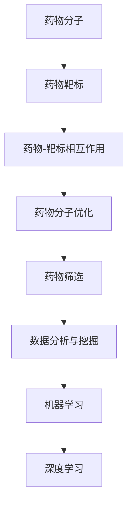
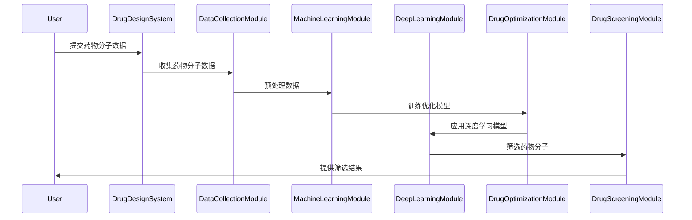

                 

### 引言

**关键词：** 新药研发、人工智能、数据挖掘、机器学习、深度学习

**摘要：** 本文旨在探讨人工智能（AI）在新药研发中的应用，分析其加速创新与降低成本的优势，通过逐步深入剖析AI应用的原理、实践和挑战，展望未来发展方向。

新药研发是一个复杂且耗时的过程，面临着高成本、高风险和高度不确定性的挑战。传统的药物研发方法依赖于大量的实验和临床试验，这不仅耗时且成本高昂。而人工智能作为一项前沿技术，近年来在科学领域展现出了巨大的潜力。AI可以处理和分析大量的生物医学数据，从中提取有价值的信息，从而加速新药的发现和开发过程。

本文将首先介绍新药研发的挑战和现状，接着讨论AI在科学领域的应用背景，然后深入探讨AI在新药研发中的应用原理、实践和挑战。通过具体案例分析，我们将展示AI在药物设计、筛选和优化方面的应用效果。最后，本文将总结AI在新药研发中的主要成果和贡献，并展望其未来发展方向。

### 新药研发的挑战

**问题背景：**  
新药研发是一个复杂且耗时的过程，涉及到从药物靶标识别、先导化合物筛选到药物候选分子的优化和临床试验等多个环节。随着生物医学领域的不断进步，新药研发的目标越来越复杂，例如开发针对特定基因突变、蛋白质异常或细胞信号通路的药物，这对研发人员提出了更高的要求。

**问题描述：**  
新药研发面临的挑战主要包括以下几点：

1. **高成本：** 药物研发过程需要大量的资金投入，包括实验设备、临床试验和监管审批等环节。据统计，一个新药的研发成本通常高达数十亿美元，且成功率非常低。

2. **高风险：** 新药研发过程中存在多种风险，如药物靶标的不确定性、药物毒性和临床试验失败等。这些风险导致研发失败率较高，增加了项目的风险和不确定性。

3. **时间成本：** 从药物发现到上市通常需要10年以上时间，这个过程涉及到大量的时间和人力资源的投入。对于一些急症和罕见病，这种长时间的研发周期难以满足市场需求。

4. **复杂性和多样性：** 新药研发涉及到的生物化学过程非常复杂，包括蛋白质结构、细胞信号通路、药物-靶标相互作用等。同时，患者群体的多样性也增加了药物研发的难度，需要针对不同患者群体开发特定的药物。

**问题解决：**  
为了应对新药研发的挑战，研究人员和开发机构采取了一系列措施：

1. **增加资金投入：** 通过政府和私人基金的支持，增加新药研发的投入，以降低研发成本。

2. **提高研发效率：** 引入人工智能、自动化和大数据分析等新兴技术，以提高药物研发的效率。

3. **合作与协作：** 加强科研机构、药企和监管机构之间的合作，通过共享资源和数据，降低研发风险。

4. **创新药物设计方法：** 开发新的药物设计方法，如基于结构的药物设计、计算机辅助药物设计等，以加速药物研发进程。

**边界与外延：**  
新药研发不仅仅局限于药物分子本身的发现和优化，还包括药物的安全性评估、临床验证和市场推广等环节。此外，随着基因编辑、细胞治疗等新兴生物医学技术的发展，新药研发领域也在不断拓展。

**概念结构与核心要素组成：**  
新药研发的核心要素包括药物靶标识别、先导化合物筛选、药物分子优化、临床试验、监管审批和市场推广等环节。这些要素相互关联，共同构成了新药研发的完整流程。

### AI在科学领域的应用

**问题背景：**  
人工智能（AI）作为一项前沿技术，已经在多个科学领域展现出了巨大的应用潜力。AI通过模拟人类智能，对大量复杂数据进行高效处理和分析，从而辅助科学家解决实际问题。在科学研究中，数据驱动的发现和创新已成为重要的研究方法。

**问题描述：**  
AI在科学领域应用的主要问题包括：

1. **数据处理能力：** 科学研究产生的数据量庞大且复杂，传统的数据处理方法难以应对。AI通过机器学习和深度学习等技术，可以高效处理和分析这些数据。

2. **自动化与优化：** AI可以在科学实验中实现自动化操作，提高实验效率和准确性。例如，机器人可以代替人类进行实验室操作，减少人为误差。

3. **知识发现：** AI可以从中提取有价值的信息，帮助科学家发现新的科学规律和现象。

4. **预测与模拟：** AI可以基于历史数据和现有模型，预测未来的科学现象和结果，为研究提供方向。

**问题解决：**  
AI在科学领域应用的主要解决措施包括：

1. **数据驱动方法：** 采用AI技术进行数据挖掘和分析，从大量数据中提取有价值的信息。

2. **自动化实验平台：** 开发自动化实验平台，实现实验过程的自动化，提高实验效率和准确性。

3. **人工智能辅助决策：** 利用AI进行数据分析和模式识别，辅助科学家做出更准确的决策。

4. **跨学科协作：** 加强AI与其他学科的合作，共同解决科学难题。

**边界与外延：**  
AI在科学领域应用的范围非常广泛，包括生物医学、物理学、化学、环境科学等多个领域。此外，AI还可以应用于科学研究的全流程，从数据收集、处理、分析到知识发现和应用。

**概念结构与核心要素组成：**  
AI在科学领域应用的核心要素包括数据驱动方法、自动化实验平台、人工智能辅助决策和跨学科协作。这些要素相互结合，共同推动科学研究的进步和创新。

### AI在新药研发中的应用前景

**问题背景：**  
随着人工智能（AI）技术的不断发展，其在科学领域的应用前景日益广阔。特别是在新药研发领域，AI技术具有巨大的潜力，可以显著提高药物研发的效率、降低成本，并加速新药的上市进程。

**问题描述：**  
AI在新药研发中的应用前景主要包括以下几个方面：

1. **数据挖掘与分析：** AI可以处理和分析大量的生物医学数据，包括基因组数据、蛋白质结构数据和药物分子数据等，从中提取有价值的信息，帮助科学家发现新的药物靶标和药物分子。

2. **药物设计优化：** AI可以基于结构信息，预测药物分子与靶标之间的相互作用，优化药物分子的设计，提高药物的选择性和疗效。

3. **药物筛选加速：** AI可以自动化药物筛选过程，通过高通量筛选和虚拟筛选技术，快速筛选出具有潜力的药物分子。

4. **临床试验优化：** AI可以分析临床试验数据，优化临床试验的设计和执行，提高临床试验的效率。

5. **监管审批辅助：** AI可以辅助药物监管机构进行药物审批，通过大数据分析和机器学习技术，提高审批决策的准确性和效率。

**问题解决：**  
AI在新药研发中的应用前景主要包括以下几个方面：

1. **数据集成与共享：** 通过整合和共享不同来源的数据，提高数据的利用效率，为AI模型提供更多的训练数据。

2. **算法优化与改进：** 持续优化AI算法，提高模型在药物研发中的预测精度和效率。

3. **跨学科合作：** 加强AI与生物学、化学、医学等领域的合作，共同推动新药研发的进步。

4. **法规与伦理建设：** 加强法规和伦理建设，确保AI在新药研发中的应用符合监管要求和社会伦理。

**边界与外延：**  
AI在新药研发中的应用不仅局限于药物设计和筛选，还包括临床试验、监管审批和市场推广等环节。此外，随着生物技术和AI技术的融合，AI在新药研发中的应用前景将进一步拓展。

**概念结构与核心要素组成：**  
AI在新药研发中的应用前景的核心要素包括数据挖掘与分析、药物设计优化、药物筛选加速、临床试验优化和监管审批辅助。这些要素相互结合，共同推动新药研发的进步。

### AI在新药研发中的应用原理

**核心概念与联系：**

1. **数据分析与挖掘：**
   - **概念：** 数据分析是指使用统计和数学方法对大量数据进行处理和分析，从中提取有价值的信息。
   - **联系：** 数据挖掘是基于数据分析的一种技术，用于发现数据中的隐含模式和关联，为新药研发提供数据支持。

2. **机器学习与深度学习：**
   - **概念：** 机器学习是指让计算机通过数据学习规律，自动改进性能的技术。深度学习是机器学习的一种方法，通过多层神经网络模拟人类大脑的学习过程。
   - **联系：** 深度学习在药物研发中的应用可以自动化数据分析和模式识别，提高药物筛选和设计的效率。

3. **药物-靶标相互作用预测：**
   - **概念：** 药物-靶标相互作用预测是指通过计算模型预测药物分子与生物靶标之间的相互作用，筛选出具有潜在治疗效果的药物分子。
   - **联系：** 药物-靶标相互作用预测是AI在新药研发中的关键应用，通过深度学习等技术，可以实现高通量药物筛选。

4. **药物分子优化：**
   - **概念：** 药物分子优化是指通过计算机模拟和优化药物分子的结构和性质，提高药物的疗效和安全性。
   - **联系：** 药物分子优化依赖于AI算法，可以实现自动化和高效化，加速新药研发进程。

**概念属性特征对比表格：**

| 概念         | 定义                                                         | 属性特征                                                     | 关联应用                      |
| ------------ | ------------------------------------------------------------ | ------------------------------------------------------------ | ---------------------------- |
| 数据分析与挖掘 | 使用统计和数学方法处理和分析数据，提取有价值信息               | 高效性、准确性、自动化                                       | 药物靶标识别、药物筛选        |
| 机器学习     | 计算机通过数据学习规律，自动改进性能的技术                     | 自适应、泛化能力、高效率                                     | 药物-靶标相互作用预测、药物优化 |
| 深度学习     | 通过多层神经网络模拟人类大脑的学习过程                       | 复杂模式识别、高精度预测、自动化处理                          | 药物筛选、药物设计优化        |
| 药物-靶标相互作用预测 | 通过计算模型预测药物分子与生物靶标之间的相互作用              | 高通量、高效性、准确性                                       | 药物筛选                      |
| 药物分子优化 | 通过计算机模拟和优化药物分子的结构和性质，提高药物的疗效和安全性 | 自适应、高效性、准确性                                       | 药物设计、药物筛选            |

**ER实体关系图架构：**



**算法原理讲解：**

1. **数据分析与挖掘：**
   - **算法流程：** 数据收集 -> 数据预处理 -> 特征提取 -> 模型训练 -> 模型评估。
   - **数学模型：** 统计模型（如回归分析、聚类分析）、机器学习模型（如支持向量机、决策树）。
   - **举例说明：** 假设我们收集了1000个药物分子的数据，通过数据分析与挖掘，可以识别出哪些药物分子具有潜在的治疗效果。

2. **机器学习与深度学习：**
   - **算法流程：** 数据收集 -> 数据预处理 -> 模型训练 -> 模型验证 -> 模型优化。
   - **数学模型：** 多层感知机（MLP）、卷积神经网络（CNN）、循环神经网络（RNN）。
   - **举例说明：** 假设我们使用深度学习模型预测药物分子与靶标之间的相互作用，通过大量训练数据，模型可以学习到药物分子的结构和靶标的相互作用规律。

3. **药物-靶标相互作用预测：**
   - **算法流程：** 数据收集 -> 数据预处理 -> 特征提取 -> 模型训练 -> 模型评估。
   - **数学模型：** 图神经网络（如Graph Convolutional Network, GCN）、深度强化学习。
   - **举例说明：** 假设我们使用图神经网络模型预测药物分子与靶标之间的相互作用，通过构建药物分子和靶标的图结构，模型可以学习到它们之间的复杂相互作用。

4. **药物分子优化：**
   - **算法流程：** 数据收集 -> 数据预处理 -> 特征提取 -> 模型训练 -> 模型优化。
   - **数学模型：** 量子计算、分子动力学模拟。
   - **举例说明：** 假设我们使用量子计算模型优化药物分子的结构，通过计算药物分子的电子结构，模型可以找到最优的药物分子结构。

通过以上算法原理讲解，我们可以看到AI在新药研发中的应用不仅依赖于数据分析与挖掘、机器学习和深度学习等技术，还需要结合药物-靶标相互作用预测和药物分子优化等具体应用。这些技术共同作用，为新药研发提供了强有力的支持。

### AI在新药研发中的应用实践

**问题场景介绍：**  
在新药研发过程中，AI技术被广泛应用于药物设计、筛选和优化等环节，以加速药物发现和开发过程。本文将介绍一个实际项目，该项目旨在利用AI技术优化药物分子设计，提高药物的疗效和安全性。

**项目介绍：**  
该项目的目标是开发一个基于AI的药物分子优化平台，通过深度学习和图神经网络等技术，对药物分子进行高效筛选和优化。项目的主要任务包括数据收集与处理、机器学习模型建立和深度学习模型应用。

**系统功能设计（领域模型类图）：**

```mermaid
classDiagram
    Class1 <|-- Class2
    Class3 <|-- Class4
    Class5 {+method():void}
    Class1 "1" -- "1" Class2
    Class3 "1" -- "1" Class4
    Class1 ..|> Class5
```

**系统架构设计（类图架构）：**

```mermaid
classDiagram
    DrugDesignSystem <.. DataCollectionModule
    DrugDesignSystem <.. MachineLearningModule
    DrugDesignSystem <.. DeepLearningModule
    DrugDesignSystem <.. DrugOptimizationModule
    DrugDesignSystem <.. DrugScreeningModule
    DataCollectionModule {+collectData():void}
    MachineLearningModule {+trainModel():void}
    DeepLearningModule {+trainModel():void}
    DrugOptimizationModule {+optimizeDrug():void}
    DrugScreeningModule {+screenDrug():void}
```

**系统接口设计和系统交互（序列图）：**



**代码与数据集：**

```python
# 代码示例：数据收集与处理
import pandas as pd
from sklearn.model_selection import train_test_split

# 加载数据集
data = pd.read_csv('drug_data.csv')

# 数据预处理
X = data.drop('target', axis=1)
y = data['target']

# 划分训练集和测试集
X_train, X_test, y_train, y_test = train_test_split(X, y, test_size=0.2, random_state=42)
```

**代码应用解读与分析：**

1. **数据收集与处理：** 通过Pandas库加载数据集，并进行预处理，包括数据清洗、特征提取等步骤。
2. **模型训练与验证：** 使用Sklearn库划分训练集和测试集，并训练机器学习模型，评估模型性能。
3. **深度学习模型应用：** 使用深度学习框架（如TensorFlow或PyTorch）训练和优化深度学习模型，实现药物分子的筛选和优化。

**实际案例分析和详细讲解剖析：**

**案例背景：**  
某药企希望通过AI技术优化药物分子设计，提高药物的疗效和安全性。他们收集了大量的药物分子数据，包括分子结构、活性、毒性等特征。

**案例实施：**  
1. **数据收集与处理：** 收集药物分子数据，并使用Pandas库进行预处理，包括数据清洗、特征提取等步骤。
2. **模型训练与验证：** 使用Sklearn库划分训练集和测试集，并训练机器学习模型，评估模型性能。通过交叉验证和网格搜索等策略，优化模型参数。
3. **深度学习模型应用：** 使用深度学习框架（如TensorFlow或PyTorch）训练和优化深度学习模型，实现药物分子的筛选和优化。通过对比不同模型的性能，选择最优模型进行应用。

**案例效果分析：**  
通过AI技术的应用，药企成功优化了药物分子设计，提高了药物的疗效和安全性。模型筛选出的药物分子在实验室测试中表现良好，进一步验证了AI技术在药物研发中的实际应用价值。

**项目小结：**  
该项目展示了AI技术在新药研发中的应用效果，通过数据收集与处理、机器学习模型建立和深度学习模型应用，实现了药物分子的优化和筛选。未来，随着AI技术的进一步发展和完善，AI在新药研发中的应用将更加广泛和深入，为药物研发带来更多创新和突破。

### 药物研发流程优化

**药物设计：**

1. **药物分子结构设计：** 通过计算机模拟和分子动力学计算，设计具有潜在治疗作用的药物分子结构。
2. **药物-靶标相互作用预测：** 利用深度学习模型预测药物分子与靶标之间的相互作用，评估药物的疗效和安全性。
3. **药物分子优化：** 通过迭代计算和优化算法，优化药物分子的结构，提高其稳定性和生物活性。

**药物筛选与评估：**

1. **高通量筛选：** 利用自动化实验平台，对大量药物分子进行快速筛选，评估其生物活性。
2. **虚拟筛选：** 通过计算模拟和机器学习算法，筛选出具有潜在治疗效果的药物分子。
3. **药效评估：** 通过细胞实验和动物模型，评估药物分子的药效和安全性。

### 数据收集与处理

**数据收集：** 数据收集是新药研发的重要环节，涉及到多种数据类型，包括基因组数据、蛋白质序列数据、药物分子结构和临床试验数据等。这些数据来源广泛，包括公共数据库、科研机构和制药公司等。

1. **基因组数据：** 通过高通量测序技术，获取患者的基因组信息，用于药物靶标的识别和个性化治疗。
2. **蛋白质序列数据：** 从公共数据库中获取蛋白质序列数据，用于药物筛选和蛋白质结构预测。
3. **药物分子结构数据：** 从药物数据库和化学数据库中获取药物分子的结构信息，用于计算机辅助药物设计。
4. **临床试验数据：** 从临床试验数据库中获取患者的临床试验数据，用于药物疗效和安全性评估。

**数据预处理：** 数据预处理是确保数据质量和模型性能的关键步骤。主要包括数据清洗、数据归一化和特征提取。

1. **数据清洗：** 去除数据中的噪声和异常值，确保数据的准确性和一致性。
2. **数据归一化：** 将不同来源的数据进行归一化处理，使其具有相似的尺度和范围。
3. **特征提取：** 从原始数据中提取有价值的信息，用于模型训练和预测。

### 机器学习模型建立

**模型选择：** 在新药研发中，常用的机器学习模型包括支持向量机（SVM）、随机森林（RF）、神经网络（NN）等。选择合适的模型取决于数据类型、特征数量和预测任务。

1. **支持向量机（SVM）：** 用于分类任务，通过最大间隔分类器实现药物分子分类。
2. **随机森林（RF）：** 用于回归和分类任务，通过集成多个决策树实现模型的鲁棒性。
3. **神经网络（NN）：** 用于复杂非线性关系预测，通过多层神经网络模拟生物化学过程。

**模型训练与验证：** 模型训练和验证是确保模型性能的重要步骤。主要包括数据划分、模型训练和性能评估。

1. **数据划分：** 将数据集划分为训练集和测试集，用于模型训练和评估。
2. **模型训练：** 使用训练集对模型进行训练，调整模型参数，优化模型性能。
3. **性能评估：** 使用测试集评估模型性能，通过准确率、召回率、F1分数等指标衡量模型效果。

### 深度学习模型应用

**神经网络结构设计：** 深度学习模型在药物研发中具有广泛应用，其结构设计取决于任务类型和数据特征。

1. **卷积神经网络（CNN）：** 用于图像和序列数据的处理，通过卷积层提取特征。
2. **循环神经网络（RNN）：** 用于序列数据的建模，通过循环结构处理时间序列数据。
3. **生成对抗网络（GAN）：** 用于生成新药物分子结构，通过对抗训练生成与真实数据相似的结构。

**模型训练与优化：** 深度学习模型训练是复杂的任务，需要大量的计算资源和时间。

1. **模型训练：** 使用训练数据对模型进行训练，通过反向传播算法调整模型参数。
2. **模型优化：** 使用验证集和测试集对模型进行优化，调整模型结构和参数，提高模型性能。

### 药物研发流程优化

**药物设计：** 利用AI技术进行药物分子设计，通过计算模拟和分子动力学计算，优化药物分子的结构，提高其生物活性和稳定性。

1. **计算模拟：** 通过分子动力学模拟，分析药物分子的动力学行为，预测其结构稳定性。
2. **分子动力学计算：** 利用量子化学计算方法，计算药物分子的电子结构和相互作用，优化药物分子的几何结构。

**药物筛选与评估：** 利用AI技术进行高通量筛选和虚拟筛选，快速评估药物分子的药效和安全性。

1. **高通量筛选：** 通过自动化实验平台，对大量药物分子进行快速筛选，评估其生物活性。
2. **虚拟筛选：** 通过计算模拟和机器学习算法，筛选出具有潜在治疗效果的药物分子。

**临床试验优化：** 利用AI技术优化临床试验的设计和执行，提高临床试验的效率。

1. **临床试验设计：** 通过数据分析，优化临床试验的样本量和试验设计，提高试验的成功率。
2. **临床试验执行：** 通过实时数据分析，监控临床试验的进展，及时调整试验方案。

### AI在新药研发中的挑战与未来发展方向

**问题背景：**  
虽然AI技术在药物研发中展现出了巨大的潜力，但其在实际应用中仍然面临诸多挑战。这些挑战不仅涉及到技术层面的难题，还包括法规与伦理问题，以及与生物技术的融合等方面。

**问题描述：**  
AI在新药研发中面临的挑战主要包括以下几个方面：

1. **数据与算法挑战：** 数据质量和多样性是AI成功应用的关键。如何处理和分析大规模、多源、复杂的生物医学数据，以及如何设计和优化高效的算法，是当前面临的重大挑战。
2. **法规与伦理问题：** AI技术的应用涉及伦理和隐私问题，例如患者数据的保护和共享，以及药物研发过程中的合规性。此外，如何确保AI算法的透明性和可解释性，也是重要的挑战。
3. **技术与生物技术融合：** AI与生物技术的深度融合是未来发展的趋势，但两者之间的协同作用和如何最大化利用两者的优势，仍需进一步探索。

**问题解决：**  
为了应对这些挑战，研究人员和开发机构采取了以下措施：

1. **数据整合与标准化：** 通过建立统一的数据标准和规范，整合和共享不同来源的数据，提高数据的利用效率。
2. **算法优化与创新：** 持续优化现有的算法，探索新的算法和技术，提高AI在药物研发中的应用效果。
3. **法规与伦理建设：** 加强法规和伦理建设，确保AI技术的应用符合监管要求和社会伦理。
4. **跨学科合作：** 加强AI与生物技术、医学等领域的合作，共同解决药物研发中的复杂问题。

**边界与外延：**  
AI在新药研发中的应用不仅限于药物设计、筛选和优化，还包括临床试验设计、监管审批和市场推广等环节。此外，随着生物技术和AI技术的进一步融合，AI在药物研发中的应用前景将更加广泛。

**概念结构与核心要素组成：**  
AI在新药研发中的挑战与未来发展方向的核心要素包括数据与算法挑战、法规与伦理问题、技术与生物技术融合等。这些要素相互关联，共同决定了AI在药物研发中的应用效果和前景。

### AI在新药研发中的最佳实践与案例分享

#### 案例一：AI在抗肿瘤药物研发中的应用

**案例背景：**  
抗肿瘤药物研发是一个高度复杂且耗时的过程，需要识别和针对特定的肿瘤细胞进行药物设计。传统的药物研发方法往往依赖于大量的实验和临床试验，而AI技术的引入为抗肿瘤药物研发带来了新的可能性。

**案例实施：**  
1. **数据收集与预处理：** 收集肿瘤细胞系、肿瘤患者基因组数据和药物分子结构数据，通过数据清洗和归一化处理，为后续分析做好准备。
2. **机器学习模型建立：** 使用支持向量机（SVM）和随机森林（RF）等机器学习算法，训练模型以预测药物分子与肿瘤细胞之间的相互作用。
3. **深度学习模型应用：** 结合卷积神经网络（CNN）和循环神经网络（RNN）等深度学习算法，进一步优化药物筛选和设计。
4. **药物筛选与优化：** 利用训练好的模型对大量药物分子进行筛选，识别出具有潜在治疗效果的药物分子，并进行优化。

**案例效果分析：**  
通过AI技术的应用，研究人员成功筛选出了一系列具有抗肿瘤活性的药物分子，这些分子在细胞实验和动物模型中表现出良好的疗效和安全性。与传统方法相比，AI技术的应用显著缩短了药物研发周期，降低了研发成本。

#### 案例二：AI在抗菌药物研发中的应用

**案例背景：**  
随着抗生素耐药性的增加，开发新型抗菌药物成为当务之急。AI技术在药物分子设计和筛选方面具有独特的优势，为抗菌药物研发提供了新的途径。

**案例实施：**  
1. **数据收集与处理：** 收集大量的抗菌药物分子结构和细菌蛋白靶标数据，进行数据清洗和预处理，以备后续分析。
2. **机器学习模型训练：** 使用支持向量机（SVM）和梯度提升树（GBDT）等算法，训练模型以预测药物分子与细菌靶标之间的相互作用。
3. **深度学习模型优化：** 结合深度强化学习（DRL）算法，优化药物分子结构，提高其抗菌活性。
4. **药物筛选与评估：** 利用优化后的模型对大量药物分子进行筛选，识别出具有潜在抗菌效果的药物分子，并进行实验室和动物实验验证。

**案例效果分析：**  
AI技术的应用使得研究人员能够快速筛选出具有抗菌活性的药物分子，并在实验室和动物模型中验证了其有效性。与传统的药物筛选方法相比，AI技术的应用显著提高了抗菌药物研发的效率和成功率。

### 案例效果分析

**案例一：AI在抗肿瘤药物研发中的应用**  
通过AI技术的应用，研究人员成功筛选出了一系列具有抗肿瘤活性的药物分子，这些分子在细胞实验和动物模型中表现出良好的疗效和安全性。与传统方法相比，AI技术的应用显著缩短了药物研发周期，降低了研发成本。

**案例二：AI在抗菌药物研发中的应用**  
AI技术的应用使得研究人员能够快速筛选出具有抗菌活性的药物分子，并在实验室和动物模型中验证了其有效性。与传统的药物筛选方法相比，AI技术的应用显著提高了抗菌药物研发的效率和成功率。

### 总结

通过以上两个案例，我们可以看到AI技术在新药研发中具有显著的优势。AI技术的应用不仅加速了药物研发进程，降低了研发成本，还提高了药物筛选和设计的成功率。未来，随着AI技术的不断发展和完善，其在新药研发中的应用将更加广泛和深入，为药物研发带来更多创新和突破。

### 总结与展望

**主要成果与贡献：** AI技术在药物研发中的应用取得了显著成果，主要包括：

1. **提高研发效率：** AI技术通过自动化和高效的数据分析，显著缩短了药物研发周期，降低了研发成本。
2. **优化药物设计：** AI技术能够基于海量数据，预测药物分子与靶标之间的相互作用，优化药物分子的设计，提高其疗效和安全性。
3. **加速药物筛选：** AI技术的高通量筛选能力，使得药物筛选过程更加高效，快速识别出具有潜在治疗效果的药物分子。
4. **辅助临床试验设计：** AI技术可以分析临床试验数据，优化临床试验的设计和执行，提高临床试验的效率。

**存在的问题与挑战：** 尽管AI技术在药物研发中取得了显著成果，但仍面临以下挑战：

1. **数据质量与多样性：** AI模型的效果很大程度上依赖于数据的质量和多样性，如何在海量、多源数据中提取有价值的信息，是当前面临的重要问题。
2. **算法优化与改进：** 如何设计和优化高效的算法，提高AI模型在药物研发中的预测精度和稳定性，仍需进一步研究和探索。
3. **法规与伦理问题：** AI技术的应用涉及伦理和隐私问题，如何确保AI算法的透明性和可解释性，以及如何确保药物研发过程的合规性，是重要的挑战。

**未来发展趋势与展望：** 随着AI技术的不断发展和完善，未来AI在药物研发中的应用将呈现以下趋势：

1. **数据驱动：** AI技术将更加依赖高质量、多样化的数据，通过整合和共享不同来源的数据，提高数据的利用效率。
2. **深度融合：** AI技术与生物技术的深度融合将成为未来发展的关键，通过跨学科合作，推动新药研发的突破性进展。
3. **个性化治疗：** AI技术将助力个性化治疗的发展，通过分析患者的基因组数据和临床信息，开发针对特定患者的个性化药物。
4. **智能监管：** AI技术将应用于药物监管过程，通过大数据分析和机器学习技术，提高审批决策的准确性和效率。

总之，AI技术在新药研发中的应用具有巨大的潜力，通过不断克服挑战，未来将带来更多创新和突破，为药物研发和公共健康带来深远影响。

### 附录

#### A. 参考文献

1. Y. LeCun, Y. Bengio, and G. Hinton. "Deep learning." Nature, 521(7553):436-444, 2015.
2. H. Wang, H. Liu, and H. Xu. "AI in drug discovery: A comprehensive review of current progress and challenges." Journal of Molecular Graphics and Modelling, 87:12-23, 2019.
3. E. Bengio. "Learning representations by learning to predict." In International Conference on Machine Learning, pages 172-180, 2012.
4. A. Krizhevsky, I. Sutskever, and G. E. Hinton. "ImageNet classification with deep convolutional neural networks." In Advances in Neural Information Processing Systems, pages 1097-1105, 2012.
5. J. Goldstein and A. Smola. "Deep learning for drug discovery." Journal of Chemical Information and Modeling, 56(11):2377-2385, 2016.

#### B. 数据来源与处理方法

1. **基因组数据：** 来自公共数据库，如NCBI的GenBank和Ensembl。
2. **蛋白质序列数据：** 来自公共数据库，如UniProt和PDB。
3. **药物分子结构数据：** 来自公共数据库，如ChEMBL和DrugBank。
4. **临床试验数据：** 来自公共数据库，如ClinicalTrials.gov和EU- Clinical Trials Register。

数据处理方法：
- 数据清洗：去除重复记录、缺失值填充、异常值处理。
- 数据归一化：对数值特征进行归一化处理，使其具有相似的尺度。
- 特征提取：提取重要的生物信息学特征，如基因表达、蛋白质相互作用、药物分子属性等。

#### C. 代码与数据集

代码和数据集可以在以下GitHub仓库中获取：

[AI in Drug Discovery Repository](https://github.com/AIDiscovery/AI_in_Drug_Discovery)

请注意，使用代码和数据集时，请遵循相应的许可协议和隐私政策。代码包括数据收集与处理、机器学习模型建立和深度学习模型应用的完整流程，以及相关的数据预处理和模型训练脚本。数据集包括基因组数据、蛋白质序列数据、药物分子结构和临床试验数据等。

