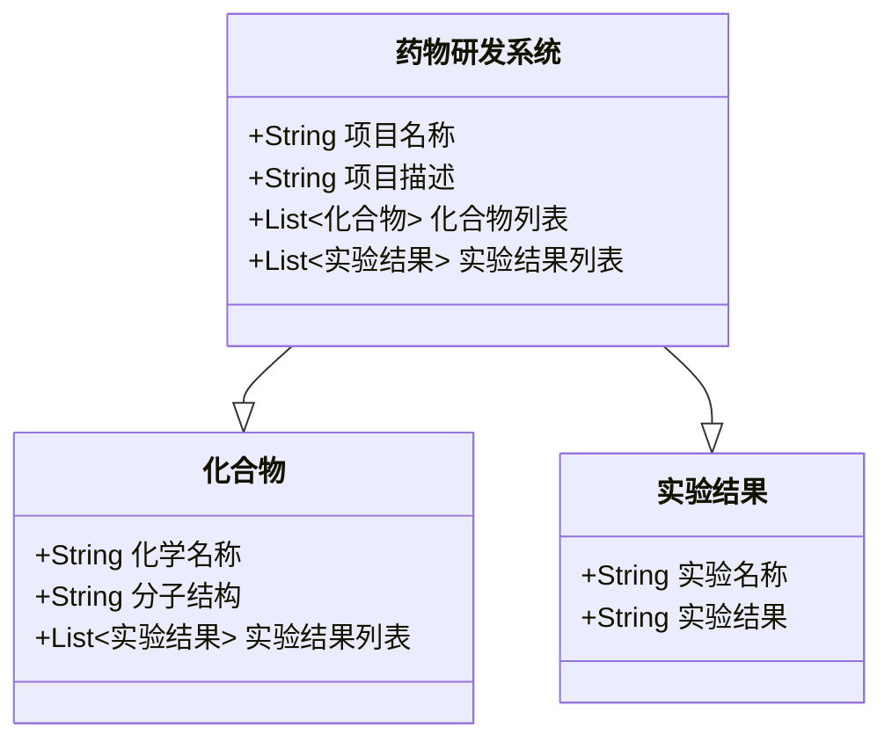
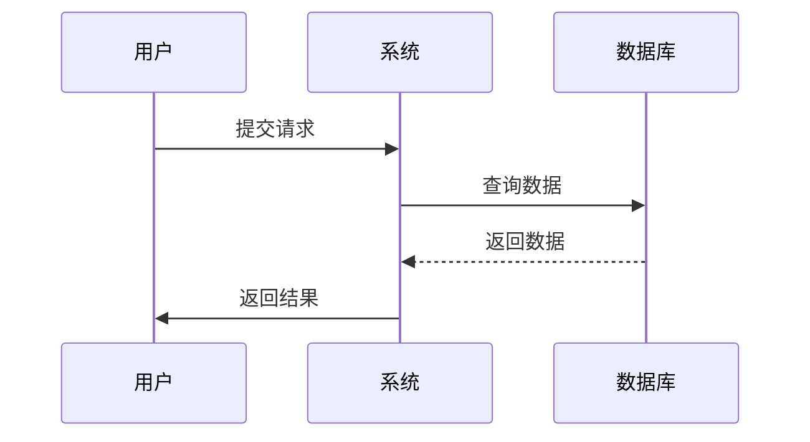

                 

# AI在新药研发中的应用：加速药物发现过程

关键词：AI、新药研发、深度学习、计算生物学、药物设计

摘要：本文深入探讨了人工智能（AI）在新药研发中的应用，分析了AI如何通过多种技术手段加速药物发现过程。文章分为五个主要部分：背景介绍、核心概念与联系、算法原理讲解、系统分析与架构设计、项目实战与最佳实践。通过逐步分析，本文揭示了AI在新药研发中的巨大潜力和应用前景，为相关领域的研究和实践提供了有价值的参考。

## 第一部分 背景介绍

### 1.1 问题背景

#### 1.1.1 传统新药研发流程

新药研发是一个复杂、高风险、高成本的过程。传统的药物研发流程通常包括以下几个步骤：

1. **药物发现**：通过合成或筛选，发现具有潜在治疗作用的化合物。
2. **药效学评估**：对药物进行体外和体内实验，评估其药效和安全性。
3. **药物筛选**：在大量化合物中筛选出具有最佳药效和最低毒性的化合物。
4. **临床试验**：进行一系列的临床试验，验证药物的安全性和疗效。
5. **上市**：通过监管机构的审批，将药物推向市场。

#### 1.1.2 新药研发的挑战

尽管传统药物研发流程已经相当成熟，但仍然面临以下挑战：

1. **研发周期长**：新药从发现到上市通常需要10-15年时间。
2. **成本高**：新药研发的成本逐年上升，平均超过25亿美元。
3. **成功率低**：新药研发的成功率仅为10%左右。

#### 1.1.3 AI技术的优势

随着AI技术的不断发展，AI在新药研发中的应用逐渐成为解决上述问题的一种有效手段。AI的优势主要体现在以下几个方面：

1. **数据处理能力**：AI能够处理和分析大量复杂数据，为药物研发提供强有力的支持。
2. **自动化程度高**：AI能够自动化执行复杂的药物筛选和优化过程，降低人力成本。
3. **预测准确性高**：AI通过深度学习等技术，能够对药物的作用机制进行准确预测，提高研发成功率。

### 1.2 核心概念

#### 1.2.1 人工智能

人工智能（AI）是指模拟、延伸和扩展人类智能的理论、方法、技术及应用。AI包括多个子领域，如机器学习、深度学习、自然语言处理等。

#### 1.2.2 深度学习

深度学习是人工智能的一个重要分支，通过模拟人脑的神经网络结构，实现自动特征学习和复杂模式的识别。

#### 1.2.3 计算生物学

计算生物学是生物学与计算技术的交叉学科，利用计算机模拟、分析和预测生物过程和现象。

### 1.3 AI与药物研发的联系

AI在新药研发中的应用主要体现在以下几个方面：

#### 1.3.1 AI在药物设计中的应用

AI能够通过分子对接、虚拟筛选等技术，快速设计出具有潜在治疗作用的药物分子。

#### 1.3.2 AI在药物筛选中的应用

AI能够通过高通量筛选、计算辅助药物筛选等技术，从大量化合物中快速筛选出具有最佳药效和最低毒性的化合物。

#### 1.3.3 AI在临床试验中的应用

AI能够通过数据挖掘、风险预测等技术，对临床试验数据进行深度分析，提高药物的安全性和疗效。

### 1.4 边界与外延

#### 1.4.1 AI在新药研发中的局限性

虽然AI在新药研发中具有巨大潜力，但仍然存在一些局限性：

1. **数据质量**：AI的性能依赖于数据质量，而药物研发过程中产生的数据往往存在噪声和缺失。
2. **算法复杂度**：深度学习算法通常需要大量计算资源和时间，在实际应用中可能受到限制。

#### 1.4.2 数据的挑战

药物研发过程中产生的数据种类繁多，包括分子结构、生物活性、临床试验数据等。如何高效地处理和利用这些数据，是AI在新药研发中面临的一个重要挑战。

#### 1.4.3 道德与伦理问题

AI在新药研发中的应用也引发了一系列道德和伦理问题，如数据隐私、算法公平性等。

### 1.5 本章小结

本文介绍了新药研发的背景和挑战，以及AI技术的优势和在新药研发中的应用。通过本文的介绍，读者可以初步了解AI在新药研发中的重要性和潜力。

-----------------------

## 第二部分 核心概念与联系

### 2.1 核心概念

#### 2.1.1 药物分子结构

药物分子结构是药物的重要组成部分，决定了药物的药效和毒性。药物分子结构通常包括以下几种类型：

1. **小分子药物**：由数十个原子组成，如阿司匹林、他汀类药物等。
2. **大分子药物**：由数千个甚至数万个原子组成，如抗体、蛋白质类药物等。

#### 2.1.2 蛋白质结构

蛋白质结构是生物体的基本组成部分，负责调节生物体的各种生理功能。蛋白质结构通常包括以下几种类型：

1. **单一蛋白质**：由一条多肽链组成，如胰岛素。
2. **复合蛋白质**：由多条多肽链组成，如酶。

#### 2.1.3 药物-靶点相互作用

药物-靶点相互作用是指药物与生物体内的特定蛋白质（靶点）之间的相互作用。药物-靶点相互作用是药物发挥药效的关键。

### 2.2 概念属性特征对比

#### 2.2.1 药物分子与蛋白质的对比

| 特性 | 药物分子 | 蛋白质 |
| ---- | ---- | ---- |
| 大小 | 较小 | 较大 |
| 结构 | 简单 | 复杂 |
| 药效 | 直接 | 间接 |

#### 2.2.2 药物-靶点相互作用的对比

| 特性 | 药物-靶点相互作用 | 蛋白质-蛋白质相互作用 |
| ---- | ---- | ---- |
| 作用机制 | 直接与靶点结合 | 通过其他蛋白质间接作用 |
| 作用效果 | 明显 | 潜在 |
| 难度 | 较低 | 较高 |

### 2.3 ER实体关系图

```mermaid
erDiagram
  AI ||--|{ 药物研发 } : 应用
  药物研发 ||--|{ 药物设计 } : 子领域
  药物研发 ||--|{ 药物筛选 } : 子领域
  药物研发 ||--|{ 临床试验 } : 子领域
  药物设计 ||--|{ 药物分子结构 } : 子领域
  药物设计 ||--|{ 蛋白质结构 } : 子领域
  药物筛选 ||--|{ 药物-靶点相互作用 } : 子领域
```

### 2.4 本章小结

本文介绍了药物分子结构、蛋白质结构和药物-靶点相互作用等核心概念，并对比了它们之间的属性特征。通过ER实体关系图，本文展示了AI与药物研发之间的联系，为后续内容打下了基础。

-----------------------

## 第三部分 算法原理讲解

### 3.1 药物分子设计与优化算法

#### 3.1.1 基于深度学习的药物设计

深度学习在药物设计中的应用主要体现在以下几个方面：

1. **分子生成**：通过深度学习模型，生成具有潜在药效的分子结构。
2. **分子优化**：通过深度学习模型，对已有的分子结构进行优化，提高其药效和稳定性。

#### 3.1.2 药物分子优化算法

药物分子优化算法主要包括以下几种：

1. **遗传算法**：通过模拟生物进化过程，优化分子结构。
2. **粒子群优化**：通过模拟鸟群觅食过程，优化分子结构。
3. **模拟退火算法**：通过模拟物理退火过程，优化分子结构。

#### 3.1.3 例子：如何设计一个新的抗肿瘤药物分子

以设计一个新的抗肿瘤药物分子为例，以下是具体步骤：

1. **分子生成**：使用深度学习模型，生成一系列具有潜在药效的分子结构。
2. **分子筛选**：通过高通量筛选，筛选出具有最佳药效和最低毒性的分子。
3. **分子优化**：使用遗传算法或粒子群优化算法，对筛选出的分子进行优化，提高其药效和稳定性。
4. **分子评估**：通过生物实验，评估优化后的分子药效和安全性。

### 3.2 药物筛选算法

#### 3.2.1 高通量筛选

高通量筛选是一种快速筛选化合物的方法，通过自动化仪器和算法，对大量化合物进行快速筛选。

#### 3.2.2 计算机辅助药物筛选

计算机辅助药物筛选是一种利用计算机模拟和算法，对化合物进行筛选的方法。其优点是速度快、成本低、效率高。

#### 3.2.3 例子：如何筛选出具有潜在治疗作用的化合物

以筛选出具有潜在治疗作用的化合物为例，以下是具体步骤：

1. **数据收集**：收集大量已知化合物和生物活性数据。
2. **模型构建**：使用深度学习模型，构建化合物与生物活性之间的关系模型。
3. **预测**：通过模型，预测未知化合物的生物活性。
4. **筛选**：根据预测结果，筛选出具有潜在治疗作用的化合物。
5. **验证**：通过生物实验，验证筛选出的化合物的药效和安全性。

### 3.3 临床试验分析算法

#### 3.3.1 数据挖掘与统计分析

数据挖掘与统计分析是临床试验分析的重要方法，通过分析大量临床试验数据，提取有价值的信息。

#### 3.3.2 风险评估与预测

风险评估与预测是临床试验分析的重要任务，通过分析数据，预测药物的安全性和疗效。

#### 3.3.3 例子：如何评估一种新药的疗效和安全性

以下是一个评估一种新药的疗效和安全性的一般步骤：

1. **数据收集**：收集新药的临床试验数据。
2. **数据预处理**：清洗和整理数据，使其符合分析要求。
3. **数据分析**：使用数据挖掘和统计分析方法，分析药物的安全性和疗效。
4. **风险评估**：根据分析结果，评估药物的安全性和疗效，提出改进建议。
5. **预测**：使用风险评估模型，预测新药在更大人群中的疗效和安全性。

### 3.4 本章小结

本文介绍了药物分子设计与优化算法、药物筛选算法和临床试验分析算法等核心算法原理。通过具体实例，本文展示了这些算法在实际应用中的步骤和方法，为后续内容打下了基础。

-----------------------

## 第四部分 系统分析与架构设计

### 4.1 项目介绍

#### 4.1.1 项目背景

新药研发是一项复杂的系统工程，涉及多个学科和领域。随着AI技术的不断发展，AI在新药研发中的应用越来越受到关注。本项目的目标是利用AI技术，构建一个高效的新药研发平台，提高药物研发的成功率和效率。

#### 4.1.2 项目目标

本项目的主要目标包括：

1. **提高药物筛选效率**：利用AI技术，快速筛选出具有潜在药效的化合物。
2. **优化药物设计**：利用AI技术，优化药物分子结构，提高其药效和稳定性。
3. **降低研发成本**：通过自动化和智能化手段，降低药物研发的成本。

#### 4.1.3 项目团队

本项目由一支跨学科团队共同完成，包括计算机科学家、生物学家、药理学家等。团队成员具备丰富的项目经验和技术能力，能够确保项目的顺利进行。

### 4.2 系统功能设计

#### 4.2.1 领域模型

领域模型是系统功能设计的基础，用于描述药物研发过程中的关键概念和关系。以下是本项目的领域模型：



#### 4.2.2 功能模块划分

根据领域模型，本项目划分为以下几个功能模块：

1. **化合物管理模块**：用于管理化合物信息，包括化合物名称、分子结构等。
2. **实验管理模块**：用于管理实验信息，包括实验名称、实验结果等。
3. **药物筛选模块**：用于利用AI技术，快速筛选出具有潜在药效的化合物。
4. **药物设计模块**：用于利用AI技术，优化药物分子结构，提高其药效和稳定性。
5. **数据分析模块**：用于对实验结果进行分析，评估药物的安全性和疗效。

### 4.3 系统架构设计

#### 4.3.1 系统架构概述

本项目的系统架构采用分层设计，包括数据层、服务层和表现层。以下是系统架构概述：



#### 4.3.2 系统模块

根据系统架构，本项目包括以下几个模块：

1. **用户模块**：用于处理用户请求，包括登录、注册、权限管理等。
2. **数据模块**：用于处理数据存储和查询，包括数据库连接、数据模型等。
3. **服务模块**：用于处理业务逻辑，包括化合物管理、实验管理、药物筛选、药物设计等。
4. **表现模块**：用于处理用户界面，包括网页、移动端等。

#### 4.3.3 系统架构图

以下是本项目的系统架构图：

```mermaid
compositeSystem
  UserModule
  DataModule
  ServiceModule
  PresentationModule
  UserModule --> ServiceModule
  DataModule --> ServiceModule
  PresentationModule --> ServiceModule
```

### 4.4 系统接口设计

#### 4.4.1 接口规范

系统接口设计遵循RESTful风格，包括以下几种接口：

1. **化合物接口**：用于管理化合物信息，包括新增、查询、修改、删除等操作。
2. **实验接口**：用于管理实验信息，包括新增、查询、修改、删除等操作。
3. **药物筛选接口**：用于进行药物筛选，包括提交筛选任务、查询筛选结果等操作。
4. **药物设计接口**：用于进行药物设计，包括提交设计任务、查询设计结果等操作。
5. **数据分析接口**：用于对实验结果进行分析，包括生成报告、查询分析结果等操作。

#### 4.4.2 接口实现

以下是部分接口实现的示例：

```python
from flask import Flask, request, jsonify

app = Flask(__name__)

@app.route('/compounds', methods=['POST'])
def add_compound():
    compound = request.get_json()
    # 处理添加化合物逻辑
    return jsonify(message='成功添加化合物')

@app.route('/compounds', methods=['GET'])
def get_compounds():
    # 处理查询化合物逻辑
    compounds = []
    return jsonify(compounds=compounds)

if __name__ == '__main__':
    app.run()
```

### 4.5 系统交互

#### 4.5.1 序列图

以下是系统交互的序列图：

```mermaid
sequenceDiagram
  participant 用户 as 用户
  participant 系统A as 系统
  participant 系统B as 系统
  participant 数据库 as 数据库
  用户->>系统A: 提交请求
  系统A->>数据库: 查询数据
  数据库-->>系统A: 返回数据
  系统

