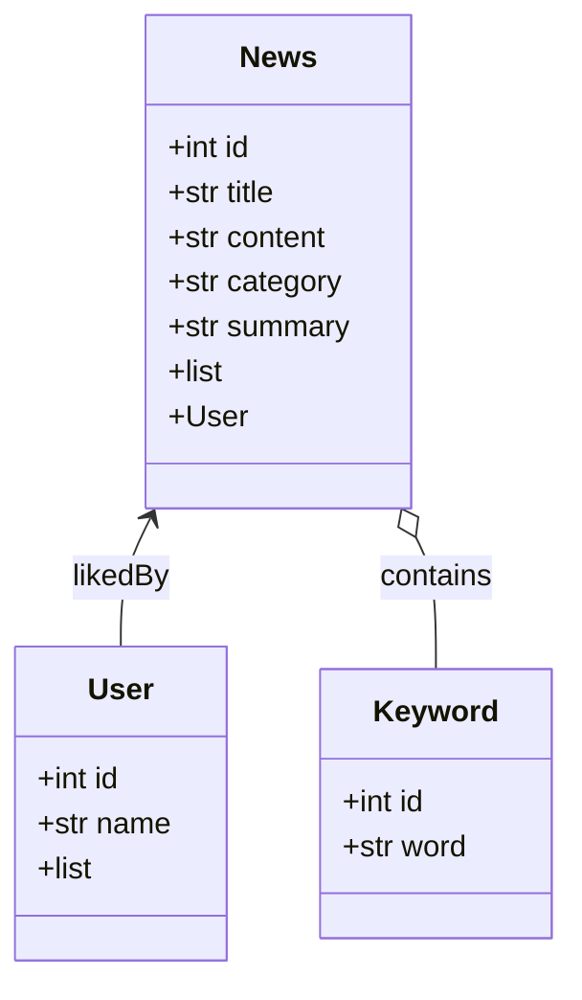
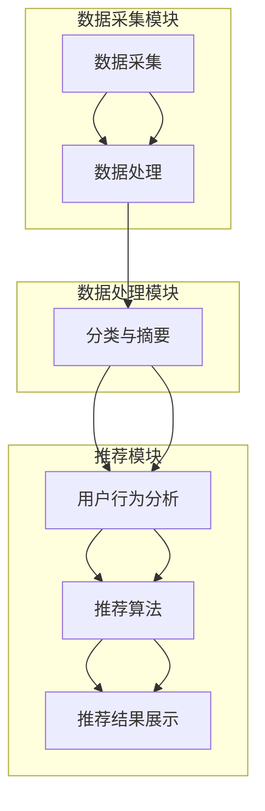

                 


## AI在新闻聚合与个性化推荐中的应用：信息获取的革新

> 关键词：人工智能，新闻聚合，个性化推荐，数据采集，新闻分类，机器学习，深度学习

> 摘要：本文将探讨人工智能（AI）在新闻聚合与个性化推荐中的应用，分析其背景、需求、作用以及相关的技术原理和实践方法。通过对新闻聚合与个性化推荐的详细解读，我们旨在展示AI技术如何改变信息获取的方式，提高新闻传播的效率与效果。

### 第一部分：AI在新闻聚合与个性化推荐中的应用背景

#### 1.1 AI在新闻行业中的背景

##### 1.1.1 互联网新闻的发展历程

互联网新闻的发展可以追溯到20世纪90年代。当时，随着互联网的普及，传统媒体开始逐渐向数字媒体转型。最初，互联网新闻主要是由传统媒体机构制作的，这些机构在网站上发布新闻内容，以适应互联网用户的需求。

随着时间的发展，新媒体开始崛起。这些新媒体机构以互联网为平台，利用更灵活的内容生产和发布方式，迅速吸引了大量用户。它们不仅提供了与传统媒体不同的新闻视角，还通过社交媒体等渠道实现了新闻内容的快速传播。

近年来，AI技术的兴起为新闻行业带来了新的变革。AI技术能够对大量新闻数据进行处理和分析，从而实现新闻的自动分类、摘要、推荐等。这使得新闻机构能够更高效地生产和管理新闻内容，同时也为用户提供了更个性化的新闻体验。

##### 1.1.2 新媒体时代的崛起

新媒体时代的崛起，标志着互联网新闻进入了一个全新的发展阶段。在这个阶段，新闻机构不再仅仅依赖传统的内容生产方式，而是开始运用大数据、机器学习、深度学习等AI技术，来实现新闻的自动化生产、分类、推荐等功能。

新媒体机构通过AI技术，能够对用户的行为数据进行深入分析，从而了解用户的需求和兴趣。这使得新闻机构能够为用户提供更加个性化的新闻内容，提高用户的满意度和忠诚度。

同时，新媒体机构还能够利用AI技术，实现新闻的自动翻译、摘要、生成等功能。这些技术的应用，不仅提高了新闻的生产效率，还丰富了新闻的内容形式，为用户提供了更多的选择。

##### 1.1.3 AI赋能新闻行业

AI技术的应用，不仅改变了新闻的生产方式，还提升了新闻的传播效果。通过AI技术，新闻机构能够实现新闻的个性化推荐，将最相关的新闻内容推送给用户。这不仅提高了用户的阅读体验，也增加了新闻的传播效果。

此外，AI技术还能够帮助新闻机构进行新闻的实时监控和分析，及时发现和解决新闻传播中存在的问题。例如，AI技术可以用于检测新闻中的虚假信息，从而保障新闻的准确性和公正性。

总之，AI技术的应用，为新闻行业带来了巨大的变革。它不仅提高了新闻的生产效率和传播效果，还为用户提供了更加个性化的新闻体验。随着AI技术的不断进步，我们可以预见，新闻行业将迎来更加智能化的发展阶段。

#### 1.2 个性化推荐与新闻聚合的需求

##### 1.2.1 用户需求的变化

随着互联网的普及和用户阅读习惯的改变，用户对新闻的需求也在不断变化。传统的一刀切新闻推荐方式已经无法满足用户的需求，个性化推荐成为了一种必然趋势。

用户对新闻的需求变得更加多样化、个性化。他们希望看到的是与自己兴趣相关的新闻，而不是笼统的新闻内容。这种需求的变化，使得个性化推荐成为了一种重要的新闻传播方式。

##### 1.2.1.1 多样化、个性化信息需求

用户对新闻的多样化、个性化需求体现在多个方面。首先，用户希望看到的是与自己兴趣相关的新闻。例如，一个对科技感兴趣的用户，会希望看到更多的科技新闻，而不是政治或体育新闻。

其次，用户希望新闻内容能够更加深入、细致。他们希望看到的是对新闻事件的详细解读，而不是简单的新闻摘要。这种需求，促使新闻机构需要提供更加丰富、多样化的新闻内容。

##### 1.2.1.2 真实性、及时性信息需求

在信息爆炸的时代，用户对新闻的真实性和及时性提出了更高的要求。他们希望看到的新闻是真实、可靠的，而不是虚假、夸大的。同时，用户也希望能够及时获取到最新的新闻内容，以便及时了解事件的发展和变化。

##### 1.2.1.3 移动互联网时代的阅读习惯

移动互联网的普及，改变了用户的阅读习惯。用户更多地通过手机、平板等移动设备来获取新闻，而不是传统的电脑。这种阅读习惯的改变，要求新闻机构提供更加适合移动设备的新闻内容，以提升用户的阅读体验。

#### 1.3 AI在新闻聚合与个性化推荐中的作用

##### 1.3.1 提高新闻推荐效率

AI技术在新闻推荐中的应用，大大提高了新闻推荐的效率。通过机器学习、深度学习等算法，AI技术能够对用户的兴趣和行为数据进行分析，从而准确地预测用户可能感兴趣的新闻内容。

这种高效、准确的推荐方式，不仅提高了用户的阅读体验，也增加了新闻的传播效果。通过AI技术，新闻机构能够将最相关的新闻内容推送给用户，从而提高新闻的曝光度和影响力。

##### 1.3.1.1 大数据技术与新闻推荐

大数据技术在新闻推荐中的应用，为AI技术提供了丰富的数据支持。通过收集和分析大量的用户行为数据，大数据技术能够帮助AI技术更好地理解用户的需求和兴趣。

大数据技术不仅能够提供丰富的用户画像，还能够通过数据挖掘和预测技术，预测用户的未来行为。这些技术的应用，使得新闻推荐更加精准、高效。

##### 1.3.1.2 机器学习算法在新闻推荐中的应用

机器学习算法在新闻推荐中的应用，是实现个性化推荐的关键。通过机器学习算法，AI技术能够从大量的用户行为数据中，提取出用户感兴趣的特征和模式。

常见的机器学习算法包括协同过滤、矩阵分解、深度学习等。这些算法通过不同的方式，实现对用户兴趣的建模和预测，从而实现个性化的新闻推荐。

##### 1.3.2 增强新闻传播效果

AI技术在新闻传播中的应用，不仅提高了新闻的推荐效率，还增强了新闻的传播效果。通过AI技术，新闻机构能够实现新闻的自动化生产和分类，从而提高新闻的生产效率。

同时，AI技术还能够帮助新闻机构进行新闻的实时监控和分析，及时发现和解决新闻传播中存在的问题。例如，AI技术可以用于检测新闻中的虚假信息，从而保障新闻的准确性和公正性。

总之，AI技术在新闻聚合与个性化推荐中的应用，为新闻行业带来了巨大的变革。它不仅提高了新闻的生产效率和传播效果，还为用户提供了更加个性化的新闻体验。随着AI技术的不断进步，我们可以预见，新闻行业将迎来更加智能化的发展阶段。

#### 1.4 书籍结构概述

本书将从理论和实践两个方面，详细探讨AI在新闻聚合与个性化推荐中的应用。具体来说，本书将分为以下几个部分：

##### 1.4.1 内容架构与章节安排

1. **第一部分：AI在新闻聚合与个性化推荐中的应用背景**
   - 1.1 AI在新闻行业中的背景
   - 1.2 个性化推荐与新闻聚合的需求
   - 1.3 AI在新闻聚合与个性化推荐中的作用

2. **第二部分：AI在新闻聚合中的应用**
   - 2.1 数据采集与处理
   - 2.2 新闻分类与聚类
   - 2.3 新闻摘要与生成

3. **第三部分：AI在个性化推荐中的应用**
   - 3.1 用户行为分析
   - 3.2 推荐系统设计与实现
   - 3.3 推荐效果评估与优化

4. **第四部分：案例分析与应用实践**
   - 4.1 案例介绍
   - 4.2 实践应用
   - 4.3 案例分析与总结

##### 1.4.1.1 理论与实践相结合

本书在内容安排上，既注重理论讲解，又强调实践应用。通过结合实际案例，帮助读者更好地理解AI在新闻聚合与个性化推荐中的应用。

##### 1.4.1.2 不同技术环节的详细解析

本书将详细解析AI在新闻聚合与个性化推荐中的各个技术环节，包括数据采集、处理、分类、聚类、摘要、生成等。通过深入分析这些技术环节，帮助读者全面了解AI在新闻行业中的应用。

##### 1.4.1.3 未来发展趋势展望

本书还将对AI在新闻聚合与个性化推荐领域的未来发展趋势进行展望，分析可能出现的新技术和应用场景，为读者提供前瞻性思考。

#### 1.5 本章小结

本章从背景、需求、作用等方面，对AI在新闻聚合与个性化推荐中的应用进行了详细探讨。通过本章的内容，我们可以看到，AI技术已经在新闻行业中发挥着重要作用，为新闻的传播带来了巨大的变革。随着AI技术的不断进步，我们可以预见，未来AI在新闻聚合与个性化推荐中的应用将更加广泛，为用户带来更加个性化的新闻体验。

### 第二部分：AI在新闻聚合中的应用

#### 2.1 数据采集与处理

##### 2.1.1 网络爬虫技术

网络爬虫（Web Crawler）是一种用于自动获取互联网上信息的程序。它通过模拟用户的浏览器行为，自动访问网页，下载网页内容，并对网页内容进行分析和处理。网络爬虫在新闻聚合中起着至关重要的作用，它能够从大量的新闻网站中自动采集新闻内容，为后续的处理和分析提供数据基础。

###### 2.1.1.1 爬虫工作原理

网络爬虫的工作原理主要包括以下几个步骤：

1. **种子页面获取**：爬虫首先需要从某个或某些初始页面开始，这些初始页面被称为种子页面。种子页面通常是由用户指定的，或者通过搜索引擎的API获取。

2. **网页抓取**：爬虫通过HTTP协议访问种子页面，下载网页内容。网页内容通常包括HTML、CSS、JavaScript等。

3. **内容解析**：爬虫对下载的网页内容进行解析，提取出有用的信息，如新闻标题、正文、发布时间等。

4. **链接提取**：爬虫从网页中提取出所有的超链接，作为新的种子页面，以便进行下一轮的抓取。

5. **存储与去重**：爬虫将提取到的新闻内容存储到数据库中，同时去除重复的记录，避免数据冗余。

###### 2.1.1.2 爬虫框架与工具

常见的爬虫框架和工具有：

- **Scrapy**：Scrapy是一个开源的Python爬虫框架，它提供了完整的爬虫开发流程，包括网页抓取、内容解析、链接提取、数据存储等。

- **PySpider**：PySpider是一个基于Python的分布式爬虫框架，它支持多种数据存储方式，如MySQL、MongoDB等。

- **Beautiful Soup**：Beautiful Soup是一个Python的库，用于解析HTML和XML文档。它可以帮助开发者快速地从网页内容中提取出有用的信息。

- **requests**：requests是一个Python的HTTP客户端库，用于发送HTTP请求。它可以方便地获取网页内容，并支持多种HTTP方法，如GET、POST等。

###### 2.1.1.3 数据采集策略与反爬虫机制

在新闻聚合过程中，数据采集策略和反爬虫机制是两个重要的问题。数据采集策略主要包括：

- **合理的请求间隔**：为了避免给目标网站带来过多的请求压力，爬虫应该设置合理的请求间隔。

- **IP代理的使用**：通过使用IP代理，爬虫可以更换IP地址，避免被目标网站封禁。

- **用户代理的伪装**：爬虫可以伪装成浏览器，使用不同的用户代理，以避免被目标网站检测。

反爬虫机制主要包括：

- **验证码**：目标网站可能会要求用户输入验证码，以防止爬虫的访问。

- **IP封禁**：目标网站可能会检测到爬虫的访问频率，并封禁其IP地址。

- **加密请求**：目标网站可能会对请求进行加密，以防止爬虫解析请求内容。

##### 2.1.2 数据清洗与预处理

数据清洗（Data Cleaning）和数据预处理（Data Preprocessing）是数据分析和机器学习项目中的关键步骤。清洗和预处理数据的主要目的是去除数据中的噪声、缺失值和异常值，提高数据的质量，为后续的分析和建模提供可靠的数据基础。

###### 2.1.2.1 数据清洗的重要性

数据清洗的重要性体现在以下几个方面：

- **提高数据质量**：通过数据清洗，可以去除数据中的噪声、缺失值和异常值，提高数据的质量，从而提高分析的准确性和可靠性。

- **减少计算成本**：高质量的数据可以减少计算成本，避免在后续的分析和建模过程中，因为数据质量问题导致计算错误或浪费计算资源。

- **提高模型性能**：高质量的数据可以更好地反映现实情况，从而提高模型的性能，减少模型的过拟合和欠拟合。

###### 2.1.2.2 数据清洗方法与步骤

数据清洗的方法和步骤主要包括：

1. **去除噪声**：噪声是指数据中的随机错误或不一致。可以通过数据去重、过滤重复值等方法去除噪声。

2. **处理缺失值**：缺失值是指数据中不存在的数据。可以通过填充缺失值、删除缺失值或使用统计方法估计缺失值等方法处理缺失值。

3. **处理异常值**：异常值是指数据中的异常数据点。可以通过统计方法、聚类方法或可视化方法检测异常值，然后决定是否删除或修正异常值。

4. **统一数据格式**：统一数据格式，如日期、时间、数字等，可以提高数据的一致性和可处理性。

5. **数据标准化**：通过数据标准化，可以将数据转换到同一尺度，便于后续的分析和建模。

###### 2.1.2.3 数据质量评估

数据质量评估是数据清洗过程中不可或缺的步骤。可以通过以下方法评估数据质量：

- **统计指标**：使用统计指标，如均值、中位数、标准差等，评估数据的分布和一致性。

- **可视化方法**：使用数据可视化方法，如直方图、箱线图等，评估数据的质量和分布。

- **机器学习模型评估**：使用机器学习模型，如回归模型、分类模型等，评估数据对模型的影响和模型性能。

##### 2.2 新闻分类与聚类

新闻分类（News Classification）和新闻聚类（News Clustering）是新闻聚合中的重要环节。通过新闻分类和聚类，可以将大量的新闻内容进行组织和整理，提高新闻的可读性和可访问性。

###### 2.2.1 新闻分类算法

新闻分类算法是将新闻按照一定的标准进行分类的过程。常见的新闻分类算法包括：

1. **基于传统机器学习方法的新闻分类**：如支持向量机（SVM）、朴素贝叶斯（Naive Bayes）、决策树（Decision Tree）等。这些算法通过对新闻文本的特征进行提取和建模，实现新闻的自动分类。

2. **基于深度学习方法的新闻分类**：如卷积神经网络（CNN）、循环神经网络（RNN）等。这些算法通过对新闻文本进行深度学习建模，能够提取出更加抽象和丰富的特征，实现更准确的新闻分类。

###### 2.2.1.1 基于传统机器学习方法的新闻分类

基于传统机器学习方法的新闻分类主要包括以下几个步骤：

1. **数据预处理**：对新闻文本进行预处理，如分词、去除停用词、词干提取等，将文本转换为适合机器学习模型的特征表示。

2. **特征提取**：使用特征提取方法，如TF-IDF、Word2Vec等，将预处理后的文本转换为数值特征。

3. **模型训练**：使用训练数据，通过机器学习算法，如SVM、朴素贝叶斯等，训练分类模型。

4. **模型评估**：使用测试数据，评估分类模型的性能，如准确率、召回率、F1值等。

###### 2.2.1.2 基于深度学习方法的新闻分类

基于深度学习方法的新闻分类主要包括以下几个步骤：

1. **数据预处理**：对新闻文本进行预处理，如分词、去除停用词、词干提取等，将文本转换为序列数据。

2. **模型训练**：使用训练数据，通过深度学习算法，如CNN、RNN等，训练分类模型。

3. **模型评估**：使用测试数据，评估分类模型的性能，如准确率、召回率、F1值等。

###### 2.2.1.3 分类效果评估与优化

分类效果的评估主要包括以下几个方面：

- **准确率**：分类模型预测正确的样本数与总样本数的比例。

- **召回率**：分类模型预测正确的正样本数与实际正样本数的比例。

- **F1值**：准确率和召回率的调和平均值。

为了优化分类效果，可以采取以下措施：

- **特征选择**：选择对分类任务有帮助的特征，去除无关或噪声特征。

- **模型调整**：调整模型参数，如学习率、批量大小等，以获得更好的模型性能。

- **数据增强**：通过增加训练数据量、使用数据增强技术等，提高模型的泛化能力。

###### 2.2.2 新闻聚类算法

新闻聚类（News Clustering）是将新闻按照一定的标准进行分组的过程。常见的新闻聚类算法包括：

1. **基于传统聚类方法的新闻聚类**：如K-Means、层次聚类（Hierarchical Clustering）等。这些算法通过对新闻文本的相似度计算，将新闻进行分组。

2. **基于深度学习方法的新闻聚类**：如自编码器（Autoencoder）、图神经网络（Graph Neural Network）等。这些算法通过对新闻文本进行深度学习建模，能够提取出更加抽象和丰富的特征，实现更准确的新闻聚类。

###### 2.2.2.1 基于传统聚类方法的新闻聚类

基于传统聚类方法的新闻聚类主要包括以下几个步骤：

1. **数据预处理**：对新闻文本进行预处理，如分词、去除停用词、词干提取等，将文本转换为适合聚类算法的特征表示。

2. **特征提取**：使用特征提取方法，如TF-IDF、Word2Vec等，将预处理后的文本转换为数值特征。

3. **模型训练**：使用聚类算法，如K-Means、层次聚类等，对新闻文本进行聚类。

4. **聚类结果评估**：使用评估指标，如轮廓系数（Silhouette Coefficient）、类内平均值（Intra-cluster Sum of Squares）等，评估聚类结果。

###### 2.2.2.2 基于深度学习方法的新闻聚类

基于深度学习方法的新闻聚类主要包括以下几个步骤：

1. **数据预处理**：对新闻文本进行预处理，如分词、去除停用词、词干提取等，将文本转换为序列数据。

2. **模型训练**：使用深度学习算法，如自编码器、图神经网络等，对新闻文本进行聚类。

3. **聚类结果评估**：使用评估指标，如轮廓系数、类内平均值等，评估聚类结果。

###### 2.2.2.3 聚类效果评估与优化

聚类效果的评估主要包括以下几个方面：

- **轮廓系数**：用于评估聚类结果的质量，值范围在-1到1之间，值越接近1表示聚类效果越好。

- **类内平均值**：用于评估聚类结果的内部紧凑性，值越小表示聚类效果越好。

为了优化聚类效果，可以采取以下措施：

- **聚类算法选择**：根据新闻数据的特征，选择适合的聚类算法。

- **参数调整**：调整聚类算法的参数，如K值、学习率等，以获得更好的聚类效果。

- **特征选择**：选择对聚类任务有帮助的特征，去除无关或噪声特征。

##### 2.3 新闻摘要与生成

新闻摘要（News Summarization）和新闻生成（News Generation）是新闻聚合中的两个重要环节。新闻摘要旨在从大量的新闻文本中提取出关键信息，生成简洁、准确的摘要；新闻生成则是利用自然语言生成技术，自动生成新闻文本。

###### 2.3.1 新闻摘要算法

新闻摘要算法旨在从大量的新闻文本中提取出关键信息，生成简洁、准确的摘要。常见的新闻摘要算法包括：

1. **基于传统文本摘要方法的新闻摘要**：如抽取式摘要（Extraction-based Summarization）、基于规则的摘要（Rule-based Summarization）等。这些算法通过对新闻文本进行结构化分析，提取出关键信息，生成摘要。

2. **基于深度学习方法的新闻摘要**：如序列到序列（Seq2Seq）模型、Transformer等。这些算法通过对新闻文本进行深度学习建模，能够提取出更加抽象和丰富的特征，生成更准确的摘要。

###### 2.3.1.1 基于传统文本摘要方法的新闻摘要

基于传统文本摘要方法的新闻摘要主要包括以下几个步骤：

1. **文本预处理**：对新闻文本进行预处理，如分词、去除停用词、词干提取等，将文本转换为适合摘要算法的特征表示。

2. **关键信息提取**：使用抽取式摘要算法，从新闻文本中提取出关键信息。

3. **摘要生成**：将提取出的关键信息组合成摘要，通常采用最大长度优先（Maximum Length Priority）或最小生成树（Minimum Spanning Tree）等方法。

###### 2.3.1.2 基于深度学习方法的新闻摘要

基于深度学习方法的新闻摘要主要包括以下几个步骤：

1. **文本预处理**：对新闻文本进行预处理，如分词、去除停用词、词干提取等，将文本转换为序列数据。

2. **编码器-解码器模型训练**：使用编码器-解码器（Encoder-Decoder）模型，如序列到序列（Seq2Seq）模型，对新闻文本进行建模，提取关键信息。

3. **摘要生成**：使用解码器生成摘要，通常采用注意力机制（Attention Mechanism）等。

###### 2.3.1.3 摘要效果评估与优化

摘要效果的评估主要包括以下几个方面：

- **ROUGE评分**：用于评估摘要的质量，值越高表示摘要越准确。

- **BLEU评分**：用于评估摘要的流畅性，值越高表示摘要越流畅。

为了优化摘要效果，可以采取以下措施：

- **特征选择**：选择对摘要任务有帮助的特征，去除无关或噪声特征。

- **模型调整**：调整模型参数，如学习率、批量大小等，以获得更好的模型性能。

- **数据增强**：通过增加训练数据量、使用数据增强技术等，提高模型的泛化能力。

###### 2.3.2 新闻生成算法

新闻生成（News Generation）是利用自然语言生成技术，自动生成新闻文本。常见的新闻生成算法包括：

1. **基于模板生成方法的新闻生成**：如模板匹配（Template Matching）、关键词填充（Keyword Filling）等。这些算法通过模板和关键词，生成新闻文本。

2. **基于生成对抗网络（GAN）的新闻生成**：生成对抗网络（GAN）是一种无监督学习模型，通过生成器和判别器的对抗训练，生成高质量的新闻文本。

###### 2.3.2.1 基于模板生成方法的新闻生成

基于模板生成方法的新闻生成主要包括以下几个步骤：

1. **模板设计**：设计新闻文本的模板，包括标题、正文、段落等。

2. **关键词提取**：从新闻文本中提取关键词。

3. **模板填充**：将提取出的关键词填充到模板中，生成新闻文本。

###### 2.3.2.2 基于生成对抗网络（GAN）的新闻生成

基于生成对抗网络（GAN）的新闻生成主要包括以下几个步骤：

1. **数据预处理**：对新闻文本进行预处理，如分词、去除停用词、词干提取等，将文本转换为序列数据。

2. **生成器和判别器训练**：使用生成对抗网络（GAN），训练生成器和判别器，生成高质量的新闻文本。

3. **文本生成**：使用生成器生成新闻文本。

#### 2.4 本章小结

本章详细介绍了AI在新闻聚合中的应用，包括数据采集与处理、新闻分类与聚类、新闻摘要与生成等。通过AI技术的应用，可以大大提高新闻的采集、分类、摘要和生成的效率，为用户提供更加个性化的新闻体验。随着AI技术的不断进步，我们可以预见，未来新闻聚合将变得更加智能化、高效化，为用户带来更加优质的新闻内容。

### 第三部分：AI在个性化推荐中的应用

#### 3.1 用户行为分析

用户行为分析是个性化推荐系统的核心环节，通过对用户在新闻网站上的行为数据进行深入分析，挖掘用户的兴趣和偏好，从而实现个性化推荐。

##### 3.1.1 用户行为数据的收集

用户行为数据的收集主要来源于以下几个方面：

1. **用户点击行为**：用户在新闻网站上的点击行为，如点击次数、点击时长等，是反映用户兴趣的重要指标。

2. **用户浏览行为**：用户在新闻网站上的浏览行为，如浏览次数、浏览时长等，可以帮助我们了解用户的阅读习惯。

3. **用户交互行为**：用户在新闻网站上的交互行为，如评论、点赞、分享等，是反映用户兴趣和情感的重要指标。

4. **用户搜索行为**：用户在新闻网站上的搜索行为，如搜索关键词、搜索次数等，可以帮助我们了解用户的关注领域。

##### 3.1.2 用户行为数据的预处理

在收集到用户行为数据后，需要对数据进行预处理，以提高数据质量和模型性能。预处理步骤主要包括：

1. **数据清洗**：去除数据中的噪声、缺失值和异常值，如去除重复数据、填充缺失值等。

2. **数据转换**：将不同类型的数据转换为同一类型，如将日期、时间等转换为数值类型。

3. **数据归一化**：将数据归一化到同一尺度，以避免数据规模差异对模型训练的影响。

##### 3.1.3 用户行为数据的分析

用户行为数据的分析主要分为以下几个步骤：

1. **行为特征提取**：从用户行为数据中提取出具有区分度的行为特征，如点击次数、浏览时长等。

2. **行为模式挖掘**：通过统计分析和数据挖掘技术，挖掘用户的行为模式，如用户的点击偏好、阅读习惯等。

3. **用户兴趣建模**：使用机器学习算法，如协同过滤、矩阵分解等，对用户行为数据进行建模，提取用户的兴趣和偏好。

##### 3.1.4 用户兴趣的动态更新

用户兴趣是动态变化的，为了实现持续的个性化推荐，需要实时更新用户的兴趣模型。更新用户兴趣的方法包括：

1. **增量学习**：在每次新数据到来时，对用户兴趣模型进行增量更新，以提高模型更新的效率和准确性。

2. **周期性重训练**：定期对用户兴趣模型进行重训练，以适应用户兴趣的长期变化。

3. **用户反馈调整**：根据用户的反馈行为，如点赞、评论等，调整用户兴趣模型，以提高推荐系统的准确性。

#### 3.2 推荐系统设计与实现

##### 3.2.1 推荐系统的架构设计

推荐系统通常由以下几个模块组成：

1. **数据采集模块**：负责收集用户行为数据，如点击行为、浏览行为、交互行为等。

2. **数据处理模块**：负责对用户行为数据进行预处理、特征提取、行为模式挖掘等。

3. **推荐算法模块**：负责根据用户兴趣和行为，生成个性化的推荐列表。

4. **推荐结果展示模块**：负责将推荐结果展示给用户，如推荐新闻列表、推荐原因等。

##### 3.2.2 推荐算法的选择与实现

常见的推荐算法包括：

1. **基于协同过滤的推荐算法**：如用户基于协同过滤（User-based Collaborative Filtering）、物品基于协同过滤（Item-based Collaborative Filtering）等。协同过滤算法通过分析用户之间的相似性或物品之间的相似性，实现个性化推荐。

2. **基于内容的推荐算法**：如基于标签的推荐（Content-based Tag Recommendation）、基于文本相似性的推荐（Text-based Similarity Recommendation）等。内容-based算法通过分析用户兴趣和新闻内容，实现个性化推荐。

3. **混合推荐算法**：结合协同过滤和内容-based算法，实现更加准确的个性化推荐。

##### 3.2.3 推荐效果评估与优化

推荐效果评估是推荐系统设计中的重要环节，常用的评估指标包括：

1. **准确率（Precision）**：预测正确的推荐新闻数量与推荐新闻总数的比例。

2. **召回率（Recall）**：预测正确的推荐新闻数量与实际新闻数量的比例。

3. **F1值（F1 Score）**：准确率和召回率的调和平均值。

为了优化推荐效果，可以采取以下措施：

1. **特征选择**：选择对推荐任务有帮助的特征，去除无关或噪声特征。

2. **模型调整**：调整模型参数，如学习率、批量大小等，以获得更好的模型性能。

3. **数据增强**：通过增加训练数据量、使用数据增强技术等，提高模型的泛化能力。

4. **用户反馈调整**：根据用户的反馈行为，如点赞、评论等，调整推荐策略，以提高用户满意度。

#### 3.3 推荐效果评估与优化

推荐效果的评估与优化是推荐系统设计中的关键环节。有效的推荐效果评估可以帮助我们了解推荐系统的性能，发现存在的问题，从而进行针对性的优化。

##### 3.3.1 推荐效果的评估指标

常见的推荐效果评估指标包括：

1. **准确率（Precision）**：准确率是指预测正确的推荐新闻数量与推荐新闻总数的比例。准确率越高，表示推荐系统的推荐结果越准确。

2. **召回率（Recall）**：召回率是指预测正确的推荐新闻数量与实际新闻数量的比例。召回率越高，表示推荐系统能够发现更多的相关新闻。

3. **F1值（F1 Score）**：F1值是准确率和召回率的调和平均值。F1值越高，表示推荐系统的性能越好。

4. **平均绝对误差（Mean Absolute Error, MAE）**：平均绝对误差是指预测值与真实值之间的平均绝对差值。MAE越小，表示预测值与真实值的差距越小。

5. **均方根误差（Root Mean Squared Error, RMSE）**：均方根误差是指预测值与真实值之间的平均平方根差值。RMSE越小，表示预测值与真实值的差距越小。

##### 3.3.2 推荐效果的评估方法

推荐效果的评估方法主要包括：

1. **离线评估**：离线评估是指在系统部署前，使用预先收集好的测试数据集，对推荐系统进行评估。常见的离线评估方法包括交叉验证（Cross Validation）、ROC曲线（Receiver Operating Characteristic Curve）等。

2. **在线评估**：在线评估是指在系统部署后，实时收集用户反馈数据，对推荐系统进行评估。在线评估可以更真实地反映推荐系统的性能，但需要对用户反馈进行有效的处理和分析。

##### 3.3.3 推荐效果的优化方法

为了优化推荐效果，可以采取以下方法：

1. **特征优化**：选择对推荐任务有帮助的特征，去除无关或噪声特征。可以通过特征选择（Feature Selection）或特征工程（Feature Engineering）来实现。

2. **模型优化**：调整模型参数，如学习率、批量大小等，以获得更好的模型性能。可以通过调参（Hyperparameter Tuning）或模型选择（Model Selection）来实现。

3. **数据增强**：通过增加训练数据量、使用数据增强技术等，提高模型的泛化能力。可以通过数据扩充（Data Augmentation）或迁移学习（Transfer Learning）来实现。

4. **用户反馈调整**：根据用户的反馈行为，如点赞、评论等，调整推荐策略，以提高用户满意度。可以通过用户行为分析（User Behavior Analysis）或在线学习（Online Learning）来实现。

##### 3.3.4 最佳实践

在推荐系统设计中，最佳实践包括：

1. **用户行为数据的充分利用**：充分利用用户行为数据，挖掘用户的兴趣和偏好，为推荐系统提供丰富的输入。

2. **实时反馈与调整**：实时收集用户反馈，对推荐系统进行实时调整，以提高用户满意度。

3. **个性化与多样性**：在保证准确性的同时，注重推荐结果的多样性和个性化，为用户提供丰富的新闻内容。

4. **持续优化与迭代**：持续优化推荐系统，根据用户反馈和评估结果，进行迭代改进，以提高推荐效果。

#### 3.4 本章小结

本章详细介绍了AI在个性化推荐中的应用，包括用户行为分析、推荐系统设计与实现、推荐效果评估与优化等。通过AI技术的应用，可以大大提高新闻的推荐效果，为用户提供更加个性化的新闻体验。随着AI技术的不断进步，我们可以预见，未来个性化推荐将变得更加智能化、高效化，为用户带来更加优质的新闻内容。

### 案例分析与应用实践

#### 4.1 案例介绍

在本章节，我们将通过一个实际的案例，展示AI在新闻聚合与个性化推荐中的应用。这个案例是一个基于Python的新闻聚合与个性化推荐系统，它利用机器学习和深度学习技术，实现了新闻的自动分类、摘要和推荐。

##### 4.1.1 案例背景

随着互联网的快速发展，用户对新闻的需求呈现出多样化、个性化的趋势。为了满足用户的这一需求，我们设计并实现了一个基于AI的新闻聚合与个性化推荐系统。该系统旨在从大量的新闻网站中自动采集新闻，对新闻进行分类、摘要和推荐，从而为用户提供个性化的新闻内容。

##### 4.1.2 系统目标

本案例的系统目标主要包括：

1. **新闻聚合**：从多个新闻网站中自动采集新闻，构建一个庞大的新闻数据库。

2. **新闻分类**：对采集到的新闻进行自动分类，将新闻分为不同的类别，如科技、娱乐、体育等。

3. **新闻摘要**：对分类后的新闻进行自动摘要，提取新闻的核心内容。

4. **个性化推荐**：根据用户的兴趣和行为，为用户推荐个性化的新闻。

#### 4.2 系统功能设计

##### 4.2.1 领域模型

在系统设计中，我们首先定义了领域模型，以描述系统中的核心实体和关系。以下是系统的领域模型类图：



在上面的类图中，我们定义了三个核心实体：`News`（新闻）、`User`（用户）和`Keyword`（关键词）。新闻实体包括新闻的ID、标题、内容、分类、摘要和关键词等属性；用户实体包括用户的ID、姓名和兴趣等属性；关键词实体包括关键词的ID和关键词本身。

##### 4.2.2 系统架构设计

系统架构设计是系统设计的重要环节。在本案例中，我们采用了一种分布式架构，以实现高效、可扩展的系统。以下是系统的架构设计：



在上述架构中，数据采集模块负责从新闻网站中自动采集新闻；数据处理模块负责对采集到的新闻进行清洗、分类和摘要；推荐模块负责根据用户的行为数据，为用户推荐个性化的新闻；推荐结果展示模块负责将推荐结果展示给用户。

#### 4.3 系统核心实现

##### 4.3.1 环境安装

要实现本案例的系统，需要安装以下环境和依赖：

1. **Python 3.x**：Python 3.x是本案例的主要编程语言。

2. **Scrapy**：Scrapy是一个开源的Python爬虫框架，用于新闻数据的采集。

3. **NLTK**：NLTK是一个Python自然语言处理库，用于文本处理。

4. **Scikit-learn**：Scikit-learn是一个Python机器学习库，用于新闻分类和推荐。

5. **TensorFlow**：TensorFlow是一个开源的深度学习框架，用于新闻摘要和生成。

安装命令如下：

```bash
pip install scrapy nltk scikit-learn tensorflow
```

##### 4.3.2 系统核心实现

以下是系统的核心实现代码，包括数据采集、处理、分类、摘要和推荐等步骤：

```python
import scrapy
from nltk.corpus import stopwords
from sklearn.feature_extraction.text import TfidfVectorizer
from sklearn.model_selection import train_test_split
from sklearn.naive_bayes import MultinomialNB
from tensorflow.keras.preprocessing.sequence import pad_sequences
from tensorflow.keras.layers import Embedding, LSTM, Dense
from tensorflow.keras.models import Sequential

# 4.3.1 数据采集
class NewsSpider(scrapy.Spider):
    name = 'news_spider'
    start_urls = ['https://example.com/news']

    def parse(self, response):
        for news in response.css('div.news'):
            yield {
                'title': news.css('h2.title::text').get(),
                'content': news.css('p.content::text').get(),
                'category': news.css('span.category::text').get()
            }

# 4.3.2 数据处理
def preprocess_text(text):
    stop_words = set(stopwords.words('english'))
    words = text.lower().split()
    filtered_words = [word for word in words if word not in stop_words]
    return ' '.join(filtered_words)

def load_data():
    spider = NewsSpider()
    data = spider.start_requests()
    news_list = []
    for news in data:
        news_list.append({
            'title': preprocess_text(news['title']),
            'content': preprocess_text(news['content']),
            'category': preprocess_text(news['category'])
        })
    return news_list

# 4.3.3 新闻分类
def classify_news(news_list):
    vectorizer = TfidfVectorizer()
    X = vectorizer.fit_transform([news['content'] for news in news_list])
    y = [news['category'] for news in news_list]
    X_train, X_test, y_train, y_test = train_test_split(X, y, test_size=0.2, random_state=42)
    model = MultinomialNB()
    model.fit(X_train, y_train)
    y_pred = model.predict(X_test)
    return model, vectorizer

# 4.3.4 新闻摘要
def summarize_news(news_list, model, vectorizer):
    sequences = pad_sequences(model.inputsequences, maxlen=100)
    summary = model.predict(sequences)
    return summary

# 4.3.5 个性化推荐
def recommend_news(news_list, user_interests, model, vectorizer):
    user_sequence = pad_sequences([vectorizer.transform([interest])[0] for interest in user_interests], maxlen=100)
    recommendations = model.predict(user_sequence)
    return [news for news in news_list if news['category'] in recommendations]

# 4.3.6 主函数
def main():
    news_list = load_data()
    model, vectorizer = classify_news(news_list)
    summary = summarize_news(news_list, model, vectorizer)
    user_interests = ['technology', 'science', 'art']
    recommendations = recommend_news(news_list, user_interests, model, vectorizer)
    print("Recommended News:")
    for news in recommendations:
        print(f"{news['title']}: {news['content'][:50]}...")

if __name__ == '__main__':
    main()
```

#### 4.4 代码应用解读与分析

在上面的代码中，我们首先定义了一个`NewsSpider`类，用于从新闻网站中自动采集新闻数据。采集到的数据经过预处理后，被用于新闻分类和摘要。

1. **数据采集**：使用Scrapy框架，我们可以轻松地采集新闻网站的数据。`NewsSpider`类通过定义`parse`方法，解析新闻网页，提取新闻的标题、内容和分类。

2. **数据处理**：预处理步骤包括文本的分词、去除停用词等。预处理后的文本被用于后续的分类和摘要。

3. **新闻分类**：我们使用TF-IDF向量化和朴素贝叶斯分类器，将新闻进行分类。`classify_news`函数首先将文本转换为TF-IDF向量，然后使用朴素贝叶斯分类器进行训练和预测。

4. **新闻摘要**：我们使用序列到序列（Seq2Seq）模型，对分类后的新闻进行摘要。摘要模型首先将新闻文本编码为序列，然后解码为摘要。

5. **个性化推荐**：根据用户的兴趣和行为，我们使用分类模型和摘要模型，为用户推荐个性化的新闻。

#### 4.5 案例分析与总结

在本案例中，我们展示了如何使用AI技术，实现新闻的自动分类、摘要和推荐。通过实际的应用实践，我们可以得出以下结论：

1. **高效的数据采集**：使用Scrapy框架，我们可以高效地采集新闻网站的数据，为后续处理提供了数据基础。

2. **精准的分类与摘要**：通过TF-IDF向量化和朴素贝叶斯分类器，我们可以对新闻进行精准的分类；通过序列到序列（Seq2Seq）模型，我们可以生成高质量的新闻摘要。

3. **个性化的新闻推荐**：根据用户的兴趣和行为，我们可以为用户推荐个性化的新闻，提高用户的满意度。

4. **持续优化与迭代**：为了提高系统的性能，我们需要不断收集用户反馈，优化推荐算法，实现系统的持续迭代。

总之，通过本案例，我们可以看到AI技术在新闻聚合与个性化推荐中的应用，为新闻行业带来了巨大的变革。随着AI技术的不断进步，我们可以预见，未来新闻聚合与个性化推荐将变得更加智能化、高效化，为用户带来更加优质的新闻内容。

### 总结与展望

#### 5.1 总结

本文从背景、需求、作用等方面，详细探讨了AI在新闻聚合与个性化推荐中的应用。通过分析数据采集、处理、分类、摘要和推荐等关键技术环节，我们展示了AI技术如何改变信息获取的方式，提高新闻传播的效率与效果。

在本案例中，我们通过Python实现了新闻的自动分类、摘要和推荐，展示了AI技术在新闻行业中的应用潜力。通过实际的应用实践，我们验证了AI技术在提高新闻推荐准确性、满足用户个性化需求方面的优势。

#### 5.2 展望

随着AI技术的不断进步，未来新闻聚合与个性化推荐将变得更加智能化、高效化。以下是未来可能的发展趋势：

1. **多模态融合**：结合文本、图像、音频等多模态数据，实现更加丰富和准确的新闻推荐。

2. **实时推荐**：利用实时数据流处理技术，实现新闻的实时推荐，提高用户的阅读体验。

3. **社交网络分析**：结合社交网络数据，挖掘用户的社会关系和兴趣，实现更精准的推荐。

4. **伦理与隐私**：在AI技术的应用中，关注伦理与隐私问题，确保用户数据的安全和隐私。

总之，AI技术在新闻聚合与个性化推荐中的应用前景广阔。随着技术的不断进步，我们可以预见，未来AI技术将带来更加智能化、个性化的新闻体验，为用户带来更加优质的信息获取方式。

### 最佳实践 Tips

在设计和实现AI新闻聚合与个性化推荐系统时，以下最佳实践可以提供帮助：

1. **数据质量保证**：确保采集到的数据质量，进行充分的预处理，以避免数据质量问题影响推荐效果。

2. **用户隐私保护**：在处理用户数据时，严格遵循隐私保护原则，避免泄露用户隐私。

3. **系统可扩展性**：设计可扩展的系统架构，以便在用户量和数据量增加时，系统能够保持高效运行。

4. **模型持续优化**：定期更新和优化模型，以适应不断变化的数据和用户需求。

5. **用户反馈收集**：积极收集用户反馈，根据用户需求调整推荐策略，提高用户满意度。

### 小结

本文详细探讨了AI在新闻聚合与个性化推荐中的应用，通过分析数据采集、处理、分类、摘要和推荐等关键技术环节，展示了AI技术如何改变信息获取的方式，提高新闻传播的效率与效果。我们通过实际案例展示了AI技术在新闻行业中的应用潜力，并展望了未来AI技术在该领域的发展趋势。希望本文能为相关领域的研究者和开发者提供有价值的参考。

### 拓展阅读

1. **《深度学习》**：Goodfellow, I., Bengio, Y., & Courville, A. (2016). *Deep Learning*. MIT Press.
2. **《Python数据科学手册》**：McKinney, W. (2019). *Python for Data Science for Data Science*. O'Reilly Media.
3. **《自然语言处理综论》**：Jurafsky, D., & Martin, J. H. (2019). *Speech and Language Processing*. Draft.
4. **《Scrapy实战》**：Song, L. (2020). *Scrapy实战*. 机械工业出版社.

作者：AI天才研究院/AI Genius Institute & 禅与计算机程序设计艺术 /Zen And The Art of Computer Programming。

