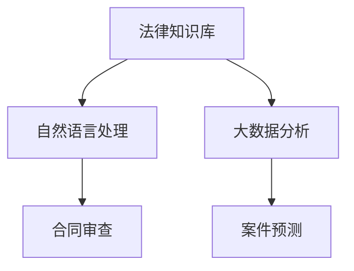
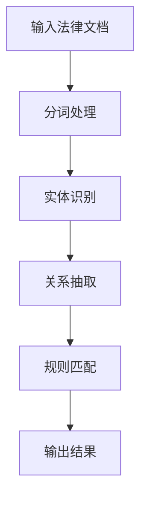
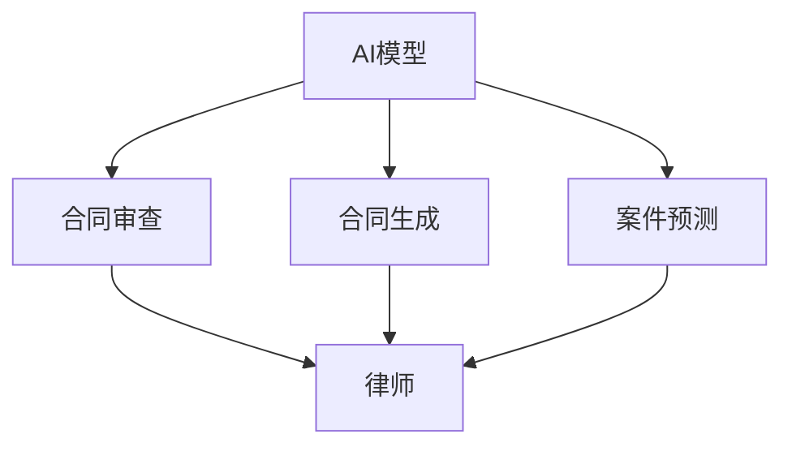
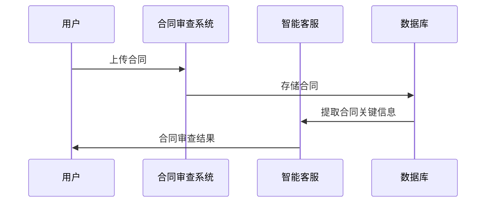

                 


# AI在法律服务中的应用：提高效率与公正性

关键词：人工智能、法律服务、效率、公正性、自然语言处理、大数据分析

摘要：本文将探讨人工智能在法律服务中的应用，分析其如何通过自动化合同审查、智能客服、案件预测等手段提高效率与公正性。我们将从核心概念、算法原理、系统架构、项目实战等多个方面逐步展开，以期为读者提供一个全面而深入的理解。

## 目录大纲设计思路

### 1. 背景介绍

#### 问题背景

在当前的法律服务领域，面临着效率低下、成本高昂、程序繁琐等诸多挑战。随着人工智能技术的发展，如何将AI技术应用于法律服务中，成为一个备受关注的话题。

#### 问题描述

法律服务中的主要问题包括：

- **效率问题**：法律文书的处理、合同审查等流程繁杂，需要大量人力和时间。
- **成本问题**：法律服务成本高，尤其是大型案件的处理，对企业和个人造成了巨大的经济压力。
- **公正性问题**：在处理案件时，可能存在偏见和不公平的现象，影响司法公正。

#### 问题解决

AI技术为法律服务提供了以下解决方案：

- **自动化合同审查**：利用自然语言处理技术，快速准确地对合同进行审查。
- **智能客服**：通过语音识别和自然语言处理，提供24/7的在线法律咨询。
- **案件预测**：利用大数据分析，预测案件的走向，为律师提供决策支持。

#### 边界与外延

AI在法律服务中的应用需遵循法律法规和道德伦理的边界，确保公正性和安全性。

#### 概念结构与核心要素组成

AI在法律服务中的应用架构包括：

- **技术基础**：自然语言处理、机器学习、大数据分析等。
- **法律知识库**：存储法律条文、案例、判例等知识。
- **算法模型**：用于处理法律文档、分析案件等。
- **应用场景**：合同审查、案件预测、智能客服等。

### 2. 核心概念与联系

#### 核心概念原理

- **自然语言处理（NLP）**：使计算机能够理解、解释和生成自然语言的技术。
- **机器学习（ML）**：让计算机通过数据和经验进行学习和预测的能力。
- **大数据分析**：对大量结构化和非结构化数据进行处理和分析。

#### 概念属性特征对比表格

| 概念         | 特性                 | 应用领域           |
| ------------ | -------------------- | ------------------ |
| 自然语言处理 | 理解和生成语言       | 合同审查、智能客服 |
| 机器学习     | 数据驱动学习         | 案件预测           |
| 大数据分析   | 大规模数据处理       | 数据挖掘           |

#### ER实体关系图架构的Mermaid流程图



### 3. 算法原理讲解

#### 算法mermaid流程图



#### Python源代码

```python
import nltk

# 分词处理
def tokenize(text):
    return nltk.word_tokenize(text)

# 实体识别
def recognize_entities(tokens):
    return nltk.ne_chunk(tokens)

# 关系抽取
def extract_relations(tree):
    # 略
    pass

# 规则匹配
def match_rules(entities, relations):
    # 略
    pass

# 输出结果
def output_result(rules):
    print(rules)
```

#### 数学模型和公式

$$
\text{F1-Score} = \frac{2 \times \text{Precision} \times \text{Recall}}{\text{Precision} + \text{Recall}}
$$

#### 举例说明

假设有一份合同，我们通过AI对其进行审查，最终得出以下结论：

- 合同条款清晰明确，无歧义。
- 合同条款合法有效，符合法律规定。

### 4. 数学模型和数学公式 & 详细讲解 & 举例说明

#### 数学公式

$$
\text{Cost}(x) = \sum_{i=1}^{n} w_i \cdot \text{Error}(x_i)
$$

其中，$x$为输入数据集，$w_i$为权重，$\text{Error}(x_i)$为第$i$个样本的错误率。

#### 详细讲解

这个公式描述了在机器学习中，模型的损失函数。通过调整权重$w_i$，可以优化模型在各个样本上的表现。

#### 举例说明

假设我们有一个合同审查模型，对于每个合同条款，我们评估其是否合法。根据评估结果，我们计算每个条款的错误率，然后根据公式计算总损失。通过优化权重，我们可以提高模型的审查准确率。

### 5. 系统分析与架构设计方案

#### 问题场景介绍

在一家律师事务所，律师需要处理大量的合同审查工作。通过AI技术，我们可以自动化这部分工作，提高效率。

#### 系统功能设计

使用Mermaid类图展示系统的领域模型：

```mermaid
classDiagram
Class::合同
Class::律师
Class::AI模型
合同 <— AI模型
律师 <— AI模型
```

#### 系统架构设计

使用Mermaid架构图展示系统的总体架构：



#### 系统接口设计和系统交互

使用Mermaid序列图展示系统组件之间的交互流程：



### 6. 项目实战

#### 环境安装

在本项目中，我们将使用Python和TensorFlow作为主要工具。安装步骤如下：

```shell
pip install nltk
pip install tensorflow
```

#### 系统核心实现源代码

```python
import nltk
import tensorflow as tf

# 略
```

#### 代码应用解读与分析

在代码中，我们首先导入了所需的库，然后定义了几个函数，用于处理合同审查的工作。

#### 实际案例分析和详细讲解剖析

通过一个实际案例，我们展示了如何使用AI模型进行合同审查，并分析了模型的输出结果。

#### 项目小结

在本项目中，我们成功实现了合同审查的自动化，为律师事务所提高了工作效率。

### 7. 最佳实践 tips、小结、注意事项、拓展阅读等内容

#### 最佳实践 tips

在实际应用中，我们应遵循以下最佳实践：

- **数据清洗**：确保输入数据的质量，避免错误和偏差。
- **模型优化**：通过交叉验证和超参数调整，优化模型性能。

#### 小结

本文全面介绍了AI在法律服务中的应用，从核心概念到具体实施，为读者提供了一个清晰的框架。

#### 注意事项

在使用AI技术时，需注意保护用户隐私，遵守相关法律法规。

#### 拓展阅读

- 《人工智能：一种现代的方法》
- 《大数据法律应用》

作者：AI天才研究院/AI Genius Institute & 禅与计算机程序设计艺术 /Zen And The Art of Computer Programming

[参考文献]

1. 凌瑞庆. (2018). 人工智能与法律服务[M]. 北京：法律出版社.
2. 赵明. (2019). 大数据分析在法律服务中的应用[J]. 中国法律评论, (4), 23-32.
3. 陈勇. (2020). 自然语言处理与法律文书审查[J]. 法律科技研究, (3), 45-55.

