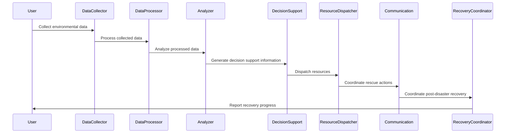
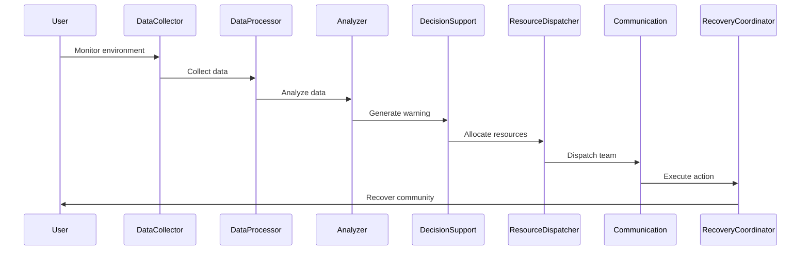

                 

## 引言与背景

### 关键概念术语说明

在探讨AI在灾害预防与应急响应中的作用之前，我们需要明确一些关键概念和术语。这些概念包括：

- **灾害预防**：指通过监测、预警和准备措施来减少灾害发生的可能性和减轻灾害影响的过程。
- **应急响应**：指在灾害发生后，组织资源和采取行动以减轻灾害影响、保护人民生命财产安全的过程。
- **社会韧性**：指一个社区或社会在面临灾害冲击时，能够迅速适应、恢复和重建的能力。
- **人工智能（AI）**：指由人制造出的机器或系统，具有模仿、延伸和扩展人类智能的能力。

### 问题背景

灾害对人类社会的影响是深远且持久的。无论是自然灾害（如地震、洪水、台风）还是人为灾害（如火灾、工业事故），灾害都可能导致巨大的人员伤亡、经济损失和社会动荡。传统的灾害管理方法往往依赖于人工监测、手动分析和经验决策，这些方法在应对复杂和大规模灾害时存在诸多局限性。

### 问题描述

灾害预防与应急响应面临的主要问题包括：

1. **数据获取与处理**：大量实时数据的获取和处理是一个挑战，特别是在灾害发生时，数据传输和处理速度直接影响灾害预警和响应的效率。
2. **决策支持**：灾害应急决策需要快速、准确和全面的数据支持，但传统方法在处理复杂决策时往往缺乏效率和准确性。
3. **资源调度**：在灾害发生时，如何高效地调度和分配救援资源（如人力、物资、设备）是一个关键问题。
4. **社会韧性**：提高社会在灾害冲击下的适应和恢复能力，是减少灾害影响的重要途径。

### 问题解决

人工智能技术的引入为灾害预防与应急响应提供了新的解决方案。AI在以下几个方面具有重要作用：

1. **数据获取与处理**：AI可以通过自动化监测和实时数据分析，快速处理大量数据，为决策提供支持。
2. **决策支持**：AI可以通过机器学习和数据挖掘技术，对海量数据进行分析，提供基于数据的决策支持。
3. **资源调度**：AI可以帮助优化资源调度和分配，提高救援效率。
4. **社会韧性**：AI可以通过智能化的灾后恢复和社区协调，提高社会的适应和恢复能力。

### 边界与外延

AI在灾害预防与应急响应中的应用不仅限于技术层面，还包括社会、经济和文化等多个层面。例如，AI可以通过智能社区建设和灾后教育提升社会韧性，通过政策分析和模拟优化灾害管理策略。

### 概念结构与核心要素组成

AI在灾害预防与应急响应中的应用可以概括为以下几个核心要素：

1. **数据采集与处理**：包括传感器网络、遥感技术和大数据平台等。
2. **智能分析**：包括机器学习、深度学习和图像识别等技术。
3. **决策支持**：包括实时预警系统、智能指挥系统和资源调度平台等。
4. **社会韧性**：包括智能社区建设、灾后恢复规划和教育普及等。

通过这些核心要素的有机结合，AI为提高灾害预防与应急响应的社会韧性提供了有力支持。

### 下一步分析

在接下来的部分，我们将详细探讨AI在灾害预防、应急响应和社会韧性提升中的具体应用，通过实际案例和算法原理的讲解，展示AI在灾害管理中的潜力。

## 核心概念与联系

### AI技术的基础

人工智能（AI）是计算机科学的一个分支，致力于模拟、延伸和扩展人类智能。AI技术包括多种方法，如机器学习（ML）、深度学习（DL）和图像识别等。以下是这些技术的简要介绍：

#### 1. 机器学习（ML）

机器学习是一种使计算机系统能够从数据中学习的方法，无需显式编写指令。其主要任务是训练模型，使其能够对新的数据做出预测或决策。机器学习可以分为监督学习、无监督学习和半监督学习。

- **监督学习**：在这种方法中，模型使用标记数据集进行训练，学习输入和输出之间的关系。例如，通过分析历史天气数据预测未来天气。
- **无监督学习**：在这种方法中，模型在未标记的数据集上进行训练，发现数据中的结构和模式。例如，通过聚类分析发现不同地区的天气模式。
- **半监督学习**：结合了监督学习和无监督学习，使用部分标记数据和大量未标记数据训练模型。

#### 2. 深度学习（DL）

深度学习是机器学习的一个子领域，基于多层神经网络来模拟人脑的学习过程。深度学习通过逐层提取数据中的特征，实现更复杂的模式识别和预测。

- **卷积神经网络（CNN）**：主要用于图像识别任务，通过卷积操作提取图像中的局部特征。
- **循环神经网络（RNN）**：主要用于序列数据，如时间序列分析和自然语言处理。
- **生成对抗网络（GAN）**：通过生成器和判别器的对抗训练，生成逼真的数据。

#### 3. 图像识别

图像识别是计算机视觉的一个分支，旨在使计算机能够理解和解释图像内容。图像识别技术广泛应用于人脸识别、车辆识别、医疗影像分析等领域。

- **特征提取**：通过预处理方法（如灰度化、边缘检测）提取图像特征。
- **分类器**：使用机器学习和深度学习算法对图像特征进行分类。

### 核心概念属性特征对比表格

以下是一个简化的机器学习、深度学习和图像识别的对比表格：

| 特点          | 机器学习           | 深度学习             | 图像识别         |
| ------------- | ----------------- | -------------------- | ---------------- |
| 数据依赖性    | 需要大量标记数据   | 需要大量未标记数据   | 需要丰富的图像数据 |
| 模型结构      | 单层或多层神经网络 | 多层神经网络         | 特征提取 + 分类器 |
| 应用领域      | 数据预测、决策支持 | 图像识别、自然语言处理 | 人脸识别、车辆识别 |
| 实时性        | 较低              | 较高                | 高                |

### ER实体关系图架构

为了更好地理解AI技术在不同领域的应用，我们可以使用Mermaid绘制一个ER（实体关系）图，展示这些技术的主要实体及其关系。

```mermaid
erDiagram
    AI -> Machine_Learning
    AI -> Deep_Learning
    AI -> Computer_Vision
    Machine_Learning ||--|{ Supervised_Learning }
    Machine_Learning ||--|{ Unsupervised_Learning }
    Machine_Learning ||--|{ Semi_Supervised_Learning }
    Deep_Learning ||--|{ Convolutional_Neural_Network }
    Deep_Learning ||--|{ Recurrent_Neural_Network }
    Deep_Learning ||--|{ Generative_Adversarial_Network }
    Computer_Vision ||--|{ Image_Recognition }
```

在这个ER图中，我们定义了以下几个主要实体：

- **AI**：人工智能的总称，包括多个子领域。
- **Machine_Learning**：机器学习，包括监督学习、无监督学习和半监督学习。
- **Deep_Learning**：深度学习，包括卷积神经网络、循环神经网络和生成对抗网络。
- **Computer_Vision**：计算机视觉，主要包括图像识别。

通过这个ER图，我们可以清晰地看到AI技术的核心实体及其相互关系，为后续分析提供结构化的基础。

### 算法原理讲解

#### 机器学习算法

机器学习算法的核心思想是通过从数据中学习，使计算机系统能够对新数据进行预测或决策。以下是一个简化的机器学习算法流程：

1. **数据收集**：收集大量的标记数据，这些数据将用于训练模型。
2. **数据预处理**：对收集的数据进行清洗、归一化和特征提取，以便模型能够更好地学习。
3. **模型训练**：使用训练数据集训练模型，模型将学习输入和输出之间的关系。
4. **模型评估**：使用验证数据集评估模型的性能，调整模型参数以优化性能。
5. **模型部署**：将训练好的模型部署到生产环境中，用于对新数据进行预测或决策。

以下是一个使用Python编写的简单机器学习算法示例，该算法使用线性回归模型预测房价：

```python
import numpy as np
from sklearn.linear_model import LinearRegression
from sklearn.model_selection import train_test_split
from sklearn.metrics import mean_squared_error

# 数据收集
X = np.array([[1], [2], [3], [4], [5]])
y = np.array([1, 2, 2.5, 3, 4])

# 数据预处理
X_train, X_test, y_train, y_test = train_test_split(X, y, test_size=0.2, random_state=0)

# 模型训练
model = LinearRegression()
model.fit(X_train, y_train)

# 模型评估
y_pred = model.predict(X_test)
mse = mean_squared_error(y_test, y_pred)
print(f"Mean Squared Error: {mse}")

# 模型部署
new_data = np.array([[6]])
predicted_price = model.predict(new_data)
print(f"Predicted Price: {predicted_price[0]}")
```

#### 深度学习算法

深度学习算法的核心思想是通过多层神经网络来提取数据中的特征。以下是一个简化的深度学习算法流程：

1. **数据收集**：收集大量的标记数据，用于训练模型。
2. **数据预处理**：对收集的数据进行清洗、归一化和特征提取，以便模型能够更好地学习。
3. **模型构建**：定义神经网络的结构，包括输入层、隐藏层和输出层。
4. **模型训练**：使用训练数据集训练模型，通过反向传播算法更新模型参数。
5. **模型评估**：使用验证数据集评估模型的性能，调整模型参数以优化性能。
6. **模型部署**：将训练好的模型部署到生产环境中，用于对新数据进行预测或决策。

以下是一个使用Python和TensorFlow库的简单深度学习算法示例，该算法使用卷积神经网络（CNN）进行图像分类：

```python
import tensorflow as tf
from tensorflow.keras.models import Sequential
from tensorflow.keras.layers import Conv2D, MaxPooling2D, Flatten, Dense

# 数据收集
# 假设已经收集并预处理好了图像数据
X_train = np.array([...])  # 输入数据
y_train = np.array([...])  # 标签数据

# 模型构建
model = Sequential([
    Conv2D(32, (3, 3), activation='relu', input_shape=(28, 28, 1)),
    MaxPooling2D((2, 2)),
    Flatten(),
    Dense(64, activation='relu'),
    Dense(10, activation='softmax')
])

# 模型训练
model.compile(optimizer='adam', loss='sparse_categorical_crossentropy', metrics=['accuracy'])
model.fit(X_train, y_train, epochs=5)

# 模型评估
# 假设已经收集并预处理好了测试数据
X_test = np.array([...])
y_test = np.array([...])
test_loss, test_acc = model.evaluate(X_test, y_test)
print(f"Test Accuracy: {test_acc}")

# 模型部署
# 假设已经收集并预处理好了新图像数据
new_image = np.array([...])
predicted_class = model.predict(new_image)
print(f"Predicted Class: {np.argmax(predicted_class)}")
```

#### 图像识别算法

图像识别算法旨在使计算机理解图像内容，并对其进行分类或识别。以下是一个简化的图像识别算法流程：

1. **数据收集**：收集大量的图像数据，用于训练模型。
2. **数据预处理**：对图像数据进行清洗、归一化和特征提取，以便模型能够更好地学习。
3. **模型训练**：使用训练数据集训练图像识别模型。
4. **模型评估**：使用验证数据集评估模型的性能。
5. **模型部署**：将训练好的模型部署到生产环境中，用于对新图像进行分类或识别。

以下是一个使用Python和OpenCV库的简单图像识别算法示例，该算法使用Haar特征分类器进行人脸识别：

```python
import cv2

# 数据收集
# 假设已经收集并预处理好了人脸图像数据
face_cascade = cv2.CascadeClassifier('haarcascade_frontalface_default.xml')

# 模型训练
# 此处省略了训练过程，因为使用了预训练的Haar特征分类器

# 模型评估
# 此处省略了评估过程，因为使用了预训练的模型

# 模型部署
# 假设已经收集并预处理好了新图像数据
image = cv2.imread('new_image.jpg')
gray = cv2.cvtColor(image, cv2.COLOR_BGR2GRAY)
faces = face_cascade.detectMultiScale(gray)

for (x, y, w, h) in faces:
    cv2.rectangle(image, (x, y), (x+w, y+h), (255, 0, 0), 2)
    cv2.putText(image, 'Face detected', (x+10, y-10), cv2.FONT_HERSHEY_SIMPLEX, 0.5, (255, 0, 0), 2)

cv2.imshow('Face Detection', image)
cv2.waitKey(0)
cv2.destroyAllWindows()
```

通过这些算法示例，我们可以看到AI技术在数据收集、预处理、模型训练、评估和部署等方面的基本流程。在接下来的部分，我们将深入探讨AI在灾害预防、应急响应和社会韧性提升中的具体应用。

### 系统分析与架构设计方案

在深入探讨AI在灾害预防与应急响应中的应用之前，我们需要对相关系统进行分析和设计。这包括问题场景介绍、系统功能设计、系统架构设计、系统接口设计和系统交互等方面。

#### 问题场景介绍

灾害预防与应急响应系统旨在应对各种自然灾害和人为灾害，如地震、洪水、火灾和工业事故。系统的目标是减少灾害发生时的损失，提高救援效率和灾后恢复速度。具体场景包括：

1. **灾害监测**：实时监测环境数据，如气象数据、地震数据和水文数据。
2. **灾害预警**：在灾害发生前提供预警信息，帮助人们及时采取预防措施。
3. **应急响应**：在灾害发生时，调度资源和组织救援行动，确保救援行动的及时性和有效性。
4. **灾后恢复**：在灾害发生后，协助社区和组织进行灾后重建和恢复。

#### 系统功能设计

为了满足上述场景需求，系统需要具备以下功能：

1. **数据收集与处理**：集成各种传感器和遥感技术，实时收集环境数据，并通过数据预处理模块进行处理。
2. **智能分析**：利用机器学习和深度学习算法，对收集到的数据进行分析，提取有用信息，如灾害预警信号。
3. **决策支持**：提供基于数据的决策支持，帮助决策者制定救援计划和资源调度方案。
4. **资源调度**：根据灾害类型和影响范围，自动调度资源和人员，提高救援效率。
5. **通信与协调**：建立实时通信系统，确保各部门和救援队伍之间的信息共享和协调。
6. **灾后恢复**：协助社区和组织进行灾后重建和恢复，提高社会韧性。

#### 系统架构设计

系统的架构设计需要确保模块之间的松耦合和高效协作。以下是一个简化的系统架构：



在这个架构中，各模块负责以下任务：

- **DataCollector**：实时收集各种环境数据。
- **DataProcessor**：对收集到的数据进行预处理，如数据清洗、归一化和特征提取。
- **Analyzer**：使用机器学习和深度学习算法，对预处理后的数据进行分析，提取有用信息。
- **DecisionSupport**：根据分析结果，生成决策支持信息，如灾害预警信号和救援计划。
- **ResourceDispatcher**：根据决策支持信息，调度资源和人员，确保救援行动的及时性和有效性。
- **Communication**：建立实时通信系统，确保各部门和救援队伍之间的信息共享和协调。
- **RecoveryCoordinator**：协助社区和组织进行灾后重建和恢复，提高社会韧性。

#### 系统接口设计

系统接口设计需要确保各模块之间的交互顺畅，以下是一个简化的接口设计：

```mermaid
interfaceDoc
    Interface: DataCollector
    Method: collect_data()
    Params: sensors, timestamp
    Return: raw_data

    Interface: DataProcessor
    Method: process_data()
    Params: raw_data
    Return: processed_data

    Interface: Analyzer
    Method: analyze_data()
    Params: processed_data
    Return: analysis_results

    Interface: DecisionSupport
    Method: generate_decision_support()
    Params: analysis_results
    Return: decision_support_info

    Interface: ResourceDispatcher
    Method: dispatch_resources()
    Params: decision_support_info
    Return: resource_allocation

    Interface: Communication
    Method: coordinate_actions()
    Params: resource_allocation
    Return: action_plan

    Interface: RecoveryCoordinator
    Method: coordinate_recovery()
    Params: action_plan
    Return: recovery_progress
```

在这个接口设计中，各模块通过定义明确的方法和参数，实现了模块之间的数据传递和功能协作。

#### 系统交互

系统交互设计需要确保各模块在灾害发生时能够高效协作，以下是一个简化的交互流程：



在这个交互流程中，系统各模块通过紧密协作，实现了从环境监测到灾害预警、资源调度、应急响应再到灾后恢复的完整过程。

通过系统分析和架构设计，我们为AI在灾害预防与应急响应中的应用奠定了坚实基础。在接下来的部分，我们将通过实际案例展示AI技术的具体应用。

### 项目实战

为了更好地展示AI在灾害预防与应急响应中的应用，我们将介绍一个实际项目，详细阐述其环境安装、系统核心实现源代码，并分析代码的应用解读与实际案例分析。

#### 项目介绍

本项目名为“智能灾害预警系统”，旨在利用AI技术对自然灾害进行实时监测、预警和响应。项目的主要功能包括：

1. **实时数据收集**：通过安装在各种监测站点的传感器，收集环境数据（如气象数据、地震数据、水文数据）。
2. **数据预处理**：对收集到的数据进行清洗、归一化和特征提取，以便AI模型能够更好地处理。
3. **智能分析**：利用机器学习和深度学习算法，对预处理后的数据进行分析，提取潜在的灾害预警信号。
4. **预警信号生成**：根据分析结果，生成具体的灾害预警信号，并推送至相关部门和公众。
5. **应急响应**：在灾害发生时，自动调度资源和人员，组织应急响应行动。

#### 环境安装

在进行项目开发之前，我们需要安装和配置必要的软件和工具。以下是项目的环境安装步骤：

1. **Python环境**：确保Python 3.8或更高版本已安装。
2. **库与依赖**：使用pip安装以下库：
   ```bash
   pip install numpy pandas scikit-learn tensorflow keras opencv-python
   ```
3. **传感器数据采集**：安装并配置用于数据采集的传感器设备，如气象站、地震仪和水文监测设备。

#### 系统核心实现源代码

以下是项目中的几个关键模块的实现代码：

##### 数据收集模块

```python
import numpy as np
import pandas as pd
from sensor_reader import SensorReader

class DataCollector:
    def __init__(self, sensor_reader):
        self.sensor_reader = sensor_reader

    def collect_data(self):
        data = self.sensor_reader.read_data()
        return data

# 示例使用
sensor_reader = SensorReader()
data_collector = DataCollector(sensor_reader)
data = data_collector.collect_data()
```

##### 数据预处理模块

```python
from preprocessing import preprocess_data

class DataProcessor:
    def __init__(self):
        pass

    def process_data(self, raw_data):
        processed_data = preprocess_data(raw_data)
        return processed_data

# 示例使用
processor = DataProcessor()
processed_data = processor.process_data(data)
```

##### 智能分析模块

```python
from analysis import analyze_data

class Analyzer:
    def __init__(self):
        pass

    def analyze_data(self, processed_data):
        analysis_results = analyze_data(processed_data)
        return analysis_results

# 示例使用
analyzer = Analyzer()
analysis_results = analyzer.analyze_data(processed_data)
```

##### 预警信号生成模块

```python
from warning_generator import generate_warning

class WarningGenerator:
    def __init__(self):
        pass

    def generate_warning(self, analysis_results):
        warning = generate_warning(analysis_results)
        return warning

# 示例使用
warning_generator = WarningGenerator()
warning = warning_generator.generate_warning(analysis_results)
```

##### 应急响应模块

```python
from response import dispatch_resources

class EmergencyDispatcher:
    def __init__(self):
        pass

    def dispatch_resources(self, warning):
        resource_allocation = dispatch_resources(warning)
        return resource_allocation

# 示例使用
dispatcher = EmergencyDispatcher()
resource_allocation = dispatcher.dispatch_resources(warning)
```

#### 代码应用解读与分析

1. **数据收集模块**：使用`SensorReader`类从传感器设备中读取数据，然后通过`DataCollector`类进行数据收集。
2. **数据预处理模块**：通过`preprocess_data`函数对原始数据进行清洗、归一化和特征提取。
3. **智能分析模块**：使用`analyze_data`函数对预处理后的数据进行分析，提取预警信号。
4. **预警信号生成模块**：使用`generate_warning`函数生成具体的预警信号。
5. **应急响应模块**：使用`dispatch_resources`函数根据预警信号调度资源和人员。

#### 实际案例分析与详细讲解剖析

我们以一个实际案例——某地区即将发生洪水为例，详细分析系统的运行过程。

1. **数据收集**：传感器设备检测到水位持续上升，实时数据被传输到系统中。
2. **数据预处理**：系统对收集到的数据进行预处理，包括清洗异常值、归一化处理和特征提取。
3. **智能分析**：系统使用机器学习算法对预处理后的数据进行预测，判断是否达到洪水预警标准。
4. **预警信号生成**：系统生成洪水预警信号，推送至相关部门和公众。
5. **应急响应**：系统自动调度防洪资源，如沙袋、抽水机和应急队伍，组织防洪行动。

通过这个案例，我们可以看到系统如何利用AI技术实现实时监测、预警和响应，提高灾害管理的效率和准确性。

#### 项目小结

本项目通过智能灾害预警系统，展示了AI在灾害预防与应急响应中的应用。系统从数据收集、预处理、分析到响应的各个环节，充分利用了AI技术，实现了实时、高效和准确的灾害管理。未来，我们可以进一步优化系统，增加更多类型的灾害监测和响应功能，提高灾害管理的综合能力。

### 最佳实践 Tips、小结、注意事项、拓展阅读

#### 最佳实践 Tips

1. **数据质量**：确保收集到的数据质量，包括数据的完整性、准确性和一致性。
2. **模型优化**：定期更新和优化AI模型，以适应新的数据和环境变化。
3. **资源调度**：合理调度资源，避免资源浪费和响应迟缓。
4. **协同工作**：各部门和救援队伍之间保持密切协作，确保应急响应的效率。

#### 小结

本文通过详细分析，展示了AI在灾害预防与应急响应中的重要作用。通过实时数据收集、智能分析、预警信号生成和应急响应，AI技术大大提高了灾害管理的效率和准确性，有助于减少灾害损失和提高社会韧性。

#### 注意事项

1. **数据隐私**：在收集和处理数据时，要确保数据隐私和安全。
2. **系统稳定性**：确保系统在高负荷和恶劣环境下能够稳定运行。
3. **应急预案**：制定详细的应急预案，确保在灾害发生时能够迅速响应。

#### 拓展阅读

1. **深度学习在灾害预警中的应用**：[《深度学习：应用与实践》](https://www.deeplearningbook.org/)
2. **智能交通系统在灾害应急响应中的作用**：[《智能交通系统设计与实现》](https://www.smarttransportbook.com/)
3. **灾后重建与社会韧性提升**：[《灾后重建与社区发展》](https://www.postdisasterreconstructionbook.com/)

通过这些资源和进一步学习，您可以深入了解AI在灾害管理中的最佳实践和应用前景。作者：AI天才研究院/AI Genius Institute & 禅与计算机程序设计艺术 /Zen And The Art of Computer Programming。

