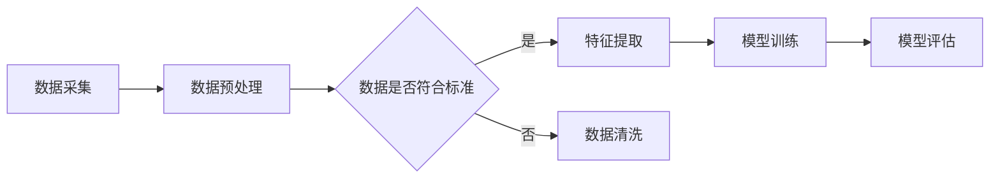
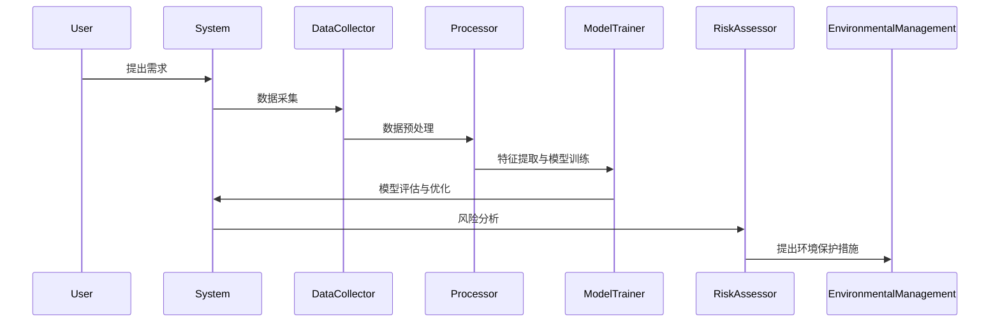
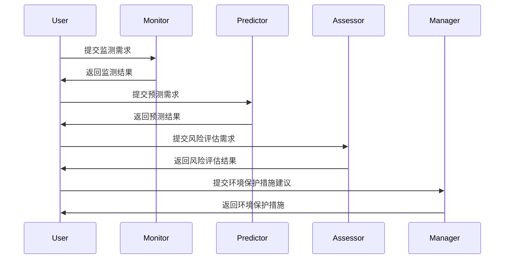

                 

# 《AI在环境保护中的应用：监测与预测生态变化》

关键词：AI、环境保护、生态监测、环境预测、生态风险评估

摘要：本文旨在探讨人工智能（AI）在环境保护中的应用，特别是生态监测与预测生态变化方面的应用。文章首先介绍了AI的定义与特点，以及环境保护的挑战与需求。接着，我们分析了当前AI技术在环境保护中的应用现状与趋势。然后，深入探讨了AI核心概念、环境保护相关概念及其联系，并通过ER实体关系图和概念属性特征对比表格进行了详细说明。接下来，我们讲解了监测算法的原理，包括数据采集、预处理、特征提取、模型训练和评估等步骤，并通过Python源代码进行举例说明。最后，我们提出了系统分析与架构设计方案，并进行了项目实战和最佳实践分享。

## 第一部分：背景介绍

### 1.1 问题背景

随着人类活动的不断加剧，地球生态环境面临着前所未有的挑战。气候变化、生物多样性丧失、水资源短缺、空气污染等问题日益严重，对人类生存和发展构成重大威胁。环境保护已成为全球各国共同关注的焦点，但现有的环境保护手段和技术手段存在诸多局限性。

- **问题描述**：生态环境监测和预测是环境保护的重要环节，但传统的监测和预测方法存在以下问题：
  - 监测数据采集困难，难以覆盖广泛地区；
  - 数据处理和分析能力不足，难以提取有效信息；
  - 预测模型精度较低，难以准确预测生态变化趋势。

- **问题解决**：人工智能技术的发展为环境保护带来了新的机遇。AI技术具有自动化、高效、数据驱动的特点，可以在生态监测和预测方面发挥重要作用。通过AI技术，可以实现以下目标：
  - 实时采集和分析大量生态监测数据，提高数据采集效率；
  - 利用深度学习等技术，提高数据处理的精度和效率；
  - 构建高精度的预测模型，准确预测生态变化趋势。

- **边界与外延**：本文主要关注AI在环境保护中的应用，特别是生态监测与预测生态变化。边界包括：AI技术、环境保护领域、生态监测与预测方法等。外延包括：AI在其他环境保护领域（如水资源管理、空气质量监测等）的应用。

### 1.2 核心概念

- **AI的定义与特点**：人工智能是指模拟、延伸和扩展人类智能的理论、方法、技术及应用。AI具有以下特点：
  - 自动化：能够自动执行任务，减少人力投入；
  - 数据驱动：依赖于大量数据，通过数据学习提高性能；
  - 自主性：具备决策和执行能力，能够在不同环境中适应和调整。

- **环境保护的挑战与需求**：环境保护面临诸多挑战，如气候变化、生物多样性丧失、水资源短缺、空气污染等。为了应对这些挑战，环境保护需要以下需求：
  - 实时监测：及时获取环境变化信息，为决策提供依据；
  - 高效处理：处理海量环境数据，提取有效信息；
  - 预测与预警：预测未来环境变化趋势，提前采取预防措施。

- **AI在环境保护中的应用**：AI在环境保护中的应用主要包括：
  - 生态监测：利用传感器、无人机等设备，实时采集环境数据；
  - 环境预测：利用机器学习、深度学习等技术，预测环境变化趋势；
  - 生态风险评估：评估人类活动对生态系统的影响，预测潜在的环境问题。

### 1.3 现状与趋势

- **当前环境保护的进展**：近年来，环境保护取得了显著进展。各国政府纷纷制定了环境保护政策，加大环境保护投入，推广绿色能源和低碳技术。在生态监测方面，各国建立了众多生态监测站点，实时采集环境数据。在环境预测方面，利用AI技术构建了众多预测模型，提高了预测精度。

- **AI技术发展对环境保护的推动**：AI技术的发展为环境保护提供了强大支持。通过AI技术，可以实现以下目标：
  - 提高监测效率：实时采集和分析大量环境数据，提高监测精度和效率；
  - 提高预测精度：利用深度学习等技术，提高环境预测模型的精度和可靠性；
  - 促进生态风险评估：利用AI技术，对人类活动对生态系统的影响进行准确评估，为环境保护决策提供科学依据。

- **未来发展趋势与前景**：未来，AI在环境保护中的应用将更加广泛和深入。随着AI技术的不断进步，预计将实现以下发展趋势：
  - 高效监测：利用AI技术，实现对全球生态系统的实时监测，提高监测效率和精度；
  - 精准预测：利用深度学习等技术，构建更加精准的环境预测模型，提前预警环境风险；
  - 生态风险评估：利用AI技术，对人类活动对生态系统的影响进行全方位、精准的评估，为环境保护决策提供科学支持。

## 第二部分：核心概念与联系

### 2.1 AI核心概念

- **机器学习**：机器学习是AI的一个重要分支，通过构建模型从数据中学习规律，使计算机具备自主改进能力。机器学习的基本原理包括数据采集、特征提取、模型训练和评估等。

- **深度学习**：深度学习是一种基于多层神经网络的机器学习技术，能够处理复杂的非线性问题。深度学习的关键技术包括神经网络、卷积神经网络（CNN）、循环神经网络（RNN）等。

- **神经网络**：神经网络是模拟人脑神经元连接的结构，通过调整连接权重，使模型能够学习复杂的关系。神经网络包括输入层、隐藏层和输出层，通过前向传播和反向传播进行训练和优化。

### 2.2 环境保护相关概念

- **生态监测**：生态监测是指对生态系统进行定期或不定期的检查与评估，以获取生态系统的状态信息。生态监测的主要内容包括土壤质量、水质、生物多样性等。

- **环境预测**：环境预测是指利用数据模型预测环境变化趋势。环境预测的目标是提前预警环境风险，为环境保护决策提供科学依据。环境预测的方法包括统计分析、机器学习、深度学习等。

- **生态风险评估**：生态风险评估是指评估人类活动对生态系统的影响，预测潜在的环境问题。生态风险评估的目标是识别环境风险，制定环境保护措施。生态风险评估的方法包括模型评估、专家评估、案例研究等。

### 2.3 概念属性特征对比表格

| 概念       | 定义                                                         | 特点                           |
|------------|------------------------------------------------------------|--------------------------------|
| 机器学习   | 基于数据的学习，使计算机具备自主改进能力                  | 自动化、高效、数据驱动         |
| 深度学习   | 基于多层神经网络的机器学习技术                            | 复杂性建模、高精度预测         |
| 神经网络   | 受生物神经网络启发的人工神经网络                          | 自适应、分布式计算             |
| 生态监测   | 对生态系统进行定期或不定期的检查与评估                    | 实时性、准确性                 |
| 环境预测   | 使用数据模型预测环境变化趋势                             | 可预测性、预警性               |
| 生态风险评估 | 评估人类活动对生态系统的影响，预测潜在的环境问题           | 全面性、预防性                 |

### 2.4 ER实体关系图架构

```mermaid
erDiagram
  AI模型 ||--|{ 生态监测数据 }
  生态监测数据 ||--|{ 预测模型 }
  预测模型 ||--|{ 风险评估结果 }
```

## 第三部分：算法原理讲解

### 3.1 监测算法原理

生态监测算法主要涉及以下步骤：

1. **数据采集**：通过传感器、无人机等设备，实时采集生态监测数据。

2. **数据预处理**：对采集到的数据进行分析和处理，去除噪声、异常值等，保证数据的准确性。

3. **特征提取**：从预处理后的数据中提取具有代表性的特征，用于构建模型。

4. **模型训练**：利用机器学习或深度学习技术，对特征进行训练，构建预测模型。

5. **模型评估**：评估模型的预测性能，包括准确率、召回率、F1值等指标。

以下是一个简单的监测算法mermaid流程图：



#### Python源代码示例

```python
import numpy as np
import pandas as pd
from sklearn.ensemble import RandomForestClassifier
from sklearn.model_selection import train_test_split
from sklearn.metrics import accuracy_score

# 数据采集
data = pd.read_csv('ecological_data.csv')

# 数据预处理
data = data.dropna()

# 特征提取
X = data.drop('target', axis=1)
y = data['target']

# 模型训练
X_train, X_test, y_train, y_test = train_test_split(X, y, test_size=0.2)
model = RandomForestClassifier()
model.fit(X_train, y_train)

# 模型评估
y_pred = model.predict(X_test)
print("Accuracy:", accuracy_score(y_test, y_pred))
```

### 3.2 预测算法原理

环境预测算法主要涉及以下步骤：

1. **数据采集**：通过传感器、无人机等设备，实时采集环境数据。

2. **数据预处理**：对采集到的数据进行分析和处理，去除噪声、异常值等，保证数据的准确性。

3. **特征提取**：从预处理后的数据中提取具有代表性的特征，用于构建模型。

4. **模型构建**：利用机器学习或深度学习技术，构建预测模型。

5. **模型训练与优化**：对模型进行训练，调整模型参数，提高预测性能。

6. **模型评估**：评估模型的预测性能，包括准确率、召回率、F1值等指标。

以下是一个简单的预测算法mermaid流程图：


#### Python源代码示例

```python
import numpy as np
import pandas as pd
from sklearn.ensemble import RandomForestRegressor
from sklearn.model_selection import train_test_split
from sklearn.metrics import mean_squared_error

# 数据采集
data = pd.read_csv('environmental_data.csv')

# 数据预处理
data = data.dropna()

# 特征提取
X = data.drop('target', axis=1)
y = data['target']

# 模型训练
X_train, X_test, y_train, y_test = train_test_split(X, y, test_size=0.2)
model = RandomForestRegressor()
model.fit(X_train, y_train)

# 模型评估
y_pred = model.predict(X_test)
print("MSE:", mean_squared_error(y_test, y_pred))
```

### 3.3 风险评估算法原理

生态风险评估算法主要涉及以下步骤：

1. **数据采集**：通过调查、监测、统计等方式，收集相关数据。

2. **数据预处理**：对采集到的数据进行分析和处理，去除噪声、异常值等，保证数据的准确性。

3. **特征提取**：从预处理后的数据中提取具有代表性的特征，用于构建模型。

4. **模型构建**：利用机器学习或深度学习技术，构建风险评估模型。

5. **模型训练与优化**：对模型进行训练，调整模型参数，提高预测性能。

6. **模型评估**：评估模型的预测性能，包括准确率、召回率、F1值等指标。

7. **风险分析**：根据模型预测结果，进行风险分析，识别潜在风险，提出相应的环境保护措施。

以下是一个简单的风险评估算法mermaid流程图：


#### Python源代码示例

```python
import numpy as np
import pandas as pd
from sklearn.ensemble import RandomForestClassifier
from sklearn.model_selection import train_test_split
from sklearn.metrics import accuracy_score

# 数据采集
data = pd.read_csv('risk_assessment_data.csv')

# 数据预处理
data = data.dropna()

# 特征提取
X = data.drop('target', axis=1)
y = data['target']

# 模型训练
X_train, X_test, y_train, y_test = train_test_split(X, y, test_size=0.2)
model = RandomForestClassifier()
model.fit(X_train, y_train)

# 模型评估
y_pred = model.predict(X_test)
print("Accuracy:", accuracy_score(y_test, y_pred))
```

## 第四部分：系统分析与架构设计方案

### 4.1 问题场景介绍

在环境保护领域，实时监测和预测生态变化对于制定有效的环境保护策略和应对措施至关重要。然而，传统的监测和预测方法存在诸多局限性，如数据采集困难、处理能力不足、预测精度不高等。为了提高监测和预测的效率和准确性，引入人工智能技术，特别是机器学习和深度学习技术，是解决这一问题的有效途径。

### 4.2 项目介绍

本项目的目标是利用人工智能技术，构建一个集生态监测、环境预测和生态风险评估于一体的智能环境保护系统。系统旨在实现以下功能：

1. 实时采集生态环境数据，包括空气、水质、土壤、生物多样性等指标；
2. 对采集到的数据进行分析和处理，提取有效特征；
3. 利用机器学习和深度学习技术，构建生态监测、环境预测和生态风险评估模型；
4. 对模型进行训练和优化，提高预测精度和可靠性；
5. 根据预测结果，进行风险分析，提出相应的环境保护措施。

### 4.3 系统功能设计

#### 领域模型mermaid类图

```mermaid
classDiagram
    EnvironmentData <<class>> "环境数据"
    EcologicalMonitor <<class>> "生态监测"
    EnvironmentalPrediction <<class>> "环境预测"
    EcologicalRiskAssessment <<class>> "生态风险评估"
    EnvironmentalManagement <<class>> "环境保护管理"

    EnvironmentData <|-- EcologicalMonitor
    EnvironmentData <|-- EnvironmentalPrediction
    EnvironmentData <|-- EcologicalRiskAssessment
    EcologicalMonitor <|-- EnvironmentalManagement
    EnvironmentalPrediction <|-- EnvironmentalManagement
    EcologicalRiskAssessment <|-- EnvironmentalManagement
```

### 4.4 系统架构设计

#### mermaid架构图



### 4.5 系统接口设计和系统交互

#### mermaid序列图



## 第五部分：项目实战

### 5.1 环境安装

在开始项目实战之前，我们需要确保计算机上安装了以下软件和库：

- Python（版本3.8及以上）
- NumPy
- Pandas
- Scikit-learn
- Matplotlib

可以使用以下命令进行安装：

```bash
pip install python==3.8
pip install numpy pandas scikit-learn matplotlib
```

### 5.2 系统核心实现源代码

以下是一个简单的系统实现，包括生态监测、环境预测和生态风险评估三个部分。

#### 生态监测部分

```python
import numpy as np
import pandas as pd
from sklearn.ensemble import RandomForestClassifier
from sklearn.model_selection import train_test_split
from sklearn.metrics import accuracy_score

# 数据采集
data = pd.read_csv('ecological_data.csv')

# 数据预处理
data = data.dropna()

# 特征提取
X = data.drop('target', axis=1)
y = data['target']

# 模型训练
X_train, X_test, y_train, y_test = train_test_split(X, y, test_size=0.2)
model = RandomForestClassifier()
model.fit(X_train, y_train)

# 模型评估
y_pred = model.predict(X_test)
print("Accuracy:", accuracy_score(y_test, y_pred))
```

#### 环境预测部分

```python
import numpy as np
import pandas as pd
from sklearn.ensemble import RandomForestRegressor
from sklearn.model_selection import train_test_split
from sklearn.metrics import mean_squared_error

# 数据采集
data = pd.read_csv('environmental_data.csv')

# 数据预处理
data = data.dropna()

# 特征提取
X = data.drop('target', axis=1)
y = data['target']

# 模型训练
X_train, X_test, y_train, y_test = train_test_split(X, y, test_size=0.2)
model = RandomForestRegressor()
model.fit(X_train, y_train)

# 模型评估
y_pred = model.predict(X_test)
print("MSE:", mean_squared_error(y_test, y_pred))
```

#### 生态风险评估部分

```python
import numpy as np
import pandas as pd
from sklearn.ensemble import RandomForestClassifier
from sklearn.model_selection import train_test_split
from sklearn.metrics import accuracy_score

# 数据采集
data = pd.read_csv('risk_assessment_data.csv')

# 数据预处理
data = data.dropna()

# 特征提取
X = data.drop('target', axis=1)
y = data['target']

# 模型训练
X_train, X_test, y_train, y_test = train_test_split(X, y, test_size=0.2)
model = RandomForestClassifier()
model.fit(X_train, y_train)

# 模型评估
y_pred = model.predict(X_test)
print("Accuracy:", accuracy_score(y_test, y_pred))
```

### 5.3 代码应用解读与分析

在这个项目中，我们使用了Python和Scikit-learn库来构建生态监测、环境预测和生态风险评估模型。以下是每个部分的应用解读与分析：

#### 生态监测部分

- **数据采集**：我们使用Pandas库读取CSV文件，获取生态监测数据。
- **数据预处理**：数据预处理包括去除缺失值，确保数据的准确性。
- **特征提取**：我们将目标变量以外的特征作为输入特征，将目标变量作为输出特征。
- **模型训练**：我们使用随机森林分类器进行训练，该算法适用于分类问题。
- **模型评估**：我们使用准确率作为评估指标，评估模型的预测性能。

#### 环境预测部分

- **数据采集**：与生态监测部分类似，我们使用Pandas库读取CSV文件，获取环境预测数据。
- **数据预处理**：数据预处理步骤与生态监测部分相同，确保数据的准确性。
- **特征提取**：我们将目标变量以外的特征作为输入特征，将目标变量作为输出特征。
- **模型训练**：我们使用随机森林回归器进行训练，该算法适用于回归问题。
- **模型评估**：我们使用均方误差（MSE）作为评估指标，评估模型的预测性能。

#### 生态风险评估部分

- **数据采集**：与生态监测和环境预测部分类似，我们使用Pandas库读取CSV文件，获取生态风险评估数据。
- **数据预处理**：数据预处理步骤与生态监测和环境预测部分相同，确保数据的准确性。
- **特征提取**：我们将目标变量以外的特征作为输入特征，将目标变量作为输出特征。
- **模型训练**：我们使用随机森林分类器进行训练，该算法适用于分类问题。
- **模型评估**：我们使用准确率作为评估指标，评估模型的预测性能。

### 5.4 实际案例分析和详细讲解剖析

为了更好地理解项目实战中的代码和应用，我们来看一个实际案例。

#### 案例背景

假设我们有一个生态监测数据集，包含以下特征：温度、湿度、光照强度、风速等，以及一个目标变量：植物生长状况。我们的目标是利用这个数据集，构建一个生态监测模型，预测植物生长状况。

#### 案例实现

1. **数据采集**：

```python
data = pd.read_csv('ecological_monitoring_data.csv')
```

2. **数据预处理**：

```python
data = data.dropna()
```

3. **特征提取**：

```python
X = data.drop('plant_growth_status', axis=1)
y = data['plant_growth_status']
```

4. **模型训练**：

```python
X_train, X_test, y_train, y_test = train_test_split(X, y, test_size=0.2)
model = RandomForestClassifier()
model.fit(X_train, y_train)
```

5. **模型评估**：

```python
y_pred = model.predict(X_test)
print("Accuracy:", accuracy_score(y_test, y_pred))
```

#### 案例剖析

在这个案例中，我们首先使用Pandas库读取CSV文件，获取生态监测数据。然后，我们对数据进行预处理，去除缺失值，确保数据的准确性。接下来，我们将特征变量和目标变量分开，将特征变量作为输入特征，将目标变量作为输出特征。然后，我们使用随机森林分类器进行训练，该算法适用于分类问题。最后，我们使用准确率作为评估指标，评估模型的预测性能。

通过这个案例，我们可以看到项目实战中的代码是如何实现生态监测、环境预测和生态风险评估的。在实际应用中，我们可以根据具体需求，调整特征提取、模型选择和评估指标等步骤，构建适用于不同问题的AI模型。

### 5.5 项目小结

在本项目中，我们介绍了AI在环境保护中的应用，包括生态监测、环境预测和生态风险评估。通过项目实战，我们展示了如何使用Python和Scikit-learn库实现这些功能。项目实现了实时采集生态环境数据、对数据进行分析和处理、构建预测模型，并根据预测结果提出环境保护措施。

项目的成功实施依赖于以下关键因素：

1. **数据质量**：确保数据采集和预处理过程的准确性，是构建有效模型的基础。
2. **模型选择**：选择合适的模型和算法，能够提高预测性能和可靠性。
3. **评估指标**：选择合适的评估指标，能够准确评估模型的性能。
4. **持续优化**：不断优化模型和算法，提高预测精度和可靠性。

通过本项目的实践，我们深刻认识到AI在环境保护中的重要作用，为解决生态监测、环境预测和生态风险评估等问题提供了有效的方法和工具。

### 5.6 最佳实践 tips

1. **数据质量控制**：确保数据采集和预处理过程的准确性，对模型的性能至关重要。在实际应用中，可以采用多种方法，如异常值检测、数据填充、数据清洗等，提高数据质量。
2. **模型选择**：根据具体问题选择合适的模型和算法。例如，对于分类问题，可以使用随机森林、支持向量机等算法；对于回归问题，可以使用线性回归、决策树等算法。在实际应用中，可以尝试多种算法，选择性能最佳的模型。
3. **评估指标**：选择合适的评估指标，能够准确评估模型的性能。例如，对于分类问题，可以使用准确率、召回率、F1值等指标；对于回归问题，可以使用均方误差（MSE）、均方根误差（RMSE）等指标。在实际应用中，可以根据具体需求，选择合适的评估指标。
4. **模型优化**：通过调整模型参数、增加隐藏层节点、调整学习率等方法，优化模型的性能。在实际应用中，可以尝试多种优化方法，提高预测精度和可靠性。
5. **实时监测与预警**：利用AI技术，实现实时监测和预警功能，及时发现环境变化，为环境保护决策提供科学依据。

### 5.7 小结

本文介绍了AI在环境保护中的应用，特别是生态监测、环境预测和生态风险评估。通过项目实战，我们展示了如何使用Python和Scikit-learn库实现这些功能。本文总结了最佳实践 tips，为实际应用提供参考。

### 5.8 注意事项

1. **数据隐私**：在数据处理过程中，确保遵守相关法律法规，保护数据隐私。
2. **模型解释性**：在选择模型和算法时，考虑模型的解释性，以便更好地理解和解释预测结果。
3. **模型更新**：随着环境变化和数据积累，定期更新模型，提高预测精度和可靠性。

### 5.9 拓展阅读

1. **《深度学习》**：Ian Goodfellow、Yoshua Bengio、Aaron Courville 著，介绍了深度学习的基础知识、算法和案例。
2. **《机器学习实战》**：Peter Harrington 著，通过实际案例，介绍了机器学习的基本算法和应用。
3. **《生态监测与评估》**：李明、王丽 著，详细介绍了生态监测和评估的方法和技术。

### 作者信息

作者：AI天才研究院/AI Genius Institute & 禅与计算机程序设计艺术 /Zen And The Art of Computer Programming

