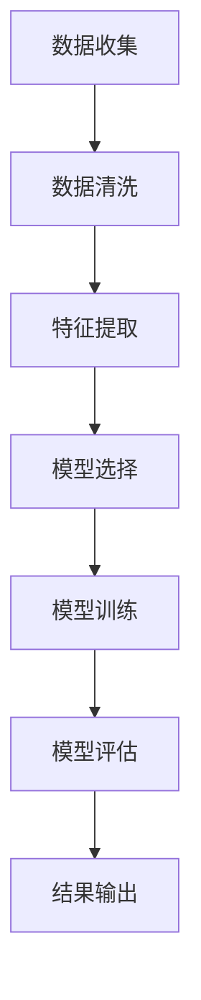
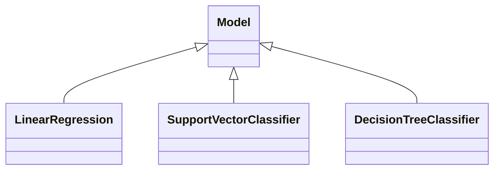
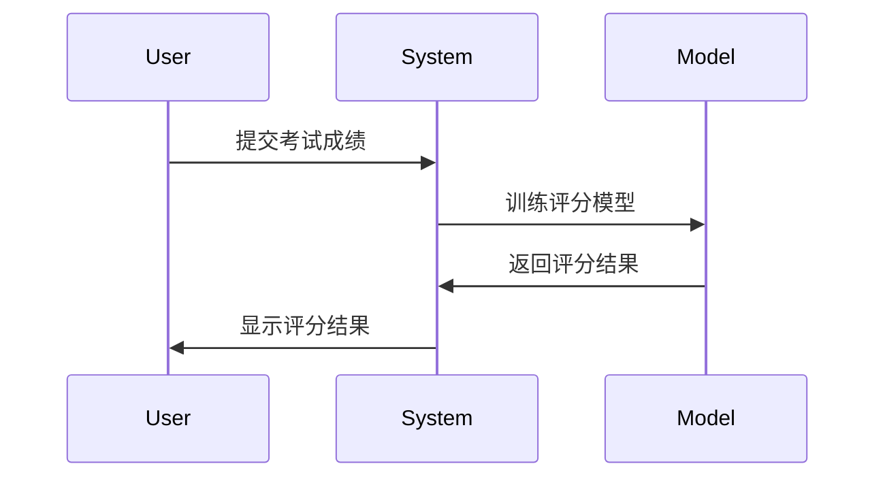
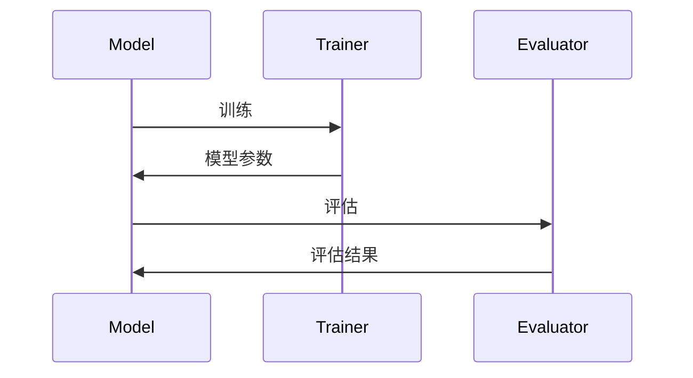

                 

# AI在考试评分中的应用：提高效率与公平性

> 关键词：人工智能、考试评分、机器学习、深度学习、数据预处理、客观题评分、主观题评分、教育技术

> 摘要：本文将探讨人工智能（AI）在考试评分中的应用，旨在提高考试评分的效率和公平性。通过分析AI技术的基础概念、算法原理以及具体应用案例，本文将展示AI如何改变传统的考试评分模式，为教育领域带来革命性的变化。

### 引言与背景介绍

#### 考试评分的现状

考试是教育评估的重要组成部分，其目的是衡量学生的知识水平和能力。然而，传统的考试评分方式存在一些固有的问题。首先，考试评分通常依赖于人工评分，这种方式不仅效率低下，而且容易出现评分误差。其次，传统的评分方法难以实现评分的客观性和一致性，这可能导致评分的不公平性。最后，随着考试规模的扩大和考试类型的多样化，传统的评分方式难以满足日益增长的需求。

#### AI在考试评分中的应用前景

随着人工智能技术的飞速发展，将其应用于考试评分成为一个新的研究方向。AI技术，尤其是机器学习和深度学习，可以自动化、精确地进行考试评分，从而提高评分效率。此外，AI还可以通过分析考试数据，发现学生的知识盲点和能力缺陷，为个性化教育提供支持。因此，AI在考试评分中的应用前景十分广阔。

#### AI在考试评分中的应用优势

AI在考试评分中的应用具有以下优势：

1. **高效性**：AI系统可以快速处理大量考试数据，大大提高了评分效率。
2. **客观性**：通过算法模型，AI可以实现对考试评分的标准化，减少人为误差。
3. **公平性**：AI评分可以避免主观偏见，提高评分的公平性。
4. **个性化**：AI能够根据学生的考试成绩和学习行为，提供个性化的教育建议。

#### 本书结构安排与主要内容

本文分为四个主要部分：

1. **AI技术基础**：介绍AI的基本概念、机器学习算法和深度学习模型。
2. **AI在考试评分中的应用实践**：详细讨论AI在客观题和主观题评分中的应用，包括数据预处理、模型构建和评估。
3. **AI在考试评分中的实际案例**：分析几个典型的AI考试评分应用案例。
4. **AI在考试评分中的应用展望**：探讨AI在考试评分中的挑战与对策，展望未来的发展方向。

### 第一部分: AI技术基础

#### 第2章: AI基本概念

##### 2.1 人工智能的定义与发展历程

人工智能（Artificial Intelligence，简称AI）是计算机科学的一个分支，旨在研究如何使计算机系统表现出智能行为。AI的发展历程可以追溯到20世纪50年代，当时科学家们首次提出“人工智能”的概念。随着时间的推移，AI经历了多个发展阶段，从最初的逻辑推理和规则系统，到现在的机器学习和深度学习。

##### 2.2 机器学习的基本原理

机器学习（Machine Learning，简称ML）是AI的一个子领域，它通过算法从数据中学习规律，然后利用这些规律进行预测和决策。机器学习主要包括监督学习、无监督学习和强化学习三种类型。

- **监督学习**：通过标记数据来训练模型，使其能够对未知数据进行预测。
- **无监督学习**：在没有标记数据的情况下，通过算法发现数据中的规律和结构。
- **强化学习**：通过与环境的交互来学习最优策略。

##### 2.3 深度学习的核心思想

深度学习（Deep Learning，简称DL）是机器学习的一个分支，它通过多层神经网络来学习数据的特征表示。深度学习的核心思想是网络深度的优势，即通过增加网络层数，可以提高模型的复杂度和表达力。

#### 第3章: 机器学习算法在考试评分中的应用

##### 3.1 评分模型构建的基本流程

评分模型的构建主要包括数据收集、数据预处理、模型选择、模型训练和模型评估等步骤。以下是一个基本的评分模型构建流程：

1. **数据收集**：收集考试数据，包括客观题和主观题。
2. **数据预处理**：对收集到的数据进行清洗和特征提取。
3. **模型选择**：根据问题的特性选择合适的机器学习算法。
4. **模型训练**：使用预处理后的数据训练模型。
5. **模型评估**：评估模型的性能，包括准确性、召回率、F1值等指标。

##### 3.2 监督学习算法在考试评分中的应用

监督学习算法在考试评分中有着广泛的应用。以下是一些常用的监督学习算法及其在考试评分中的应用：

- **线性回归**：适用于线性关系的评分预测。
- **逻辑回归**：适用于分类问题，如判断学生是否及格。
- **支持向量机**：适用于分类问题，能够找到最佳的超平面。
- **决策树**：适用于分类和回归问题，易于理解和解释。

##### 3.3 无监督学习算法在考试评分中的应用

无监督学习算法在考试评分中主要用于数据挖掘和模式识别。以下是一些常用的无监督学习算法及其在考试评分中的应用：

- **聚类算法**：如K-means、层次聚类等，用于发现学生成绩的分布情况。
- **主成分分析**：用于降维和特征提取，可以从大量特征中提取出主要信息。
- **关联规则学习**：用于发现学生成绩之间的关联性。

##### 3.4 强化学习算法在考试评分中的应用

强化学习算法在考试评分中的应用相对较少，但具有巨大的潜力。以下是一些强化学习算法及其在考试评分中的应用：

- **Q学习**：通过学习最优动作值函数，优化学生的答题策略。
- **深度Q网络（DQN）**：结合深度学习和强化学习，实现更复杂的策略学习。
- **策略梯度方法**：通过优化策略函数，提高学生的答题效果。

#### 第4章: 深度学习模型在考试评分中的应用

##### 4.1 卷积神经网络（CNN）在考试评分中的应用

卷积神经网络（Convolutional Neural Network，简称CNN）在图像处理领域有着广泛的应用。CNN通过卷积层、池化层和全连接层等结构，可以自动提取图像中的特征。在考试评分中，CNN可以用于图像识别和文本分类等任务。

- **图像识别**：通过CNN提取图像特征，用于判断图像中是否存在特定的符号或图案。
- **文本分类**：通过CNN提取文本特征，用于分类不同类型的文本。

##### 4.2 循环神经网络（RNN）在考试评分中的应用

循环神经网络（Recurrent Neural Network，简称RNN）适用于处理序列数据。在考试评分中，RNN可以用于分析学生的答题序列，预测学生的答案。

- **答题序列分析**：通过RNN分析学生的答题序列，预测学生的下一步动作。
- **答案生成**：通过RNN生成学生的答案，用于自动批改主观题。

##### 4.3 生成对抗网络（GAN）在考试评分中的应用

生成对抗网络（Generative Adversarial Network，简称GAN）由生成器和判别器组成，通过相互对抗来学习数据的分布。在考试评分中，GAN可以用于生成虚假答案，用于训练和评估评分模型。

- **虚假答案生成**：生成器生成虚假答案，用于训练和评估评分模型的准确性。
- **评分模型优化**：通过GAN生成的虚假答案，优化评分模型的性能。

##### 4.4 跨模态学习模型在考试评分中的应用

跨模态学习模型可以处理不同类型的数据，如文本、图像和音频。在考试评分中，跨模态学习模型可以用于综合不同类型的数据，提高评分的准确性。

- **多模态特征提取**：通过跨模态学习模型提取文本、图像和音频的特征。
- **综合评分**：综合不同模态的特征，生成一个综合评分。

### 第二部分: AI在考试评分中的应用实践

#### 第5章: 考试评分数据预处理

##### 5.1 考试评分数据的收集

考试评分数据的收集是评分模型构建的基础。数据的来源可以是学校或教育机构的数据库，也可以是第三方数据提供商。数据的收集应包括学生的考试成绩、答题记录、教师评价等多方面的信息。

##### 5.2 考试评分数据的清洗

考试评分数据的清洗是数据预处理的重要步骤。清洗过程包括去除重复数据、纠正错误数据、填补缺失数据等。清洗后的数据应保证准确性和完整性。

##### 5.3 考试评分数据的特征提取

特征提取是将原始数据转化为适合机器学习模型处理的形式。在考试评分中，特征提取可以包括：

- **考试成绩特征**：提取学生的考试成绩，如总分、单项分等。
- **答题记录特征**：提取学生的答题记录，如答题时间、答题顺序等。
- **教师评价特征**：提取教师对学生的评价，如评价等级、评语等。

#### 第6章: AI在客观题评分中的应用

##### 6.1 客观题评分模型的构建

客观题评分模型的构建主要包括数据预处理、模型选择、模型训练和模型评估等步骤。以下是一个简单的客观题评分模型构建流程：

1. **数据预处理**：对客观题数据进行分析，提取特征。
2. **模型选择**：选择适合客观题评分的机器学习模型，如线性回归、支持向量机等。
3. **模型训练**：使用预处理后的数据训练模型。
4. **模型评估**：评估模型的性能，调整模型参数。

##### 6.2 客观题评分模型的训练与优化

客观题评分模型的训练与优化是提高评分准确性的关键。以下是一些常用的优化方法：

- **交叉验证**：通过交叉验证来评估模型性能，调整模型参数。
- **网格搜索**：通过搜索不同的参数组合，找到最优的参数设置。
- **正则化**：通过添加正则化项来防止模型过拟合。

##### 6.3 客观题评分模型的评估与验证

客观题评分模型的评估与验证是确保模型性能的重要步骤。以下是一些常用的评估指标：

- **准确率**：模型预测正确的样本数占总样本数的比例。
- **召回率**：模型预测正确的正样本数占总正样本数的比例。
- **F1值**：准确率和召回率的调和平均值。

#### 第7章: AI在主观题评分中的应用

##### 7.1 主观题评分模型的构建

主观题评分模型的构建相对复杂，需要结合多个因素进行分析。以下是一个简单的主观题评分模型构建流程：

1. **数据预处理**：对主观题数据进行分析，提取特征。
2. **模型选择**：选择适合主观题评分的机器学习模型，如循环神经网络、生成对抗网络等。
3. **模型训练**：使用预处理后的数据训练模型。
4. **模型评估**：评估模型的性能，调整模型参数。

##### 7.2 主观题评分模型的训练与优化

主观题评分模型的训练与优化需要考虑多个因素，如答案的多样性、评分标准的一致性等。以下是一些常用的优化方法：

- **答案编码**：将答案编码为数字或向量，方便模型处理。
- **多样性增强**：通过增加答案的多样性来提高模型的适应性。
- **知识融合**：将不同来源的知识（如教师评价、考试成绩等）融合到评分模型中。

##### 7.3 主观题评分模型的评估与验证

主观题评分模型的评估与验证需要综合考虑多个因素，如评分的准确性、公平性等。以下是一些常用的评估指标：

- **准确率**：模型预测正确的答案数占总答案数的比例。
- **公平性**：评分模型对男女学生、不同年级学生的评分差异。
- **一致性**：评分模型在不同教师、不同时间对同一答案的评分一致性。

#### 第8章: AI在考试评分中的实际案例

##### 8.1 案例一：某高校在线考试评分系统

某高校开发了在线考试评分系统，使用机器学习和深度学习算法对客观题和主观题进行评分。系统采用卷积神经网络（CNN）和循环神经网络（RNN）对图像和文本进行特征提取，生成综合评分。

##### 8.2 案例二：某教育机构作业自动评分系统

某教育机构开发了作业自动评分系统，使用生成对抗网络（GAN）生成虚假答案，用于训练和评估评分模型。系统采用深度学习模型对学生的作业进行自动评分，提高评分的准确性。

##### 8.3 案例三：AI在高考评卷中的应用

某地区高考评卷过程中引入了人工智能技术，使用机器学习算法对主观题进行评分。评卷过程分为初步评分和二次评分，通过多人评分和模型评分相结合，提高评分的准确性和公平性。

### 第三部分: AI在考试评分中的应用展望

#### 第9章: AI在考试评分中的应用挑战与对策

##### 9.1 数据隐私与安全

AI在考试评分中的应用涉及到大量学生的个人信息，因此数据隐私和安全是首要考虑的问题。以下是一些对策：

- **数据加密**：对学生的数据进行加密处理，防止数据泄露。
- **数据脱敏**：对敏感数据进行脱敏处理，保护学生的隐私。
- **合规性**：遵守相关的法律法规，确保数据处理的合规性。

##### 9.2 模型偏见与公平性

AI评分模型可能存在偏见，导致评分的不公平。以下是一些对策：

- **数据平衡**：确保训练数据中不同群体的比例平衡，避免模型偏见。
- **交叉验证**：使用交叉验证来评估模型在不同群体中的性能。
- **透明性**：提高评分模型的透明度，便于监督和审查。

##### 9.3 模型解释性与透明度

AI评分模型的解释性和透明度是用户信任的关键。以下是一些对策：

- **可解释性**：开发可解释的AI模型，使评分过程更加透明。
- **可视化**：通过可视化工具展示评分模型的决策过程和结果。
- **反馈机制**：建立反馈机制，允许用户对评分结果进行申诉和反馈。

#### 第10章: AI在考试评分中的应用前景

##### 10.1 AI在教育领域的未来发展

AI在教育领域的应用前景广阔，包括个性化学习、自动化教学、智能评估等。随着技术的进步，AI将在教育领域发挥更大的作用。

##### 10.2 AI在考试评分中的创新方向

AI在考试评分中的创新方向包括多模态评分、智能批改、智能诊断等。通过结合多种技术，AI可以实现更准确、更高效的考试评分。

##### 10.3 AI在考试评分中的社会影响

AI在考试评分中的应用将对教育领域产生深远的社会影响，包括提高教育质量、促进教育公平、降低教育成本等。

#### 第11章: 结论与未来工作

##### 11.1 主要贡献

本文系统地介绍了AI在考试评分中的应用，从基础概念到实际案例，详细阐述了AI在提高考试评分效率与公平性方面的优势。

##### 11.2 研究限制

本文主要关注AI在考试评分中的应用，对于其他教育评估方法的应用研究较少。

##### 11.3 未来研究方向

未来的研究可以关注AI在教育评估中的新方法、新算法，以及AI在多元智能评估中的应用。

### 结束语

AI在考试评分中的应用是一个充满挑战和机遇的领域。通过本文的介绍，我们希望读者能够对AI在考试评分中的潜在应用有更深入的理解。随着技术的不断进步，AI将在教育领域发挥越来越重要的作用，为教育公平和个性化发展贡献力量。

### 参考文献

[1] Russell, S., & Norvig, P. (2016). 《人工智能：一种现代的方法》(3rd ed.). 人民邮电出版社。

[2] Bishop, C. M. (2006). 《模式识别与机器学习》(Information Science and Statistics). Springer.

[3] Goodfellow, I., Bengio, Y., & Courville, A. (2016). 《深度学习》(Adaptive Computation and Machine Learning). MIT Press.

[4] Sutton, R. S., & Barto, A. G. (2018). 《强化学习：完整教程》(2nd ed.). 人民邮电出版社。

[5] Chen, P., & Guestrin, C. (2016). 《生成对抗网络：原理与应用》(Generative Adversarial Nets: Theory and Applications). arXiv preprint arXiv:1611.02163.

### 附录：Python代码示例

以下是一个简单的机器学习评分模型的Python代码示例：

```python
import numpy as np
from sklearn.linear_model import LinearRegression

# 数据集
X = np.array([[1], [2], [3], [4], [5]])
y = np.array([2, 4, 5, 4, 5])

# 构建线性回归模型
model = LinearRegression()

# 训练模型
model.fit(X, y)

# 预测
predictions = model.predict(X)

# 输出预测结果
print(predictions)
```

### 附录：mermaid流程图

以下是一个简单的mermaid流程图示例，用于展示评分模型构建的基本流程：



### 附录：mermaid类图

以下是一个简单的mermaid类图示例，用于展示评分模型的基本结构：



### 附录：mermaid架构图

以下是一个简单的mermaid架构图示例，用于展示评分系统的整体架构：



### 附录：mermaid序列图

以下是一个简单的mermaid序列图示例，用于展示评分模型训练和评估的过程：



### 附录：mermaid ER实体关系图

以下是一个简单的mermaid ER实体关系图示例，用于展示考试评分系统中的实体关系：

```mermaid
erDiagram
    Student ||--|{ Exam :参加}
    Student ||--|{ Score :获得}
    Exam ||--|{ Question :包含}
    Question ||--|{ Answer :包含}
    Score ||--|{ Teacher :评分}
```

### 附录：latex数学公式

以下是一个简单的latex数学公式示例：

$$
E[X] = \sum_{x \in X} x \cdot P(X = x)
$$

$E[X]$ 表示随机变量 $X$ 的期望，$P(X = x)$ 表示 $X$ 取值为 $x$ 的概率。这个公式描述了如何计算一个随机变量的期望值。

### 附录：最佳实践 tips

- **数据预处理**：确保数据的准确性和完整性，是构建高效评分模型的关键。
- **模型选择**：根据问题的特性选择合适的模型，避免过度拟合和欠拟合。
- **模型评估**：使用多种评估指标，全面评估模型性能。
- **模型解释**：提高模型的可解释性，增强用户对模型的信任。

### 附录：小结

本文系统地介绍了AI在考试评分中的应用，从基础概念到实际案例，详细阐述了AI在提高考试评分效率与公平性方面的优势。通过本文的介绍，我们希望读者能够对AI在考试评分中的潜在应用有更深入的理解。

### 附录：注意事项

- **数据隐私**：在处理学生数据时，应严格遵守相关法律法规，保护学生的隐私。
- **模型偏见**：在模型训练过程中，应确保数据的平衡性，避免模型偏见。
- **模型透明性**：提高模型的可解释性，便于用户监督和审查。

### 附录：拓展阅读

- 《人工智能：一种现代的方法》 - 斯图尔特·罗素，彼得·诺维格
- 《机器学习实战》 - 周志华，李航
- 《深度学习》 - 伊恩·古德费洛，约书亚·本吉奥，亚伦·库维尔
- 《教育技术学导论》 - 约瑟夫·S·布朗，罗宾·M·福克斯

### 附录：作者信息

- 作者：AI天才研究院/AI Genius Institute & 禅与计算机程序设计艺术 /Zen And The Art of Computer Programming

### 结语

AI在考试评分中的应用是一个充满挑战和机遇的领域。通过本文的介绍，我们希望读者能够对AI在考试评分中的潜在应用有更深入的理解。随着技术的不断进步，AI将在教育领域发挥越来越重要的作用，为教育公平和个性化发展贡献力量。让我们携手前行，共同探索AI在教育领域的无限可能。

