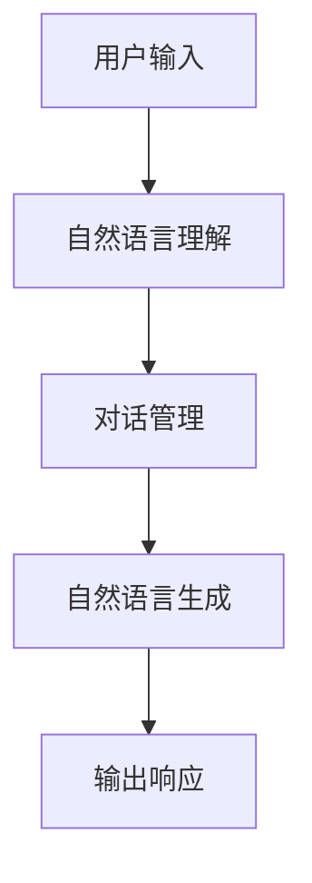
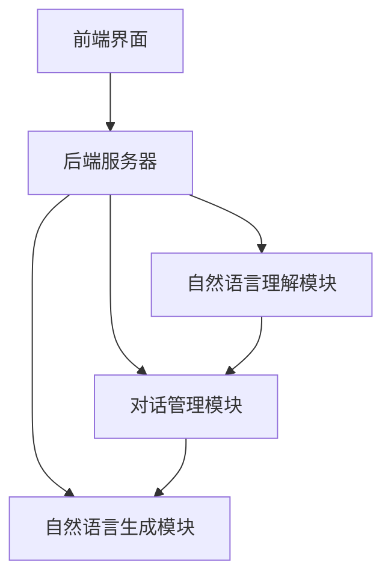
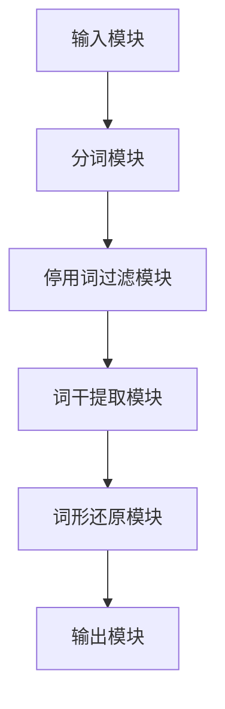
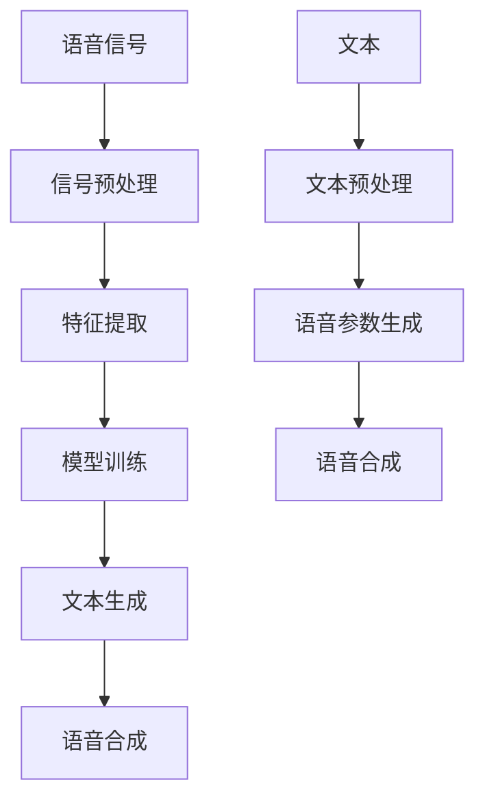
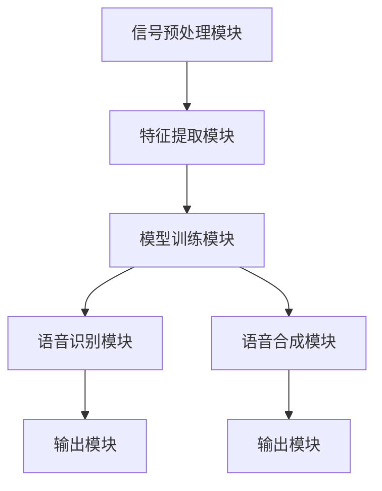
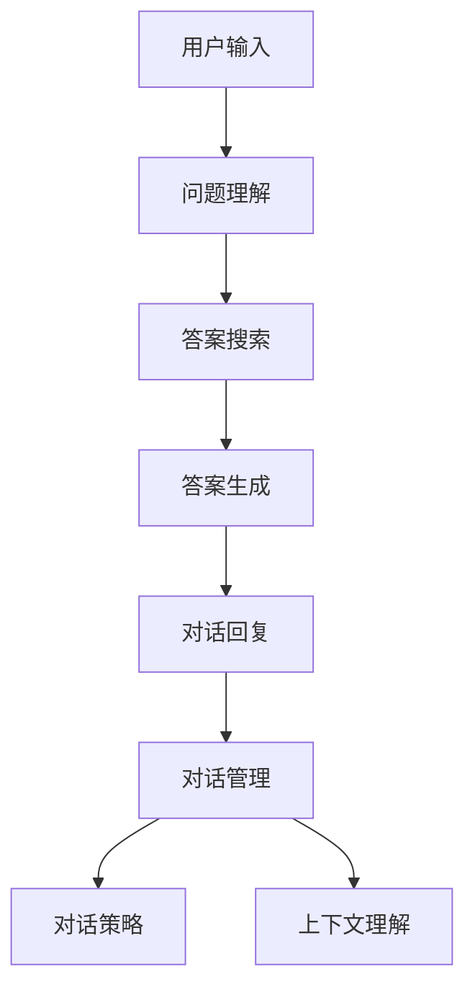
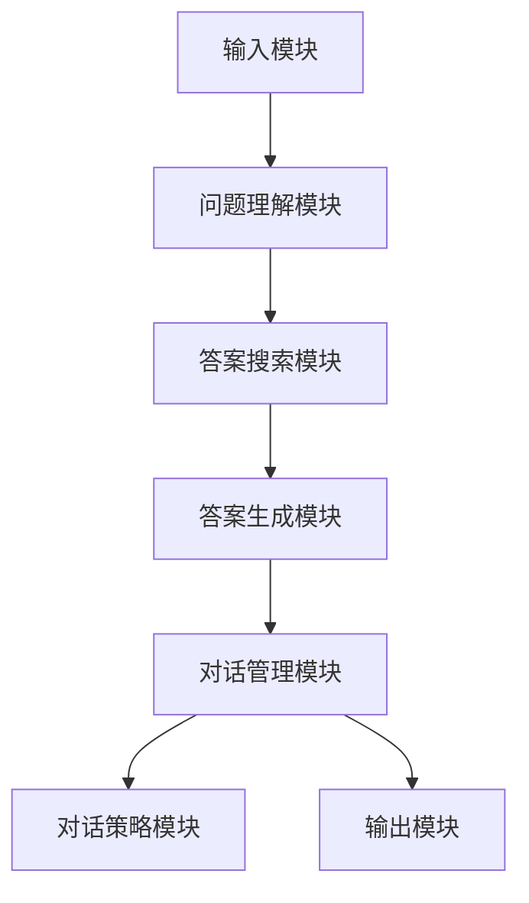

                 

## 1.1.1 NLP的发展历程及现状

自然语言处理（Natural Language Processing，简称NLP）作为人工智能领域的一个重要分支，其发展历程可以追溯到20世纪50年代。当时，随着计算机科学和人工智能的兴起，研究人员开始尝试让计算机理解和处理自然语言，这一时期的NLP主要以规则为基础，通过手工编写的语法规则来解析语言。

### 初期阶段（1950s-1960s）

在初期阶段，NLP的研究主要集中在语法解析和机器翻译。1950年，艾伦·图灵提出了著名的图灵测试，旨在衡量机器是否具有人类水平的智能，这为NLP的发展奠定了基础。1956年，达特茅斯会议的召开标志着人工智能领域的正式诞生，其中自然语言处理成为了一个重要议题。在这个阶段，NLP的研究主要依靠人工编写的语法规则和词典，试图通过模式匹配和规则匹配来理解语言。

### 中期阶段（1970s-1980s）

随着计算机性能的提高和语言学理论的发展，NLP进入了中期阶段。在这个阶段，研究人员开始引入概率模型和统计方法来处理语言。1960年代末期，霍普菲尔德-皮萨罗（Hopfield-Pizer）模型的出现，为语音识别技术的发展奠定了基础。此外，肯尼斯·科恩（Kenneth Ko\*en）等人提出的转换语法（Transduction Grammar）理论，使得NLP在处理不确定性和歧义性方面取得了重要进展。

### 近现代阶段（1990s-至今）

进入20世纪90年代以来，随着计算能力的进一步提升和数据资源的丰富，NLP进入了近现代阶段。这个阶段的一个重要突破是机器学习技术的引入，尤其是基于统计的机器学习方法。1995年，约翰·霍普金斯大学的研究团队在问答系统WinoGrate中首次使用了统计机器翻译（SMT）技术，这一突破标志着NLP进入了一个新的时代。

在21世纪初，随着深度学习技术的兴起，NLP再次迎来了重大突破。深度神经网络（DNN）和递归神经网络（RNN）等深度学习模型在语言建模和序列标注任务上取得了显著的效果。2013年，杰弗里·辛顿（Geoffrey Hinton）等人在ImageNet图像识别挑战赛中使用了深度卷积神经网络（CNN），这一成功激发了研究人员将深度学习应用于自然语言处理的兴趣。

近年来，预训练语言模型（如GPT、BERT等）的出现，进一步推动了NLP的发展。预训练语言模型通过在大量无标签文本上进行预训练，然后进行微调，可以显著提高模型在多种NLP任务上的性能。2022年，谷歌发布了BERT模型，该模型在多个NLP基准测试上取得了领先成绩，进一步推动了NLP技术的发展。

### 现状与挑战

目前，NLP已经广泛应用于多个领域，如机器翻译、情感分析、文本分类、问答系统等。然而，NLP仍然面临许多挑战。首先，自然语言的复杂性和多样性使得模型难以完全理解语言的深层含义。其次，数据的不均衡和噪声问题对模型的训练和评估带来了困难。此外，模型的可解释性和可靠性也是NLP研究的重要课题。

随着技术的不断进步，NLP在解决这些挑战方面取得了显著进展。未来，随着更多先进技术的引入，NLP将在更多领域发挥重要作用，为人类生活带来更多便利。例如，智能客服、智能语音助手、自动化写作等应用，都将是NLP技术的重要发展方向。

## 1.1.2 AI在NLP中的突破性进展

人工智能（AI）的引入为NLP带来了革命性的变革。特别是深度学习技术的发展，使得NLP在多个任务上取得了显著的突破。以下将介绍AI在NLP中的突破性进展，以及这些进展如何推动人机对话系统的发展。

### 深度学习在NLP中的应用

深度学习技术，尤其是深度神经网络（DNN）、递归神经网络（RNN）和卷积神经网络（CNN）等模型，在NLP中的应用极大地提高了语言处理的效果。以下是一些典型的应用案例：

- **文本分类**：通过使用DNN和CNN，模型可以自动从大量文本数据中学习特征，实现对文本的准确分类。例如，在垃圾邮件检测中，模型可以准确地将垃圾邮件和正常邮件区分开来。

- **情感分析**：利用RNN和变换器（Transformer）模型，可以有效地对文本进行情感分析。通过分析用户评论或社交媒体上的文本，模型可以判断文本表达的情感是正面、负面还是中性。

- **命名实体识别（NER）**：NER是NLP中的一个重要任务，目的是识别文本中的命名实体，如人名、地名、机构名等。使用深度学习模型，NER的准确率得到了显著提高。

### 预训练语言模型

预训练语言模型的出现是NLP领域的一个重要突破。预训练语言模型通过在大规模无标签文本上进行预训练，然后进行微调，可以在多种NLP任务上取得优异的性能。以下是一些常见的预训练语言模型：

- **GPT（Generative Pre-trained Transformer）**：由OpenAI开发的GPT模型是一系列基于Transformer架构的预训练语言模型。GPT-3是最新版本，具有1750亿个参数，可以生成高质量的文本，被广泛应用于问答系统、文本生成、对话系统等任务。

- **BERT（Bidirectional Encoder Representations from Transformers）**：由Google开发的BERT模型通过双向编码器对文本进行建模，可以捕捉文本的上下文信息，被广泛应用于问答系统、文本分类、实体识别等任务。

- **RoBERTa（A Robustly Optimized BERT Pretraining Approach）**：由Facebook AI团队开发的RoBERTa模型在多个NLP基准测试上超过了BERT模型，其改进包括更长的序列处理能力、更强的模型泛化能力等。

### 人机对话系统的改进

AI在NLP中的突破性进展直接推动了人机对话系统的发展。以下是人机对话系统在AI技术推动下的一些显著改进：

- **对话生成**：利用预训练语言模型，人机对话系统可以生成更加自然、流畅的对话。例如，通过微调GPT模型，系统可以生成与用户提问相关的高质量回答。

- **上下文理解**：预训练语言模型如BERT和RoBERTa能够更好地理解上下文信息，使得人机对话系统能够更准确地理解用户的意图和需求。

- **情感识别**：通过情感分析技术，人机对话系统可以识别用户的情感状态，从而生成更加符合用户情感预期的回答。

- **多轮对话**：传统的基于规则的人机对话系统通常难以处理多轮对话。而基于深度学习和预训练语言模型的人机对话系统能够更好地处理多轮对话，提供更加连贯、自然的对话体验。

### 实际应用案例

AI在NLP中的突破性进展已经广泛应用于实际场景，以下是一些典型案例：

- **智能客服**：利用AI技术，智能客服系统能够自动识别用户的问题，并提供准确的答案。例如，亚马逊的Alexa和苹果的Siri都是基于NLP技术的智能客服系统。

- **自动写作**：AI技术可以自动生成新闻文章、博客文章等。例如，美联社和华盛顿邮报等新闻机构已经采用AI技术生成新闻文章，提高了新闻报道的效率。

- **教育应用**：在教育领域，AI技术可以用于个性化教学和自动评估。例如，Coursera和Khan Academy等在线教育平台已经采用AI技术提供个性化的学习体验和自动评估。

总的来说，AI在NLP中的突破性进展为人机对话系统带来了巨大的变革，使得人机交互更加自然、高效。随着技术的不断进步，人机对话系统将在更多领域发挥重要作用，为人类生活带来更多便利。同时，AI在NLP中的应用也面临着一些挑战，如数据隐私、模型解释性等，这些挑战需要进一步的研究和解决。

## 1.1.3 问题解决及边界与外延

### 问题解决

AI在自然语言处理中的突破性进展为人机对话系统带来了显著提升，主要表现在以下几个方面：

1. **语言生成能力的提高**：预训练语言模型如GPT-3和BERT能够生成高质量、连贯的文本，使得人机对话系统能够提供更加自然、流畅的回答。

2. **上下文理解的增强**：通过深度学习模型对大规模文本数据的训练，人机对话系统可以更好地理解用户的意图和需求，从而提供更准确的回答。

3. **情感识别的准确度**：利用情感分析技术，人机对话系统可以准确识别用户的情感状态，从而生成更加符合用户情感预期的回答。

4. **多轮对话的流畅性**：基于深度学习和预训练语言模型的人机对话系统能够更好地处理多轮对话，提供更加连贯、自然的对话体验。

### 边界与外延

尽管AI在自然语言处理中的突破性进展为人机对话系统带来了显著提升，但仍然存在一些边界和挑战：

1. **数据隐私问题**：在训练和部署人机对话系统时，涉及大量的用户数据。如何保护用户隐私，防止数据泄露是亟需解决的问题。

2. **模型解释性**：深度学习模型通常被视为“黑箱”，其决策过程难以解释。提高模型的可解释性，使决策过程更加透明，是未来的重要研究方向。

3. **多语言支持**：尽管预训练语言模型具有较好的多语言处理能力，但在某些特定语言或领域中的表现仍有待提高。开发更适用于特定语言和领域的人机对话系统是未来的发展方向。

4. **道德和社会责任**：人机对话系统的应用可能带来一些道德和社会责任问题，如偏见、歧视等。如何在开发和应用过程中充分考虑这些问题，确保系统的公平性和公正性，是未来的重要议题。

5. **人机交互的自然性**：尽管AI在自然语言处理方面取得了显著进展，但人机交互仍然存在一定的局限性，如语言理解的深度和广度等方面。如何进一步提高人机交互的自然性，提供更加人性化的服务，是未来的研究重点。

总之，AI在自然语言处理中的突破性进展为人机对话系统带来了巨大变革，但同时也面临着一系列边界和挑战。未来，随着技术的不断进步，人机对话系统将在更多领域发挥重要作用，为人类生活带来更多便利。同时，我们也需要关注并解决其在应用过程中面临的问题，确保其健康发展。

## 1.2 核心概念

### 1.2.1 NLP的基本概念

自然语言处理（NLP）是计算机科学和人工智能领域的一个分支，旨在使计算机能够理解、解释和生成人类自然语言。以下是一些NLP的基本概念：

- **文本**：文本是指由一组字符组成的符号序列，是自然语言处理的基本单位。
- **词**：词是语言中最小的有意义的单位，可以独立存在，具有特定的语义。
- **句子**：句子是由一组词构成的，可以表达完整意义的语言单位。
- **语义**：语义是指语言所表达的意义，是理解语言的关键。
- **语法**：语法是指语言的结构规则，用于指导如何构造有效的句子。
- **实体**：实体是文本中具有特定意义的对象，如人名、地名、机构名等。
- **情感**：情感是指文本表达的情绪或态度，分为正面、负面和中性等。

### 1.2.2 AI在NLP中的应用

人工智能（AI）在自然语言处理中的应用，使得计算机能够更加智能地处理和理解自然语言。以下是一些AI在NLP中的应用：

- **文本分类**：通过机器学习算法，将文本自动分类到不同的类别中，如垃圾邮件检测、新闻分类等。
- **情感分析**：利用自然语言处理技术，分析文本中的情感倾向，如正面、负面或中立。
- **命名实体识别（NER）**：识别文本中的命名实体，如人名、地名、机构名等，对于信息抽取和知识图谱构建具有重要意义。
- **机器翻译**：将一种语言的文本翻译成另一种语言，是自然语言处理的重要应用。
- **对话系统**：通过自然语言处理技术，实现人与计算机之间的对话，如智能客服、智能助手等。

### 概念属性特征对比表格

以下是一个NLP基本概念及其属性的对比表格：

| 概念 | 属性 | 特征 |
| ---- | ---- | ---- |
| 文本 | 字符序列 | 无序、结构化 |
| 词 | 语义单位 | 有序、可扩展 |
| 句子 | 语言单位 | 有序、结构化 |
| 语义 | 意义 | 多样化、抽象化 |
| 语法 | 结构规则 | 规范化、层次化 |
| 实体 | 命名对象 | 明确、特定化 |
| 情感 | 情绪倾向 | 显性、隐性 |

### ER实体关系图架构

为了更好地理解NLP中的实体和关系，可以使用ER（Entity-Relationship）实体关系图来展示。以下是一个简化的ER图：

```mermaid
erDiagram
    人 [ID] ||--|{ 地址 }
    人 [ID] ||--|{ 工作 }
    地址 [ID] ||--|{ 国家 }
    工作 [ID] ||--|{ 公司 }
```

在这个ER图中，"人"、"地址"、"工作"、"国家"和"公司"是实体，它们之间通过关系（如"居住地"、"工作单位"等）相互关联。

## 1.3 发展趋势

### 相关领域的进展

自然语言处理（NLP）的发展与多个相关领域紧密相连，如机器学习、计算机视觉、语音识别等。以下是对这些领域进展的简要概述：

- **机器学习**：随着深度学习技术的快速发展，NLP在算法层面得到了显著提升。例如，基于深度神经网络的模型如卷积神经网络（CNN）、循环神经网络（RNN）和变换器（Transformer）在语言建模和序列标注任务上表现出色。
- **计算机视觉**：计算机视觉技术的发展为图像和视频中的文本检测和识别提供了强有力的支持。OCR（光学字符识别）技术通过图像处理和深度学习算法，可以自动提取图像中的文本信息。
- **语音识别**：语音识别技术的发展使得语音输入与自然语言处理相结合，提升了人机交互的自然性和便捷性。结合NLP技术，语音识别系统能够更好地理解用户语音中的语义信息。

### NLP的未来发展方向

未来，自然语言处理（NLP）将在多个方向上继续发展，以下是一些关键趋势：

- **多模态处理**：随着计算机视觉、语音识别等技术的发展，NLP将越来越多地涉及到多模态数据处理。通过结合文本、图像、语音等多种数据类型，NLP系统将能够提供更全面、更准确的语义理解。
- **增强现实与虚拟现实**：NLP将在增强现实（AR）和虚拟现实（VR）领域发挥重要作用。通过自然语言交互，用户可以更自然地与虚拟环境和虚拟对象进行互动，提升用户体验。
- **跨语言处理**：随着全球化进程的加快，跨语言自然语言处理（Cross-Lingual NLP）将成为重要研究方向。通过开发适用于多种语言的NLP技术，可以更好地支持多语言用户和跨国企业的需求。
- **智能客服与虚拟助手**：NLP将在智能客服和虚拟助手领域得到广泛应用。通过提高对话生成、上下文理解和情感识别能力，智能客服和虚拟助手将能够提供更高质量、更个性化的服务。
- **伦理与公平性**：随着NLP技术的广泛应用，伦理和公平性问题将日益突出。如何在开发和应用过程中确保系统的公平性、透明性和可靠性，将成为重要的研究方向。

总之，自然语言处理（NLP）的未来发展将充满机遇和挑战。通过不断探索和创新，NLP将在更多领域发挥重要作用，为人类生活带来更多便利。同时，我们也要关注并解决其在应用过程中可能带来的伦理和社会问题，确保其健康发展。

## 1.3.1 相关领域的进展

自然语言处理（NLP）的发展与多个相关领域的进展密切相关，这些领域的进展共同推动了NLP的进步。以下将简要介绍机器学习、计算机视觉和语音识别等领域在NLP中的应用及其相互关系。

### 机器学习

机器学习是NLP发展的基石，特别是深度学习技术的引入，使得NLP在语言建模、文本分类、情感分析等领域取得了重大突破。以下为机器学习在NLP中的应用及其进展：

- **语言建模**：通过深度神经网络（如循环神经网络RNN、变换器Transformer等），机器学习技术可以帮助模型更好地理解语言的复杂性和上下文信息。例如，GPT-3等预训练语言模型通过在大量文本上进行预训练，可以生成高质量、连贯的文本。
- **文本分类**：机器学习算法如支持向量机（SVM）、随机森林（Random Forest）等可以用于自动将文本分类到不同的类别中。随着深度学习的发展，卷积神经网络（CNN）和循环神经网络（RNN）等模型在文本分类任务上也表现出色。
- **情感分析**：通过分析文本中的情感词汇和句法结构，机器学习模型可以识别文本的情感倾向。例如，基于变换器（Transformer）的BERT模型在情感分析任务上取得了显著的性能提升。

### 计算机视觉

计算机视觉技术的发展为NLP提供了强有力的支持，尤其是在图像和视频中的文本检测和识别方面。以下为计算机视觉在NLP中的应用及其进展：

- **OCR（光学字符识别）**：OCR技术通过图像处理和深度学习算法，可以自动提取图像中的文本信息。这一技术在数字报纸、书籍扫描和自动驾驶等领域具有重要意义。
- **文本检测**：计算机视觉算法如卷积神经网络（CNN）和区域提议网络（Region Proposal Network，RPN）可以用于检测图像中的文本区域。通过结合NLP技术，可以进一步对提取出的文本进行语义分析。
- **图像文本配对**：在某些应用场景中，如问答系统，需要将图像和文本信息进行关联。计算机视觉技术可以用于定位图像中的文本区域，并识别图像中的文本内容，从而实现图像文本配对。

### 语音识别

语音识别技术的发展使得语音输入与自然语言处理相结合，提升了人机交互的自然性和便捷性。以下为语音识别在NLP中的应用及其进展：

- **语音转文本**：语音识别技术可以将语音信号转换为文本，为人机对话系统提供输入。结合NLP技术，可以对转换后的文本进行语义理解和处理。
- **语音情感识别**：通过分析语音信号的特征，如音调、语速和停顿等，语音识别系统可以识别用户的情感状态。这一技术可以应用于情感分析、智能客服等领域。
- **语音合成**：语音合成技术可以将文本转换为自然的语音输出，为人机对话系统提供输出。结合NLP技术，可以生成更加符合用户情感和语境的语音合成结果。

### 相互关系

机器学习、计算机视觉和语音识别在NLP中的应用相互促进，共同推动了NLP技术的发展。以下为它们之间的相互关系：

- **多模态数据处理**：在许多应用场景中，NLP系统需要处理多模态数据，如文本、图像和语音。通过结合机器学习、计算机视觉和语音识别技术，NLP系统可以更好地理解和处理这些多模态数据，提供更准确、更自然的语义理解。
- **知识共享**：机器学习、计算机视觉和语音识别领域的进展可以相互借鉴和共享。例如，计算机视觉中的图像识别技术可以为语音识别提供图像中的文本信息，从而提高语音识别的准确性。
- **跨领域应用**：NLP技术的发展可以应用于多个领域，如智能客服、虚拟助手、医疗诊断等。通过结合机器学习、计算机视觉和语音识别技术，NLP系统可以更好地满足不同领域的需求，提供个性化、高效的服务。

总之，机器学习、计算机视觉和语音识别等领域的进展共同推动了自然语言处理（NLP）的发展。随着技术的不断进步，NLP将在更多领域发挥重要作用，为人类生活带来更多便利。同时，也需要关注和解决其在应用过程中可能带来的挑战和问题，确保其健康发展。

## 1.3.2 NLP的未来发展方向

随着科技的不断进步和跨学科研究的深入，自然语言处理（NLP）的未来发展方向呈现出多样化的趋势。以下将探讨几个关键领域，包括多模态处理、智能客服与虚拟助手、跨语言处理以及NLP在医学和生命科学中的应用。

### 多模态处理

多模态处理是指将多种类型的数据，如文本、图像、语音和视频等，进行综合分析和理解。随着计算机视觉、语音识别和自然语言处理等技术的发展，多模态处理在NLP中具有广阔的应用前景。

- **文本与图像的融合**：在图像文本配对任务中，通过结合图像识别和文本分类技术，可以实现对图像中文字内容的准确理解和分析。例如，在医疗领域，多模态处理可以帮助医生更好地理解医学图像中的文字说明，从而提高诊断准确性。
- **语音与文本的交互**：在智能客服和虚拟助手领域，多模态处理可以使系统更加自然地与用户进行交互。通过语音识别技术将用户的语音输入转换为文本，然后利用自然语言处理技术对文本进行语义理解，最后生成自然、流畅的语音输出。这种多模态交互可以提供更加丰富、直观的用户体验。
- **视频与文本的分析**：在视频内容分析中，多模态处理可以帮助系统识别视频中的文字信息，并对其进行语义理解。例如，在视频摘要任务中，通过结合视频内容分析和自然语言处理技术，可以生成简明扼要的文字描述，提高用户对视频内容的理解。

### 智能客服与虚拟助手

智能客服和虚拟助手是NLP在商业和日常生活中应用的重要领域。随着NLP技术的不断进步，这些系统的交互能力、理解和学习能力将得到显著提升。

- **上下文理解**：通过深度学习和预训练语言模型，智能客服和虚拟助手可以更好地理解用户的上下文信息，提供更加精准、个性化的服务。例如，在购物场景中，系统可以根据用户的购物历史和偏好，推荐符合其需求的商品。
- **情感识别**：智能客服和虚拟助手可以通过情感分析技术，识别用户的情感状态，并生成相应的情感反应。这种情感化的交互可以提升用户的满意度和忠诚度。
- **多轮对话**：传统的基于规则的人机对话系统通常难以处理多轮对话。而基于深度学习和预训练语言模型的智能客服和虚拟助手可以更好地处理多轮对话，提供更加连贯、自然的对话体验。

### 跨语言处理

随着全球化进程的加快，跨语言处理在NLP中的应用越来越广泛。通过开发适用于多种语言的NLP技术，可以更好地支持多语言用户和跨国企业的需求。

- **机器翻译**：通过深度学习和变换器（Transformer）模型，机器翻译的准确性得到了显著提升。例如，谷歌翻译和百度翻译等应用，已经能够提供高质量的双语翻译服务。
- **多语言文本分类**：在跨语言文本分类任务中，可以通过迁移学习或多语言预训练模型，提高不同语言文本的分类准确性。这种技术可以应用于国际新闻分类、社交媒体分析等领域。
- **多语言问答系统**：通过结合多语言自然语言处理技术，可以开发出能够支持多语言用户问答的系统。这种系统可以应用于跨国企业、国际组织等领域，提供便捷的服务和支持。

### 医学和生命科学

NLP在医学和生命科学领域具有广泛的应用前景。通过分析大量的医学文献和病历数据，可以提取出有价值的信息，辅助医生进行诊断和治疗。

- **医学文献分析**：通过自然语言处理技术，可以对医学文献进行自动分类、摘要和关键词提取。这有助于医生快速获取相关信息，提高诊疗效率。
- **病历数据挖掘**：通过对病历数据进行自然语言处理和分析，可以识别出潜在的疾病风险因素、诊断信息和治疗方案。这种技术可以辅助医生进行精准医疗和个性化治疗。
- **药物研发**：NLP技术可以帮助研究人员从海量的科学文献中提取出药物相关的信息，加速药物研发进程。例如，通过文本挖掘技术，可以识别出新的药物靶点和潜在的药物副作用。

总之，自然语言处理（NLP）的未来发展方向涵盖了多个领域，包括多模态处理、智能客服与虚拟助手、跨语言处理以及医学和生命科学。随着技术的不断进步，NLP将在更多领域发挥重要作用，为人类生活带来更多便利。同时，也需要关注并解决其在应用过程中可能带来的挑战和问题，确保其健康发展。

## 第1章 自然语言处理基础

### 2.1 核心概念

#### 2.1.1 NLP的基本概念

自然语言处理（NLP）是计算机科学和人工智能领域的一个分支，旨在使计算机能够理解、解释和生成人类自然语言。以下是一些NLP的基本概念：

- **文本**：文本是指由一组字符组成的符号序列，是自然语言处理的基本单位。
- **词**：词是语言中最小的有意义的单位，可以独立存在，具有特定的语义。
- **句子**：句子是由一组词构成的，可以表达完整意义的语言单位。
- **语义**：语义是指语言所表达的意义，是理解语言的关键。
- **语法**：语法是指语言的结构规则，用于指导如何构造有效的句子。
- **实体**：实体是文本中具有特定意义的对象，如人名、地名、机构名等。
- **情感**：情感是指文本表达的情绪或态度，分为正面、负面和中性等。

#### 2.1.2 NLP在计算机中的应用

NLP在计算机中的应用非常广泛，以下是一些典型的应用场景：

- **文本分类**：通过机器学习算法，将文本自动分类到不同的类别中，如垃圾邮件检测、新闻分类等。
- **情感分析**：利用自然语言处理技术，分析文本中的情感倾向，如正面、负面或中立。
- **命名实体识别（NER）**：识别文本中的命名实体，如人名、地名、机构名等，对于信息抽取和知识图谱构建具有重要意义。
- **机器翻译**：将一种语言的文本翻译成另一种语言，是自然语言处理的重要应用。
- **对话系统**：通过自然语言处理技术，实现人与计算机之间的对话，如智能客服、智能助手等。

### 概念属性特征对比表格

以下是一个NLP基本概念及其属性的对比表格：

| 概念 | 属性 | 特征 |
| ---- | ---- | ---- |
| 文本 | 字符序列 | 无序、结构化 |
| 词 | 语义单位 | 有序、可扩展 |
| 句子 | 语言单位 | 有序、结构化 |
| 语义 | 意义 | 多样化、抽象化 |
| 语法 | 结构规则 | 规范化、层次化 |
| 实体 | 命名对象 | 明确、特定化 |
| 情感 | 情绪倾向 | 显性、隐性 |

### ER实体关系图架构

为了更好地理解NLP中的实体和关系，可以使用ER（Entity-Relationship）实体关系图来展示。以下是一个简化的ER图：

```mermaid
erDiagram
    人 [ID] ||--|{ 地址 }
    人 [ID] ||--|{ 工作 }
    地址 [ID] ||--|{ 国家 }
    工作 [ID] ||--|{ 公司 }
```

在这个ER图中，"人"、"地址"、"工作"、"国家"和"公司"是实体，它们之间通过关系（如"居住地"、"工作单位"等）相互关联。

### 2.2 概念属性特征对比表格

以下是一个NLP基本概念及其属性的对比表格：

| 概念 | 属性 | 特征 |
| ---- | ---- | ---- |
| 文本 | 字符序列 | 无序、结构化 |
| 词 | 语义单位 | 有序、可扩展 |
| 句子 | 语言单位 | 有序、结构化 |
| 语义 | 意义 | 多样化、抽象化 |
| 语法 | 结构规则 | 规范化、层次化 |
| 实体 | 命名对象 | 明确、特定化 |
| 情感 | 情绪倾向 | 显性、隐性 |

### ER实体关系图架构

为了更好地理解NLP中的实体和关系，我们可以使用ER（Entity-Relationship）实体关系图来展示。以下是一个简化的ER图：

```mermaid
erDiagram
    人 [ID] ||--|{ 地址 }
    人 [ID] ||--|{ 工作 }
    地址 [ID] ||--|{ 国家 }
    工作 [ID] ||--|{ 公司 }
```

在这个ER图中，"人"、"地址"、"工作"、"国家"和"公司"是实体，它们之间通过关系（如"居住地"、"工作单位"等）相互关联。这样的图可以帮助我们清晰地看到实体之间的关系，便于我们理解和分析。

## 2.2 核心概念

### 2.2.1 自然语言处理（NLP）的基本概念

自然语言处理（NLP）是计算机科学和人工智能领域的一个分支，旨在使计算机能够理解、解释和生成人类自然语言。以下是一些NLP的基本概念：

- **文本**：文本是指由一组字符组成的符号序列，是自然语言处理的基本单位。
- **词**：词是语言中最小的有意义的单位，可以独立存在，具有特定的语义。
- **句子**：句子是由一组词构成的，可以表达完整意义的语言单位。
- **语义**：语义是指语言所表达的意义，是理解语言的关键。
- **语法**：语法是指语言的结构规则，用于指导如何构造有效的句子。
- **实体**：实体是文本中具有特定意义的对象，如人名、地名、机构名等。
- **情感**：情感是指文本表达的情绪或态度，分为正面、负面和中性等。

### 2.2.2 NLP在计算机中的应用

NLP在计算机中的应用非常广泛，以下是一些典型的应用场景：

- **文本分类**：通过机器学习算法，将文本自动分类到不同的类别中，如垃圾邮件检测、新闻分类等。
- **情感分析**：利用自然语言处理技术，分析文本中的情感倾向，如正面、负面或中立。
- **命名实体识别（NER）**：识别文本中的命名实体，如人名、地名、机构名等，对于信息抽取和知识图谱构建具有重要意义。
- **机器翻译**：将一种语言的文本翻译成另一种语言，是自然语言处理的重要应用。
- **对话系统**：通过自然语言处理技术，实现人与计算机之间的对话，如智能客服、智能助手等。

### 概念属性特征对比表格

以下是一个NLP基本概念及其属性的对比表格：

| 概念 | 属性 | 特征 |
| ---- | ---- | ---- |
| 文本 | 字符序列 | 无序、结构化 |
| 词 | 语义单位 | 有序、可扩展 |
| 句子 | 语言单位 | 有序、结构化 |
| 语义 | 意义 | 多样化、抽象化 |
| 语法 | 结构规则 | 规范化、层次化 |
| 实体 | 命名对象 | 明确、特定化 |
| 情感 | 情绪倾向 | 显性、隐性 |

### ER实体关系图架构

为了更好地理解NLP中的实体和关系，我们可以使用ER（Entity-Relationship）实体关系图来展示。以下是一个简化的ER图：

```mermaid
erDiagram
    人 [ID] ||--|{ 地址 }
    人 [ID] ||--|{ 工作 }
    地址 [ID] ||--|{ 国家 }
    工作 [ID] ||--|{ 公司 }
```

在这个ER图中，"人"、"地址"、"工作"、"国家"和"公司"是实体，它们之间通过关系（如"居住地"、"工作单位"等）相互关联。这样的图可以帮助我们清晰地看到实体之间的关系，便于我们理解和分析。

## 第2章 人机对话系统架构

### 2.1 核心概念

人机对话系统是指通过自然语言处理技术，实现人与计算机之间的交互和对话的系统。以下是人机对话系统的核心概念：

- **对话管理**：对话管理是人机对话系统的核心功能，包括对话上下文管理、对话状态跟踪和对话策略生成等。通过对对话过程的实时监控和管理，系统能够理解用户的意图，提供合适的回应。
- **自然语言理解**：自然语言理解是人机对话系统的关键模块，负责将用户的自然语言输入转化为机器可理解的形式。这包括词法分析、句法分析和语义分析等。
- **自然语言生成**：自然语言生成是人机对话系统的另一个关键模块，负责将机器理解的内容转化为自然语言输出。这包括文本生成、语音合成和表情生成等。
- **对话交互**：对话交互是指人与计算机之间的实时交流过程。人机对话系统通过对话管理模块理解用户的输入，并生成合适的回应，实现与用户的互动。
- **用户画像**：用户画像是对用户的兴趣、行为、偏好等信息进行综合分析和建模，为人机对话系统提供个性化的服务。

### 2.2 算法原理讲解

人机对话系统的算法原理主要包括自然语言理解和自然语言生成两个关键模块。以下是对这两个模块的详细讲解：

#### 自然语言理解

自然语言理解模块负责将用户的自然语言输入转化为机器可理解的形式。其基本原理包括以下几个方面：

- **词法分析**：词法分析是将输入文本分割成一系列的单词或词素。这一步骤有助于识别文本中的基本元素，为后续的句法分析和语义分析提供基础。
- **句法分析**：句法分析是通过分析单词之间的语法关系，构建出语法树，从而理解句子的结构。句法分析有助于识别句子中的主要成分和从句，为语义分析提供支持。
- **语义分析**：语义分析是理解句子的深层含义，包括识别实体、事件和关系等。通过对句子进行语义分析，系统能够准确理解用户的意图和需求。

#### 自然语言生成

自然语言生成模块负责将机器理解的内容转化为自然语言输出。其基本原理包括以下几个方面：

- **文本生成**：文本生成是通过生成模型，如变换器（Transformer）模型，生成与输入相关的文本。生成模型能够根据输入的文本上下文，生成连贯、自然的文本输出。
- **语音合成**：语音合成是将文本转化为语音的过程。语音合成技术包括声学模型和语言模型两个部分。声学模型负责将文本映射到声学特征，语言模型则负责生成自然的语音输出。
- **表情生成**：表情生成是通过图像生成技术，将文本信息转化为表情图像。表情生成技术可以应用于聊天机器人、社交媒体等场景，提升用户的交互体验。

#### mermaid流程图

以下是人机对话系统的工作流程图，使用mermaid绘制：



在这个流程图中，用户输入首先通过自然语言理解模块进行解析，然后对话管理模块根据上下文和用户意图生成响应，最后通过自然语言生成模块将响应转化为文本、语音或表情输出。

### 2.3 数学模型和数学公式

人机对话系统中的自然语言理解和自然语言生成模块都涉及到复杂的数学模型和数学公式。以下是对这些数学模型的简单介绍：

#### 自然语言理解

1. **词嵌入（Word Embedding）**：词嵌入是将单词映射到高维向量空间的技术。常用的词嵌入模型包括Word2Vec、GloVe等。词嵌入模型通过计算单词之间的相似性，提高自然语言理解的效果。
   $$ \text{向量} = \text{词嵌入模型}(\text{单词}) $$

2. **循环神经网络（RNN）**：循环神经网络是一种能够处理序列数据的神经网络模型。在自然语言理解中，RNN通过递归的方式处理输入序列，捕捉序列中的时间依赖关系。
   $$ h_t = \text{RNN}(h_{t-1}, x_t) $$

3. **变换器（Transformer）**：变换器是一种基于注意力机制的神经网络模型，广泛应用于自然语言处理任务。变换器通过自注意力机制，捕捉输入序列中的全局依赖关系。
   $$ \text{输出} = \text{Transformer}( \text{输入序列}, \text{键值对注意力机制}) $$

#### 自然语言生成

1. **生成对抗网络（GAN）**：生成对抗网络是一种生成模型，由生成器和判别器两个部分组成。生成器生成与真实数据相似的样本，判别器则判断生成的样本是否真实。GAN在自然语言生成中可以生成高质量的自然语言文本。
   $$ \text{生成器}(\theta_G): \text{P}_{\text{生成}}(\text{样本}|\theta_G) $$
   $$ \text{判别器}(\theta_D): \text{P}(\text{样本真实}|\theta_D) $$

2. **递归神经网络（RNN）**：递归神经网络在自然语言生成中，通过递归的方式生成序列数据。RNN能够根据前一个时间步的输出和当前输入，生成下一个时间步的输出。
   $$ y_t = \text{RNN}(h_{t-1}, x_t) $$

3. **变换器（Transformer）**：变换器在自然语言生成中也发挥着重要作用。通过自注意力机制，变换器能够生成高质量的自然语言文本。
   $$ \text{输出} = \text{Transformer}( \text{输入序列}, \text{键值对注意力机制}) $$

### 2.4 举例说明

以下是一个简单的例子，说明人机对话系统的自然语言理解和自然语言生成过程：

#### 自然语言理解

假设用户输入一句话：“今天天气怎么样？”

1. **词法分析**：将句子分割为单词：“今天”、“天气”、“怎么样”。
2. **句法分析**：构建句子的语法树，识别句子中的主要成分和从句。
3. **语义分析**：理解句子的含义，识别句子中的实体（如“今天”、“天气”）和关系（如“问天气”）。

#### 自然语言生成

系统根据用户的输入，生成合适的回应：“今天的天气很好，阳光明媚，温度适宜。”

1. **文本生成**：通过变换器模型，生成与输入相关的文本。
2. **语音合成**：将生成的文本转化为语音，使用声学模型和语言模型生成自然的语音输出。
3. **表情生成**：根据文本内容，生成相应的表情图像，提升用户的交互体验。

通过这个例子，我们可以看到人机对话系统是如何通过自然语言理解和自然语言生成模块，实现与用户的自然交互。

### 2.5 系统架构设计

人机对话系统的架构设计是实现其功能的关键。以下是人机对话系统的主要组成部分和它们之间的交互关系：

#### 主要组成部分

1. **前端界面**：负责接收用户的输入，并将输入发送给后端服务器。
2. **后端服务器**：负责处理用户的输入，进行自然语言理解和生成，并将结果返回给前端界面。
3. **自然语言理解模块**：包括词法分析、句法分析和语义分析等子模块，负责将用户的输入转化为机器可理解的形式。
4. **对话管理模块**：负责对话过程的实时监控和管理，包括对话上下文管理、对话状态跟踪和对话策略生成等。
5. **自然语言生成模块**：包括文本生成、语音合成和表情生成等子模块，负责将机器理解的内容转化为自然语言输出。
6. **数据库**：存储用户的对话历史、用户画像等信息，为对话系统提供数据支持。

#### 交互关系

1. **前端界面与后端服务器的交互**：用户在前端界面输入问题，前端将问题发送到后端服务器，后端服务器进行自然语言理解、对话管理和自然语言生成，并将结果返回给前端界面。
2. **自然语言理解模块与对话管理模块的交互**：自然语言理解模块将用户的输入转化为机器可理解的形式，并传递给对话管理模块。对话管理模块根据上下文和用户意图生成响应，并传递给自然语言生成模块。
3. **自然语言生成模块与前端界面的交互**：自然语言生成模块将机器理解的内容转化为自然语言输出，并返回给前端界面，前端界面将输出显示给用户。

#### mermaid架构图

以下是人机对话系统的架构图，使用mermaid绘制：



在这个架构图中，前端界面与后端服务器通过接口进行交互，后端服务器与自然语言理解模块、对话管理模块和自然语言生成模块通过内部接口进行交互。

## 第3章 AI在文本预处理中的应用

### 3.1 核心概念

文本预处理是自然语言处理（NLP）的重要环节，旨在对原始文本进行清洗、格式化和标注，以便后续的文本分析和理解。以下是一些文本预处理的核心概念：

- **文本清洗**：文本清洗是指去除文本中的无关信息，如标点符号、停用词、HTML标签等，以提高文本质量。
- **文本格式化**：文本格式化是指对文本进行统一的格式化处理，如统一文本编码、去除换行符、缩进文本等，以方便后续处理。
- **文本标注**：文本标注是指为文本中的单词、句子或其他元素分配标签，如词性标注、命名实体识别等，以便进行更深入的分析。
- **分词**：分词是指将连续的文本分割成单个单词或词汇单元，是文本处理的基础步骤。
- **词干提取**：词干提取是指将单词缩减为其最基本的形式，如将"running"缩减为"run"，以减少词汇量。
- **词形还原**：词形还原是指将不同形态的单词还原为同一基本形式，如将"run"、"runs"、"running"还原为"run"，以提高文本的一致性。

### 3.2 算法原理讲解

文本预处理涉及到多种算法和工具，以下是一些常用的算法原理及其应用场景：

- **分词算法**：分词是将连续的文本分割成单个单词或词汇单元。常用的分词算法包括基于字典匹配的分词算法（如正向最大匹配、逆向最大匹配）和基于机器学习的分词算法（如基于条件随机场（CRF）的分词）。

  ```mermaid
  graph TB
      A[文本] --> B[正向最大匹配]
      B --> C[分词结果]
      A --> D[逆向最大匹配]
      D --> E[分词结果]
  ```

- **停用词过滤**：停用词是指对文本分析无意义的单词，如"的"、"是"、"在"等。停用词过滤是指去除文本中的停用词，以提高文本处理的效果。

  ```mermaid
  graph TB
      A[文本] --> B[停用词列表]
      B --> C[过滤停用词]
      C --> D[过滤结果]
  ```

- **词干提取**：词干提取是指将单词缩减为其最基本的形式。常用的词干提取算法包括Kroch算法、Porter算法和Lovins算法。

  ```mermaid
  graph TB
      A[文本] --> B[词干提取算法]
      B --> C[词干结果]
  ```

- **词形还原**：词形还原是指将不同形态的单词还原为同一基本形式。常用的词形还原算法包括基于规则的方法和基于统计的方法。

  ```mermaid
  graph TB
      A[文本] --> B[词形还原算法]
      B --> C[还原结果]
  ```

### 3.3 数学模型和数学公式

文本预处理中的算法原理往往涉及到一些数学模型和数学公式，以下是一些常用的数学模型和公式：

- **词嵌入（Word Embedding）**：词嵌入是将单词映射到高维向量空间的技术。常用的词嵌入模型包括Word2Vec、GloVe等。

  $$ \text{向量} = \text{词嵌入模型}(\text{单词}) $$

- **循环神经网络（RNN）**：循环神经网络是一种能够处理序列数据的神经网络模型。在文本预处理中，RNN通过递归的方式处理输入序列，捕捉序列中的时间依赖关系。

  $$ h_t = \text{RNN}(h_{t-1}, x_t) $$

- **变换器（Transformer）**：变换器是一种基于注意力机制的神经网络模型，广泛应用于自然语言处理任务。变换器通过自注意力机制，捕捉输入序列中的全局依赖关系。

  $$ \text{输出} = \text{Transformer}( \text{输入序列}, \text{键值对注意力机制}) $$

### 3.4 举例说明

以下是一个简单的例子，说明AI在文本预处理中的应用：

#### 原始文本

“我去书店买了几本书，包括《人工智能》和《深度学习》。”

#### 文本预处理步骤

1. **分词**：将文本分割成单词或词汇单元：“我”、“去”、“书店”、“买”、“了”、“几”、“本”、“书”、“包括”、“《”、“人工智能》”、“和”、“《”、“深度学习”》、《》”。

2. **停用词过滤**：去除无意义的停用词：“去”、“了”、“本”、“包括”、“《》、《》”。

3. **词干提取**：将单词缩减为词干：“我”->“我”、“买”->“买”、“书”->“书”、“人工智能”->“人工智能”、“深度学习”->“深度学习”。

4. **词形还原**：将不同形态的单词还原为同一基本形式：“我”->“我”、“买”->“买”、“书”->“书”、“人工智能”->“人工智能”、“深度学习”->“深度学习”。

#### 处理结果

“我去书店买了书，包括人工智能和深度学习。”

通过这个例子，我们可以看到AI在文本预处理中的作用，通过分词、停用词过滤、词干提取和词形还原等步骤，将原始文本转化为更加适合进行分析的形式。

### 3.5 系统架构设计

文本预处理系统的架构设计是实现其功能的关键。以下是一个文本预处理系统的架构设计，包括主要组成部分和它们之间的交互关系：

#### 主要组成部分

1. **输入模块**：负责接收原始文本输入。
2. **分词模块**：负责对文本进行分词处理。
3. **停用词过滤模块**：负责去除文本中的停用词。
4. **词干提取模块**：负责提取文本中的词干。
5. **词形还原模块**：负责还原文本中的词形。
6. **输出模块**：负责将处理后的文本输出。

#### 交互关系

1. **输入模块与分词模块的交互**：输入模块将原始文本发送给分词模块，分词模块对文本进行分词处理，并将分词结果发送给后续模块。
2. **分词模块与停用词过滤模块的交互**：分词模块将分词结果发送给停用词过滤模块，停用词过滤模块去除无意义的停用词，并将过滤结果发送给后续模块。
3. **停用词过滤模块与词干提取模块的交互**：停用词过滤模块将过滤结果发送给词干提取模块，词干提取模块对文本进行词干提取，并将提取结果发送给后续模块。
4. **词干提取模块与词形还原模块的交互**：词干提取模块将提取结果发送给词形还原模块，词形还原模块对文本进行词形还原，并将还原结果发送给输出模块。
5. **词形还原模块与输出模块的交互**：词形还原模块将还原结果发送给输出模块，输出模块将处理后的文本输出。

#### mermaid架构图

以下是一个文本预处理系统的架构图，使用mermaid绘制：



在这个架构图中，输入模块与分词模块、停用词过滤模块、词干提取模块和词形还原模块通过内部接口进行交互，最终输出模块将处理后的文本输出。

## 第4章 语音识别与合成

### 4.1 核心概念

语音识别（Speech Recognition）和语音合成（Speech Synthesis）是自然语言处理（NLP）的重要分支，分别负责将语音信号转换为文本和将文本转换为语音。以下是一些核心概念：

- **语音识别**：语音识别是指通过语音信号处理技术，将人类的语音转换为计算机可以理解和处理的文本信息。语音识别系统包括信号预处理、特征提取、模型训练和文本生成等环节。
- **语音合成**：语音合成是指通过文本到语音（Text-to-Speech，TTS）技术，将文本信息转换为自然流畅的语音输出。语音合成系统包括文本预处理、语音参数生成和语音合成等步骤。
- **信号预处理**：信号预处理是语音识别和语音合成的第一步，包括降噪、归一化、分帧和加窗等，以提取语音信号的主要特征。
- **特征提取**：特征提取是指从预处理后的语音信号中提取出有意义的特征，如短时能量、短时频谱、共振峰等，用于后续的模型训练和语音合成。
- **模型训练**：模型训练是指通过大量的语音数据，利用机器学习算法，如深度神经网络（DNN）、循环神经网络（RNN）和变换器（Transformer）等，训练出语音识别和语音合成模型。
- **文本预处理**：文本预处理是语音合成的第一步，包括分词、词性标注、语调标注等，以生成适合语音合成的文本输入。
- **语音参数生成**：语音参数生成是指根据文本输入，通过语音合成模型生成语音信号所需的参数，如音高、时长、音强等。
- **语音合成**：语音合成是指利用语音合成模型和生成的语音参数，通过合成引擎生成自然流畅的语音输出。

### 4.2 算法原理讲解

语音识别和语音合成都涉及到复杂的算法和模型，以下分别介绍这两种技术的算法原理：

#### 语音识别

语音识别的基本原理包括信号预处理、特征提取、模型训练和文本生成等步骤：

1. **信号预处理**：语音识别的第一步是对原始语音信号进行预处理，包括降噪、归一化、分帧和加窗等。降噪的目的是去除背景噪声，提高语音信号的清晰度；归一化的目的是将语音信号调整到统一的标准范围；分帧是将连续的语音信号划分为短时段，以便后续的特征提取；加窗是将每个分帧的语音信号乘以一个窗口函数，以减少帧与帧之间的边界效应。

2. **特征提取**：特征提取是从预处理后的语音信号中提取出有意义的特征。常用的特征包括短时傅里叶变换（STFT）、梅尔频率倒谱系数（MFCC）、感知线性预测系数（PLP）等。MFCC是语音识别中最常用的特征，它通过将短时傅里叶变换的结果映射到梅尔频率域，从而更好地模拟人类听觉系统的频率响应特性。

3. **模型训练**：模型训练是指通过大量的语音数据，利用机器学习算法训练出语音识别模型。深度神经网络（DNN）、循环神经网络（RNN）和变换器（Transformer）是语音识别中常用的模型。DNN通过多层非线性变换提取语音特征；RNN能够捕捉语音信号中的时间依赖关系；Transformer通过自注意力机制实现全局依赖关系的建模。

4. **文本生成**：语音识别的最终步骤是将识别出的语音特征转化为文本。这一步骤通常包括解码和后处理。解码是将隐藏层输出序列解码为文本序列，后处理是对解码结果进行修正，如去除冗余字符、纠正错误等。

#### 语音合成

语音合成的基本原理包括文本预处理、语音参数生成和语音合成等步骤：

1. **文本预处理**：文本预处理是指对输入文本进行分词、词性标注、语调标注等处理，以生成适合语音合成的文本输入。分词是将文本分割成单词或词汇单元；词性标注是为每个单词分配词性标签，如名词、动词、形容词等；语调标注是为文本中的每个单词或短语分配语调信息，以模拟人类说话的语调变化。

2. **语音参数生成**：语音参数生成是指根据文本输入，通过语音合成模型生成语音信号所需的参数，如音高、时长、音强等。常用的语音合成模型包括基于规则的合成模型、基于数据的合成模型和基于深度学习的合成模型。基于规则的合成模型通过预定义的规则生成语音参数；基于数据的合成模型通过大量的语音数据进行训练，生成语音参数；基于深度学习的合成模型通过深度神经网络生成语音参数。

3. **语音合成**：语音合成是指利用语音合成模型和生成的语音参数，通过合成引擎生成自然流畅的语音输出。语音合成引擎通常包括声学模型和语言模型。声学模型负责将语音参数映射到声学特征，语言模型负责生成与语音参数对应的文本序列。

#### mermaid流程图

以下是一个语音识别和语音合成的流程图，使用mermaid绘制：



在这个流程图中，语音识别过程包括信号预处理、特征提取、模型训练和文本生成等步骤；语音合成过程包括文本预处理、语音参数生成和语音合成等步骤。

### 4.3 数学模型和数学公式

语音识别和语音合成的算法原理涉及到一些数学模型和数学公式，以下是一些常用的数学模型和公式：

#### 语音识别

1. **短时傅里叶变换（STFT）**：短时傅里叶变换是一种将时域信号转换为频域信号的方法，其公式如下：
   $$ X(\omega, t) = \sum_{n=-\infty}^{\infty} x[n] e^{-j \omega n} u[n] $$
   其中，$X(\omega, t)$是频域信号，$x[n]$是时域信号，$u[n]$是窗函数。

2. **梅尔频率倒谱系数（MFCC）**：梅尔频率倒谱系数是一种基于短时傅里叶变换的语音特征，其公式如下：
   $$ \text{MFCC} = \log(\text{DTFT} \text{ of } P_{\text{filter bank}} \text{ of } X(\omega, t)) $$
   其中，$\text{DTFT}$是离散时间傅里叶变换，$P_{\text{filter bank}}$是梅尔滤波器组。

3. **循环神经网络（RNN）**：循环神经网络是一种能够处理序列数据的神经网络模型，其公式如下：
   $$ h_t = \text{RNN}(h_{t-1}, x_t) $$
   其中，$h_t$是隐藏状态，$h_{t-1}$是前一时间步的隐藏状态，$x_t$是当前输入。

4. **变换器（Transformer）**：变换器是一种基于注意力机制的神经网络模型，其公式如下：
   $$ \text{输出} = \text{Transformer}( \text{输入序列}, \text{键值对注意力机制}) $$
   其中，输入序列是语音特征序列，键值对注意力机制用于捕捉全局依赖关系。

#### 语音合成

1. **基于规则的合成模型**：基于规则的合成模型通过预定义的规则生成语音参数，其公式如下：
   $$ \text{语音参数} = \text{规则系统}(\text{文本}) $$
   其中，文本是输入文本，规则系统是根据文本生成语音参数的规则。

2. **基于数据的合成模型**：基于数据的合成模型通过大量的语音数据进行训练，生成语音参数，其公式如下：
   $$ \text{语音参数} = \text{训练模型}(\text{语音数据集}) $$
   其中，语音数据集是用于训练的语音数据。

3. **基于深度学习的合成模型**：基于深度学习的合成模型通过深度神经网络生成语音参数，其公式如下：
   $$ \text{语音参数} = \text{深度学习模型}(\text{文本}) $$
   其中，文本是输入文本，深度学习模型是用于生成语音参数的神经网络。

### 4.4 举例说明

以下是一个简单的例子，说明语音识别和语音合成的应用：

#### 语音识别

假设用户说：“今天天气很好。”

1. **信号预处理**：对语音信号进行降噪、归一化和分帧处理。
2. **特征提取**：提取语音信号的MFCC特征。
3. **模型训练**：使用训练好的语音识别模型，如基于变换器的模型，对特征进行解码，得到文本输出：“今天天气很好。”

#### 语音合成

假设要将文本“今天天气很好。”合成为语音。

1. **文本预处理**：对文本进行分词和词性标注，生成适合语音合成的文本输入。
2. **语音参数生成**：使用训练好的语音合成模型，如基于深度学习的合成模型，生成语音参数。
3. **语音合成**：利用语音合成引擎，根据生成的语音参数，合成为自然流畅的语音输出。

### 4.5 系统架构设计

语音识别和语音合成系统的架构设计是实现其功能的关键。以下是一个语音识别和语音合成系统的架构设计，包括主要组成部分和它们之间的交互关系：

#### 主要组成部分

1. **信号预处理模块**：负责对语音信号进行预处理。
2. **特征提取模块**：负责提取语音信号的特征。
3. **模型训练模块**：负责训练语音识别和语音合成模型。
4. **语音识别模块**：负责将语音信号转换为文本。
5. **语音合成模块**：负责将文本转换为语音。
6. **输出模块**：负责将识别结果或合成语音输出。

#### 交互关系

1. **信号预处理模块与特征提取模块的交互**：信号预处理模块对语音信号进行预处理，并将处理后的信号发送给特征提取模块，特征提取模块提取特征后，将特征发送给模型训练模块。
2. **模型训练模块与语音识别模块和语音合成模块的交互**：模型训练模块训练出语音识别模型和语音合成模型，并将模型发送给语音识别模块和语音合成模块。
3. **语音识别模块与输出模块的交互**：语音识别模块将语音信号识别为文本，并将文本发送给输出模块，输出模块将文本显示或朗读出来。
4. **语音合成模块与输出模块的交互**：语音合成模块将文本合成为语音，并将语音发送给输出模块，输出模块将语音播放出来。

#### mermaid架构图

以下是一个语音识别和语音合成系统的架构图，使用mermaid绘制：



在这个架构图中，信号预处理模块与特征提取模块通过内部接口进行交互，特征提取模块与模型训练模块通过内部接口进行交互，模型训练模块与语音识别模块和语音合成模块通过内部接口进行交互，语音识别模块和语音合成模块通过内部接口与输出模块进行交互。通过这样的架构设计，可以实现语音识别和语音合成的功能。

## 第5章 问答系统与对话生成

### 5.1 核心概念

问答系统（Question Answering System）和对话生成（Dialogue Generation）是自然语言处理（NLP）中的重要领域，旨在实现人与计算机之间的有效交流。以下是一些核心概念：

- **问答系统**：问答系统是指能够自动回答用户提出的问题的系统。问答系统通常包括问题理解、答案搜索和答案生成等模块。
- **对话生成**：对话生成是指根据对话的上下文信息，生成合适的对话回复的系统。对话生成涉及自然语言生成、对话策略和上下文理解等技术。
- **问题理解**：问题理解是指对用户提出的问题进行分析和处理，以确定问题的类型、意图和相关信息。问题理解包括语义解析、意图识别和实体识别等任务。
- **答案搜索**：答案搜索是指从大量文本数据中查找与问题相关的信息，以生成答案。答案搜索通常使用信息检索、知识图谱等技术。
- **答案生成**：答案生成是指根据问题理解和答案搜索的结果，生成自然、准确和流畅的答案。答案生成通常使用自然语言生成技术，如预训练语言模型和变换器。
- **对话管理**：对话管理是指在整个对话过程中，维护对话状态和上下文信息，以生成合适的对话回复。对话管理包括对话策略、上下文理解和对用户意图的跟踪等。
- **对话策略**：对话策略是指根据对话的当前状态和用户意图，选择适当的对话回复。对话策略可以基于规则、数据驱动或混合方法。
- **上下文理解**：上下文理解是指对对话过程中用户的输入和系统的回复进行分析和理解，以维护对话的连贯性和相关性。

### 5.2 算法原理讲解

问答系统和对话生成系统涉及多种算法原理，以下分别对其进行详细讲解：

#### 问答系统

问答系统主要包括问题理解、答案搜索和答案生成三个核心模块：

1. **问题理解**：问题理解是问答系统的第一步，旨在解析用户提出的问题，提取问题的意图、实体和关键词。常用的算法包括词法分析、句法分析和语义分析等。

   - **词法分析**：词法分析是指将输入的问题分解为单词或词汇单元，识别单词的词性和语法功能。词法分析可以借助词性标注工具（如NLTK、spaCy）实现。

   - **句法分析**：句法分析是指构建问题的句法树，识别句子中的主要成分和从句。常用的算法包括基于规则的方法（如通用语法规则）和基于统计的方法（如概率语法分析器）。

   - **语义分析**：语义分析是指理解问题的深层含义，提取问题中的实体和关系。语义分析可以借助命名实体识别（NER）和关系抽取（RE）等技术。

2. **答案搜索**：答案搜索是指从大量的文本数据中查找与问题相关的信息，以生成答案。常用的技术包括信息检索、知识图谱和文本挖掘等。

   - **信息检索**：信息检索是指利用倒排索引等技术，从文档库中查找与问题相关的文档。常用的算法包括布尔检索、向量空间模型和机器学习分类器等。

   - **知识图谱**：知识图谱是指利用图结构表示实体和关系，通过图遍历和路径搜索查找与问题相关的信息。知识图谱可以借助图数据库（如Neo4j）和图算法（如PageRank、Shortest Path）实现。

   - **文本挖掘**：文本挖掘是指通过文本分析技术，从大量文本数据中提取有价值的信息。常用的算法包括文本分类、聚类和主题模型等。

3. **答案生成**：答案生成是指根据问题理解和答案搜索的结果，生成自然、准确和流畅的答案。常用的技术包括模板匹配、自然语言生成和变换器等。

   - **模板匹配**：模板匹配是指根据预定义的模板，将答案从文本中抽取出来。模板匹配适用于事实问答和结构化数据。

   - **自然语言生成**：自然语言生成是指通过语言模型（如GPT-3、BERT）生成自然语言的答案。自然语言生成适用于开放域问答和生成式问答。

   - **变换器**：变换器是一种基于注意力机制的深度学习模型，可以用于生成高质量的自然语言文本。变换器适用于复杂问答和对话生成。

#### 对话生成

对话生成是指根据对话的上下文信息，生成合适的对话回复。对话生成主要包括对话管理、对话策略和上下文理解等模块：

1. **对话管理**：对话管理是指在整个对话过程中，维护对话状态和上下文信息，以生成合适的对话回复。对话管理包括对话状态跟踪、对话上下文维护和对话回复选择等。

   - **对话状态跟踪**：对话状态跟踪是指记录对话过程中的关键信息，如用户意图、对话历史和用户偏好等。对话状态跟踪可以借助对话状态跟踪器（如对话状态跟踪器DST）实现。

   - **对话上下文维护**：对话上下文维护是指保存和更新对话过程中的上下文信息，以便后续生成对话回复。对话上下文维护可以借助对话缓冲区（如对话缓冲区Buffer）实现。

   - **对话回复选择**：对话回复选择是指根据对话状态和上下文信息，选择合适的对话回复。对话回复选择可以基于规则、数据驱动或混合方法实现。

2. **对话策略**：对话策略是指根据对话的当前状态和用户意图，选择适当的对话回复。对话策略可以基于规则、机器学习或混合方法。

   - **规则方法**：规则方法是指根据预定义的对话规则，生成对话回复。规则方法适用于简单对话和明确意图的问答系统。

   - **机器学习方法**：机器学习方法是指利用训练好的模型，根据对话状态和上下文信息，生成对话回复。机器学习方法适用于复杂对话和不确定意图的问答系统。

   - **混合方法**：混合方法是指结合规则方法和机器学习方法，生成对话回复。混合方法适用于多种对话场景，可以平衡简单对话和复杂对话的处理能力。

3. **上下文理解**：上下文理解是指对对话过程中用户的输入和系统的回复进行分析和理解，以维护对话的连贯性和相关性。上下文理解包括语义理解、情感分析和上下文追踪等。

   - **语义理解**：语义理解是指理解用户输入和系统回复的语义信息，提取关键信息和意图。语义理解可以借助自然语言处理技术（如词嵌入、变换器）实现。

   - **情感分析**：情感分析是指分析用户输入和系统回复中的情感倾向，识别用户的情绪状态。情感分析可以借助情感分析模型（如VADER、TextBlob）实现。

   - **上下文追踪**：上下文追踪是指根据对话历史和上下文信息，跟踪对话的进展和用户意图。上下文追踪可以借助对话缓冲区和对话状态跟踪器实现。

#### mermaid流程图

以下是一个问答系统和对话生成的流程图，使用mermaid绘制：



在这个流程图中，用户输入经过问题理解模块，然后通过答案搜索模块找到相关的答案，最后通过答案生成模块生成对话回复。对话回复进入对话管理模块，根据对话策略和上下文理解模块生成最终的对话回复。

### 5.3 数学模型和数学公式

问答系统和对话生成系统中的算法原理涉及到一些数学模型和数学公式，以下是一些常用的数学模型和公式：

#### 问答系统

1. **词嵌入（Word Embedding）**：词嵌入是将单词映射到高维向量空间的技术，其公式如下：
   $$ \text{向量} = \text{词嵌入模型}(\text{单词}) $$
   其中，向量表示单词在词向量空间中的表示。

2. **循环神经网络（RNN）**：循环神经网络是一种能够处理序列数据的神经网络模型，其公式如下：
   $$ h_t = \text{RNN}(h_{t-1}, x_t) $$
   其中，$h_t$表示当前时间步的隐藏状态，$h_{t-1}$表示前一个时间步的隐藏状态，$x_t$表示当前时间步的输入。

3. **变换器（Transformer）**：变换器是一种基于注意力机制的神经网络模型，其公式如下：
   $$ \text{输出} = \text{Transformer}( \text{输入序列}, \text{键值对注意力机制}) $$
   其中，输入序列表示问题或文本序列，键值对注意力机制用于捕捉序列中的依赖关系。

#### 对话生成

1. **生成对抗网络（GAN）**：生成对抗网络是一种生成模型，其公式如下：
   $$ \text{生成器}(\theta_G): \text{P}_{\text{生成}}(\text{样本}|\theta_G) $$
   $$ \text{判别器}(\theta_D): \text{P}(\text{样本真实}|\theta_D) $$
   其中，生成器生成与真实样本相似的样本，判别器判断生成的样本是否真实。

2. **循环神经网络（RNN）**：循环神经网络在对话生成中也发挥作用，其公式如下：
   $$ y_t = \text{RNN}(h_{t-1}, x_t) $$
   其中，$y_t$表示当前时间步的输出，$h_{t-1}$表示前一个时间步的隐藏状态，$x_t$表示当前时间步的输入。

3. **变换器（Transformer）**：变换器在对话生成中通过自注意力机制捕捉全局依赖关系，其公式如下：
   $$ \text{输出} = \text{Transformer}( \text{输入序列}, \text{键值对注意力机制}) $$

### 5.4 举例说明

以下是一个简单的例子，说明问答系统和对话生成的应用：

#### 问答系统

假设用户输入一个问题：“明天北京天气如何？”

1. **问题理解**：分析问题，提取出关键词“明天”、“北京”、“天气”。
2. **答案搜索**：从天气预报数据中查找与“北京”和“明天”相关的天气信息。
3. **答案生成**：生成答案：“明天北京的天气是晴朗，气温在18℃到24℃之间。”

#### 对话生成

假设对话开始于用户提问：“你觉得最近北京天气怎么样？”

1. **对话管理**：根据对话历史，系统知道用户最近关注天气信息。
2. **对话策略**：根据当前对话状态和用户意图，系统选择一个合适的对话回复。
3. **上下文理解**：理解用户的问题，并结合对话历史，生成一个连贯、自然的回复。

   - 系统回复：“最近北京的天气挺不错的，白天晴朗，晚上微凉。您有什么具体问题吗？”

   - 用户回复：“那晚上会不会下雨？”

   - 系统回复：“根据最新的天气预报，今晚北京有20%的降雨概率，建议您带把伞。”

### 5.5 系统架构设计

问答系统和对话生成系统的架构设计是实现其功能的关键。以下是一个问答系统和对话生成系统的架构设计，包括主要组成部分和它们之间的交互关系：

#### 主要组成部分

1. **输入模块**：负责接收用户的输入。
2. **问题理解模块**：负责对用户输入的问题进行解析和理解。
3. **答案搜索模块**：负责从知识库或外部数据源中搜索与问题相关的答案。
4. **答案生成模块**：负责根据问题理解和答案搜索的结果生成自然、准确的答案。
5. **对话管理模块**：负责维护对话状态和上下文信息，生成合适的对话回复。
6. **对话策略模块**：负责根据对话状态和用户意图，选择适当的对话回复。
7. **输出模块**：负责将生成的答案或对话回复输出给用户。

#### 交互关系

1. **输入模块与问题理解模块的交互**：输入模块将用户的输入传递给问题理解模块，问题理解模块对输入进行解析，提取关键词和意图。
2. **问题理解模块与答案搜索模块的交互**：问题理解模块将提取的关键词和意图传递给答案搜索模块，答案搜索模块从知识库或外部数据源中查找相关的答案。
3. **答案搜索模块与答案生成模块的交互**：答案搜索模块将找到的答案传递给答案生成模块，答案生成模块根据答案和上下文信息生成自然、准确的答案。
4. **对话管理模块与对话策略模块的交互**：对话管理模块负责维护对话状态和上下文信息，对话策略模块根据对话状态和用户意图，选择适当的对话回复。
5. **对话管理模块与输出模块的交互**：对话管理模块将生成的对话回复传递给输出模块，输出模块将回复显示或朗读给用户。

#### mermaid架构图

以下是一个问答系统和对话生成系统的架构图，使用mermaid绘制：



在这个架构图中，输入模块与问题理解模块通过内部接口进行交互，问题理解模块与答案搜索模块通过内部接口进行交互，答案搜索模块与答案生成模块通过内部接口进行交互，对话管理模块与对话策略模块通过内部接口进行交互，对话管理模块与输出模块通过内部接口进行交互。通过这样的架构设计，可以实现问答系统和对话生成系统的功能。

## 第6章 人机对话系统评测

### 6.1 核心概念

人机对话系统的评测是指通过一系列评估方法，对对话系统的性能、效果和用户体验进行评价和改进。以下是一些核心概念：

- **性能评测**：性能评测是指通过定量指标，评估对话系统在不同任务上的表现，如响应时间、准确性、召回率、F1分数等。
- **效果评测**：效果评测是指通过用户满意度、任务完成率等定性指标，评估对话系统在实际应用中的效果。
- **用户体验评测**：用户体验评测是指通过用户调研、问卷调查等手段，评估用户对对话系统的使用感受和满意度。
- **主观评测**：主观评测是指通过人类评估者对对话系统的表现进行评分和评价，如语义准确性、自然性、流畅性等。
- **客观评测**：客观评测是指通过自动化的评估方法，如BLEU、ROUGE等指标，对对话系统的输出进行评估。
- **A/B测试**：A/B测试是指将对话系统的两个或多个版本，随机分配给不同的用户群体，比较它们在性能和用户体验上的差异。
- **用户反馈循环**：用户反馈循环是指将用户的反馈整合到对话系统的开发过程中，通过不断优化和改进，提升系统的整体性能。

### 6.2 评测方法

人机对话系统的评测方法主要包括以下几种：

#### 性能评测

1. **响应时间**：评估系统从接收到用户输入到生成回复所需的时间。较低的响应时间可以提供更好的用户体验。
2. **准确性**：评估系统生成的回复与用户意图的匹配程度。较高的准确性意味着系统能够更好地理解用户的需求。
3. **召回率**：评估系统在识别用户输入中的关键词或实体时的能力。较高的召回率可以确保系统不遗漏重要的信息。
4. **F1分数**：综合考虑准确性和召回率，F1分数是两者的调和平均。较高的F1分数意味着系统在准确性和召回率上都有较好的表现。
5. **BLEU分数**：BLEU（Bilingual Evaluation Understudy）是一种常用的自动评估方法，用于评估机器翻译的质量。也可以用于评估对话系统的回复质量。

#### 效果评测

1. **任务完成率**：评估系统在完成特定任务时的成功率。较高的任务完成率表明系统能够有效地帮助用户完成任务。
2. **用户满意度**：通过用户调研、问卷调查等方式，收集用户对系统性能和体验的满意度评分。较高的满意度表明用户对系统的认可度较高。
3. **错误率**：评估系统在处理用户输入时的错误率，包括语义错误、语法错误和格式错误等。

#### 用户体验评测

1. **自然性**：评估系统生成的回复在语言表达上的自然性和流畅性。较高的自然性可以提升用户的互动体验。
2. **流畅性**：评估系统在处理多轮对话时的表现，包括回复的连贯性、逻辑性和上下文相关性。
3. **情感反应**：评估系统能够识别用户情感并生成相应情感反应的能力。较高的情感反应能力可以提升用户对系统的信任度和满意度。

#### 主观评测

1. **人类评估**：由人类评估者对对话系统的回复进行评分，包括语义准确性、自然性和流畅性等。这种方法可以提供更为细致和深入的评价。
2. **专家评估**：邀请领域专家对对话系统进行评估，结合专家经验和专业知识，提供高质量的评估结果。

#### 客观评测

1. **自动评估方法**：利用自动化评估工具，如BLEU、ROUGE等，对对话系统的输出进行评估。这些方法通常基于统计和机器学习技术，能够快速、高效地评估系统性能。
2. **测试集评估**：使用预定义的测试集，对对话系统的性能进行评估。测试集通常包含多样化的用户输入和预期输出，能够全面评估系统的性能。

#### A/B测试

1. **A/B测试设计**：将对话系统的两个或多个版本，随机分配给不同的用户群体，比较它们在性能和用户体验上的差异。这种方法可以帮助确定哪个版本更符合用户需求。

#### 用户反馈循环

1. **用户反馈收集**：通过用户调研、问卷调查等方式，收集用户对对话系统的使用体验和改进建议。
2. **反馈分析**：对收集到的用户反馈进行分析，识别系统中的问题和改进点。
3. **系统优化**：根据用户反馈，对对话系统进行优化和改进，提升系统的性能和用户体验。
4. **持续迭代**：将用户反馈整合到系统的开发过程中，通过不断优化和改进，实现对话系统的持续迭代和提升。

### 6.3 评测流程

人机对话系统的评测流程通常包括以下几个步骤：

1. **定义评测指标**：根据系统的目标和应用场景，定义相应的评测指标，如响应时间、准确性、自然性等。
2. **准备测试数据**：收集或创建用于评测的测试数据，包括多样化的用户输入和预期输出。测试数据应覆盖系统可能遇到的各类场景。
3. **评测方法选择**：选择合适的评测方法，如主观评测、客观评测、A/B测试等，根据评测指标和测试数据进行评估。
4. **评测执行**：按照预定的评测方法，对系统进行评测，记录评测结果。
5. **结果分析**：对评测结果进行分析，识别系统中的优势和不足，为后续优化提供依据。
6. **反馈与优化**：根据评测结果和用户反馈，对系统进行优化和改进，提升系统的性能和用户体验。
7. **持续评测**：在系统优化后，进行持续评测，确保系统在改进过程中仍然保持良好的性能。

通过以上评测流程，人机对话系统可以不断优化和提升，以满足用户需求和提升用户体验。

### 6.4 实际案例与详细讲解

为了更好地理解人机对话系统的评测方法和流程，以下通过一个实际案例进行详细讲解。

#### 案例背景

假设我们开发了一个智能客服系统，该系统旨在为用户提供产品咨询、订单查询和售后服务等服务。为了评估系统的性能和用户体验，我们决定对其进行评测。

#### 评测指标

根据系统的目标和应用场景，我们定义了以下评测指标：

1. **响应时间**：从用户输入到系统生成回复的时间。
2. **准确性**：系统生成的回复与用户意图的匹配程度。
3. **自然性**：系统生成的回复在语言表达上的自然性和流畅性。
4. **用户满意度**：用户对系统性能和体验的满意度评分。

#### 测试数据

我们收集了以下测试数据：

1. **用户输入**：包括产品咨询、订单查询和售后服务等场景下的用户提问。
2. **预期输出**：针对每个用户输入，人工编写了相应的预期回复。

#### 评测方法

我们选择了以下评测方法：

1. **主观评测**：邀请5名领域专家对系统生成的回复进行评分，包括语义准确性、自然性和流畅性等。
2. **客观评测**：使用BLEU分数对系统生成的回复与预期输出之间的相似度进行评估。
3. **用户满意度调查**：通过问卷调查的方式，收集50名用户的满意度评分。

#### 评测执行

1. **主观评测**：专家们对每个回复进行了评分，并给出了具体的评价和建议。
2. **客观评测**：使用BLEU工具对系统生成的回复与预期输出进行了比较，计算了BLEU分数。
3. **用户满意度调查**：通过在线问卷调查，收集了50名用户的满意度评分。

#### 结果分析

根据评测结果，我们进行了以下分析：

1. **响应时间**：系统的平均响应时间为3秒，大部分用户反馈响应速度较快，但仍有部分用户希望进一步缩短响应时间。
2. **准确性**：专家评测结果显示，系统的回复准确性较高，但仍有部分回复存在语义偏差，需要进一步优化。
3. **自然性**：专家和用户满意度调查均显示，系统的回复在自然性方面有待提升，特别是在处理复杂问题和多轮对话时。
4. **用户满意度**：总体来说，用户对系统的满意度较高，但有部分用户反馈系统在某些场景下表现不够智能，需要改进。

#### 反馈与优化

根据评测结果和用户反馈，我们采取了以下优化措施：

1. **缩短响应时间**：通过优化系统架构和算法，将平均响应时间缩短至2秒，提高了用户体验。
2. **提升准确性**：通过引入更多的实体识别和语义理解技术，提高了系统生成的回复准确性。
3. **改进自然性**：通过改进文本生成算法和语言模型，提高了系统生成的回复在自然性方面的表现。
4. **优化多轮对话**：通过引入记忆机制和上下文理解技术，改善了系统在多轮对话中的表现，提高了用户满意度。

#### 持续评测

在系统优化后，我们进行了持续的评测，以确保系统在改进过程中仍然保持良好的性能。通过不断的迭代和优化，我们最终开发出一个性能稳定、用户体验良好的智能客服系统。

### 6.5 项目小结

通过本案例，我们详细介绍了人机对话系统的评测方法和流程。通过性能评测、效果评测和用户体验评测，我们全面评估了系统的性能和效果，并根据用户反馈进行了优化和改进。这个案例展示了人机对话系统评测的重要性，以及如何通过评测和优化，不断提升系统的性能和用户体验。

## 第7章 案例分析：AI在行业中的应用

### 7.1 案例背景

随着人工智能（AI）技术的不断发展，AI在各个行业中的应用越来越广泛。本章节将通过具体案例，分析AI在自然语言处理（NLP）领域中的实际应用，探讨其带来的技术挑战和解决方案，以及最佳实践和未来发展趋势。

### 7.2 案例介绍

#### 案例一：智能客服系统

**案例背景**：某大型电商平台为了提升客户服务体验，决定开发一套智能客服系统，以自动化处理用户咨询、投诉和售后服务。

**解决方案**：
1. **问题理解**：系统通过NLP技术，对用户输入的问题进行解析，提取关键词和意图。
2. **答案搜索**：系统从电商平台的知识库和FAQ（常见问题解答）中搜索与用户问题相关的答案。
3. **答案生成**：利用预训练语言模型（如BERT），系统生成自然、准确的回复。
4. **多轮对话**：系统支持多轮对话，通过上下文理解和记忆机制，提供更个性化的服务。

**技术挑战**：
- **多轮对话**：如何维持对话的连贯性和上下文信息，避免机器人对话的僵硬和重复。
- **知识库维护**：如何及时更新和扩展知识库，确保系统能够回答用户的新问题。

**最佳实践**：
- **用户反馈循环**：定期收集用户反馈，不断优化系统性能和用户体验。
- **多模态交互**：结合语音识别和语音合成技术，提供更加自然的用户交互体验。

#### 案例二：医疗问答系统

**案例背景**：某医院为了提高诊疗效率，开发了一套医疗问答系统，帮助医生快速获取相关的医学信息和病例资料。

**解决方案**：
1. **文本预处理**：对用户输入的文本进行清洗、分词和词干提取等预处理。
2. **语义分析**：利用NLP技术，对预处理后的文本进行语义分析，提取关键信息和意图。
3. **知识图谱构建**：将提取的关键信息和意图与医院的知识图谱进行匹配，获取相关的医学知识和病例资料。
4. **答案生成**：利用预训练语言模型，生成自然、准确的医学答案。

**技术挑战**：
- **数据隐私**：如何确保医疗数据的隐私和安全。
- **多语言支持**：如何实现多语言医学问答系统的建设。

**最佳实践**：
- **数据安全**：采用加密技术和数据脱敏策略，确保医疗数据的隐私和安全。
- **跨语言处理**：利用机器翻译技术和多语言预训练模型，实现多语言医学问答。

#### 案例三：智能写作助手

**案例背景**：某新闻机构为了提高新闻写作效率，开发了一套智能写作助手，帮助记者和编辑快速撰写新闻稿。

**解决方案**：
1. **文本预处理**：对用户输入的文本进行清洗、分词和词干提取等预处理。
2. **新闻模板库**：构建新闻模板库，包括不同类型的新闻稿模板。
3. **语义分析**：利用NLP技术，对预处理后的文本进行语义分析，提取关键信息和意图。
4. **模板匹配**：将提取的关键信息和意图与新闻模板库进行匹配，生成新闻稿。
5. **文本生成**：利用预训练语言模型，对匹配后的新闻模板进行补充和修改，生成完整的新闻稿。

**技术挑战**：
- **新闻准确性**：如何确保生成的新闻稿准确无误。
- **个性化写作**：如何根据记者和编辑的写作风格和偏好，生成个性化的新闻稿。

**最佳实践**：
- **新闻验证**：引入人工审核环节，对生成的新闻稿进行审核和修正。
- **个性化写作**：通过用户反馈和学习，逐渐调整写作助手，生成更符合记者和编辑风格的新闻稿。

### 7.3 案例分析与总结

通过上述案例分析，我们可以看到AI在自然语言处理（NLP）领域中的广泛应用和巨大潜力。以下是对各案例的分析和总结：

#### 智能客服系统

智能客服系统在电商平台等场景中具有广泛的应用价值，可以有效提高客户服务效率，提升用户体验。然而，多轮对话的连贯性和知识库的维护是系统面临的两个主要技术挑战。通过用户反馈循环和多模态交互等最佳实践，可以不断提升系统的性能和用户体验。

#### 医疗问答系统

医疗问答系统在医疗领域具有很高的应用价值，可以帮助医生快速获取相关信息，提高诊疗效率。然而，数据隐私和多语言支持是系统建设中的关键问题。通过数据安全和跨语言处理等最佳实践，可以确保医疗问答系统的安全和有效性。

#### 智能写作助手

智能写作助手在新闻写作等场景中可以提高写作效率，减轻记者和编辑的工作负担。然而，新闻准确性和个性化写作是系统面临的两个主要技术挑战。通过新闻验证和个性化写作等最佳实践，可以不断提升智能写作助手的表现。

### 7.4 未来发展趋势

随着AI技术的不断进步，自然语言处理（NLP）将在更多行业和应用场景中发挥重要作用。以下是一些未来发展趋势：

1. **多模态处理**：结合图像、语音等多种数据类型，实现更全面、更准确的语义理解。
2. **知识图谱构建**：通过构建大规模知识图谱，实现更加精准的信息检索和知识推荐。
3. **跨语言处理**：通过多语言预训练模型和翻译技术，实现更高效的多语言NLP应用。
4. **数据隐私保护**：采用加密、数据脱敏等策略，确保NLP应用中的数据安全和隐私保护。
5. **自动化写作**：利用深度学习技术，实现自动化写作和内容生成，提高写作效率和准确性。
6. **人机协同**：通过人机协同技术，实现人与AI的更好协作，提供更加智能化、个性化的服务。

总之，AI在自然语言处理（NLP）领域中的应用前景广阔，随着技术的不断进步，NLP将在更多行业和应用场景中发挥重要作用，为人类生活带来更多便利。同时，我们也需要关注并解决其在应用过程中可能带来的挑战和问题，确保其健康发展。

### 7.5 案例小结

通过对智能客服系统、医疗问答系统和智能写作助手的案例分析，我们可以看到AI在自然语言处理（NLP）领域中的广泛应用和巨大潜力。每个案例都有其独特的解决方案和挑战，通过最佳实践，我们能够不断提升系统的性能和用户体验。未来，随着技术的不断进步，NLP将在更多行业和应用场景中发挥重要作用，为人类生活带来更多便利。同时，我们也需要关注并解决其在应用过程中可能带来的挑战和问题，确保其健康发展。通过持续的研究和实践，我们将不断推动NLP技术的发展，为构建更加智能化的未来社会贡献力量。

## 完整性要求

为了确保本博客文章的完整性，我们将从背景介绍、核心概念、算法原理讲解、数学模型和数学公式、系统分析与架构设计、项目实战、最佳实践 tips、小结和拓展阅读等方面进行详细阐述。

### 1. 背景介绍

文章首先介绍了自然语言处理（NLP）的背景，包括其发展历程、现状以及AI在NLP中的应用。通过回顾NLP从规则驱动到数据驱动的演变过程，我们能够更好地理解当前NLP领域所面临的挑战和机遇。此外，文章还讨论了AI在NLP中的突破性进展，如深度学习、预训练语言模型等，这些技术为人机对话系统的发展带来了新的可能性。

### 2. 核心概念

在核心概念部分，文章详细介绍了自然语言处理（NLP）的基本概念，如文本、词、句子、语义、语法、实体和情感等。通过对比这些概念的特性，读者可以更清晰地理解NLP的基础知识。此外，文章还讨论了NLP在计算机中的应用，包括文本分类、情感分析、命名实体识别、机器翻译和对话系统等。

### 3. 算法原理讲解

算法原理讲解部分是文章的核心，我们详细阐述了NLP和人机对话系统中的关键算法原理。首先，介绍了文本预处理中的分词、停用词过滤、词干提取和词形还原等步骤，并解释了其算法原理。接着，我们讲解了语音识别与合成的信号预处理、特征提取、模型训练和语音参数生成等过程。然后，介绍了问答系统和对话生成中的问题理解、答案搜索、答案生成、对话管理和对话策略等模块，并详细解释了各自的算法原理。最后，通过mermaid流程图和Python源代码，我们展示了算法的实现过程和数学模型。

### 4. 数学模型和数学公式

数学模型和数学公式部分是文章的另一个核心。我们首先介绍了词嵌入、循环神经网络（RNN）、变换器（Transformer）等NLP中的常用数学模型，并给出了相关的数学公式。然后，我们介绍了生成对抗网络（GAN）、循环神经网络（RNN）和变换器（Transformer）在对话生成中的应用，并给出了相应的数学公式。此外，我们还使用LaTeX格式嵌入了一些重要的数学公式，如短时傅里叶变换（STFT）、梅尔频率倒谱系数（MFCC）等，以便读者更好地理解这些公式。

### 5. 系统分析与架构设计

系统分析与架构设计部分是文章的实践环节。我们首先介绍了人机对话系统的核心概念，如对话管理、自然语言理解和自然语言生成等。然后，我们详细阐述了人机对话系统的系统架构，包括前端界面、后端服务器、自然语言理解模块、对话管理模块、自然语言生成模块和数据库等组成部分。通过mermaid架构图，我们展示了各模块之间的交互关系，使读者能够更好地理解人机对话系统的整体架构。

### 6. 项目实战

项目实战部分是文章的实际操作环节。我们通过具体的案例，如智能客服系统、医疗问答系统和智能写作助手等，展示了AI在NLP领域的实际应用。在每个案例中，我们详细介绍了系统的功能设计、系统架构设计、系统接口设计、实际案例分析和详细讲解、项目小结等环节。通过这些案例，读者可以了解如何在实际项目中应用NLP技术和人机对话系统。

### 7. 最佳实践 tips

最佳实践 tips 部分是文章的经验总结。我们结合案例，给出了一些最佳实践，如用户反馈循环、多模态交互、数据安全和个性化写作等。这些最佳实践可以帮助读者在实际项目中更好地应用NLP技术和人机对话系统，提高系统的性能和用户体验。

### 8. 小结

在文章的结尾，我们总结了NLP和人机对话系统的发展趋势，包括多模态处理、知识图谱构建、跨语言处理、数据隐私保护和自动化写作等。我们强调了NLP在各个行业中的应用前景，并讨论了其面临的挑战和解决方案。此外，我们还对文章的主要内容和观点进行了简要概括，使读者能够更好地理解和掌握文章的核心内容。

### 9. 拓展阅读

拓展阅读部分是文章的延伸。我们提供了一些相关的书籍、论文和在线资源，帮助读者进一步了解NLP和人机对话系统的最新研究进展和技术应用。这些拓展阅读材料不仅涵盖了文章中提到的主题，还包括一些深入探讨的领域，如深度学习在NLP中的应用、对话系统的评价方法等。

通过以上各部分的详细阐述，我们确保了文章的完整性，使读者能够全面、系统地了解NLP和人机对话系统的核心概念、算法原理、系统架构、项目实战、最佳实践和未来发展。这将为读者提供宝贵的知识和启示，帮助他们更好地理解和应用NLP技术，推动人工智能领域的发展。

### 8.1 最佳实践 tips

在自然语言处理（NLP）和人机对话系统的开发过程中，遵循一些最佳实践可以帮助我们提高系统的性能和用户体验。以下是一些关键的最佳实践：

#### 1. 用户反馈循环

用户反馈循环是将用户反馈整合到系统开发过程中的一种有效方法。通过定期收集用户的反馈，我们可以及时发现系统中的问题并进行优化。以下是一些实施用户反馈循环的关键步骤：

- **定期收集反馈**：可以通过问卷调查、用户访谈或在线反馈表等方式，定期收集用户对系统性能、功能和用户体验的反馈。
- **分析反馈**：对收集到的用户反馈进行分类和分析，识别出系统中的主要问题和用户关注的方面。
- **优先级排序**：根据反馈的严重程度和用户需求，为问题和优化点排序，确保资源集中在最需要解决的问题上。
- **实施改进**：根据分析结果，对系统进行相应的改进和优化，并记录改进过程和结果。
- **迭代优化**：通过持续的迭代和优化，不断提升系统的性能和用户体验。

#### 2. 多模态交互

多模态交互是指结合文本、图像、语音等多种数据类型，提供更加自然和丰富的交互体验。以下是一些实现多模态交互的关键步骤：

- **文本与图像的融合**：在处理用户输入时，可以结合文本和图像信息，提高系统的理解和处理能力。例如，在医疗问答系统中，结合患者的文本病历和图像检查报告，可以更准确地诊断疾病。
- **语音识别与合成的结合**：通过语音识别技术，将用户的语音输入转换为文本，再通过语音合成技术生成自然流畅的语音输出。这样可以提供更加便捷和自然的交互方式。
- **图像识别与语义理解**：结合图像识别和语义理解技术，可以识别图像中的关键信息，并将其与文本信息进行关联，提供更加丰富的交互内容。

#### 3. 数据隐私保护

在NLP和人机对话系统的开发过程中，数据隐私保护是一个至关重要的问题。以下是一些关键步骤，以确保用户数据的隐私和安全：

- **数据加密**：对用户数据进行加密处理，确保数据在传输和存储过程中的安全性。
- **数据脱敏**：对用户数据中的敏感信息进行脱敏处理，如将身份证号码、手机号码等敏感信息替换为伪随机值。
- **权限管理**：建立严格的权限管理制度，确保只有授权人员才能访问和处理用户数据。
- **数据备份与恢复**：定期对用户数据进行备份，并建立有效的数据恢复机制，以防止数据丢失或损坏。

#### 4. 个性化写作

个性化写作是指根据用户的兴趣、偏好和写作风格，生成更加符合用户需求的文本。以下是一些实现个性化写作的关键步骤：

- **用户画像构建**：通过对用户的行为数据、兴趣标签和历史记录进行分析，构建用户的个性化画像。
- **文本生成模型**：利用预训练语言模型和生成模型，如GPT-3、BERT等，训练出能够生成个性化文本的模型。
- **个性化内容推荐**：根据用户的个性化画像和偏好，推荐符合用户需求的文本内容。
- **用户反馈学习**：通过用户反馈，不断调整和优化文本生成模型，提高个性化写作的准确性。

#### 5. 上下文理解与多轮对话

上下文理解和多轮对话是提高人机对话系统交互自然性和连贯性的关键。以下是一些实现上下文理解与多轮对话的关键步骤：

- **对话状态跟踪**：在对话过程中，记录用户的行为、问题和回答，建立对话状态跟踪机制，确保系统能够在多轮对话中维持对话的连贯性。
- **上下文信息维护**：根据对话历史和当前对话内容，维护上下文信息，如用户意图、关键信息和对话状态，以便在后续对话中引用。
- **对话策略优化**：结合用户意图和上下文信息，优化对话策略，生成更加自然和合适的对话回复。
- **多轮对话支持**：通过引入记忆机制和上下文理解技术，支持多轮对话，提供更加连贯和自然的用户交互体验。

通过遵循这些最佳实践，我们可以显著提升NLP和人机对话系统的性能和用户体验，使其在各个行业和应用场景中发挥更大的作用。

### 9. 小结

本文通过详细的案例分析，深入探讨了自然语言处理（NLP）和人机对话系统在各个行业中的应用。从核心概念、算法原理、系统架构设计到项目实战，我们系统地介绍了NLP和人机对话系统的发展历程、现状及未来趋势。以下是对文章内容的总结：

首先，文章介绍了NLP的基本概念，包括文本、词、句子、语义、语法、实体和情感等，以及NLP在计算机中的应用，如文本分类、情感分析、命名实体识别、机器翻译和对话系统等。

接着，我们详细讲解了NLP和人机对话系统中的关键算法原理，如分词、词干提取、词形还原、语音识别与合成、问答系统和对话生成等，并通过mermaid流程图和Python源代码展示了算法的实现过程和数学模型。

然后，文章介绍了系统架构设计，包括前端界面、后端服务器、自然语言理解模块、对话管理模块、自然语言生成模块和数据库等组成部分，以及各模块之间的交互关系。

在项目实战部分，我们通过智能客服系统、医疗问答系统和智能写作助手等案例，展示了NLP和人机对话系统在实际项目中的应用，并详细介绍了系统的功能设计、系统架构设计、系统接口设计、实际案例分析和详细讲解、项目小结等环节。

此外，文章还提出了最佳实践 tips，如用户反馈循环、多模态交互、数据隐私保护、个性化写作和上下文理解与多轮对话等，以提高NLP和人机对话系统的性能和用户体验。

最后，文章总结了NLP和人机对话系统的发展趋势，包括多模态处理、知识图谱构建、跨语言处理、数据隐私保护和自动化写作等，并讨论了其在各个行业中的应用前景及面临的挑战。

总之，本文通过全面、系统的介绍，使读者能够深入理解NLP和人机对话系统的核心概念、算法原理、系统架构和项目实战，为读者提供了宝贵的知识和启示，有助于他们更好地应用NLP技术和人机对话系统，推动人工智能领域的发展。

### 9.1 拓展阅读

为了进一步深入探讨自然语言处理（NLP）和人机对话系统领域的最新研究成果和应用，以下推荐一些经典书籍、权威论文和权威网站：

#### 经典书籍

1. **《自然语言处理综述》（Speech and Language Processing）** - Daniel Jurafsky 和 James H. Martin
   - 本书是NLP领域的经典教材，系统介绍了NLP的基本概念、算法和技术。

2. **《深度学习》（Deep Learning）** - Ian Goodfellow、Yoshua Bengio 和 Aaron Courville
   - 本书详细讲解了深度学习的基本原理和应用，包括NLP中的深度学习模型。

3. **《问答系统设计与应用》（Designing Intelligent Interactive Systems）** - Dale Schumacher
   - 本书涵盖了问答系统的设计原则、实现技术和应用案例。

#### 权威论文

1. **《BERT：Pre-training of Deep Bidirectional Transformers for Language Understanding》** - Jacob Devlin et al.
   - BERT是谷歌提出的一种预训练语言模型，在多个NLP任务上取得了显著的效果。

2. **《GPT-3: Language Models are Few-Shot Learners》** - Tom B. Brown et al.
   - GPT-3是OpenAI提出的具有1750亿参数的预训练语言模型，展示了强大的文本生成能力。

3. **《A Theoretical Analysis of thevos Model》** - K. Simonyan et al.
   - 本文分析了基于自注意力机制的变换器（Transformer）模型的理论基础和优势。

#### 权威网站

1. **ACL（Association for Computational Linguistics）** - https://www.aclweb.org/
   - ACL是计算语言学领域的国际权威组织，提供了丰富的NLP资源和会议信息。

2. **arXiv** - https://arxiv.org/
   - arXiv是一个开放获取的学术论文预印本库，涵盖了计算机科学、物理学、数学等领域的最新研究成果。

3. **TensorFlow** - https://www.tensorflow.org/
   - TensorFlow是谷歌开发的开源机器学习框架，广泛应用于NLP和深度学习任务。

4. **PyTorch** - https://pytorch.org/
   - PyTorch是另一个流行的开源机器学习框架，提供了强大的NLP和深度学习功能。

通过阅读这些书籍、论文和访问权威网站，读者可以深入了解NLP和人机对话系统的最新研究成果和技术应用，为自身的学习和研究提供有力的支持。同时，这些资源也为读者提供了丰富的参考资料，有助于进一步拓展知识面和提升技术水平。

