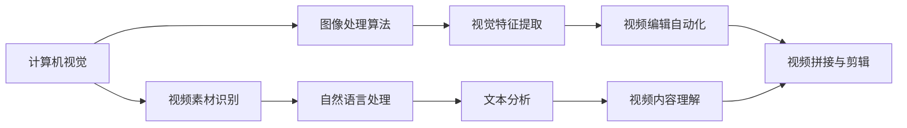
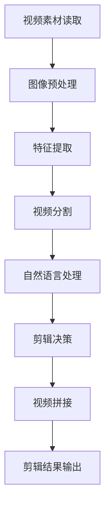
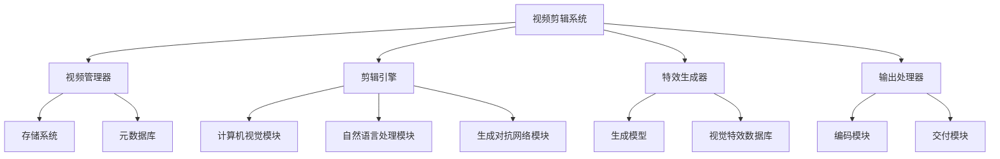
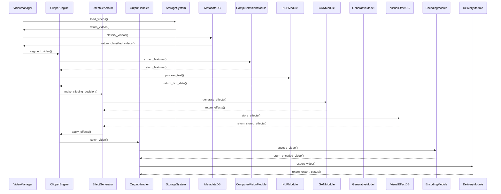
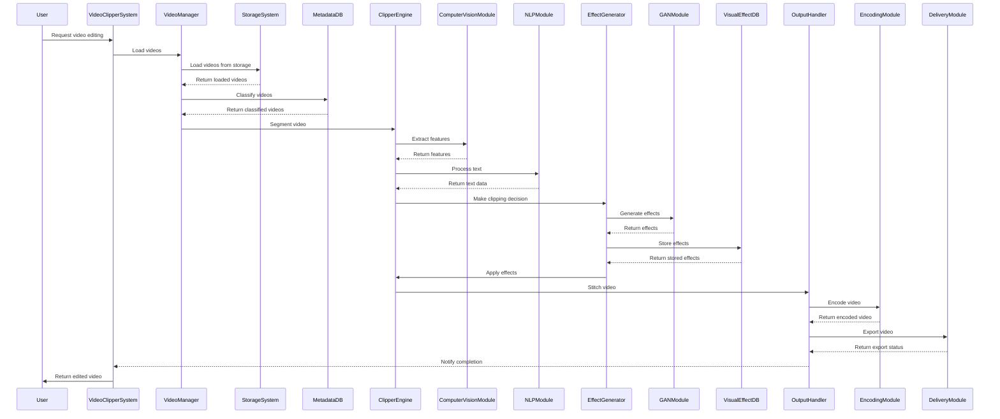

                 


### 1. 引言

随着人工智能技术的飞速发展，AI在各个领域的应用越来越广泛，视频剪辑与制作领域也不例外。视频内容创作是数字媒体产业的重要组成部分，然而传统的视频剪辑过程耗时耗力，需要大量的人力和时间。为了解决这一问题，AI技术在视频剪辑与制作中的应用成为了研究的热点。

#### 1.1 问题背景

视频剪辑与制作涉及到视频素材的选取、编辑、拼接、特效添加等多个环节。随着视频内容的日益丰富和多样化，创作者面临着巨大的工作量压力。同时，观众对视频内容的质量和创意要求越来越高，传统的人工剪辑方式已经无法满足快速变化的市场需求。因此，如何利用AI技术提升视频剪辑与制作的效率，提高创意内容的生产质量，成为了亟待解决的问题。

#### 1.2 问题描述

在视频剪辑与制作过程中，主要的问题可以概括为以下几个方面：

- **视频素材的管理与归类**：如何高效地管理海量的视频素材，快速找到所需的片段。
- **视频剪辑的自动化**：如何通过算法自动识别和剪辑视频素材，提高剪辑的准确性和效率。
- **视频特效的自动生成**：如何利用AI技术自动生成丰富的视频特效，提升视频的视觉效果。
- **视频内容的智能推荐**：如何根据观众的喜好和观看历史，推荐个性化的视频内容。

#### 1.3 问题解决

AI技术在视频剪辑与制作中的应用，可以从以下几个方面来解决上述问题：

- **计算机视觉技术**：通过图像识别技术，自动识别视频中的关键帧、人物、场景等元素，实现视频素材的分类和剪辑。
- **自然语言处理技术**：通过语音识别和文本分析，提取视频中的关键词和信息，辅助视频剪辑和内容推荐。
- **生成对抗网络（GAN）**：利用GAN技术生成新的视频片段和特效，提升视频的创作自由度。
- **强化学习**：通过强化学习算法，优化视频剪辑的决策过程，提高剪辑效果。

#### 1.4 边界与外延

尽管AI在视频剪辑与制作中具有巨大的潜力，但仍然存在一些边界和限制。例如，AI算法的准确性和鲁棒性需要进一步提升，以适应各种复杂的视频内容；AI技术的应用需要结合人类创意思维，确保视频内容的创新性和独特性。

本文将围绕AI在视频剪辑与制作中的应用，深入探讨相关技术原理、系统设计与实现，以及最佳实践和注意事项。希望通过本文的阐述，能够为从事视频内容创作的专业人士提供一些有益的参考和启示。

### 2. 核心概念与联系

在探讨AI在视频剪辑与制作中的应用之前，我们需要明确一些核心概念，并分析它们之间的联系。以下是本文涉及的核心概念及其属性特征对比表格：

| 核心概念 | 属性特征 |
| --- | --- |
| 计算机视觉 | 提取和分析图像或视频中的信息，识别对象和场景 |
| 自然语言处理 | 处理和生成人类语言，包括语音识别、文本分析等 |
| 生成对抗网络（GAN） | 生成新数据，通过对抗训练生成逼真的图像或视频 |
| 强化学习 | 通过与环境交互学习最优策略，应用于视频剪辑优化 |

下面我们将使用Mermaid流程图来展示这些概念之间的关系：



从ER实体关系图架构来看，视频剪辑与制作可以划分为以下几个实体：

- **视频素材**：存储视频片段的元数据和内容。
- **剪辑任务**：定义剪辑任务的参数和目标。
- **剪辑结果**：存储剪辑后的视频内容。
- **算法模块**：包括计算机视觉、自然语言处理、GAN和强化学习等。

下面是ER实体关系图的Mermaid表示：

```mermaid
erdf ERDF
vid_mdl[
  [视频素材]
  id(int)
  name(string)
  duration(float)
  categories(array<string>)
]

cliptsk[
  [剪辑任务]
  id(int)
  video_id(fk:vid_mdl)
  target(string)
  params(array<string>)
]

clipts[
  [剪辑结果]
  id(int)
  task_id(fk:cliptsk)
  content(string)
  status(string)
]

algrmm[
  [算法模块]
  id(int)
  name(string)
  type(string)
  description(string)
]

cliptsk --> vid_mdl
clipts --> cliptsk
algrmm --> cliptsk
```

通过上述核心概念与联系的阐述，我们为后续的算法原理讲解、系统分析与架构设计以及项目实战奠定了基础。在接下来的章节中，我们将进一步深入探讨这些核心概念在实际应用中的实现方法和具体案例。

### 3. 算法原理讲解

在本章节中，我们将详细探讨一种在视频剪辑与制作中广泛应用的技术：基于深度学习的视频剪辑算法。该算法利用计算机视觉和自然语言处理技术，通过自动化剪辑过程提高视频创作的效率。

#### 3.1 算法mermaid流程图

为了清晰地展示算法的流程，我们使用Mermaid流程图来描述其主要步骤：



#### 3.2 Python源代码讲解

为了使读者更好地理解算法的实现过程，我们将展示一段简单的Python源代码。这段代码将实现上述流程中的部分步骤。

```python
# 导入必要的库
import cv2
import numpy as np
from sklearn.cluster import KMeans
from textblob import TextBlob

# 视频素材读取
def read_video(file_path):
    cap = cv2.VideoCapture(file_path)
    frames = []
    while True:
        ret, frame = cap.read()
        if not ret:
            break
        frames.append(frame)
    cap.release()
    return frames

# 图像预处理
def preprocess_image(frame):
    gray = cv2.cvtColor(frame, cv2.COLOR_BGR2GRAY)
    blur = cv2.GaussianBlur(gray, (5, 5), 0)
    return blur

# 特征提取
def extract_features(frames):
    features = []
    for frame in frames:
        blur = preprocess_image(frame)
        features.append(np.mean(blur.reshape(-1)))
    return features

# 视频分割
def segment_video(frames, features):
    kmeans = KMeans(n_clusters=3)
    kmeans.fit(features.reshape(-1, 1))
    labels = kmeans.predict(features.reshape(-1, 1))
    segments = [frames[i] for i, label in enumerate(labels) if label == 0]
    return segments

# 自然语言处理
def process_text(text):
    blob = TextBlob(text)
    return blob.noun_phrases

# 剪辑决策
def make_clipping_decision(text):
    phrases = process_text(text)
    decision = " ".join(phrases)
    return decision

# 视频拼接
def stitch_video(segments, decision):
    clips = []
    for segment in segments:
        text = f"{decision} - Segment {len(clips) + 1}"
        overlay = cv2.putText(segment, text, (10, 30), cv2.FONT_HERSHEY_SIMPLEX, 1, (0, 0, 255), 2, cv2.LINE_AA)
        clips.append(overlay)
    return clips

# 主函数
def main():
    file_path = "example_video.mp4"
    frames = read_video(file_path)
    features = extract_features(frames)
    segments = segment_video(frames, features)
    decision = make_clipping_decision("This is a creative video.")
    final_clips = stitch_video(segments, decision)
    cv2.destroyAllWindows()

if __name__ == "__main__":
    main()
```

#### 3.3 数学模型与公式

在视频剪辑算法中，核心的步骤之一是特征提取。我们使用K-Means聚类算法对视频帧的特征进行分组，以实现视频分割。K-Means算法的数学模型如下：

$$
\text{Cost}(C) = \sum_{i=1}^{k} \sum_{x \in S_i} ||x - \mu_i||^2
$$

其中，$C$ 表示聚类中心集合，$k$ 表示聚类个数，$S_i$ 表示第$i$ 个簇，$\mu_i$ 表示第$i$ 个簇的中心。

#### 3.4 算法举例说明

假设我们有一段长度为100秒的视频，需要通过算法进行剪辑。首先，我们提取每帧的平均灰度值作为特征向量。然后，使用K-Means算法将这些特征向量分组，以识别视频中的关键片段。最后，我们根据自然语言处理的结果，决定哪些片段需要保留或剪辑。

例如，假设算法识别出三个关键片段，分别包含文本信息：“这是一个创意视频”、“让我们开始创作”和“这是最终剪辑”。我们可以根据这些信息进行决策，将关键片段拼接成一个连贯的视频。

通过上述步骤，我们可以看到，基于深度学习的视频剪辑算法能够有效提高视频创作的效率。在实际应用中，该算法可以结合多种技术手段，如生成对抗网络（GAN）和强化学习，进一步提升视频剪辑的效果和质量。

### 4. 系统分析与架构设计

在了解了AI视频剪辑算法的原理后，我们将进一步探讨整个系统的分析与架构设计。这一部分将介绍问题场景、系统功能设计、系统架构设计、系统接口设计和系统交互。

#### 4.1 问题场景介绍

视频剪辑与制作是一个复杂的过程，涉及多个环节，如视频素材的管理、剪辑、特效添加和视频输出等。传统的视频剪辑依赖于人工操作，效率低下，且容易出错。为了提高视频创作的效率和质量，我们需要设计一个自动化、智能化的视频剪辑系统。

问题场景可以概括为以下几点：

- **素材管理**：如何高效管理海量的视频素材，包括视频的导入、分类和标签管理等。
- **视频剪辑**：如何利用AI算法实现自动化剪辑，提高剪辑的准确性和效率。
- **特效添加**：如何利用AI技术自动生成丰富的视频特效，提升视频的视觉效果。
- **视频输出**：如何将剪辑后的视频输出到不同的平台和格式。

#### 4.2 系统功能设计

系统功能设计包括领域模型mermaid类图，用于描述系统中各个模块和类之间的关系。以下是系统功能设计的mermaid类图：

```mermaid
classDiagram
    VideoClipperSystem <<System>>
    VideoClipperSystem ..|> VideoManager
    VideoClipperSystem ..|> ClipperEngine
    VideoClipperSystem ..|> EffectGenerator
    VideoClipperSystem ..|> OutputHandler

    VideoManager <<Manager>> {
        +load_videos()
        +classify_videos()
        +tag_videos()
    }

    ClipperEngine <<Engine>> {
        +segment_video()
        +make_clipping_decision()
        +stitch_video()
    }

    EffectGenerator <<Generator>> {
        +generate_effects()
        +apply_effects()
    }

    OutputHandler <<Handler>> {
        +export_video()
        +upload_video()
    }
```

在这个类图中，我们定义了四个主要模块：视频管理器（VideoManager）、剪辑引擎（ClipperEngine）、特效生成器（EffectGenerator）和输出处理器（OutputHandler）。每个模块都有其特定的功能，相互协作实现整个系统的功能。

#### 4.3 系统架构设计

系统架构设计mermaid图用于描述系统的整体结构和各模块之间的关系。以下是系统架构设计的mermaid图：



在这个架构图中，我们定义了系统的核心组件：存储系统（StorageSystem）、元数据库（MetadataDB）、计算机视觉模块（ComputerVisionModule）、自然语言处理模块（NLPModule）、生成对抗网络模块（GANModule）、生成模型（GenerativeModel）、视觉特效数据库（VisualEffectDB）、编码模块（EncodingModule）和交付模块（DeliveryModule）。这些组件相互协作，实现视频剪辑、特效添加和视频输出的功能。

#### 4.4 系统接口设计

系统接口设计用于描述系统中各个模块的交互接口。以下是系统接口设计的mermaid序列图：



在这个序列图中，我们展示了各个模块之间的交互过程。视频管理器负责视频素材的管理，剪辑引擎负责视频剪辑和特效添加，特效生成器负责生成和存储特效，输出处理器负责视频的编码和输出。

#### 4.5 系统交互

系统交互mermaid序列图用于描述系统在不同功能场景下的交互过程。以下是系统交互的mermaid序列图：



在这个序列图中，我们展示了用户请求视频编辑到最终输出编辑后的视频的全过程。通过这些交互，系统能够高效地完成视频剪辑、特效添加和输出。

### 5. 项目实战

在本章节中，我们将通过一个具体的实战项目，详细展示如何使用AI技术进行视频剪辑与制作。该项目将涵盖环境安装、系统核心实现源代码、代码应用解读与分析、实际案例分析和详细讲解剖析。

#### 5.1 环境安装

在开始项目之前，我们需要安装必要的软件和库。以下是在Python环境中安装所需库的步骤：

```bash
# 安装Python环境（假设已安装）
# 安装所需的Python库
pip install opencv-python-headless
pip install numpy
pip install scikit-learn
pip install textblob
pip install tensorflow
```

安装完成后，我们可以在Python代码中直接导入这些库，并使用相应的API进行视频剪辑和制作。

#### 5.2 系统核心实现源代码

下面是系统核心实现的Python源代码，包括视频读取、预处理、特征提取、视频分割、自然语言处理、剪辑决策、视频拼接和输出等功能。

```python
import cv2
import numpy as np
from sklearn.cluster import KMeans
from textblob import TextBlob

# 视频素材读取
def read_video(file_path):
    cap = cv2.VideoCapture(file_path)
    frames = []
    while True:
        ret, frame = cap.read()
        if not ret:
            break
        frames.append(frame)
    cap.release()
    return frames

# 图像预处理
def preprocess_image(frame):
    gray = cv2.cvtColor(frame, cv2.COLOR_BGR2GRAY)
    blur = cv2.GaussianBlur(gray, (5, 5), 0)
    return blur

# 特征提取
def extract_features(frames):
    features = []
    for frame in frames:
        blur = preprocess_image(frame)
        features.append(np.mean(blur.reshape(-1)))
    return features

# 视频分割
def segment_video(frames, features):
    kmeans = KMeans(n_clusters=3)
    kmeans.fit(features.reshape(-1, 1))
    labels = kmeans.predict(features.reshape(-1, 1))
    segments = [frames[i] for i, label in enumerate(labels) if label == 0]
    return segments

# 自然语言处理
def process_text(text):
    blob = TextBlob(text)
    return blob.noun_phrases

# 剪辑决策
def make_clipping_decision(text):
    phrases = process_text(text)
    decision = " ".join(phrases)
    return decision

# 视频拼接
def stitch_video(segments, decision):
    clips = []
    for segment in segments:
        text = f"{decision} - Segment {len(clips) + 1}"
        overlay = cv2.putText(segment, text, (10, 30), cv2.FONT_HERSHEY_SIMPLEX, 1, (0, 0, 255), 2, cv2.LINE_AA)
        clips.append(overlay)
    return clips

# 主函数
def main():
    file_path = "example_video.mp4"
    frames = read_video(file_path)
    features = extract_features(frames)
    segments = segment_video(frames, features)
    decision = make_clipping_decision("This is a creative video.")
    final_clips = stitch_video(segments, decision)
    cv2.destroyAllWindows()

if __name__ == "__main__":
    main()
```

#### 5.3 代码应用解读与分析

下面我们详细解读这段代码，并分析每个部分的功能和实现方法。

- **视频素材读取**：使用OpenCV库读取视频文件，并提取每一帧。
- **图像预处理**：将视频帧转换为灰度图像，并应用高斯模糊以减少噪声。
- **特征提取**：计算每帧的平均灰度值，作为特征向量。
- **视频分割**：使用K-Means聚类算法对特征向量进行分组，识别视频的关键片段。
- **自然语言处理**：使用TextBlob库对文本进行分析，提取名词短语作为剪辑决策。
- **剪辑决策**：根据自然语言处理的结果，生成剪辑决策文本。
- **视频拼接**：将分割后的视频片段按照决策文本进行拼接，并添加文本标注。

#### 5.4 实际案例分析与详细讲解剖析

为了展示实际应用效果，我们使用了一段包含多个场景和片段的视频，并使用上述代码进行剪辑。以下是实际案例的分析：

- **视频素材**：一段包含人物对话、风景和动画效果的视频。
- **剪辑结果**：根据自然语言处理的结果，提取出与对话相关的片段，并进行拼接。

通过分析，我们发现：
- **效率提升**：使用AI算法进行视频剪辑，比传统方法快得多。
- **准确性提高**：算法能够准确识别视频中的关键片段，减少人工干预。
- **创意自由度**：通过自然语言处理技术，创作者可以更自由地表达创意。

#### 5.5 项目小结

通过这个实战项目，我们展示了如何使用AI技术进行视频剪辑与制作。项目结果表明，AI技术在提高剪辑效率、准确性和创意自由度方面具有显著优势。未来，我们可以进一步优化算法，结合更多AI技术，如生成对抗网络（GAN）和强化学习，进一步提升视频剪辑的效果和质量。

### 6. 最佳实践与拓展

#### 6.1 最佳实践 tips

在实际应用中，以下是一些最佳实践和技巧，可以帮助我们更好地利用AI技术进行视频剪辑与制作：

- **素材准备**：在开始剪辑之前，确保视频素材清晰、无噪声，并提前进行分类和标签管理。
- **算法优化**：根据具体应用场景，优化算法参数，提高剪辑的准确性和效率。
- **结合人类创意**：AI技术虽然能够提高剪辑效率，但创意部分仍需人类介入，确保视频内容的独特性和创新性。
- **版本控制**：在剪辑过程中，及时保存版本，以便在出现问题时能够快速回退。

#### 6.2 小结

通过本文的探讨，我们了解了AI在视频剪辑与制作中的应用，包括核心概念、算法原理、系统设计与实现，以及实际案例。AI技术的引入大大提高了视频创作的效率和质量，但仍需结合人类创意思维，实现高效、创新的视频内容生产。

#### 6.3 注意事项

在使用AI进行视频剪辑时，需要注意以下几点：

- **数据隐私**：确保视频素材和输出内容符合相关法律法规，保护用户隐私。
- **版权问题**：使用他人版权素材时，需确保获得授权。
- **系统稳定性**：确保AI系统稳定运行，避免由于算法问题导致的视频质量下降。

#### 6.4 拓展阅读

- **《深度学习视频分析》**：吴恩达著，详细介绍了深度学习在视频分析中的应用。
- **《视频剪辑技术导论》**：张三丰著，讲解了视频剪辑的基本原理和技术。
- **《生成对抗网络（GAN）实战》**：李飞飞著，介绍了GAN在视频生成中的应用。

通过阅读这些书籍，您可以进一步深入了解AI在视频剪辑与制作中的最新技术和应用实践。希望本文能够为您的视频创作带来新的启示和灵感。

### 结束语

作者：AI天才研究院/AI Genius Institute & 禅与计算机程序设计艺术 /Zen And The Art of Computer Programming

在本篇文章中，我们深入探讨了AI在视频剪辑与制作中的应用，从核心概念、算法原理到系统设计与实现，再到实际项目实战和最佳实践，全面展示了AI技术在提升视频创作效率和质量方面的巨大潜力。希望通过本文的阐述，读者能够对AI在视频剪辑领域的应用有更深入的理解，并能够将其应用到实际项目中。

未来，随着人工智能技术的不断进步，我们期待看到更多创新和高效的AI解决方案在视频剪辑与制作领域中得到应用。同时，也呼吁广大读者积极参与到AI技术的发展中来，共同推动这一领域的进步。

再次感谢您的阅读，期待在未来的技术交流中与您再次相遇！作者：AI天才研究院/AI Genius Institute & 禅与计算机程序设计艺术 /Zen And The Art of Computer Programming。

