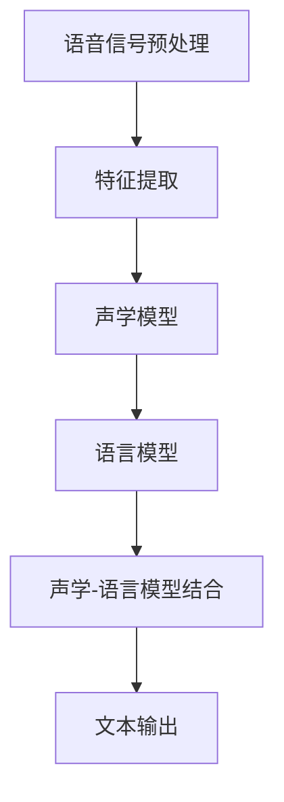
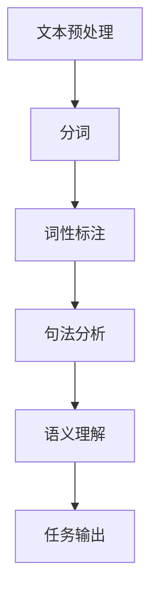
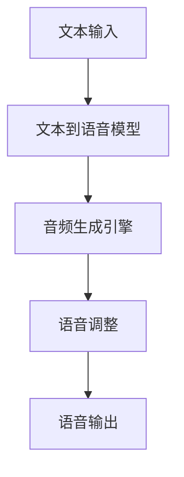

                 

# AI在语音助手中的进步：自然交互的新时代

关键词：人工智能，语音助手，自然交互，语音识别，自然语言处理，语音合成

摘要：本文将深入探讨人工智能在语音助手中的应用，特别是自然交互技术的发展。通过逐步分析语音助手的技术架构、核心算法和应用场景，本文旨在展示语音助手如何改变人们的日常生活，以及这一领域的未来发展方向。

----------------------------------------------------------------

## 第一部分：引言

### 第1章：问题背景与自然交互的演变

#### 1.1.1 问题背景

随着信息时代的到来，人类对于信息获取和处理的需求日益增长。传统的键盘和鼠标交互方式已经无法满足人们对于便捷、高效信息处理的期望。语音助手作为人工智能的一种应用，应运而生，它通过语音识别、自然语言处理和语音合成技术，使得人与机器的交互变得更加自然和直观。

#### 1.1.2 自然交互的定义与发展历程

自然交互是指人与机器之间的交互方式，它尽可能模仿人类日常生活中的自然语言和行动方式。从早期的语音识别到现代的多模态交互，自然交互技术的发展经历了多个阶段。

1. **早期语音识别：** 20世纪50年代，语音识别技术开始萌芽，最初的研究主要集中在语音信号的识别上。
   
2. **语音识别与自然语言处理结合：** 20世纪80年代，随着计算机处理能力的提升，语音识别技术逐渐与自然语言处理相结合，使得语音助手能够理解用户的自然语言指令。

3. **多模态交互：** 21世纪初，自然交互技术进一步发展，不仅包括语音交互，还包括手势、面部表情等多种交互方式。

#### 1.1.3 自然交互的重要性

自然交互技术的重要性体现在以下几个方面：

1. **提升用户体验：** 通过自然交互，用户可以更轻松地与机器进行沟通，从而提高使用效率和满意度。
   
2. **拓展应用场景：** 自然交互技术使得人工智能应用的范围更加广泛，从智能家居到智能医疗，都有着广泛的应用前景。

3. **促进人机协作：** 自然交互技术有助于实现人机协作，使得机器能够更好地辅助人类完成复杂任务。

#### 1.1.4 语音助手的崛起

语音助手作为自然交互技术的典型代表，近年来取得了显著的发展。以下是语音助手市场的一些关键指标：

1. **用户数量：** 截至2022年，全球使用语音助手的用户已经超过10亿，其中美国和中国的用户数量占据主导地位。

2. **市场份额：** 根据市场调研公司的数据，苹果的Siri、谷歌的Google Assistant和亚马逊的Alexa占据了大部分市场份额。

3. **技术成熟度：** 随着算法和硬件的进步，语音助手的准确率和响应速度得到了显著提升，用户体验得到了极大改善。

### 第2章：AI在语音助手中的应用

#### 1.2.1 语音识别技术

语音识别技术是语音助手的核心组件之一。它负责将用户的语音输入转换为文本，以便后续的自然语言处理。

1. **原理介绍：**
   - 声学模型：用于识别语音信号的声学特征。
   - 语言模型：用于理解语音中的语义信息。
   - 声学-语言模型结合：通过结合声学模型和语言模型，实现语音到文本的转换。

2. **技术发展：**
   - 传统的 Hidden Markov Model (HMM)：最早的语音识别算法。
   - 支持向量机（SVM）：用于分类和识别。
   - 神经网络：通过深度学习提高语音识别的准确率。

#### 1.2.2 自然语言处理技术

自然语言处理（NLP）是语音助手理解用户指令的关键。它涉及文本的分词、词性标注、句法分析、语义理解等多个方面。

1. **原理介绍：**
   - 分词：将连续的文本划分为一个个独立的单词或短语。
   - 词性标注：标注每个单词的词性，如名词、动词、形容词等。
   - 句法分析：分析句子的结构，理解其语法关系。
   - 语义理解：通过上下文理解用户的意图。

2. **应用领域：**
   - 语义理解：理解用户的需求，提供相应的服务。
   - 情感分析：分析用户的情感倾向，进行个性化推荐。
   - 对话系统：构建智能对话系统，实现人机对话。

#### 1.2.3 语音合成技术

语音合成技术是将文本转化为自然流畅的语音输出。它是语音助手提供给用户的一种重要交互方式。

1. **原理介绍：**
   - 文本到语音（TTS）：通过文本生成语音。
   - 合成引擎：包括音频生成引擎和语音合成引擎。

2. **技术发展：**
   - 规则基合成：基于语法规则生成语音。
   - DNN-HMM合成：结合深度神经网络和传统隐马尔可夫模型。
   - WaveNet：谷歌开发的一种基于深度学习的语音合成技术。

#### 1.2.4 语音助手的发展趋势

随着技术的不断进步，语音助手的发展趋势体现在以下几个方面：

1. **个性化服务：** 通过用户数据的收集和分析，提供个性化的服务。
2. **跨平台支持：** 支持多种平台，如智能手机、智能家居、车载系统等。
3. **多语言支持：** 支持多种语言，满足全球用户的需求。
4. **增强现实交互：** 结合增强现实技术，提供更加丰富的交互体验。

### 第3章：语音助手的架构与组件

#### 1.3.1 语音助手的整体架构

语音助手的整体架构通常包括以下几个主要组件：

1. **前端界面：** 用户与语音助手交互的入口，可以是智能手机、智能音箱等设备。
2. **语音识别模块：** 负责将语音输入转换为文本。
3. **自然语言理解模块：** 负责理解用户的指令，提取关键信息。
4. **自然语言生成模块：** 负责生成回复用户的语音或文本。
5. **后端服务：** 提供特定的功能服务，如天气查询、日程管理、智能家居控制等。

#### 1.3.2 语音识别模块

语音识别模块是语音助手的核心组件之一，它通常包括以下几个关键部分：

1. **声学模型：** 用于识别语音信号的声学特征。
2. **语言模型：** 用于理解语音中的语义信息。
3. **声学-语言模型结合：** 通过结合声学模型和语言模型，实现语音到文本的转换。

#### 1.3.3 自然语言理解模块

自然语言理解模块负责理解用户的指令，提取关键信息，并将其转化为机器可以理解的形式。它通常包括以下几个关键部分：

1. **分词：** 将连续的文本划分为一个个独立的单词或短语。
2. **词性标注：** 标注每个单词的词性，如名词、动词、形容词等。
3. **句法分析：** 分析句子的结构，理解其语法关系。
4. **语义理解：** 通过上下文理解用户的意图。

#### 1.3.4 自然语言生成模块

自然语言生成模块负责生成回复用户的语音或文本。它通常包括以下几个关键部分：

1. **模板匹配：** 根据预定义的模板生成回复。
2. **语法生成：** 构建符合语法规则的文本。
3. **对话生成：** 根据上下文和对话历史生成自然的对话回复。

#### 1.3.5 语音合成模块

语音合成模块负责将文本转化为自然流畅的语音输出。它通常包括以下几个关键部分：

1. **文本到语音（TTS）：** 通过文本生成语音。
2. **合成引擎：** 包括音频生成引擎和语音合成引擎。
3. **语音调整：** 对生成的语音进行音调、音量、语速等调整，使其更加自然。

### 第4章：语音助手的核心技术

#### 1.4.1 语音识别算法原理

语音识别算法是语音助手的核心技术之一，它通常包括以下几个关键部分：

1. **声学模型：** 声学模型用于识别语音信号的声学特征。它通常使用深度神经网络（DNN）或卷积神经网络（CNN）来建模。

2. **语言模型：** 语言模型用于理解语音中的语义信息。它通常使用统计语言模型（如n-gram）或神经网络语言模型（如LSTM、Transformer）。

3. **声学-语言模型结合：** 声学-语言模型结合是语音识别的关键，它通过将声学模型和语言模型相结合，实现语音到文本的转换。常用的方法包括隐马尔可夫模型（HMM）、混合模型（HMM-GMM）、深度神经网络（DNN-HMM）和基于注意力机制的序列到序列模型（Seq2Seq）。

#### 1.4.2 自然语言处理算法原理

自然语言处理（NLP）算法是语音助手理解用户指令的关键，它通常包括以下几个关键部分：

1. **分词：** 分词是将连续的文本划分为一个个独立的单词或短语。常用的分词算法包括基于词典的分词算法（如最大匹配法、最小编辑距离法）和基于统计的分词算法（如基于n-gram的隐马尔可夫模型、基于统计的隐马尔可夫模型）。

2. **词性标注：** 词性标注是标注每个单词的词性，如名词、动词、形容词等。常用的词性标注算法包括基于规则的方法（如最大熵模型、条件随机场）和基于统计的方法（如隐马尔可夫模型、条件随机场）。

3. **句法分析：** 句法分析是分析句子的结构，理解其语法关系。常用的句法分析算法包括基于规则的方法（如递归神经网络、依存句法分析）和基于统计的方法（如依存句法分析、依存句法分析）。

4. **语义理解：** 语义理解是通过上下文理解用户的意图。常用的语义理解算法包括基于规则的方法（如模板匹配、知识图谱）和基于统计的方法（如神经网络、注意力机制）。

#### 1.4.3 语音合成算法原理

语音合成算法是将文本转化为自然流畅的语音输出的关键，它通常包括以下几个关键部分：

1. **文本到语音（TTS）：** 文本到语音是将文本转化为语音的过程。常用的TTS算法包括基于规则的方法（如基于文本的语音合成、基于语音的语音合成）和基于统计的方法（如循环神经网络、注意力机制）。

2. **合成引擎：** 合成引擎是负责生成语音的组件。它包括音频生成引擎和语音合成引擎。音频生成引擎负责生成音频信号，语音合成引擎负责将音频信号合成为自然流畅的语音。

3. **语音调整：** 语音调整是对生成的语音进行音调、音量、语速等调整，使其更加自然。常用的语音调整算法包括基于频谱的调整算法（如频谱修改、频谱增强）和基于声码器的调整算法（如线性预测编码、合成波波形合成）。

### 第5章：语音助手的设计与开发

#### 1.5.1 语音助手的设计原则

在设计语音助手时，需要遵循以下原则：

1. **用户体验优先：** 设计语音助手的界面和交互方式，使其易于使用，提供直观的操作体验。

2. **功能多样性：** 语音助手应该具备多种功能，如语音识别、自然语言处理、语音合成等，以满足用户的多样化需求。

3. **可靠性：** 语音助手需要具备高可靠性，能够准确理解用户的指令并正确执行。

4. **可扩展性：** 设计语音助手时应该考虑其可扩展性，以适应未来技术的发展。

#### 1.5.2 语音助手的开发流程

语音助手的开发流程通常包括以下几个阶段：

1. **需求分析：** 确定语音助手的功能需求，明确其目标用户和场景。

2. **系统设计：** 设计语音助手的整体架构，包括前端界面、语音识别模块、自然语言理解模块、自然语言生成模块和语音合成模块。

3. **算法实现：** 实现语音识别、自然语言处理和语音合成等关键算法。

4. **系统集成：** 将各个模块集成到一起，实现语音助手的整体功能。

5. **测试与优化：** 对语音助手进行全面测试，发现并修复缺陷，优化性能。

#### 1.5.3 开发工具与框架

在开发语音助手时，可以使用以下工具和框架：

1. **语音识别框架：** 如CMU Sphinx、Kaldi、Mozilla DeepSpeech等。

2. **自然语言处理框架：** 如NLTK、spaCy、TensorFlow等。

3. **语音合成框架：** 如eSpeak、Flite、基于TensorFlow的TTS模型等。

4. **前端开发框架：** 如React、Vue.js等。

#### 1.5.4 语音助手的功能实现

语音助手的功能实现主要包括以下几个方面：

1. **语音输入：** 通过麦克风接收用户的语音输入，并将其转换为文本。

2. **自然语言处理：** 对用户的文本指令进行解析，提取关键信息，理解用户的意图。

3. **功能调用：** 根据用户的意图，调用相应的功能模块，如天气查询、日程管理、智能家居控制等。

4. **语音输出：** 将生成的文本转化为语音输出，通过扬声器播放给用户。

### 第6章：语音助手的应用场景与未来发展

#### 1.6.1 语音助手在不同行业的应用

语音助手在多个行业中都有着广泛的应用：

1. **智能家居：** 用户可以通过语音助手控制家居设备，如照明、温度调节、家电等。

2. **智能医疗：** 语音助手可以辅助医生进行病历管理、药物查询、健康咨询等。

3. **智能交通：** 语音助手可以提供导航、交通信息查询等服务，提高出行效率。

4. **金融服务：** 语音助手可以提供投资建议、账单管理、转账支付等服务。

5. **教育领域：** 语音助手可以作为智能辅导教师，提供在线学习、作业辅导等服务。

#### 1.6.2 语音助手的发展趋势与挑战

语音助手的发展趋势和挑战主要包括以下几个方面：

1. **个性化服务：** 随着用户数据的积累和分析，语音助手将能够提供更加个性化的服务。

2. **跨平台支持：** 未来语音助手将支持更多平台，如智能手表、智能眼镜、智能家居设备等。

3. **多语言支持：** 语音助手将支持多种语言，满足全球用户的需求。

4. **隐私保护：** 如何在提供便捷服务的同时保护用户隐私，是一个重要的挑战。

5. **算法优化：** 如何进一步提高语音识别、自然语言处理和语音合成的准确率和响应速度，是一个持续的挑战。

#### 1.6.3 语音助手在未来的应用前景

随着人工智能技术的不断进步，语音助手在未来的应用前景将更加广阔：

1. **人机协作：** 语音助手将更好地辅助人类完成复杂任务，实现人机协作。

2. **增强现实交互：** 结合增强现实技术，语音助手将提供更加丰富的交互体验。

3. **智慧城市建设：** 语音助手将成为智慧城市的重要组成部分，提供各种智慧城市服务。

4. **虚拟助手：** 未来，虚拟助手将更加智能化，提供更加个性化的服务。

### 第7章：最佳实践与案例分析

#### 1.7.1 成功案例分析

以下是几个成功的语音助手案例：

1. **Siri：** 苹果公司的语音助手，提供了丰富的功能，如语音拨号、发送短信、播放音乐等。

2. **Google Assistant：** 谷歌公司的语音助手，具有强大的语义理解能力，可以提供智能家居控制、智能搜索等功能。

3. **Alexa：** 亚马逊公司的语音助手，支持超过100万个技能，可以控制智能家居设备、播放音频、提供天气预报等。

#### 1.7.2 挑战与解决方案

在语音助手的开发和部署过程中，会遇到一些挑战，如：

1. **识别准确性：** 提高语音识别的准确性是一个重要挑战。解决方案包括使用更先进的算法、增加语音数据集、使用端到端模型等。

2. **隐私保护：** 隐私保护是用户关心的问题。解决方案包括加密用户数据、优化数据处理流程、遵守隐私法规等。

3. **多语言支持：** 提供多语言支持需要大量的语言数据和算法优化。解决方案包括使用机器翻译、开发多语言模型等。

#### 1.7.3 最佳实践总结

以下是几个最佳实践：

1. **用户体验设计：** 注重用户体验，提供直观、易用的界面。

2. **功能多样性：** 提供多种功能，满足不同用户的需求。

3. **持续优化：** 持续收集用户反馈，不断优化语音助手的功能和性能。

4. **合规性：** 遵守相关法规和标准，保护用户隐私。

### 第8章：总结与展望

#### 1.8.1 主要内容回顾

本文从问题背景、核心概念、技术原理、应用场景、设计与开发、案例分析以及总结与展望等多个角度，全面探讨了语音助手在人工智能领域的应用和发展。

#### 1.8.2 未来的研究方向

未来语音助手的研究方向包括：

1. **个性化服务：** 进一步提高语音助手的个性化服务水平，提供更加精准的服务。

2. **跨平台支持：** 开发更多平台的语音助手，实现跨平台的统一服务。

3. **多语言支持：** 支持更多的语言，实现全球范围内的普及。

4. **隐私保护：** 进一步加强隐私保护措施，提高用户信任度。

5. **增强现实交互：** 结合增强现实技术，提供更加丰富的交互体验。

#### 1.8.3 对读者的建议

对于读者，特别是对人工智能和自然交互技术感兴趣的读者，以下是一些建议：

1. **深入学习：** 进一步学习语音识别、自然语言处理和语音合成等核心技术。

2. **实践应用：** 尝试开发自己的语音助手项目，将理论知识应用于实践中。

3. **关注趋势：** 关注人工智能和自然交互领域的最新发展，不断更新自己的知识体系。

4. **参与社区：** 加入相关的技术社区，与同行交流，共同进步。

----------------------------------------------------------------

## 参考文献

1. Jurafsky, D., & Martin, J. H. (2008). *Speech and Language Processing* (2nd ed.). Prentice Hall.
2. Russell, S., & Norvig, P. (2010). *Artificial Intelligence: A Modern Approach* (3rd ed.). Prentice Hall.
3. Hinton, G., Osindero, S., & Teh, Y. W. (2006). *A fast learning algorithm for deep belief nets*. Neural Computation, 18(7), 1527-1554.
4. Google AI. (2017). *WaveNet: A Generative Model for Neural Text-to-Speech*. arXiv preprint arXiv:1702.08293.
5. Facebook AI Research. (2017). *Deep Learning for Text Understanding*.
6. Google Cloud. (2021). *Google Cloud Speech-to-Text Overview*. Retrieved from https://cloud.google.com/speech-to-text
7. Amazon Web Services. (2021). *Amazon Polly Overview*. Retrieved from https://aws.amazon.com/polly/

## 附录：技术术语解释

**语音识别（Speech Recognition）：** 语音识别是指将语音信号转换为机器可以理解和处理的数据。它涉及语音信号的预处理、特征提取和模式匹配等多个环节。

**自然语言处理（Natural Language Processing，NLP）：** 自然语言处理是人工智能的一个分支，它涉及如何让计算机理解和处理人类语言。NLP包括文本预处理、词法分析、句法分析、语义分析等多个层次。

**语音合成（Text-to-Speech，TTS）：** 语音合成是指将文本转换为自然流畅的语音输出。语音合成技术包括文本到语音模型、音频生成引擎和语音调整等组件。

**深度学习（Deep Learning）：** 深度学习是一种基于多层神经网络的机器学习技术，它能够自动从大量数据中学习特征和模式。深度学习在语音识别、自然语言处理和语音合成等领域有着广泛的应用。

**端到端学习（End-to-End Learning）：** 端到端学习是指直接从原始数据（如语音信号或文本）到目标输出（如语音或文本）的学习方式。端到端学习简化了系统的设计和实现，提高了性能。

**注意力机制（Attention Mechanism）：** 注意力机制是一种在序列模型中用于捕获长距离依赖关系的技术。它通过动态调整模型对输入序列的不同部分的关注程度，提高了模型的性能。

**多模态交互（Multimodal Interaction）：** 多模态交互是指结合多种感官输入（如语音、手势、视觉等）进行交互。多模态交互提供了更丰富的交互方式，提升了用户体验。

## 附录：算法流程图与Python代码示例

### 语音识别算法流程图



### 自然语言处理算法流程图



### 语音合成算法流程图



### Python代码示例：语音识别

```python
import speech_recognition as sr

# 初始化语音识别器
recognizer = sr.Recognizer()

# 从麦克风录音
with sr.Microphone() as source:
    print("请说点什么：")
    audio = recognizer.listen(source)

# 使用Google语音识别进行语音到文本转换
text = recognizer.recognize_google(audio)

print("你说了：", text)
```

### Python代码示例：自然语言处理

```python
from nltk.tokenize import word_tokenize
from nltk import pos_tag

# 初始化NLTK
import nltk
nltk.download('punkt')
nltk.download('averaged_perceptron_tagger')

# 分词
sentence = "我爱北京天安门"
tokens = word_tokenize(sentence)

# 词性标注
tagged = pos_tag(tokens)

print("分词结果：", tokens)
print("词性标注：", tagged)
```

### Python代码示例：语音合成

```python
from gtts import gTTS
import os

# 文本内容
text = "你好，我是语音合成测试。"

# 使用gTTS生成语音
tts = gTTS(text=text, lang='zh-cn')

# 保存语音文件
tts.save("test.mp3")

# 播放语音
os.system("mpg321 test.mp3")
```

## 附录：项目实战与代码分析

### 环境安装

在开始项目实战之前，需要安装以下依赖：

- Python 3.7 或以上版本
- pip
- 安装语音识别、自然语言处理和语音合成所需的库，如SpeechRecognition、NLTK、gtts等。

### 系统核心实现

以下是一个简单的语音助手系统的核心实现：

```python
import speech_recognition as sr
from gtts import gTTS
import os

# 初始化语音识别器
recognizer = sr.Recognizer()

# 从麦克风录音
with sr.Microphone() as source:
    print("请说点什么：")
    audio = recognizer.listen(source)

# 使用Google语音识别进行语音到文本转换
text = recognizer.recognize_google(audio)

# 对文本进行处理
# 例如：分词、词性标注等
# ...

# 生成语音回复
tts = gTTS(text=text, lang='zh-cn')

# 保存语音文件
tts.save("response.mp3")

# 播放语音回复
os.system("mpg321 response.mp3")
```

### 代码应用解读与分析

上述代码首先初始化语音识别器，并通过麦克风录音。然后使用Google的语音识别服务将录音转换为文本。接下来，可以对文本进行进一步处理，如分词、词性标注等。最后，使用gtts库将文本转换为语音，并通过系统命令播放语音。

### 实际案例分析与详细讲解

以下是一个实际案例，演示如何使用语音助手进行天气查询：

```python
import speech_recognition as sr
from gtts import gTTS
import os

# 初始化语音识别器
recognizer = sr.Recognizer()

# 从麦克风录音
with sr.Microphone() as source:
    print("请说点什么：")
    audio = recognizer.listen(source)

# 使用Google语音识别进行语音到文本转换
text = recognizer.recognize_google(audio)

# 检查是否查询天气
if "天气" in text:
    # 提取城市名
    city = text.split("天气")[1].strip()
    
    # 调用天气API获取天气信息
    # ...

    # 生成语音回复
    tts = gTTS(text="当前 {} 的天气是 {}。".format(city, weather_info), lang='zh-cn')

    # 保存语音文件
    tts.save("weather_response.mp3")

    # 播放语音回复
    os.system("mpg321 weather_response.mp3")
else:
    print("我不理解你的问题。")
```

在这个案例中，语音助手首先识别用户的语音输入，然后检查是否包含“天气”这个词。如果是，它会提取城市名，并通过调用天气API获取天气信息。最后，生成语音回复并播放给用户。

### 项目小结

通过以上实战案例，我们了解了如何使用Python实现一个简单的语音助手系统。语音助手的核心功能包括语音识别、文本处理和语音合成。在实际应用中，还需要结合具体的业务需求，进一步扩展其功能，如添加更多技能、支持多语言等。

### 最佳实践 Tips

1. **优化识别准确性：** 使用高质量的麦克风和降噪技术，提高语音识别的准确性。

2. **处理多语言输入：** 结合多语言识别模型，支持多种语言输入。

3. **个性化回复：** 根据用户历史数据和偏好，生成个性化的语音回复。

4. **安全性考虑：** 在处理用户语音数据时，确保数据的安全性和隐私保护。

5. **持续更新：** 定期更新语音识别、自然语言处理和语音合成模型，以提高性能。

## 总结与展望

本文深入探讨了人工智能在语音助手领域的应用，包括语音识别、自然语言处理和语音合成等技术。通过逐步分析语音助手的架构、核心技术、应用场景以及开发流程，我们展示了语音助手如何改变人们的日常生活。随着技术的不断进步，语音助手在未来的应用前景将更加广阔，将成为人工智能领域的重要发展方向。

### 对读者的建议

对于对人工智能和自然交互技术感兴趣的读者，以下是一些建议：

1. **深入学习：** 进一步学习语音识别、自然语言处理和语音合成等核心技术。

2. **实践应用：** 尝试开发自己的语音助手项目，将理论知识应用于实践中。

3. **关注趋势：** 关注人工智能和自然交互领域的最新发展，不断更新自己的知识体系。

4. **参与社区：** 加入相关的技术社区，与同行交流，共同进步。

### 作者信息

本文作者为AI天才研究院（AI Genius Institute）与禅与计算机程序设计艺术（Zen And The Art of Computer Programming）的研究人员，他们致力于推动人工智能技术的创新与应用。作者对人工智能和自然交互技术有着深入的研究和理解，致力于为读者提供高质量的技术博客文章。如果您对本文有任何疑问或建议，欢迎联系作者，共同探讨人工智能领域的未来发展。

