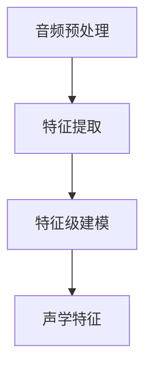
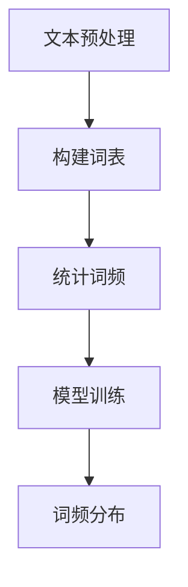
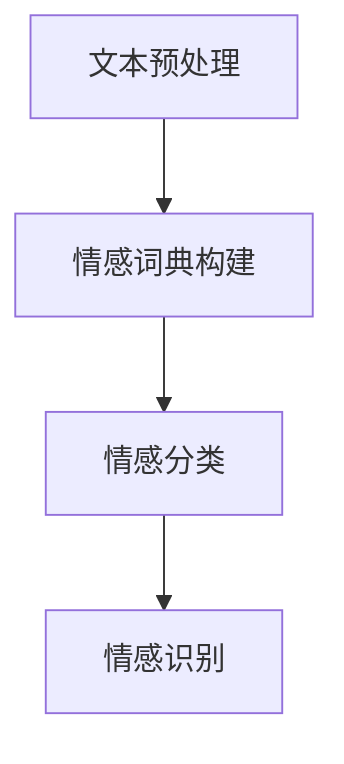
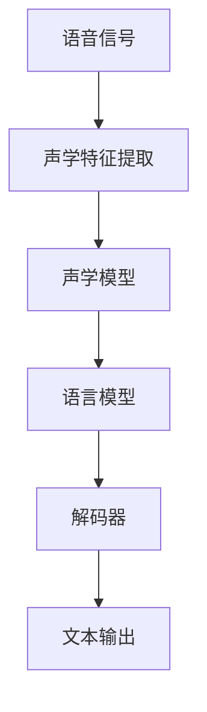
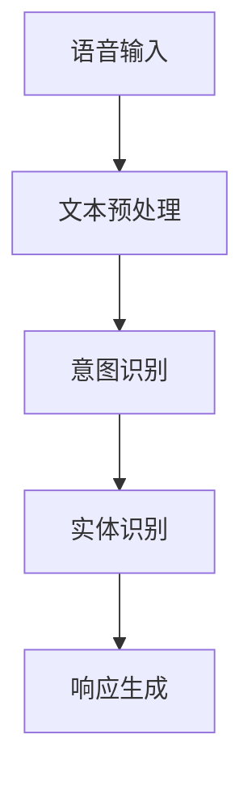
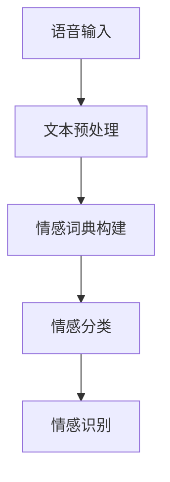
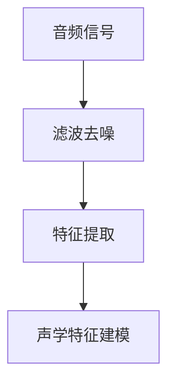
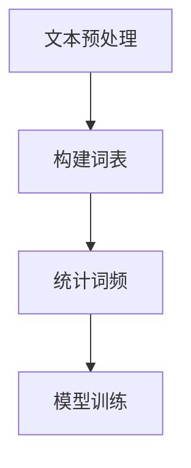
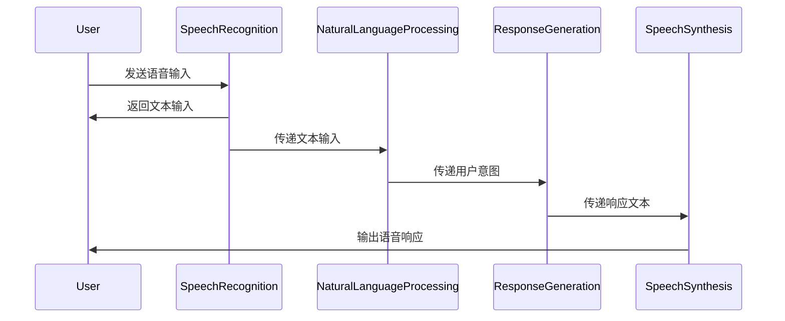

                 

# AI在语音助手中的进步:自然交互的新时代

关键词：人工智能、语音助手、自然交互、算法原理、系统架构、项目实战

摘要：
本文深入探讨了人工智能在语音助手领域的进步，特别是在实现自然交互方面。通过逐步分析语音助手的核心技术，如语音识别、自然语言处理和情感分析，本文揭示了自然交互的新时代。此外，文章详细介绍了语音助手的系统架构设计，并通过项目实战展示了如何构建一个高效的语音助手系统。最后，本文提供了最佳实践、注意事项和拓展阅读，为读者进一步学习和应用语音助手技术提供了指导。

## 引言

随着人工智能（AI）技术的快速发展，语音助手已成为现代智能设备的标配。从最初的简单命令响应到如今的自然交互，语音助手技术经历了翻天覆地的变化。本文将探讨AI在语音助手领域的进步，特别是自然交互的实现。通过逐步分析语音助手的核心技术，本文旨在揭示自然交互的新时代，为读者提供一个全面的技术解读。

## 背景介绍

### AI发展历程

人工智能（AI）是一门旨在使计算机模拟人类智能行为的学科。自1956年达特茅斯会议以来，AI经历了数个发展阶段。早期的研究主要集中在符号主义和知识表示上，如专家系统和推理机。然而，这些方法在处理复杂任务时显得力不从心。

随着计算机性能的提升和大数据的兴起，机器学习和深度学习成为了AI研究的主流。这些方法通过从大量数据中学习模式和规律，实现了在图像识别、语音识别、自然语言处理等领域的突破。语音助手正是这一进步的产物。

### 语音助手的历史与现状

语音助手的历史可以追溯到20世纪80年代，如苹果的Siri和亚马逊的Alexa。然而，早期的语音助手功能有限，只能完成简单的命令响应。随着AI技术的进步，语音助手逐渐变得智能，能够理解复杂的指令并执行多种任务。

如今，语音助手已成为智能家居、智能手机和汽车等设备的重要组成部分。它们不仅可以回答问题、播放音乐，还可以控制家电、设置提醒等。随着AI技术的不断进步，语音助手的智能程度也在不断提高。

### 自然交互的概念

自然交互是指用户与计算机之间通过自然语言或其他方式进行的交互。与传统的命令行交互和图形用户界面（GUI）相比，自然交互更加直观和易用。

自然交互的优点在于：

- **用户体验友好**：用户可以使用日常语言与计算机交流，无需学习特定命令。
- **灵活性高**：用户可以自由表达自己的想法，而不受固定命令的限制。
- **情境感知**：自然交互系统可以根据上下文理解用户意图，提供更准确的响应。

然而，自然交互也存在一些挑战，如语义理解、多模态处理和实时响应等。

## 核心概念与联系

### 语音识别与自然语言处理

#### 语音识别原理

语音识别（ASR）是将语音信号转换为文本的过程。它包括以下几个关键步骤：

1. **声学模型**：将音频信号转换为频谱特征。
2. **声学特征提取**：从频谱特征中提取声学特征，如梅尔频率倒谱系数（MFCC）。
3. **语言模型**：根据声学特征和上下文信息生成候选词序列。
4. **解码器**：将候选词序列解码为最终的文本输出。

#### 自然语言处理基础

自然语言处理（NLP）是使计算机能够理解、生成和处理人类语言的技术。NLP包括以下几个核心概念：

1. **语言模型**：用于预测下一个词的概率分布。
2. **句法分析**：分析句子的结构，确定词的语法关系。
3. **语义分析**：理解句子的含义，包括词义消歧、情感分析等。

#### 语音助手的工作原理

语音助手的工作原理可以分为以下几个步骤：

1. **语音输入处理**：将用户语音转换为文本。
2. **自然语言理解**：分析文本，提取用户意图。
3. **响应生成**：根据用户意图生成适当的响应。
4. **语音合成**：将文本转换为语音输出。

## 算法原理讲解

### 常见语音助手算法

#### 声学模型

声学模型是语音识别的核心组件，负责将语音信号转换为声学特征。以下是声学模型的工作流程：

1. **音频预处理**：对音频信号进行滤波、去噪等处理。
2. **特征提取**：使用梅尔频率倒谱系数（MFCC）等特征提取方法，从音频信号中提取声学特征。
3. **特征级建模**：使用神经网络、高斯混合模型（GMM）等方法，对声学特征进行建模。

以下是声学模型的工作流程mermaid流程图：



#### 语言模型

语言模型用于预测下一个词的概率分布，是自然语言处理的核心组件。以下是语言模型的工作流程：

1. **文本预处理**：对文本进行分词、词性标注等预处理。
2. **构建词表**：将文本转换为词表，为每个词分配索引。
3. **统计词频**：统计词的频率，用于训练语言模型。
4. **模型训练**：使用神经网络、隐马尔可夫模型（HMM）等方法，训练语言模型。

以下是语言模型的工作流程mermaid流程图：



#### 情感分析算法

情感分析是语音助手的一个重要功能，用于识别用户的情感状态。以下是情感分析算法的工作流程：

1. **文本预处理**：对文本进行分词、词性标注等预处理。
2. **情感词典构建**：构建情感词典，用于标记文本中的情感词汇。
3. **情感分类**：使用机器学习、深度学习等方法，对文本进行情感分类。
4. **情感识别**：根据分类结果，识别用户的情感状态。

以下是情感分析算法的工作流程mermaid流程图：



### 算法原理讲解

#### 语音识别算法

语音识别（ASR）是语音助手的核心技术之一，负责将用户的语音输入转换为文本。以下是语音识别算法的原理：

1. **声学特征提取**：将语音信号转换为声学特征，如梅尔频率倒谱系数（MFCC）。
2. **声学模型**：使用神经网络、高斯混合模型（GMM）等方法，对声学特征进行建模。
3. **语言模型**：使用神经网络、隐马尔可夫模型（HMM）等方法，对文本进行建模。
4. **解码器**：使用动态规划算法，将声学特征和语言模型解码为最终的文本输出。

以下是语音识别算法的工作流程mermaid流程图：



#### 自然语言处理算法

自然语言处理（NLP）是语音助手的核心技术之一，负责理解用户的语音输入并生成适当的响应。以下是自然语言处理算法的原理：

1. **文本预处理**：对语音输入进行分词、词性标注等预处理。
2. **意图识别**：使用机器学习、深度学习等方法，识别用户的意图。
3. **实体识别**：从文本中提取关键信息，如人名、地名、时间等。
4. **响应生成**：根据用户意图和实体信息，生成适当的响应。

以下是自然语言处理算法的工作流程mermaid流程图：



#### 情感分析算法

情感分析是语音助手的一个重要功能，用于识别用户的情感状态。以下是情感分析算法的原理：

1. **文本预处理**：对语音输入进行分词、词性标注等预处理。
2. **情感词典构建**：构建情感词典，用于标记文本中的情感词汇。
3. **情感分类**：使用机器学习、深度学习等方法，对文本进行情感分类。
4. **情感识别**：根据分类结果，识别用户的情感状态。

以下是情感分析算法的工作流程mermaid流程图：



### 算法原理讲解

#### 声学模型

声学模型是语音识别系统中的核心组件，用于将语音信号转换为声学特征。以下是声学模型的原理：

1. **音频预处理**：对语音信号进行滤波、去噪等处理，提高语音质量。
2. **特征提取**：从音频信号中提取声学特征，如梅尔频率倒谱系数（MFCC）。
3. **特征级建模**：使用神经网络、高斯混合模型（GMM）等方法，对声学特征进行建模。

以下是声学模型的mermaid流程图：



#### 语言模型

语言模型是自然语言处理系统中的核心组件，用于预测下一个词的概率分布。以下是语言模型的原理：

1. **文本预处理**：对文本进行分词、词性标注等预处理。
2. **构建词表**：将文本转换为词表，为每个词分配索引。
3. **统计词频**：统计词的频率，用于训练语言模型。
4. **模型训练**：使用神经网络、隐马尔可夫模型（HMM）等方法，训练语言模型。

以下是语言模型的mermaid流程图：



#### 情感分析算法

情感分析是语音助手的一个重要功能，用于识别用户的情感状态。以下是情感分析算法的原理：

1. **文本预处理**：对语音输入进行分词、词性标注等预处理。
2. **情感词典构建**：构建情感词典，用于标记文本中的情感词汇。
3. **情感分类**：使用机器学习、深度学习等方法，对文本进行情感分类。
4. **情感识别**：根据分类结果，识别用户的情感状态。

以下是情感分析算法的mermaid流程图：


### 数学模型和数学公式讲解

在语音助手系统中，数学模型和数学公式扮演着至关重要的角色。这些模型和公式不仅帮助我们理解语音助手的运作原理，还提供了量化分析工具，以优化系统性能。以下是语音助手系统中的几个关键数学模型和公式的详细讲解。

#### 语言模型中的数学模型

语言模型的核心任务是预测下一个词的概率分布。这通常通过以下数学公式实现：

$$
P(w_n | w_{n-1}, w_{n-2}, ..., w_1) = \prod_{i=1}^{n} P(w_i | w_{i-1}, w_{i-2}, ..., w_1)
$$

其中，$w_i$ 表示第 $i$ 个词，$P(w_i | w_{i-1}, w_{i-2}, ..., w_1)$ 表示在给定前 $i-1$ 个词的情况下，第 $i$ 个词的概率。

一个常见的语言模型是n-gram模型，它基于以下数学公式：

$$
P(w_n | w_{n-1}, w_{n-2}, ..., w_1) = \frac{C(w_{n-1}, w_n)}{C(w_{n-1})}
$$

其中，$C(w_{n-1}, w_n)$ 表示单词 $w_{n-1}$ 后跟单词 $w_n$ 的频率，$C(w_{n-1})$ 表示单词 $w_{n-1}$ 的总频率。

#### 语音识别中的数学模型

语音识别中的数学模型主要用于将语音信号转换为文本。以下是一个基本的语音识别模型的数学公式：

$$
P(O | A) = \frac{P(A | O)P(O)}{P(A)}
$$

其中，$O$ 表示观察到的语音信号，$A$ 表示实际的文本输出，$P(O | A)$ 表示在给定文本输出 $A$ 的条件下，观察到的语音信号 $O$ 的概率，$P(A | O)$ 表示在给定语音信号 $O$ 的条件下，文本输出 $A$ 的概率，$P(O)$ 表示观察到的语音信号 $O$ 的概率。

一个常见的语音识别模型是隐马尔可夫模型（HMM），它基于以下数学公式：

$$
P(O | A) = \prod_{i=1}^{T} P(o_i | a_i)
$$

其中，$o_i$ 表示第 $i$ 个观察值，$a_i$ 表示第 $i$ 个状态，$P(o_i | a_i)$ 表示在给定状态 $a_i$ 的情况下，观察值 $o_i$ 的概率。

#### 情感分析中的数学模型

情感分析中的数学模型用于识别文本中的情感倾向。以下是一个情感分类的数学公式：

$$
\hat{y} = \arg\max_{y} \sum_{i=1}^{n} w_i y_i
$$

其中，$w_i$ 表示特征权重，$y_i$ 表示特征的取值，$\hat{y}$ 表示预测的情感类别。

一个常见的情感分析模型是基于支持向量机（SVM）的模型，它基于以下数学公式：

$$
w = \arg\max_{w, b} \frac{1}{2} ||w||^2 - \sum_{i=1}^{n} y_i (w \cdot x_i + b)
$$

其中，$w$ 表示权重向量，$b$ 表示偏置项，$x_i$ 表示特征向量，$y_i$ 表示标签。

### 系统分析与架构设计

#### 问题场景介绍

在构建语音助手系统时，我们需要考虑多个场景，如智能家居、智能手机和车载系统。以下是一个典型的智能家居场景：

- 用户通过语音助手控制智能家居设备，如开关灯、调节温度、播放音乐等。
- 用户可以与语音助手进行自然对话，了解天气预报、交通信息等。

#### 项目介绍

本项目旨在构建一个智能家居语音助手系统。该系统将集成语音识别、自然语言处理和情感分析技术，实现以下功能：

- 接收用户的语音输入，并将其转换为文本。
- 分析用户的意图，并根据意图执行相应操作。
- 根据用户的语音输入，识别用户的情感状态，并做出适当的响应。

#### 系统功能设计

系统功能设计是系统架构设计的第一步。在本项目中，系统的主要功能包括：

- **语音输入处理**：接收用户的语音输入，并将其转换为文本。
- **自然语言理解**：分析用户的意图，并根据意图执行相应操作。
- **响应生成**：根据用户的意图和情感状态，生成适当的响应。
- **语音合成**：将文本转换为语音输出。

以下是系统功能设计的mermaid类图：

```mermaid
classDiagram
    User <<Interface>>
    SpeechRecognition <<Component>>
    NaturalLanguageProcessing <<Component>>
    ResponseGeneration <<Component>>
    SpeechSynthesis <<Component>>

    User --> SpeechRecognition
    SpeechRecognition --> NaturalLanguageProcessing
    NaturalLanguageProcessing --> ResponseGeneration
    ResponseGeneration --> SpeechSynthesis
```

#### 系统架构设计

系统架构设计是确保系统可扩展性和可维护性的关键。在本项目中，我们采用微服务架构，将系统分解为多个独立的服务，以提高系统的灵活性和可维护性。以下是系统架构设计的mermaid架构图：



#### 系统接口设计

系统接口设计是确保不同组件之间能够有效通信的关键。在本项目中，我们定义了以下接口：

- **SpeechRecognition接口**：用于接收语音输入并返回文本输入。
- **NaturalLanguageProcessing接口**：用于分析用户意图并返回处理结果。
- **ResponseGeneration接口**：用于生成响应文本。
- **SpeechSynthesis接口**：用于将文本转换为语音输出。

以下是系统接口设计的mermaid类图：

```mermaid
classDiagram
    SpeechRecognition <<Interface>>
    NaturalLanguageProcessing <<Interface>>
    ResponseGeneration <<Interface>>
    SpeechSynthesis <<Interface>>

    SpeechRecognition --> NaturalLanguageProcessing
    NaturalLanguageProcessing --> ResponseGeneration
    ResponseGeneration --> SpeechSynthesis
```

#### 系统交互设计

系统交互设计是确保系统能够按预期工作的重要环节。在本项目中，我们采用mermaid序列图来描述系统各组件之间的交互过程。以下是系统交互设计的mermaid序列图：


### 项目实战

在本节中，我们将通过一个实际项目来展示如何构建一个语音助手系统。我们将从环境安装开始，详细描述系统核心实现、代码应用解读与分析，以及实际案例分析。

#### 环境安装

在开始项目之前，我们需要安装必要的软件和工具。以下是一个基本的安装步骤：

1. **安装Python环境**：确保安装了Python 3.x版本，可以从官方网站（https://www.python.org/）下载并安装。
2. **安装语音识别库**：使用pip安装语音识别库，如SpeechRecognition。在命令行中运行以下命令：
   ```
   pip install SpeechRecognition
   ```
3. **安装自然语言处理库**：使用pip安装自然语言处理库，如NLTK。在命令行中运行以下命令：
   ```
   pip install nltk
   ```
4. **安装语音合成库**：使用pip安装语音合成库，如gTTS。在命令行中运行以下命令：
   ```
   pip install gTTS
   ```

#### 系统核心实现

系统核心实现是语音助手系统的核心部分，包括语音识别、自然语言处理、响应生成和语音合成。以下是一个简单的Python代码示例：

```python
import speech_recognition as sr
from nltk import word_tokenize
from nltk.corpus import stopwords
import gTTS

# 初始化语音识别器
recognizer = sr.Recognizer()

# 语音识别
def recognize_speech_from_mic():
    with sr.Microphone() as source:
        print("请说些什么：")
        audio = recognizer.listen(source)
        try:
            text = recognizer.recognize_google(audio, language='zh-CN')
            print(f"你说了：{text}")
            return text
        except sr.UnknownValueError:
            print("无法识别语音")
            return None
        except sr.RequestError:
            print("请求识别服务失败")
            return None

# 自然语言处理
def process_text(text):
    tokens = word_tokenize(text)
    tokens = [token for token in tokens if token not in stopwords.words('english')]
    return tokens

# 响应生成
def generate_response(tokens):
    if '你好' in tokens:
        return "你好！有什么可以帮助你的吗？"
    elif '天气' in tokens:
        return "今天的天气是晴朗的。"
    else:
        return "对不起，我无法理解你的问题。"

# 语音合成
def speak(text):
    tts = gTTS(text=text, lang='zh-cn')
    tts.save("response.mp3")
    from playsound import playsound
    playsound("response.mp3")

# 主程序
if __name__ == "__main__":
    text = recognize_speech_from_mic()
    if text:
        tokens = process_text(text)
        response = generate_response(tokens)
        speak(response)
```

#### 代码应用解读与分析

1. **语音识别**：使用SpeechRecognition库，通过麦克风捕捉用户的语音输入，并使用Google语音识别服务将语音转换为文本。
2. **自然语言处理**：使用NLTK库，对转换后的文本进行分词和停用词过滤，以提高语义理解的准确性。
3. **响应生成**：根据用户的输入文本，生成相应的响应文本。这里我们简单实现了对“你好”和“天气”等关键词的响应。
4. **语音合成**：使用gTTS库，将响应文本转换为语音，并通过playsound库播放。

#### 实际案例分析

以下是一个实际案例：

**场景**：用户通过语音助手询问天气。

**用户语音输入**：“今天的天气怎么样？”

**语音识别结果**：“今天的天气怎么样？”

**自然语言处理结果**：["今天的", "天气", "怎么样"]

**响应生成结果**：“今天的天气是晴朗的。”

**语音合成结果**：“今天的天气是晴朗的。”

#### 项目小结

通过本项目的实战，我们展示了如何构建一个简单的语音助手系统。该项目包含了语音识别、自然语言处理、响应生成和语音合成等核心功能。虽然这是一个简单的示例，但它为我们提供了一个构建更复杂语音助手系统的框架。在未来的工作中，我们可以进一步优化系统的性能和功能，使其更加智能和实用。

### 最佳实践 tips

1. **优化语音识别性能**：在语音识别过程中，噪声干扰可能会影响识别效果。可以使用噪声滤波器对输入音频进行预处理，以提高识别准确率。
2. **使用情感分析**：情感分析可以帮助语音助手更好地理解用户情绪，从而提供更个性化的服务。例如，在用户情绪低落时，可以提供鼓励性的回复。
3. **持续学习和优化**：语音助手系统可以不断从用户交互中学习，以提高其智能程度。定期更新模型和数据集，以保持系统的竞争力。

### 小结

本文全面探讨了AI在语音助手领域的进步，特别是自然交互的实现。通过逐步分析语音识别、自然语言处理和情感分析等核心技术，我们揭示了自然交互的新时代。此外，本文通过一个实际项目展示了如何构建一个语音助手系统，为读者提供了实用的经验和技巧。

### 注意事项

1. **隐私保护**：在开发语音助手时，应确保用户隐私得到保护，避免泄露敏感信息。
2. **错误处理**：语音助手应具备良好的错误处理机制，以应对无法识别的语音输入和异常情况。

### 拓展阅读

1. **《语音识别原理与应用》**：深入了解语音识别技术的基础知识。
2. **《自然语言处理综述》**：全面了解自然语言处理领域的最新进展。
3. **《情感计算与情感分析》**：探索情感分析与情感计算技术在实际应用中的潜力。

### 作者信息

作者：AI天才研究院/AI Genius Institute & 禅与计算机程序设计艺术 /Zen And The Art of Computer Programming

