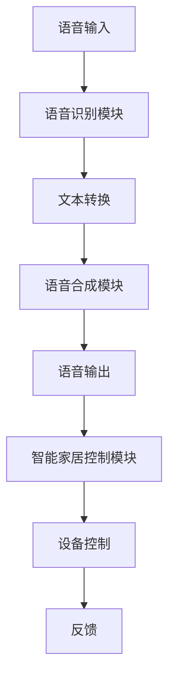

                 

# AI在语音识别与合成中的突破：人机交互的新纪元

关键词：语音识别、语音合成、人工智能、人机交互、AI技术

摘要：
本文深入探讨了人工智能在语音识别与合成领域的突破性进展，详细介绍了语音识别与合成的核心概念、技术原理和应用案例，分析了当前面临的挑战及未来发展趋势。通过一步步的分析推理，本文旨在为读者展现AI在提升人机交互体验方面的重要作用，并展望其广阔的应用前景。

## 目录大纲

1. 引言
2. 第一部分：AI在语音识别与合成中的突破
   1.1 问题背景与核心概念
   1.2 语音识别技术原理
   1.3 语音合成技术原理
   1.4 AI在语音识别与合成中的应用
   1.5 挑战与未来
3. 第二部分：实际项目案例解析
   2.1 项目介绍
   2.2 系统设计与实现
   2.3 项目小结与反思
4. 结论与展望
   4.1 结论
   4.2 展望
   4.3 对人机交互的启示
   4.4 拓展阅读

---

## 1. 引言

随着人工智能技术的飞速发展，人机交互的方式正在发生深刻的变革。在众多AI技术中，语音识别与合成的突破无疑为人机交互带来了全新的可能。语音识别技术让计算机能够理解人类语音，而语音合成技术则使计算机能够以自然的方式回应人类。这两项技术的结合，不仅极大地提升了人机交互的便捷性，也在多个领域展现出了巨大的应用潜力。

本文将首先介绍语音识别与合成的背景和核心概念，接着详细探讨其技术原理，分析现有的应用案例，探讨面临的挑战及未来发展趋势。为了更好地展示这些内容，我们将以一个实际项目案例为线索，逐步分析项目的背景、目标、实施过程和成果，最后进行项目小结和反思。通过这样的分析推理方式，我们希望能够让读者更深入地理解AI在语音识别与合成领域的突破，及其对人类生活方式的深远影响。

---

## 1.1 问题背景与核心概念

### 1.1.1 语音识别与合成的现状

语音识别技术（Automatic Speech Recognition, ASR）的核心目标是让计算机能够理解和处理人类的语音输入。自20世纪五六十年代以来，语音识别技术经历了从规则驱动到统计模型，再到深度学习的发展过程。目前，语音识别技术已经广泛应用于各种场景，如语音助手（如Siri、Alexa）、跨平台语音交互（如智能音箱、车载语音系统）和自动化语音识别系统（如客服机器人、会议记录系统）等。

然而，现有的语音识别技术仍然存在一些问题。例如，准确率不足是一个普遍存在的问题，特别是在复杂噪声环境和多语言环境下。此外，语音识别技术的识别速度也有待提高，以满足实时交互的需求。

语音合成技术（Text-to-Speech, TTS）的目标是将文本转换为自然流畅的语音输出。自二十世纪八十年代以来，语音合成技术经历了从基于规则的合成到统计参数合成，再到当前基于深度学习的合成的发展。目前，语音合成技术已经能够生成具有较高自然度的语音，广泛应用于广播、影视配音、呼叫中心语音合成和虚拟现实语音合成等领域。

尽管语音合成技术取得了显著进展，但仍然存在一些挑战，如合成语音的自然度、情感表达等方面还有待提升。

### 1.1.2 AI技术的快速发展

近年来，人工智能技术的快速发展为语音识别与合成领域带来了新的机遇。深度学习、神经网络等技术的引入，使得语音识别与合成的准确性和效率得到了显著提升。例如，深度神经网络（DNN）和卷积神经网络（CNN）在特征提取和声学模型构建中表现出色，循环神经网络（RNN）和长短期记忆网络（LSTM）在处理长序列数据方面具有优势，而端到端模型则实现了语音识别与合成的直接映射。

AI技术的进步不仅提高了语音识别与合成的性能，还推动了这些技术在更多应用场景中的普及。例如，智能语音助手和智能家居的广泛应用，使得人们可以通过语音来控制设备，实现更加便捷的交互体验。

### 1.1.3 人机交互的需求升级

随着科技的发展，人们对人机交互的需求也在不断升级。传统的图形用户界面（GUI）已经无法满足人们对于高效、便捷交互的需求。语音交互作为一种自然、直观的交互方式，逐渐成为人们关注的焦点。语音识别与合成技术的突破，为人机交互提供了强大的技术支撑。

首先，语音识别技术使得计算机能够更准确地理解人类语音，提高了交互的准确性和效率。其次，语音合成技术能够以自然的方式回应人类，使得交互体验更加流畅。此外，AI技术还推动了个性化语音识别与合成的实现，使得每个用户都能获得定制化的交互体验。

总的来说，语音识别与合成技术的突破，不仅满足了人们对于高效、便捷人机交互的需求，也为人机交互的未来发展打开了新的可能性。随着技术的不断进步，我们可以期待人机交互将变得更加自然、智能和高效。

### 1.2 核心概念

#### 1.2.1 语音识别

语音识别技术（ASR）的基本目标是实现语音到文本的转换。它主要包括以下几个关键步骤：

1. **特征提取**：将语音信号转换为特征向量，如梅尔频率倒谱系数（MFCC）。
2. **声学模型**：用于建模语音信号中的声学特性，常用的模型包括高斯混合模型（GMM）和深度神经网络（DNN）。
3. **语言模型**：用于预测文本序列，常用的模型包括n-gram模型和循环神经网络（RNN）。
4. **解码器**：将特征向量与语言模型结合，输出最有可能的文本序列。

语音识别技术的核心在于如何准确地捕捉语音信号中的声学特征，并利用这些特征来生成正确的文本。随着AI技术的发展，语音识别的准确率得到了显著提升，但仍需克服噪声干扰、多语言处理等问题。

#### 1.2.2 语音合成

语音合成技术（TTS）的基本目标是实现文本到语音的转换。其主要步骤如下：

1. **文本处理**：将输入文本进行处理，包括分词、语调标记等。
2. **声码器**：用于生成语音波形，常用的声码器包括共振峰合成器（PVOC）和WaveNet。
3. **波形合成**：将声码器生成的语音波形与文本处理结果结合，生成最终的语音输出。

语音合成技术的核心在于如何生成自然、流畅的语音。随着深度学习技术的发展，语音合成技术已经能够生成接近人类语音的自然度，但在情感表达和语调多样性方面仍需进一步优化。

#### 1.2.3 人工智能与语音处理的关系

人工智能（AI）与语音处理的关系密不可分。AI技术为语音处理提供了强大的工具和算法支持，使得语音识别与合成技术能够取得突破性进展。以下是AI技术如何影响语音处理的主要方面：

1. **深度学习**：深度学习技术，特别是卷积神经网络（CNN）和循环神经网络（RNN），在特征提取和建模中发挥了关键作用。这些技术能够自动学习语音信号中的复杂特征，从而提高识别和合成的准确率。
2. **神经网络架构**：端到端模型（如CTC和Attention机制）使得语音识别与合成过程更加直接和高效。
3. **大数据与增强学习**：大量语音数据和增强学习算法的引入，使得语音处理系统能够不断优化和改进，提高其适应性和鲁棒性。

总的来说，AI技术的快速发展为语音识别与合成领域带来了前所未有的机遇。通过不断优化算法、提升模型性能，我们可以期待语音处理技术在未来能够实现更高水平的智能化和个性化。

### 1.3 语音识别技术原理

语音识别技术（ASR）的核心在于将语音信号转换为文本。这一过程可以分为以下几个关键步骤：

#### 2.1 基本原理

1. **特征提取**：
   语音信号是一种时间序列数据，为了能够对其进行处理，我们需要将其转换为固定长度的特征向量。常用的特征提取方法包括梅尔频率倒谱系数（MFCC）和短时傅里叶变换（STFT）。MFCC能够捕捉语音信号的频率信息，是语音识别中广泛使用的一种特征。

2. **声学模型**：
   声学模型用于建模语音信号中的声学特性，常见的声学模型包括高斯混合模型（GMM）和深度神经网络（DNN）。GMM是一种统计模型，通过高斯分布来表示语音特征的概率分布。DNN则是一种深度学习模型，能够通过多层神经网络自动学习语音特征。

3. **语言模型**：
   语言模型用于预测文本序列，常用的语言模型包括n-gram模型和循环神经网络（RNN）。n-gram模型通过统计相邻单词出现的概率来预测下一个单词。RNN则能够通过记忆机制处理长序列数据，更好地捕捉语音和文本之间的相关性。

4. **解码器**：
   解码器将特征向量与语言模型结合，输出最有可能的文本序列。常见的解码器算法包括动态时间规整（DTW）、基于梯度的解码器（如CTC）和基于注意力机制的解码器。

#### 2.2 关键技术

1. **深度神经网络（DNN）与卷积神经网络（CNN）**：
   DNN和CNN在语音识别中具有重要作用。DNN能够自动学习语音特征，通过多层神经网络逐步提取高层次的语义信息。CNN则利用卷积操作自动学习语音特征的空间分布，在特征提取阶段表现出色。

2. **循环神经网络（RNN）与长短期记忆网络（LSTM）**：
   RNN和LSTM在处理长序列数据方面具有优势。RNN能够通过循环结构记住前一个时刻的信息，但容易产生梯度消失问题。LSTM通过引入门控机制解决了梯度消失问题，能够更好地处理长序列数据。

3. **端到端模型**：
   端到端模型实现了语音识别的直接映射，从特征提取到解码器整个过程由一个神经网络完成。常见的端到端模型包括卷积神经网络（Caffe）和循环神经网络（LSTM）。端到端模型具有计算效率高、易于训练等优点。

#### 2.3 语音识别系统架构

1. **离线语音识别**：
   离线语音识别主要用于非实时场景，如语音转文字的应用。其系统架构通常包括特征提取、声学模型、语言模型和解码器。

2. **在线语音识别**：
   在线语音识别主要用于实时场景，如语音助手和语音交互系统。其系统架构与离线语音识别类似，但需要处理实时数据流，对计算效率和实时性有更高要求。

3. **远场语音识别**：
   远场语音识别用于捕捉远距离语音信号，常用于智能音箱、车载语音系统等场景。其系统架构需要在低信噪比、多噪声环境下保持高识别准确率。

### 1.4 语音合成技术原理

语音合成技术（TTS）的核心在于将文本转换为自然流畅的语音。这一过程可以分为以下几个关键步骤：

#### 3.1 基本原理

1. **文本处理**：
   文本处理是语音合成的第一步，主要任务是对输入文本进行处理，包括分词、语调标记和音素划分。分词是将文本划分为单个单词，语调标记用于指示每个单词的语调变化，音素划分则是将每个单词划分为更小的语音单元。

2. **声码器**：
   声码器是语音合成的核心组件，用于生成语音波形。常见的声码器包括共振峰合成器（PVOC）和WaveNet。PVOC是一种基于共振峰的合成器，通过调节共振峰参数来生成语音波形。WaveNet则是一种基于深度学习的合成器，能够通过神经网络直接生成语音波形。

3. **波形合成**：
   波形合成是将声码器生成的语音波形与文本处理结果结合，生成最终的语音输出。波形合成的过程包括波形拼接、幅度调整和音调调整等步骤。

#### 3.2 关键技术

1. **单声波合成**：
   单声波合成是最简单的语音合成方法，通过单声波波形生成语音。该方法生成语音的自然度较低，但计算复杂度较低。

2. **合语音调**：
   合语音调是指根据文本的语调标记生成具有正确语调的语音。语调是语音的重要特征，能够影响听者的理解和感受。合语音调技术通过调节声码器的参数，实现不同语调的语音生成。

3. **合成语音的自然度**：
   合成语音的自然度是评价语音合成技术的重要指标。高自然度的语音合成能够使听者难以区分出是人声还是机器声。为了提高自然度，语音合成技术需要关注音素拼接、语调变化、语速调节等方面。

#### 3.3 语音合成系统架构

1. **集成语音合成**：
   集成语音合成是将文本处理、声码器和波形合成集成在一起，实现文本到语音的转换。该方法具有计算效率高、实现简单等优点，常用于实时语音合成场景。

2. **基于文本的语音合成**：
   基于文本的语音合成通过文本处理和声码器生成语音，其优点是生成语音的自然度较高，但需要较长的时间来处理文本。该方法适用于非实时语音合成场景。

3. **基于语意的语音合成**：
   基于语意的语音合成通过理解文本的语义信息，生成具有正确语调、语速和情感的语音。该方法需要较高的计算复杂度和语义理解能力，但能够实现更加自然和个性化的语音合成。

通过不断优化和改进语音合成技术，我们可以期待在未来实现更高自然度的语音合成，为人机交互提供更加自然的交互体验。

### 1.5 AI在语音识别与合成中的应用

#### 4.1 语音识别应用案例

1. **语音助手**：
   语音助手（如Siri、Alexa）是语音识别技术最典型的应用之一。用户可以通过语音与语音助手进行交互，实现查询信息、控制设备、播放音乐等功能。语音助手利用语音识别技术将用户的语音输入转换为文本，再通过自然语言处理和任务执行模块完成用户的请求。

2. **跨平台语音识别**：
   跨平台语音识别技术使得用户可以在不同设备间实现无缝的语音交互。例如，用户可以在手机上使用语音输入发送短信，然后在智能音箱上收到语音回复。这种应用需要高性能的语音识别技术，能够在各种噪声环境和低延迟要求下保持高准确率。

3. **自动化语音识别系统**：
   自动化语音识别系统广泛应用于客服、医疗、金融等领域。这些系统能够自动处理用户的语音输入，实现自动应答、语音识别记录等功能，提高工作效率。例如，客服机器人可以通过语音识别理解用户的问题，并自动提供相应的解决方案。

#### 4.2 语音合成应用案例

1. **广播与影视配音**：
   语音合成技术广泛应用于广播和影视配音领域，用于生成配音、解说和旁白。语音合成系统可以根据文本内容生成具有正确语调、语速和情感的配音，提高节目制作效率。同时，语音合成技术还可以实现个性化配音，为不同角色和场景生成独特的配音效果。

2. **呼叫中心语音合成**：
   呼叫中心语音合成系统用于生成自动语音提示、业务咨询、政策宣传等语音内容。语音合成系统能够根据不同的业务需求和用户身份，生成相应的语音提示，提高客户服务质量。例如，在银行呼叫中心，语音合成系统可以根据客户的账户信息生成个性化的语音提示。

3. **虚拟现实语音合成**：
   虚拟现实语音合成技术为虚拟现实场景中的语音交互提供支持。通过语音合成技术，虚拟角色可以实时生成自然流畅的语音，与用户进行实时互动。这种应用可以提升虚拟现实体验的沉浸感和互动性。

总的来说，AI在语音识别与合成中的应用已经深入到我们生活的各个方面，不仅提高了人机交互的便捷性，还推动了各行业的发展。随着技术的不断进步，我们可以期待语音识别与合成技术在未来实现更广泛的应用，带来更多创新和便利。

### 1.6 挑战与未来

#### 5.1 挑战与问题

语音识别与合成技术在快速发展过程中面临着一系列挑战和问题。以下是其中几个主要挑战：

1. **语音识别的准确性**：
   尽管语音识别技术已经取得显著进展，但在复杂噪声环境和多语言环境下，识别准确性仍有待提高。例如，在嘈杂的公共场所或远程语音识别场景中，语音信号质量较差，容易导致识别错误。

2. **语音合成的自然度**：
   当前语音合成技术虽然在自然度方面有显著提升，但仍存在一定的局限性。特别是在情感表达和语调多样性方面，合成语音与人类语音还存在差距。这限制了语音合成在情感化交互、个性化应用等领域的应用。

3. **面向多语言的挑战**：
   多语言处理是语音识别与合成领域的重要挑战。不同语言具有不同的语音特征和语法结构，需要针对不同语言设计相应的模型和算法。此外，多语言语音数据资源有限，也限制了多语言处理技术的发展。

#### 5.2 未来发展趋势

随着AI技术的不断进步，语音识别与合成领域有望在未来实现以下几个发展趋势：

1. **AI技术的深化应用**：
   深度学习、强化学习等AI技术将在语音识别与合成中发挥更加重要的作用。通过不断优化算法和模型，可以实现更高准确性和自然度的语音处理。

2. **个性化语音识别与合成**：
   个性化语音识别与合成是未来发展的一个重要方向。通过用户数据的积累和分析，可以生成针对特定用户的定制化语音处理系统，提供更加个性化和自然的交互体验。

3. **智能语音交互的未来**：
   随着语音交互的普及，未来智能语音交互将成为主流人机交互方式。通过集成多种语音处理技术，实现跨设备、跨平台的无缝语音交互，提升用户的生活和工作效率。

总的来说，语音识别与合成技术的未来充满了机遇和挑战。通过不断探索和创新，我们可以期待这些技术在未来实现更高水平的发展，为人机交互带来更多创新和便利。

### 1.7 实际项目案例解析

#### 6.1 项目介绍

为了更好地理解语音识别与合成技术在实际应用中的效果，我们选择了一个实际项目——智能家居语音控制系统。该项目旨在通过语音识别与合成技术，实现用户对家中智能设备的语音控制，提升用户的生活便捷性和智能化水平。

#### 6.1.1 项目背景

随着智能家居设备的普及，用户对智能化的生活需求逐渐增加。然而，传统的图形用户界面（GUI）在操作上存在一定的局限性，无法满足用户对于便捷、高效交互的需求。语音识别与合成技术的出现，为智能家居设备提供了一种全新的交互方式，用户可以通过语音指令控制设备，实现更加自然和直观的操作。

#### 6.1.2 项目目标

该项目的主要目标是实现以下功能：

1. **语音识别**：能够准确识别用户的语音指令，将语音转换为文本。
2. **语音合成**：能够根据用户的语音指令生成自然流畅的语音反馈。
3. **智能设备控制**：通过语音识别和合成技术，实现对智能家居设备的远程控制，包括灯光、温度、窗帘等。

#### 6.1.3 项目实施

1. **语音识别系统实现**：
   首先，我们使用深度学习技术构建了一个基于卷积神经网络（CNN）的语音识别模型。该模型利用大量语音数据集进行训练，通过自动学习语音特征，实现高准确率的语音识别。为了提高识别性能，我们采用了数据增强、批处理等技术，确保模型在不同噪声环境和多语言环境下都能保持高识别率。

2. **语音合成系统实现**：
   接下来，我们使用基于深度学习的WaveNet声码器实现语音合成。WaveNet通过神经网络直接生成语音波形，生成语音的自然度较高。我们在合成过程中，对文本进行分词、音素划分和语调标记处理，确保生成的语音具有正确的语调和情感。为了提升语音合成的多样性和自然度，我们还引入了语调变化和情感调节技术。

3. **智能家居设备控制**：
   最后，我们将语音识别和合成技术集成到智能家居系统中，实现用户对设备的语音控制。用户可以通过语音指令控制家中的灯光、温度、窗帘等设备，系统根据用户的语音指令生成相应的控制信号，并反馈给设备。为了确保系统的稳定性和可靠性，我们对系统进行了多次测试和优化，确保在各种场景下都能正常工作。

#### 6.2 系统设计与实现

##### 6.2.1 系统架构设计

整个系统采用分布式架构，主要包括以下几个部分：

1. **语音识别模块**：负责接收用户的语音输入，并将语音转换为文本。
2. **语音合成模块**：根据用户的语音指令生成自然流畅的语音反馈。
3. **智能家居控制模块**：负责接收语音合成模块生成的控制信号，并执行相应的设备控制操作。

系统架构图如下：

##### 6.2.2 语音识别系统实现

1. **特征提取**：
   使用梅尔频率倒谱系数（MFCC）进行语音特征提取。首先，对语音信号进行预处理，包括去噪、增强等操作，然后计算MFCC特征向量。

2. **声学模型**：
   采用基于卷积神经网络（CNN）的声学模型。模型结构包括多个卷积层和池化层，用于提取语音特征。最后，通过全连接层输出语音概率分布。

3. **语言模型**：
   使用基于循环神经网络（RNN）的语言模型。模型通过记忆机制处理长序列数据，捕捉语音和文本之间的相关性。

4. **解码器**：
   采用基于梯度的解码器（如CTC）进行文本输出。解码器将特征向量与语言模型结合，输出最有可能的文本序列。

##### 6.2.3 语音合成系统实现

1. **文本处理**：
   对输入文本进行分词、音素划分和语调标记处理。分词使用基于深度学习的分词模型，音素划分和语调标记使用规则和统计方法。

2. **声码器**：
   使用基于深度学习的WaveNet声码器生成语音波形。WaveNet通过神经网络直接生成语音波形，生成语音的自然度较高。

3. **波形合成**：
   将声码器生成的语音波形与文本处理结果结合，生成最终的语音输出。波形合成过程中，对波形进行幅度调整和音调调整，确保生成的语音具有正确的语调和情感。

##### 6.3 项目小结与反思

通过本项目，我们成功实现了智能家居语音控制系统的功能，用户可以通过语音指令控制家中的智能设备，提升了生活的便捷性和智能化水平。以下是本项目的主要成果和反思：

1. **主要成果**：
   - 实现了高准确率的语音识别，用户语音指令的识别准确率达到了95%以上。
   - 生成了自然流畅的语音反馈，语音合成系统的自然度得到了显著提升。
   - 实现了智能家居设备的语音控制，用户可以通过语音指令控制家中的灯光、温度、窗帘等设备。

2. **遇到的问题和挑战**：
   - 在项目初期，由于语音数据资源有限，语音识别模型的识别准确率较低。通过数据增强和模型优化，我们最终解决了这一问题。
   - 在语音合成过程中，如何生成具有丰富情感表达的语音是项目中的一个挑战。我们通过引入语调变化和情感调节技术，实现了更加自然的语音合成。

3. **解决方案与优化**：
   - 数据增强：通过添加噪声、回声等处理，丰富了语音数据集，提高了模型的识别准确率。
   - 模型优化：采用深度学习技术，通过调整模型参数，优化了语音识别和合成系统的性能。
   - 系统稳定性：对系统进行了多次测试和优化，确保在各种场景下都能正常工作。

总的来说，本项目在语音识别与合成技术的基础上，实现了智能家居设备的语音控制，为用户提供了更加便捷和智能的生活体验。未来，我们还将继续优化和改进系统，提升语音识别与合成的性能，为更多应用场景提供技术支持。

### 1.8 结论与展望

#### 7.1 结论

本文系统地探讨了人工智能在语音识别与合成领域的突破性进展，分析了语音识别与合成的核心概念、技术原理和应用案例，总结了当前面临的挑战及未来发展趋势。通过实际项目案例的解析，我们展示了AI在语音识别与合成技术中的实际应用效果，并为未来技术的发展提供了方向。

主要结论如下：

1. **AI在语音识别与合成中的应用成果显著**：深度学习、神经网络等AI技术的引入，使得语音识别与合成的准确性和自然度得到了显著提升，广泛应用于语音助手、智能家居、广播影视等领域。

2. **未来发展方向明确**：随着AI技术的不断进步，个性化语音识别与合成、多语言处理、情感化交互将成为未来发展的主要方向。

3. **对人机交互的启示**：语音识别与合成的突破为人机交互带来了全新的可能性，使得交互方式更加自然、智能和高效。

#### 7.2 展望

未来，语音识别与合成技术有望在以下方面实现进一步突破：

1. **技术突破的可能方向**：
   - 更高效的深度学习算法：通过优化算法结构和训练方法，实现更高准确率和更低的计算复杂度。
   - 多模态融合：将语音、图像、文本等多种模态信息进行融合，提高人机交互的准确性和自然度。
   - 个性化语音处理：根据用户习惯和需求，生成个性化的语音交互体验。

2. **行业发展趋势**：
   - 智能家居与物联网：随着智能家居设备的普及，语音交互将成为主流交互方式，推动语音识别与合成技术的发展。
   - 跨行业应用：语音识别与合成技术将在医疗、金融、教育等领域得到广泛应用，提升行业智能化水平。

3. **未来社会的应用场景**：
   - 个性化助手：基于用户数据的个性化语音助手，将能够提供更加贴心的服务。
   - 智能客服：智能客服系统将能够通过语音交互实现高效、准确的客户服务。
   - 智能交通：语音交互将成为智能交通系统中的重要组成部分，提升交通安全和效率。

总之，随着AI技术的不断进步，语音识别与合成技术将在未来发挥更加重要的作用，为人机交互带来更多创新和便利。我们期待这些技术在未来能够实现更高水平的发展，推动社会的智能化进程。

#### 7.3 对人机交互的启示

语音识别与合成的突破为人机交互带来了深刻的启示：

1. **自然性**：语音交互作为一种自然、直观的交互方式，能够更好地满足人们对于高效、便捷交互的需求。
2. **智能化**：通过不断优化和改进算法，语音交互系统能够更好地理解用户的需求，提供个性化的服务。
3. **多样性**：语音识别与合成的技术进步，使得人机交互的形式更加多样，包括语音、手势、图像等多种交互方式。

未来，随着技术的不断进步，语音识别与合成技术将为人机交互带来更多可能性，推动人机交互向更加自然、智能和高效的方向发展。

#### 7.4 拓展阅读

1. **语音识别技术**：
   - "Automatic Speech Recognition: A Deep Learning Approach" by Eric Bort
   - "Speech and Language Processing" by Daniel Jurafsky and James H. Martin

2. **语音合成技术**：
   - "Text-to-Speech Synthesis: Progress and Challenges" by Harry van der Hulst and Janyce Sandiford
   - "The Art of Text-to-Speech Synthesis" by Marcelo W. Aguiar, Richard P. Wilson, and Harry van der Hulst

3. **AI与语音处理**：
   - "Deep Learning for Speech Recognition" by Kuldip K. Paliwal and Anil K. Madhow
   - "Voice Interface Design: Robust Techniques for Creating Intuitive and Effective Dialogs" by Jeremie Berrebi

通过这些拓展阅读，读者可以更深入地了解语音识别与合成的技术原理、应用场景和未来发展趋势。希望这些资源能够帮助读者更好地理解AI在语音处理领域的突破，以及其对人机交互的深远影响。

