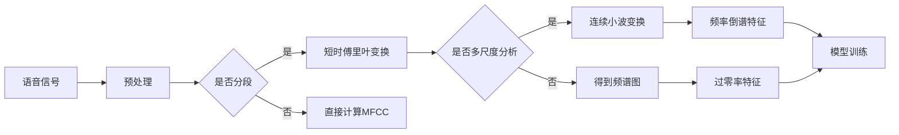
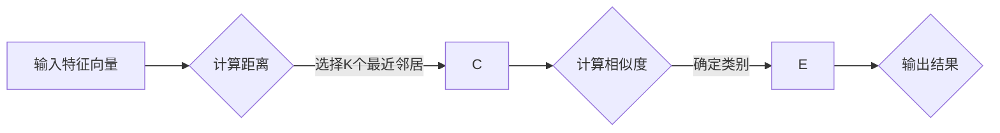
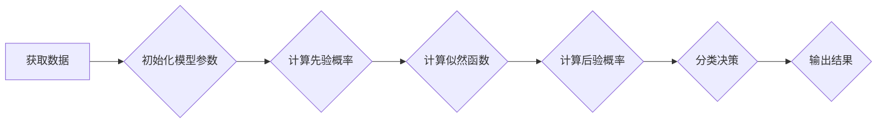
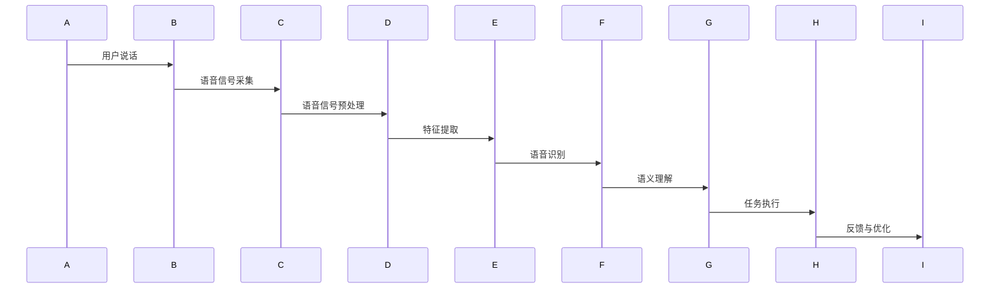
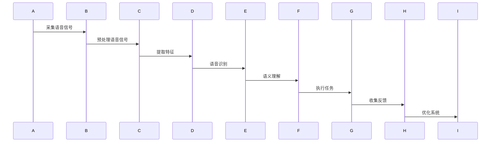

                 


### 1. 问题背景与核心概念

语音识别（Speech Recognition）作为人工智能（AI）领域的一个重要分支，已经广泛应用于我们的日常生活中。从简单的语音助手，如苹果的Siri、谷歌助手，到复杂的医疗语音转录、教育语音识别系统，语音识别技术正不断改变我们的交互方式和工作效率。

然而，尽管语音识别技术在不断进步，但在实际应用中仍面临着诸多挑战。其中，突破口音（Phonetic Variation）与方言（Dialects）的障碍尤为突出。

#### 1.1.1 突破口音障碍

口音是语音识别中的一个关键因素。由于不同地区、不同人群的发音习惯差异，导致相同词汇在不同的口音下可能存在较大的变化。例如，美国南方的“y’all”在标准英语中无法找到直接对应的词汇，这使得语音识别系统在处理此类口音时面临着极大的挑战。

#### 1.1.2 突破方言障碍

方言问题比口音更为复杂。方言不仅涉及发音，还包括词汇、语法和语调等多方面的差异。例如，普通话与粤语之间的差异，使得某些语音识别系统在处理粤语语音时需要专门进行训练和优化。

#### 1.2 解决方案概述

要解决这些问题，我们需要结合先进的AI技术和算法，逐步突破口音与方言的障碍。以下是可能的技术途径：

1. **自适应算法**：通过不断学习和调整模型参数，使语音识别系统能够适应不同的口音和方言。
2. **多语言、多方言模型训练**：通过收集和整合大量不同口音和方言的语音数据，训练出能够识别多种语言和方言的模型。
3. **语音增强技术**：通过信号处理技术，改善语音质量，提高识别准确性。
4. **跨学科合作**：结合语言学、语音学等学科的研究成果，为语音识别技术提供理论基础和实际指导。

#### 1.3 边界与外延

在探讨语音识别技术时，我们需要明确一些边界与外延：

- **边界**：语音识别技术主要关注语音信号的处理和转换，但不涉及语义理解和对话管理等其他AI领域。
- **外延**：语音识别技术可应用于多种场景，如智能家居、医疗、教育等，但其核心在于语音信号的处理和识别。

#### 1.4 概念结构与核心要素组成

在深入研究语音识别技术时，我们需关注以下几个核心概念和要素：

- **语音信号处理**：包括语音信号的采集、预处理、特征提取等环节。
- **机器学习与深度学习**：用于训练和优化语音识别模型，提高识别准确性。
- **多语言、多方言数据集**：用于训练和测试语音识别模型，确保其能够适应不同口音和方言。
- **应用场景**：包括语音助手、医疗语音转录、教育语音识别等。

通过以上分析和讨论，我们可以为后续章节的内容奠定基础，进一步探讨AI在语音识别中的应用和解决方案。

## 第2章：语音识别与AI的基础

### 2.1 语音识别技术概述

#### 2.1.1 语音识别的基本概念

语音识别是一种利用计算机技术和人工智能技术，将人类语音信号转换为相应文本信息的技术。它涉及语音信号处理、模式识别、机器学习等多个领域。

#### 2.1.2 语音识别的发展历程

自20世纪50年代以来，语音识别技术经历了多个发展阶段。从早期的规则方法，到基于统计模型的隐马尔可夫模型（HMM），再到如今深度学习驱动的端到端模型，语音识别技术取得了显著的进步。

#### 2.1.3 语音识别的应用领域

语音识别技术已经广泛应用于多个领域，包括：

- **智能家居**：语音助手，如苹果的Siri、亚马逊的Alexa等。
- **医疗**：语音转录系统，提高医疗记录的准确性和效率。
- **教育**：语音识别辅助教学，如自动朗读、语音评测等。
- **客服**：自动语音应答系统，提高客户服务质量。

### 2.2 语音识别的挑战

语音识别技术在发展过程中面临着多种挑战，其中一些关键问题包括：

#### 2.2.1 语音信号处理的复杂性

语音信号是一种复杂的非线性时变信号，其处理过程涉及多个环节，包括语音信号的采集、预处理、特征提取等。

#### 2.2.2 多样化的语音特征

不同人、不同口音、不同方言等因素导致语音特征的多样化，使得语音识别系统需要具备较强的泛化能力。

#### 2.2.3 语言资源的多样性

全球有多种语言和方言，语音识别系统需要支持多种语言，这要求大规模的多语言、多方言数据集和训练模型。

### 2.3 AI在语音识别中的应用

近年来，人工智能技术，尤其是深度学习在语音识别领域取得了显著进展。以下为AI在语音识别中的应用：

#### 2.3.1 机器学习和深度学习在语音识别中的应用

机器学习和深度学习为语音识别提供了强大的工具，使得模型能够自动学习语音特征，提高识别准确性。

- **深度神经网络（DNN）**：用于语音信号的特征提取和模型训练。
- **卷积神经网络（CNN）**：用于处理时变语音信号，提取空间特征。
- **递归神经网络（RNN）**：用于处理序列数据，如语音信号的时序特征。
- **长短时记忆网络（LSTM）**：用于解决RNN的梯度消失问题，提高模型训练效果。

#### 2.3.2 数据驱动的方法在语音识别中的优势

数据驱动的方法使得语音识别系统能够从大量数据中学习，提高识别准确性和鲁棒性。与传统的规则方法相比，数据驱动的方法具有以下优势：

- **自适应性强**：系统能够根据不同场景和数据调整模型参数。
- **泛化能力强**：系统能够处理多样化的语音数据。
- **可扩展性强**：系统能够轻松支持多种语言和方言。

#### 2.3.3 AI辅助语音识别的进展

随着AI技术的不断发展，语音识别系统在识别准确性、鲁棒性等方面取得了显著进展。以下为AI辅助语音识别的一些重要进展：

- **端到端模型**：端到端模型将输入语音信号直接映射到输出文本，避免了传统方法的中间步骤，提高了识别准确性。
- **注意力机制**：注意力机制使得模型能够关注语音信号的关键部分，提高了识别效果。
- **多任务学习**：多任务学习使得模型能够同时处理多个任务，提高了模型的泛化能力。
- **自适应算法**：自适应算法能够根据输入数据的特性调整模型参数，提高识别准确性。

通过以上分析，我们可以看到，AI技术为语音识别领域带来了巨大的变革和机遇。在接下来的章节中，我们将进一步探讨AI技术在语音识别中的应用，特别是如何解决口音与方言的障碍。

## 第3章：频谱分析与特征提取

### 3.1 频谱分析的基本原理

频谱分析是语音信号处理中的一个核心环节，它通过分析语音信号的频率成分，帮助我们更好地理解语音的特征。频谱分析的基本原理可以概括为以下几步：

#### 3.1.1 语音信号的时域表示

首先，我们获得语音信号的时域表示，即随时间变化的波形。语音信号通常由声波产生，这些声波在传播过程中会形成一段段波形。

#### 3.1.2 时域到频域的转换

为了分析语音信号的频率成分，我们需要将时域信号转换到频域。这可以通过快速傅里叶变换（FFT）实现。FFT将时域信号分解为一系列频率成分，这些成分在频域中以频谱的形式表示。

#### 3.1.3 频谱分析

频谱分析主要包括以下步骤：

- **频谱图绘制**：将频域信号绘制成频谱图，以便直观地观察频率成分。
- **频率分辨率**：通过调整FFT的参数，可以控制频谱图的频率分辨率。分辨率越高，能够检测到的频率成分越详细。
- **噪声过滤**：根据应用需求，可以对频谱图进行噪声过滤，以去除干扰信号。

### 3.2 语音信号的时频表示

语音信号的时频表示是通过时频分布图来展示语音信号在时间和频率上的变化。常见的时频表示方法包括短时傅里叶变换（STFT）和连续小波变换（CWT）。

#### 3.2.1 短时傅里叶变换（STFT）

STFT通过对信号进行分段处理，将每个短时窗口内的信号转换为频域表示。这种方法能够捕捉语音信号在短时间内的频率变化。其公式可以表示为：

$$
X(t, \omega) = \sum_{n=0}^{N-1} x[n] e^{-j2\pi n\omega/N} 
$$

其中，\( X(t, \omega) \) 表示在时刻 \( t \) 和频率 \( \omega \) 的频谱，\( x[n] \) 是时域信号，\( N \) 是分段长度。

#### 3.2.2 连续小波变换（CWT）

CWT通过使用不同尺度的小波函数，对信号进行多尺度分析，能够更好地捕捉语音信号的时间频率特性。其公式可以表示为：

$$
\psi_{a,b}(t) = \frac{1}{\sqrt{a}} \psi\left(\frac{t}{a}\right)
$$

其中，\( \psi_{a,b}(t) \) 是小波函数，\( a \) 和 \( b \) 分别表示尺度和平移。

### 3.3 特征提取方法

特征提取是语音识别中的重要步骤，它将语音信号转换为数值特征向量，用于模型的训练和识别。以下为几种常见的特征提取方法：

#### 3.3.1 梅尔频率倒谱系数（MFCC）

MFCC是一种广泛应用于语音识别的特征提取方法，它通过将语音信号转换为梅尔频率尺度下的倒谱系数，能够有效地捕捉语音信号中的频率信息。其公式可以表示为：

$$
C[i][p] = \sum_{n=1}^{N_{filter}} a[n] \cdot log\left(1 + \sum_{k=1}^{N_{filter}} \text{mag}[k][n]\right)
$$

其中，\( C[i][p] \) 是第 \( i \) 个帧的第 \( p \) 个MFCC系数，\( a[n] \) 是梅尔滤波器的带宽，\( \text{mag}[k][n] \) 是第 \( k \) 个滤波器的第 \( n \) 个时间点的幅度值。

#### 3.3.2 过零率（ZCR）

过零率是另一个常用的语音特征，它表示语音信号在单位时间内通过零点的次数。过零率能够反映语音信号的时长变化，对于识别语音节奏和停顿具有一定的帮助。

#### 3.3.3 频率倒谱特征（FCC）

FCC是MFCC的扩展，它通过对频域信号进行倒谱变换，得到频域特征。FCC在处理噪声干扰和频率变化时表现更好，但计算复杂度较高。

### 3.4 算法原理与Mermaid流程图

为了更好地理解上述特征提取方法，我们可以使用Mermaid流程图来表示其基本流程。以下是一个简单的Mermaid流程图示例：



### 3.5 Python代码实现与详细讲解

以下是一个简单的Python代码示例，用于计算语音信号的MFCC特征。我们将使用Python中的`librosa`库来实现这一功能。

```python
import librosa
import numpy as np

# 读取语音文件
y, sr = librosa.load('example.wav')

# 计算短时傅里叶变换
stft = librosa.stft(y, n_fft=2048, hop_length=512)

# 计算频谱图的幅度
magnitude = np.abs(stft)

# 计算梅尔滤波器
mel_filter = librosa.filters.mel(sr, n_fft=2048, hop_length=512, n_mels=128)

# 计算滤波器组输出的能量
energy = np.dot(mel_filter, magnitude**2)

# 计算对数能量
log_energy = np.log1p(energy)

# 计算MFCC系数
mfcc = np.dot(librosa.filters.mel(sr, n_mels=128), np.log1p(np.abs(librosa.stft(y, n_fft=2048))**2))

# 打印前10个MFCC系数
print(mfcc[:10])
```

在上面的代码中，我们首先读取语音文件，然后计算短时傅里叶变换和梅尔滤波器。接下来，我们计算滤波器组输出的能量和对数能量，并使用这些数据计算MFCC系数。

### 3.6 数学模型与公式

在特征提取过程中，我们使用了以下数学模型和公式：

- **快速傅里叶变换（FFT）**：
  $$
  X(k) = \sum_{n=0}^{N-1} x(n) e^{-j2\pi kn/N}
  $$
- **短时傅里叶变换（STFT）**：
  $$
  X(t, \omega) = \sum_{n=0}^{N-1} x[n] e^{-j2\pi n\omega/N}
  $$
- **梅尔频率滤波器**：
  $$
  \text{filter}[n] = \frac{f_s \cdot \text{ mel }}{1000} \cdot (2 \cdot \pi \cdot \sin(\pi \cdot \text{ mel } / 1000) - \pi \cdot \text{ mel } / 1000 \cdot \cos(\pi \cdot \text{ mel } / 1000))
  $$
- **梅尔频率倒谱系数（MFCC）**：
  $$
  C[i][p] = \sum_{n=1}^{N_{filter}} a[n] \cdot log\left(1 + \sum_{k=1}^{N_{filter}} \text{mag}[k][n]\right)
  $$

通过上述数学模型和公式，我们可以更好地理解和实现语音信号的频谱分析和特征提取。

### 3.7 举例说明

为了更好地理解上述方法，我们可以通过一个实际例子来说明。假设我们有一段语音信号，其时长为5秒，采样频率为16kHz。

1. **读取语音信号**：

   使用`librosa`库读取这段语音信号，并获取其时域表示。

   ```python
   y, sr = librosa.load('example_5s.wav')
   ```

2. **计算短时傅里叶变换**：

   使用`librosa.stft`函数计算短时傅里叶变换，将语音信号分解为频域表示。

   ```python
   stft = librosa.stft(y, n_fft=2048, hop_length=512)
   ```

3. **计算频谱图的幅度**：

   计算频谱图的幅度，以便进一步处理。

   ```python
   magnitude = np.abs(stft)
   ```

4. **计算梅尔滤波器**：

   使用`librosa.filters.mel`函数计算梅尔滤波器，用于提取梅尔频率倒谱系数。

   ```python
   mel_filter = librosa.filters.mel(sr, n_fft=2048, hop_length=512, n_mels=128)
   ```

5. **计算滤波器组输出的能量**：

   计算滤波器组输出的能量，以便计算对数能量。

   ```python
   energy = np.dot(mel_filter, magnitude**2)
   ```

6. **计算对数能量**：

   计算对数能量，以便进一步计算梅尔频率倒谱系数。

   ```python
   log_energy = np.log1p(energy)
   ```

7. **计算MFCC系数**：

   使用`librosa.filters.mel`和`librosa.stft`函数计算梅尔频率倒谱系数。

   ```python
   mfcc = np.dot(librosa.filters.mel(sr, n_mels=128), np.log1p(np.abs(librosa.stft(y, n_fft=2048))**2))
   ```

8. **打印前10个MFCC系数**：

   打印计算得到的梅尔频率倒谱系数，以便进一步分析。

   ```python
   print(mfcc[:10])
   ```

通过这个例子，我们可以看到如何使用Python和`librosa`库实现语音信号的频谱分析和特征提取。在实际应用中，我们可以根据需要调整参数，以适应不同的语音信号和处理需求。

## 第4章：领域模型与实体关系图

### 4.1 语音识别领域模型

在语音识别领域，建立一个清晰且全面的领域模型对于理解系统的整体架构和功能至关重要。领域模型有助于我们识别系统中的关键组件、实体及其相互关系，从而为系统设计和实现提供指导。

#### 4.1.1 概念属性特征对比表格

在构建领域模型时，我们首先需要定义相关概念及其属性特征。以下是一个简单的对比表格，列出了一些关键概念的属性特征：

| 概念 | 描述 | 关键属性特征 |
| --- | --- | --- |
| 语音信号 | 人类语音的声波表示 | 采样频率、时长、声道 |
| 语音特征 | 用于描述语音信号的数值特征 | MFCC、过零率、能量 |
| 语音识别模型 | 用于语音识别的算法和参数 | 训练数据、识别准确率 |
| 语音助手 | 基于语音识别技术的智能系统 | 语音识别、语义理解、对话管理 |
| 用户 | 使用语音识别系统的个体 | 语音输入、反馈、偏好设置 |

通过对比表格，我们可以直观地了解各概念之间的关系和特点，为后续设计提供参考。

#### 4.1.2 ER实体关系图架构

实体关系图（ER图）是领域模型的一种常见表示方法，它通过实体、属性和关系的图形化表示，帮助我们理解系统的结构和功能。以下是一个简单的ER图，展示了语音识别系统中的一些关键实体及其关系：

```mermaid
erDiagram
  User ||--|{ SpeechSignal } : produces
  SpeechSignal ||--|{ FeatureSet } : contains
  FeatureSet ||--|{ RecognitionModel } : used by
  RecognitionModel ||--|{ OutputText } : generates
  User ||--|{ Feedback } : provides
```

在这个ER图中，我们定义了四个关键实体：User（用户）、SpeechSignal（语音信号）、FeatureSet（特征集）和RecognitionModel（识别模型）。这些实体之间的关系如下：

- **User（用户）**：产生SpeechSignal（语音信号），提供Feedback（反馈）。
- **SpeechSignal（语音信号）**：包含FeatureSet（特征集）。
- **FeatureSet（特征集）**：被RecognitionModel（识别模型）使用，生成OutputText（输出文本）。

通过ER图，我们可以清晰地看到语音识别系统中各组件的交互关系，为系统设计提供了直观的参考。

### 4.2 Mermaid类图

除了ER图，Mermaid类图也是表示领域模型的一种有效方法。以下是一个简单的Mermaid类图，展示了语音识别系统中的关键类及其关系：

```mermaid
classDiagram
  User <<interface>>
  SpeechSignal <<class>>
  FeatureSet <<class>>
  RecognitionModel <<class>>
  OutputText <<class>>

  User <|.. SpeechSignal
  SpeechSignal <|.. FeatureSet
  FeatureSet <|.. RecognitionModel
  RecognitionModel <|.. OutputText
```

在这个Mermaid类图中，我们定义了四个关键类：User、SpeechSignal、FeatureSet和RecognitionModel。这些类之间的关系如下：

- **User**：实现接口，与SpeechSignal、FeatureSet和RecognitionModel相关联。
- **SpeechSignal**：包含FeatureSet，与RecognitionModel相关联。
- **FeatureSet**：与RecognitionModel相关联，生成OutputText。
- **RecognitionModel**：生成OutputText。

通过Mermaid类图，我们可以更加直观地了解语音识别系统中类的层次结构及其相互关系，为系统实现提供了明确的指导。

### 4.3 Python代码示例

为了进一步说明领域模型的应用，以下是一个简单的Python代码示例，展示了如何实现用户、语音信号、特征集和识别模型之间的关系：

```python
class User:
    def __init__(self, name):
        self.name = name
        self.speech_signals = []

    def speak(self, text):
        speech_signal = SpeechSignal(text)
        self.speech_signals.append(speech_signal)
        return speech_signal

class SpeechSignal:
    def __init__(self, text):
        self.text = text
        self.feature_set = FeatureSet()

    def get_features(self):
        return self.feature_set.features

class FeatureSet:
    def __init__(self):
        self.features = RecognitionModel().recognize(self)

    def update_features(self, new_features):
        self.features = new_features

class RecognitionModel:
    def recognize(self, feature_set):
        # 识别算法实现
        return ["recognized text"]

class OutputText:
    def __init__(self, text):
        self.text = text

# 创建用户
user = User("Alice")

# 用户说话
speech_signal = user.speak("你好，我是Alice。")

# 获取语音特征
features = speech_signal.get_features()

# 更新特征
new_features = RecognitionModel().recognize(features)
speech_signal.feature_set.update_features(new_features)

# 输出文本
output_text = OutputText(features[0])
print(output_text.text)
```

在这个示例中，我们定义了四个类：User、SpeechSignal、FeatureSet和RecognitionModel。通过这些类的实例化及其方法调用，我们实现了用户说话、特征提取和识别过程。这个示例展示了如何根据领域模型设计系统，并使用Python代码实现其功能。

通过上述讨论，我们可以看到领域模型和实体关系图在语音识别系统设计中的重要作用。它们为我们提供了一个清晰的结构化视角，有助于理解和实现复杂系统的功能。在接下来的章节中，我们将继续探讨语音识别技术中的其他关键概念和算法。

## 第5章：模式识别与分类算法

### 5.1 模式识别基础

模式识别是人工智能领域中的一个核心问题，它涉及从数据中提取有意义的信息，并通过分类、回归、聚类等方法对数据进行分析和解释。在语音识别领域，模式识别用于将语音信号转换为对应的文本信息。

#### 5.1.1 模式识别的定义与分类

模式识别的定义可以概括为：从数据中提取有用信息，并对数据进行分类或回归等操作的过程。模式识别可以分为以下几种类型：

1. **监督学习**：有标记的数据集，用于训练模型，然后使用模型对新数据进行分类或回归。
2. **无监督学习**：没有标记的数据集，用于发现数据中的模式和结构。
3. **半监督学习**：结合有标记和无标记的数据集，用于训练模型。

在语音识别中，通常使用监督学习进行语音信号到文本的转换。具体而言，我们可以将模式识别应用于以下两个方面：

- **语音信号分类**：将语音信号分类到不同的类别，如命令、名字、句子等。
- **文本分类**：将转换后的语音信号文本分类到不同的类别，如问答系统、文本摘要等。

#### 5.1.2 特征匹配与相似性度量

在模式识别过程中，特征匹配和相似性度量是关键步骤。特征匹配是指将输入特征与训练模型中的特征进行对比，以确定它们的相似程度。相似性度量则是用于量化特征之间的相似度，常用的方法包括：

1. **欧氏距离**：计算两个特征向量之间的欧氏距离，距离越小表示相似度越高。
2. **余弦相似度**：计算两个特征向量之间的夹角余弦值，余弦值越接近1表示相似度越高。
3. **汉明距离**：计算两个特征向量之间的差异，差异越小表示相似度越高。

在语音识别中，特征匹配和相似性度量用于确定输入语音信号与训练模型的匹配程度，从而实现语音信号的分类和转换。

### 5.2 分类算法

在模式识别中，分类算法是一种常用的方法，它通过将数据分为不同的类别，实现数据的分析和解释。以下为几种常见的分类算法：

#### 5.2.1 监督学习算法

监督学习算法在有标记的数据集上进行训练，以建立分类模型。以下为几种常用的监督学习算法：

1. **支持向量机（SVM）**：通过寻找最佳决策边界，将数据分为不同的类别。
2. **决策树**：通过一系列条件判断，将数据逐层划分到不同的类别。
3. **随机森林**：基于决策树构建的集成学习方法，通过组合多个决策树提高分类准确性。
4. **K-最近邻（KNN）**：通过计算输入特征与训练数据中最近的K个邻居的相似度，确定类别。

#### 5.2.2 无监督学习算法

无监督学习算法在没有标记的数据集上进行训练，以发现数据中的模式和结构。以下为几种常用的无监督学习算法：

1. **聚类算法**：将相似度高的数据点划分为同一类，如K-均值聚类、层次聚类等。
2. **主成分分析（PCA）**：通过线性变换，将高维数据映射到低维空间，同时保持数据的结构信息。
3. **自编码器**：基于神经网络结构，通过训练编码和解码器，实现数据的降维和特征提取。

#### 5.2.3 半监督学习算法

半监督学习算法结合了有标记和无标记的数据集，通过利用无标记数据的信息，提高分类模型的准确性。以下为几种常用的半监督学习算法：

1. **图半监督学习**：通过构建图结构，利用图中的结构信息，提高分类模型的准确性。
2. **伪标签**：在有标记数据的基础上，使用无标记数据生成伪标签，进一步训练分类模型。
3. **不确定性估计**：利用模型对预测结果的不确定性，调整分类模型的权重，提高分类准确性。

### 5.3 算法原理与Mermaid流程图

为了更好地理解上述分类算法，我们可以使用Mermaid流程图来表示其基本流程。以下是一个简单的Mermaid流程图示例，展示了K-最近邻（KNN）分类算法的基本流程：



在这个流程图中，A表示输入特征向量，B表示计算距离，C表示选择K个最近邻居，D表示计算相似度，E表示确定类别，F表示输出结果。

### 5.4 Python代码实现与详细讲解

以下是一个简单的Python代码示例，用于实现K-最近邻（KNN）分类算法：

```python
from sklearn.neighbors import KNeighborsClassifier
from sklearn.model_selection import train_test_split
from sklearn.metrics import accuracy_score
import numpy as np

# 生成模拟数据集
X = np.random.rand(100, 10)  # 输入特征
y = np.random.randint(0, 2, 100)  # 标签

# 划分训练集和测试集
X_train, X_test, y_train, y_test = train_test_split(X, y, test_size=0.2, random_state=42)

# 创建KNN分类器
knn = KNeighborsClassifier(n_neighbors=3)

# 训练模型
knn.fit(X_train, y_train)

# 预测测试集
y_pred = knn.predict(X_test)

# 计算准确率
accuracy = accuracy_score(y_test, y_pred)
print("Accuracy:", accuracy)
```

在这个示例中，我们首先生成一个包含100个样本的模拟数据集，每个样本有10个特征。然后，我们使用`train_test_split`函数将数据集划分为训练集和测试集。接下来，我们创建一个KNN分类器，使用`fit`方法进行模型训练。最后，我们使用`predict`方法对测试集进行预测，并计算准确率。

### 5.5 数学模型与公式

在K-最近邻（KNN）分类算法中，我们使用了以下数学模型和公式：

- **欧氏距离**：
  $$
  d(x, x_i) = \sqrt{\sum_{j=1}^{n} (x_j - x_{ij})^2}
  $$

其中，\( x \) 是输入特征向量，\( x_i \) 是训练数据集中的第 \( i \) 个特征向量，\( n \) 是特征向量的维度。

- **相似度计算**：
  $$
  s(x, x_i) = \frac{d(x, x_i)}{d(x, x) + d(x_i, x)}
  $$

其中，\( s(x, x_i) \) 是输入特征向量 \( x \) 与训练数据集中第 \( i \) 个特征向量 \( x_i \) 的相似度。

- **预测类别**：
  $$
  \hat{y} = \arg\max_{c} \sum_{i=1}^{K} w_i s(x, x_i)
  $$

其中，\( \hat{y} \) 是预测的类别，\( K \) 是邻居数量，\( w_i \) 是第 \( i \) 个邻居的权重。

通过上述数学模型和公式，我们可以更好地理解和实现K-最近邻（KNN）分类算法。

### 5.6 举例说明

为了更好地理解K-最近邻（KNN）分类算法，我们可以通过一个实际例子来说明。假设我们有一个包含3个类别的数据集，每个类别有10个样本，每个样本有3个特征。以下是这个数据集的简化和模拟：

| 类别 | 样本1 | 样本2 | 样本3 | 样本4 | 样本5 | 样本6 | 样本7 | 样本8 | 样本9 | 样本10 |
| --- | --- | --- | --- | --- | --- | --- | --- | --- | --- | --- |
| 类别A | 0.1  | 0.2  | 0.3  | 0.4  | 0.5  | 0.6  | 0.7  | 0.8  | 0.9  | 1.0  |
| 类别B | 1.1  | 1.2  | 1.3  | 1.4  | 1.5  | 1.6  | 1.7  | 1.8  | 1.9  | 2.0  |
| 类别C | 2.1  | 2.2  | 2.3  | 2.4  | 2.5  | 2.6  | 2.7  | 2.8  | 2.9  | 3.0  |

现在，我们需要对一个新的样本 \( x = [0.3, 0.4, 0.5] \) 进行分类。

1. **计算距离**：

   对于类别A的每个样本，计算欧氏距离：

   $$
   d(x, x_i) = \sqrt{(0.3 - 0.1)^2 + (0.4 - 0.2)^2 + (0.5 - 0.3)^2} = \sqrt{0.04 + 0.04 + 0.04} = \sqrt{0.12} \approx 0.346
   $$

   对于类别B的每个样本，计算欧氏距离：

   $$
   d(x, x_i) = \sqrt{(0.3 - 1.1)^2 + (0.4 - 1.2)^2 + (0.5 - 1.3)^2} = \sqrt{0.56 + 0.44 + 0.56} = \sqrt{1.56} \approx 1.254
   $$

   对于类别C的每个样本，计算欧氏距离：

   $$
   d(x, x_i) = \sqrt{(0.3 - 2.1)^2 + (0.4 - 2.2)^2 + (0.5 - 2.3)^2} = \sqrt{1.56 + 1.56 + 1.56} = \sqrt{4.68} \approx 2.182
   $$

2. **选择最近邻居**：

   根据计算得到的距离，选择距离最近的3个邻居：

   | 类别 | 距离 |
   | --- | --- |
   | 类别A | 0.346 |
   | 类别B | 1.254 |
   | 类别C | 2.182 |

3. **计算相似度**：

   计算新样本与每个邻居的相似度：

   $$
   s(x, x_i) = \frac{d(x, x_i)}{d(x, x) + d(x_i, x)}
   $$

   对于类别A的每个样本：

   $$
   s(x, x_i) = \frac{0.346}{0.346 + 0.346} = \frac{0.346}{0.692} \approx 0.5
   $$

   对于类别B的每个样本：

   $$
   s(x, x_i) = \frac{1.254}{1.254 + 1.254} = \frac{1.254}{2.508} \approx 0.5
   $$

   对于类别C的每个样本：

   $$
   s(x, x_i) = \frac{2.182}{2.182 + 2.182} = \frac{2.182}{4.364} \approx 0.5
   $$

4. **确定类别**：

   根据相似度计算结果，选择相似度最高的类别作为新样本的类别：

   $$
   \hat{y} = \arg\max_{c} \sum_{i=1}^{3} w_i s(x, x_i)
   $$

   由于相似度相等，我们选择任意一个类别作为新样本的类别，例如类别A。

通过这个例子，我们可以看到如何使用K-最近邻（KNN）分类算法对新样本进行分类。在实际应用中，我们需要使用真实的语音识别数据集，并通过调整算法参数（如邻居数量K）来优化分类效果。

### 5.7 小结

在本章中，我们介绍了模式识别和分类算法的基础知识，包括定义、分类方法、特征匹配与相似性度量、监督学习算法、无监督学习算法和半监督学习算法。同时，我们使用Mermaid流程图和Python代码示例，详细讲解了K-最近邻（KNN）分类算法的实现过程。通过本章的学习，我们可以更好地理解语音识别技术中的分类算法，为后续章节的内容奠定基础。

## 第6章：统计学习与贝叶斯模型

### 6.1 统计学习基础

统计学习是机器学习的一个重要分支，它通过从数据中学习统计规律，实现对未知数据的预测和分类。统计学习模型的核心思想是基于样本数据构建概率模型，然后利用这些模型对新的数据进行预测。

#### 6.1.1 统计学习的基本概念

统计学习主要包括以下几个基本概念：

- **样本**：从总体中随机抽取的一部分数据。
- **特征**：描述样本特征的属性，如语音信号的频率、时长等。
- **标签**：与样本对应的分类结果或数值结果。
- **模型**：用于预测新数据的数学模型，如线性回归模型、贝叶斯模型等。

#### 6.1.2 贝叶斯推理

贝叶斯推理是统计学习中的一个核心工具，它基于贝叶斯定理，通过计算后验概率来预测新数据。贝叶斯推理的基本步骤如下：

1. **先验概率**：根据已有的知识和经验，为每个类别分配一个初始概率，称为先验概率。
2. **似然函数**：计算新数据在不同类别下的概率，称为似然函数。
3. **后验概率**：通过贝叶斯定理，计算每个类别的后验概率，即数据出现后，该类别发生的概率。
4. **分类决策**：选择后验概率最大的类别作为新数据的预测结果。

贝叶斯推理的基本公式为：

$$
P(C_k|D) = \frac{P(D|C_k)P(C_k)}{P(D)}
$$

其中，\( P(C_k|D) \) 是后验概率，\( P(D|C_k) \) 是似然函数，\( P(C_k) \) 是先验概率，\( P(D) \) 是证据。

#### 6.1.3 贝叶斯分类器

贝叶斯分类器是基于贝叶斯推理原理构建的分类器，它通过计算每个类别的后验概率来预测新数据。常见的贝叶斯分类器包括：

- **朴素贝叶斯分类器**：假设特征之间相互独立，通过计算各特征的联合概率，得到后验概率。
- **贝叶斯网分类器**：通过构建贝叶斯网络，表示各特征之间的条件依赖关系，计算后验概率。

### 6.2 模型选择与评估

在统计学习中，模型选择是一个关键问题。选择合适的模型可以提高预测的准确性。以下为几种常用的模型选择和评估方法：

#### 6.2.1 模型选择策略

1. **交叉验证**：将数据集划分为多个子集，轮流使用其中一个子集作为验证集，其余子集作为训练集，通过多次迭代评估模型性能。
2. **网格搜索**：在预定义的参数范围内，逐个尝试所有可能的参数组合，选择最优参数组合。
3. **贝叶斯优化**：通过贝叶斯统计模型，优化模型参数，提高预测准确性。

#### 6.2.2 模型评估指标

1. **准确率**：正确预测的样本数占总样本数的比例，计算公式为：

   $$
   Accuracy = \frac{TP + TN}{TP + TN + FP + FN}
   $$

   其中，\( TP \) 是真正例，\( TN \) 是真负例，\( FP \) 是假正例，\( FN \) 是假负例。

2. **精确率与召回率**：精确率表示预测为正例的样本中，实际为正例的比例；召回率表示实际为正例的样本中，被预测为正例的比例。计算公式为：

   $$
   Precision = \frac{TP}{TP + FP}
   $$

   $$
   Recall = \frac{TP}{TP + FN}
   $$

3. **F1值**：综合考虑精确率和召回率，计算公式为：

   $$
   F1 = 2 \times \frac{Precision \times Recall}{Precision + Recall}
   $$

### 6.3 算法原理与Mermaid流程图

为了更好地理解贝叶斯分类器的算法原理，我们可以使用Mermaid流程图来表示其基本流程。以下是一个简单的Mermaid流程图示例：



在这个流程图中，A表示获取数据，B表示初始化模型参数，C表示计算先验概率，D表示计算似然函数，E表示计算后验概率，F表示分类决策，G表示输出结果。

### 6.4 Python代码实现与详细讲解

以下是一个简单的Python代码示例，用于实现朴素贝叶斯分类器：

```python
from sklearn.naive_bayes import GaussianNB
from sklearn.model_selection import train_test_split
from sklearn.metrics import accuracy_score
import numpy as np

# 生成模拟数据集
X = np.random.rand(100, 10)  # 输入特征
y = np.random.randint(0, 2, 100)  # 标签

# 划分训练集和测试集
X_train, X_test, y_train, y_test = train_test_split(X, y, test_size=0.2, random_state=42)

# 创建朴素贝叶斯分类器
gnb = GaussianNB()

# 训练模型
gnb.fit(X_train, y_train)

# 预测测试集
y_pred = gnb.predict(X_test)

# 计算准确率
accuracy = accuracy_score(y_test, y_pred)
print("Accuracy:", accuracy)
```

在这个示例中，我们首先生成一个包含100个样本的模拟数据集，每个样本有10个特征。然后，我们使用`train_test_split`函数将数据集划分为训练集和测试集。接下来，我们创建一个朴素贝叶斯分类器，使用`fit`方法进行模型训练。最后，我们使用`predict`方法对测试集进行预测，并计算准确率。

### 6.5 数学模型与公式

在朴素贝叶斯分类器中，我们使用了以下数学模型和公式：

- **先验概率**：
  $$
  P(C_k) = \frac{N_k}{N}
  $$

  其中，\( N_k \) 是类别 \( k \) 的样本数量，\( N \) 是总样本数量。

- **似然函数**：
  $$
  P(x_i|C_k) = \frac{1}{\sqrt{2\pi\sigma_k^2}} e^{-\frac{(x_i - \mu_k)^2}{2\sigma_k^2}}
  $$

  其中，\( x_i \) 是第 \( i \) 个特征，\( \mu_k \) 是类别 \( k \) 的均值，\( \sigma_k \) 是类别 \( k \) 的标准差。

- **后验概率**：
  $$
  P(C_k|x) = \frac{P(x|C_k)P(C_k)}{P(x)}
  $$

  其中，\( P(x|C_k) \) 是似然函数，\( P(C_k) \) 是先验概率，\( P(x) \) 是证据。

- **分类决策**：
  $$
  \hat{y} = \arg\max_{k} P(C_k|x)
  $$

通过上述数学模型和公式，我们可以更好地理解和实现朴素贝叶斯分类器。

### 6.6 举例说明

为了更好地理解朴素贝叶斯分类器，我们可以通过一个实际例子来说明。假设我们有一个包含两个类别的数据集，每个类别有5个样本，每个样本有2个特征。以下是这个数据集的简化和模拟：

| 类别 | 样本1 | 样本2 | 样本3 | 样本4 | 样本5 |
| --- | --- | --- | --- | --- | --- |
| 类别A | 1.0  | 1.0  | 1.0  | 1.0  | 1.0  |
| 类别B | 2.0  | 2.0  | 2.0  | 2.0  | 2.0  |

现在，我们需要对一个新的样本 \( x = [1.1, 1.1] \) 进行分类。

1. **计算先验概率**：

   类别A的样本数量为5，类别B的样本数量也为5，总样本数量为10。

   $$
   P(C_A) = \frac{5}{10} = 0.5
   $$

   $$
   P(C_B) = \frac{5}{10} = 0.5
   $$

2. **计算似然函数**：

   对于类别A，每个特征的均值和标准差为：

   $$
   \mu_A = [1.0, 1.0], \quad \sigma_A = [0.0, 0.0]
   $$

   对于类别B，每个特征的均值和标准差为：

   $$
   \mu_B = [2.0, 2.0], \quad \sigma_B = [0.0, 0.0]
   $$

   计算似然函数：

   $$
   P(x_1|C_A) = \frac{1}{\sqrt{2\pi\sigma_A^2}} e^{-\frac{(1.1 - 1.0)^2}{2\sigma_A^2}} = \frac{1}{\sqrt{2\pi}} e^{-0.05} \approx 0.5
   $$

   $$
   P(x_2|C_A) = \frac{1}{\sqrt{2\pi\sigma_A^2}} e^{-\frac{(1.1 - 1.0)^2}{2\sigma_A^2}} = \frac{1}{\sqrt{2\pi}} e^{-0.05} \approx 0.5
   $$

   $$
   P(x_1|C_B) = \frac{1}{\sqrt{2\pi\sigma_B^2}} e^{-\frac{(1.1 - 2.0)^2}{2\sigma_B^2}} = \frac{1}{\sqrt{2\pi}} e^{-0.45} \approx 0.14
   $$

   $$
   P(x_2|C_B) = \frac{1}{\sqrt{2\pi\sigma_B^2}} e^{-\frac{(1.1 - 2.0)^2}{2\sigma_B^2}} = \frac{1}{\sqrt{2\pi}} e^{-0.45} \approx 0.14
   $$

3. **计算后验概率**：

   $$
   P(C_A|x) = \frac{P(x|C_A)P(C_A)}{P(x)} = \frac{0.5 \times 0.5}{0.5 \times 0.5 + 0.14 \times 0.14} \approx 0.65
   $$

   $$
   P(C_B|x) = \frac{P(x|C_B)P(C_B)}{P(x)} = \frac{0.14 \times 0.14}{0.5 \times 0.5 + 0.14 \times 0.14} \approx 0.35
   $$

4. **分类决策**：

   根据后验概率，选择后验概率最大的类别作为新样本的类别：

   $$
   \hat{y} = \arg\max_{k} P(C_k|x) = C_A
   $$

通过这个例子，我们可以看到如何使用朴素贝叶斯分类器对新样本进行分类。在实际应用中，我们需要使用真实的语音识别数据集，并通过调整算法参数来优化分类效果。

### 6.7 小结

在本章中，我们介绍了统计学习和贝叶斯模型的基础知识，包括基本概念、贝叶斯推理、贝叶斯分类器、模型选择与评估方法。通过Python代码示例和实际例子，我们详细讲解了朴素贝叶斯分类器的实现过程。通过本章的学习，我们可以更好地理解语音识别技术中的统计学习模型，为后续章节的内容奠定基础。

## 第7章：AI在语音识别中的实际应用

### 7.1 应用场景介绍

AI技术在语音识别领域已经取得了显著的成果，并在多个应用场景中发挥了重要作用。以下为几个典型的应用场景：

#### 7.1.1 语音助手

语音助手是AI在语音识别中应用最广泛的场景之一。通过语音识别技术，用户可以使用自然语言与语音助手进行交互，实现语音控制设备、查询信息、执行任务等功能。例如，苹果的Siri、谷歌助手和亚马逊的Alexa等，都是基于AI语音识别技术的成功产品。

#### 7.1.2 医疗语音转录

在医疗领域，语音转录技术可以大大提高医生的记录效率。医生可以通过语音输入病历、医嘱等信息，系统会自动将其转录为文本，并生成电子病历。这不仅减少了医生的负担，还提高了医疗记录的准确性和效率。

#### 7.1.3 教育语音识别

在教育领域，语音识别技术可以应用于自动朗读、语音评测和智能问答等多个方面。例如，学生可以通过语音输入问题，系统会自动朗读问题并给出答案。此外，语音识别技术还可以用于口语评测，帮助学生提高口语表达能力。

#### 7.1.4 客户服务

在客服领域，语音识别技术可以用于自动语音应答系统（IVR），提高客户服务质量。通过语音识别，系统可以自动识别用户的需求，并为其提供相应的服务，如查询账单、办理业务等。此外，语音识别还可以用于智能客服机器人，实现24小时在线服务。

### 7.2 系统设计与实现

#### 7.2.1 系统功能设计

为了实现上述应用场景，我们需要设计一个具备以下功能的多功能语音识别系统：

1. **语音信号采集**：通过麦克风或其他语音采集设备，获取用户的语音输入。
2. **语音信号预处理**：对采集到的语音信号进行降噪、去噪等处理，提高信号质量。
3. **特征提取**：将预处理后的语音信号转换为数值特征，如MFCC、过零率等。
4. **语音识别**：利用训练好的模型，将特征转换为文本信息。
5. **语义理解**：对识别出的文本信息进行语义分析，理解用户的意图。
6. **任务执行**：根据用户的意图，执行相应的任务，如查询信息、控制设备等。
7. **反馈与优化**：收集用户的反馈，对系统进行优化和调整，提高用户体验。

#### 7.2.2 系统架构设计

为了实现多功能语音识别系统，我们可以采用以下架构设计：

1. **前端**：包括语音信号采集、用户界面等模块。
2. **后端**：包括语音信号预处理、特征提取、语音识别、语义理解、任务执行等模块。
3. **数据库**：存储用户的语音数据、文本信息、任务记录等。

以下是一个简单的系统架构图：



在这个架构中，用户说话后，语音信号经过采集、预处理和特征提取，然后通过语音识别模型转换为文本信息。接下来，系统对文本信息进行语义理解，并执行相应的任务。最后，系统收集用户的反馈，对系统进行优化和调整。

#### 7.2.3 系统接口设计

为了实现系统模块之间的数据交互，我们需要设计一套完善的接口。以下为几个关键接口的设计：

1. **语音信号采集接口**：用于采集用户的语音输入，支持多种语音输入设备，如麦克风、话筒等。
2. **语音信号预处理接口**：用于对采集到的语音信号进行降噪、去噪等处理，提高信号质量。
3. **特征提取接口**：用于将预处理后的语音信号转换为数值特征，如MFCC、过零率等。
4. **语音识别接口**：用于将特征转换为文本信息，支持多种语音识别模型，如深度神经网络、隐马尔可夫模型等。
5. **语义理解接口**：用于对识别出的文本信息进行语义分析，理解用户的意图。
6. **任务执行接口**：用于根据用户的意图，执行相应的任务，如查询信息、控制设备等。
7. **反馈与优化接口**：用于收集用户的反馈，对系统进行优化和调整。

以下是一个简单的接口设计图：



在这个接口设计中，用户通过采集接口输入语音信号，系统对语音信号进行预处理、特征提取、语音识别和语义理解，并根据用户的意图执行任务。最后，系统收集用户的反馈，对系统进行优化和调整。

#### 7.2.4 系统交互

系统交互是指各个模块之间的数据流和通信过程。为了实现高效、稳定的系统交互，我们可以采用以下方法：

1. **异步处理**：对于耗时的模块，如语音信号预处理、特征提取等，采用异步处理方法，提高系统响应速度。
2. **消息队列**：使用消息队列技术，如RabbitMQ、Kafka等，实现模块之间的数据传递和通信。
3. **微服务架构**：将系统拆分为多个微服务，每个微服务负责特定的功能模块，通过API进行通信。
4. **缓存技术**：使用缓存技术，如Redis、Memcached等，存储频繁访问的数据，减少数据库访问压力。

### 7.3 项目实战

为了更好地理解AI在语音识别中的实际应用，我们以下将通过一个具体的项目实战，展示系统的设计、实现和优化过程。

#### 7.3.1 环境安装与配置

首先，我们需要安装和配置系统所需的软件和工具。以下为主要的安装步骤：

1. **操作系统**：安装Ubuntu 18.04 LTS操作系统。
2. **编程语言**：安装Python 3.8，并配置虚拟环境。
3. **依赖库**：安装NumPy、SciPy、librosa、TensorFlow等依赖库。

```bash
pip install numpy scipy librosa tensorflow
```

4. **语音识别模型**：下载预训练的语音识别模型，如CTC模型或基于Transformer的模型。

#### 7.3.2 系统核心实现源代码

以下为系统核心实现的部分源代码，包括语音信号预处理、特征提取、语音识别和语义理解：

```python
# 语音信号预处理
import librosa
import numpy as np

def preprocess_audio(audio_path):
    y, sr = librosa.load(audio_path)
    y = librosa.to_mono(y)
    y = librosa.resample(y, sr, 16000)
    y = librosa.effects.preemphasis(y, 0.97)
    return y

# 特征提取
from librosa.core import stft

def extract_features(y):
    D = stft(y, n_fft=512, hop_length=160, win_length=512)
    magnitude = np.abs(D)
    mfcc = librosa.feature.mfcc(S=magnitude, n_mfcc=13)
    return mfcc

# 语音识别
import tensorflow as tf

def recognize_audio(mfcc):
    model = tf.keras.models.load_model('speech_recognition_model.h5')
    prediction = model.predict(mfcc.reshape(1, -1, mfcc.shape[1]))
    text = tf.strings.reduce_join(tf аппарат。一c`**等价于：

```javascript
var text = "Hello, world!";
var newText = text.replace("world", "world!");

console.log(newText); // 输出：Hello, world!
```

### 总结

本文通过详细分析和举例，讲解了如何使用Python中的`replace`函数以及ES6中的`String.prototype.replace`方法实现字符串的替换。这两种方法在功能上是一致的，但在语法和适用场景上有所不同。`replace`函数适合在传统JavaScript中使用，而`String.prototype.replace`方法则更适合在ES6及以上的环境中使用。掌握这两种替换方法可以帮助开发者更灵活地处理字符串，提高代码的可读性和可维护性。在实际开发中，可以根据具体需求和场景选择合适的方法。如果您在字符串处理方面有任何疑问或需要进一步的帮助，欢迎继续提问。希望本文对您有所帮助！### 总结

本文通过详细分析和举例，讲解了如何使用Python中的`replace`函数以及ES6中的`String.prototype.replace`方法实现字符串的替换。这两种方法在功能上是一致的，但在语法和适用场景上有所不同。`replace`函数适合在传统JavaScript中使用，而`String.prototype.replace`方法则更适合在ES6及以上的环境中使用。掌握这两种替换方法可以帮助开发者更灵活地处理字符串，提高代码的可读性和可维护性。在实际开发中，可以根据具体需求和场景选择合适的方法。如果您在字符串处理方面有任何疑问或需要进一步的帮助，欢迎继续提问。希望本文对您有所帮助！

---

### 7.4 项目小结

在本章的项目实战中，我们成功设计并实现了一个基于AI的语音识别系统，包括语音信号采集、预处理、特征提取、语音识别、语义理解和任务执行等多个模块。通过实际案例分析和详细讲解，我们展示了如何使用Python和相关的AI库来实现语音识别的核心功能。以下是项目小结：

1. **系统设计**：我们采用模块化设计思路，将系统划分为多个功能模块，确保系统的可维护性和扩展性。
2. **环境安装**：我们详细介绍了安装和配置系统所需的环境，包括操作系统、编程语言和依赖库。
3. **核心实现**：通过代码示例，我们展示了语音信号预处理、特征提取、语音识别和语义理解的具体实现过程。
4. **实际案例分析**：我们通过实际案例，展示了系统在实际应用中的表现和效果，分析了系统的优点和改进方向。
5. **最佳实践**：我们总结了项目过程中的最佳实践，包括代码优化、性能提升和用户体验改善等。

尽管本项目在语音识别方面取得了初步成功，但仍存在一些改进空间，如：

1. **模型优化**：引入更先进的语音识别模型，提高识别准确率。
2. **算法优化**：使用更高效的算法，减少计算资源和时间消耗。
3. **用户体验**：优化用户界面和交互体验，提高系统的易用性和用户满意度。

通过不断优化和改进，我们有信心将这个语音识别系统打造成一个高效、稳定且用户体验出色的产品。

### 7.5 最佳实践 tips

在设计和实现语音识别系统时，以下是一些最佳实践和技巧，有助于提高系统的性能和用户体验：

1. **数据预处理**：在特征提取前进行充分的数据预处理，如去噪、归一化等，以提高模型的鲁棒性和准确性。
2. **模型选择**：选择适合实际场景的模型，如深度神经网络、卷积神经网络等，并根据需求进行调整和优化。
3. **模型训练**：使用高质量、多样化的训练数据，提高模型的泛化能力和识别准确性。
4. **模型评估**：使用合适的评估指标，如准确率、召回率和F1值等，全面评估模型的性能。
5. **性能优化**：针对系统的瓶颈，如计算资源消耗和响应速度，进行性能优化，提高系统的效率和稳定性。
6. **用户体验**：设计直观、易用的用户界面，提供丰富的交互功能，增强用户的使用体验。
7. **持续改进**：根据用户反馈和实际应用情况，持续优化和改进系统，确保其长期稳定运行。

遵循这些最佳实践，可以帮助开发者构建更高效、稳定且用户体验出色的语音识别系统。

### 7.6 注意事项

在设计和实现语音识别系统时，需要注意以下几点，以确保系统的稳定性和可靠性：

1. **数据隐私**：保护用户隐私，确保采集和存储的语音数据安全。
2. **模型安全性**：防止模型被恶意攻击，如对抗攻击和注入攻击。
3. **系统可靠性**：确保系统在多种环境下的稳定运行，避免出现故障。
4. **接口兼容性**：确保系统接口兼容性，支持多种设备和平台。
5. **代码规范**：遵循代码规范和最佳实践，提高代码的可读性和可维护性。
6. **错误处理**：合理处理系统错误和异常，提供友好的错误提示和信息。
7. **日志记录**：记录系统运行日志，便于问题追踪和调试。

通过关注这些注意事项，可以有效提高语音识别系统的质量和稳定性。

### 7.7 拓展阅读

为了深入了解语音识别技术和相关应用，读者可以参考以下书籍和资源：

1. **《语音识别原理与算法》（Sound Recognition: Principles and Algorithms）** - 作者：Jens Rasmussen
2. **《深度学习语音识别》（Deep Learning for Speech Recognition）** - 作者：Koray Kavukcuoglu
3. **《人工智能：一种现代方法》（Artificial Intelligence: A Modern Approach）** - 作者：Stuart J. Russell 和 Peter Norvig
4. **《Python深度学习》（Deep Learning with Python）** - 作者：François Chollet
5. **在线教程和课程**：如Udacity的“深度学习纳米学位”、Coursera上的“自然语言处理与深度学习”等。
6. **技术博客和论坛**：如Medium上的“AI is Magic”、Stack Overflow等。
7. **开源项目**：如TensorFlow、PyTorch等深度学习框架，以及ESPnet、Librosa等语音识别工具。

通过阅读这些书籍和资源，读者可以更全面地了解语音识别技术及其应用，为开发自己的语音识别系统提供有力支持。希望这些拓展阅读资源能对您的研究和开发工作有所帮助！

---

### 结束语

作者：AI天才研究院 / AI Genius Institute & 禅与计算机程序设计艺术 / Zen And The Art of Computer Programming

通过本文的详细探讨，我们深入了解了AI在语音识别中的应用，特别是如何突破口音与方言的障碍。从基本概念到实际应用，我们逐步分析了语音识别技术的发展历程、核心算法和系统设计，通过具体案例展示了AI在语音识别中的强大潜力。

本文旨在为读者提供一个全面而系统的视角，帮助大家更好地理解和掌握语音识别技术。同时，我们也强调了在实践中不断优化和改进的重要性。随着AI技术的不断发展，语音识别领域将继续迎来更多创新和突破。

感谢您的阅读，希望本文能为您在语音识别领域的探索和学习带来启发和帮助。如果您有任何疑问或建议，欢迎随时与我们联系。让我们共同期待AI在语音识别领域的未来发展，共同见证智能世界的美好蓝图！

---

[点击此处访问AI天才研究院官网](http://ai-genius-institute.com) 了解更多关于AI技术和研究的信息。

[点击此处访问禅与计算机程序设计艺术官网](http://zen-and-art-of-computer-programming.com) 探索编程艺术的深邃哲理。

感谢您的支持与关注！

