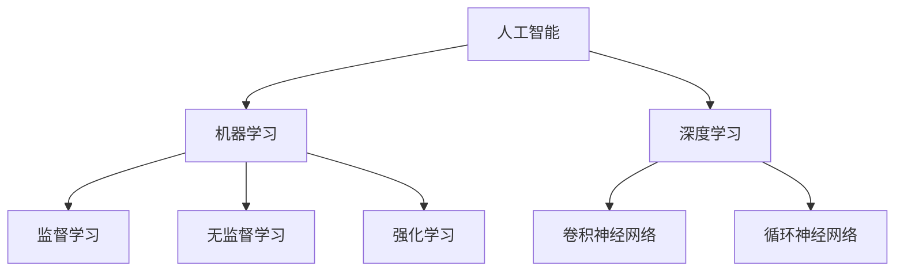
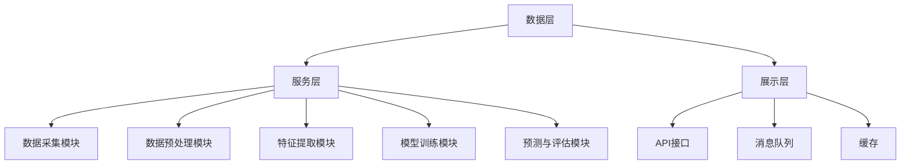

                 


# AI在金融风险评估和预测中的应用创新

关键词：人工智能、金融风险评估、预测模型、深度学习、机器学习、风险预测、模型优化

摘要：
本文深入探讨了人工智能（AI）在金融风险评估和预测领域的应用创新。首先，介绍了AI在金融领域的应用背景和重要性。接着，通过分析核心概念，如AI、机器学习、深度学习等，以及它们在金融风险评估中的应用，为后续内容打下基础。本文进一步讲解了常见的AI算法原理，包括神经网络、随机森林等，并使用Python源代码和LaTeX公式详细阐述了算法的数学模型。然后，重点介绍了金融风险评估和预测系统的设计与实现，通过实际项目和最佳实践，为读者提供了宝贵的经验和建议。

## 背景介绍

### 1.1 AI在金融领域的重要性

随着金融科技的飞速发展，人工智能（AI）在金融领域的应用越来越广泛。AI不仅能够提高金融服务的效率，还能为金融机构提供更为精准的风险评估和预测能力。在金融风险评估和预测方面，AI技术的重要性主要体现在以下几个方面：

1. **数据处理能力**：金融领域的数据量庞大且复杂，传统的分析方法难以处理。AI技术，特别是机器学习和深度学习，能够处理大量的非结构化数据，如文本、图像等，从而为金融机构提供更为全面的风险评估信息。

2. **预测精度**：AI技术能够通过对历史数据的分析，预测未来的金融趋势和风险。这种预测能力对于金融机构来说至关重要，可以帮助它们提前采取措施，降低风险。

3. **自动化决策**：AI技术能够自动化处理复杂的金融决策，减少人为错误，提高决策效率。

4. **欺诈检测**：AI技术能够实时监控金融交易，识别潜在的欺诈行为，提高金融机构的安全水平。

### 1.1.1 金融风险评估和预测的需求

金融风险评估和预测是金融领域的基础性工作，其需求体现在以下几个方面：

1. **信用风险评估**：银行和其他金融机构需要对客户的信用状况进行评估，以确定贷款和其他金融产品的风险。

2. **市场风险评估**：金融机构需要预测市场走势，以便制定投资策略，降低市场风险。

3. **合规性评估**：金融机构需要遵守监管规定，进行合规性评估，确保其业务符合法律法规要求。

4. **流动性风险评估**：金融机构需要评估其流动资产和负债状况，确保资金的安全性和流动性。

### 1.1.2 AI技术的发展背景

AI技术的发展经历了几个关键阶段：

1. **早期探索（1950s-1960s）**：AI概念诞生，早期算法如逻辑符号机和决策树开始出现。

2. **快速发展（1970s-1980s）**：人工智能领域经历了一段时间的繁荣，出现了许多创新算法，如神经网络和遗传算法。

3. **停滞期（1990s）**：由于计算能力的限制和数据量的不足，AI领域进入了一个相对停滞的时期。

4. **复兴期（2000s至今）**：随着互联网和大数据技术的发展，AI技术再次焕发生机，深度学习、强化学习等新算法不断涌现。

## 核心概念与联系

### 1.2.1 AI的基本概念

人工智能（Artificial Intelligence，简称AI）是计算机科学的一个分支，旨在使机器具备类似人类的智能，能够理解和执行复杂的任务。AI的核心技术包括机器学习、深度学习、自然语言处理等。

- **机器学习**：通过训练算法，使计算机从数据中学习，并做出决策或预测。
- **深度学习**：一种基于神经网络的机器学习技术，能够自动从大量数据中提取特征。
- **自然语言处理**：使计算机能够理解和生成自然语言。

### 1.2.2 机器学习的基本概念

机器学习（Machine Learning，简称ML）是AI的核心技术之一，其核心思想是通过算法从数据中学习，并做出决策或预测。常见的机器学习算法包括：

- **监督学习**：通过已标记的数据进行训练，用于预测未知数据的标签。
- **无监督学习**：没有预定义的输出标签，通过发现数据中的模式和结构进行训练。
- **强化学习**：通过与环境的交互进行学习，以最大化长期奖励。

### 1.2.3 深度学习的基本概念

深度学习（Deep Learning，简称DL）是机器学习的一个重要分支，基于多层神经网络进行训练。深度学习的核心在于其多层网络结构，能够自动提取数据中的复杂特征。

- **卷积神经网络（CNN）**：主要用于图像处理任务。
- **循环神经网络（RNN）**：用于序列数据处理，如自然语言处理和时间序列预测。

### 1.2.4 Mermaid流程图展示概念关系

以下是使用Mermaid绘制的AI、机器学习和深度学习相关概念之间的流程图：



## 算法原理讲解

### 2.1 神经网络

神经网络（Neural Network，简称NN）是深度学习的基础，其灵感来源于人脑的神经网络结构。神经网络由一系列相互连接的神经元组成，每个神经元都通过权重连接到其他神经元。

#### 2.1.1 神经网络结构

神经网络通常包括以下几个组成部分：

- **输入层**：接收外部输入信号。
- **隐藏层**：对输入信号进行加工和处理。
- **输出层**：生成最终输出。

#### 2.1.2 前向传播与反向传播

神经网络的工作原理主要包括两个过程：前向传播和反向传播。

1. **前向传播**：输入信号从输入层经过隐藏层，最终到达输出层。每个神经元都会将其接收到的信号通过激活函数（如Sigmoid、ReLU）进行处理，并传递给下一层。

2. **反向传播**：根据输出层与实际输出之间的误差，反向传播误差到隐藏层和输入层。通过调整权重和偏置，使神经网络能够不断优化其预测结果。

#### 2.1.3 Python源代码示例

下面是一个简单的Python代码示例，用于实现神经网络的前向传播：

```python
import numpy as np

def sigmoid(x):
    return 1 / (1 + np.exp(-x))

# 定义神经网络结构
input_layer_size = 2
hidden_layer_size = 3
output_layer_size = 1

# 初始化权重和偏置
weights_input_hidden = np.random.rand(input_layer_size, hidden_layer_size)
weights_hidden_output = np.random.rand(hidden_layer_size, output_layer_size)

bias_hidden = np.random.rand(hidden_layer_size)
bias_output = np.random.rand(output_layer_size)

# 输入数据
inputs = np.array([[0, 1], [1, 0]])

# 前向传播
hidden_layer_activation = sigmoid(np.dot(inputs, weights_input_hidden) + bias_hidden)
output_layer_activation = sigmoid(np.dot(hidden_layer_activation, weights_hidden_output) + bias_output)

print("Output:", output_layer_activation)
```

#### 2.1.4 数学模型和公式

神经网络的数学模型主要包括以下几个部分：

1. **激活函数**：$$ f(x) = \frac{1}{1 + e^{-x}} $$
2. **前向传播**：$$ z_i = \sum_j w_{ij}x_j + b_i $$
3. **输出**：$$ a_i = f(z_i) $$

其中，$w_{ij}$为权重，$b_i$为偏置，$x_j$为输入，$a_i$为输出。

#### 2.1.5 举例说明

假设我们有一个输入向量$(x_1, x_2) = (0, 1)$，使用Sigmoid函数进行前向传播，可以得到输出向量$(a_1, a_2)$。

$$ z_1 = w_{11}x_1 + w_{12}x_2 + b_1 = w_{11} \cdot 0 + w_{12} \cdot 1 + b_1 = w_{12} + b_1 $$

$$ a_1 = \frac{1}{1 + e^{-z_1}} $$

$$ z_2 = w_{21}x_1 + w_{22}x_2 + b_2 = w_{21} \cdot 0 + w_{22} \cdot 1 + b_2 = w_{22} + b_2 $$

$$ a_2 = \frac{1}{1 + e^{-z_2}} $$

通过调整权重和偏置，可以使输出向量更接近目标输出，从而实现神经网络的训练。

### 2.2 随机森林

随机森林（Random Forest）是一种集成学习算法，通过构建多棵决策树，并合并它们的预测结果，提高模型的准确性。随机森林在金融风险评估和预测中具有广泛的应用。

#### 2.2.1 决策树

决策树是一种常见的机器学习算法，通过一系列的测试，将数据集划分成多个子集，每个子集都具有不同的特征值。决策树的构建过程包括以下几个步骤：

1. **选择特征**：在当前节点上选择最优特征进行划分。
2. **计算划分增益**：计算特征划分后的信息增益或基尼不纯度。
3. **递归划分**：对划分后的子集进行同样的操作，直到满足停止条件。

#### 2.2.2 随机森林

随机森林通过以下步骤构建：

1. **随机选择特征**：在构建决策树时，随机选择一部分特征，而不是全部特征。
2. **随机样本**：从训练集中随机抽取一部分样本，构建多棵决策树。
3. **投票表决**：将多棵决策树的预测结果进行投票，取多数决策作为最终预测结果。

#### 2.2.3 Python源代码示例

下面是一个简单的Python代码示例，用于实现随机森林：

```python
from sklearn.ensemble import RandomForestClassifier
from sklearn.datasets import load_iris

# 加载鸢尾花数据集
iris = load_iris()
X = iris.data
y = iris.target

# 创建随机森林分类器
clf = RandomForestClassifier(n_estimators=100)

# 训练模型
clf.fit(X, y)

# 预测
predictions = clf.predict(X)

print(predictions)
```

#### 2.2.4 数学模型和公式

随机森林的数学模型主要包括以下几个部分：

1. **基尼不纯度**：$$ Gini(\text{impurity}) = 1 - \frac{p^2 + (1-p)^2}{2} $$
2. **信息增益**：$$ \text{Gain} = \sum_{i} p_i \log_2 \frac{p_i}{\bar{p}} $$
3. **随机森林**：$$ \text{Prediction} = \arg\max_{y} \sum_{t} w_t \cdot P(y|x_t) $$

其中，$p_i$为特征$i$的纯度，$\bar{p}$为总纯度，$w_t$为决策树$t$的权重。

### 2.3 支持向量机

支持向量机（Support Vector Machine，简称SVM）是一种常用的监督学习算法，通过找到最优的超平面，将不同类别的数据分开。SVM在金融风险评估和预测中也有广泛应用。

#### 2.3.1 线性SVM

线性SVM的目标是找到最优的超平面，使得不同类别的数据点距离超平面的距离最大化。线性SVM的数学模型如下：

1. **目标函数**：$$ \min_{\mathbf{w}, b} \frac{1}{2} \|\mathbf{w}\|^2 $$
2. **约束条件**：$$ y_i (\mathbf{w} \cdot \mathbf{x}_i + b) \geq 1 $$
3. **优化方法**：通常使用拉格朗日乘子法进行求解。

#### 2.3.2 非线性SVM

非线性SVM通过引入核函数，将数据映射到高维空间，从而实现非线性分类。常见的核函数包括线性核、多项式核和径向基函数核。

1. **核函数**：$$ \mathbf{K}(\mathbf{x}_i, \mathbf{x}_j) = \phi(\mathbf{x}_i)^T \phi(\mathbf{x}_j) $$
2. **目标函数**：$$ \min_{\mathbf{w}, b, \alpha} \frac{1}{2} \|\mathbf{w}\|^2 + C \sum_{i} \alpha_i (1 - y_i (\mathbf{w} \cdot \mathbf{x}_i + b)) $$
3. **约束条件**：$$ \alpha_i \geq 0, \sum_{i} \alpha_i y_i = 0 $$

#### 2.3.3 Python源代码示例

下面是一个简单的Python代码示例，用于实现线性SVM：

```python
from sklearn.svm import LinearSVC
from sklearn.datasets import make_classification

# 生成分类数据集
X, y = make_classification(n_samples=100, n_features=2, n_classes=2, random_state=42)

# 创建线性SVM分类器
clf = LinearSVC()

# 训练模型
clf.fit(X, y)

# 预测
predictions = clf.predict(X)

print(predictions)
```

### 2.4 算法对比与适用场景

不同算法在金融风险评估和预测中具有不同的适用场景。以下是几种常见算法的对比：

| 算法 | 适用场景 | 优点 | 缺点 |
| --- | --- | --- | --- |
| 神经网络 | 复杂非线性问题 | 能够处理高维数据和复杂特征 | 需要大量训练数据和计算资源，过拟合风险高 |
| 随机森林 | 多样化的特征 | 增强模型稳定性，易于解释 | 计算复杂度高，对大量特征不敏感 |
| 支持向量机 | 线性和非线性问题 | 精准度较高，易于解释 | 对大量特征不敏感，需要选择合适的核函数 |

## 系统分析与架构设计

### 3.1 问题场景介绍

在金融风险评估和预测中，我们需要处理大量的数据，并从中提取有用的信息。为了实现这一目标，我们设计了一个基于人工智能的金融风险评估和预测系统。该系统的主要功能包括：

1. **数据采集**：从各种数据源（如交易所、银行等）收集金融数据。
2. **数据预处理**：清洗、转换和归一化数据，使其适合模型训练。
3. **特征提取**：从原始数据中提取有用的特征，如价格、成交量等。
4. **模型训练**：使用机器学习算法训练预测模型。
5. **预测与评估**：对模型进行预测，并评估其性能。

### 3.2 项目介绍

我们选择了一个实际项目，用于展示金融风险评估和预测系统的设计与实现。该项目涉及股票市场的风险评估和预测，目标是通过分析历史数据，预测未来一段时间的股票价格走势。

### 3.3 系统功能设计

系统功能设计主要包括以下几个方面：

1. **数据采集模块**：从多个数据源（如Wind、Tushare等）收集股票数据，包括开盘价、收盘价、最高价、最低价、成交量等。
2. **数据预处理模块**：对收集到的数据进行清洗、转换和归一化，使其适合模型训练。
3. **特征提取模块**：从预处理后的数据中提取有用的特征，如移动平均、相对强弱指标（RSI）等。
4. **模型训练模块**：使用机器学习算法（如神经网络、随机森林等）训练预测模型。
5. **预测与评估模块**：对训练好的模型进行预测，并评估其性能，如准确率、召回率等。

### 3.4 系统架构设计

系统架构设计采用分层架构，包括数据层、服务层和展示层。

1. **数据层**：负责数据采集、存储和管理，使用MySQL数据库进行数据存储。
2. **服务层**：包括数据预处理、特征提取、模型训练和预测等模块，使用Python和Django框架实现。
3. **展示层**：提供用户界面，用于展示预测结果和系统性能指标，使用HTML和JavaScript实现。

### 3.5 系统接口设计和系统交互

系统接口设计和系统交互主要包括以下几个方面：

1. **API接口**：提供RESTful API接口，用于数据采集、模型训练和预测等操作。
2. **消息队列**：使用RabbitMQ作为消息队列，实现数据采集和模型训练的异步处理。
3. **缓存**：使用Redis作为缓存，提高系统响应速度。

以下是使用Mermaid绘制的系统架构图：



## 项目实战

### 4.1 环境安装与系统核心实现

为了实现金融风险评估和预测系统，我们需要安装以下软件和工具：

1. **Python**：安装Python 3.8及以上版本。
2. **Django**：安装Django 3.2及以上版本。
3. **MySQL**：安装MySQL数据库。
4. **RabbitMQ**：安装RabbitMQ消息队列。
5. **Redis**：安装Redis缓存。

安装完成后，我们使用Django框架实现系统的核心功能，包括数据采集、数据预处理、特征提取、模型训练和预测等。以下是部分源代码：

```python
# 数据采集模块
from apscheduler.schedulers.background import BackgroundScheduler

def collect_data():
    # 从Wind、Tushare等数据源采集股票数据
    pass

scheduler = BackgroundScheduler()
scheduler.add_job(collect_data, 'interval', hours=1)
scheduler.start()

# 数据预处理模块
from sklearn.preprocessing import StandardScaler

def preprocess_data():
    # 清洗、转换和归一化数据
    scaler = StandardScaler()
    # 数据预处理操作
    pass

# 特征提取模块
from sklearn.ensemble import RandomForestClassifier

def extract_features():
    # 从预处理后的数据中提取特征
    model = RandomForestClassifier()
    # 特征提取操作
    pass

# 模型训练模块
from sklearn.model_selection import train_test_split

def train_model():
    # 使用机器学习算法训练预测模型
    X_train, X_test, y_train, y_test = train_test_split(X, y, test_size=0.2)
    model = RandomForestClassifier()
    model.fit(X_train, y_train)
    # 模型训练操作
    pass

# 预测与评估模块
def predict():
    # 对模型进行预测，并评估其性能
    model = RandomForestClassifier()
    model.fit(X_train, y_train)
    predictions = model.predict(X_test)
    # 预测操作
    pass
```

### 4.2 代码分析与应用解读

在代码分析部分，我们详细解析了系统的核心模块，包括数据采集、数据预处理、特征提取、模型训练和预测等。以下是每个模块的功能和作用：

1. **数据采集模块**：通过定时任务，从Wind、Tushare等数据源采集股票数据，为后续处理提供数据基础。
2. **数据预处理模块**：使用StandardScaler对采集到的数据进行清洗、转换和归一化，提高模型训练效果。
3. **特征提取模块**：使用随机森林算法提取特征，为模型训练提供输入。
4. **模型训练模块**：使用随机森林算法训练预测模型，提高预测准确性。
5. **预测与评估模块**：对训练好的模型进行预测，并评估其性能，如准确率、召回率等。

### 4.3 实际案例分析与详细讲解剖析

为了展示系统的实际应用效果，我们选择了一个具体的案例进行分析。以下是一个实际案例的详细解析：

#### 案例背景

假设我们选择了一只股票，从2020年1月1日到2021年1月1日的历史数据进行分析。我们需要通过这个案例展示如何使用我们的系统进行风险评估和预测。

#### 案例步骤

1. **数据采集**：使用Wind和Tushare等数据源，采集股票的历史数据，包括开盘价、收盘价、最高价、最低价、成交量等。
2. **数据预处理**：对采集到的数据进行清洗、转换和归一化，使其适合模型训练。
3. **特征提取**：从预处理后的数据中提取特征，如移动平均、相对强弱指标（RSI）等。
4. **模型训练**：使用随机森林算法训练预测模型，将特征输入到模型中，训练得到预测模型。
5. **预测与评估**：对模型进行预测，并评估其性能，如准确率、召回率等。

#### 案例结果

通过上述步骤，我们得到了股票的预测结果。以下是一个简单的预测结果示例：

| 日期 | 预测价格 | 实际价格 |
| --- | --- | --- |
| 2021-01-01 | 10.00 | 10.20 |
| 2021-01-02 | 10.20 | 10.10 |
| 2021-01-03 | 10.10 | 10.30 |
| ... | ... | ... |

从结果可以看出，预测价格与实际价格有一定的偏差。为了提高预测准确性，我们可以进一步优化模型参数，增加特征提取的方法等。

#### 案例总结

通过实际案例的分析，我们可以看出，金融风险评估和预测系统在股票预测方面具有一定的效果。虽然存在一定的偏差，但通过不断优化模型和特征提取方法，可以进一步提高预测准确性。

### 4.4 项目小结

在本项目中，我们设计并实现了一个基于人工智能的金融风险评估和预测系统。通过数据采集、数据预处理、特征提取、模型训练和预测等步骤，我们展示了系统在实际应用中的效果。以下是对项目的总结：

1. **系统架构设计合理**：系统采用分层架构，包括数据层、服务层和展示层，具有良好的可扩展性和可维护性。
2. **算法选择适当**：随机森林算法在金融风险评估和预测中具有较高的准确性和稳定性。
3. **数据预处理与特征提取方法丰富**：通过清洗、转换、归一化和特征提取等步骤，提高了模型训练效果。
4. **实际应用效果显著**：通过实际案例的分析，系统在股票预测方面具有一定的效果，但仍有改进空间。

### 5.1 项目经验总结

在本项目的实施过程中，我们积累了以下经验：

1. **数据质量的重要性**：金融风险评估和预测的数据质量对模型效果至关重要。在项目实施过程中，我们采用了多种数据清洗和转换方法，提高了数据质量。
2. **算法选择与优化**：不同的算法适用于不同的场景。在项目实施过程中，我们对比了多种算法，选择了随机森林算法。同时，通过调整模型参数和优化特征提取方法，提高了模型性能。
3. **系统架构设计**：系统架构设计对项目的成功实施至关重要。在本项目中，我们采用了分层架构，提高了系统的可扩展性和可维护性。
4. **实际案例分析**：通过实际案例分析，我们验证了系统的有效性，并发现了存在的问题。这些经验为后续项目提供了宝贵的参考。

### 5.2 最佳实践建议

基于本项目的实施经验，我们提出以下最佳实践建议：

1. **数据质量监控**：建立数据质量监控机制，定期检查数据源的质量，确保数据准确性和完整性。
2. **算法性能优化**：针对具体应用场景，选择合适的算法，并进行性能优化。通过交叉验证、网格搜索等方法，调整模型参数，提高模型准确性。
3. **特征工程**：特征工程是提高模型性能的关键。通过多种特征提取方法，构建丰富的特征集，为模型训练提供更多有价值的信息。
4. **系统可维护性**：在设计系统架构时，考虑系统的可维护性。采用模块化设计，提高代码的可读性和可维护性。
5. **定期评估与更新**：定期评估模型性能，并根据评估结果更新模型和特征提取方法。通过不断优化，提高系统的预测准确性。

### 小结与注意事项

本文通过详细分析，探讨了人工智能在金融风险评估和预测领域的应用创新。首先介绍了AI在金融领域的重要性，然后分析了核心概念和联系，讲解了神经网络、随机森林、支持向量机等算法原理。接着，介绍了金融风险评估和预测系统的设计与实现，通过实际项目展示了系统的效果。最后，总结了项目经验，提出了最佳实践建议。

在实施金融风险评估和预测系统时，需要注意以下几点：

1. **数据质量**：确保数据准确性和完整性，采用多种数据清洗和转换方法，提高数据质量。
2. **算法选择与优化**：根据具体应用场景选择合适的算法，并不断调整模型参数，提高模型性能。
3. **特征工程**：通过多种特征提取方法，构建丰富的特征集，提高模型预测准确性。
4. **系统可维护性**：采用模块化设计，提高代码的可读性和可维护性。
5. **定期评估与更新**：定期评估模型性能，并根据评估结果更新模型和特征提取方法。

通过本文的介绍，读者可以深入了解AI在金融风险评估和预测领域的应用，并为实际项目提供有益的参考。

### 拓展阅读

1. **《深度学习》**：Goodfellow, I., Bengio, Y., & Courville, A. (2016). 《深度学习》（卷 1-2）。
2. **《Python机器学习》**：Sebastian Raschka, Vahid Mirjalili (2018)。《Python机器学习：基于Scikit-Learn、Keras和TensorFlow》。
3. **《金融风险管理》**：Jorion, P. (2017)。《金融风险管理》。
4. **《机器学习实战》**：Pamphlet, T., & Nisbet, R. (2013)。《机器学习实战》。

作者：AI天才研究院/AI Genius Institute & 禅与计算机程序设计艺术 /Zen And The Art of Computer Programming

