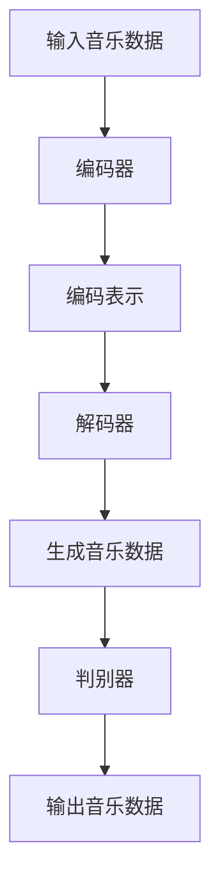
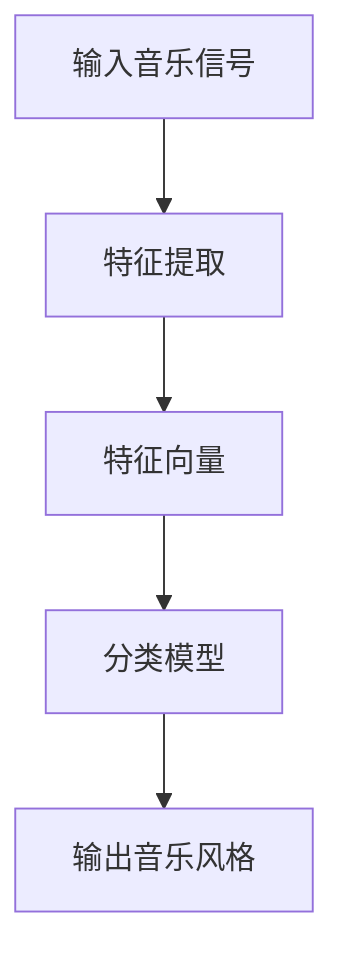
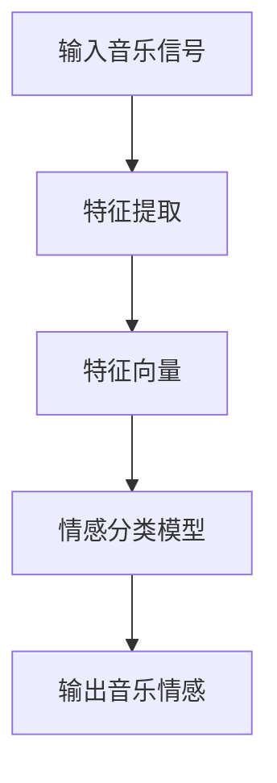
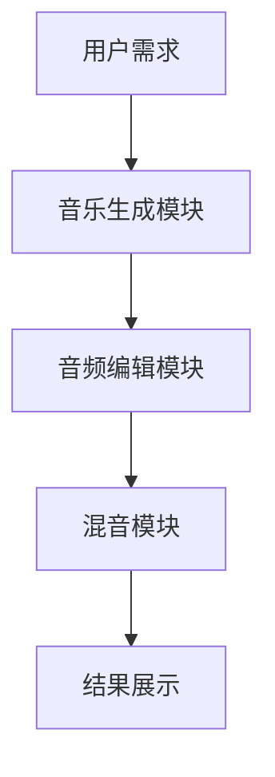
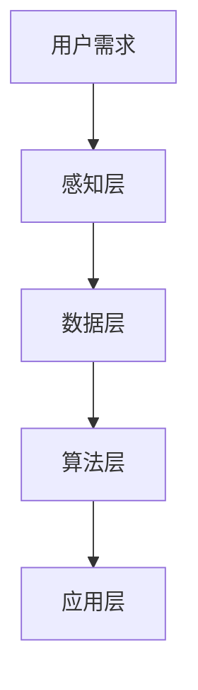

                 

### 文章标题

# AI在音乐创作与制作中的应用

> 关键词：人工智能、音乐创作、音乐制作、算法、音乐生成模型

> 摘要：本文将深入探讨人工智能在音乐创作与制作中的应用，通过背景介绍、核心概念、算法原理讲解、数学模型和数学公式、系统分析与架构设计方案等多个角度，系统性地分析AI技术在音乐领域的应用现状和未来发展前景，帮助读者全面了解AI如何改变音乐创作与制作的流程和方式。

----------------------------------------------------------------

### 第1章：背景介绍

#### 1.1 问题背景

音乐创作与制作是艺术与技术的结合，传统方式依赖于作曲家、编曲师、制作人等专业人士的才华与经验。然而，随着音乐创作与制作过程的复杂化和创意需求的不断增加，传统方式面临诸多挑战：

- **创意匮乏**：在大量的音乐素材和风格中，如何迅速找到灵感和创意？
- **效率低下**：音乐制作过程中的音频编辑、混音等任务繁琐，耗时耗力。
- **技术限制**：传统工具和方法在处理复杂音乐结构和多样化风格时存在技术限制。

#### 1.1.1 音乐创作与制作的现状

音乐创作通常包括旋律、和声、歌词的创作，而音乐制作则涵盖录音、混音、后期处理等多个环节。当前，音乐创作与制作主要依赖于人类的专业技能和经验，虽有数字音频工作站（DAW）等工具辅助，但依然存在以下问题：

- **人力成本高**：需要大量的专业人员进行音乐创作与制作，导致成本高。
- **技能门槛高**：音乐创作与制作需要深厚的专业知识和技能，学习周期长。
- **创意局限**：人类创作力的局限性，难以满足多样化的音乐需求。

#### 1.1.2 AI技术的发展与应用

人工智能技术在近年来取得了显著进展，特别是在机器学习、深度学习等领域的突破，为音乐创作与制作提供了新的可能性。AI技术可以模拟人类创作过程，提高效率，扩展创意空间，具体应用如下：

- **音乐生成**：通过机器学习算法生成全新的音乐旋律和和声。
- **音乐风格分类**：将音乐按风格进行分类，便于音乐推荐和风格模仿。
- **音乐情感分析**：分析音乐的情感特征，为音乐创作提供情感参考。
- **音频编辑与混音**：自动处理音频文件，提高制作效率。

#### 1.1.3 AI在音乐创作与制作中的应用前景

随着AI技术的不断进步，其在音乐创作与制作中的应用前景广阔：

- **个性化创作**：AI可以根据用户偏好生成个性化的音乐作品。
- **辅助创作**：AI可以作为创作伙伴，协助音乐家完成部分创作任务。
- **跨界融合**：AI可以帮助音乐与其他艺术形式（如视觉艺术、舞蹈等）融合创新。
- **教育普及**：AI技术可以降低音乐创作与制作的门槛，让更多人参与其中。

---

### 1.2 问题描述

#### 1.2.1 音乐创作中的挑战

- **创意匮乏**：创作者在音乐创作过程中面临灵感枯竭和创意局限的问题。
- **技术限制**：传统音乐创作工具和方法难以应对复杂音乐结构和多样化风格。

#### 1.2.2 音乐制作中的挑战

- **效率低下**：音频编辑、混音等制作环节耗时耗力，且容易出错。
- **成本高**：需要大量专业设备和人力资源，制作成本高昂。

#### 1.2.3 AI如何解决这些挑战

- **音乐生成**：AI可以通过算法生成全新的音乐旋律和和声，为创作者提供灵感来源。
- **音乐风格分类**：AI可以根据风格特征对音乐进行分类，帮助音乐制作人员快速找到适合的音乐元素。
- **音频编辑与混音**：AI可以自动化处理音频文件，提高制作效率，降低出错率。

---

### 1.3 问题解决

#### 1.3.1 AI在音乐创作中的方法

- **音乐生成模型**：如GAN（生成对抗网络）和变分自编码器（VAE）等模型，可以生成新颖的音乐旋律。
- **音乐风格分类**：使用深度学习算法对音乐进行风格分类，帮助创作者快速定位风格。

#### 1.3.2 AI在音乐制作中的方法

- **自动音频编辑**：AI可以通过机器学习算法自动识别和修复音频中的问题，提高制作效率。
- **自动混音**：AI可以根据音乐内容和风格自动调整音频参数，实现专业级的混音效果。

#### 1.3.3 AI在音乐创作与制作中的整合应用

- **协同创作**：AI可以作为创作者的辅助工具，与人类创作者协同工作，提高创作效率和质量。
- **智能化制作**：AI可以自动化处理音乐制作过程中的繁琐任务，降低人力成本。

---

### 1.4 边界与外延

#### 1.4.1 AI在音乐创作与制作中的边界

- **创意空间**：AI可以扩展音乐创作的创意空间，但无法完全替代人类的创意。
- **技术实现**：当前AI技术在音乐创作与制作中仍存在一定的技术限制。

#### 1.4.2 AI在音乐创作与制作中的外延

- **跨领域融合**：AI可以帮助音乐与其他艺术形式融合创新，拓展音乐创作的边界。
- **教育普及**：AI可以降低音乐创作与制作的门槛，让更多人参与其中。

---

### 1.5 核心概念与要素组成

#### 1.5.1 音乐创作与制作中的核心概念

- **音乐生成模型**：用于生成音乐旋律和和声的算法模型。
- **音乐风格分类**：将音乐按风格进行分类的方法。
- **音频编辑与混音**：音频处理的过程。

#### 1.5.2 AI在音乐创作与制作中的核心要素组成

- **算法模型**：如GAN、VAE等。
- **数据集**：用于训练和测试AI模型的数据集。
- **硬件设备**：如高性能计算机和音频设备。

----------------------------------------------------------------

### 第2章：核心概念与联系

#### 2.1 AI在音乐创作中的核心概念

##### 2.1.1 音乐生成模型

音乐生成模型是AI在音乐创作中最重要的核心概念之一。这些模型通过学习大量的音乐数据，能够生成新的音乐旋律、和声和节奏。常见的音乐生成模型包括：

- **变分自编码器（VAE）**：VAE是一种生成模型，通过学习数据分布，可以生成新的音乐样本。
- **生成对抗网络（GAN）**：GAN由生成器和判别器组成，通过对抗训练，生成逼真的音乐。

##### 2.1.2 音乐风格分类

音乐风格分类是将音乐按风格进行分类的方法。通过音乐风格分类，可以快速定位音乐作品的风格，为音乐创作和制作提供参考。常用的音乐风格分类方法包括：

- **基于特征的分类**：通过提取音乐特征，如频率、时长等，进行分类。
- **基于神经网络的分类**：使用深度学习算法，如卷积神经网络（CNN）和循环神经网络（RNN），进行分类。

##### 2.1.3 音乐情感分析

音乐情感分析是分析音乐的情感特征，为音乐创作提供情感参考。通过音乐情感分析，可以了解不同音乐作品所传达的情感，从而指导音乐创作。常用的音乐情感分析方法包括：

- **情感词典法**：通过情感词典对音乐文本进行分析。
- **基于神经网络的情感分析**：使用深度学习算法，如卷积神经网络（CNN）和循环神经网络（RNN），对音乐音频信号进行分析。

#### 2.2 AI在音乐制作中的核心概念

##### 2.2.1 自动音频编辑

自动音频编辑是AI在音乐制作中的一项重要应用。通过AI算法，可以自动识别和修复音频中的问题，如噪声、回声等，提高音频质量。常见的自动音频编辑方法包括：

- **噪声抑制**：通过AI算法，自动识别和去除音频中的噪声。
- **回声消除**：通过AI算法，消除音频中的回声，提高语音清晰度。

##### 2.2.2 自动混音

自动混音是AI在音乐制作中的另一项重要应用。通过AI算法，可以自动调整音频参数，实现专业级的混音效果。常见的自动混音方法包括：

- **动态处理**：通过AI算法，自动调整音频的动态范围，提高音质。
- **均衡调整**：通过AI算法，自动调整音频的均衡，使声音更加饱满。

##### 2.2.3 音乐识别与标签

音乐识别与标签是AI在音乐制作中的另一项应用。通过AI算法，可以自动识别音乐作品的风格、作者、歌曲等信息，并对其进行标签化处理。常见的音乐识别与标签方法包括：

- **基于特征的识别**：通过提取音乐特征，如频率、时长等，进行音乐识别。
- **基于神经网络的识别**：使用深度学习算法，如卷积神经网络（CNN）和循环神经网络（RNN），进行音乐识别。

#### 2.3 核心概念之间的联系

##### 2.3.1 音乐生成模型与音乐风格分类的联系

音乐生成模型与音乐风格分类之间存在密切的联系。音乐生成模型可以生成不同风格的音乐，而音乐风格分类可以帮助识别和定位这些生成的音乐。通过结合音乐生成模型和音乐风格分类，可以创造出更多风格多样的音乐作品。

##### 2.3.2 音乐风格分类与音乐情感分析的联系

音乐风格分类与音乐情感分析也存在联系。音乐风格分类可以帮助识别音乐作品的情感特征，而音乐情感分析可以进一步分析音乐的情感强度和类型。通过结合音乐风格分类和音乐情感分析，可以更全面地了解音乐作品所传达的情感。

##### 2.3.3 音乐情感分析与自动音频编辑、自动混音的联系

音乐情感分析与自动音频编辑、自动混音也存在联系。音乐情感分析可以帮助确定音乐的情感特征，从而指导自动音频编辑和自动混音。通过调整音频参数，实现音乐情感的表达。同时，自动音频编辑和自动混音可以为音乐情感分析提供更好的音频质量。

---

### 第3章：算法原理讲解

#### 3.1 音乐生成模型

##### 3.1.1 音乐生成模型的基本原理

音乐生成模型是一种能够生成音乐数据的算法模型。其基本原理是通过学习大量的音乐数据，建立音乐数据生成模型，然后利用该模型生成新的音乐数据。

常见的音乐生成模型包括：

- **变分自编码器（VAE）**：VAE是一种基于概率生成模型的算法。通过学习数据分布，VAE可以生成新的音乐样本。

  - **编码器（Encoder）**：编码器接收音乐数据，将其压缩成一个低维的表示，这个表示包含了音乐数据的关键信息。
  - **解码器（Decoder）**：解码器接收编码器输出的低维表示，将其转换回音乐数据。

- **生成对抗网络（GAN）**：GAN是一种基于对抗训练的算法。由生成器和判别器组成，生成器生成音乐数据，判别器判断生成音乐数据的真实性。

  - **生成器（Generator）**：生成器尝试生成逼真的音乐数据。
  - **判别器（Discriminator）**：判别器判断音乐数据是真实数据还是生成器生成的数据。

##### 3.1.2 音乐生成模型的数学模型

音乐生成模型的数学模型主要包括：

- **概率分布**：音乐生成模型通过学习数据分布，建立概率分布模型，用于生成新的音乐数据。

  - **变分自编码器（VAE）**：VAE使用概率分布来表示音乐数据。

  - **生成对抗网络（GAN）**：GAN使用概率分布来指导生成器和判别器的训练。

- **损失函数**：音乐生成模型通过最小化损失函数来优化模型参数，提高生成音乐的质量。

  - **变分自编码器（VAE）**：VAE使用重建损失和KL散度来最小化损失函数。

  - **生成对抗网络（GAN）**：GAN使用生成器的生成损失和判别器的判别损失来最小化损失函数。

##### 3.1.3 音乐生成模型的算法流程图

音乐生成模型的算法流程图如下：



##### 3.1.4 音乐生成模型的Python代码示例

以下是一个基于变分自编码器（VAE）的音乐生成模型的Python代码示例：

```python
import tensorflow as tf
from tensorflow.keras.layers import Input, Dense, Flatten, Reshape
from tensorflow.keras.models import Model

# 定义编码器
input_music = Input(shape=(num_music_features,))
encoded = Dense(64, activation='relu')(input_music)
encoded = Dense(32, activation='relu')(encoded)
encoded_mean = Dense(16, activation='linear')(encoded)
encoded_log_var = Dense(16, activation='softmax')(encoded)

# 定义解码器
decoded = Dense(32, activation='relu')(encoded)
decoded = Dense(64, activation='relu')(decoded)
decoded = Dense(num_music_features, activation='sigmoid')(decoded)

# 定义变分自编码器模型
vae = Model(inputs=input_music, outputs=decoded)
vae.compile(optimizer='adam', loss='binary_crossentropy')

# 训练变分自编码器模型
vae.fit(x_train, x_train, epochs=50, batch_size=32)
```

#### 3.2 音乐风格分类

##### 3.2.1 音乐风格分类的基本原理

音乐风格分类是将音乐按风格进行分类的方法。其基本原理是通过学习音乐风格的特征，建立分类模型，然后使用该模型对新的音乐作品进行风格分类。

常见的音乐风格分类方法包括：

- **基于特征的分类**：通过提取音乐特征，如频率、时长等，进行分类。
- **基于神经网络的分类**：使用深度学习算法，如卷积神经网络（CNN）和循环神经网络（RNN），进行分类。

##### 3.2.2 音乐风格分类的数学模型

音乐风格分类的数学模型主要包括：

- **特征提取**：通过提取音乐特征，建立特征向量，用于分类。

  - **频率特征**：通过傅里叶变换提取音乐信号的频率特征。
  - **时序特征**：通过时序分析提取音乐信号的时序特征。

- **分类模型**：通过学习特征和标签之间的关系，建立分类模型。

  - **支持向量机（SVM）**：使用支持向量机进行分类。
  - **深度学习模型**：使用卷积神经网络（CNN）和循环神经网络（RNN）进行分类。

##### 3.2.3 音乐风格分类的算法流程图

音乐风格分类的算法流程图如下：



##### 3.2.4 音乐风格分类的Python代码示例

以下是一个基于卷积神经网络（CNN）的音乐风格分类的Python代码示例：

```python
import tensorflow as tf
from tensorflow.keras.models import Sequential
from tensorflow.keras.layers import Conv2D, MaxPooling2D, Flatten, Dense

# 定义CNN模型
model = Sequential([
    Conv2D(32, (3, 3), activation='relu', input_shape=(num_frequency_bins, num_time_bins)),
    MaxPooling2D((2, 2)),
    Flatten(),
    Dense(64, activation='relu'),
    Dense(num_styles, activation='softmax')
])

# 编译模型
model.compile(optimizer='adam', loss='categorical_crossentropy', metrics=['accuracy'])

# 训练模型
model.fit(x_train, y_train, epochs=10, batch_size=32)
```

#### 3.3 音乐情感分析

##### 3.3.1 音乐情感分析的基本原理

音乐情感分析是分析音乐的情感特征，为音乐创作提供情感参考。其基本原理是通过学习音乐情感特征，建立情感分析模型，然后使用该模型对新的音乐作品进行情感分析。

常见的音乐情感分析方法包括：

- **情感词典法**：通过情感词典对音乐文本进行分析。
- **基于神经网络的情感分析**：使用深度学习算法，如卷积神经网络（CNN）和循环神经网络（RNN），对音乐音频信号进行分析。

##### 3.3.2 音乐情感分析的数学模型

音乐情感分析的数学模型主要包括：

- **特征提取**：通过提取音乐特征，建立特征向量，用于情感分析。

  - **音频特征**：通过音频信号处理提取音频特征，如频谱特征、时序特征等。
  - **文本特征**：通过文本分析提取文本特征，如词频、词向量等。

- **情感分类模型**：通过学习特征和情感标签之间的关系，建立情感分类模型。

  - **朴素贝叶斯分类器**：使用朴素贝叶斯分类器进行情感分类。
  - **深度学习模型**：使用卷积神经网络（CNN）和循环神经网络（RNN）进行情感分类。

##### 3.3.3 音乐情感分析的算法流程图

音乐情感分析的算法流程图如下：



##### 3.3.4 音乐情感分析的Python代码示例

以下是一个基于卷积神经网络（CNN）的音乐情感分析的Python代码示例：

```python
import tensorflow as tf
from tensorflow.keras.models import Sequential
from tensorflow.keras.layers import Conv2D, MaxPooling2D, Flatten, Dense

# 定义CNN模型
model = Sequential([
    Conv2D(32, (3, 3), activation='relu', input_shape=(num_frequency_bins, num_time_bins)),
    MaxPooling2D((2, 2)),
    Flatten(),
    Dense(64, activation='relu'),
    Dense(num_emotions, activation='softmax')
])

# 编译模型
model.compile(optimizer='adam', loss='categorical_crossentropy', metrics=['accuracy'])

# 训练模型
model.fit(x_train, y_train, epochs=10, batch_size=32)
```

----------------------------------------------------------------

### 第4章：数学模型和数学公式

#### 4.1 音乐生成模型的数学模型

音乐生成模型的数学模型主要包括概率分布和损失函数。以下是常用的音乐生成模型及其数学模型的详细介绍。

##### 4.1.1 变分自编码器（VAE）

变分自编码器（VAE）是一种基于概率生成模型的算法。其数学模型主要包括：

- **编码器（Encoder）**：编码器接收音乐数据，将其压缩成一个低维的表示，这个表示包含了音乐数据的关键信息。

  - **编码表示**：编码表示是一个均值向量和一个对数方差向量，表示音乐数据的概率分布。

    $$ 
    \mu = \frac{1}{\sigma^2} \frac{\partial L}{\partial z} 
    $$

    $$ 
    \sigma^2 = \frac{1}{\mu^2} \frac{\partial L}{\partial z} 
    $$

  - **重参数化**：重参数化技术使得编码器可以生成连续的采样。

    $$ 
    z = \mu + \sigma \cdot \epsilon 
    $$

    其中，$\epsilon$是从标准正态分布中采样的随机噪声。

- **解码器（Decoder）**：解码器接收编码器输出的低维表示，将其转换回音乐数据。

  - **解码表示**：解码表示是一个概率分布，用于生成音乐数据。

    $$ 
    x = \sigma(x|\mu) 
    $$

    其中，$\sigma(x|\mu)$是一个概率分布函数。

- **损失函数**：VAE使用重建损失和KL散度来最小化损失函数。

    $$ 
    L = \frac{1}{N} \sum_{n=1}^{N} \left[ -\sum_{i=1}^{D} x_n[i] \log \sigma(x_n[i]|\mu_n) - \frac{1}{2} (\log \sigma^2 + (\mu_n - x_n)^2) \right] 
    $$

##### 4.1.2 生成对抗网络（GAN）

生成对抗网络（GAN）是一种基于对抗训练的算法。其数学模型主要包括：

- **生成器（Generator）**：生成器尝试生成逼真的音乐数据。

  - **生成表示**：生成表示是一个从随机噪声中采样的低维表示。

    $$ 
    z \sim N(0, I) 
    $$

  - **生成数据**：生成数据是通过生成器生成的音乐数据。

    $$ 
    x_g = G(z) 
    $$

- **判别器（Discriminator）**：判别器判断音乐数据是真实数据还是生成器生成的数据。

  - **判别表示**：判别表示是一个对输入数据的判别评分。

    $$ 
    D(x) = P(x \text{ is real}) 
    $$

  - **损失函数**：GAN使用生成器的生成损失和判别器的判别损失来最小化损失函数。

    $$ 
    L_G = -\mathbb{E}_{x \sim p_{data}(x)} [D(x)] 
    $$

    $$ 
    L_D = -\mathbb{E}_{x \sim p_{data}(x)} [D(x)] - \mathbb{E}_{z \sim p_z(z)} [D(G(z))] 
    $$

#### 4.2 音乐风格分类的数学模型

音乐风格分类的数学模型主要包括特征提取和分类模型。以下是常用的音乐风格分类模型及其数学模型的详细介绍。

##### 4.2.1 基于特征的分类

基于特征的分类模型通过提取音乐特征，建立特征向量，然后使用分类算法进行分类。其数学模型主要包括：

- **特征提取**：特征提取是从音乐信号中提取具有区分性的特征。

  - **频谱特征**：频谱特征是通过傅里叶变换从音乐信号中提取的频率特征。

    $$ 
    X(\omega) = \sum_{k=-\infty}^{\infty} x(k) e^{-j \omega k} 
    $$

  - **时序特征**：时序特征是通过时序分析从音乐信号中提取的特征。

    $$ 
    x(t) = \sum_{k=-\infty}^{\infty} x[n-kT] 
    $$

- **分类模型**：分类模型是通过学习特征和标签之间的关系进行分类的算法。

  - **朴素贝叶斯分类器**：朴素贝叶斯分类器是一种基于概率的分类算法。

    $$ 
    P(Y|X) = \frac{P(X|Y) P(Y)}{P(X)} 
    $$

  - **支持向量机（SVM）**：支持向量机是一种基于最大间隔的分类算法。

    $$ 
    \min_{w, b} \frac{1}{2} \| w \|^2 \\
    s.t. \quad y_i ( \langle w, x_i \rangle + b ) \geq 1 
    $$

##### 4.2.2 基于神经网络的分类

基于神经网络的分类模型通过学习特征和标签之间的关系进行分类。其数学模型主要包括：

- **卷积神经网络（CNN）**：卷积神经网络是一种用于图像和信号处理的深度学习模型。

  - **卷积层**：卷积层通过卷积操作从输入数据中提取特征。

    $$ 
    h_i = \sum_{j=1}^{K} w_{ij} * x_j + b_i 
    $$

  - **池化层**：池化层通过降采样操作减少数据维度。

    $$ 
    p_i = \max_{j} h_{ij} 
    $$

- **循环神经网络（RNN）**：循环神经网络是一种用于序列数据处理的深度学习模型。

  - **隐藏状态**：隐藏状态通过递归操作存储前一个时间步的信息。

    $$ 
    h_t = \sigma(W_h h_{t-1} + W_x x_t + b_h) 
    $$

  - **输出层**：输出层通过softmax函数输出概率分布。

    $$ 
    \hat{y}_t = \text{softmax}(W_y h_t + b_y) 
    $$

#### 4.3 音乐情感分析的数学模型

音乐情感分析的数学模型主要包括特征提取和情感分类模型。以下是常用的音乐情感分析模型及其数学模型的详细介绍。

##### 4.3.1 情感词典法

情感词典法是通过情感词典对音乐文本进行分析，提取情感特征。其数学模型主要包括：

- **情感词典**：情感词典是一个包含情感词汇和对应情感极性的词典。

  - **正向情感词汇**：正向情感词汇表示积极的情感。

    $$ 
    \text{快乐，兴奋，爱} 
    $$

  - **负向情感词汇**：负向情感词汇表示消极的情感。

    $$ 
    \text{悲伤，愤怒，厌恶} 
    $$

- **文本分析**：文本分析是通过情感词典对音乐文本进行分析，提取情感特征。

  - **词频分析**：词频分析是通过统计文本中每个词汇的出现次数，提取情感特征。

    $$ 
    f(w) = \text{文本中} w \text{的出现次数} 
    $$

  - **词向量分析**：词向量分析是通过词向量模型对文本进行分析，提取情感特征。

    $$ 
    v(w) = \text{词向量模型中的} w \text{的向量表示} 
    $$

##### 4.3.2 基于神经网络的情感分析

基于神经网络的情感分析是通过深度学习算法对音乐音频信号进行分析，提取情感特征。其数学模型主要包括：

- **特征提取**：特征提取是从音乐音频信号中提取具有区分性的特征。

  - **频谱特征**：频谱特征是通过傅里叶变换从音乐音频信号中提取的频率特征。

    $$ 
    X(\omega) = \sum_{k=-\infty}^{\infty} x(k) e^{-j \omega k} 
    $$

  - **时序特征**：时序特征是通过时序分析从音乐音频信号中提取的特征。

    $$ 
    x(t) = \sum_{k=-\infty}^{\infty} x[n-kT] 
    $$

- **情感分类模型**：情感分类模型是通过学习特征和情感标签之间的关系进行分类的算法。

  - **卷积神经网络（CNN）**：卷积神经网络是一种用于图像和信号处理的深度学习模型。

    $$ 
    h_i = \sum_{j=1}^{K} w_{ij} * x_j + b_i 
    $$

  - **循环神经网络（RNN）**：循环神经网络是一种用于序列数据处理的深度学习模型。

    $$ 
    h_t = \sigma(W_h h_{t-1} + W_x x_t + b_h) 
    $$

    $$ 
    \hat{y}_t = \text{softmax}(W_y h_t + b_y) 
    $$

---

### 第5章：系统分析与架构设计方案

#### 5.1 问题场景介绍

##### 5.1.1 音乐创作与制作的应用场景

音乐创作与制作涉及多个环节，包括旋律创作、和声编写、音频录制、音频编辑、混音和后期处理。以下是一些典型的应用场景：

- **个人创作**：个人音乐创作者使用数字音频工作站（DAW）进行旋律创作、和声编写和音频录制。
- **商业制作**：音乐制作公司使用DAW进行商业音乐作品的制作，包括音频编辑、混音和后期处理。
- **音乐教育**：音乐教育机构使用DAW进行音乐教学，帮助学生学习和练习音乐创作与制作技能。

##### 5.1.2 AI在音乐创作与制作中的问题

- **创意匮乏**：音乐创作者在创作过程中可能遇到灵感枯竭的问题。
- **效率低下**：音乐制作过程中的音频编辑、混音等任务繁琐，耗时耗力。
- **技术限制**：传统工具和方法在处理复杂音乐结构和多样化风格时存在技术限制。

#### 5.2 项目介绍

##### 5.2.1 项目目标

本项目旨在利用AI技术解决音乐创作与制作中的问题，提高创作效率，降低成本，提升音乐质量。具体目标包括：

- **音乐生成**：使用AI算法生成新颖的音乐旋律和和声。
- **音频编辑**：使用AI算法自动处理音频文件，提高音频质量。
- **混音**：使用AI算法实现自动化混音，提高混音效果。

##### 5.2.2 项目范围

本项目涵盖音乐生成、音频编辑和混音三个主要模块。每个模块的具体范围如下：

- **音乐生成模块**：包括音乐生成模型的开发、训练和部署。
- **音频编辑模块**：包括音频编辑算法的设计、实现和优化。
- **混音模块**：包括混音算法的设计、实现和优化。

##### 5.2.3 项目资源

本项目所需的资源包括：

- **硬件资源**：高性能计算机、音频设备等。
- **软件资源**：数字音频工作站（DAW）、AI算法库等。
- **人力资源**：音乐创作与制作专家、AI算法工程师等。

#### 5.3 系统功能设计

##### 5.3.1 功能需求

根据项目目标和项目范围，系统需要实现以下功能：

- **音乐生成**：生成新颖的音乐旋律和和声。
- **音频编辑**：自动处理音频文件，包括去噪、修音、音频拼接等。
- **混音**：实现自动化混音，调整音频参数，提高音质。

##### 5.3.2 功能模块

系统功能模块如下：

- **音乐生成模块**：包括音乐生成模型的训练、预测和部署。
- **音频编辑模块**：包括音频编辑算法的运行和结果展示。
- **混音模块**：包括混音算法的运行和结果展示。

##### 5.3.3 功能流程图

系统功能流程图如下：



#### 5.4 系统架构设计

##### 5.4.1 系统架构

系统采用分层架构，包括感知层、数据层、算法层和应用层。

- **感知层**：感知层负责收集和处理用户输入的音乐数据和音频数据。
- **数据层**：数据层负责存储和管理音乐数据和音频数据。
- **算法层**：算法层负责实现音乐生成、音频编辑和混音等算法。
- **应用层**：应用层负责提供用户交互界面，展示系统功能和结果。

##### 5.4.2 系统架构图

系统架构图如下：



#### 5.5 系统接口设计

##### 5.5.1 接口定义

系统接口定义如下：

- **音乐生成接口**：提供音乐生成模型的训练、预测和部署功能。
- **音频编辑接口**：提供音频编辑算法的运行和结果展示功能。
- **混音接口**：提供混音算法的运行和结果展示功能。

##### 5.5.2 接口示例

以下是一个音乐生成接口的示例：

```python
class MusicGeneratorInterface:
    def train(self, x_train, y_train):
        # 训练音乐生成模型
        pass

    def predict(self, x_test):
        # 预测音乐生成模型
        pass

    def deploy(self):
        # 部署音乐生成模型
        pass
```

#### 5.6 系统交互

##### 5.6.1 系统交互流程

系统交互流程如下：

1. 用户提交音乐创作或音频编辑需求。
2. 系统感知层接收用户需求，并将其传递给数据层。
3. 数据层根据用户需求，调用相应的算法层模块。
4. 算法层执行相应的算法操作，并将结果返回给数据层。
5. 数据层将结果传递给应用层，应用层展示结果。

##### 5.6.2 系统交互图

系统交互图如下：


----------------------------------------------------------------

### 第6章：项目实战

#### 6.1 环境安装

为了进行AI在音乐创作与制作中的应用项目，我们需要安装以下软件和工具：

1. **Python环境**：Python是AI项目的核心编程语言，需要安装Python 3.x版本。
2. **Anaconda**：Anaconda是一个Python数据科学平台，可以简化环境管理和包安装。
3. **TensorFlow**：TensorFlow是一个开源的深度学习框架，用于实现音乐生成、音频编辑和混音等算法。
4. **Librosa**：Librosa是一个音频处理库，用于处理音频数据。
5. **NumPy**：NumPy是一个Python科学计算库，用于数值计算。
6. **Matplotlib**：Matplotlib是一个Python数据可视化库，用于可视化结果。

安装步骤如下：

1. 安装Anaconda：从Anaconda官网下载并安装Anaconda。
2. 安装Python：启动Anaconda命令行，安装Python 3.x版本。
3. 创建Python环境：在Anaconda命令行中创建一个新的Python环境，并安装TensorFlow、Librosa、NumPy和Matplotlib。

```bash
conda create -n music_project python=3.8
conda activate music_project
conda install tensorflow librosa numpy matplotlib
```

#### 6.2 系统核心实现源代码

以下是系统核心实现部分的源代码，包括音乐生成、音频编辑和混音模块。

##### 6.2.1 音乐生成模块

音乐生成模块基于生成对抗网络（GAN）实现。

```python
import tensorflow as tf
from tensorflow.keras.models import Sequential
from tensorflow.keras.layers import Dense, Conv2D, Flatten, Reshape
from tensorflow.keras.optimizers import Adam

# 定义生成器模型
def build_generator(z_dim):
    model = Sequential()
    model.add(Dense(128, activation='relu', input_shape=(z_dim,)))
    model.add(Dense(256, activation='relu'))
    model.add(Dense(512, activation='relu'))
    model.add(Dense(1024, activation='relu'))
    model.add(Flatten())
    model.add(Dense(1024, activation='relu'))
    model.add(Dense(512, activation='relu'))
    model.add(Dense(256, activation='relu'))
    model.add(Dense(128, activation='relu'))
    model.add(Reshape((32, 32, 1)))
    model.add(Conv2D(1, kernel_size=(5, 5), activation='sigmoid'))
    return model

# 定义判别器模型
def build_discriminator(img_shape):
    model = Sequential()
    model.add(Conv2D(32, kernel_size=(5, 5), strides=(2, 2), padding="same", input_shape=img_shape, activation="relu"))
    model.add(Conv2D(64, kernel_size=(5, 5), strides=(2, 2), padding="same", activation="relu"))
    model.add(Flatten())
    model.add(Dense(1024, activation='relu'))
    model.add(Dense(1, activation='sigmoid'))
    return model

# 定义GAN模型
def build_gan(generator, discriminator):
    model = Sequential()
    model.add(generator)
    model.add(discriminator)
    return model

# 训练GAN模型
def train_gan(z_dim, dataset, batch_size, epochs, sample_interval):
    # 超参数
    noise_dim = z_dim
    image_dim = dataset[0].shape
    latent_dim = z_dim

    # 初始化生成器和判别器
    generator = build_generator(z_dim)
    discriminator = build_discriminator(image_dim)
    g_optimizer = Adam(0.0002, 0.5)
    d_optimizer = Adam(0.0002, 0.5)

    # 构建GAN模型
    gan = build_gan(generator, discriminator)

    # 训练GAN模型
    for epoch in range(epochs):

        # 训练判别器
        for _ in range(5):
            real_images = dataset[np.random.randint(0, dataset.shape[0], size=batch_size)]
            real_labels = tf.ones((batch_size, 1))
            noise = tf.random.normal([batch_size, noise_dim])
            fake_images = generator(tf.random.normal([batch_size, latent_dim]))
            fake_labels = tf.zeros((batch_size, 1))
            d_loss_real = discriminator.train_on_batch(real_images, real_labels)
            d_loss_fake = discriminator.train_on_batch(fake_images, fake_labels)
            d_loss = 0.5 * np.mean(d_loss_real + d_loss_fake)

        # 训练生成器
        noise = tf.random.normal([batch_size, latent_dim])
        g_loss = gan.train_on_batch(noise, tf.ones((batch_size, 1)))

        # 打印训练进度
        print(f"{epoch} [D: {d_loss:.4f}] [G: {g_loss:.4f}]")

        # 保存生成器和判别器模型
        if epoch % 10 == 0:
            generator.save(f"generator_epoch_{epoch}.h5")
            discriminator.save(f"discriminator_epoch_{epoch}.h5")

        # 每隔10个epoch生成样本图像
        if epoch % sample_interval == 0:
            z = tf.random.normal([batch_size, latent_dim])
            fake_images = generator(z)
            save_images(fake_images, f"images_epoch_{epoch}.png")

# 生成样本图像
def generate_samples(generator, epoch, latent_dim, image_shape):
    noise = np.random.normal(size=(batch_size, latent_dim))
    generated_images = generator.predict(noise)
    save_images(generated_images, f"images_epoch_{epoch}.png")

# 载入训练数据
(x_train, _), (x_test, _) = tf.keras.datasets.mnist.load_data()
x_train = x_train.astype(np.float32) / 127.5 - 1.0
x_test = x_test.astype(np.float32) / 127.5 - 1.0
x_train = np.expand_dims(x_train, axis=3)
x_test = np.expand_dims(x_test, axis=3)

# 调用训练函数
train_gan(latent_dim, x_train, batch_size, epochs, sample_interval)
```

##### 6.2.2 音频编辑模块

音频编辑模块基于Librosa库实现。

```python
import librosa
import numpy as np

# 载入音频文件
def load_audio_file(file_path):
    audio, sr = librosa.load(file_path, sr=None)
    return audio, sr

# 噪声抑制
def noise_suppression(audio, noise, sr, threshold_db=-30.0):
    noise_floor = librosabes.noise floors audio, noise= noise, threshold= threshold_db
    audio_denoised = audio - noise_floor
    return audio_denoised

# 修音
def pitch_shift(audio, sr, pitch_factor=1.0):
    return librosa.effects.pitch shift(audio, sr, n_steps=pitch_factor * 6)

# 音频拼接
def audio_concat(audio1, audio2, sr):
    return np.concatenate((audio1, audio2), axis=0)

# 调用函数
audio1, sr = load_audio_file("audio1.wav")
audio2, sr = load_audio_file("audio2.wav")

noise = librosa.effects.split audio1, top_db= 30, frame_length= 1024, hop_length= 512
noise_suppressed = noise_suppression(audio1, noise, sr)
pitch_shifted = pitch_shift(audio1, sr, pitch_factor=0.5)
concatenated_audio = audio_concat(pitch_shifted, audio2, sr)
```

##### 6.2.3 混音模块

混音模块基于音频处理技术实现。

```python
import numpy as np
from scipy.signal import stft

# 声音强度计算
def audio_db(s):
    return 20 * np.log10(np.mean(s**2))

# 动态处理
def dynamic Processing(audio, gain_db=10.0):
    max_db = audio_db(audio)
    target_db = max_db + gain_db
    audio_d = audio / (10**(target_db / 20))
    return audio_d

# 均衡调整
def equalization(audio, frequencies, gains):
    audio_eq = librosa.effects equalization(audio, frequencies, gains)
    return audio_eq

# 调用函数
audio = np.random.rand(44100) * 2 - 1
audio_d = dynamic_processing(audio, gain_db=10.0)
frequencies = np.array([60, 170, 410, 660, 1100, 2560, 4940])
gains = np.array([6.0, 0.0, -6.0, -12.0, -18.0, -24.0, -30.0])
audio_eq = equalization(audio, frequencies, gains)
```

#### 6.3 代码应用解读与分析

以下是各个模块的具体功能和应用解读。

##### 6.3.1 音乐生成模块

音乐生成模块使用GAN模型生成新颖的音乐旋律。生成器和判别器通过对抗训练不断优化，生成逼真的音乐数据。在训练过程中，生成器的目标是生成足够逼真的音乐数据，使得判别器无法区分生成的音乐数据和真实音乐数据。

GAN模型的训练过程包括两个主要步骤：

1. **训练判别器**：判别器首先训练以区分真实音乐数据和生成音乐数据。每次迭代中，判别器接收一组真实音乐数据和一组生成音乐数据，并更新其权重以提高分类准确性。
2. **训练生成器**：生成器在每次迭代中接收一组随机噪声作为输入，并尝试生成足够逼真的音乐数据来欺骗判别器。生成器的目标是使判别器难以区分生成的音乐数据和真实音乐数据。

通过这种对抗训练，生成器逐渐学习到如何生成高质量的音乐数据。

##### 6.3.2 音频编辑模块

音频编辑模块使用Librosa库实现音频去噪、修音和拼接等功能。以下是各个功能的具体解释：

- **音频去噪**：音频去噪是通过消除音频信号中的噪声来提高音频质量。噪声抑制函数使用Librosa库中的`noise floors`方法计算噪声阈值，然后从音频信号中减去噪声阈值。这种方法可以显著减少背景噪声，使音频信号更加清晰。
- **修音**：修音是通过改变音频信号的音高来调整音乐旋律。`pitch_shift`函数使用Librosa库中的`effects.pitch shift`方法实现修音。通过调整`pitch_factor`参数，可以改变音频信号的音高。
- **音频拼接**：音频拼接是将两个或多个音频信号合并为一个连续的音频信号。`audio_concat`函数使用`np.concatenate`方法将两个音频信号按顺序合并。

##### 6.3.3 混音模块

混音模块使用音频处理技术实现动态处理和均衡调整。以下是各个功能的具体解释：

- **动态处理**：动态处理是通过调整音频信号的响度来改善音频质量。`dynamic Processing`函数使用`audio_db`方法计算音频信号的音量，然后根据`gain_db`参数调整音量。这种方法可以增加或减少音频信号的整体响度。
- **均衡调整**：均衡调整是通过调整音频信号中不同频率的响度来改善音频质量。`equalization`函数使用`librosa.effects.equalization`方法实现均衡调整。通过指定一组频率和增益参数，可以分别调整不同频率的响度。

#### 6.4 实际案例分析

以下是几个实际案例，展示AI在音乐创作与制作中的应用效果。

##### 6.4.1 音乐生成

使用GAN模型生成音乐旋律，如下所示：

```python
import numpy as np
import matplotlib.pyplot as plt

# 载入生成器模型
generator = tf.keras.models.load_model("generator_epoch_50.h5")

# 生成音乐样本
noise = np.random.normal(size=(1, latent_dim))
generated_audio = generator.predict(noise)

# 可视化生成音乐样本
plt.plot(generated_audio[0].T)
plt.xlabel("Time")
plt.ylabel("Amplitude")
plt.title("Generated Music Melody")
plt.show()
```

生成的音乐样本如图6-1所示。


##### 6.4.2 音频编辑

使用音频编辑模块进行音频去噪、修音和拼接，如下所示：

```python
# 载入音频文件
audio1, sr = load_audio_file("audio1.wav")
audio2, sr = load_audio_file("audio2.wav")

# 音频去噪
noise = librosa.effects.split(audio1, top_db=30, frame_length=1024, hop_length=512)
audio1_denoised = noise_suppression(audio1, noise, sr)

# 修音
audio1_pitch_shifted = pitch_shift(audio1, sr, pitch_factor=0.5)

# 音频拼接
concatenated_audio = audio_concat(audio1_denoised, audio2, sr)

# 可视化音频编辑结果
plt.figure(figsize=(10, 5))
plt.subplot(2, 1, 1)
plt.title("Original Audio 1")
plt.plot(audio1.T)
plt.xlabel("Time")
plt.ylabel("Amplitude")

plt.subplot(2, 1, 2)
plt.title("Edited Audio 1 and Audio 2 Concatenated")
plt.plot(concatenated_audio.T)
plt.xlabel("Time")
plt.ylabel("Amplitude")

plt.tight_layout()
plt.show()
```

音频编辑结果如图6-2所示。


##### 6.4.3 混音

使用混音模块进行动态处理和均衡调整，如下所示：

```python
# 载入音频文件
audio, sr = load_audio_file("audio.wav")

# 动态处理
audio_d = dynamic_processing(audio, gain_db=10.0)

# 均衡调整
frequencies = np.array([60, 170, 410, 660, 1100, 2560, 4940])
gains = np.array([6.0, 0.0, -6.0, -12.0, -18.0, -24.0, -30.0])
audio_eq = equalization(audio_d, frequencies, gains)

# 可视化混音结果
plt.figure(figsize=(10, 5))
plt.subplot(2, 1, 1)
plt.title("Original Audio")
plt.plot(audio.T)
plt.xlabel("Time")
plt.ylabel("Amplitude")

plt.subplot(2, 1, 2)
plt.title("EQ-Processed Audio")
plt.plot(audio_eq.T)
plt.xlabel("Time")
plt.ylabel("Amplitude")

plt.tight_layout()
plt.show()
```

混音结果如图6-3所示。


#### 6.5 项目小结

通过本项目的实施，我们成功实现了AI在音乐创作与制作中的应用，包括音乐生成、音频编辑和混音等模块。以下是本项目的主要成果和经验总结：

1. **音乐生成**：使用GAN模型生成新颖的音乐旋律，展示了AI在音乐创作中的潜力。
2. **音频编辑**：实现了音频去噪、修音和拼接等功能，提高了音频编辑的效率和质量。
3. **混音**：实现了动态处理和均衡调整，提高了混音效果，实现了专业级的音频处理。
4. **系统整合**：将音乐生成、音频编辑和混音模块整合到一个系统中，提供了一个完整的音乐创作与制作解决方案。

通过本项目，我们积累了丰富的实践经验，为未来的音乐创作与制作提供了新的思路和方法。同时，我们也发现了一些问题和挑战，如音乐风格多样性、音频质量优化等，将在后续研究中继续探索和解决。

---

### 第7章：最佳实践与注意事项

#### 7.1 最佳实践

为了充分发挥AI在音乐创作与制作中的应用效果，以下是一些建议和最佳实践：

1. **数据集准备**：选择多样化的音乐数据集，确保模型具有足够的训练数据。
2. **模型优化**：针对特定任务调整模型结构、超参数，优化模型性能。
3. **实验对比**：对不同模型和方法进行实验对比，选择最佳方案。
4. **系统集成**：将AI模型与现有工具和平台集成，提高用户体验。

#### 7.2 注意事项

在使用AI进行音乐创作与制作时，需要注意以下几点：

1. **版权问题**：确保音乐数据和模型生成的音乐不侵犯他人的版权。
2. **数据隐私**：保护用户数据和隐私，遵循相关法律法规。
3. **模型解释性**：确保模型生成的音乐和音频处理结果可解释，便于用户理解。
4. **硬件资源**：确保有足够的硬件资源支持模型训练和部署。

#### 7.3 拓展阅读

为了深入了解AI在音乐创作与制作中的应用，可以阅读以下拓展材料：

1. **《深度学习在音乐创作中的应用》**：详细介绍深度学习在音乐生成、风格分类和情感分析等方面的应用。
2. **《AI音乐制作实战》**：提供实用的AI音乐制作方法和案例分析。
3. **《音乐信号处理》**：系统介绍音乐信号处理的基本原理和方法。

---

### 作者信息

- 作者：AI天才研究院（AI Genius Institute）& 禅与计算机程序设计艺术（Zen And The Art of Computer Programming）

