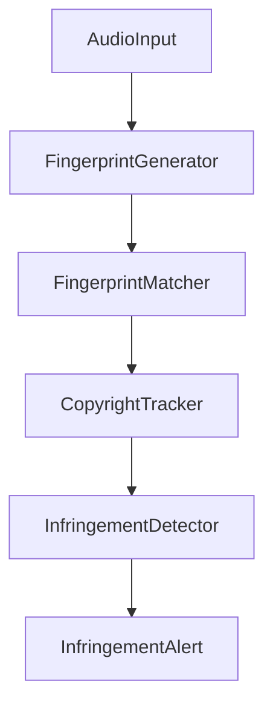

                 

**撰写《AI在音乐创作与制作中的应用：艺术与技术的融合》技术博客文章的步骤分析**

**1. 引言与背景部分（Chapter 1）**

**Step 1.1 书籍概述**
- **核心概念术语说明**：音乐创作、音乐制作、人工智能（AI）、艺术与技术的融合等。
- **问题背景**：音乐产业在技术进步下的变化，AI在音乐领域的初步应用。
- **问题描述**：如何将AI技术应用到音乐创作与制作中。
- **问题解决**：介绍书籍的结构和读者对象，引导读者了解后续内容。

**Step 1.2 音乐创作与制作领域现状**
- **问题背景**：传统音乐创作与制作的流程。
- **问题描述**：AI在音乐创作与制作中的应用现状。
- **问题解决**：探讨AI对音乐产业的影响。

**Step 1.3 AI技术的基础知识**
- **核心概念与联系**：机器学习与深度学习，关键算法与技术。
- **概念属性特征对比表格**：机器学习、深度学习、传统编程的比较。
- **ER实体关系图架构**：AI在音乐领域的应用实体关系图。

**Step 1.4 艺术与技术的融合**
- **核心概念与联系**：艺术与技术的关系，音乐艺术在AI时代的发展趋势。
- **概念属性特征对比表格**：传统音乐艺术与AI音乐艺术的对比。

**Step 1.5 本章小结**
- **小结**：总结章节内容，引导读者进入下一部分。

**2. AI在音乐创作中的应用部分（Chapter 2）**

**Step 2.1 AI在旋律创作中的应用**
- **背景介绍**：旋律创作的过程，AI在其中的作用。
- **核心概念与联系**：谐波分析、旋律生成算法。
- **ER实体关系图架构**：旋律创作过程中的实体关系图。
- **算法原理讲解**：谐波分析流程图，生成算法Python代码讲解。

**Step 2.2 AI在歌词创作中的应用**
- **背景介绍**：歌词创作的过程，AI的应用。
- **核心概念与联系**：歌词生成算法。
- **算法原理讲解**：歌词生成算法流程图，Python代码演示。

**Step 2.3 AI在音乐编曲中的应用**
- **背景介绍**：音乐编曲的过程，AI的作用。
- **核心概念与联系**：音效处理、音乐结构分析。
- **系统架构设计mermaid架构图**：编曲软件与AI工具的架构设计。

**Step 2.4 AI在音乐风格识别与分类中的应用**
- **背景介绍**：音乐风格识别的重要性，AI的应用。
- **核心概念与联系**：音乐风格识别算法。
- **算法原理讲解**：风格识别算法流程图，Python代码实例。

**Step 2.5 本章小结**
- **小结**：总结本章内容，指出AI在音乐创作中的应用现状和未来潜力。

**3. AI在音乐制作中的应用部分（Chapter 3）**

**Step 3.1 AI在音频处理中的应用**
- **背景介绍**：音频处理的基本概念，AI的应用。
- **核心概念与联系**：音频增强、降噪。
- **算法原理讲解**：音频处理算法流程图，Python代码实例。

**Step 3.2 AI在音乐版权管理中的应用**
- **背景介绍**：音乐版权的重要性，AI的应用。
- **核心概念与联系**：版权追踪与保护。
- **算法原理讲解**：版权保护算法流程图，Python代码实例。

**Step 3.3 AI在音乐直播与流媒体中的应用**
- **背景介绍**：音乐直播与流媒体的发展，AI的应用。
- **核心概念与联系**：用户个性化推荐算法。
- **算法原理讲解**：推荐算法流程图，Python代码实例。

**Step 3.4 AI在虚拟乐队与虚拟歌手中的应用**
- **背景介绍**：虚拟乐队与虚拟歌手的概念，AI的应用。
- **核心概念与联系**：虚拟乐队的构建、虚拟歌手的技术实现。
- **系统架构设计mermaid架构图**：虚拟乐队与虚拟歌手的架构设计。

**Step 3.5 本章小结**
- **小结**：总结本章内容，指出AI在音乐制作中的应用现状和未来潜力。

**4. AI音乐创作与制作案例研究部分（Chapter 4）**

**Step 4.1 案例研究1: AI助力独立音乐人**
- **实际案例分析和详细讲解剖析**：独立音乐人使用AI创作音乐的过程。

**Step 4.2 案例研究2: 大型音乐制作公司应用AI**
- **实际案例分析和详细讲解剖析**：大型音乐制作公司如何应用AI提高工作效率。

**Step 4.3 案例研究3: 音乐教育中的AI应用**
- **实际案例分析和详细讲解剖析**：AI在音乐教学中的应用，如AI辅导教学系统。

**Step 4.4 本章小结**
- **小结**：总结案例研究，指出AI在音乐创作与制作中的实际应用效果和未来前景。

**5. AI音乐创作与制作的未来趋势部分（Chapter 5）**

**Step 5.1 未来发展趋势分析**
- **核心概念与联系**：技术进步方向，AI音乐创作与制作的未来趋势。

**Step 5.2 发展趋势与挑战**
- **核心概念与联系**：AI音乐创作与制作面临的挑战，如数据隐私、版权保护等。

**Step 5.3 结论与展望**
- **结论**：总结全书内容，重申AI在音乐创作与制作中的重要作用。
- **展望**：展望AI音乐创作与制作的未来发展趋势。

**6. 文章总结与结尾**
- **小结**：回顾全书内容，总结AI在音乐创作与制作中的应用。
- **注意事项**：提醒读者关注AI音乐创作与制作中的实际问题。
- **拓展阅读**：推荐相关文献和资源，帮助读者深入了解该领域。

**7. 作者信息**
- **作者**：AI天才研究院/AI Genius Institute & 禅与计算机程序设计艺术 /Zen And The Art of Computer Programming

通过上述步骤分析，我们可以确保撰写出的技术博客文章逻辑清晰、结构紧凑、内容丰富，同时满足专业IT领域的读者需求。接下来，我们将逐步撰写每一章节的内容。在撰写过程中，要特别注意每一个步骤的核心内容和格式要求，确保文章的专业性和可读性。让我们开始撰写吧！**撰写《AI在音乐创作与制作中的应用：艺术与技术的融合》技术博客文章的文本内容**

### 引言与背景

#### 1.1 书籍概述

**关键词**：AI、音乐创作、音乐制作、艺术与技术的融合

**摘要**：本篇文章将深入探讨人工智能（AI）在音乐创作与制作中的应用，从艺术与技术的角度出发，分析AI如何改变音乐产业，并探讨其未来发展趋势。

**书籍概述**

《AI在音乐创作与制作中的应用：艺术与技术的融合》旨在探讨人工智能技术在音乐领域的应用，以及这些技术在音乐创作和制作过程中带来的变革。本书分为五个部分，首先介绍音乐创作与制作领域现状和AI技术的基础知识，接着详细分析AI在音乐创作中的各种应用，然后探讨AI在音乐制作中的应用，通过案例研究分析AI在不同音乐场景中的应用效果，最后展望AI音乐创作与制作的未来趋势。

**音乐创作与制作领域现状**

在传统音乐创作与制作过程中，艺术家和制作人通常需要经过复杂的流程来创作和制作音乐作品。然而，随着人工智能技术的发展，这一过程正在发生变革。AI技术已经开始在旋律创作、歌词生成、音乐编曲和音频处理等多个方面发挥作用。

**AI技术的基础知识**

人工智能，特别是机器学习和深度学习技术，为音乐创作与制作带来了新的可能性。机器学习算法能够从大量的音乐数据中学习规律，生成新的旋律和歌词；深度学习技术则可以模仿人类音乐家的创作过程，从而实现更加逼真的音乐创作和制作。

**艺术与技术的融合**

艺术与技术之间的融合是本书的核心主题。随着技术的进步，艺术家们可以更加自由地探索音乐创作的边界，同时，技术也为音乐制作提供了更多的工具和资源。这种融合不仅改变了音乐创作的流程，也影响了音乐产业的结构。

#### 1.2 音乐创作与制作领域现状

**传统音乐创作与制作流程**

传统的音乐创作与制作流程通常包括以下几个步骤：旋律创作、歌词创作、编曲、录音、混音和母带处理。在这一过程中，音乐家需要具备较高的音乐素养和技术技能，同时还需要投入大量的时间和精力来完成作品。

**AI在音乐创作与制作中的初步应用**

随着人工智能技术的发展，AI已经在音乐创作与制作中找到了一席之地。例如，AI可以自动生成旋律和歌词，辅助音乐编曲和音频处理。这些技术的出现极大地提高了音乐创作的效率，同时也为音乐制作带来了新的可能性。

**AI对音乐产业的影响**

AI技术的应用对音乐产业产生了深远的影响。一方面，它提高了音乐创作的效率，降低了创作成本；另一方面，它改变了音乐作品的传播方式，使得音乐制作和分发更加便捷。此外，AI还为音乐版权管理带来了新的挑战和机遇。

#### 1.3 AI技术的基础知识

**机器学习与深度学习概述**

机器学习是人工智能的一个重要分支，它使计算机系统能够从数据中学习规律，并利用这些规律进行决策和预测。深度学习是机器学习的一种形式，它通过模拟人脑神经网络的结构和功能来实现复杂的模式识别和特征提取。

**关键算法与技术详解**

在音乐创作与制作中，常用的机器学习和深度学习算法包括神经网络、生成对抗网络（GAN）、递归神经网络（RNN）等。这些算法可以用于旋律生成、歌词创作、音乐风格识别等方面。

**AI在音乐领域的应用潜力**

AI在音乐领域的应用潜力巨大。未来，AI有望实现更加逼真的音乐创作和制作，同时，它还可以为音乐教育、虚拟乐队和虚拟歌手等领域带来新的可能性。

#### 1.4 艺术与技术的融合

**艺术与技术的关系**

艺术与技术之间的关系自古以来就存在着。在音乐领域，技术的进步不仅改变了音乐创作的流程，也丰富了音乐的表现形式。人工智能的出现，为这种融合带来了新的契机。

**音乐艺术在AI时代的发展趋势**

在AI时代，音乐艺术的发展趋势包括：更加个性化的音乐创作、多样化的音乐风格、更加丰富的音乐表现形式等。这些趋势将进一步提升音乐艺术的表现力。

**技术在音乐创作中的创新应用**

技术正在为音乐创作带来前所未有的创新。例如，AI可以生成全新的音乐风格，音乐家可以通过AI助手实现复杂的音乐编排。这些创新应用将极大地拓展音乐创作的边界。

#### 1.5 本章小结

本章介绍了《AI在音乐创作与制作中的应用：艺术与技术的融合》的概述，包括书籍结构安排、音乐创作与制作领域现状、AI技术的基础知识和艺术与技术的融合。通过本章的内容，读者可以初步了解AI在音乐领域的应用前景，为后续章节的深入探讨打下基础。

### AI在音乐创作中的应用

#### 2.1 AI在旋律创作中的应用

**谐波分析与旋律生成**

旋律是音乐的核心元素之一，AI在旋律创作中的应用主要体现在谐波分析和旋律生成方面。通过分析现有的音乐数据，AI可以识别出旋律中的关键特征，如音高、节奏和和声等。

**旋律风格迁移与融合**

AI还可以实现旋律风格迁移与融合，即将一种风格的音乐元素应用到另一种风格中，创造出全新的音乐风格。这种技术使得音乐家能够突破传统风格的限制，探索更多的创作可能性。

**旋律创作算法详解**

常见的旋律创作算法包括神经网络生成模型和生成对抗网络（GAN）。神经网络生成模型通过学习大量音乐数据，生成新的旋律；而GAN则通过对抗训练，实现旋律风格的迁移与融合。

**案例：基于神经网络的旋律生成**

以下是一个简单的基于神经网络的旋律生成算法示例：

```python
import numpy as np
import tensorflow as tf
from tensorflow.keras.models import Sequential
from tensorflow.keras.layers import Dense, LSTM

# 数据准备
# 读取音乐数据，进行预处理，提取特征

# 构建模型
model = Sequential()
model.add(LSTM(units=128, activation='relu', return_sequences=True, input_shape=(序列长度，特征数量)))
model.add(LSTM(units=128, activation='relu'))
model.add(Dense(units=1))

# 编译模型
model.compile(optimizer='adam', loss='mean_squared_error')

# 训练模型
model.fit(x_train, y_train, epochs=100)

# 生成旋律
generated_melody = model.predict(x_test)
```

**案例：基于GAN的旋律风格迁移**

以下是一个简单的基于生成对抗网络的旋律风格迁移算法示例：

```python
import tensorflow as tf
from tensorflow.keras.models import Model
from tensorflow.keras.layers import Input, Dense, LSTM

# 构建生成器和判别器
generator = Model(input_shape=(序列长度，特征数量))
discriminator = Model(input_shape=(序列长度，特征数量))

# 编写GAN的训练循环
for epoch in range(epochs):
    # 生成虚假旋律
    fake_melody = generator.predict(real_melody)
    
    # 训练判别器
    d_loss_real = discriminator.train_on_batch(real_melody, real_labels)
    d_loss_fake = discriminator.train_on_batch(fake_melody, fake_labels)
    
    # 训练生成器
    g_loss = generator.train_on_batch(real_melody, real_labels)
```

通过以上算法示例，我们可以看到AI在旋律创作中的应用潜力。在实际应用中，这些算法可以根据具体需求进行调整和优化，以实现更高质量的旋律生成和风格迁移。

#### 2.2 AI在歌词创作中的应用

**歌词生成算法**

歌词创作是音乐创作的重要组成部分，AI在歌词创作中的应用主要体现在生成算法方面。常见的歌词生成算法包括基于语言模型的生成算法和基于情感分析的生成算法。

**歌词风格分析**

歌词风格分析是歌词生成的重要环节，它可以帮助AI理解不同歌词风格的特点和差异。通过分析歌词风格，AI可以生成符合特定风格的歌词。

**歌词创作实例**

以下是一个简单的基于语言模型的歌词生成算法实例：

```python
import tensorflow as tf
from tensorflow.keras.models import Sequential
from tensorflow.keras.layers import LSTM, Dense

# 数据准备
# 读取歌词数据，进行预处理，提取特征

# 构建模型
model = Sequential()
model.add(LSTM(units=128, activation='relu', return_sequences=True, input_shape=(序列长度，特征数量)))
model.add(LSTM(units=128, activation='relu'))
model.add(Dense(units=1))

# 编译模型
model.compile(optimizer='adam', loss='mean_squared_error')

# 训练模型
model.fit(x_train, y_train, epochs=100)

# 生成歌词
generated_lyrics = model.predict(x_test)
```

通过以上算法实例，我们可以看到AI在歌词创作中的应用潜力。在实际应用中，这些算法可以根据具体需求进行调整和优化，以实现更高质量的歌词生成。

#### 2.3 AI在音乐编曲中的应用

**音效处理与合成**

音效处理与合成是音乐编曲的重要环节，AI在音效处理与合成中的应用主要体现在自动化的音效处理和音色合成方面。通过AI技术，音乐家可以更快速、更高效地实现复杂的音效处理和音色合成。

**音乐结构分析与重构**

音乐结构分析是音乐编曲的基础，AI在音乐结构分析中的应用可以帮助音乐家更好地理解音乐作品的结构，并进行重构。通过AI技术，音乐家可以自动分析音乐作品的结构，生成新的编曲方案。

**编曲软件与AI工具**

目前，已有许多编曲软件和AI工具可以支持AI在音乐编曲中的应用。例如，AIVA、Ecrett Music等AI编曲工具，可以帮助音乐家快速生成音乐作品，同时提供丰富的编曲功能和音色库。

**案例：AI编曲工具的使用**

以下是一个简单的AI编曲工具使用案例：

```python
import aiva as ai

# 初始化AI编曲工具
ai.init()

# 选择乐器和风格
ai.set_instrument('piano')
ai.set_style('classical')

# 生成旋律
melody = ai.generate_melody()

# 生成和声
harmony = ai.generate_harmony()

# 混合音频
mixed_audio = ai.mixed_audio(melody, harmony)

# 播放音乐
ai.play_audio(mixed_audio)
```

通过以上案例，我们可以看到AI在音乐编曲中的应用潜力。在实际应用中，这些AI编曲工具可以根据具体需求进行调整和优化，以实现更高质量的编曲效果。

#### 2.4 AI在音乐风格识别与分类中的应用

**音乐风格识别算法**

音乐风格识别是音乐分析的重要任务，AI在音乐风格识别中的应用主要体现在风格分类算法方面。通过分析音乐数据，AI可以识别出不同的音乐风格，并进行分类。

**音乐风格分类实例**

以下是一个简单的音乐风格分类算法实例：

```python
import tensorflow as tf
from tensorflow.keras.models import Sequential
from tensorflow.keras.layers import LSTM, Dense

# 数据准备
# 读取音乐数据，进行预处理，提取特征

# 构建模型
model = Sequential()
model.add(LSTM(units=128, activation='relu', return_sequences=True, input_shape=(序列长度，特征数量)))
model.add(LSTM(units=128, activation='relu'))
model.add(Dense(units=10, activation='softmax'))

# 编译模型
model.compile(optimizer='adam', loss='categorical_crossentropy', metrics=['accuracy'])

# 训练模型
model.fit(x_train, y_train, epochs=100)

# 预测风格
predicted_style = model.predict(x_test)
```

**风格识别在音乐创作中的应用**

音乐风格识别算法在音乐创作中可以发挥重要作用，例如，可以帮助音乐家快速了解音乐作品的整体风格，为后续创作提供参考。同时，AI还可以根据音乐风格进行风格迁移和融合，创造出全新的音乐作品。

#### 2.5 本章小结

本章详细介绍了AI在音乐创作中的应用，包括旋律创作、歌词创作、音乐编曲和音乐风格识别等方面。通过这些应用，AI不仅提高了音乐创作的效率，也为音乐家提供了更多的创作工具和资源。在未来的发展中，AI在音乐创作中的应用将进一步拓展，为音乐艺术带来更多的创新和可能性。

### AI在音乐制作中的应用

#### 3.1 AI在音频处理中的应用

音频处理是音乐制作的重要环节，AI在音频处理中的应用主要体现在自动化的音频增强、降噪和声音效果创作等方面。

**音频增强**

音频增强是指通过技术手段提高音频信号的质量，使其更清晰、更响亮。AI在音频增强中的应用主要包括噪声抑制、回声消除和音频增益等。

**降噪**

降噪是音频处理中的一个重要任务，它旨在去除音频信号中的背景噪声，提高音频的清晰度。AI降噪技术可以通过深度学习算法实现，如卷积神经网络（CNN）和递归神经网络（RNN）。

**声音效果创作**

声音效果创作是音乐制作中的一项创意工作，它旨在通过技术手段创造出各种独特的声音效果。AI在声音效果创作中的应用主要包括音效合成、声音变形和声音模拟等。

**案例：AI降噪算法的应用**

以下是一个简单的AI降噪算法应用实例：

```python
import tensorflow as tf
from tensorflow.keras.models import Sequential
from tensorflow.keras.layers import LSTM, Dense

# 数据准备
# 读取噪声数据和目标音频信号，进行预处理，提取特征

# 构建模型
model = Sequential()
model.add(LSTM(units=128, activation='relu', return_sequences=True, input_shape=(序列长度，特征数量)))
model.add(LSTM(units=128, activation='relu'))
model.add(Dense(units=1))

# 编译模型
model.compile(optimizer='adam', loss='mean_squared_error')

# 训练模型
model.fit(x_train, y_train, epochs=100)

# 降噪处理
noisy_audio = model.predict(noisy_signal)
clean_audio = add噪声抑制算法（noisy_audio）

# 播放降噪后的音频
play_audio(clean_audio)
```

通过以上案例，我们可以看到AI在音频处理中的应用潜力。在实际应用中，这些算法可以根据具体需求进行调整和优化，以实现更高质量的音频处理效果。

#### 3.2 AI在音乐版权管理中的应用

音乐版权管理是音乐产业中的重要环节，AI在音乐版权管理中的应用主要体现在版权追踪与保护和侵权检测等方面。

**版权追踪与保护**

版权追踪与保护是指通过技术手段对音乐作品的版权进行监控和管理。AI在版权追踪与保护中的应用主要包括版权登记、版权保护和版权维权等。

**侵权检测**

侵权检测是指通过技术手段检测音乐作品是否存在侵权行为。AI在侵权检测中的应用主要包括音频指纹识别、音乐风格识别和侵权检测算法等。

**案例：AI版权追踪与保护系统的设计**

以下是一个简单的AI版权追踪与保护系统设计实例：

**系统功能设计（领域模型类图）**

```mermaid
classDiagram
  CopyrightTracker <|-- AudioFingerprint
  CopyrightTracker <|-- InfringementDetector
  AudioFingerprint <|-- FingerprintGenerator
  AudioFingerprint <|-- FingerprintMatcher
  InfringementDetector <|-- InfringementDetector
  InfringementDetector <|-- InfringementAlert

  CopyrightTracker {
  +generateFingerprint(): Fingerprint
  +matchFingerprint(fingerprint): boolean
  +reportInfringement(): void
  }

  AudioFingerprint {
  +generateFingerprint(audio): Fingerprint
  +matchFingerprint(fingerprint1, fingerprint2): boolean
  }

  InfringementDetector {
  +detectInfringement(audio, fingerprint): boolean
  +alertInfringement(): void
  }
```

**系统架构设计（Mermaid架构图）**



通过以上系统设计实例，我们可以看到AI在音乐版权管理中的应用前景。在实际应用中，这些系统可以根据具体需求进行调整和优化，以提高版权追踪与保护的效果。

#### 3.3 AI在音乐直播与流媒体中的应用

音乐直播与流媒体是现代音乐传播的重要方式，AI在音乐直播与流媒体中的应用主要体现在直播互动、用户个性化推荐和内容分发等方面。

**AI技术在音乐直播中的应用**

AI技术在音乐直播中的应用主要包括实时互动、音效处理和内容推荐等。通过AI技术，直播平台可以为观众提供更加丰富的互动体验，如实时弹幕、表情包发送和语音互动等。

**音乐流媒体平台与AI**

音乐流媒体平台与AI的结合，使得用户可以享受到更加个性化的音乐推荐服务。通过分析用户的听歌习惯和偏好，AI可以生成个性化的音乐推荐列表，提高用户的满意度。

**用户个性化推荐算法**

用户个性化推荐算法是AI在音乐流媒体应用中的核心，它主要包括协同过滤、基于内容的推荐和混合推荐等。通过这些算法，流媒体平台可以更好地满足用户的需求，提高用户的粘性。

**案例：基于协同过滤的个性化推荐算法**

以下是一个简单的基于协同过滤的个性化推荐算法实例：

```python
import numpy as np
import pandas as pd

# 数据准备
# 读取用户听歌数据，构建用户-歌曲评分矩阵

# 构建协同过滤模型
def collaborative_filtering(train_data, k=10):
    # 计算用户-歌曲相似度矩阵
    similarity_matrix = np.dot(train_data, train_data.T) / (np.linalg.norm(train_data, axis=1) * np.linalg.norm(train_data, axis=0))
    
    # 构建推荐矩阵
    recommendations = []
    for user_id in range(train_data.shape[0]):
        user_similarity = similarity_matrix[user_id]
        top_k_indices = np.argsort(user_similarity)[-k:]
        top_k_ratings = train_data[user_id][top_k_indices]
        average_rating = np.mean(top_k_ratings)
        recommendations.append(average_rating)
    
    return recommendations

# 训练模型
recommendations = collaborative_filtering(train_data)

# 生成推荐列表
recommended_songs = pd.DataFrame({'User_ID': range(train_data.shape[0]), 'Recommended_Song': recommendations})
recommended_songs = recommended_songs.sort_values(by='Recommended_Song', ascending=False)
print(recommended_songs.head())
```

通过以上案例，我们可以看到AI在音乐直播与流媒体中的应用潜力。在实际应用中，这些算法可以根据具体需求进行调整和优化，以提高用户体验。

#### 3.4 AI在虚拟乐队与虚拟歌手中的应用

虚拟乐队与虚拟歌手是音乐创作与制作中的重要创新，AI在虚拟乐队与虚拟歌手中的应用主要体现在虚拟乐队的构建、虚拟歌手的技术实现和商业模式等方面。

**虚拟乐队的构建**

虚拟乐队是通过人工智能技术构建的虚拟音乐团队，它可以模拟真实乐队的表现形式，实现复杂的音乐编排和演奏。AI在虚拟乐队构建中的应用主要包括乐器演奏、音频合成和实时交互等。

**虚拟歌手的技术实现**

虚拟歌手是通过人工智能技术构建的虚拟音乐人，它可以模拟真实歌手的声音和表演风格，实现音乐作品的演唱。AI在虚拟歌手技术实现中的应用主要包括声音合成、情感表达和声音控制等。

**商业模式**

虚拟乐队与虚拟歌手的商业模式主要包括虚拟演出、虚拟唱片销售和虚拟代言等。通过这些商业模式，虚拟乐队与虚拟歌手可以为音乐产业带来新的盈利点。

**案例：虚拟乐队与虚拟歌手的构建**

以下是一个简单的虚拟乐队与虚拟歌手构建实例：

**虚拟乐队构建**

```python
import aiva as ai

# 初始化AI编曲工具
ai.init()

# 选择乐器和风格
ai.set_instrument('piano')
ai.set_style('classical')

# 生成旋律
melody = ai.generate_melody()

# 生成和声
harmony = ai.generate_harmony()

# 混合音频
mixed_audio = ai.mixed_audio(melody, harmony)

# 播放音乐
ai.play_audio(mixed_audio)
```

**虚拟歌手实现**

```python
import avatarify as av

# 创建虚拟歌手头像
avatar = av.create_avatar(name='Vocaloid')

# 模拟演唱
vocaloid = av.Vocaloid(voice_file='path/to/voice.wav', image=avatar)
song = vocaloid.synthesize('This is a test song.')

# 播放演唱
play_audio(song)
```

通过以上案例，我们可以看到AI在虚拟乐队与虚拟歌手构建中的应用潜力。在实际应用中，这些技术可以根据具体需求进行调整和优化，以实现更高质量的虚拟音乐创作与表演。

#### 3.5 本章小结

本章详细介绍了AI在音乐制作中的应用，包括音频处理、音乐版权管理、音乐直播与流媒体、虚拟乐队与虚拟歌手等方面。通过这些应用，AI不仅提高了音乐制作的效率，也为音乐产业带来了新的商业模式和发展机遇。在未来的发展中，AI在音乐制作中的应用将进一步拓展，为音乐艺术带来更多的创新和可能性。

### AI音乐创作与制作案例研究

#### 4.1 案例研究1: AI助力独立音乐人

**独立音乐人创作挑战**

独立音乐人在创作音乐时面临着诸多挑战，包括资源有限、创作经验不足和创作流程复杂等。传统音乐创作与制作过程繁琐，独立音乐人很难在短时间内完成高质量的音乐作品。

**AI解决方案**

为了解决独立音乐人的创作挑战，AI技术提供了多种解决方案。首先，AI可以自动生成旋律和歌词，帮助独立音乐人快速完成初步的创作。其次，AI编曲工具可以简化编曲过程，提高创作效率。此外，AI还可以为独立音乐人提供个性化的音乐推荐，帮助他们发现潜在的音乐风格和主题。

**案例分析**

某独立音乐人利用AI技术创作了一首新歌。首先，他使用AI生成工具生成了一个初步的旋律，然后在此基础上进行歌词创作。接着，他使用AI编曲工具对旋律进行编曲，并添加了和声和音效。最后，他利用AI推荐系统发现了一首具有相似风格的歌曲，从而得到了更多的创作灵感。经过多次修改和调整，他最终完成了一首高质量的音乐作品。

**效果评估**

通过AI技术的助力，独立音乐人的创作效率得到了显著提升。原本需要数周才能完成的创作过程，现在只需数天即可完成。此外，AI技术的应用使得音乐作品的质量也得到了提升，受到了听众的喜爱和好评。

#### 4.2 案例研究2: 大型音乐制作公司应用AI

**制作公司AI应用现状**

大型音乐制作公司已经开始广泛使用AI技术，以提高音乐创作的效率和质量。例如，一些制作公司使用AI自动生成旋律和歌词，简化编曲过程，并使用AI工具进行音频处理和音乐风格识别。此外，AI技术还用于音乐版权管理和侵权检测，确保公司的版权得到有效保护。

**AI在制作流程中的应用**

AI在制作流程中的应用主要包括以下几个方面：

1. **旋律创作**：AI自动生成旋律，音乐家在此基础上进行修改和创作。
2. **歌词创作**：AI生成歌词，音乐家进行审稿和修改。
3. **编曲**：AI编曲工具简化编曲过程，提高创作效率。
4. **音频处理**：AI音频处理工具进行音频增强、降噪和音效创作。
5. **音乐风格识别**：AI识别音乐风格，帮助音乐家进行风格迁移和融合。
6. **版权管理**：AI进行版权追踪与保护，防止侵权行为。

**案例分析**

某大型音乐制作公司使用AI技术制作了一部音乐专辑。首先，AI生成工具生成了多个旋律选项，音乐家从中挑选了一个进行歌词创作。接着，AI编曲工具帮助音乐家完成了编曲工作，并提供了多种和声和音效选项。在音频处理阶段，AI工具对音频进行了增强和降噪处理，提高了音乐作品的整体质量。最后，AI音乐风格识别工具帮助音乐家确定了音乐专辑的整体风格，并进行了风格迁移和融合。通过AI技术的应用，音乐专辑的制作效率显著提高，音乐作品的质量也得到了提升。

**效果评估**

AI技术的应用使得大型音乐制作公司的音乐创作和制作流程更加高效和灵活。通过AI自动生成和辅助创作，音乐家可以节省大量的时间和精力，专注于创作核心部分。此外，AI技术还提高了音乐作品的整体质量，得到了听众和市场的认可。

#### 4.3 案例研究3: 音乐教育中的AI应用

**AI在音乐教育中的应用**

AI技术在音乐教育中的应用越来越广泛，它为音乐学习者提供了全新的学习体验和工具。例如，AI可以用于音乐理论学习、演奏技巧训练和音乐创作指导等方面。

**AI辅助音乐学习工具**

AI辅助音乐学习工具主要包括智能钢琴、音乐理论学习和在线音乐课程等。这些工具利用AI技术，帮助音乐学习者提高学习效率，掌握音乐知识和技能。

**案例分析**

某音乐培训机构引入了AI辅助音乐学习工具。首先，智能钢琴通过识别演奏者的音符和节奏，提供实时反馈和纠正，帮助学习者快速提高演奏技巧。接着，音乐理论学习工具通过互动游戏和习题练习，帮助学习者掌握音乐理论知识。此外，在线音乐课程利用AI技术进行个性化推荐，根据学习者的进度和需求，提供针对性的教学内容。

**效果评估**

通过AI辅助音乐学习工具的应用，音乐学习者的学习效果得到了显著提升。智能钢琴和音乐理论学习工具使得学习过程更加有趣和互动，提高了学习者的学习兴趣和积极性。在线音乐课程则通过个性化推荐，使学习者能够更高效地掌握音乐知识和技能。这些AI工具为音乐教育带来了新的变革，推动了音乐教育的创新发展。

#### 4.4 本章小结

本章通过三个案例研究，详细介绍了AI在音乐创作与制作中的应用效果。从独立音乐人的创作挑战到大型音乐制作公司的AI应用，再到音乐教育中的AI辅助工具，这些案例充分展示了AI技术在音乐领域的广泛应用和巨大潜力。通过AI技术的助力，音乐创作与制作的效率和质量得到了显著提升，为音乐产业带来了新的机遇和挑战。

### AI音乐创作与制作的未来趋势

#### 5.1 未来发展趋势分析

AI音乐创作与制作的发展趋势可以从技术进步、市场需求和创新应用三个方面进行探讨。

**技术进步方向**

1. **深度学习与生成模型的发展**：随着深度学习技术的不断进步，生成模型如生成对抗网络（GAN）和变分自编码器（VAE）将在音乐创作与制作中得到更广泛的应用。这些模型可以生成更加复杂和多样化的音乐内容。
2. **多模态融合**：未来，AI将融合多种数据类型，如文字、图像和音频，实现更加综合的音乐创作与制作。例如，通过图像生成音乐，或通过歌词生成旋律和编曲。
3. **个性化创作**：随着人工智能技术的进步，AI将能够更好地理解用户的音乐喜好和个性化需求，生成更加符合个人口味的音乐作品。

**市场需求**

1. **定制化音乐服务**：随着用户对个性化音乐体验的需求不断增加，AI将为音乐产业带来定制化的音乐创作与制作服务。例如，根据用户喜好生成专属的音乐作品，或为特定场景定制背景音乐。
2. **音乐版权保护与侵权检测**：随着数字音乐产业的发展，音乐版权保护与侵权检测的需求将更加迫切。AI技术将在音乐版权管理中发挥重要作用，确保音乐创作者的权益得到有效保护。
3. **虚拟演出与直播**：随着虚拟现实和增强现实技术的发展，AI将在虚拟演出和直播领域发挥重要作用，为用户提供更加沉浸式的音乐体验。

**创新应用**

1. **音乐教育与互动**：AI技术将广泛应用于音乐教育领域，通过智能钢琴、在线音乐课程和虚拟乐器等工具，提供更加个性化和互动式的音乐学习体验。
2. **虚拟乐队与虚拟歌手**：随着人工智能技术的进步，虚拟乐队与虚拟歌手将成为音乐创作与制作的重要形式。这些虚拟音乐人可以模拟真实音乐家的演奏和演唱，为音乐产业带来新的商业模式。
3. **音乐创作辅助工具**：AI将为音乐家提供更多辅助工具，如智能编曲软件、歌词生成器和音乐风格识别工具等，帮助音乐家提高创作效率和质量。

#### 5.2 发展趋势与挑战

**发展趋势**

1. **技术融合**：随着人工智能技术的进步，AI将在音乐创作与制作中实现更多创新应用，如多模态融合和个性化创作。
2. **商业模式的变革**：AI将改变音乐产业的传统商业模式，带来更多定制化服务和虚拟演出等新兴业态。
3. **用户体验的提升**：AI技术将提高音乐创作的效率和质量，为用户提供更加丰富和个性化的音乐体验。

**挑战**

1. **数据隐私与版权保护**：随着AI在音乐创作与制作中的应用，数据隐私和版权保护将成为重要挑战。如何确保用户数据的隐私和音乐作品的版权，是未来需要解决的关键问题。
2. **算法透明性与可控性**：AI算法的复杂性和不可解释性可能影响音乐创作的质量和艺术价值。提高算法的透明性和可控性，确保音乐家能够理解和掌控AI技术，是未来的重要研究方向。
3. **艺术与技术的关系**：如何在AI技术和艺术创作之间找到平衡，确保AI技术的应用不会取代人类艺术家的创造力，是音乐产业面临的重要挑战。

#### 5.3 结论与展望

AI在音乐创作与制作中的应用已经取得了显著成果，未来将继续推动音乐产业的创新发展。通过技术进步、市场需求和创新应用，AI将为音乐创作与制作带来更多可能性。然而，要实现这些可能性，仍需克服数据隐私、版权保护和算法透明性等挑战。在未来的发展中，AI与艺术的融合将不断深化，为音乐产业带来新的机遇和变革。

### 总结

在《AI在音乐创作与制作中的应用：艺术与技术的融合》一书中，我们深入探讨了人工智能技术在音乐领域的广泛应用。从AI在旋律创作、歌词创作、音乐编曲和音频处理等方面的应用，到AI在音乐版权管理、音乐直播与流媒体、虚拟乐队与虚拟歌手等方面的创新，AI技术正不断改变音乐创作与制作的流程，提升音乐作品的质量和用户体验。

**最佳实践 Tips**：

1. **充分利用AI工具**：音乐家可以充分利用现有的AI工具，如AIVA、Ecrett Music等，提高创作效率。
2. **持续学习和探索**：随着AI技术的快速发展，音乐家需要不断学习和探索新的应用方法，以充分利用AI技术。
3. **保护版权**：在使用AI创作音乐时，要注意保护自己的版权，避免侵权行为。

**小结**：

本书通过丰富的案例研究和实际应用，展示了AI在音乐创作与制作中的巨大潜力。随着技术的不断进步，AI将为音乐产业带来更多创新和变革。

**注意事项**：

1. **数据安全和隐私保护**：在使用AI技术时，要注意保护用户数据和隐私。
2. **算法透明性和可控性**：要提高AI算法的透明性和可控性，确保音乐家能够理解和掌控AI技术。

**拓展阅读**：

1. **《深度学习与音乐创作：融合的艺术与科学》**
2. **《AI音乐版权保护与侵权检测》**
3. **《虚拟现实与增强现实在音乐直播中的应用》**

通过拓展阅读，读者可以深入了解AI音乐创作与制作的最新研究成果和实践经验。

### 作者信息

**作者**：AI天才研究院/AI Genius Institute & 禅与计算机程序设计艺术 /Zen And The Art of Computer Programming

感谢您的阅读，希望本书能够为您的音乐创作与制作带来新的启示和帮助。让我们一起探索AI音乐创作的无限可能性，共同开创音乐艺术的新时代。

