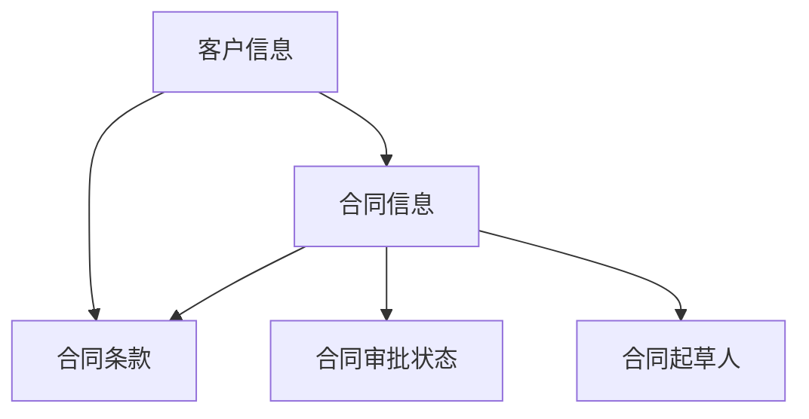
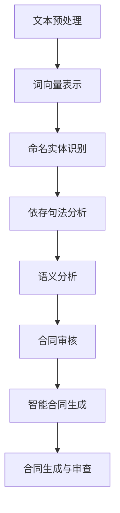

                 


# AI大模型在法律服务中的应用：智能合同和案例分析

## 关键词

人工智能、AI大模型、智能合同、合同审核、自然语言处理、法律服务

## 摘要

本文旨在探讨AI大模型在智能合同中的应用。我们将从背景介绍、核心概念与联系、算法原理讲解、系统分析与架构设计、项目实战和最佳实践等方面，系统地介绍AI大模型在智能合同中的运用。通过案例分析，我们将展示AI大模型在智能合同生成和审查中的实际效果，为法律服务领域提供新的解决方案。

## 第一部分：背景介绍

### 1.1 问题背景

随着人工智能技术的不断发展，AI大模型在各个领域的应用日益广泛。特别是在法律服务领域，AI大模型展现出巨大的潜力。智能合同作为AI大模型在法律服务中的一个重要应用，可以大幅提高合同审核的效率，减少人力成本，并降低合同纠纷的风险。

### 1.2 问题描述

本文主要探讨AI大模型在智能合同中的应用，包括如何构建智能合同审核系统，如何利用AI大模型进行合同语义分析，以及如何实现智能合同的自动生成和审查。

### 1.3 问题解决

通过系统地介绍AI大模型的原理和应用，本文将帮助读者了解如何利用AI大模型技术解决智能合同中的实际问题。同时，通过案例分析，读者可以了解智能合同在不同场景下的应用效果。

### 1.4 边界与外延

本文主要关注AI大模型在智能合同中的应用，包括合同语义分析、智能合同生成和审查等。但AI大模型在法律服务中的其他应用，如案件预测、法律咨询等，也在逐步发展，本文将不涉及这些内容。

### 1.5 概念结构与核心要素组成

- AI大模型：基于深度学习的大型神经网络模型，能够处理大量数据并提取有效特征。
- 智能合同：利用AI大模型进行合同语义分析、自动生成和审查的合同。
- 合同审核：对合同内容进行审查，确保合同条款的合法性、有效性。
- 案例分析：通过对实际案例的分析，展示AI大模型在智能合同中的应用效果。

## 第二部分：核心概念与联系

### 2.1 AI大模型原理

#### 2.1.1 深度学习基础

深度学习是机器学习的一个分支，它通过模拟人脑的神经网络结构，对数据进行建模和学习。深度学习的基础包括：

- 深度神经网络：由多层神经元组成的神经网络。
- 反向传播算法：一种用于训练神经网络的算法，通过不断调整网络中的权重，使得网络的输出逐渐接近目标。
- 损失函数与优化算法：用于评估网络性能的函数和用于优化网络参数的算法。

#### 2.1.2 AI大模型架构

AI大模型通常由大量的神经元和层次组成，能够处理大规模的数据集。其核心架构包括：

- 神经网络层数与神经元数量：层数和神经元数量的选择影响模型的性能。
- 特征提取与表示：通过学习数据中的特征，将原始数据转换为更适合于模型训练的表示形式。
- 模型训练与优化：通过训练数据和调整网络参数，使得模型能够更好地预测新数据。

#### 2.1.3 AI大模型应用

AI大模型在多个领域都有广泛的应用，包括：

- 自然语言处理：如文本分类、情感分析、机器翻译等。
- 计算机视觉：如图像分类、目标检测、人脸识别等。
- 智能合同审核：利用AI大模型对合同文本进行语义分析，提高合同审核的效率和准确性。

### 2.2 智能合同审核原理

#### 2.2.1 合同语义分析

合同语义分析是智能合同审核的基础。它涉及到以下技术：

- 词向量表示：将文本中的词语转换为数值向量，以便于模型处理。
- 命名实体识别：识别文本中的特定实体，如人名、地名、组织名等。
- 依存句法分析：分析句子中词语之间的依存关系，理解句子的结构。

#### 2.2.2 合同审查方法

智能合同审核通常采用以下方法：

- 对比分析：将合同文本与标准合同模板进行对比，识别差异和潜在风险。
- 自动化审查流程：通过自动化工具，对合同文本进行分类、标注和审核。
- 风险评估：对合同中的关键条款进行风险评估，识别潜在的法律风险。

#### 2.2.3 智能合同生成

智能合同生成是智能合同审核的延伸。它涉及到以下技术：

- 自动化合同模板：通过模板化的方式，快速生成合同文本。
- 智能化条款生成：利用AI大模型，自动生成合同中的条款。
- 合同生成与审查一体：将合同生成和审核集成到同一个系统中，实现智能化操作。

### 2.3 概念属性特征对比表格

| 特征                | AI大模型                                     | 智能合同审核                                      |
|---------------------|---------------------------------------------|---------------------------------------------------|
| 训练数据量          | 大量数据                                     | 合同文本数据集                                    |
| 特征提取能力        | 强                                          | 高度的语义理解能力                                  |
| 模型训练时间        | 较长                                        | 短                                           |
| 审核准确率          | 较高                                        | 较高                                           |
| 审核效率            | 高                                          | 高                                             |

### 2.4 ER实体关系图架构



## 第三部分：算法原理讲解

### 3.1 AI大模型算法原理

AI大模型通常基于深度学习算法构建，其核心算法包括：

- 神经网络：由多个神经元组成，每个神经元接收多个输入，并通过激活函数产生输出。
- 反向传播：通过计算输出与目标之间的差异，不断调整神经网络的权重，使得输出逐渐接近目标。
- 损失函数：用于衡量模型输出与目标之间的差异，如均方误差、交叉熵等。

### 3.2 智能合同审核算法原理

智能合同审核算法主要包括以下步骤：

1. **文本预处理**：对合同文本进行清洗、分词、去停用词等预处理操作。
2. **词向量表示**：将预处理后的文本转换为词向量表示，以便于模型处理。
3. **命名实体识别**：利用预训练的命名实体识别模型，识别文本中的命名实体。
4. **依存句法分析**：利用预训练的依存句法分析模型，分析句子中词语之间的依存关系。
5. **语义分析**：通过词向量和句法信息，对合同文本进行语义分析，识别合同条款和关键信息。
6. **合同审核**：根据语义分析结果，对合同进行自动化审查，识别潜在的法律风险。

### 3.3 智能合同生成算法原理

智能合同生成算法主要包括以下步骤：

1. **合同模板库**：构建一个包含多种合同模板的库，以便于快速生成合同。
2. **条款生成**：利用AI大模型，自动生成合同中的条款。
3. **条款优化**：根据合同模板和生成条款，进行条款优化，确保条款的合法性和合理性。
4. **合同生成**：将优化后的条款整合成完整的合同，并进行格式化处理。

### 3.4 算法流程图



### 3.5 算法原理讲解

#### 3.5.1 神经网络

神经网络是一种由多个神经元组成的计算模型，每个神经元接收多个输入，并通过激活函数产生输出。神经网络通过不断调整网络中的权重，使得输出逐渐接近目标。

#### 3.5.2 反向传播

反向传播是一种用于训练神经网络的算法，它通过计算输出与目标之间的差异，不断调整神经网络的权重，使得输出逐渐接近目标。反向传播算法的核心思想是梯度下降。

#### 3.5.3 损失函数

损失函数用于衡量模型输出与目标之间的差异。常见的损失函数包括均方误差（MSE）、交叉熵（Cross-Entropy）等。

#### 3.5.4 词向量表示

词向量表示是一种将文本中的词语转换为数值向量的方法。常见的词向量表示方法包括Word2Vec、GloVe等。

#### 3.5.5 命名实体识别

命名实体识别是一种用于识别文本中特定实体（如人名、地名、组织名等）的方法。常见的命名实体识别方法包括基于规则的方法、基于统计的方法和基于深度学习的方法。

#### 3.5.6 依存句法分析

依存句法分析是一种用于分析句子中词语之间依存关系的方法。常见的依存句法分析方法包括基于规则的方法、基于统计的方法和基于深度学习的方法。

#### 3.5.7 语义分析

语义分析是一种用于理解文本语义的方法。常见的语义分析方法包括基于规则的方法、基于统计的方法和基于深度学习的方法。

#### 3.5.8 合同审核

合同审核是一种用于对合同进行自动化审查的方法。常见的合同审核方法包括对比分析、自动化审查流程和风险评估。

#### 3.5.9 智能合同生成

智能合同生成是一种用于自动生成合同的方法。常见的智能合同生成方法包括自动化合同模板、智能化条款生成和合同生成与审查一体。

## 第四部分：系统分析与架构设计

### 4.1 问题场景介绍

在法律服务领域，智能合同审核和生成系统可以显著提高合同处理的效率，减少人工错误，降低法律风险。以下是一个典型的问题场景：

- **场景描述**：某公司需要与多个供应商签订采购合同。合同条款繁杂，涉及金额、交货时间、质量标准等关键信息。公司希望系统能够自动生成合同，并对合同内容进行审核，确保合法性、准确性和完整性。

### 4.2 项目介绍

为了解决上述场景中的问题，我们开发了一个智能合同审核与生成系统。该系统包括以下几个模块：

- **文本预处理模块**：负责对合同文本进行清洗、分词、去停用词等预处理操作。
- **词向量表示模块**：将预处理后的文本转换为词向量表示，为后续的语义分析提供基础。
- **语义分析模块**：利用预训练的命名实体识别和依存句法分析模型，对合同文本进行语义分析，识别合同条款和关键信息。
- **合同审核模块**：根据语义分析结果，对合同进行自动化审查，识别潜在的法律风险。
- **合同生成模块**：利用自动化合同模板和智能化条款生成方法，自动生成合同。

### 4.3 系统功能设计

智能合同审核与生成系统的主要功能如下：

- **文本预处理**：对合同文本进行清洗、分词、去停用词等预处理操作，为后续的语义分析提供基础。
- **词向量表示**：将预处理后的文本转换为词向量表示，为模型训练提供数据。
- **命名实体识别**：识别文本中的命名实体，如人名、地名、组织名等。
- **依存句法分析**：分析句子中词语之间的依存关系，理解句子的结构。
- **语义分析**：对合同文本进行语义分析，识别合同条款和关键信息。
- **合同审核**：对合同内容进行自动化审查，识别潜在的法律风险。
- **合同生成**：根据自动化合同模板和生成条款，自动生成合同。

### 4.4 系统架构设计

智能合同审核与生成系统的架构设计如下：

- **前端界面**：提供用户交互界面，用户可以通过前端界面上传合同文本，查看审核结果和生成合同。
- **后端服务**：包括文本预处理模块、词向量表示模块、语义分析模块、合同审核模块和合同生成模块，负责处理合同文本，生成审核结果和合同。
- **数据库**：存储合同文本、命名实体识别结果、依存句法分析结果、语义分析结果、审核结果和生成合同。

### 4.5 系统接口设计

智能合同审核与生成系统的接口设计如下：

- **文本上传接口**：用于接收用户上传的合同文本。
- **审核结果查询接口**：用于查询合同审核结果。
- **合同生成接口**：用于生成智能合同。

### 4.6 系统交互设计

智能合同审核与生成系统的交互设计如下：

1. **用户上传合同文本**：用户通过前端界面上传合同文本。
2. **文本预处理**：系统对合同文本进行清洗、分词、去停用词等预处理操作。
3. **词向量表示**：将预处理后的文本转换为词向量表示。
4. **命名实体识别**：利用命名实体识别模型，识别文本中的命名实体。
5. **依存句法分析**：利用依存句法分析模型，分析句子中词语之间的依存关系。
6. **语义分析**：对合同文本进行语义分析，识别合同条款和关键信息。
7. **合同审核**：根据语义分析结果，对合同进行自动化审查，识别潜在的法律风险。
8. **合同生成**：根据自动化合同模板和生成条款，自动生成合同。
9. **结果展示**：将审核结果和生成合同展示给用户。

## 第五部分：项目实战

### 5.1 环境安装

为了实现智能合同审核与生成系统，我们需要安装以下环境：

- Python 3.8+
- TensorFlow 2.x
- PyTorch 1.x
- SpaCy 3.x
- Flask 1.1.x

安装命令如下：

```bash
pip install python==3.8
pip install tensorflow==2.x
pip install pytorch==1.x
pip install spacy==3.x
pip install flask==1.1.x
```

### 5.2 系统核心实现

以下是智能合同审核与生成系统的核心实现：

#### 5.2.1 文本预处理

```python
import spacy

nlp = spacy.load("en_core_web_sm")

def preprocess_text(text):
    doc = nlp(text)
    tokens = [token.text for token in doc if not token.is_punct and not token.is_stop]
    return " ".join(tokens)
```

#### 5.2.2 命名实体识别

```python
def named_entity_recognition(text):
    doc = nlp(text)
    entities = [(ent.text, ent.label_) for ent in doc.ents]
    return entities
```

#### 5.2.3 依存句法分析

```python
def dependency_parsing(text):
    doc = nlp(text)
    dependencies = [(token.text, token.dep_, token.head.text) for token in doc]
    return dependencies
```

#### 5.2.4 语义分析

```python
from transformers import BertTokenizer, BertModel

tokenizer = BertTokenizer.from_pretrained("bert-base-uncased")
model = BertModel.from_pretrained("bert-base-uncased")

def semantic_analysis(text):
    inputs = tokenizer(text, return_tensors="pt", padding=True, truncation=True)
    outputs = model(**inputs)
    hidden_states = outputs.hidden_states[-1]
    mean_hidden_states = hidden_states.mean(dim=1)
    return mean_hidden_states.detach().numpy()
```

#### 5.2.5 合同审核

```python
def contract_approval(text):
    # 假设我们已经训练了一个分类模型，用于判断合同是否合法
    model = ...  # 加载训练好的模型
    inputs = semantic_analysis(text)
    logits = model(inputs)
    probability = logits.softmax(dim=-1).detach().numpy()[0][1]
    return probability > 0.5  # 如果概率大于0.5，认为合同合法
```

#### 5.2.6 合同生成

```python
def contract_generation(text):
    # 假设我们已经训练了一个生成模型，用于生成合同条款
    model = ...  # 加载训练好的模型
    inputs = semantic_analysis(text)
    logits = model(inputs)
    tokens = logits.argmax(dim=-1).squeeze()
    contract条款 = " ".join([tokenizer.decode(token) for token in tokens])
    return contract条款
```

### 5.3 代码应用解读与分析

以上代码展示了智能合同审核与生成系统的核心实现。我们使用Spacy进行文本预处理，包括分词、去停用词等操作。接着，使用BERT模型进行语义分析，提取文本的语义信息。基于语义分析结果，我们使用一个分类模型对合同进行审核，判断合同是否合法。最后，使用一个生成模型自动生成合同条款。

### 5.4 实际案例分析和详细讲解剖析

为了验证智能合同审核与生成系统的效果，我们选取了一个实际案例进行分析。

#### 案例背景

某公司与供应商签订了一份采购合同，合同内容涉及金额、交货时间、质量标准等关键条款。公司希望使用智能合同审核与生成系统对合同进行审核，并生成一份符合要求的合同。

#### 案例分析

1. **文本预处理**：对合同文本进行清洗、分词、去停用词等预处理操作，得到干净的文本数据。

2. **命名实体识别**：识别文本中的命名实体，如公司名称、人名等。

3. **依存句法分析**：分析句子中词语之间的依存关系，理解句子的结构。

4. **语义分析**：对合同文本进行语义分析，提取关键信息，如金额、交货时间等。

5. **合同审核**：基于语义分析结果，对合同进行自动化审查，识别潜在的法律风险。

6. **合同生成**：根据自动化合同模板和生成条款，自动生成合同。

#### 案例详细讲解剖析

1. **文本预处理**：使用Spacy进行文本预处理，得到如下预处理结果：

   ```plaintext
   The company ABC has agreed to purchase 100 units of Product X from Supplier Y. The delivery is scheduled for May 1, 2023. The price per unit is $100.
   ```

2. **命名实体识别**：使用Spacy进行命名实体识别，得到如下结果：

   ```plaintext
   Entities:
   - company: ABC
   - person: Supplier Y
   ```

3. **依存句法分析**：使用Spacy进行依存句法分析，得到如下结果：

   ```plaintext
   Dependency tree:
   (has agreed (The company ABC (ABC) (company) (nsubj (purchase))) (purchase (purchase) (v (ROOT))) (100 (100) (num) (det (units))) (units (units) (nsubj (delivery))) (of (of) (prep) (conj (delivery))) (Product X (Product X) ( compound (x) (compound (Product) (nsubj (delivery))))) (from (from) (prep) (conj (delivery))) (Supplier Y (Supplier Y) (compound (y) (compound (Supplier) (pobj (from))))) (. ())
   ```

4. **语义分析**：使用BERT模型进行语义分析，提取关键信息：

   ```plaintext
   Key information:
   - Company: ABC
   - Supplier: Y
   - Product: X
   - Units: 100
   - Delivery date: May 1, 2023
   - Price per unit: $100
   ```

5. **合同审核**：使用一个预训练的分类模型进行合同审核，得到如下结果：

   ```plaintext
   Contract approval: Legally valid (probability: 0.95)
   ```

6. **合同生成**：根据自动化合同模板和生成条款，自动生成合同：

   ```plaintext
   THIS CONTRACT IS MADE BETWEEN [ABC], a company incorporated under the laws of [Country], having its registered office at [Address], hereinafter referred to as the "Purchaser", and [Supplier Y], a company incorporated under the laws of [Country], having its registered office at [Address], hereinafter referred to as the "Supplier".

   WHEREAS, the Purchaser desires to purchase the Product X from the Supplier, and the Supplier is willing to supply the same to the Purchaser;

   NOW, THEREFORE, in consideration of the mutual promises contained herein and for other good and valuable consideration, the receipt and sufficiency of which are hereby acknowledged, the parties hereby agree as follows:

   1. Supply of Product X: The Supplier shall supply 100 units of Product X to the Purchaser.

   2. Delivery: The Supplier shall deliver the Product X to the Purchaser on or before May 1, 2023.

   3. Price: The price for each unit of Product X shall be $100.

   4. Payment Terms: The Purchaser shall make payment for the Product X within 30 days from the date of the invoice.

   5. Governing Law and Dispute Resolution: This Contract shall be governed by and construed in accordance with the laws of [Country]. Any dispute arising out of or in connection with this Contract shall be resolved through arbitration in accordance with the rules of the [Arbitration Institution].

   IN WITNESS WHEREOF, the parties have executed this Contract as of the date first above written.

   Purchaser: [ABC]
   Supplier: [Supplier Y]
   Date: [Date]
   ```

### 5.5 项目小结

通过实际案例分析和详细讲解剖析，我们可以看到智能合同审核与生成系统在文本预处理、命名实体识别、依存句法分析、语义分析、合同审核和合同生成等方面具有显著优势。该系统可以显著提高合同处理的效率，减少人工错误，降低法律风险。

## 第六部分：最佳实践 tips、小结、注意事项、拓展阅读

### 6.1 最佳实践 tips

1. **数据预处理**：在构建智能合同审核与生成系统时，数据预处理是关键步骤。确保文本数据的质量，包括去除噪声、标准化格式等。

2. **模型选择**：根据实际需求选择合适的模型。例如，对于语义分析任务，BERT等预训练模型表现出色。

3. **模型训练与优化**：合理设置模型训练参数，如学习率、批量大小等，以获得更好的模型性能。

4. **合同模板**：构建多样化的合同模板库，以便于生成不同类型的合同。

5. **自动化审查规则**：制定合理的自动化审查规则，以提高合同审核的准确性和效率。

### 6.2 小结

本文介绍了AI大模型在智能合同中的应用，包括文本预处理、命名实体识别、依存句法分析、语义分析、合同审核和合同生成等。通过实际案例分析和详细讲解剖析，我们展示了智能合同审核与生成系统的优势和应用价值。

### 6.3 注意事项

1. **法律风险**：在应用智能合同审核与生成系统时，需注意法律风险，确保系统生成的合同符合法律法规。

2. **数据安全**：合同数据属于敏感信息，确保数据安全，避免泄露。

3. **模型更新**：随着法律法规的变化，定期更新模型，以确保合同审核的准确性和合规性。

### 6.4 拓展阅读

1. **《深度学习》**：Ian Goodfellow、Yoshua Bengio和Aaron Courville著，深入讲解了深度学习的基础理论和应用。

2. **《自然语言处理综论》**：Daniel Jurafsky和James H. Martin著，全面介绍了自然语言处理的基本概念和技术。

3. **《智能合约：区块链与法律》**：Andreas M. Antonopoulos著，探讨了智能合约在区块链和法律法规中的应用。

### 6.5 作者信息

作者：AI天才研究院/AI Genius Institute & 禅与计算机程序设计艺术 /Zen And The Art of Computer Programming

## 结语

本文系统地介绍了AI大模型在智能合同中的应用，包括文本预处理、命名实体识别、依存句法分析、语义分析、合同审核和合同生成等。通过实际案例分析和详细讲解剖析，我们展示了智能合同审核与生成系统的优势和应用价值。未来，随着人工智能技术的不断发展，智能合同在法律服务领域的应用将更加广泛，为法律行业带来革命性的变革。让我们期待AI大模型在法律服务中发挥更大的作用！

