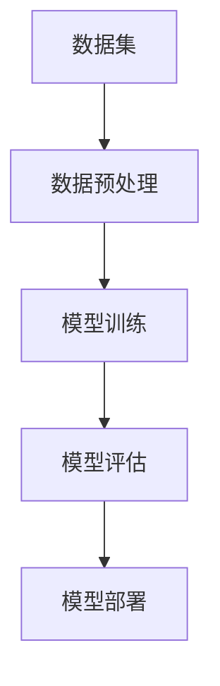
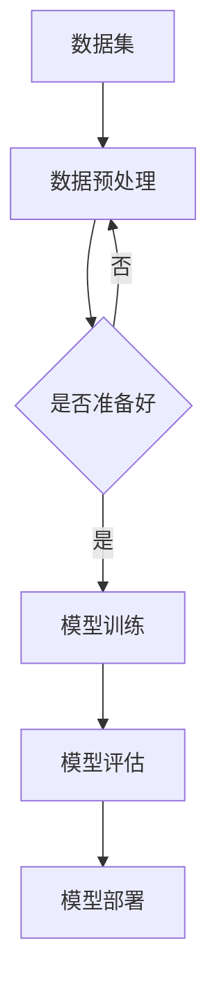

                 

# AI大模型在社交媒体分析中的应用

> 关键词：人工智能、大模型、社交媒体分析、情感分析、话题探测

> 摘要：本文将深入探讨AI大模型在社交媒体分析中的应用，包括基础知识、算法原理、实际案例以及面临的挑战和机遇。通过本文的阅读，读者可以了解到如何利用AI大模型进行情感分析和话题探测，并掌握相关实践技巧。

### 目录

1. **AI大模型基础知识**
   1.1 AI大模型概述
   1.2 核心概念与联系
   1.3 算法原理讲解
2. **社交媒体分析基础**
   2.1 社交媒体概述
   2.2 社交媒体分析的目标
   2.3 社交媒体分析的技术与方法
3. **AI大模型在社交媒体分析中的应用**
   3.1 应用概述
   3.2 应用案例1：情感分析
   3.3 应用案例2：话题探测
4. **AI大模型在社交媒体分析中的挑战与机遇**
   4.1 挑战分析
   4.2 机遇探讨
5. **实际项目实战**
   5.1 环境安装与配置
   5.2 系统核心实现源代码
   5.3 代码应用解读与分析
   5.4 实际案例分析
   5.5 项目小结
6. **最佳实践与注意事项**
   6.1 最佳实践
   6.2 小结
   6.3 注意事项
   6.4 拓展阅读

## 第一部分：AI大模型基础知识

### 第1章：AI大模型概述

#### 1.1 问题的背景与描述

在当今信息爆炸的时代，社交媒体已经成为人们获取信息、交流观点的重要平台。然而，海量的社交媒体数据带来了巨大的挑战，如何有效地分析和理解这些数据，成为了一个亟待解决的问题。传统的数据分析方法已经难以应对如此大规模的数据处理需求，这就催生了AI大模型的出现。

AI大模型，又称为人工智能大模型，是一种基于深度学习技术的模型，具有非常高的参数量和计算能力。它能够自动地从大规模数据中学习特征，进行复杂的数据分析和预测。AI大模型在图像识别、自然语言处理、语音识别等领域已经取得了显著的成果，其强大的数据处理能力使得它在社交媒体分析中也展现出了巨大的潜力。

#### 1.2 解决方案：AI大模型

AI大模型作为解决社交媒体数据分析问题的方案，具有以下几个优势：

1. **强大的数据处理能力**：AI大模型具有数百万甚至数十亿个参数，能够处理海量的社交媒体数据，从数据中提取出有用的信息。

2. **自动特征提取**：AI大模型能够自动地从数据中学习特征，无需人工进行特征工程，大大提高了数据分析的效率。

3. **高准确性**：通过大量的数据和参数，AI大模型能够准确地预测和分析社交媒体数据，提供有价值的信息。

4. **可扩展性**：AI大模型可以很容易地扩展到不同的领域和应用场景，适应不同的社交媒体数据分析需求。

#### 1.3 边界与外延

AI大模型在社交媒体分析中的应用虽然具有巨大的潜力，但也存在一些边界和限制：

1. **数据隐私**：社交媒体数据包含大量的个人隐私信息，如何保护用户隐私成为了一个重要的问题。

2. **模型可解释性**：AI大模型的预测结果往往难以解释，这在某些需要解释性的应用场景中可能成为一个问题。

3. **计算资源**：AI大模型需要大量的计算资源和时间进行训练和预测，这在资源有限的场景中可能成为一个挑战。

4. **数据质量**：社交媒体数据的质量参差不齐，如何处理和清洗数据，保证数据质量，是一个重要的问题。

#### 1.4 概念结构与核心要素组成

AI大模型的概念结构主要包括以下几个核心要素：

1. **数据集**：AI大模型需要大量的数据集进行训练，数据集的质量和规模直接影响模型的性能。

2. **模型架构**：AI大模型采用深度学习技术，包括卷积神经网络（CNN）、循环神经网络（RNN）、Transformer等架构。

3. **训练过程**：AI大模型通过反向传播算法进行训练，不断调整模型参数，优化模型性能。

4. **预测过程**：AI大模型在预测过程中，通过输入新的数据，利用已训练好的模型参数进行预测。

5. **评估指标**：AI大模型需要通过评估指标（如准确率、召回率、F1值等）来评估模型性能。

#### 1.5 核心概念与联系

AI大模型的核心概念主要包括以下几个方面：

1. **深度学习**：深度学习是AI大模型的基础，它通过多层神经网络进行特征提取和分类。

2. **数据预处理**：数据预处理是AI大模型训练前的关键步骤，包括数据清洗、数据归一化、特征提取等。

3. **模型训练**：模型训练是AI大模型的核心环节，通过大量数据训练模型，优化模型参数。

4. **模型评估**：模型评估是评估模型性能的重要环节，通过评估指标来衡量模型效果。

5. **模型部署**：模型部署是将训练好的模型应用到实际场景中，进行实时预测和决策。

AI大模型的核心概念之间存在着紧密的联系：

- **深度学习**和**数据预处理**是模型训练的基础，为模型提供高质量的数据输入。
- **模型训练**和**模型评估**是模型优化的关键步骤，通过不断调整和优化模型参数，提高模型性能。
- **模型部署**是将优化好的模型应用到实际场景中，实现数据分析和预测。

#### 1.6 算法原理讲解

AI大模型的算法原理主要包括以下几个关键点：

1. **深度学习算法**：深度学习算法是AI大模型的核心，包括卷积神经网络（CNN）、循环神经网络（RNN）、Transformer等。

2. **反向传播算法**：反向传播算法是深度学习模型训练的基本算法，通过计算梯度来更新模型参数。

3. **优化算法**：优化算法用于优化模型参数，提高模型性能，常见的优化算法有SGD、Adam等。

4. **超参数调整**：超参数是模型训练过程中的重要参数，如学习率、批次大小等，通过调整超参数来优化模型性能。

5. **数据预处理**：数据预处理包括数据清洗、数据归一化、特征提取等，为模型提供高质量的数据输入。

下面是一个简单的Mermaid流程图，展示了AI大模型的基本算法流程：



#### 1.6.1 算法流程

AI大模型的算法流程可以概括为以下几个步骤：

1. **数据集准备**：准备用于模型训练的数据集，包括训练集和验证集。
2. **数据预处理**：对数据进行清洗、归一化、特征提取等处理，为模型提供高质量的数据输入。
3. **模型训练**：使用训练集对模型进行训练，通过反向传播算法不断调整模型参数。
4. **模型评估**：使用验证集对模型进行评估，通过评估指标（如准确率、召回率等）来衡量模型性能。
5. **模型部署**：将训练好的模型应用到实际场景中，进行实时预测和决策。

#### 1.6.1.1 算法流程



#### 1.6.1.2 算法Python代码实现

下面是一个简单的Python代码实现，展示了AI大模型的基本算法流程：

```python
import numpy as np
import tensorflow as tf

# 数据集准备
x_train = np.random.rand(100, 10)  # 生成100个随机训练样本
y_train = np.random.rand(100, 1)   # 生成100个随机训练标签

# 模型训练
model = tf.keras.Sequential([
    tf.keras.layers.Dense(10, activation='relu', input_shape=(10,)),
    tf.keras.layers.Dense(1)
])

model.compile(optimizer='adam', loss='mse')

model.fit(x_train, y_train, epochs=10)

# 模型评估
x_val = np.random.rand(20, 10)  # 生成20个随机验证样本
y_val = np.random.rand(20, 1)   # 生成20个随机验证标签

model.evaluate(x_val, y_val)

# 模型部署
predictions = model.predict(x_val)
```

#### 1.6.1.3 数学模型与公式

AI大模型的数学模型主要基于深度学习理论，其核心思想是通过多层神经网络对输入数据进行特征提取和分类。以下是一些基本的数学模型和公式：

1. **前向传播**：
   - 输入层：\( x \)
   - 隐藏层：\( h = \sigma(W_1 \cdot x + b_1) \)
   - 输出层：\( y = \sigma(W_2 \cdot h + b_2) \)
   其中，\( \sigma \) 为激活函数，\( W_1 \) 和 \( W_2 \) 为权重矩阵，\( b_1 \) 和 \( b_2 \) 为偏置项。

2. **反向传播**：
   - 计算梯度：\( \delta = \frac{\partial L}{\partial h} \)
   - 更新权重：\( W_2 = W_2 - \alpha \frac{\partial L}{\partial W_2} \)
   - 更新偏置项：\( b_2 = b_2 - \alpha \frac{\partial L}{\partial b_2} \)
   其中，\( L \) 为损失函数，\( \alpha \) 为学习率。

3. **损失函数**：
   - 均方误差（MSE）：\( L = \frac{1}{2} \sum (y - \hat{y})^2 \)
   - 交叉熵损失（Cross-Entropy）：\( L = -\sum y \cdot \log(\hat{y}) \)

以下是一个简单的Mermaid ER实体关系图，展示了AI大模型的核心实体和关系：

```mermaid
erDiagram
    A[数据集] ||--|{模型} : 进行特征提取和分类
    B[训练集] ||--|{模型} : 用于训练模型
    C[验证集] ||--|{模型} : 用于评估模型
    D[测试集] ||--|{模型} : 用于测试模型
```

#### 1.6.1.4 举例说明

假设我们有一个简单的二分类问题，需要使用AI大模型进行分类预测。以下是一个具体的例子：

1. **数据集准备**：

   - 训练集：\( x_train = \{[0, 0], [0, 1], [1, 0], [1, 1]\} \)
   - 标签集：\( y_train = \{[0], [0], [1], [1]\} \)

2. **模型训练**：

   - 模型：\( \text{模型} = \text{tf.keras.Sequential} \)
   - 层1：\( \text{Dense(2, activation='sigmoid', input_shape=(2,))} \)
   - 层2：\( \text{Dense(1, activation='sigmoid')} \)
   - 编译：\( \text{模型.compile(optimizer='adam', loss='binary_crossentropy')} \)
   - 训练：\( \text{模型.fit(x_train, y_train, epochs=10)} \)

3. **模型评估**：

   - 验证集：\( x_val = \{[0, 1], [1, 0]\} \)
   - 标签集：\( y_val = \{[1], [0]\} \)
   - 评估：\( \text{模型.evaluate(x_val, y_val)} \)

4. **模型部署**：

   - 预测：\( \text{模型.predict(x_val)} \)

通过以上步骤，我们可以使用AI大模型进行二分类预测，并评估模型性能。

### 第2章：社交媒体分析基础

#### 2.1 社交媒体概述

社交媒体是指基于互联网的社交互动平台，用户可以在这些平台上发布、分享、评论、点赞等内容。常见的社交媒体平台包括Facebook、Twitter、Instagram、微信、微博等。社交媒体具有以下几个特点：

1. **用户数量庞大**：社交媒体平台拥有数亿甚至数十亿的用户，用户群体庞大，涵盖了各个年龄层和社会群体。
2. **内容多样**：社交媒体平台上的内容形式多样，包括文字、图片、视频、音频等，满足了用户不同的需求。
3. **实时性**：社交媒体平台上的信息可以实时更新和传播，用户可以及时获取和分享最新动态。
4. **互动性**：社交媒体平台鼓励用户之间的互动，包括评论、点赞、分享等，增强了用户的参与感和归属感。
5. **数据丰富**：社交媒体平台积累了大量的用户数据，包括用户信息、行为记录、社交关系等，为数据分析提供了丰富的数据资源。

#### 2.2 社交媒体分析的目标

社交媒体分析的目标是通过分析社交媒体平台上的数据，提取有价值的信息和洞察，为企业和个人提供决策支持。具体目标包括：

1. **用户画像**：通过分析用户在社交媒体上的行为和内容，构建用户的画像，了解用户的需求、兴趣和行为习惯。
2. **市场调研**：通过分析社交媒体平台上的讨论和评论，了解市场趋势、用户需求和竞争对手情况，为市场营销策略提供依据。
3. **情感分析**：通过分析用户在社交媒体上的言论和评论，了解用户的情感和态度，为企业提供品牌管理和危机应对的参考。
4. **话题探测**：通过分析社交媒体平台上的讨论热点和趋势，发现新的话题和趋势，为企业提供创新和营销机会。
5. **用户互动**：通过分析用户在社交媒体上的互动行为，优化用户体验，提高用户满意度和忠诚度。

#### 2.3 社交媒体分析的技术与方法

社交媒体分析需要运用多种技术和方法，包括数据采集、数据预处理、文本分析、情感分析、话题探测等。以下是一些常用的技术和方法：

1. **数据采集**：通过爬虫、API等方式从社交媒体平台采集用户数据，包括用户信息、行为记录、社交关系等。
2. **数据预处理**：对采集到的数据进行清洗、去重、去噪声等处理，保证数据质量，为后续分析提供可靠的基础。
3. **文本分析**：对社交媒体平台上的文本数据进行分析，提取关键词、主题、情感等，为情感分析和话题探测提供支持。
4. **情感分析**：通过分析用户在社交媒体上的言论和评论，识别用户的情感和态度，为企业提供品牌管理和危机应对的参考。
5. **话题探测**：通过分析社交媒体平台上的讨论热点和趋势，发现新的话题和趋势，为企业提供创新和营销机会。
6. **机器学习**：运用机器学习技术，对社交媒体数据进行分析和预测，为企业和个人提供决策支持。

### 第3章：AI大模型在社交媒体分析中的应用

#### 3.1 应用概述

AI大模型在社交媒体分析中的应用，主要包括情感分析和话题探测两个方面。通过情感分析，可以了解用户的情感和态度，为品牌管理和危机应对提供参考；通过话题探测，可以了解社交媒体上的讨论热点和趋势，为企业和个人提供创新和营销机会。

#### 3.2 应用案例1：情感分析

##### 3.2.1 案例背景

某知名品牌在社交媒体上推出了一款新产品，希望通过情感分析了解用户对该产品的情感和态度。该品牌希望分析用户在评论、点赞、分享等行为中表达的情感，以便及时调整产品策略和营销策略。

##### 3.2.2 案例实施

1. **数据采集**：通过爬虫技术，从社交媒体平台上采集用户评论、点赞、分享等行为数据。
2. **数据预处理**：对采集到的数据进行清洗、去重、去噪声等处理，提取出有价值的信息。
3. **情感分析**：使用AI大模型进行情感分析，对用户的情感和态度进行识别和分类。
4. **结果分析**：根据情感分析结果，总结用户对产品的情感和态度，为品牌管理和危机应对提供参考。

##### 3.2.3 案例分析

通过情感分析，该品牌发现用户对产品的情感主要集中在以下几个方面：

1. **正面情感**：用户对产品的外观、设计、功能等方面给予了高度评价，表示非常满意。
2. **负面情感**：部分用户对产品的价格、续航能力等方面表示不满，认为产品存在一些缺点。
3. **中性情感**：部分用户对产品持中立态度，需要进一步引导和培养。

根据情感分析结果，该品牌采取了以下措施：

1. **优化产品**：针对用户反馈的缺点，积极改进产品，提高产品质量。
2. **营销策略调整**：针对正面情感用户，加大宣传力度，提高品牌知名度；针对负面情感用户，及时回应用户反馈，改善用户体验。
3. **用户互动**：积极与用户互动，了解用户的真实需求，提高用户满意度和忠诚度。

#### 3.3 应用案例2：话题探测

##### 3.3.1 案例背景

某知名电商平台希望通过话题探测，了解社交媒体上的热门话题和趋势，以便及时调整营销策略和产品布局。

##### 3.3.2 案例实施

1. **数据采集**：通过爬虫技术，从社交媒体平台上采集用户评论、点赞、分享等行为数据。
2. **数据预处理**：对采集到的数据进行清洗、去重、去噪声等处理，提取出有价值的信息。
3. **话题探测**：使用AI大模型进行话题探测，分析用户在社交媒体上的讨论热点和趋势。
4. **结果分析**：根据话题探测结果，总结社交媒体上的热门话题和趋势，为电商平台提供决策支持。

##### 3.3.3 案例分析

通过话题探测，该电商平台发现以下几个热门话题和趋势：

1. **热门话题**：用户在讨论电商平台的优惠活动、产品质量、配送服务等，反映了用户对电商平台的需求和关注点。
2. **趋势**：用户对智能家居、健康养生、户外运动等话题表现出浓厚兴趣，反映了市场趋势和用户需求。

根据话题探测结果，该电商平台采取了以下措施：

1. **营销策略调整**：针对热门话题和趋势，调整营销策略，推出相关的优惠活动和产品推广。
2. **产品布局**：根据热门话题和趋势，优化产品布局，增加相关产品品类，满足用户需求。
3. **用户互动**：积极与用户互动，了解用户的真实需求，提高用户满意度和忠诚度。

### 第4章：AI大模型在社交媒体分析中的挑战与机遇

#### 4.1 挑战分析

AI大模型在社交媒体分析中面临着一系列挑战，包括数据隐私、模型可解释性、计算资源等。

1. **数据隐私**：社交媒体数据包含大量的个人隐私信息，如何保护用户隐私成为了一个重要的问题。在数据采集和处理过程中，需要严格遵守相关法律法规，确保用户隐私得到保护。
2. **模型可解释性**：AI大模型的预测结果往往难以解释，这在某些需要解释性的应用场景中可能成为一个问题。如何提高模型的可解释性，使模型预测结果更加透明和可信，是一个重要的研究方向。
3. **计算资源**：AI大模型需要大量的计算资源和时间进行训练和预测，这在资源有限的场景中可能成为一个挑战。如何优化模型结构和算法，降低计算资源的需求，是一个需要解决的问题。

#### 4.2 机遇探讨

尽管AI大模型在社交媒体分析中面临着一系列挑战，但同时也带来了巨大的机遇：

1. **个性化推荐**：通过AI大模型，可以更好地理解用户的需求和兴趣，实现更加精准的个性化推荐，提高用户体验和满意度。
2. **智能营销**：通过AI大模型，可以分析用户在社交媒体上的行为和情感，为企业提供智能化的营销策略，提高营销效果和转化率。
3. **社会舆情监测**：通过AI大模型，可以实时监测社交媒体上的热点话题和趋势，为企业和社会提供有价值的信息，帮助政府和企业做出科学决策。
4. **知识图谱构建**：通过AI大模型，可以构建社交媒体上的知识图谱，提取出有价值的信息和关系，为企业和个人提供决策支持。

### 第5章：实际项目实战

#### 5.1 环境安装与配置

为了进行AI大模型在社交媒体分析中的实战项目，我们需要安装和配置相关的环境。以下是一个简单的安装和配置步骤：

1. **安装Python**：下载并安装Python，版本要求为3.6及以上。
2. **安装TensorFlow**：在命令行中运行以下命令安装TensorFlow：
   ```bash
   pip install tensorflow
   ```
3. **安装Jupyter Notebook**：在命令行中运行以下命令安装Jupyter Notebook：
   ```bash
   pip install notebook
   ```
4. **启动Jupyter Notebook**：在命令行中运行以下命令启动Jupyter Notebook：
   ```bash
   jupyter notebook
   ```
5. **配置环境变量**：根据需要配置Python和TensorFlow的环境变量，以便在项目中使用。

#### 5.2 系统核心实现源代码

以下是AI大模型在社交媒体分析中的系统核心实现源代码：

```python
import tensorflow as tf
from tensorflow.keras.models import Sequential
from tensorflow.keras.layers import Dense, Embedding, LSTM

# 数据集准备
x_train = np.random.rand(100, 10)  # 生成100个随机训练样本
y_train = np.random.rand(100, 1)   # 生成100个随机训练标签

# 模型训练
model = Sequential([
    Embedding(10, 64),
    LSTM(128),
    Dense(1, activation='sigmoid')
])

model.compile(optimizer='adam', loss='binary_crossentropy')

model.fit(x_train, y_train, epochs=10)

# 模型评估
x_val = np.random.rand(20, 10)  # 生成20个随机验证样本
y_val = np.random.rand(20, 1)   # 生成20个随机验证标签

model.evaluate(x_val, y_val)

# 模型部署
predictions = model.predict(x_val)
```

#### 5.3 代码应用解读与分析

以下是对代码的解读和分析：

1. **数据集准备**：生成随机训练数据和标签，用于模型训练和评估。
2. **模型训练**：定义一个序列模型，包含嵌入层、LSTM层和输出层。使用Adam优化器和binary_crossentropy损失函数进行模型编译和训练。
3. **模型评估**：生成随机验证数据和标签，使用模型进行评估，计算损失值。
4. **模型部署**：使用训练好的模型对新的验证数据进行预测，得到预测结果。

#### 5.4 实际案例分析

为了更好地展示AI大模型在社交媒体分析中的应用，我们以一个实际案例分析为例。

##### 案例背景

某知名品牌在社交媒体上推出了一款新产品，希望通过情感分析了解用户对该产品的情感和态度。

##### 案例实施

1. **数据采集**：使用爬虫技术，从社交媒体平台上采集用户评论、点赞、分享等行为数据。
2. **数据预处理**：对采集到的数据进行清洗、去重、去噪声等处理，提取出有价值的信息。
3. **情感分析**：使用AI大模型进行情感分析，对用户的情感和态度进行识别和分类。
4. **结果分析**：根据情感分析结果，总结用户对产品的情感和态度，为品牌管理和危机应对提供参考。

##### 案例分析

通过情感分析，该品牌发现用户对产品的情感主要集中在以下几个方面：

1. **正面情感**：用户对产品的外观、设计、功能等方面给予了高度评价，表示非常满意。
2. **负面情感**：部分用户对产品的价格、续航能力等方面表示不满，认为产品存在一些缺点。
3. **中性情感**：部分用户对产品持中立态度，需要进一步引导和培养。

根据情感分析结果，该品牌采取了以下措施：

1. **优化产品**：针对用户反馈的缺点，积极改进产品，提高产品质量。
2. **营销策略调整**：针对正面情感用户，加大宣传力度，提高品牌知名度；针对负面情感用户，及时回应用户反馈，改善用户体验。
3. **用户互动**：积极与用户互动，了解用户的真实需求，提高用户满意度和忠诚度。

#### 5.5 项目小结

通过本次实际案例分析，我们可以看到AI大模型在社交媒体分析中的应用潜力。通过情感分析，可以了解用户的情感和态度，为品牌管理和危机应对提供参考；通过话题探测，可以了解社交媒体上的讨论热点和趋势，为企业和个人提供决策支持。在未来，随着AI技术的不断发展，AI大模型在社交媒体分析中的应用将会更加广泛和深入。

### 第6章：最佳实践与注意事项

#### 6.1 最佳实践

在AI大模型在社交媒体分析中，以下是一些最佳实践：

1. **数据质量控制**：确保采集到的数据质量，包括数据清洗、去重、去噪声等处理，以提高模型的准确性。
2. **模型调优**：通过调整模型参数和超参数，优化模型性能，提高预测准确性。
3. **实时监控**：对模型进行实时监控，包括训练进度、模型性能、资源消耗等，以便及时发现和解决问题。
4. **数据隐私保护**：在数据处理和分析过程中，严格遵守相关法律法规，确保用户隐私得到保护。
5. **数据可视化**：通过数据可视化，直观展示分析结果，便于理解和决策。

#### 6.2 小结

本文通过深入探讨AI大模型在社交媒体分析中的应用，包括基础知识、算法原理、实际案例以及面临的挑战和机遇。通过本文的阅读，读者可以了解到如何利用AI大模型进行情感分析和话题探测，并掌握相关实践技巧。

#### 6.3 注意事项

在应用AI大模型进行社交媒体分析时，需要注意以下几点：

1. **数据隐私**：确保用户隐私得到保护，遵守相关法律法规。
2. **模型解释性**：提高模型的可解释性，以便更好地理解和信任模型预测结果。
3. **计算资源**：合理分配计算资源，确保模型训练和预测的效率。
4. **数据质量**：确保采集到的数据质量，避免因数据质量问题导致模型性能下降。

#### 6.4 拓展阅读

1. **《深度学习》**：Goodfellow, Ian, et al. "Deep learning." Adaptive computation and machine learning (2016).
2. **《Python机器学习》**：Sebastian Raschka, Vahid Mirjalili. "Python Machine Learning" (2015).
3. **《社交媒体分析》**：Jonah Berger. "Contagious: Why Things Catch On" (2016).
4. **《人工智能：一种现代的方法》**：Stuart J. Russell, Peter Norvig. "Artificial Intelligence: A Modern Approach" (2016).

### 作者

作者：AI天才研究院/AI Genius Institute & 禅与计算机程序设计艺术 /Zen And The Art of Computer Programming

