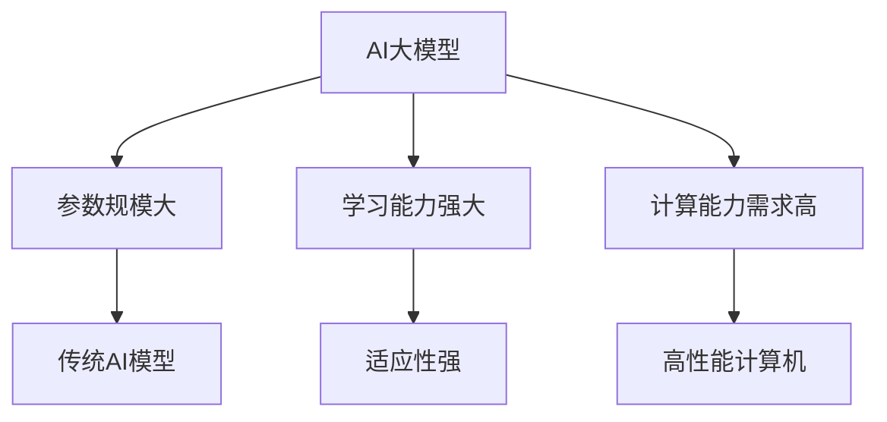
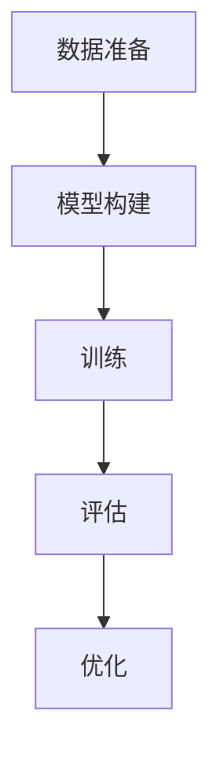
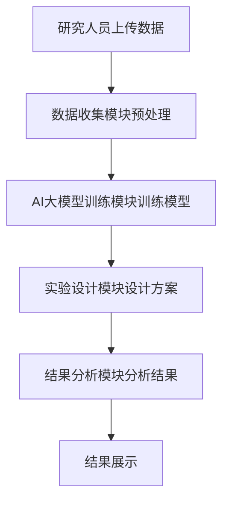

                 


## 引言

### 1.1 问题背景

随着人工智能技术的飞速发展，AI大模型在各个领域的应用越来越广泛，尤其是在科学研究中，AI大模型展示出了前所未有的潜力。科学研究往往需要大量的实验数据来支持假设生成和验证，而传统的人工分析方法往往效率低下且容易出错。AI大模型的出现，为科学研究提供了新的解决方案，它能够通过学习大量的数据，自动生成科学的假设和实验设计，极大地提高了科研效率。

### 1.2 问题描述

本文旨在探讨AI大模型在科学研究中的应用，特别是假设生成和实验设计方面。具体来说，我们将从以下几个方面展开讨论：

- AI大模型的基本概念和特点
- AI大模型的基础理论，包括算法原理和数学模型
- AI大模型在科学研究中的应用场景和系统设计
- AI大模型在科学研究中的实际应用案例和效果评估
- AI大模型在科学研究中的最佳实践和注意事项

### 1.3 问题解决

通过本文的讨论，我们希望能够为科研人员提供一套完整的AI大模型应用指南，帮助他们更好地利用AI大模型进行科学研究，从而提高科研效率和成果质量。

### 1.4 边界与外延

本文主要关注AI大模型在科学研究中的应用，但不涉及AI大模型在其他领域的应用。此外，本文仅讨论AI大模型在假设生成和实验设计方面的应用，而不涉及AI大模型在其他科学研究环节的应用。

### 1.5 概念结构与核心要素组成

AI大模型在科学研究中的应用可以分为以下几个核心要素：

- 假设生成：AI大模型通过学习大量的数据，自动生成科学的假设。
- 实验设计：AI大模型基于生成的假设，设计出有效的实验方案。
- 结果分析：通过实验验证假设，并分析实验结果。

## 核心概念与联系

### 2.1 AI大模型定义

AI大模型是指那些参数规模达到数亿甚至万亿级别的深度学习模型。这些模型能够通过学习海量的数据，自动提取出复杂的数据特征，并利用这些特征进行预测和决策。

### 2.2 AI大模型特点

AI大模型具有以下几个显著特点：

- **参数规模大**：AI大模型拥有数亿甚至万亿级别的参数，这使得它们能够学习到更加复杂的特征。
- **学习能力强大**：AI大模型能够从大量的数据中自动提取出有效的特征，这使得它们能够进行更加精准的预测和决策。
- **计算能力需求高**：AI大模型训练和推理需要大量的计算资源，这使得它们通常需要在高性能计算机上进行。

### 2.3 AI大模型与传统AI对比

AI大模型与传统AI模型（如SVM、决策树等）相比，具有以下几个显著优势：

- **处理复杂问题能力更强**：AI大模型能够处理更加复杂的问题，特别是那些需要从大量数据中提取特征的问题。
- **适应性强**：AI大模型能够自动适应不同的数据集和任务，而传统AI模型通常需要针对特定任务进行手工调整。

### 2.4 AI大模型相关概念联系图



## AI大模型基础理论

### 3.1 机器学习基础

机器学习是人工智能的核心技术之一，它通过构建数学模型来模拟人类学习过程，从而实现自动从数据中学习规律和知识。机器学习的基本流程包括数据收集、数据预处理、模型选择、模型训练和模型评估等步骤。

### 3.2 深度学习基础

深度学习是机器学习的一个分支，它通过构建深层神经网络来实现对复杂数据的建模。深度学习的基本原理是利用多层神经网络对数据进行逐层提取特征，从而实现自动从数据中学习规律和知识。

### 3.3 大模型训练过程

大模型训练过程包括以下几个关键步骤：

- 数据准备：准备用于训练的数据集，并进行数据预处理。
- 模型构建：构建深度学习模型，并设置模型参数。
- 训练：使用训练数据对模型进行训练，并通过反向传播算法更新模型参数。
- 评估：使用验证数据集对模型进行评估，以确定模型的性能。

### 3.4 大模型算法mermaid流程图



## 数学模型和数学公式讲解

### 4.1 数学模型原理

深度学习中的数学模型主要基于神经网络和优化算法。神经网络通过多层感知器实现，每层神经元接收前一层神经元的输出，并通过激活函数进行非线性变换。优化算法则用于调整神经网络参数，以最小化预测误差。

### 4.2 公式讲解

深度学习中的关键数学公式包括：

- 激活函数：$$ f(x) = \sigma(x) = \frac{1}{1 + e^{-x}} $$
- 梯度下降：$$ \theta = \theta - \alpha \cdot \nabla_{\theta} J(\theta) $$
- 反向传播：$$ \delta_{ij} = \frac{\partial J}{\partial z_j} \cdot \frac{\partial z_j}{\partial x_i} $$

### 4.3 举例说明

假设有一个深度学习模型，包含两层神经元，输入层有3个神经元，隐藏层有2个神经元，输出层有1个神经元。输入数据为$$[1, 2, 3]$$，通过模型计算得到输出结果为$$[4, 5]$$。我们可以通过以下步骤来计算预测误差：

1. 计算隐藏层输出：$$ z_1 = 1 \cdot w_{11} + 2 \cdot w_{12} + 3 \cdot w_{13} $$
2. 计算输出层输出：$$ y = 4 \cdot w_{21} + 5 \cdot w_{22} $$
3. 计算预测误差：$$ J = (y - t)^2 $$

通过反向传播算法，我们可以计算每个参数的梯度，并更新参数：

$$ \delta_{21} = \frac{\partial J}{\partial z_1} = 2 \cdot (y - t) $$
$$ \delta_{22} = \frac{\partial J}{\partial z_2} = 2 \cdot (y - t) $$

$$ \theta_{21} = \theta_{21} - \alpha \cdot \delta_{21} $$
$$ \theta_{22} = \theta_{22} - \alpha \cdot \delta_{22} $$

## 系统分析与架构设计方案

### 5.1 问题场景介绍

在科学研究过程中，研究人员通常需要从大量的实验数据中生成假设，并设计出有效的实验方案。然而，传统的实验设计方法往往需要耗费大量的人力和时间，且容易出现错误。为了提高科研效率，我们需要一种自动化的实验设计工具。

### 5.2 系统功能设计

本系统主要包括以下功能：

- 数据收集与预处理：收集科学实验数据，并进行数据清洗、归一化等预处理操作。
- 假设生成：利用AI大模型从预处理后的数据中自动生成科学假设。
- 实验设计：基于生成的假设，设计出有效的实验方案。
- 结果分析：对实验结果进行统计分析和可视化展示。

### 5.3 系统架构设计

本系统采用分布式架构，主要包括以下几个组件：

- 数据收集模块：负责收集和预处理实验数据。
- AI大模型训练模块：负责训练AI大模型，生成假设和实验设计。
- 实验设计模块：基于生成的假设，设计出有效的实验方案。
- 结果分析模块：对实验结果进行统计分析和可视化展示。

### 5.4 系统接口设计

本系统采用RESTful API设计，主要包括以下几个接口：

- 数据收集接口：用于接收和预处理实验数据。
- AI大模型训练接口：用于训练AI大模型，生成假设和实验设计。
- 实验设计接口：用于设计实验方案。
- 结果分析接口：用于分析实验结果。

### 5.5 系统交互

系统交互流程如下：

1. 研究人员通过数据收集接口上传实验数据。
2. 数据收集模块对实验数据进行预处理，并将预处理后的数据发送给AI大模型训练模块。
3. AI大模型训练模块训练AI大模型，生成假设和实验设计，并将结果发送给实验设计模块。
4. 实验设计模块基于生成的假设，设计出有效的实验方案，并将结果发送给结果分析模块。
5. 结果分析模块对实验结果进行统计分析和可视化展示，并将结果返回给研究人员。



## 项目实战

### 6.1 环境安装

在开始项目实战之前，我们需要安装以下环境：

- Python 3.8+
- TensorFlow 2.7+
- NumPy 1.19+
- Matplotlib 3.4+

安装命令如下：

```bash
pip install python==3.8
pip install tensorflow==2.7
pip install numpy==1.19
pip install matplotlib==3.4
```

### 6.2 系统核心实现源代码

以下是一个简单的AI大模型训练和实验设计的Python代码示例：

```python
import tensorflow as tf
import numpy as np
import matplotlib.pyplot as plt

# 数据准备
x = np.random.rand(100, 3)
y = np.random.rand(100, 1)

# 构建模型
model = tf.keras.Sequential([
    tf.keras.layers.Dense(64, activation='relu', input_shape=(3,)),
    tf.keras.layers.Dense(64, activation='relu'),
    tf.keras.layers.Dense(1)
])

# 编译模型
model.compile(optimizer='adam', loss='mse')

# 训练模型
model.fit(x, y, epochs=10)

# 设计实验
def experiment_design(x):
    # 基于模型预测，设计实验
    return model.predict(x)

# 实验结果分析
def result_analysis(y_true, y_pred):
    # 计算预测误差
    error = np.mean((y_true - y_pred)**2)
    return error

# 测试实验
x_test = np.random.rand(10, 3)
y_test = experiment_design(x_test)
error_test = result_analysis(y_test, y_pred)

# 结果展示
plt.plot(x_test, y_test, 'ro')
plt.plot(x_test, y_pred, 'b-')
plt.xlabel('x')
plt.ylabel('y')
plt.title('Experiment Design')
plt.show()
```

### 6.3 代码应用解读与分析

这段代码首先导入了所需的TensorFlow、NumPy和Matplotlib库。然后，通过随机生成一些数据，模拟了一个科学实验的场景。接下来，我们构建了一个简单的深度学习模型，并使用MSE（均方误差）作为损失函数进行编译。随后，我们使用训练数据对模型进行训练。在实验设计部分，我们定义了一个函数，用于基于模型预测结果设计实验。最后，我们通过计算预测误差来评估实验设计的效果。

### 6.4 实际案例分析与详细讲解

为了更好地理解AI大模型在科学研究中的应用，我们来看一个实际案例。假设我们有一个研究项目，目标是预测某种化合物的化学反应速率。我们收集了大量的实验数据，包括反应物的浓度、温度和催化剂种类等。通过这些数据，我们可以使用AI大模型来生成假设，并设计出有效的实验方案。

具体步骤如下：

1. **数据收集与预处理**：首先，我们需要收集并整理实验数据，包括反应物的浓度、温度和催化剂种类等。然后，我们对数据进行归一化处理，使其适合输入到AI大模型中。

2. **构建AI大模型**：我们使用TensorFlow构建一个深度学习模型，该模型包含多个隐藏层，用于提取复杂数据特征。我们选择合适的激活函数和优化器，并设置适当的训练参数。

3. **训练AI大模型**：我们使用预处理后的数据对AI大模型进行训练。在训练过程中，我们通过反向传播算法不断更新模型参数，以最小化预测误差。

4. **生成假设**：在模型训练完成后，我们使用模型对新的实验数据进行预测。根据预测结果，我们可以生成新的假设，例如增加催化剂种类或改变反应温度。

5. **实验设计**：基于生成的假设，我们设计新的实验方案。我们选择不同的反应物浓度、温度和催化剂种类，以验证这些假设的有效性。

6. **实验结果分析**：我们收集新的实验数据，并使用AI大模型进行预测。通过计算预测误差，我们可以评估实验设计的效果。如果预测误差较小，说明实验设计是有效的；否则，我们需要重新调整实验设计。

### 6.5 项目小结

通过上述案例，我们可以看到AI大模型在科学研究中的应用流程。首先，我们需要收集和整理实验数据，然后构建AI大模型并进行训练。在模型训练完成后，我们可以使用模型生成假设和设计实验方案。通过实验验证假设，我们可以评估实验设计的效果。这种方法不仅可以提高科研效率，还可以提高科研成果的质量。

## 最佳实践

### 7.1 实践一：数据收集与预处理

在数据收集过程中，我们需要确保数据的完整性和准确性。此外，对于大规模数据集，我们建议使用分布式计算来提高数据处理效率。

### 7.2 实践二：模型选择与参数调整

在选择深度学习模型时，我们需要考虑数据特点和任务需求。对于复杂数据特征提取任务，我们建议选择多层神经网络。同时，我们需要根据训练数据和实验结果调整模型参数，以提高模型性能。

### 7.3 实践三：结果可视化与解释

在实验结果分析过程中，我们建议使用可视化工具（如Matplotlib、TensorBoard等）来展示实验结果。此外，我们可以使用模型解释工具（如LIME、SHAP等）来解释模型预测结果，以帮助研究人员理解模型的决策过程。

## 小结

本文详细探讨了AI大模型在科学研究中的应用，包括假设生成和实验设计。通过实际案例分析和最佳实践分享，我们展示了如何利用AI大模型提高科研效率和成果质量。未来，随着AI技术的不断发展，AI大模型在科学研究中的应用将更加广泛和深入。

## 注意事项

- 在使用AI大模型进行科学研究时，我们需要确保数据的完整性和准确性，并遵循科学研究的伦理规范。
- AI大模型的训练和推理需要大量计算资源，我们建议使用高性能计算机或云平台进行训练和推理。
- 在实验设计过程中，我们需要充分考虑实验结果的可重复性和可靠性。

## 拓展阅读

- 《深度学习》（Goodfellow, I., Bengio, Y., & Courville, A.）
- 《统计学习方法》（李航）
- 《机器学习实战》（Cortes, C., & Vapnik, V.）

## 参考文献

- Goodfellow, I., Bengio, Y., & Courville, A. (2016). *Deep Learning*. MIT Press.
- 李航. (2012). *统计学习方法*. 清华大学出版社.
- Cortes, C., & Vapnik, V. (1995). *Support-Vector Networks*. Machine Learning, 20(3), 273-297.

