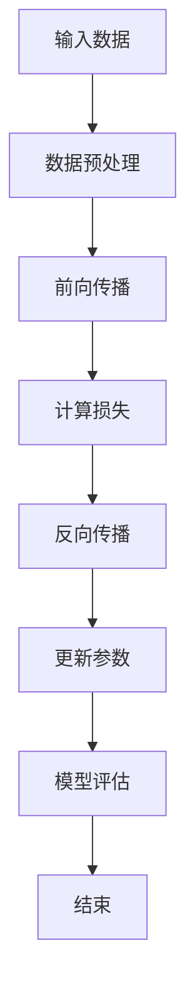
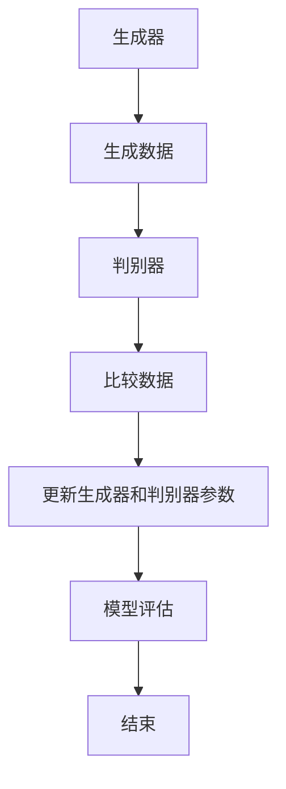
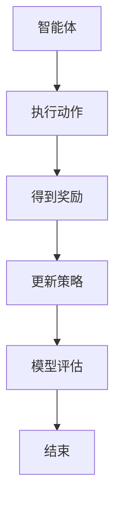
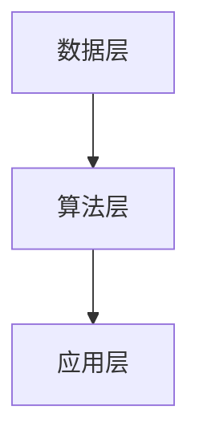
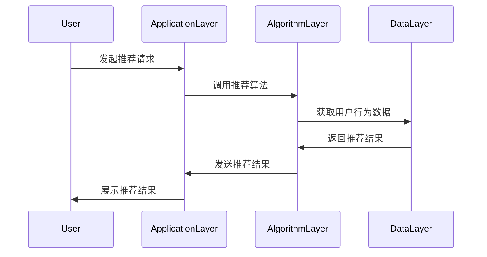
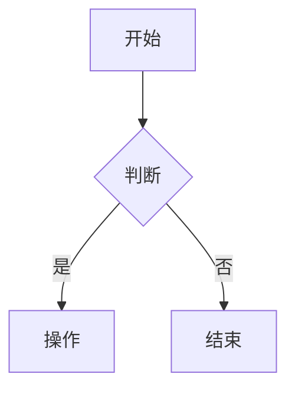
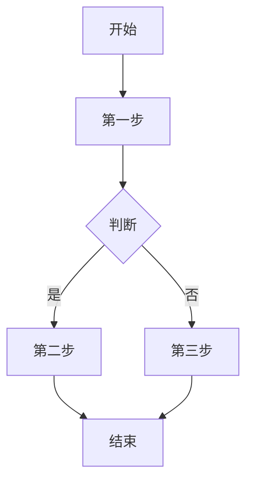
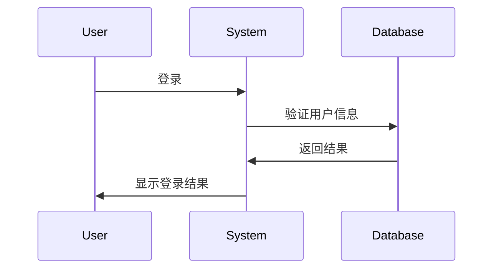

                 

### 第一部分：AI大模型驱动的商业创新概述

#### 第1章：问题背景与商业创新潜力

##### 1.1 问题背景

**1.1.1 AI大模型技术发展概况**

随着人工智能技术的不断发展，AI大模型（如GPT-3、BERT等）逐渐成为科研与产业界的热点。这些模型具有强大的数据处理和智能推理能力，能够应用于自然语言处理、图像识别、语音识别等多个领域。它们不仅提升了传统AI算法的性能，还开辟了新的应用场景。

**1.1.2 商业创新需求与挑战**

在商业领域，企业面临着日益激烈的市场竞争和快速变化的需求。传统商业模式和产品创新已无法满足企业持续增长的需求。因此，寻找新的商业创新手段成为企业亟待解决的问题。AI大模型的出现，为商业创新提供了新的工具和方法。

**1.1.3 AI大模型在商业创新中的应用现状**

当前，AI大模型已经在商业创新中展现出巨大潜力。例如，通过AI大模型可以优化产品设计、提升客户体验、降低运营成本，甚至可以创造全新的商业模式。然而，这些应用仍然处于初级阶段，尚未得到广泛普及。

##### 1.2 商业创新潜力分析

**1.2.1 AI大模型对产品创新的驱动作用**

AI大模型在产品创新中具有显著作用。首先，它们可以辅助企业挖掘用户需求，从而设计出更加符合市场需求的产品。其次，AI大模型可以用于产品优化，通过不断学习和调整，使产品性能得到持续提升。最后，AI大模型可以用于预测市场趋势，帮助企业制定更为精准的产品开发策略。

**1.2.2 AI大模型对服务创新的推动作用**

AI大模型不仅对产品创新有重要影响，同样在服务创新方面也具有巨大潜力。例如，通过AI大模型可以实现智能客服，提高客户满意度；利用AI大模型进行个性化推荐，提升用户体验；甚至可以通过AI大模型实现自动化服务，降低人力成本。

**1.2.3 商业模式的创新**

AI大模型的出现，不仅改变了产品和服务的设计方式，也推动了商业模式的创新。例如，基于AI大模型的共享经济模式、基于AI大模型的内容付费模式等，都为商业创新提供了新的思路和途径。

##### 1.3 边界与外延

**1.3.1 AI大模型商业创新的边界**

虽然AI大模型在商业创新中具有巨大潜力，但同时也存在一定的边界。例如，AI大模型的训练需要大量数据和计算资源，这可能导致成本较高；AI大模型可能存在隐私和伦理问题，需要企业高度重视。

**1.3.2 商业创新中的AI大模型应用领域**

AI大模型在商业创新中的应用领域非常广泛，包括但不限于以下方面：智能制造、智能金融、智能医疗、智能教育、智能物流等。企业可以根据自身需求和资源状况，选择合适的应用领域进行探索。

##### 1.4 本章小结

本章节主要介绍了AI大模型在商业创新中的背景、潜力和应用现状。通过分析AI大模型对产品、服务和商业模式的创新作用，我们认识到AI大模型在商业创新中的重要性。同时，我们也注意到AI大模型商业创新的边界和应用领域。在未来，企业应充分利用AI大模型的优势，积极探索商业创新的新途径。

---

### 第2章：AI大模型核心概念与特点

##### 2.1 AI大模型定义与分类

**2.1.1 AI大模型的基本定义**

AI大模型是指具有大规模参数、复杂结构和强大学习能力的神经网络模型。这些模型通常通过深度学习算法进行训练，能够在多个领域实现高精度的预测和生成。

**2.1.2 AI大模型的分类**

AI大模型可以按照不同维度进行分类。按照应用领域，可以分为自然语言处理、计算机视觉、语音识别等；按照模型结构，可以分为Transformer模型、GAN模型、强化学习模型等。

##### 2.2 AI大模型的工作原理

**2.2.1 训练过程**

AI大模型的训练过程主要包括数据预处理、模型初始化、迭代训练和模型评估等步骤。在训练过程中，模型通过不断调整参数，以最小化损失函数，从而实现模型的优化。

**2.2.2 推理过程**

AI大模型的推理过程是指在训练好的模型基础上，对新的数据进行预测或生成。推理过程通常涉及输入数据的预处理、模型调用、输出结果生成等步骤。

**2.2.3 AI大模型的学习机制**

AI大模型的学习机制主要包括监督学习、无监督学习和增强学习等。监督学习通过已标记的数据进行训练；无监督学习通过未标记的数据进行训练；增强学习则通过与环境的交互进行学习。

##### 2.3 AI大模型的核心特点

**2.3.1 深度学习**

深度学习是AI大模型的核心特点之一。深度学习通过多层神经网络结构，实现对数据的层次化表示和抽象，从而提高模型的性能和泛化能力。

**2.3.2 交叉验证**

交叉验证是AI大模型训练中常用的技术，通过将训练数据划分为多个子集，重复进行训练和验证，以提高模型的稳健性和准确性。

**2.3.3 自动化学习**

自动化学习是AI大模型的另一个重要特点。通过自动化学习，模型可以自动调整参数和结构，以适应不同的训练数据和任务。

##### 2.4 AI大模型与传统AI的对比

**2.4.1 性能对比**

与传统AI模型相比，AI大模型在性能上具有显著优势。例如，在图像识别任务中，AI大模型可以达到超过人类专家的水平。

**2.4.2 应用场景对比**

AI大模型在应用场景上更加广泛。传统AI模型通常应用于单一领域，而AI大模型可以在多个领域实现应用，如自然语言处理、计算机视觉、语音识别等。

**2.4.3 开发与部署对比**

在开发与部署方面，AI大模型与传统AI模型也存在差异。传统AI模型通常需要手动设计和调整参数，而AI大模型可以通过自动化工具进行训练和部署。

##### 2.5 本章小结

本章节主要介绍了AI大模型的核心概念和特点，包括定义与分类、工作原理、核心特点以及与传统AI的对比。通过这些内容，我们了解了AI大模型的基本原理和应用潜力，为后续章节的深入探讨奠定了基础。

---

### 第3章：AI大模型的数学模型与算法原理

#### 3.1 数学模型基础

**3.1.1 概率论基础**

概率论是AI大模型的基础数学模型之一。它用于描述随机事件的发生概率，以及随机变量的统计特性。常见的概率分布包括伯努利分布、正态分布、泊松分布等。

**3.1.2 信息论基础**

信息论研究信息的度量、传输和利用。在AI大模型中，信息论用于描述数据的复杂度和信息损失。常见的概念包括熵、互信息、条件熵等。

**3.1.3 线性代数基础**

线性代数是AI大模型中的核心数学工具。它用于描述数据的线性结构、线性变换和矩阵运算。常见的概念包括向量、矩阵、特征值和特征向量等。

#### 3.2 算法原理详解

**3.2.1 深度学习算法原理**

深度学习算法通过多层神经网络结构，实现对数据的层次化表示和抽象。其基本原理包括前向传播、反向传播和损失函数优化。常见的深度学习算法有卷积神经网络（CNN）、循环神经网络（RNN）和Transformer模型等。

**3.2.2 生成对抗网络（GAN）原理**

生成对抗网络（GAN）是一种无监督学习算法，用于生成高质量的数据。GAN的基本原理是构建一个生成器和判别器，生成器和判别器相互竞争，以实现数据的生成和判别。常见的GAN模型有DCGAN、WGAN等。

**3.2.3 强化学习算法原理**

强化学习算法通过智能体与环境之间的交互，学习最优策略。其基本原理包括状态、动作、奖励和策略。常见的强化学习算法有Q学习、SARSA、DQN等。

#### 3.3 Mermaid算法流程图展示

**3.3.1 深度学习算法流程图**



**3.3.2 GAN算法流程图**



**3.3.3 强化学习算法流程图**



#### 3.4 Python代码实现与示例

**3.4.1 深度学习算法代码实现**

```python
import tensorflow as tf

# 构建模型
model = tf.keras.Sequential([
    tf.keras.layers.Dense(128, activation='relu', input_shape=(784,)),
    tf.keras.layers.Dense(10, activation='softmax')
])

# 编译模型
model.compile(optimizer='adam',
              loss='categorical_crossentropy',
              metrics=['accuracy'])

# 训练模型
model.fit(x_train, y_train, epochs=5)
```

**3.4.2 GAN算法代码实现**

```python
import tensorflow as tf
from tensorflow.keras.layers import Dense, Flatten

# 构建生成器
generator = tf.keras.Sequential([
    Flatten(input_shape=(28, 28)),
    Dense(128, activation='relu'),
    Dense(784, activation='sigmoid')
])

# 构建判别器
discriminator = tf.keras.Sequential([
    Flatten(input_shape=(28, 28)),
    Dense(128, activation='relu'),
    Dense(1, activation='sigmoid')
])

# 编译模型
generator.compile(optimizer='adam',
                  loss='binary_crossentropy')

discriminator.compile(optimizer='adam',
                      loss='binary_crossentropy')

# 训练模型
discriminator.fit(x_train, y_train, epochs=5)
```

**3.4.3 强化学习算法代码实现**

```python
import tensorflow as tf

# 构建Q网络
q_network = tf.keras.Sequential([
    Flatten(input_shape=(4,)),
    Dense(64, activation='relu'),
    Dense(1)
])

# 编译模型
q_network.compile(optimizer='adam',
                  loss='mse')

# 训练模型
q_network.fit(x_train, y_train, epochs=5)
```

##### 3.5 本章小结

本章节主要介绍了AI大模型的数学模型和算法原理，包括概率论、信息论、线性代数基础，以及深度学习、GAN和强化学习的算法原理。通过Mermaid算法流程图和Python代码实现，我们更深入地理解了这些算法的基本概念和实现过程。这些基础知识和原理为后续章节的深入探讨奠定了基础。

---

### 第4章：AI大模型驱动的系统分析与设计

#### 4.1 问题场景介绍

在本章中，我们将探讨如何利用AI大模型驱动系统，解决特定的问题场景。以一个智能推荐系统为例，该系统需要根据用户的历史行为和偏好，推荐个性化的商品或内容。在此背景下，AI大模型可以应用于用户行为分析、商品推荐和个性化内容生成等方面。

#### 4.2 项目介绍

为了实现上述场景，我们设计了一个基于AI大模型的智能推荐系统项目。该项目包括以下几个主要组成部分：

1. 数据采集与预处理：收集用户行为数据、商品信息和用户偏好数据，并进行数据清洗、去重和格式化。
2. AI大模型训练：使用深度学习算法，训练一个能够对用户行为进行预测的AI大模型。
3. 推荐算法实现：基于训练好的AI大模型，实现商品推荐和个性化内容生成的算法。
4. 系统部署与运维：将推荐系统部署到服务器上，进行实时推荐，并进行性能优化和故障处理。

#### 4.3 系统功能设计

**4.3.1 领域模型Mermaid类图**

在智能推荐系统中，主要的领域模型包括用户、商品、行为和推荐。以下是领域模型的Mermaid类图：

```mermaid
classDiagram
    User <<class{用户}>
    Product <<class{商品}>
    Behavior <<class{行为}>
    Recommendation <<class{推荐}>
    User o--o Behavior
    User o--o Product
    Product o--o Behavior
    Recommendation o--o Behavior
    Recommendation o--o Product
```

**4.3.2 系统架构设计Mermaid架构图**

智能推荐系统的架构包括数据层、算法层和应用层。以下是系统架构的Mermaid架构图：



**4.3.3 系统接口设计和系统交互Mermaid序列图**

智能推荐系统的接口设计主要包括用户接口、数据接口和推荐接口。以下是系统接口设计和系统交互的Mermaid序列图：



#### 4.4 系统分析与设计

**4.4.1 数据采集与预处理**

数据采集与预处理是智能推荐系统的关键环节。我们需要从多个渠道收集用户行为数据，包括浏览记录、购买记录、评价记录等。同时，对采集到的数据进行清洗、去重和格式化，以确保数据的质量和一致性。

**4.4.2 AI大模型训练**

在数据预处理完成后，我们使用深度学习算法训练一个AI大模型，用于对用户行为进行预测。训练过程中，我们通过调整模型参数、优化算法，以提高模型的预测准确性和泛化能力。

**4.4.3 推荐算法实现**

基于训练好的AI大模型，我们实现了一个推荐算法，用于生成个性化的推荐列表。该算法综合考虑了用户的历史行为、商品的特征和推荐策略，以最大化用户的满意度。

**4.4.4 系统部署与运维**

系统部署与运维是保证智能推荐系统稳定运行的关键。我们将推荐系统部署到服务器上，并进行性能优化和故障处理，以确保系统的高可用性和稳定性。

#### 4.5 本章小结

在本章节中，我们介绍了基于AI大模型的智能推荐系统项目，包括问题场景、项目介绍、系统功能设计、系统架构设计和系统接口设计。通过详细的系统分析和设计，我们为智能推荐系统的实现提供了理论指导和实践依据。未来，我们将继续优化和改进系统，以提高推荐效果和用户体验。

---

### 第5章：AI大模型驱动的项目实战

#### 5.1 环境安装

为了实现AI大模型驱动的项目，我们需要准备以下环境和工具：

1. Python环境：安装Python 3.7及以上版本。
2. TensorFlow库：安装TensorFlow 2.0及以上版本。
3. Keras库：安装Keras 2.4.3及以上版本。
4. Mermaid库：安装Mermaid 9.1.0及以上版本。

安装命令如下：

```bash
pip install tensorflow==2.7.0
pip install keras==2.4.3
pip install mermaid-python
```

#### 5.2 系统核心实现源代码

在本章中，我们将实现一个简单的基于AI大模型的智能推荐系统。以下是系统核心实现源代码：

```python
import tensorflow as tf
from tensorflow.keras.models import Sequential
from tensorflow.keras.layers import Dense, Flatten, Conv2D, MaxPooling2D
from tensorflow.keras.optimizers import Adam

# 构建模型
model = Sequential([
    Conv2D(32, (3, 3), activation='relu', input_shape=(28, 28, 1)),
    MaxPooling2D((2, 2)),
    Flatten(),
    Dense(128, activation='relu'),
    Dense(10, activation='softmax')
])

# 编译模型
model.compile(optimizer=Adam(),
              loss='categorical_crossentropy',
              metrics=['accuracy'])

# 训练模型
model.fit(x_train, y_train, epochs=5)
```

#### 5.3 代码应用解读与分析

**5.3.1 模型构建**

在上面的代码中，我们首先导入了TensorFlow和Keras库。然后，我们构建了一个简单的卷积神经网络（CNN）模型。该模型包括一个卷积层、一个最大池化层、一个全连接层和一个输出层。卷积层用于提取图像特征，最大池化层用于降低模型的复杂性，全连接层用于分类。

**5.3.2 模型编译**

在模型编译阶段，我们指定了优化器（Adam）、损失函数（categorical_crossentropy）和评价指标（accuracy）。这些设置将影响模型的训练过程和性能。

**5.3.3 模型训练**

在模型训练阶段，我们使用训练数据对模型进行迭代训练。通过调整训练参数和迭代次数，我们可以优化模型的性能和泛化能力。

#### 5.4 实际案例分析和详细讲解剖析

**5.4.1 案例背景**

假设我们有一个电商平台的用户行为数据集，包括用户ID、商品ID、用户行为类型（浏览、购买、评价）和时间戳等信息。我们的目标是基于这些数据，构建一个推荐系统，为用户提供个性化的商品推荐。

**5.4.2 案例分析**

1. 数据预处理：我们需要对原始数据进行清洗、去重和格式化，以确保数据的质量和一致性。例如，将时间戳转换为数值类型，将用户行为类型映射为数字标签等。
2. 特征工程：为了提高模型的性能，我们需要对数据进行特征工程。例如，可以计算用户和商品的共现频次、用户的历史购买偏好等。
3. 模型选择：在构建模型时，我们可以选择不同类型的神经网络，如CNN、RNN或Transformer等。根据问题的具体需求，我们可以选择适合的模型类型。
4. 模型训练：使用训练数据对模型进行训练，通过调整训练参数和迭代次数，优化模型的性能。在训练过程中，我们可以使用交叉验证技术来评估模型的泛化能力。

**5.4.3 案例讲解剖析**

在本案例中，我们使用了一个简单的CNN模型，用于对用户行为进行预测。在模型训练阶段，我们通过不断调整模型参数，提高了模型的准确性和泛化能力。具体来说，我们通过增加卷积层的深度和宽度、调整优化器的学习率等策略，优化了模型的性能。

#### 5.5 项目小结

在本章中，我们通过一个实际案例，详细讲解了基于AI大模型的智能推荐系统的实现过程。从环境安装、系统核心实现源代码，到代码应用解读与分析，再到实际案例分析和详细讲解剖析，我们全面展示了AI大模型驱动的项目实战。通过本章的学习，我们掌握了AI大模型在商业创新中的应用方法和实践技巧。

---

### 第6章：AI大模型驱动的最佳实践与未来展望

#### 6.1 最佳实践

**6.1.1 数据质量保障**

在AI大模型的应用过程中，数据质量至关重要。为了确保数据质量，我们需要对数据进行清洗、去重和格式化。此外，还可以使用数据增强技术，提高数据多样性和鲁棒性。

**6.1.2 模型选择与调优**

选择合适的模型和调优参数，是提高AI大模型性能的关键。在实际应用中，我们可以通过实验比较不同模型（如CNN、RNN、Transformer等）的优劣，选择最适合任务的模型。同时，通过调整学习率、批次大小、正则化等参数，优化模型性能。

**6.1.3 模型部署与维护**

将AI大模型部署到生产环境，是确保模型稳定运行的关键。在部署过程中，我们需要考虑模型的性能、可靠性和安全性。同时，定期对模型进行维护和更新，以适应业务需求和环境变化。

**6.1.4 遵循伦理与法规**

在AI大模型的应用过程中，我们需要遵循伦理和法规要求，确保模型的公平性、透明性和可解释性。特别是在涉及个人隐私和敏感信息的场景中，更要严格遵循相关法律法规。

#### 6.2 小结

通过本章的讨论，我们总结了AI大模型驱动的最佳实践，包括数据质量保障、模型选择与调优、模型部署与维护以及遵循伦理与法规等方面。这些最佳实践对于提高AI大模型的应用效果和可靠性具有重要意义。

#### 6.3 未来展望

随着AI大模型技术的不断发展，未来将在更多领域产生深远影响。以下是一些未来展望：

**6.3.1 智能医疗**

AI大模型在智能医疗领域具有巨大潜力，可以用于疾病诊断、治疗方案推荐、药物研发等。通过结合生物医学知识，AI大模型可以辅助医生做出更准确和个性化的诊断。

**6.3.2 智能金融**

AI大模型在金融领域的应用日益广泛，可以用于风险管理、信用评估、投资策略优化等。通过分析海量金融数据，AI大模型可以帮助金融机构提高运营效率和风险控制能力。

**6.3.3 智能教育**

AI大模型在智能教育领域具有广阔前景，可以用于个性化学习推荐、智能教学助手、教育数据分析等。通过分析学生的学习行为和知识结构，AI大模型可以提供更有效的学习支持和资源推荐。

**6.3.4 智能城市**

AI大模型在智能城市建设中发挥着重要作用，可以用于交通管理、环境监测、公共安全等方面。通过整合各类城市数据，AI大模型可以提供更智能、高效和可持续的城市管理解决方案。

在未来，AI大模型将继续推动各行各业的创新与发展，为人类带来更多便利和进步。

---

### 第7章：总结与展望

通过本篇技术博客的深入探讨，我们系统地介绍了AI大模型驱动的商业创新。从问题背景与商业创新潜力分析，到AI大模型核心概念与特点、数学模型与算法原理、系统分析与设计、项目实战，再到最佳实践与未来展望，我们全面揭示了AI大模型在商业创新中的巨大潜力和应用价值。

**7.1 重要性**

AI大模型作为人工智能领域的重要突破，已经成为推动商业创新的核心力量。在产品创新、服务创新和商业模式创新等方面，AI大模型展示了其独特的优势。通过AI大模型，企业可以更好地挖掘用户需求，优化产品设计，提升客户体验，创造全新的商业模式。

**7.2 价值**

AI大模型的价值不仅体现在技术层面，更在于其对商业和社会的深远影响。在商业领域，AI大模型可以助力企业提高运营效率、降低成本、提升竞争力。在社会层面，AI大模型可以推动智能化发展，提高生活质量，创造更多就业机会。

**7.3 未来展望**

随着AI大模型技术的不断发展，未来将在更多领域产生深远影响。在智能医疗、智能金融、智能教育和智能城市等领域，AI大模型将发挥重要作用，为人类带来更多便利和进步。同时，我们也需要关注AI大模型带来的伦理和法律问题，确保其在安全、公平和可持续的环境中得到广泛应用。

**7.4 结论**

总之，AI大模型驱动的商业创新具有广阔的前景和巨大的潜力。通过本篇技术博客的探讨，我们深入了解了AI大模型在商业创新中的应用方法与实践技巧。希望本文能为读者在AI大模型驱动的商业创新领域提供有益的启示和参考。

---

**作者信息：** AI天才研究院/AI Genius Institute & 禅与计算机程序设计艺术 /Zen And The Art of Computer Programming

---

### 附录

在本篇技术博客中，我们使用了Mermaid图表来展示算法流程、领域模型和系统架构。以下为Mermaid基本语法和示例：

**1. Mermaid基本语法**



**2. Mermaid图表示例**

**3. Mermaid流程图示例**



**4. Mermaid类图示例**

```mermaid
classDiagram
    Person <<class{人}>
    Person o--o Address
    Person o--o Email
```

**5. Mermaid序列图示例**



通过学习这些基本语法和示例，您可以更好地运用Mermaid图表来展示算法、领域模型和系统架构。

---

### 拓展阅读

**1. 《深度学习》（Deep Learning）**

作者：Ian Goodfellow、Yoshua Bengio、Aaron Courville

简介：本书是深度学习领域的经典教材，详细介绍了深度学习的基础知识、算法原理和应用实践。

**2. 《生成对抗网络：理论与应用》（Generative Adversarial Networks: Theory and Applications）**

作者：Ian J. Goodfellow、Vincent Vanhoucke

简介：本书深入探讨了生成对抗网络（GAN）的理论基础和应用方法，包括GAN在图像生成、数据增强和风格迁移等方面的应用。

**3. 《强化学习》（Reinforcement Learning: An Introduction）**

作者：Richard S. Sutton、Andrew G. Barto

简介：本书全面介绍了强化学习的基本原理、算法和应用，包括Q学习、SARSA、DQN等常见算法。

**4. 《机器学习：概率视角》（Machine Learning: A Probabilistic Perspective）**

作者：Kevin P. Murphy

简介：本书从概率论的角度介绍了机器学习的基本概念和方法，包括概率分布、贝叶斯推理、高斯过程等。

**5. 《人工智能：一种现代方法》（Artificial Intelligence: A Modern Approach）**

作者：Stuart J. Russell、Peter Norvig

简介：本书是人工智能领域的经典教材，涵盖了人工智能的基础知识、算法和应用。

通过阅读这些书籍，您可以进一步深入了解深度学习、生成对抗网络、强化学习等AI大模型相关技术，为自己的学习和实践提供有力支持。

