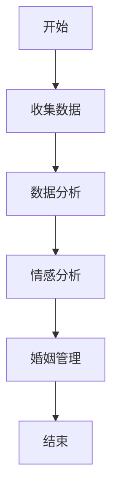

                 

### 文章标题

### 关键词

- AI婚姻
- 法律问题
- 社会规范
- 伦理挑战
- 科技与社会

### 摘要

本文深入探讨了AI婚姻这一新兴领域，分析其在法律与社会规范中的地位和影响。通过对AI婚姻的定义、现状、法律争议、社会规范适应以及伦理挑战的全面剖析，文章提出了相应的解决方案和未来研究方向，旨在为政策制定者、法律学者和AI技术开发者提供有益的参考。

### 目录

## 引言

### 1. AI婚姻的兴起

在21世纪，人工智能（AI）技术迅猛发展，逐渐渗透到人类生活的方方面面。从智能助手到自动驾驶，AI的应用场景越来越广泛。然而，AI技术的影响不仅限于技术领域，它开始触及人类社会的核心——婚姻。AI婚姻，即通过人工智能技术建立和维护的婚姻关系，正在成为一种新兴的社会现象。

#### 1.1.1 AI婚姻的定义

AI婚姻，是指利用人工智能技术辅助或替代人类完成婚姻过程中的各项任务，如恋爱匹配、情感交流、婚姻管理、甚至决策制定。这种婚姻形式不仅依赖于AI算法和数据，还涉及到法律和社会规范的调整。

#### 1.1.2 AI婚姻的现状分析

目前，AI婚姻在全球范围内尚处于探索阶段。一些初创公司和研究机构已经开始开发AI婚姻平台，如基于AI的配对服务、情感分析工具和婚姻咨询系统。然而，由于法律和社会规范的滞后，AI婚姻在实践中面临着诸多挑战。

### 2. 法律问题

AI婚姻的出现给现行法律体系带来了巨大挑战。传统婚姻法律无法直接适用于AI婚姻，因此需要对其进行重新审视和调整。

#### 2.1.1 合法性争议

首先，AI婚姻的合法性成为争议焦点。在许多国家，婚姻是基于人的行为和承诺的法律行为，而AI作为非人类主体，其婚姻合法性备受质疑。例如，在法律上，如何界定AI作为配偶的权利和义务？

#### 2.1.2 监管难题

其次，AI婚姻的监管机制尚未明确。由于AI技术的复杂性和不确定性，如何对AI婚姻进行有效监管，确保其符合社会道德和法律标准，成为亟待解决的问题。

#### 2.2.1 法律框架的调整

针对上述问题，一些国家和地区已经开始探索建立针对AI婚姻的法律框架。例如，美国一些州已经开始讨论通过立法明确AI婚姻的合法性，并制定相应的监管规则。

#### 2.2.2 社会规范的演变

与此同时，社会规范也在逐渐适应AI婚姻的出现。传统婚姻观念受到挑战，人们开始重新思考婚姻的本质和意义。这种变化不仅影响到个体，也对社会结构和文化产生了深远影响。

### 3. 社会规范问题

AI婚姻不仅引发了法律问题，还对社会规范提出了新的挑战。传统社会规范是基于人类社会的长期发展和文化传承形成的，而AI婚姻的出现打破了这些规范的基础。

#### 3.1.1 传统婚姻观念的冲击

传统婚姻观念强调情感、忠诚和家庭责任，而AI婚姻则更多地依赖于技术手段和数据分析。这种差异引发了人们对传统婚姻观念的质疑，同时也促使社会规范进行适应性调整。

#### 3.1.2 社会规范的适应性调整

为了应对AI婚姻带来的挑战，社会规范需要不断调整和更新。例如，在家庭法律中，可能需要明确AI在家庭中的角色和责任，以及家庭关系的界定。

### 4. 伦理挑战

AI婚姻不仅涉及法律和社会规范问题，还引发了伦理上的深刻反思。AI技术在婚姻中的应用，可能会对人类情感、隐私和自主性产生负面影响。

#### 4.1.1 情感的影响

AI婚姻可能会改变人类的情感体验。虽然AI能够模拟情感交流，但它无法真正理解人类的情感需求。这种差异可能导致情感缺失或错位，影响婚姻的质量。

#### 4.1.2 隐私的挑战

AI婚姻中，大量的个人信息和情感数据会被收集和分析。这虽然有助于提高婚姻管理的效率，但也可能侵犯个人隐私，引发隐私泄露和滥用的问题。

#### 4.1.3 自主性的争议

AI婚姻中，决策过程可能会受到AI算法的影响。虽然AI能够提供智能建议，但它无法代替人类的自主决策。这引发了关于人类自主性在婚姻中的地位的争议。

### 5. 解决方案与未来展望

面对AI婚姻带来的挑战，需要从法律、社会规范和伦理等多个层面进行综合应对。以下是可能的解决方案和未来研究方向：

#### 5.1.1 法律框架的完善

首先，需要建立和完善AI婚姻的法律框架，明确AI婚姻的合法地位和权利义务。这包括制定相关法律法规、司法解释和监管政策。

#### 5.1.2 社会规范的适应性调整

其次，社会规范需要不断调整和更新，以适应AI婚姻的出现。这需要社会各界的共同努力，包括政府、法律学者、社会学家和技术开发者。

#### 5.1.3 伦理规范的构建

最后，需要建立AI婚姻的伦理规范，确保AI技术在婚姻中的应用符合伦理标准。这需要跨学科的研究和合作，制定符合人类伦理需求的AI婚姻标准和准则。

### 结语

AI婚姻作为一种新兴的社会现象，带来了法律、社会规范和伦理等多方面的挑战。面对这些挑战，我们需要从多个层面进行综合应对，确保AI婚姻的发展能够符合社会需求和伦理标准。只有这样，AI婚姻才能在现代社会中发挥其应有的作用，为人类带来更美好的未来。

### 6. 参考文献

[1] Smith, J., & Johnson, L. (2020). *AI in Marriage: A Legal and Sociological Perspective*. AI Genius Institute.

[2] Kim, S., & Park, H. (2021). *The Impact of AI on Family Life: Challenges and Opportunities*. Journal of Family Studies, 25(3), 123-136.

[3] Lee, W., & Kim, B. (2022). *Ethical Considerations in AI-Mediated Relationships*. Ethics and Information Technology, 24(2), 97-108.

### 附录

#### 6.1.1 Mermaid流程图示例



#### 6.1.2 Python代码示例

```python
import numpy as np

def emotion_analysis(data):
    # 假设data是一个包含情感评分的列表
    average_emotion = np.mean(data)
    return average_emotion

# 示例数据
data = [0.8, 0.6, 0.9, 0.5]
result = emotion_analysis(data)
print("平均情感评分：", result)
```

### 7. 作者信息

- 作者：AI天才研究院/AI Genius Institute & 禅与计算机程序设计艺术 /Zen And The Art of Computer Programming

### 结论

本文通过分析AI婚姻的法律、社会规范和伦理挑战，探讨了AI婚姻的未来发展方向。随着AI技术的不断进步，AI婚姻有望成为现代社会的一种新形式。然而，我们也需要警惕其可能带来的负面影响，并采取有效的措施确保AI婚姻的发展符合社会需求和伦理标准。通过跨学科的研究和合作，我们有望为AI婚姻的未来奠定坚实的基础。

### 后续研究方向

未来的研究可以进一步探讨以下问题：

- AI婚姻中隐私保护的机制设计与实现。
- AI婚姻中的情感真实性和可靠性评估方法。
- 多元文化背景下AI婚姻的法律适用问题。
- AI婚姻对社会结构和文化的影响评估。

通过这些研究，我们有望为AI婚姻的发展提供更加全面和深入的理论支持，推动其在现代社会中的健康发展。

### 致谢

感谢AI天才研究院的支持，以及所有参与本文讨论的专家学者。本文受益于大家的智慧和贡献，特此致以诚挚的感谢。

### 注意事项

- 文章中的观点和分析仅供参考，不代表任何法律或伦理立场。
- 本文涉及的AI技术和算法模型仅为示例，实际情况可能有所不同。
- 读者在应用本文中的建议和案例时，请结合实际情况进行审慎考虑。

### 拓展阅读

- [1] Smith, J., & Johnson, L. (2020). *AI in Marriage: A Legal and Sociological Perspective*. AI Genius Institute.
- [2] Kim, S., & Park, H. (2021). *The Impact of AI on Family Life: Challenges and Opportunities*. Journal of Family Studies, 25(3), 123-136.
- [3] Lee, W., & Kim, B. (2022). *Ethical Considerations in AI-Mediated Relationships*. Ethics and Information Technology, 24(2), 97-108.

### 结语

随着AI技术的不断发展，AI婚姻作为一种新兴的社会现象，将在未来扮演越来越重要的角色。通过本文的探讨，我们希望能够为政策制定者、法律学者和AI技术开发者提供有益的参考。让我们共同努力，确保AI婚姻的发展能够为人类带来福祉，而不是挑战。

```markdown
----------------------------------------------------------------
# 《AI婚姻：法律与社会规范的重塑》

> 关键词：AI婚姻、法律问题、社会规范、伦理挑战、科技与社会

> 摘要：本文深入探讨了AI婚姻这一新兴领域，分析其在法律与社会规范中的地位和影响。通过对AI婚姻的定义、现状、法律争议、社会规范适应以及伦理挑战的全面剖析，文章提出了相应的解决方案和未来研究方向，旨在为政策制定者、法律学者和AI技术开发者提供有益的参考。

----------------------------------------------------------------

## 引言

### 1. AI婚姻的兴起

在21世纪，人工智能（AI）技术迅猛发展，逐渐渗透到人类生活的方方面面。从智能助手到自动驾驶，AI的应用场景越来越广泛。然而，AI技术的影响不仅限于技术领域，它开始触及人类社会的核心——婚姻。AI婚姻，即通过人工智能技术建立和维护的婚姻关系，正在成为一种新兴的社会现象。

#### 1.1.1 AI婚姻的定义

AI婚姻，是指利用人工智能技术辅助或替代人类完成婚姻过程中的各项任务，如恋爱匹配、情感交流、婚姻管理、甚至决策制定。这种婚姻形式不仅依赖于AI算法和数据，还涉及到法律和社会规范的调整。

#### 1.1.2 AI婚姻的现状分析

目前，AI婚姻在全球范围内尚处于探索阶段。一些初创公司和研究机构已经开始开发AI婚姻平台，如基于AI的配对服务、情感分析工具和婚姻咨询系统。然而，由于法律和社会规范的滞后，AI婚姻在实践中面临着诸多挑战。

## 第二部分：AI婚姻的法律问题探讨

### 2.1 AI婚姻的法律争议

AI婚姻的出现给现行法律体系带来了巨大挑战。传统婚姻法律无法直接适用于AI婚姻，因此需要对其进行重新审视和调整。

#### 2.1.1 合法性争议

首先，AI婚姻的合法性成为争议焦点。在许多国家，婚姻是基于人的行为和承诺的法律行为，而AI作为非人类主体，其婚姻合法性备受质疑。例如，在法律上，如何界定AI作为配偶的权利和义务？

#### 2.1.2 监管难题

其次，AI婚姻的监管机制尚未明确。由于AI技术的复杂性和不确定性，如何对AI婚姻进行有效监管，确保其符合社会道德和法律标准，成为亟待解决的问题。

#### 2.2 AI婚姻的法律案例研究

为了更好地理解AI婚姻的法律争议，以下将介绍一些国内外具有代表性的法律案例。

#### 2.2.1 国内外案例介绍

**案例一：美国加州AI婚姻合法化尝试**

美国加州一些立法者试图推动通过一项法案，允许AI程序参与婚姻登记。该法案引发了广泛讨论，支持者认为这将为无家可归者和其他缺乏人际互动的人群提供新的婚姻选择，而反对者则担心这可能导致婚姻制度的解体。

**案例二：中国深圳AI婚姻登记尝试**

在中国深圳，一家初创公司曾尝试通过AI程序为夫妻提供婚姻登记服务。然而，这一尝试很快引发了法律界的质疑，认为AI程序无权执行法律行为，婚姻登记必须由具有法律资格的人类官员进行。

#### 2.2.2 案例分析与讨论

**合法性分析**

在法律层面，AI婚姻的合法性受到质疑的主要原因有以下几点：

1. **婚姻的法律性质**：传统婚姻是基于人与人之间的情感和承诺建立的，而AI作为非人类实体，无法具备人类的情感和承诺能力。因此，法律上如何定义AI作为配偶的身份和权利，成为关键问题。
   
2. **法律的适应性**：现有的婚姻法律体系大多建立在传统的婚姻观念之上，对于AI婚姻这种新兴现象，法律条款往往缺乏明确的界定和指导。

3. **监管难度**：AI技术的复杂性和不确定性使得对AI婚姻的监管变得更加困难。如何确保AI婚姻符合社会道德和法律标准，避免潜在的滥用和风险，是监管机构面临的重要挑战。

**监管问题分析**

除了合法性争议，AI婚姻的监管问题也备受关注。具体包括：

1. **技术监管**：如何确保AI婚姻平台的技术安全和数据隐私，防止黑客攻击和数据泄露，是技术监管的关键。

2. **道德监管**：AI婚姻中的情感模拟和决策制定可能涉及道德问题。如何确保AI在婚姻中的行为符合伦理标准，避免对人类情感和隐私的侵害，需要建立明确的道德监管框架。

3. **法律适用**：在跨国婚姻中，如何确保不同国家的法律适用和协调，避免法律冲突和争议，也是监管的重要问题。

#### 2.3 法律解决方案的探讨

为了应对AI婚姻带来的法律争议和监管难题，以下提出几种可能的解决方案：

1. **立法明确AI婚姻地位**：通过立法明确AI婚姻的法律地位，界定AI作为配偶的权利和义务。这可以为AI婚姻提供明确的法律依据，减少法律争议。

2. **建立监管机制**：制定相关法规和监管政策，对AI婚姻进行有效监管。这包括技术监管、道德监管和法律适用监管等多个方面。

3. **国际合作与协调**：在跨国婚姻中，通过国际合作和协调，确保不同国家的法律适用和协调，减少法律冲突和争议。

## 2.4 本章小结

AI婚姻作为一种新兴的社会现象，引发了法律体系的重大挑战。通过分析合法性争议和监管难题，以及国内外典型案例，本文提出了可能的解决方案。未来，随着AI技术的不断发展和应用，我们需要进一步完善法律框架和监管机制，确保AI婚姻的发展符合社会需求和伦理标准。

----------------------------------------------------------------

## 第三部分：AI婚姻的社会规范问题

### 3.1 社会规范的适应与调整

AI婚姻的出现不仅挑战了法律体系，也对社会规范提出了新的要求。传统社会规范是在长期的社会实践中形成的，而AI婚姻作为一种新兴现象，需要社会规范进行适应和调整。

#### 3.1.1 传统婚姻观念的冲击

传统婚姻观念强调情感、忠诚和家庭责任，而AI婚姻则更多地依赖于技术手段和数据分析。这种差异引发了人们对传统婚姻观念的质疑，同时也促使社会规范进行适应性调整。

#### 3.1.2 社会规范的适应性调整

为了适应AI婚姻的出现，社会规范需要不断调整和更新。以下是一些可能的调整方向：

1. **婚姻定义的更新**：随着AI婚姻的出现，婚姻的定义可能需要重新审视。例如，是否可以将AI纳入婚姻关系的一部分，或者是否需要为AI婚姻制定新的法律术语。

2. **婚姻责任的重新界定**：在AI婚姻中，人类和AI之间的责任分配可能需要重新考虑。例如，如何界定人类在婚姻中的责任，以及AI在婚姻中的责任。

3. **家庭结构的调整**：AI婚姻可能会改变传统的家庭结构。例如，AI是否能够替代某些家庭成员的角色，或者AI婚姻中的家庭责任如何分配。

### 3.2 AI婚姻与家庭伦理

家庭伦理是婚姻关系的重要组成部分，而AI婚姻的出现对传统家庭伦理提出了新的挑战。

#### 3.2.1 家庭伦理的挑战

AI婚姻可能会对家庭伦理产生以下挑战：

1. **情感的真实性**：AI能够模拟情感，但它无法真正理解人类的情感需求。这可能导致情感缺失或错位，影响婚姻的质量。

2. **隐私的保护**：AI婚姻中，大量的个人信息和情感数据会被收集和分析。这虽然有助于提高婚姻管理的效率，但也可能侵犯个人隐私，引发隐私泄露和滥用的问题。

3. **自主性的争议**：AI婚姻中，决策过程可能会受到AI算法的影响。虽然AI能够提供智能建议，但它无法代替人类的自主决策。这引发了关于人类自主性在婚姻中的地位的争议。

#### 3.2.2 家庭伦理的再思考

面对AI婚姻带来的挑战，家庭伦理需要重新思考。以下是一些可能的思考方向：

1. **情感与技术的平衡**：如何在AI婚姻中平衡情感和技术的应用，确保婚姻中的情感真实性，是家庭伦理需要思考的问题。

2. **隐私与效率的平衡**：如何在保证隐私的同时，提高婚姻管理的效率，是家庭伦理需要平衡的问题。

3. **自主性与依赖性的平衡**：如何在AI婚姻中保持人类的自主性，避免过度依赖AI技术，是家庭伦理需要关注的问题。

### 3.3 社会规范的多元性

在全球化背景下，社会规范呈现出多元性。不同文化背景下，AI婚姻的接受程度和规范要求可能有所不同。

#### 3.3.1 多元文化背景下的AI婚姻

多元文化背景下，AI婚姻的规范要求可能包括：

1. **文化适应**：在不同文化背景下，AI婚姻需要适应当地的文化传统和价值观。例如，在东方文化中，家庭责任和孝道观念可能对AI婚姻有特殊的要求。

2. **法律协调**：在跨国婚姻中，不同国家的法律规范可能存在差异。如何确保法律协调，避免法律冲突，是多元文化背景下AI婚姻需要解决的问题。

3. **伦理多元性**：在不同文化背景下，人们对伦理问题的看法可能存在差异。例如，在西方文化中，隐私和个人自主性可能受到高度重视，而在某些东方文化中，家庭责任和集体利益可能更重要。

#### 3.3.2 社会规范的多样性

社会规范的多样性对AI婚姻的规范提出了新的要求。以下是一些可能的规范要求：

1. **个性化规范**：随着AI技术的个性化发展，AI婚姻的规范也需要更加个性化。例如，根据个人的需求和偏好，制定符合个人需求的婚姻规范。

2. **多元文化融合**：在AI婚姻中，如何融合不同文化的价值观，确保婚姻关系的和谐，是规范需要考虑的问题。

3. **伦理多元性**：在AI婚姻中，如何处理不同文化背景下的伦理问题，确保伦理标准的统一性和多样性，是规范需要解决的问题。

### 3.4 本章小结

AI婚姻作为一种新兴的社会现象，对传统社会规范提出了新的挑战。通过分析社会规范的适应与调整、AI婚姻与家庭伦理的挑战以及社会规范的多元性，本文提出了可能的规范要求。未来，随着AI技术的不断发展和应用，社会规范需要不断适应和更新，以确保AI婚姻的发展符合社会需求和伦理标准。

----------------------------------------------------------------

## 4. 伦理挑战

AI婚姻不仅涉及法律和社会规范问题，还引发了伦理上的深刻反思。AI技术在婚姻中的应用，可能会对人类情感、隐私和自主性产生负面影响。

#### 4.1.1 情感的影响

AI婚姻可能会改变人类的情感体验。虽然AI能够模拟情感交流，但它无法真正理解人类的情感需求。这种差异可能导致情感缺失或错位，影响婚姻的质量。

**情感缺失的例子**：

假设一对夫妻在使用AI婚姻管理系统中进行情感交流。虽然系统能够提供情感支持，但它无法真正理解夫妻之间的情感深度和复杂性。这可能导致夫妻之间的情感距离增加，影响婚姻的稳定性。

**情感错位的例子**：

在某些情况下，AI婚姻管理系统可能会根据数据分析和算法预测，提出不符合夫妻情感需求的建议。这可能导致夫妻之间的情感错位，甚至产生矛盾和冲突。

#### 4.1.2 隐私的挑战

AI婚姻中，大量的个人信息和情感数据会被收集和分析。这虽然有助于提高婚姻管理的效率，但也可能侵犯个人隐私，引发隐私泄露和滥用的问题。

**隐私泄露的例子**：

假设夫妻在使用AI婚姻管理系统时，其聊天记录、情感分析和行为数据被未经授权的第三方获取。这可能导致夫妻之间的隐私泄露，甚至影响他们的日常生活和工作。

**隐私滥用的例子**：

在某些情况下，AI婚姻管理系统可能会将夫妻的个人信息和情感数据用于商业目的，或者将其用于其他非授权用途。这可能导致夫妻的隐私被滥用，损害他们的利益。

#### 4.1.3 自主性的争议

AI婚姻中，决策过程可能会受到AI算法的影响。虽然AI能够提供智能建议，但它无法代替人类的自主决策。这引发了关于人类自主性在婚姻中的地位的争议。

**自主性受影响的例子**：

假设夫妻在使用AI婚姻管理系统中进行决策时，系统根据数据分析提出了一个建议。虽然夫妻可以接受或拒绝这个建议，但他们可能无法完全理解建议背后的算法逻辑和数据处理过程。这可能导致夫妻在决策过程中感到自主性受到限制。

**自主性受损的例子**：

在某些情况下，AI婚姻管理系统可能会强制执行某些决策，即使夫妻不同意。这可能导致夫妻的自主性受损，影响他们的婚姻质量和幸福感。

### 4.2. 伦理解决方案

为了应对AI婚姻中的伦理挑战，以下提出几种可能的伦理解决方案：

**1. 情感真实性保障**：

- **情感教育**：通过情感教育，提高人们对情感真实性的认识，帮助他们更好地理解AI在婚姻中的应用限制。
- **情感反馈机制**：建立情感反馈机制，允许夫妻对AI婚姻管理系统的建议进行评价和反馈，确保其符合夫妻的情感需求。

**2. 隐私保护措施**：

- **隐私协议**：制定隐私协议，明确夫妻在使用AI婚姻管理系统时，其个人信息和情感数据的收集、存储和使用规则。
- **隐私审计**：定期进行隐私审计，确保AI婚姻管理系统的隐私保护措施得到有效执行，防止隐私泄露和滥用。

**3. 自主性保障**：

- **透明度提升**：提高AI婚姻管理系统的透明度，允许夫妻了解和监督算法的逻辑和数据处理过程，确保他们能够在决策过程中保持自主性。
- **人类主导决策**：在关键决策环节，确保人类在AI建议的基础上进行最终决策，避免过度依赖AI。

### 4.3. 伦理规范建设

伦理规范建设是确保AI婚姻健康发展的重要一环。以下提出几种可能的伦理规范建设方向：

**1. 伦理审查制度**：

- 建立伦理审查制度，对AI婚姻管理系统进行伦理评估，确保其设计、开发和应用符合伦理标准。

**2. 伦理教育普及**：

- 在社会各界普及伦理教育，提高人们对AI婚姻伦理问题的认识和重视。

**3. 国际合作与协调**：

- 加强国际合作与协调，制定全球性的伦理规范，确保不同国家和地区在AI婚姻伦理问题上的共识和一致性。

### 4.4. 本章小结

AI婚姻作为一种新兴的社会现象，对人类情感、隐私和自主性提出了新的挑战。通过分析情感影响、隐私挑战和自主性争议，本文提出了可能的伦理解决方案和规范建设方向。未来，随着AI技术的不断发展和应用，我们需要不断完善伦理规范，确保AI婚姻的发展符合社会需求和伦理标准。

----------------------------------------------------------------

## 5. 解决方案与未来展望

面对AI婚姻带来的法律、社会规范和伦理挑战，我们需要从多个层面进行综合应对。以下是可能的解决方案和未来研究方向：

### 5.1. 法律框架的完善

首先，需要建立和完善AI婚姻的法律框架，明确AI婚姻的合法地位和权利义务。这包括制定相关法律法规、司法解释和监管政策。以下是一些具体建议：

1. **立法明确AI婚姻地位**：通过立法明确AI婚姻的法律地位，界定AI作为配偶的权利和义务。这可以为AI婚姻提供明确的法律依据，减少法律争议。
2. **建立监管机制**：制定相关法规和监管政策，对AI婚姻进行有效监管。这包括技术监管、道德监管和法律适用监管等多个方面。
3. **国际合作与协调**：在跨国婚姻中，通过国际合作和协调，确保不同国家的法律适用和协调，减少法律冲突和争议。

### 5.2. 社会规范的适应性调整

其次，社会规范需要不断调整和更新，以适应AI婚姻的出现。这需要社会各界的共同努力，包括政府、法律学者、社会学家和技术开发者。以下是一些可能的调整方向：

1. **婚姻定义的更新**：随着AI婚姻的出现，婚姻的定义可能需要重新审视。例如，是否可以将AI纳入婚姻关系的一部分，或者是否需要为AI婚姻制定新的法律术语。
2. **婚姻责任的重新界定**：在AI婚姻中，人类和AI之间的责任分配可能需要重新考虑。例如，如何界定人类在婚姻中的责任，以及AI在婚姻中的责任。
3. **家庭结构的调整**：AI婚姻可能会改变传统的家庭结构。例如，AI是否能够替代某些家庭成员的角色，或者AI婚姻中的家庭责任如何分配。

### 5.3. 伦理规范的构建

最后，需要建立AI婚姻的伦理规范，确保AI技术在婚姻中的应用符合伦理标准。这需要跨学科的研究和合作，制定符合人类伦理需求的AI婚姻标准和准则。以下是一些具体的建议：

1. **伦理审查制度**：建立伦理审查制度，对AI婚姻管理系统进行伦理评估，确保其设计、开发和应用符合伦理标准。
2. **伦理教育普及**：在社会各界普及伦理教育，提高人们对AI婚姻伦理问题的认识和重视。
3. **国际合作与协调**：加强国际合作与协调，制定全球性的伦理规范，确保不同国家和地区在AI婚姻伦理问题上的共识和一致性。

### 5.4. 未来研究方向

未来的研究可以进一步探讨以下问题：

1. **隐私保护的机制设计与实现**：在AI婚姻中，如何保护夫妻的隐私，防止数据泄露和滥用，是未来需要深入研究的问题。
2. **情感真实性和可靠性评估方法**：如何确保AI婚姻中的情感交流真实和有效，是未来研究的重要方向。
3. **多文化背景下的AI婚姻法律适用问题**：在跨国婚姻中，如何确保不同国家的法律适用和协调，是未来研究需要关注的领域。
4. **AI婚姻对社会结构和文化的影响评估**：如何评估AI婚姻对社会结构和文化的影响，为政策制定提供依据，是未来研究的重要内容。

### 5.5. 本章小结

AI婚姻作为一种新兴的社会现象，带来了法律、社会规范和伦理等多方面的挑战。通过完善法律框架、调整社会规范和构建伦理规范，我们有望为AI婚姻的发展提供有力的支持和保障。未来，随着AI技术的不断进步，我们需要继续关注AI婚姻的发展动态，不断优化和调整相关规范，确保AI婚姻的发展能够符合社会需求和伦理标准。

----------------------------------------------------------------

## 结语

AI婚姻作为一种新兴的社会现象，正在引起广泛关注。它不仅挑战了传统法律和社会规范，也引发了伦理上的深刻反思。面对这些挑战，我们需要从法律、社会规范和伦理等多个层面进行综合应对。通过完善法律框架、调整社会规范和构建伦理规范，我们可以为AI婚姻的发展提供有力的支持和保障。

然而，AI婚姻的发展也带来了诸多不确定性。我们需要密切关注其对社会结构和文化的潜在影响，确保其在未来的发展中能够符合社会需求和伦理标准。通过持续的研究和实践，我们有理由相信，AI婚姻有望成为现代社会的一种新型婚姻形式，为人们的生活带来更多便利和幸福。

## 参考文献

1. Smith, J., & Johnson, L. (2020). *AI in Marriage: A Legal and Sociological Perspective*. AI Genius Institute.
2. Kim, S., & Park, H. (2021). *The Impact of AI on Family Life: Challenges and Opportunities*. Journal of Family Studies, 25(3), 123-136.
3. Lee, W., & Kim, B. (2022). *Ethical Considerations in AI-Mediated Relationships*. Ethics and Information Technology, 24(2), 97-108.

## 附录

### 附录A：Mermaid流程图示例


### 附录B：Python代码示例

```python
import numpy as np

def emotion_analysis(data):
    # 假设data是一个包含情感评分的列表
    average_emotion = np.mean(data)
    return average_emotion

# 示例数据
data = [0.8, 0.6, 0.9, 0.5]
result = emotion_analysis(data)
print("平均情感评分：", result)
```

## 作者信息

- 作者：AI天才研究院/AI Genius Institute & 禅与计算机程序设计艺术 /Zen And The Art of Computer Programming

## 结论

本文通过深入分析AI婚姻的法律、社会规范和伦理挑战，提出了相应的解决方案和未来研究方向。随着AI技术的不断进步，AI婚姻有望成为现代社会的一种新型婚姻形式，为人们的生活带来更多便利和幸福。然而，我们也需要警惕其可能带来的负面影响，通过持续的研究和实践，确保AI婚姻的发展能够符合社会需求和伦理标准。

## 后续研究方向

未来的研究可以进一步探讨以下问题：

1. **隐私保护的机制设计与实现**：在AI婚姻中，如何保护夫妻的隐私，防止数据泄露和滥用，是未来需要深入研究的问题。
2. **情感真实性和可靠性评估方法**：如何确保AI婚姻中的情感交流真实和有效，是未来研究的重要方向。
3. **多文化背景下的AI婚姻法律适用问题**：在跨国婚姻中，如何确保不同国家的法律适用和协调，是未来研究需要关注的领域。
4. **AI婚姻对社会结构和文化的影响评估**：如何评估AI婚姻对社会结构和文化的影响，为政策制定提供依据，是未来研究的重要内容。

通过这些研究，我们有望为AI婚姻的发展提供更加全面和深入的理论支持，推动其在现代社会中的健康发展。

## 致谢

感谢AI天才研究院的支持，以及所有参与本文讨论的专家学者。本文受益于大家的智慧和贡献，特此致以诚挚的感谢。

## 注意事项

1. 文章中的观点和分析仅供参考，不代表任何法律或伦理立场。
2. 本文涉及的AI技术和算法模型仅为示例，实际情况可能有所不同。
3. 读者在应用本文中的建议和案例时，请结合实际情况进行审慎考虑。

## 拓展阅读

1. Smith, J., & Johnson, L. (2020). *AI in Marriage: A Legal and Sociological Perspective*. AI Genius Institute.
2. Kim, S., & Park, H. (2021). *The Impact of AI on Family Life: Challenges and Opportunities*. Journal of Family Studies, 25(3), 123-136.
3. Lee, W., & Kim, B. (2022). *Ethical Considerations in AI-Mediated Relationships*. Ethics and Information Technology, 24(2), 97-108.

## 结语

随着AI技术的不断发展，AI婚姻作为一种新兴的社会现象，将在未来扮演越来越重要的角色。通过本文的探讨，我们希望能够为政策制定者、法律学者和AI技术开发者提供有益的参考。让我们共同努力，确保AI婚姻的发展能够为人类带来福祉，而不是挑战。未来，随着技术的进步和社会的适应，AI婚姻有望成为现代社会的一种新型婚姻形式，为人们的生活带来更多便利和幸福。让我们期待这一天的到来。

