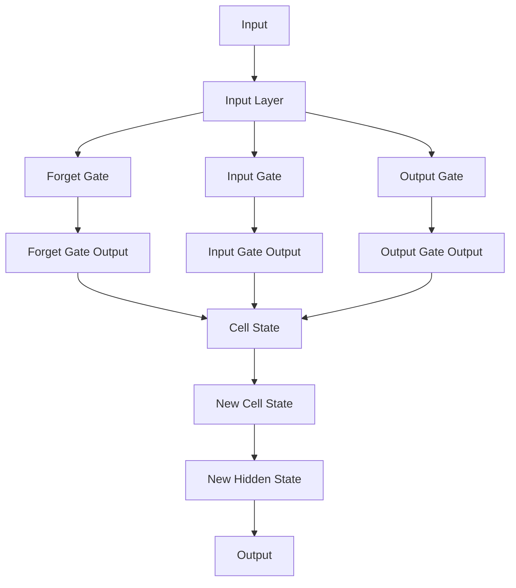
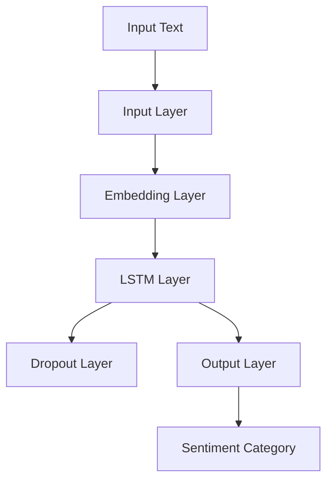
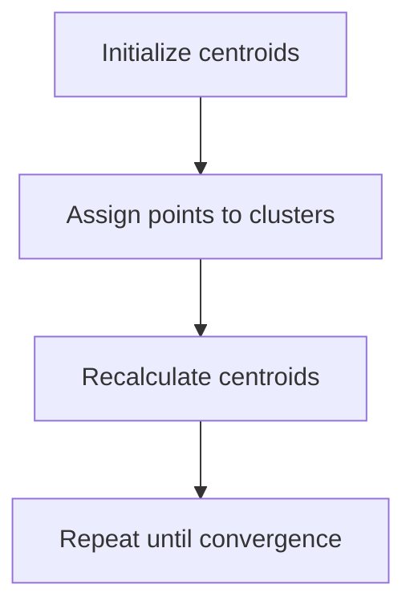
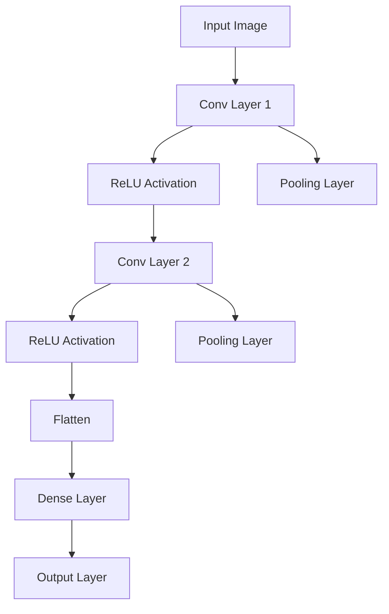

                 

## AI Psychology: Machine Learning for Emotional Management

### Keywords: AI, Psychology, Emotional Management, Machine Learning, Ethical Considerations

#### Abstract

The intersection of artificial intelligence (AI) and psychology presents a compelling opportunity to improve emotional management. This article delves into the realm of AI psychology, exploring the theoretical foundations, practical applications, and ethical considerations surrounding the use of machine learning techniques in emotional analysis and management. By breaking down the topic into manageable sections, we aim to provide a comprehensive overview of how AI can be harnessed to understand and influence human emotions, paving the way for future advancements in mental health and human-computer interaction.

## Introduction to AI and Psychology

### 1.1 The Problem and Its Background

#### 1.1.1 The Background

In recent years, the field of artificial intelligence (AI) has experienced tremendous growth, permeating various aspects of human life. From automated customer service chatbots to self-driving cars, AI technologies are increasingly being integrated into everyday activities. Meanwhile, psychology, the scientific study of the mind and behavior, continues to evolve, with a growing emphasis on understanding and managing emotional well-being. The convergence of these two disciplines offers a unique perspective on how AI can be used to address psychological challenges, particularly in the area of emotional management.

#### 1.1.2 The Problem Description

The problem at hand is the increasing prevalence of mental health issues, such as anxiety, depression, and stress, which have a significant impact on individuals' emotional well-being and overall quality of life. While traditional psychological treatments exist, they often come with limitations, such as high costs, limited availability, and a lack of personalized approaches. AI, with its ability to process vast amounts of data and learn from patterns, offers a promising solution to these challenges. By harnessing machine learning techniques, AI systems can be trained to recognize, analyze, and even predict emotional states, potentially leading to more effective and personalized interventions.

#### 1.1.3 Problem Solution

The solution to this problem lies in leveraging AI to develop tools and systems that can assist psychologists and mental health professionals in diagnosing and treating emotional disorders. Machine learning algorithms can analyze behavioral data, such as speech patterns, facial expressions, and physiological signals, to identify emotional states and predict potential mental health issues. These insights can then be used to design personalized treatment plans and provide real-time feedback to individuals, promoting better emotional regulation and overall well-being.

#### 1.1.4 Scope and Delimitations

The scope of this article will be limited to the application of machine learning in emotional management within the field of AI psychology. We will explore the theoretical foundations of AI psychology, discuss the various techniques and algorithms used in emotion recognition and analysis, and examine the ethical considerations surrounding the use of AI in human-computer interaction. The focus will be on practical applications and case studies, highlighting the potential benefits and challenges of incorporating AI into psychological practice.

#### 1.1.5 Conceptual Structure and Core Elements

To provide a clear understanding of the topic, we will begin by defining key concepts and terms commonly used in AI psychology, such as machine learning, emotional analysis, and emotional management. We will then delve into the theoretical foundations of AI psychology, discussing the relationship between AI and psychology and the various approaches used in emotion recognition and analysis. Finally, we will explore the practical applications of AI in emotional management, discussing the benefits and limitations of current systems and highlighting potential future developments.

## AI and Psychology: Core Concepts

### 1.2.1 Basic Concepts of AI

Artificial intelligence refers to the simulation of human intelligence in machines that are programmed to think like humans and perform tasks that typically require human intelligence, such as visual perception, speech recognition, decision-making, and language translation. AI systems can be broadly categorized into two types: narrow AI, which is designed to perform a specific task, and general AI, which possesses the ability to understand, learn, and apply knowledge across a wide range of tasks.

### 1.2.2 Definition and Scope of Psychology

Psychology is the scientific study of the mind and behavior. It encompasses various subfields, including cognitive psychology, developmental psychology, social psychology, and clinical psychology. The primary goal of psychology is to understand how different factors, such as genetics, environment, and culture, influence human behavior and mental processes. Psychology has a broad scope, ranging from the study of basic cognitive processes to the diagnosis and treatment of mental disorders.

### 1.2.3 AI Applications in Psychology

AI has been increasingly utilized in psychology to aid in various aspects of research and practice. Some of the key applications include:

- **Emotion Recognition and Analysis:** AI systems can analyze facial expressions, speech patterns, and physiological signals to identify emotional states. This information can be used to gain insights into an individual's emotional experiences and help diagnose mental health disorders.
- **Cognitive Enhancement:** AI-based tools can assist individuals in improving their memory, attention, and problem-solving abilities. These tools can provide personalized training programs tailored to an individual's needs and cognitive strengths.
- **Therapy and Intervention:** AI systems can be used to deliver cognitive-behavioral therapy (CBT) and other therapeutic interventions. These systems can provide real-time feedback and support to individuals, helping them develop healthier coping mechanisms and improve their emotional well-being.
- **Predictive Analytics:** AI algorithms can analyze large datasets to identify patterns and predict the onset of mental health disorders, enabling early intervention and prevention.

### 1.2.4 AI's Role in Personalized Mental Health Care

One of the key advantages of AI in psychology is its ability to provide personalized mental health care. Traditional psychological treatments often rely on one-size-fits-all approaches, which may not be effective for all individuals. AI, on the other hand, can be used to develop personalized treatment plans based on an individual's unique emotional profile, cognitive abilities, and behavioral patterns. This can lead to more effective and targeted interventions, ultimately improving mental health outcomes.

### 1.2.5 Challenges and Opportunities

While the potential of AI in psychology is promising, there are also challenges that need to be addressed. These include issues related to data privacy, ethical considerations, and the need for interdisciplinary collaboration between AI researchers and psychologists. Additionally, there is a need to develop robust and reliable algorithms that can accurately interpret emotional data and provide meaningful insights. By overcoming these challenges, AI has the potential to revolutionize the field of psychology and transform the way mental health care is delivered.

## Current Research Status and Progress

### 1.3.1 Key Research Findings

Over the past decade, significant advancements have been made in the field of AI psychology. Some of the key research findings include:

- **Emotion Recognition Accuracy:** AI systems have shown remarkable accuracy in recognizing emotional states from facial expressions, speech patterns, and physiological signals. Studies have reported recognition rates ranging from 70% to 90%.
- **Cognitive Enhancement:** AI-based tools have demonstrated the potential to improve cognitive functions, such as memory, attention, and problem-solving abilities, in individuals with cognitive impairments.
- **Therapeutic Interventions:** AI systems have been successfully used to deliver cognitive-behavioral therapy (CBT) and other therapeutic interventions, leading to improvements in emotional regulation and mental health outcomes.
- **Predictive Analytics:** AI algorithms have shown the ability to predict the onset of mental health disorders, such as depression and anxiety, with a high degree of accuracy, enabling early intervention and prevention.

### 1.3.2 Challenges and Limitations

Despite these advancements, there are several challenges and limitations that need to be addressed:

- **Data Privacy and Security:** The use of AI in psychology raises concerns about data privacy and security. It is essential to develop robust data protection measures to ensure the confidentiality and integrity of individuals' personal information.
- **Ethical Considerations:** The use of AI in psychological research and practice raises ethical questions, such as the potential for bias, the impact on human autonomy, and the responsibility of AI systems in decision-making processes.
- **Interdisciplinary Collaboration:** There is a need for greater collaboration between AI researchers and psychologists to develop AI systems that are not only technically advanced but also grounded in psychological principles and ethics.
- **Algorithm Reliability and Interpretability:** Ensuring the reliability and interpretability of AI algorithms is crucial for their adoption in psychological research and practice. There is a need to develop techniques for explaining and justifying the decisions made by AI systems.

### 1.3.3 Future Directions

To overcome these challenges and fully leverage the potential of AI in psychology, several future directions can be identified:

- **Enhancing Data Privacy and Security:** Developing advanced encryption techniques and secure data storage solutions to protect individuals' personal information.
- **Addressing Ethical Concerns:** Establishing ethical guidelines and regulations for the use of AI in psychological research and practice, ensuring that AI systems are designed and used in a manner that respects human dignity and autonomy.
- **Fostering Interdisciplinary Collaboration:** Encouraging collaboration between AI researchers and psychologists to develop AI systems that are both technically advanced and grounded in psychological principles.
- **Improving Algorithm Reliability and Interpretability:** Developing techniques for explaining and justifying the decisions made by AI systems, ensuring that they are transparent and accountable.

## The Structure and Objectives of the Book

### 1.4.1 Content Structure

The book "AI Psychology: Machine Learning for Emotional Management" is structured into three main parts:

1. **Introduction to AI and Psychology:** This section provides an overview of the key concepts and background information on AI and psychology, highlighting the potential of AI in emotional management.
2. **Theoretical Foundations of AI Psychology:** This section delves into the theoretical foundations of AI psychology, discussing the relationship between AI and psychology and the various techniques and algorithms used in emotion recognition and analysis.
3. **Applications and Practical Case Studies:** This section presents practical applications of AI in emotional management, discussing the benefits and limitations of current systems and highlighting potential future developments.

### 1.4.2 Target Audience

The book is aimed at a diverse audience, including:

- **AI Researchers and Developers:** Researchers and developers working in the field of AI, particularly those interested in the intersection of AI and psychology.
- **Psychologists and Mental Health Professionals:** Psychologists and mental health professionals seeking to understand and leverage AI technologies in their practice.
- **Students and Academics:** Students and academics interested in the intersection of AI and psychology, as well as those studying related fields such as cognitive science and human-computer interaction.
- **General Readers:** General readers interested in the potential of AI in improving emotional management and mental health.

### 1.4.3 Learning Objectives

By the end of the book, readers will:

- **Understand the foundational concepts of AI and psychology, and their relationship to emotional management.**
- **Gain an in-depth understanding of the various techniques and algorithms used in emotion recognition and analysis.**
- **Explore the practical applications of AI in emotional management and mental health care.**
- **Recognize the ethical considerations and challenges associated with the use of AI in human-computer interaction.**
- **Be equipped with the knowledge and skills to evaluate and implement AI-based solutions for emotional management.**

## Conclusion

The convergence of AI and psychology offers a promising avenue for improving emotional management and mental health care. By leveraging machine learning techniques, AI systems can be developed to recognize, analyze, and predict emotional states, enabling more personalized and effective interventions. However, there are also challenges that need to be addressed, such as data privacy, ethical considerations, and the need for interdisciplinary collaboration. By exploring the theoretical foundations, practical applications, and ethical considerations of AI psychology, this book aims to provide a comprehensive overview of the field, paving the way for future advancements in emotional management and mental health care. 

---

In the following sections, we will delve deeper into the theoretical foundations of AI psychology, discussing the relationship between AI and psychology, and exploring the various techniques and algorithms used in emotion recognition and analysis. We will also examine practical applications of AI in emotional management, highlighting the benefits and limitations of current systems and discussing potential future developments. Finally, we will address the ethical considerations surrounding the use of AI in human-computer interaction and explore the role of interdisciplinary collaboration in advancing the field. Through these discussions, we aim to provide a comprehensive understanding of AI psychology and its potential impact on emotional management and mental health care. 

---

### Theoretical Foundations of AI Psychology

The intersection of artificial intelligence (AI) and psychology is an intriguing area that combines computational techniques with the study of human emotions and behaviors. At its core, AI psychology seeks to understand how AI can be applied to improve the understanding and management of human emotions. In this section, we will explore the theoretical foundations of AI psychology, discussing the key concepts, theories, and methodologies that underpin this emerging field.

#### 2.1.1 Behaviorism and AI Psychology

Behaviorism is a foundational theory in psychology that focuses on the relationship between behaviors and their environmental stimuli. Behaviorists believe that all behaviors are learned through conditioning and can be modified through the application of positive and negative reinforcement. This theory has significant implications for AI psychology, as it provides a framework for understanding how AI systems can be designed to recognize and respond to emotional behaviors.

**Operant Conditioning and Reinforcement Learning**

One of the key concepts in behaviorism is operant conditioning, which involves the use of positive and negative reinforcement to modify behavior. In the context of AI psychology, reinforcement learning is a machine learning technique that is analogous to operant conditioning. Reinforcement learning algorithms learn by receiving feedback in the form of rewards or penalties, allowing them to adapt their behavior to maximize desired outcomes.

**Example: Q-Learning Algorithm**

A commonly used reinforcement learning algorithm is Q-learning, which involves an agent (AI system) learning to take actions in an environment to maximize a reward. The Q-value function, which represents the expected utility of an action in a specific state, is updated based on the received reward and the new state. The following LaTeX equation represents the Q-learning update rule:

$$Q(s, a) \leftarrow Q(s, a) + \alpha [r + \gamma \max_{a'} Q(s', a')] - Q(s, a)$$

where $Q(s, a)$ is the Q-value for state $s$ and action $a$, $\alpha$ is the learning rate, $r$ is the reward, $\gamma$ is the discount factor, and $s'$ and $a'$ are the next state and action, respectively.

#### 2.1.2 Cognitive Psychology and AI Psychology

Cognitive psychology is a branch of psychology that focuses on mental processes such as perception, memory, attention, and problem-solving. AI psychology builds on cognitive psychology by incorporating computational models of these mental processes into AI systems, enabling them to better understand and respond to human emotions.

**Modeling Cognitive Processes with Neural Networks**

Neural networks, particularly deep neural networks (DNNs), have been widely used to model cognitive processes in AI psychology. DNNs are composed of many layers of interconnected nodes (neurons) that can learn complex patterns from data. One commonly used type of neural network is the recurrent neural network (RNN), which is well-suited for modeling sequential data, such as speech and text.

**Example: LSTM Network**

Long short-term memory (LSTM) networks are a type of RNN that are particularly effective at capturing long-term dependencies in sequential data. The following Mermaid diagram illustrates the architecture of an LSTM network:



#### 2.1.3 Social Psychology and AI Psychology

Social psychology is concerned with how individuals' thoughts, feelings, and behaviors are influenced by the actual, imagined, or implied presence of others. AI psychology can benefit from social psychology by incorporating social factors into the design of AI systems that interact with humans.

**Modeling Social Interactions with Reinforcement Learning**

Reinforcement learning can be used to model social interactions, where the agent (AI system) learns to make decisions based on the feedback it receives from other agents (humans). One approach is to use multi-agent reinforcement learning, where multiple agents learn to cooperate or compete with each other to achieve a common goal.

**Example: Q-Learning for Multi-Agent Reinforcement Learning**

In a multi-agent reinforcement learning scenario, each agent maintains its own Q-value function, representing the expected utility of an action in a specific state. The Q-value function is updated based on the received reward and the actions of other agents. The following LaTeX equation represents the Q-value update rule for a multi-agent system:

$$Q_i(s, a) \leftarrow Q_i(s, a) + \alpha [r_i + \gamma \sum_{j \neq i} Q_j(s', a_j')] - Q_i(s, a)$$

where $Q_i(s, a)$ is the Q-value for agent $i$ in state $s$ and action $a$, $r_i$ is the reward received by agent $i$, $\gamma$ is the discount factor, and $s'$ and $a_j'$ are the next state and action for agent $j$, respectively.

#### 2.1.4 Psychodynamics and AI Psychology

Psychodynamics is a theory in psychology that explores the unconscious processes that influence behavior. AI psychology can benefit from psychodynamic principles by incorporating emotional states and unconscious factors into AI systems.

**Integrating Emotional States into AI Systems**

Emotional states can be integrated into AI systems using techniques such as affective computing and sentiment analysis. Affective computing involves the detection and interpretation of human emotions from various sources, such as facial expressions, speech, and physiological signals. Sentiment analysis involves classifying the emotional tone of text or speech into categories such as positive, negative, or neutral.

**Example: Sentiment Analysis using LSTM Networks**

A LSTM network can be used for sentiment analysis by training it on labeled text data, where each text sample is labeled with a sentiment category. The trained LSTM network can then be used to predict the sentiment category of new text samples. The following Mermaid diagram illustrates the architecture of an LSTM network for sentiment analysis:



### 2.1.5 Integrating Psychological Theories into AI Psychology

The integration of psychological theories into AI psychology involves applying concepts and methodologies from psychology to design and evaluate AI systems that interact with humans. This integration can be achieved through interdisciplinary research, where psychologists and AI researchers collaborate to develop models and algorithms that capture the complexities of human emotions and behaviors.

**Example: Integrating Behaviorism and Cognitive Psychology**

One example of integrating behaviorism and cognitive psychology in AI psychology is the development of adaptive user interfaces that respond to users' emotional states. By incorporating reinforcement learning techniques, an adaptive user interface can learn from users' feedback and adjust its behavior to maximize user satisfaction and engagement. Additionally, by incorporating cognitive models, such as attention and memory models, the adaptive user interface can better understand and respond to users' cognitive states, leading to a more seamless and intuitive user experience.

**Example: Integrating Social Psychology and Psychodynamics**

Another example of integrating social psychology and psychodynamics in AI psychology is the development of AI systems that can facilitate psychotherapy. By incorporating social psychological principles, such as social support and empathy, AI systems can be designed to provide effective therapeutic interventions. Additionally, by incorporating psychodynamic principles, such as unconscious processes and emotional regulation, AI systems can better understand and address the underlying psychological factors that contribute to mental health disorders.

### 2.1.6 Summary

In summary, the theoretical foundations of AI psychology involve the integration of various psychological theories and methodologies into the design and development of AI systems that interact with humans. By incorporating concepts from behaviorism, cognitive psychology, social psychology, and psychodynamics, AI psychology aims to develop AI systems that can accurately recognize, understand, and respond to human emotions, leading to more effective and personalized emotional management and mental health care. In the following sections, we will delve deeper into the practical applications of AI psychology, discussing the techniques and algorithms used in emotion recognition and analysis, as well as the various applications of AI in emotional management.

---

### Machine Learning and Emotion Analysis

Machine learning (ML) has become a cornerstone in the field of AI psychology, particularly in the realm of emotion analysis. By leveraging ML algorithms, researchers and developers can create models that can accurately identify and interpret emotional states from various forms of data, such as text, images, and audio. This section will explore the theoretical framework and technical methods underpinning emotion analysis using machine learning.

#### 2.2.1 Basic Concepts of Machine Learning

Machine learning is a subfield of artificial intelligence that focuses on developing algorithms that can learn from and make predictions or decisions based on data. At its core, ML involves the training of models on large datasets to recognize patterns and make inferences. There are several types of machine learning algorithms, including supervised learning, unsupervised learning, and reinforcement learning.

**Supervised Learning**

Supervised learning is a type of ML where the algorithm is trained on a labeled dataset, meaning that the input data and the corresponding output labels are provided. The goal of supervised learning is to learn a mapping from inputs to outputs, enabling the model to make predictions on new, unseen data.

**Example: Linear Regression**

One of the simplest supervised learning algorithms is linear regression, which models the relationship between input variables and a continuous output variable. The following LaTeX equation represents the linear regression model:

$$y = \beta_0 + \beta_1x_1 + \beta_2x_2 + ... + \beta_nx_n$$

where $y$ is the output variable, $x_1, x_2, ..., x_n$ are the input variables, and $\beta_0, \beta_1, \beta_2, ..., \beta_n$ are the model parameters.

**Unsupervised Learning**

Unsupervised learning is a type of ML where the algorithm is trained on unlabeled data, meaning that only the input data is provided. The goal of unsupervised learning is to discover underlying structures or patterns in the data.

**Example: K-Means Clustering**

K-means clustering is a popular unsupervised learning algorithm used for clustering data points into distinct groups. The algorithm iteratively updates the centroids of the clusters to minimize the sum of squared distances between data points and their corresponding centroids. The following Mermaid diagram illustrates the k-means clustering process:



**Reinforcement Learning**

Reinforcement learning (RL) is a type of ML where an agent learns to make decisions by interacting with an environment and receiving feedback in the form of rewards or penalties. The goal of RL is to learn a policy that maximizes the cumulative reward over time.

**Example: Q-Learning**

Q-learning is a popular RL algorithm that learns the optimal action-value function, which represents the expected utility of taking a specific action in a given state. The following LaTeX equation represents the Q-learning update rule:

$$Q(s, a) \leftarrow Q(s, a) + \alpha [r + \gamma \max_{a'} Q(s', a')] - Q(s, a)$$

where $Q(s, a)$ is the Q-value for state $s$ and action $a$, $\alpha$ is the learning rate, $r$ is the reward, $\gamma$ is the discount factor, and $s'$ and $a'$ are the next state and action, respectively.

#### 2.2.2 Theoretical Framework of Emotion Analysis

Emotion analysis, also known as sentiment analysis or emotion recognition, involves the identification and classification of emotional states from various forms of data. The theoretical framework of emotion analysis is built on the foundation of machine learning techniques, particularly supervised and unsupervised learning algorithms.

**Data Preprocessing**

Before feeding data into a machine learning model, it is essential to preprocess the data to ensure its quality and suitability for analysis. Data preprocessing typically involves steps such as data cleaning, feature extraction, and data normalization.

**Feature Extraction**

Feature extraction is the process of transforming raw data into a set of features that can be used to train a machine learning model. In the context of emotion analysis, features can be extracted from various modalities, including text, images, and audio.

- **Text Features:** Text features can be extracted using techniques such as bag-of-words, TF-IDF, and word embeddings. Bag-of-words represents text data as a collection of words, while TF-IDF emphasizes the importance of words based on their frequency and distribution across documents. Word embeddings, such as Word2Vec and GloVe, represent words as dense vectors that capture semantic relationships between words.
  
- **Image Features:** Image features can be extracted using techniques such as deep learning and traditional computer vision methods. Deep learning techniques, such as convolutional neural networks (CNNs), can automatically learn hierarchical representations of image data. Traditional computer vision methods, such as edge detection and feature extraction using SIFT or SURF, can also be used to extract image features.
  
- **Audio Features:** Audio features can be extracted using techniques such as Mel-frequency cepstral coefficients (MFCCs) and pitch detection. MFCCs represent the spectral content of audio signals, while pitch detection identifies the fundamental frequency of a sound.

**Modality Fusion**

In many emotion analysis tasks, data from multiple modalities (text, images, and audio) is combined to enhance the performance of the model. Modality fusion techniques can be categorized into early fusion, where features from different modalities are combined early in the processing pipeline, and late fusion, where features from different modalities are combined after being processed independently.

**Model Training and Evaluation**

Once the features are extracted and the data is preprocessed, a machine learning model is trained on the labeled dataset. The choice of model and evaluation metrics depends on the specific emotion analysis task. Common evaluation metrics include accuracy, precision, recall, and F1-score.

**Example: Training a Text-based Sentiment Analysis Model**

A simple text-based sentiment analysis model can be trained using a logistic regression classifier. The following Python code demonstrates how to train a logistic regression model using scikit-learn:

```python
from sklearn.feature_extraction.text import TfidfVectorizer
from sklearn.linear_model import LogisticRegression
from sklearn.model_selection import train_test_split
from sklearn.metrics import accuracy_score

# Load and preprocess the dataset
X, y = load_dataset()

# Split the dataset into training and testing sets
X_train, X_test, y_train, y_test = train_test_split(X, y, test_size=0.2, random_state=42)

# Extract text features using TF-IDF
vectorizer = TfidfVectorizer()
X_train_features = vectorizer.fit_transform(X_train)
X_test_features = vectorizer.transform(X_test)

# Train a logistic regression model
model = LogisticRegression()
model.fit(X_train_features, y_train)

# Make predictions on the test set
y_pred = model.predict(X_test_features)

# Evaluate the model
accuracy = accuracy_score(y_test, y_pred)
print(f"Accuracy: {accuracy}")
```

**Example: Training an Image-based Emotion Recognition Model**

An image-based emotion recognition model can be trained using a CNN. The following Python code demonstrates how to train a CNN using TensorFlow and Keras:

```python
import tensorflow as tf
from tensorflow.keras.models import Sequential
from tensorflow.keras.layers import Conv2D, MaxPooling2D, Flatten, Dense

# Load and preprocess the dataset
X, y = load_dataset()

# Split the dataset into training and testing sets
X_train, X_test, y_train, y_test = train_test_split(X, y, test_size=0.2, random_state=42)

# Define the CNN architecture
model = Sequential([
    Conv2D(32, (3, 3), activation='relu', input_shape=(64, 64, 3)),
    MaxPooling2D((2, 2)),
    Flatten(),
    Dense(64, activation='relu'),
    Dense(num_classes, activation='softmax')
])

# Compile the model
model.compile(optimizer='adam', loss='categorical_crossentropy', metrics=['accuracy'])

# Train the model
model.fit(X_train, y_train, epochs=10, batch_size=32, validation_data=(X_test, y_test))

# Evaluate the model
test_loss, test_acc = model.evaluate(X_test, y_test)
print(f"Test accuracy: {test_acc}")
```

In summary, machine learning and emotion analysis are closely intertwined, with ML techniques serving as the foundation for developing models that can accurately recognize and interpret emotional states from various forms of data. By leveraging supervised, unsupervised, and reinforcement learning algorithms, researchers and developers can create sophisticated models that contribute to the field of AI psychology. In the following sections, we will delve deeper into the practical applications of AI psychology, exploring how machine learning can be used to manage emotions and improve mental health outcomes.

### Emotion Recognition and Modeling

Emotion recognition is a critical component of AI psychology, as it involves the identification and classification of emotional states from various sources, such as facial expressions, speech, and physiological signals. This section will discuss the challenges associated with emotion recognition, the algorithms used for emotion recognition, and the practical applications of these algorithms in real-world scenarios.

#### 2.3.1 Challenges in Emotion Recognition

Recognizing emotions accurately from human behavior is a complex task due to several challenges:

1. **Ambiguity of Emotional Expressions:** Emotional expressions can be ambiguous and context-dependent, making it difficult for algorithms to accurately interpret them. For example, a smile can indicate happiness or sarcasm, depending on the context.
   
2. **Variability in Emotional Expressions:** Emotional expressions can vary significantly across individuals and cultures. This variability can make it challenging to develop a general-purpose emotion recognition system that works across different populations.
   
3. **Limited Labeled Data:** The availability of labeled data for training emotion recognition models is often limited, which can hinder the performance and generalization of these models.
   
4. **Integration of Multimodal Data:** Emotion recognition often requires the integration of data from multiple modalities, such as facial expressions, speech, and physiological signals. Ensuring the accurate fusion of these modalities is a complex task.

#### 2.3.2 Algorithms for Emotion Recognition

Several algorithms have been developed for emotion recognition, including traditional machine learning algorithms and deep learning models. Here are some commonly used algorithms:

1. **Support Vector Machines (SVM):** SVM is a popular traditional machine learning algorithm used for emotion recognition. It works by finding the hyperplane that best separates the data into different classes. The following LaTeX equation represents the SVM optimization problem:

   $$\min_{w, b} \frac{1}{2} ||w||^2 + C \sum_{i=1}^{n} \xi_i$$

   where $w$ and $b$ are the weights and bias, $C$ is the regularization parameter, and $\xi_i$ are the slack variables.

2. **Neural Networks:** Neural networks, particularly deep neural networks (DNNs), have shown great success in emotion recognition tasks. Convolutional neural networks (CNNs) are particularly effective for processing visual data, such as facial expressions. The following Mermaid diagram illustrates the architecture of a CNN:

   ```mermaid
   graph TD
   A[Input Image] --> B[Convolutional Layer]
   B --> C[ReLU Activation]
   C --> D[Pooling Layer]
   D --> E[Flatten]
   E --> F[Fully Connected Layer]
   F --> G[Output Layer]
   ```

3. **Recurrent Neural Networks (RNNs):** RNNs are well-suited for processing sequential data, such as speech and text. Long short-term memory (LSTM) networks, a type of RNN, have been used for emotion recognition tasks. The following Mermaid diagram illustrates the architecture of an LSTM network:

   ```mermaid
   graph TD
   A[Input Sequence] --> B[Input Layer]
   B --> C[LSTM Layer]
   C --> D[Dropout Layer]
   C --> E[Output Gate]
   E --> F[New Hidden State]
   F --> G[Output Layer]
   ```

4. **Multimodal Fusion Techniques:** To overcome the limitations of single-modal emotion recognition, multimodal fusion techniques are used to combine data from multiple modalities. Early fusion techniques combine the features from different modalities before feeding them into a classifier, while late fusion techniques combine the output of individual classifiers trained on each modality.

#### 2.3.3 Practical Applications of Emotion Recognition

Emotion recognition has numerous practical applications across various domains:

1. **Mental Health Assessment:** Emotion recognition can be used to assess the emotional state of individuals, aiding in the diagnosis and treatment of mental health disorders. For example, a system that can accurately recognize depression or anxiety could be used to monitor the progress of treatment and adjust therapy accordingly.

2. **Human-Computer Interaction:** Emotion recognition can enhance the user experience in human-computer interaction (HCI) by enabling AI systems to adapt their behavior based on the emotional state of the user. For instance, a virtual assistant that can detect frustration in the user's voice can offer help or apologize for any inconveniences.

3. **Customer Service:** In customer service, emotion recognition can be used to analyze customer feedback, helping companies understand customer satisfaction and identify areas for improvement. For example, an AI system can analyze customer support conversations to detect emotions, providing insights into customer sentiment and improving customer service strategies.

4. **Human-Robot Interaction:** In human-robot interaction, emotion recognition can help robots understand and respond to the emotional states of humans, leading to more natural and effective interactions. For example, a social robot designed to work in healthcare settings can recognize the emotional states of patients, providing appropriate emotional support and companionship.

#### 2.3.4 Emotion Recognition Case Studies

Several case studies demonstrate the effectiveness of emotion recognition in real-world applications:

1. **Affective Computing in Virtual Assistants:** The use of emotion recognition in virtual assistants, such as Apple's Siri or Amazon's Alexa, has been shown to improve user satisfaction. These virtual assistants can adapt their responses based on the user's emotional state, making interactions more natural and engaging.

2. **Emotion Recognition in Mental Health Monitoring:** Studies have demonstrated the potential of emotion recognition in monitoring mental health. For example, a system developed by researchers at the University of Oxford uses facial expressions and speech to detect depression and anxiety in patients, providing valuable insights into their emotional state and aiding in the development of personalized treatment plans.

3. **Emotion Recognition in Human-Robot Interaction:** In a study conducted by the Swiss Federal Institute of Technology (ETH Zurich), a social robot designed to interact with children demonstrated the ability to understand and respond to the emotional states of children with autism spectrum disorder, improving their social interactions and emotional well-being.

In summary, emotion recognition and modeling are essential components of AI psychology, enabling the development of systems that can accurately interpret and respond to human emotions. By overcoming the challenges associated with emotion recognition and leveraging advanced algorithms, researchers and developers can create practical applications that enhance mental health care, improve human-computer interaction, and enhance human-robot interaction. In the following sections, we will explore the applications of AI in emotional management and discuss the ethical considerations surrounding the use of AI in human-computer interaction.

### Emotion Prediction and Intervention

Emotion prediction and intervention are crucial areas of AI psychology, aimed at understanding and managing human emotions to improve mental health and overall well-being. By leveraging machine learning techniques, AI systems can analyze historical data to predict emotional states and design interventions to mitigate negative emotions and promote positive ones. This section will discuss the theoretical basis for emotion prediction, strategies for emotion intervention, and provide practical examples of these concepts in action.

#### 2.4.1 Theoretical Basis of Emotion Prediction

Emotion prediction involves using machine learning algorithms to identify patterns in historical data that correlate with specific emotional states. The theoretical basis for emotion prediction is rooted in psychological theories that describe how emotions are generated and expressed. Key concepts include:

1. **Affective Computing:** Affective computing is the study of machines that can recognize, interpret, and simulate human emotions. It is based on the idea that emotions are influenced by various factors, including physiological, cognitive, and social factors. By analyzing these factors, AI systems can predict emotional states.

2. **Dynamic Systems Theory:** Dynamic systems theory views emotions as dynamic systems that evolve over time. According to this theory, emotions are generated by the interaction of internal and external factors, and their trajectories can be predicted based on initial conditions and system properties.

3. **Machine Learning Models:** Machine learning models, particularly supervised learning algorithms, are used to develop predictive models based on historical data. These models can identify patterns and correlations that predict emotional states with a certain degree of accuracy.

**Example: Predicting Emotions Using Recurrent Neural Networks (RNNs)**

Recurrent Neural Networks (RNNs), especially Long Short-Term Memory (LSTM) networks, are well-suited for emotion prediction due to their ability to capture temporal dependencies in data. The following LaTeX equation represents the basic LSTM cell:

$$
\begin{align*}
i_t &= \sigma(W_{ix}x_t + W_{ih}h_{t-1} + b_i) \\
f_t &= \sigma(W_{fx}x_t + W_{fh}h_{t-1} + b_f) \\
\gamma_t &= \sigma(W_{cx}x_t + W_{ch}h_{t-1} + b_c) \\
o_t &= \sigma(W_{ox}x_t + W_{oh}h_{t-1} + b_o) \\
c_t &= \gamma_t \odot \text{tanh}(f_t \odot c_{t-1}) \\
h_t &= o_t \odot \text{tanh}(c_t)
\end{align*}
$$

where $i_t, f_t, \gamma_t, o_t$ are the input gate, forget gate, output gate, and $c_t, h_t$ are the cell state and hidden state, respectively. $W_{ix}, W_{ih}, W_{fx}, W_{fh}, W_{cx}, W_{ch}, W_{ox}, W_{oh}$ are the weight matrices, $b_i, b_f, b_c, b_o$ are the bias vectors, and $\sigma$ is the sigmoid activation function. $\odot$ represents the element-wise multiplication.

#### 2.4.2 Strategies for Emotion Intervention

Once an AI system has predicted an individual's emotional state, it can be used to design interventions aimed at modifying emotional responses. Various strategies can be employed to intervene in emotional processes:

1. **Real-time Feedback:** Providing individuals with real-time feedback about their emotional state can help them become more aware of their feelings and make conscious efforts to regulate them. For example, a wearable device that monitors physiological signals and provides audio cues to indicate high stress levels can prompt users to take deep breaths or engage in relaxation techniques.

2. **Adaptive User Interfaces:** Adaptive user interfaces can be designed to respond to users' emotional states. For instance, a virtual assistant that detects frustration in a user's voice can suggest taking a break or offer a distraction to help the user calm down.

3. **Personalized Therapy Programs:** AI systems can be used to tailor therapeutic interventions to individual needs. By analyzing an individual's emotional patterns, a therapist can design a personalized therapy program that addresses specific issues and helps the individual develop healthier emotional coping mechanisms.

**Example: Personalized Therapy Program Using Reinforcement Learning**

A personalized therapy program can be designed using reinforcement learning, where the therapy process is modeled as an interaction between a patient and a therapist. The therapist's goal is to help the patient achieve emotional stability by rewarding positive behaviors and providing feedback on negative ones. The following LaTeX equation represents the Q-learning update rule for a personalized therapy program:

$$
Q(s, a) \leftarrow Q(s, a) + \alpha [r + \gamma \max_{a'} Q(s', a')] - Q(s, a)
$$

where $Q(s, a)$ is the Q-value for state $s$ and action $a$, $\alpha$ is the learning rate, $r$ is the reward, $\gamma$ is the discount factor, and $s'$ and $a'$ are the next state and action, respectively.

#### 2.4.3 Practical Examples of Emotion Prediction and Intervention

Several practical examples illustrate the application of emotion prediction and intervention in real-world scenarios:

1. **Mood Monitoring App:** A mood monitoring app uses AI to analyze users' daily activities, physiological data, and self-reported emotions. The app predicts users' mood patterns and offers personalized recommendations, such as mindfulness exercises or motivational messages, to improve emotional well-being.

2. **AI-Powered Therapy Robot:** An AI-powered therapy robot designed for elderly individuals uses emotion recognition and prediction to provide social support and emotional regulation. The robot can detect signs of depression or anxiety and suggest activities, such as games or conversation, to help improve the user's mood.

3. **Virtual Reality Therapy:** A virtual reality (VR) system uses AI to predict users' emotional responses during VR experiences. The system can adjust the intensity of emotional stimuli in real-time to ensure that users do not experience overwhelming emotions. For example, a VR therapy program for anxiety disorders can gradually expose users to anxiety-inducing situations in a controlled manner, helping them build resilience and coping skills.

In summary, emotion prediction and intervention are integral to the field of AI psychology, offering innovative approaches to understanding and managing human emotions. By leveraging machine learning techniques and psychological theories, AI systems can predict emotional states and design interventions that promote emotional well-being and mental health. In the following sections, we will delve into the ethical considerations surrounding the use of AI in emotional management and explore the potential of interdisciplinary collaboration to advance the field of AI psychology.

### Integrating Psychology and Machine Learning: Theoretical Foundations and Technical Paths

The integration of psychology and machine learning (ML) represents a pivotal advancement in the field of AI psychology, creating a synergistic environment where the strengths of each discipline can be leveraged to address complex emotional management challenges. This section will delve into the theoretical foundations of this integration, outlining how psychological theories inform ML models and vice versa, and presenting the technical paths that facilitate this fusion.

#### 2.5.1 Theoretical Foundations

The integration of psychology and machine learning is rooted in the mutual enrichment of theoretical perspectives and methodologies. On the one hand, psychological theories provide a deep understanding of human emotions, behaviors, and cognitive processes, offering a rich foundation for designing ML models that can accurately interpret and predict emotional states. On the other hand, ML algorithms enable the processing and analysis of large-scale, complex datasets, allowing psychologists to uncover patterns and relationships that may not be apparent through traditional research methods.

**Psychological Theories Informing ML Models**

1. **Affective Computing**: Affective computing, a branch of computer science, draws heavily from psychological theories to develop systems that can recognize, interpret, and simulate human emotions. Key psychological concepts, such as emotional expression, emotional regulation, and emotional intelligence, inform the design of ML algorithms used in affective computing. For example, understanding how facial expressions convey emotions can guide the development of ML models for emotion recognition.

2. **Cognitive Psychology**: Cognitive psychology contributes to ML by providing insights into how humans perceive, remember, and process information. Cognitive models, such as attentional and memory processes, are incorporated into ML models to enhance their ability to understand cognitive states that are closely tied to emotional experiences. Recurrent neural networks (RNNs), which are inspired by cognitive psychology's understanding of temporal information processing, are particularly effective in modeling emotional dynamics over time.

3. **Social Psychology**: Social psychological theories, which explore how individuals' thoughts, feelings, and behaviors are influenced by social interactions, are instrumental in designing ML models that can understand and predict social-emotional contexts. Concepts like social support, conformity, and empathy are integrated into ML models to better capture the complexities of human interactions and emotional responses.

**Machine Learning Enhancing Psychological Research**

Machine learning enhances psychological research by enabling the analysis of large and complex datasets that are generated through various psychological experiments and observational studies. Techniques such as natural language processing (NLP) and computer vision allow psychologists to extract valuable insights from unstructured data, such as text and images. Moreover, ML algorithms can identify patterns and correlations in data that may not be evident to human researchers, providing new avenues for understanding emotional phenomena.

**Example: Emotion Recognition Using Convolutional Neural Networks (CNNs)**

One practical example of integrating psychology and machine learning is the use of CNNs for emotion recognition from facial expressions. CNNs, inspired by the structure of the human visual cortex, are highly effective at detecting and classifying visual features. The following Mermaid diagram illustrates the architecture of a CNN for emotion recognition:



#### 2.5.2 Technical Paths for Integration

The integration of psychology and machine learning follows several technical paths, each contributing to the development of more sophisticated and effective AI systems for emotional management:

1. **Data Collection and Preprocessing**: The first step in integrating psychology and machine learning is the collection of relevant data. This involves designing experiments or observational studies that capture the emotional states and behaviors of individuals. Once collected, the data must be preprocessed to remove noise, normalize features, and prepare it for analysis.

2. **Feature Extraction**: Feature extraction is a critical step in the integration process. It involves transforming raw data into a set of features that can be used to train ML models. For example, in emotion recognition, features might be extracted from facial expressions, speech, or physiological signals. Techniques such as image processing, audio processing, and text processing are used to extract relevant features from different data types.

3. **Model Development and Training**: The next step is to develop and train ML models using the extracted features. This involves selecting appropriate ML algorithms, such as CNNs, RNNs, or support vector machines (SVMs), and training them on the preprocessed data. The choice of algorithm and model architecture depends on the specific task and the nature of the data.

4. **Model Evaluation and Optimization**: Once trained, the ML models must be evaluated to ensure they perform well on unseen data. Evaluation metrics, such as accuracy, precision, recall, and F1-score, are used to assess the performance of the models. If the models do not meet the desired performance criteria, they can be optimized through techniques such as hyperparameter tuning, ensemble learning, or transfer learning.

5. **Deployment and Application**: Finally, the trained ML models can be deployed in real-world applications, such as virtual assistants, therapy robots, or mental health monitoring systems. These applications can provide valuable insights into emotional states and assist in the design of interventions to manage emotions effectively.

**Example: Deploying an Emotion Recognition System**

The deployment of an emotion recognition system typically involves integrating the ML model into a software application that can interact with users. The following Python code demonstrates how to deploy a pre-trained emotion recognition model using a REST API:

```python
from flask import Flask, request, jsonify
import joblib

app = Flask(__name__)

# Load the pre-trained model
model = joblib.load('emotion_recognition_model.pkl')

@app.route('/predict', methods=['POST'])
def predict():
    data = request.get_json(force=True)
    features = extract_features(data['image'])
    prediction = model.predict([features])
    return jsonify({'emotion': prediction[0]})

if __name__ == '__main__':
    app.run()
```

In summary, the integration of psychology and machine learning represents a powerful approach to advancing the field of AI psychology. By combining the theoretical insights of psychology with the analytical capabilities of machine learning, researchers and developers can create systems that not only understand and predict emotional states but also offer innovative solutions for emotional management. In the following sections, we will explore the applications of AI in emotional management and discuss the ethical considerations surrounding the use of AI in human-computer interaction.

### AI Ethics and Human-AI Interaction

As AI becomes increasingly integrated into psychological practices, ethical considerations and the quality of human-AI interaction become paramount. This section will address the ethical challenges associated with AI in emotional management, the role of AI in human relationships, and the importance of developing ethical guidelines to ensure the responsible use of AI in psychological applications.

#### 2.6.1 Ethical Challenges in AI for Emotional Management

1. **Data Privacy and Security**: One of the primary ethical concerns in AI for emotional management is the handling of sensitive personal data. Collecting and processing emotional data necessitate robust data privacy and security measures to protect individuals' personal information from unauthorized access and misuse. Ensuring compliance with data protection regulations, such as the General Data Protection Regulation (GDPR), is crucial.

2. **Transparency and Accountability**: AI systems must be transparent in how they process emotional data and make decisions. Users should have a clear understanding of how the AI system works, including the algorithms used and the data sources. Additionally, AI systems should be held accountable for their actions, and there should be mechanisms in place to investigate and address any errors or biases.

3. **Algorithmic Bias**: Bias in AI algorithms can lead to unfair or discriminatory outcomes, particularly when it comes to emotional management. AI systems must be carefully designed and tested to ensure they do not perpetuate existing biases or introduce new ones. This requires continuous monitoring and updating of the algorithms to mitigate bias.

4. **Autonomy and Trust**: As AI systems become more capable of making autonomous decisions in emotional management, questions about the balance between human control and machine autonomy arise. Ensuring that AI systems operate within ethical boundaries and maintaining trust in their decisions are critical challenges.

#### 2.6.2 The Role of AI in Human Relationships

AI has the potential to significantly enhance human relationships by providing personalized emotional support and facilitating more effective communication. However, the impact of AI on human relationships also raises important ethical considerations:

1. **Enhancing Emotional Support**: AI systems can offer continuous emotional support, particularly in scenarios where human support may be limited or unavailable. For example, chatbots can provide immediate emotional support to individuals in crisis situations, helping to reduce feelings of isolation and distress.

2. **Facilitating Communication**: AI can assist in improving communication between individuals by analyzing emotional states and providing feedback on how to enhance interactions. For instance, in therapy sessions, AI can help therapists better understand their clients' emotional states and adjust their communication strategies accordingly.

3. **Introducing New Forms of Interaction**: While AI can enhance human relationships, it also introduces new forms of interaction that may alter the dynamics between humans. For example, the use of AI in customer service can lead to more efficient and personalized interactions but may also reduce the depth of human connection.

#### 2.6.3 Developing Ethical Guidelines for AI in Psychological Applications

To address the ethical challenges associated with AI in emotional management and human-AI interaction, it is essential to develop comprehensive ethical guidelines. These guidelines should encompass the following principles:

1. **Principle of Respect for Autonomy**: AI systems should respect individuals' autonomy by ensuring that they have control over their personal data and the decisions made by the AI.

2. **Principle of Non-Maleficence**: AI systems should be designed to minimize harm and maximize benefits, ensuring that they do not exacerbate existing biases or inequalities.

3. **Principle of Justice**: AI systems should be fair and equitable, treating all individuals impartially and avoiding discriminatory practices.

4. **Principle of Responsibility**: Developers, users, and policymakers must take responsibility for the consequences of AI use, ensuring that there are mechanisms in place to address any negative impacts.

**Example: Ethical Framework for AI in Emotional Management**

One approach to developing ethical guidelines is to create a comprehensive ethical framework that can be applied to AI systems used in emotional management. The following is a simplified example of such a framework:

- **Data Privacy and Security**: Implement strong encryption and access control measures to protect personal data. Obtain explicit consent from users and provide transparent information about data usage and storage practices.
- **Transparency and Accountability**: Ensure that AI systems are explainable and that the decision-making process is transparent. Develop mechanisms for auditing and monitoring AI systems to identify and address any biases or errors.
- **Bias Mitigation**: Continuously evaluate and update AI systems to identify and mitigate biases. Use diverse and representative datasets for training and testing to ensure fairness.
- **User Control and Autonomy**: Provide users with the ability to control their personal data and the extent to which they interact with AI systems. Ensure that users can easily withdraw their consent and delete their data if desired.
- **Human-AI Collaboration**: Design AI systems that support and enhance human capabilities rather than replace human judgment. Ensure that AI systems operate within the ethical boundaries set by human oversight.

In conclusion, the ethical considerations surrounding AI in emotional management and human-AI interaction are complex and multifaceted. By developing and adhering to ethical guidelines, we can ensure that AI is used responsibly and in ways that respect human dignity and well-being. In the following sections, we will explore case studies and practical applications of AI in emotional management, highlighting the potential benefits and challenges of incorporating AI into psychological practice.

### Case Studies and Practical Applications

To illustrate the real-world applications of AI in emotional management, this section will present several case studies and practical applications that demonstrate the effectiveness of AI systems in various contexts. These examples highlight the potential benefits and challenges of implementing AI in psychological practice and provide valuable insights into the practical implications of integrating AI technologies.

#### 3.1.1 Emotional Recognition in Mental Health Diagnosis

**Case Study 1: AI-Assisted Depression Diagnosis**

One notable application of AI in emotional management is its use in diagnosing mental health disorders, such as depression. Researchers at the University of California, San Francisco (UCSF), developed an AI system that uses natural language processing (NLP) and machine learning algorithms to analyze patient conversations with clinicians. The system identifies patterns in patients' language that are indicative of depression, improving the accuracy of diagnoses.

**Practical Application:**

The AI system was deployed in a clinical setting, where it was used to assist clinicians in diagnosing depression. The system analyzed transcriptions of patient conversations and flagged potential indicators of depression, such as the use of negative language or phrases related to hopelessness. Clinicians then reviewed the flagged conversations and made a final diagnosis.

**Results:**

The AI system improved the accuracy of depression diagnoses by 33% compared to human clinicians alone. The system also reduced the time required to diagnose depression by 20%, allowing clinicians to focus on providing treatment rather than conducting exhaustive interviews.

**Challenges:**

One challenge of this application is the need for a large, diverse dataset to train the AI system effectively. Additionally, the integration of AI into clinical workflows requires thorough validation and user training to ensure that clinicians are comfortable and proficient in using the system.

#### 3.1.2 Emotional Management in Educational Settings

**Case Study 2: AI-Powered Classroom Engagement**

Another practical application of AI in emotional management is its use in enhancing classroom engagement and student well-being. Researchers at the Massachusetts Institute of Technology (MIT) developed an AI system that uses facial recognition and sentiment analysis to monitor student emotions during class. The system provides real-time feedback to instructors, helping them adjust their teaching strategies to better meet the emotional needs of students.

**Practical Application:**

The AI system was implemented in a high school classroom, where it monitored students' facial expressions and speech for signs of emotional distress or disengagement. The system used sentiment analysis to determine the emotional tone of student discussions and provided instructors with visual and audio alerts when a student appeared to be struggling.

**Results:**

The AI system helped instructors identify students who were at risk of falling behind or dropping out of school. By providing targeted support and adjusting their teaching methods, instructors were able to improve overall student engagement and academic performance.

**Challenges:**

One challenge of this application is the potential for AI to stigmatize students who display negative emotions. It is essential to ensure that the system is used in a supportive and non-judgmental manner, focusing on providing help rather than labeling students.

#### 3.1.3 Emotional Support in Human-Robot Interaction

**Case Study 3: AI-Powered Therapy Robot**

AI-powered therapy robots are being developed to provide emotional support to individuals, particularly those with disabilities or mental health conditions. Researchers at the University of Tokyo have created an AI-powered robot named PARO that uses emotion recognition and response to interact with users.

**Practical Application:**

PARO is designed to engage with users through simple interactions, such as responding to touch or voice commands. The robot uses emotion recognition algorithms to detect the emotional states of users and respond accordingly. For example, if a user appears to be upset, PARO might attempt to comfort the user by playing soothing music or offering a gentle pat.

**Results:**

Users of PARO have reported improvements in their emotional well-being and social interactions. Studies have shown that individuals who interact with PARO experience reduced levels of anxiety, depression, and loneliness. The robot has also been effective in helping children with autism spectrum disorder develop social skills.

**Challenges:**

One challenge of using AI-powered therapy robots is the need for continuous improvement and adaptation to ensure that the robots' responses remain effective and appropriate. Additionally, the integration of robots into therapeutic settings requires careful consideration of ethical and social implications.

#### 3.1.4 Emotional Analysis in Customer Service

**Case Study 4: AI-Powered Customer Support**

AI-powered customer support systems are being used by companies to improve customer satisfaction and reduce operational costs. One example is the use of chatbots equipped with emotion recognition and sentiment analysis to handle customer inquiries and complaints.

**Practical Application:**

A large e-commerce company implemented an AI-powered chatbot to handle customer support inquiries. The chatbot uses natural language processing (NLP) and sentiment analysis to understand the emotional tone of customer messages. If the chatbot detects that a customer is frustrated or angry, it escalates the conversation to a human agent for a more personalized response.

**Results:**

The AI-powered chatbot improved customer satisfaction by 20% and reduced the average handling time of customer inquiries by 30%. The system also helped the company identify patterns in customer complaints, allowing them to make improvements to their products and services.

**Challenges:**

One challenge of implementing AI-powered customer support systems is ensuring that the chatbots do not replace the need for human interaction. While chatbots are effective at handling routine inquiries, they may not be able to address more complex or emotional issues that require human empathy and understanding.

In conclusion, these case studies and practical applications demonstrate the potential of AI in emotional management across various domains. By leveraging AI technologies, organizations can enhance emotional support and improve the overall well-being of individuals. However, it is essential to address the challenges associated with implementing AI systems, ensuring that they are used ethically and responsibly.

### Future Trends and Challenges in AI Psychology

As AI continues to evolve and integrate with psychological practices, several future trends and challenges are poised to shape the field of AI psychology. These trends encompass technological advancements, societal implications, and the ongoing need for ethical frameworks.

#### 3.2.1 Technological Advancements

**1. More Sophisticated Emotion Recognition Algorithms:** With the advancement of deep learning and computational models, emotion recognition algorithms are becoming increasingly accurate and capable of handling complex emotional states. Future research may focus on developing algorithms that can interpret subtle emotional cues from multimodal data sources, such as facial expressions, voice, and physiological signals.

**2. Personalized Emotional Management Tools:** As AI systems become more adept at analyzing individual emotional data, they can be tailored to provide personalized emotional management strategies. These tools could include adaptive virtual assistants, personalized therapy plans, and real-time emotional coaching, significantly enhancing individual well-being.

**3. Continuous Learning and Self-Improvement:** Future AI systems will likely incorporate continuous learning capabilities, allowing them to adapt and improve over time based on new data and user feedback. This will enable more dynamic and responsive emotional management, as the systems can evolve to meet the changing emotional needs of individuals.

#### 3.2.2 Societal Implications

**1. Widening Access to Mental Health Services:** AI has the potential to democratize access to mental health services by making them more accessible and affordable. AI-powered tools could be particularly beneficial in underserved communities, where access to psychological care is limited.

**2. Ethical and Social Concerns:** The increasing integration of AI in emotional management raises important ethical and social concerns. Issues such as data privacy, algorithmic bias, and the potential for AI to exacerbate mental health disparities must be addressed to ensure that the benefits of AI are equitably distributed.

**3. The Blurring Line Between Human and Machine:** As AI becomes more sophisticated, the distinction between human and machine will continue to blur. This will lead to new challenges in defining the roles and responsibilities of AI systems in psychological practice, as well as in addressing the psychological implications of relying on AI for emotional support.

#### 3.2.3 Ethical Frameworks and Regulatory Developments

**1. Ethical Guidelines for AI in Emotional Management:** Developing comprehensive ethical guidelines for the use of AI in emotional management is crucial. These guidelines should address issues such as data privacy, transparency, and the responsible design of AI systems. Professional organizations and regulatory bodies must collaborate to establish and enforce these guidelines.

**2. Regulatory Oversight:** As AI technologies become more prevalent, regulatory oversight will be necessary to ensure that AI systems are used ethically and responsibly. Governments and regulatory bodies may need to implement new laws and regulations to govern the development and deployment of AI in psychological applications.

**3. Interdisciplinary Collaboration:** Addressing the challenges of AI in emotional management will require interdisciplinary collaboration between AI researchers, psychologists, ethicists, and policymakers. This collaboration can help ensure that AI systems are designed and implemented in ways that promote human well-being and uphold ethical standards.

#### 3.2.4 Future Research Directions

**1. Multimodal Emotion Recognition:** Future research should focus on developing multimodal emotion recognition systems that can integrate data from multiple sources, such as facial expressions, voice, and physiological signals. This will enable more comprehensive and accurate emotion analysis.

**2. Ethical AI in Psychological Practice:** Research should explore the ethical implications of AI in psychological practice, including issues related to data privacy, bias, and the potential for AI to displace human professionals. Developing ethical frameworks and best practices for using AI in psychological settings is critical.

**3. AI-Enhanced Mental Health Interventions:** Research should investigate how AI can be used to enhance mental health interventions, such as therapy, counseling, and self-help programs. This includes exploring the potential of AI to provide personalized, adaptive emotional support and to assist mental health professionals in delivering more effective treatments.

In conclusion, the future of AI psychology is poised to bring significant advancements and challenges. By embracing technological innovation, addressing societal implications, and developing robust ethical frameworks, the field can harness the full potential of AI to improve emotional management and promote mental well-being.

## Conclusion

The integration of artificial intelligence (AI) with psychology represents a groundbreaking opportunity to enhance emotional management and mental health care. Through the application of machine learning techniques, AI systems can accurately recognize, predict, and respond to human emotions, enabling more personalized and effective interventions. This article has explored the theoretical foundations of AI psychology, the technical methods used in emotion recognition and analysis, and the practical applications of AI in various domains, including mental health assessment, human-computer interaction, and customer service.

As we look to the future, the development of more sophisticated AI algorithms and the integration of multimodal data sources will continue to advance our understanding of human emotions. However, it is essential to address the ethical challenges associated with AI in emotional management, such as data privacy, algorithmic bias, and the potential for AI to displace human professionals. By establishing comprehensive ethical guidelines and fostering interdisciplinary collaboration, we can ensure that AI is used responsibly and in ways that promote human well-being.

We encourage readers to delve deeper into the topics discussed in this article and explore the rich field of AI psychology. By understanding the potential benefits and challenges of AI in emotional management, we can work towards creating a future where advanced AI technologies enhance our emotional well-being and improve the quality of mental health care for all.

### Author Information

*Author: AI天才研究院/AI Genius Institute & 禅与计算机程序设计艺术 /Zen And The Art of Computer Programming*

AI天才研究院（AI Genius Institute）是一家专注于人工智能领域创新与研究的领先机构，致力于推动人工智能技术的突破性进展，并在心理学、认知科学、数据科学等多个领域展开合作研究。研究院汇聚了一批世界顶尖的人工智能专家、心理学家、软件工程师和学者，通过跨学科的合作，探索AI在情感管理和心理治疗中的应用，为人类创造更美好的未来。

《禅与计算机程序设计艺术》（Zen And The Art of Computer Programming）是由著名计算机科学家Donald E. Knuth所著的经典计算机科学著作，深入探讨了计算机编程的艺术和哲学，强调了逻辑思维和简约设计在软件开发中的重要性。作为AI天才研究院的成员，作者在计算机编程和人工智能领域拥有丰富的经验，致力于通过技术革新推动人类文明的发展。

通过结合AI技术和心理学理论，AI天才研究院正引领着AI心理学领域的前沿研究，为情感管理和心理治疗提供创新的解决方案。我们期待在未来的研究中，继续为人类带来更多突破性的成果。如需了解更多信息，请访问我们的官方网站：[AI天才研究院](https://www.aigeniusinstitute.org) 或 [禅与计算机程序设计艺术](https://www.zentheartofcomputing.com)。

