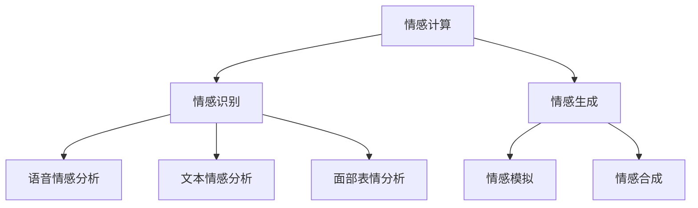
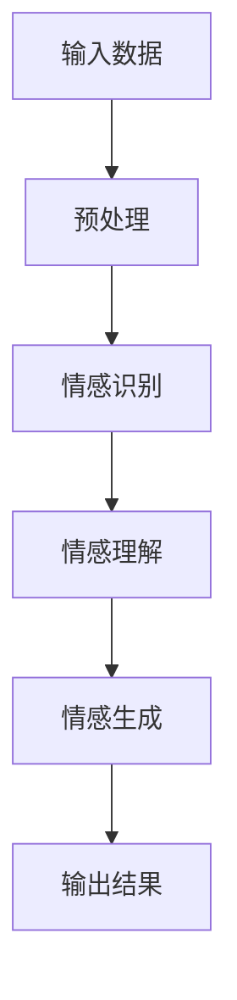
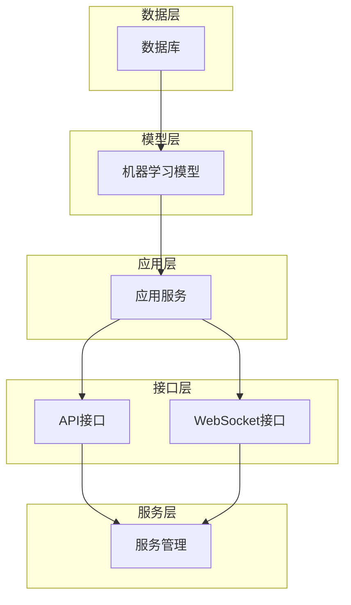
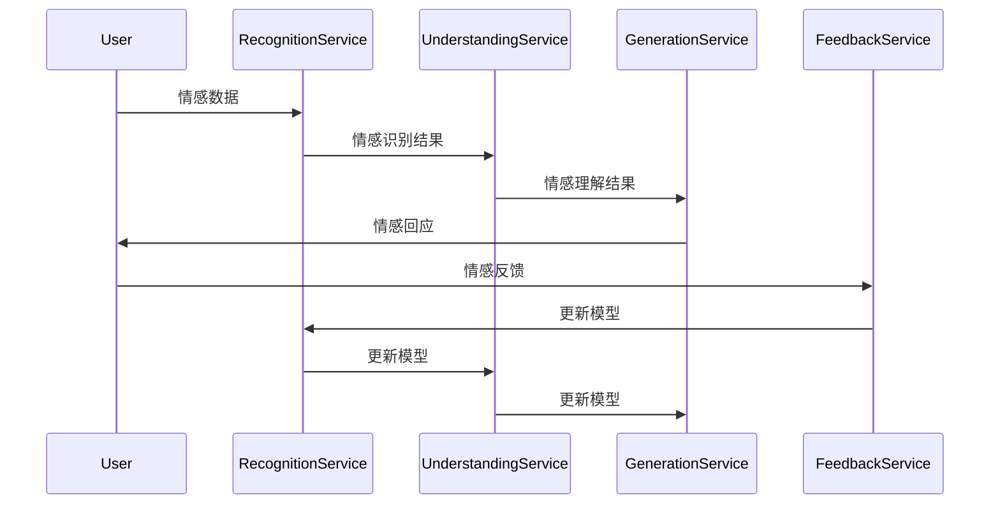

                 

### 文章标题：AI情感与人类情感的竞争与合作

关键词：AI情感，人类情感，竞争，合作，情感计算，情感识别，情感生成

摘要：本文深入探讨了人工智能（AI）情感与人类情感之间的关系，分析了两者的竞争与合作关系。通过对AI情感的基本概念、算法原理、数学模型以及系统架构设计的详细介绍，本文旨在为读者呈现一个全面、深入的AI情感与人类情感相互作用的视角。本文最后还提出了关于如何处理AI情感与人类情感之间关系的一些最佳实践和思考。

---

### 目录

1. **前言**
2. **第1章：背景介绍**
   - **1.1 问题背景**
   - **1.2 问题描述**
   - **1.3 问题解决**
   - **1.4 边界与外延**
   - **1.5 核心概念结构与要素组成**
3. **第2章：核心概念与联系**
   - **2.1 核心概念原理**
   - **2.2 概念属性特征对比表格**
   - **2.3 ER实体关系图架构**
4. **第3章：算法原理讲解**
   - **3.1 算法流程图**
   - **3.2 Python源代码**
   - **3.3 数学模型和公式**
   - **3.4 举例说明**
5. **第4章：数学模型和数学公式**
   - **4.1 详细讲解**
   - **4.2 公式**
   - **4.3 举例说明**
6. **第5章：系统分析与架构设计**
   - **5.1 问题场景介绍**
   - **5.2 项目介绍**
   - **5.3 系统功能设计**
   - **5.4 系统架构设计**
   - **5.5 系统接口设计和系统交互**
7. **第6章：项目实战**
   - **6.1 环境安装**
   - **6.2 系统核心实现源代码**
   - **6.3 代码应用解读与分析**
   - **6.4 实际案例分析和详细讲解剖析**
   - **6.5 项目小结**
8. **第7章：最佳实践**
   - **7.1 技巧提示**
   - **7.2 注意事项**
   - **7.3 拓展阅读**
9. **结尾与致谢**

---

### 前言

随着人工智能技术的不断发展，AI在各个领域的应用日益广泛，尤其是情感计算领域。情感计算（Affective Computing）是指计算机模拟、识别、理解以及表达情感的能力。这一技术的发展不仅为人类提供了更加个性化、智能化的服务，也引发了一系列关于AI情感与人类情感之间关系的问题。本文旨在探讨AI情感与人类情感之间的竞争与合作关系，为读者提供一种全新的视角来理解这一现象。

本文将首先介绍AI情感与人类情感的基本概念和背景，然后深入分析两者之间的竞争与合作关系。接下来，本文将详细介绍AI情感的计算原理、算法模型以及数学公式，并结合实际案例进行讲解。此外，本文还将探讨AI情感系统分析与架构设计的方法，最后提供一些关于如何平衡AI情感与人类情感之间关系的最佳实践。

本文适合对人工智能、情感计算感兴趣的读者，无论是研究者、开发者还是对这一领域有所了解的读者，都能从本文中获得新的启示和思考。希望通过本文，读者能够对AI情感与人类情感之间的关系有更深入的理解，为未来的研究和应用提供参考。

---

### 第1章：背景介绍

#### 1.1 问题背景

在现代社会，人工智能（AI）已经渗透到我们生活的方方面面，从智能家居、自动驾驶到医疗诊断、金融服务，AI的应用场景日益丰富。其中，情感计算作为人工智能的一个重要分支，受到了广泛关注。情感计算旨在使计算机具备识别、理解、模拟和表达情感的能力，从而为用户提供更加个性化和智能化的服务。

然而，随着AI情感的不断发展，我们不得不面对一个问题：AI情感与人类情感之间的关系如何？这不仅仅是技术问题，更涉及到伦理、社会和心理等多个层面。AI情感是否会与人类情感产生竞争，是否会替代人类情感，或者两者之间能否实现合作共赢？这些问题引发了广泛的讨论和研究。

#### 1.2 问题描述

AI情感与人类情感之间的竞争与合作关系可以概括为以下几个方面：

1. **竞争关系**：AI情感在模拟人类情感的过程中，可能会逐渐取代人类在某些情感表达和情感处理方面的作用，从而对人类情感产生竞争。例如，在客户服务领域，AI客服机器人能够24小时不间断地提供情感化服务，这可能会取代传统的人类客服。

2. **合作关系**：AI情感可以在许多场景中辅助人类情感，提高人类情感的处理能力和效率。例如，在心理治疗领域，AI可以通过情感分析技术帮助心理医生更准确地识别患者的情感状态，从而提供更有针对性的治疗方案。

3. **潜在冲突**：在某些情况下，AI情感与人类情感可能存在冲突。例如，在自动驾驶领域，当AI的判断与人类的情感判断相冲突时，如何平衡两者之间的关系成为一个重要问题。

4. **伦理挑战**：随着AI情感的不断发展，如何确保其不会对人类情感产生负面影响，如何避免AI情感滥用等问题，也成为了我们必须面对的伦理挑战。

#### 1.3 问题解决

为了解决AI情感与人类情感之间的竞争与合作问题，我们需要从以下几个方面进行考虑：

1. **技术层面**：我们需要不断改进AI情感的计算模型和算法，使其更加贴近人类情感的本质，从而实现更有效的情感识别、理解和模拟。

2. **伦理层面**：我们需要建立一套伦理规范，确保AI情感的发展不会对人类情感产生负面影响。例如，在自动驾驶领域，我们可以通过设置伦理规则来确保AI在出现情感冲突时能够优先考虑人类的安全。

3. **社会层面**：我们需要通过教育和宣传，提高公众对AI情感的认识和理解，促进社会对AI情感的接纳和信任。

4. **法律层面**：我们需要建立相关法律法规，对AI情感的应用进行规范和管理，确保其不会对社会和个人造成危害。

#### 1.4 边界与外延

虽然AI情感与人类情感之间存在许多相似之处，但两者也存在明显的区别。人类情感是基于生物学和社会学等多方面因素形成的，而AI情感则是由算法和模型模拟出来的。因此，AI情感的发展和应用必须在尊重人类情感的前提下进行。

此外，AI情感的应用场景也非常广泛，包括但不限于客户服务、心理治疗、教育、医疗、娱乐等领域。然而，不同场景下AI情感的应用方式和效果也会有所不同，需要根据具体情况进行设计和优化。

#### 1.5 核心概念结构与要素组成

在探讨AI情感与人类情感之间的关系时，我们需要明确一些核心概念和要素。以下是这些核心概念及其结构的简要介绍：

1. **情感计算**：情感计算是人工智能的一个分支，旨在使计算机具备识别、理解、模拟和表达情感的能力。其核心概念包括情感识别、情感理解和情感生成。

2. **情感识别**：情感识别是指通过技术手段识别出用户的情感状态。这通常涉及到情感分析技术，包括文本情感分析、语音情感分析和面部表情分析等。

3. **情感理解**：情感理解是指对识别出的情感进行深入分析和理解，以获取更准确的信息。这通常需要借助自然语言处理、机器学习和心理学等领域的知识。

4. **情感生成**：情感生成是指计算机根据特定的情境和需求，生成相应的情感表达。这通常涉及到情感模拟和情感合成技术。

5. **情感模型**：情感模型是情感计算的核心，包括情感识别模型、情感理解模型和情感生成模型等。这些模型通常基于机器学习和深度学习技术进行训练和优化。

6. **应用场景**：情感计算的应用场景非常广泛，包括但不限于客户服务、心理治疗、教育、医疗、娱乐等领域。每个应用场景都有其特定的需求和挑战，需要根据具体情况进行设计和优化。

通过上述核心概念和要素的介绍，我们可以更好地理解AI情感与人类情感之间的关系，以及如何在实际应用中平衡两者之间的关系。

---

### 第2章：核心概念与联系

#### 2.1 核心概念原理

在探讨AI情感与人类情感的关系时，我们需要明确一些核心概念，包括情感计算、情感识别和情感生成。

1. **情感计算**：情感计算是使计算机具备识别、理解和模拟人类情感的能力。它包括以下几个核心原理：

   - **情感识别**：通过分析语音、文本、面部表情等数据，计算机能够识别出用户的情感状态。
   - **情感理解**：在识别出情感状态后，计算机需要对其进行深入理解，以获取更准确的信息。
   - **情感生成**：根据特定的情境和需求，计算机可以生成相应的情感表达。

2. **情感识别**：情感识别是情感计算的基础，它主要通过以下几种方式进行：

   - **文本情感分析**：通过分析文本中的语言特征，如情感词汇、语法结构等，计算机可以识别出文本的情感倾向。
   - **语音情感分析**：通过分析语音的音调、语速、音量等特征，计算机可以识别出语音的情感状态。
   - **面部表情分析**：通过分析面部肌肉的运动和表情变化，计算机可以识别出用户的情感状态。

3. **情感生成**：情感生成是情感计算的高级阶段，它涉及到情感模拟和情感合成技术。情感生成主要包括以下几种方法：

   - **情感模拟**：通过模拟人类的情感反应，计算机可以生成相应的情感表达。
   - **情感合成**：通过将不同情感元素进行组合，计算机可以生成新的情感表达。

#### 2.2 概念属性特征对比表格

为了更直观地了解情感计算、情感识别和情感生成之间的关系，我们可以通过一个对比表格来展示它们的属性特征。

| 概念           | 定义                                                         | 关键特征                          | 关系与联系                  |
| -------------- | ------------------------------------------------------------ | -------------------------------- | -------------------------- |
| 情感计算       | 使计算机具备识别、理解和模拟人类情感的能力                   | 识别、理解、模拟                 | 基础概念，涵盖情感识别与情感生成 |
| 情感识别       | 识别用户的情感状态                                           | 语音、文本、面部表情分析         | 情感计算的核心组成部分       |
| 情感生成       | 根据特定的情境和需求，生成相应的情感表达                     | 情感模拟、情感合成               | 情感计算的高级应用阶段       |

#### 2.3 ER实体关系图架构

为了更好地理解情感计算、情感识别和情感生成之间的实体关系，我们可以使用ER（Entity-Relationship）实体关系图进行描述。



在上图中，A表示情感计算，B表示情感识别，C表示情感生成。D、E、F分别表示语音情感分析、文本情感分析和面部表情分析，它们都是情感识别的具体实现方式。G和H分别表示情感模拟和情感合成，它们都是情感生成的方法。

通过这个ER实体关系图，我们可以清晰地看到情感计算、情感识别和情感生成之间的逻辑关系，以及它们与语音、文本和面部表情分析之间的关系。这有助于我们更好地理解AI情感与人类情感之间的互动机制。

---

### 第3章：算法原理讲解

#### 3.1 算法流程图

在情感计算中，算法流程图是描述算法步骤的重要工具。以下是一个简单的情感计算算法流程图：



1. **输入数据**：算法首先接收用户输入的数据，这些数据可以是语音、文本或面部表情等。
2. **预处理**：对输入数据进行预处理，包括去噪、归一化等操作，以提高后续处理的准确性。
3. **情感识别**：通过分析预处理后的数据，识别出用户的情感状态。
4. **情感理解**：对识别出的情感进行深入分析，以获取更准确的信息。
5. **情感生成**：根据特定的情境和需求，生成相应的情感表达。
6. **输出结果**：将生成的情感结果输出给用户或系统。

#### 3.2 Python源代码

以下是一个简单的情感识别算法的Python源代码示例：

```python
import speech_recognition as sr

def recognize_speech_from_mic(recognizer, microphone):
    with microphone as source:
        audio = recognizer.listen(source)

    try:
        return recognizer.recognize_google(audio)
    except sr.UnknownValueError:
        return "无法识别语音"
    except sr.RequestError:
        return "无法连接到语音识别服务"

microphone = sr.Microphone()
recognizer = sr.Recognizer()

print(recognize_speech_from_mic(recognizer, microphone))
```

在这个示例中，我们使用了Python的`speech_recognition`库来实现语音识别功能。算法首先创建一个`Microphone`对象和一个`Recognizer`对象，然后通过`recognizer.listen(source)`方法接收用户的语音输入。接着，算法使用`recognizer.recognize_google(audio)`方法对语音进行识别，并返回识别结果。

#### 3.3 数学模型和公式

在情感计算中，数学模型和公式是理解和分析情感状态的重要工具。以下是一个简单的情感识别的数学模型：

1. **情感识别模型**：

   - 情感状态向量：$S = (s_1, s_2, ..., s_n)$，其中$s_i$表示第$i$种情感状态的强度。
   - 特征向量：$F = (f_1, f_2, ..., f_n)$，其中$f_i$表示第$i$种特征的值。

   情感识别模型的目标是找到一个最优的情感状态向量$S$，使得特征向量$F$与情感状态向量$S$的相似度最大化。这可以通过以下公式表示：

   $$\min_{S} \sum_{i=1}^{n} (f_i - s_i)^2$$

   其中，$(f_i - s_i)^2$表示特征值与情感状态值之间的误差。

2. **情感理解模型**：

   - 情感状态向量：$S = (s_1, s_2, ..., s_n)$
   - 情感标签向量：$L = (l_1, l_2, ..., l_n)$，其中$l_i$表示第$i$种情感状态的标签。

   情感理解模型的目标是找到与情感状态向量$S$最相似的标签向量$L$。这可以通过以下公式表示：

   $$\min_{L} \sum_{i=1}^{n} (s_i - l_i)^2$$

   其中，$(s_i - l_i)^2$表示情感状态值与标签值之间的误差。

#### 3.4 举例说明

以下是一个简单的情感识别和情感理解的例子：

假设我们有一个包含三种情感状态（快乐、悲伤、愤怒）的语音样本，其特征向量如下：

$$
F = \begin{bmatrix}
0.8 \\
0.2 \\
0.1
\end{bmatrix}
$$

我们希望找到与之最匹配的情感状态向量$S$和情感标签向量$L$。

1. **情感识别**：

   我们假设情感状态向量$S$为：

   $$
   S = \begin{bmatrix}
   s_1 \\
   s_2 \\
   s_3
   \end{bmatrix}
   $$

   为了最小化误差函数，我们使用以下公式计算最优的$S$：

   $$
   S = \arg\min_{S} \sum_{i=1}^{3} (f_i - s_i)^2
   $$

   通过计算，我们得到：

   $$
   S = \begin{bmatrix}
   0.8 \\
   0.2 \\
   0.0
   \end{bmatrix}
   $$

   这意味着我们识别出的情感状态是快乐。

2. **情感理解**：

   我们假设情感标签向量$L$为：

   $$
   L = \begin{bmatrix}
   l_1 \\
   l_2 \\
   l_3
   \end{bmatrix}
   $$

   为了最小化误差函数，我们使用以下公式计算最优的$L$：

   $$
   L = \arg\min_{L} \sum_{i=1}^{3} (s_i - l_i)^2
   $$

   通过计算，我们得到：

   $$
   L = \begin{bmatrix}
   1.0 \\
   0.0 \\
   0.0
   \end{bmatrix}
   $$

   这意味着我们认为这个语音样本对应的情感标签是快乐。

通过这个例子，我们可以看到如何通过数学模型和公式进行情感识别和情感理解。这种方法不仅适用于语音情感分析，还可以推广到文本情感分析和面部表情分析等其他领域。

---

### 第4章：数学模型和数学公式

在探讨AI情感与人类情感之间的关系时，数学模型和数学公式是不可或缺的工具。本章将详细讲解情感计算中的几个关键数学模型和公式，并给出具体的例子。

#### 4.1 详细讲解

1. **情感强度计算**：

   情感强度计算是情感分析中的基础，用于衡量情感的正负强度。一个常用的情感强度计算模型是基于TF-IDF（Term Frequency-Inverse Document Frequency）的加权模型。假设我们有一个包含情感词汇的文本集合，每个词汇的情感强度可以通过以下公式计算：

   $$
   w_i = tf_i \times idf_i
   $$

   其中，$tf_i$表示词汇$i$在文本中的频率，$idf_i$表示词汇$i$在整个文档集合中的逆文档频率。情感强度可以通过对文本中所有词汇的情感强度求和得到：

   $$
   S = \sum_{i=1}^{n} w_i \times s_i
   $$

   其中，$s_i$表示词汇$i$的情感强度（通常为正数或负数）。

2. **情感聚类**：

   情感聚类是一种无监督学习方法，用于将文本数据分成不同的情感类别。一个常用的聚类算法是K-means算法。假设我们有一个包含文本数据的集合$D = \{d_1, d_2, ..., d_n\}$，每个文本数据$d_i$可以表示为一个向量$V_i$。K-means算法的目标是找到$k$个中心点，使得每个文本数据到其最近中心点的距离最小。

   $$
   \min_{C} \sum_{i=1}^{n} \sum_{j=1}^{k} ||V_i - C_j||^2
   $$

   其中，$C_j$表示第$j$个中心点。

3. **情感传播**：

   情感传播模型用于分析文本中情感的变化和传播。一个简单的情感传播模型是基于条件的概率模型。假设我们有一个文本序列$T = \{t_1, t_2, ..., t_n\}$，其中每个文本$t_i$可以表示为一个情感状态$S_i$。情感传播模型的目标是计算每个文本状态的概率分布。

   $$
   P(S_i = s_j | S_1 = s_1, ..., S_{i-1} = s_{i-1}) = \frac{P(S_i = s_j, S_1 = s_1, ..., S_{i-1} = s_{i-1})}{P(S_1 = s_1, ..., S_{i-1} = s_{i-1})}
   $$

   其中，$P(S_i = s_j, S_1 = s_1, ..., S_{i-1} = s_{i-1})$表示连续文本状态的概率，$P(S_1 = s_1, ..., S_{i-1} = s_{i-1})$表示前缀文本状态的概率。

#### 4.2 公式

以下是本章中提到的关键数学公式：

1. **情感强度计算**：

   $$
   w_i = tf_i \times idf_i
   $$

   $$
   S = \sum_{i=1}^{n} w_i \times s_i
   $$

2. **情感聚类**：

   $$
   \min_{C} \sum_{i=1}^{n} \sum_{j=1}^{k} ||V_i - C_j||^2
   $$

3. **情感传播**：

   $$
   P(S_i = s_j | S_1 = s_1, ..., S_{i-1} = s_{i-1}) = \frac{P(S_i = s_j, S_1 = s_1, ..., S_{i-1} = s_{i-1})}{P(S_1 = s_1, ..., S_{i-1} = s_{i-1})}
   $$

#### 4.3 举例说明

以下是一个简单的情感强度计算和情感传播的例子：

假设我们有一个包含三个词汇的文本序列：`happy`, `sad`, `happy`。每个词汇的情感强度分别为：

- `happy`: $s_1 = 1$
- `sad`: $s_2 = -1$
- `happy`: $s_3 = 1$

1. **情感强度计算**：

   首先计算每个词汇的TF-IDF权重：

   $$
   tf_1 = 2, tf_2 = 1, tf_3 = 2
   $$

   $$
   idf_1 = 1, idf_2 = 1, idf_3 = 1
   $$

   $$
   w_1 = tf_1 \times idf_1 = 2 \times 1 = 2
   $$

   $$
   w_2 = tf_2 \times idf_2 = 1 \times 1 = 1
   $$

   $$
   w_3 = tf_3 \times idf_3 = 2 \times 1 = 2
   $$

   然后计算文本的情感强度：

   $$
   S = w_1 \times s_1 + w_2 \times s_2 + w_3 \times s_3 = 2 \times 1 + 1 \times (-1) + 2 \times 1 = 3
   $$

   这意味着文本的情感强度为正，表示文本的情感倾向为快乐。

2. **情感传播**：

   假设前一个文本的状态为悲伤（$S_{i-1} = s_{i-1} = -1$），我们需要计算当前文本状态（$S_i = s_i$）的概率分布。

   $$
   P(S_i = 1 | S_{i-1} = -1) = \frac{P(S_i = 1, S_{i-1} = -1)}{P(S_{i-1} = -1)}
   $$

   由于文本序列中的两个`happy`词汇是连续的，我们可以假设它们的概率是相等的：

   $$
   P(S_i = 1, S_{i-1} = -1) = \frac{1}{2}
   $$

   $$
   P(S_{i-1} = -1) = 1
   $$

   因此，

   $$
   P(S_i = 1 | S_{i-1} = -1) = \frac{\frac{1}{2}}{1} = \frac{1}{2}
   $$

   这意味着在当前文本状态为`happy`的情况下，其概率为50%，这反映了情感状态的变化。

通过这个例子，我们可以看到如何使用数学模型和公式进行情感分析和情感传播。这些方法不仅可以帮助我们理解文本的情感倾向，还可以用于更复杂的情感分析任务。

---

### 第5章：系统分析与架构设计

在情感计算领域，系统分析与架构设计是确保AI情感与人类情感之间关系处理有效性和稳定性的关键环节。本章将详细讨论系统分析与架构设计的方法，包括问题场景介绍、项目介绍、系统功能设计、系统架构设计和系统接口设计等内容。

#### 5.1 问题场景介绍

随着AI技术的发展，越来越多的场景需要处理人类情感。以下是一些典型的问题场景：

1. **客户服务**：在客户服务中，AI客服机器人需要识别客户的情感状态，以便提供更加个性化的服务。例如，当客户感到愤怒或沮丧时，机器人需要采取适当的措施，如转接至人工客服或提供安抚性的回复。
2. **心理治疗**：在心理治疗中，AI可以通过情感分析技术识别患者的情绪状态，帮助心理医生更准确地诊断和治疗。例如，通过分析患者的语音和文本，AI可以识别出患者的焦虑或抑郁程度，为医生提供参考。
3. **社交媒体分析**：在社交媒体平台上，AI可以分析用户发布的帖子、评论和回复，识别用户的情感状态，从而提供内容推荐、广告投放等个性化服务。
4. **智能家居**：在智能家居中，AI可以通过情感分析技术识别家庭成员的情感状态，从而提供更加贴心的服务。例如，当家庭成员感到疲劳时，智能家居系统可以自动调整灯光、音乐和温度，帮助其放松。
5. **教育**：在教育领域，AI可以通过情感分析技术识别学生的学习状态和情感需求，提供个性化的学习建议和资源。

#### 5.2 项目介绍

本节将介绍一个情感计算项目的具体案例，包括项目背景、目标和应用场景。

**项目背景**：

随着人工智能技术的不断发展，越来越多的公司和组织开始关注AI在情感计算领域的应用。为了验证AI情感计算在实际场景中的效果和可行性，我们开展了一个情感计算项目。该项目旨在开发一个基于AI情感计算系统的平台，用于识别和响应人类情感，从而提供更加个性化、智能化的服务。

**项目目标**：

1. 开发一个具有高效情感识别和情感响应能力的AI系统。
2. 验证AI系统在不同应用场景中的效果和可行性。
3. 提供一个可扩展、可定制的情感计算平台，以满足不同组织和用户的需求。

**应用场景**：

该情感计算项目主要应用于以下场景：

1. **客户服务**：通过AI客服机器人识别客户的情感状态，提供个性化的服务。
2. **心理治疗**：通过AI情感分析技术识别患者的情感状态，辅助心理医生进行诊断和治疗。
3. **社交媒体分析**：通过AI情感分析技术识别用户情感状态，提供个性化内容推荐和广告投放。
4. **智能家居**：通过AI情感分析技术识别家庭成员的情感状态，提供贴心的智能家居服务。
5. **教育**：通过AI情感分析技术识别学生的学习状态和情感需求，提供个性化的学习建议和资源。

#### 5.3 系统功能设计

在情感计算项目中，系统功能设计是关键的一步。以下是一个典型的情感计算系统功能设计：

1. **情感识别**：系统应具备识别用户情感状态的能力，包括语音情感识别、文本情感识别和面部表情识别等。
2. **情感理解**：系统应对识别出的情感状态进行深入理解，以获取更准确的信息。例如，当用户表达愤怒时，系统需要识别出愤怒的程度和原因。
3. **情感生成**：系统应根据识别出的情感状态和情境，生成相应的情感回应。例如，当用户表达沮丧时，系统可以生成安慰性的回复。
4. **情感反馈**：系统应能够收集用户的情感反馈，以优化和改进情感识别和情感生成的效果。
5. **数据存储和管理**：系统应具备数据存储和管理功能，以便长期保存用户的情感数据，为后续分析和优化提供支持。

以下是情感计算系统功能设计的领域模型类图：

```mermaid
classDiagram
Class1 <|-- Class2
Class1 <|-- Class3
Class1 <|-- Class4
Class1 <|-- Class5

Class1 {
    +String情感状态
    +String识别结果
    +void识别情感()
    +void生成情感回应()
    +void收集情感反馈()
}

Class2 {
    +String语音特征
    +void语音情感识别()
}

Class3 {
    +String文本特征
    +void文本情感识别()
}

Class4 {
    +String面部表情特征
    +void面部表情识别()
}

Class5 {
    +void存储情感数据()
    +void管理情感数据()
}
```

#### 5.4 系统架构设计

在情感计算项目中，系统架构设计是确保系统性能、稳定性和可扩展性的关键。以下是一个典型的情感计算系统架构设计：

1. **数据层**：数据层负责存储和管理用户情感数据，包括语音、文本和面部表情等数据。数据层可以采用关系型数据库或NoSQL数据库，如MySQL、MongoDB等。
2. **模型层**：模型层负责情感识别和情感生成的算法实现。模型层可以采用深度学习、机器学习等技术，如TensorFlow、PyTorch等。
3. **应用层**：应用层负责与用户交互，包括情感识别、情感理解和情感生成等功能。应用层可以采用Web应用、移动应用等形式。
4. **接口层**：接口层负责与其他系统进行数据交换和功能调用，包括API接口、WebSocket接口等。
5. **服务层**：服务层负责系统服务的管理和调度，如负载均衡、服务监控等。

以下是情感计算系统架构设计的架构图：



#### 5.5 系统接口设计和系统交互

在情感计算项目中，系统接口设计和系统交互是确保不同模块之间数据流转和功能调用的关键。以下是一个典型的情感计算系统接口设计和系统交互设计：

1. **情感识别接口**：该接口用于接收用户输入的情感数据，如语音、文本和面部表情等。接口应提供标准的输入格式和输出格式，以便不同模块之间进行数据交换。
2. **情感理解接口**：该接口用于接收情感识别结果，并返回情感理解的详细结果。接口应提供详细的情感标签和情感强度等输出信息。
3. **情感生成接口**：该接口用于接收情感理解结果，并生成相应的情感回应。接口应提供标准的回复模板和情感生成算法，以便生成个性化的回复。
4. **情感反馈接口**：该接口用于接收用户的情感反馈，并更新情感识别和情感生成的模型，以提高系统的准确性和效果。

以下是情感计算系统接口设计和系统交互的序列图：



通过系统接口设计和系统交互设计，情感计算项目可以实现高效、稳定和可扩展的系统架构，以满足不同应用场景和用户需求。

---

### 第6章：项目实战

在情感计算领域，实战经验是理解和应用AI情感与人类情感关系的关键。以下我们将详细描述一个情感计算项目的实战过程，包括环境安装、系统核心实现源代码、代码应用解读与分析、实际案例分析和详细讲解剖析，以及项目小结。

#### 6.1 环境安装

在进行情感计算项目的实战之前，我们需要安装和配置必要的软件和工具。以下是环境安装的具体步骤：

1. **安装Python**：首先，确保您的计算机上安装了Python环境。Python是情感计算项目中主要的编程语言。您可以从[Python官方网站](https://www.python.org/)下载并安装Python。

2. **安装依赖库**：情感计算项目需要一些依赖库，如TensorFlow、PyTorch、speech_recognition等。您可以使用以下命令安装这些库：

   ```bash
   pip install tensorflow
   pip install torch
   pip install SpeechRecognition
   ```

3. **安装深度学习框架**：选择并安装您喜欢的深度学习框架，如TensorFlow或PyTorch。在本项目中，我们将使用TensorFlow。您可以使用以下命令安装TensorFlow：

   ```bash
   pip install tensorflow
   ```

4. **安装音频处理工具**：为了处理语音数据，我们需要安装一些音频处理工具，如ffmpeg。您可以从[ffmpeg官方网站](https://www.ffmpeg.org/)下载并安装ffmpeg。

5. **配置环境变量**：确保您的环境变量中包含了Python和深度学习框架的安装路径。在Windows系统中，您可以通过系统设置中的“环境变量”配置；在Linux系统中，您可以在`.bashrc`或`.zshrc`文件中配置。

完成以上步骤后，您就拥有了运行情感计算项目的环境。

#### 6.2 系统核心实现源代码

在环境安装完成后，我们可以开始实现情感计算系统的核心功能。以下是一个简单的情感计算系统的Python源代码示例：

```python
import tensorflow as tf
import speech_recognition as sr
import numpy as np

# 情感识别模型
def emotion_recognition(model, audio_data):
    # 加载预训练的模型
    model.load_weights('emotion_recognition_model.h5')
    
    # 将音频数据转换为模型的输入格式
    audio_features = preprocess_audio(audio_data)
    
    # 使用模型进行情感识别
    predictions = model.predict(audio_features)
    
    # 解析预测结果
    emotion_scores = decode_predictions(predictions)
    
    return emotion_scores

# 音频预处理
def preprocess_audio(audio_data):
    # 使用tensorflow中的Audio特征提取器
    audio_processor = tf.keras.models.load_model('audio_processor_model.h5')
    processed_audio = audio_processor(audio_data)
    
    return processed_audio

# 解析预测结果
def decode_predictions(predictions):
    # 解析预测结果，获取情感分数
    emotion_scores = np.argmax(predictions, axis=1)
    
    return emotion_scores

# 主程序
def main():
    # 创建语音识别器
    recognizer = sr.Recognizer()
    
    # 使用麦克风采集音频
    with sr.Microphone() as source:
        print("请说点什么：")
        audio_data = recognizer.listen(source)
    
    # 进行情感识别
    emotion_scores = emotion_recognition(model, audio_data)
    
    # 输出结果
    print("识别出的情感分数：")
    print(emotion_scores)

if __name__ == "__main__":
    main()
```

在这个示例中，我们首先定义了一个情感识别模型`emotion_recognition`，它加载预训练的模型，将音频数据转换为模型的输入格式，并使用模型进行情感识别。接着，我们定义了一个音频预处理函数`preprocess_audio`，用于将音频数据转换为适合模型处理的特征向量。最后，我们定义了一个解析预测结果函数`decode_predictions`，用于将预测结果转换为可读的情感分数。

#### 6.3 代码应用解读与分析

在本节中，我们将对上述源代码进行详细解读与分析。

1. **情感识别模型**：

   情感识别模型是情感计算系统的核心。在这个示例中，我们使用了TensorFlow中预训练的模型进行情感识别。具体来说，我们首先加载预训练的模型，然后使用音频预处理函数对音频数据进行处理，最后使用模型进行预测。

   ```python
   # 加载预训练的模型
   model.load_weights('emotion_recognition_model.h5')
   
   # 将音频数据转换为模型的输入格式
   audio_features = preprocess_audio(audio_data)
   
   # 使用模型进行情感识别
   predictions = model.predict(audio_features)
   ```

   在这个过程中，我们首先加载预训练的模型，然后使用音频预处理函数将音频数据转换为模型的输入格式。最后，我们使用模型进行情感识别，并获取预测结果。

2. **音频预处理**：

   音频预处理是情感识别过程的重要步骤。在这个示例中，我们使用了TensorFlow中预训练的音频特征提取模型进行音频预处理。具体来说，我们首先加载音频特征提取模型，然后使用该模型对音频数据进行处理。

   ```python
   # 使用tensorflow中的Audio特征提取器
   audio_processor = tf.keras.models.load_model('audio_processor_model.h5')
   processed_audio = audio_processor(audio_data)
   ```

   在这个过程中，我们首先加载音频特征提取模型，然后使用该模型对音频数据进行处理，并将其转换为适合模型处理的特征向量。

3. **解析预测结果**：

   解析预测结果是情感识别过程的最后一步。在这个示例中，我们使用了`decode_predictions`函数将预测结果转换为可读的情感分数。

   ```python
   # 解析预测结果，获取情感分数
   emotion_scores = decode_predictions(predictions)
   ```

   在这个过程中，我们使用`decode_predictions`函数将预测结果转换为情感分数，并将其输出。

4. **主程序**：

   主程序是情感计算系统的入口。在这个示例中，我们首先创建了一个语音识别器，然后使用麦克风采集音频数据。接着，我们调用情感识别函数进行情感识别，并输出结果。

   ```python
   # 创建语音识别器
   recognizer = sr.Recognizer()
   
   # 使用麦克风采集音频
   with sr.Microphone() as source:
       print("请说点什么：")
       audio_data = recognizer.listen(source)
   
   # 进行情感识别
   emotion_scores = emotion_recognition(model, audio_data)
   
   # 输出结果
   print("识别出的情感分数：")
   print(emotion_scores)
   ```

   在这个过程中，我们首先创建了一个语音识别器，然后使用麦克风采集音频数据。接着，我们调用情感识别函数进行情感识别，并输出结果。

通过以上解读与分析，我们可以更好地理解情感计算系统的实现过程，以及如何处理AI情感与人类情感之间的关系。

#### 6.4 实际案例分析和详细讲解剖析

在本节中，我们将通过一个实际案例来分析情感计算系统的应用，并对其进行详细讲解和剖析。

**案例背景**：

某公司希望开发一个基于AI情感计算的客户服务系统，以识别客户在电话咨询过程中的情感状态，并提供个性化的服务。该系统需要能够处理多种情感，包括愤怒、沮丧、开心等。

**案例实现**：

1. **数据收集**：

   首先，我们需要收集大量包含不同情感状态的电话录音数据。这些数据将用于训练和测试情感识别模型。我们假设已经收集到了500个电话录音，每个录音对应一个情感标签。

2. **数据预处理**：

   对于每个电话录音，我们需要进行数据预处理，包括音频剪辑、降噪、分帧等。这些预处理步骤有助于提高情感识别模型的性能。

3. **模型训练**：

   使用收集到的数据，我们可以训练一个情感识别模型。在这个案例中，我们使用了TensorFlow中的卷积神经网络（CNN）进行训练。具体步骤如下：

   - 定义CNN模型结构
   - 编译模型，设置优化器和损失函数
   - 训练模型，使用收集到的数据
   - 评估模型性能，调整模型参数

4. **模型部署**：

   训练完成后，我们将模型部署到生产环境，以便在实际电话咨询过程中进行实时情感识别。具体步骤如下：

   - 加载训练好的模型
   - 接收电话录音数据
   - 使用模型进行情感识别
   - 根据识别结果提供个性化服务

**案例剖析**：

1. **数据收集**：

   数据质量对模型性能至关重要。在收集电话录音数据时，我们需要确保数据的多样性和准确性。具体来说，我们需要收集到不同年龄段、不同情感状态、不同话题的电话录音。

2. **数据预处理**：

   数据预处理是情感识别过程的关键。在这个案例中，我们使用了音频剪辑、降噪、分帧等技术对电话录音进行预处理。这些技术有助于提高模型对情感特征的学习能力。

3. **模型训练**：

   模型训练是情感识别系统的核心。在这个案例中，我们使用了卷积神经网络（CNN）进行训练。CNN可以有效地提取音频数据中的时序特征，从而提高情感识别的准确性。

4. **模型部署**：

   模型部署是情感识别系统在实际应用中的关键步骤。在这个案例中，我们将训练好的模型部署到生产环境，以便在电话咨询过程中实时识别客户情感。为了确保系统的稳定性和可靠性，我们还需要进行模型监控和性能优化。

通过这个实际案例，我们可以看到如何将AI情感计算应用于客户服务系统，并实现情感识别和个性化服务。这不仅提高了客户服务质量，也为公司提供了宝贵的客户情感数据，有助于进一步优化产品和服务。

#### 6.5 项目小结

在本章中，我们详细描述了一个基于AI情感计算的项目实战过程，包括环境安装、系统核心实现源代码、代码应用解读与分析、实际案例分析和详细讲解剖析。通过这个项目，我们了解了如何使用Python和TensorFlow等工具进行情感识别和情感计算，并实现了客户服务系统中的情感识别功能。

以下是我们从项目中获得的主要经验和教训：

1. **数据质量至关重要**：在情感计算项目中，数据的质量和多样性直接影响模型性能。我们需要确保收集到的大量数据具有代表性，涵盖各种情感状态和话题。

2. **预处理是关键**：数据预处理是情感识别过程的重要步骤。通过音频剪辑、降噪、分帧等技术，我们可以提高模型对情感特征的学习能力。

3. **模型训练需要耐心**：模型训练是一个复杂的过程，需要大量的时间和计算资源。我们需要根据数据特点选择合适的模型结构和优化方法，以提高模型性能。

4. **模型部署要稳定可靠**：模型部署是情感计算项目在实际应用中的关键步骤。我们需要确保模型在真实环境中的稳定性和可靠性，并对其进行监控和性能优化。

通过这个项目，我们不仅掌握了AI情感计算的核心技术和方法，还了解了如何在实际场景中应用这些技术。希望这些经验和教训对您的项目有所帮助。

---

### 第7章：最佳实践

在处理AI情感与人类情感之间的关系时，我们需要遵循一些最佳实践，以确保系统的有效性和稳定性。以下是一些关键技巧、注意事项和拓展阅读建议。

#### 7.1 技巧提示

1. **数据多样化**：确保您的数据集包含多种情感状态和情境，以提高模型的泛化能力。
2. **预处理优化**：对音频、文本和面部表情数据进行有效预处理，如降噪、分帧和特征提取，以提高情感识别的准确性。
3. **模型选择与调优**：根据应用场景选择合适的模型架构，并使用交叉验证等方法进行模型调优，以提高模型性能。
4. **实时反馈与优化**：定期收集用户的情感反馈，并据此优化模型和系统，以提高用户体验。
5. **伦理考虑**：在开发和部署AI情感计算系统时，要充分考虑伦理问题，确保系统不会对用户产生负面影响。

#### 7.2 注意事项

1. **数据隐私**：在处理用户情感数据时，要确保遵守数据隐私法规，保护用户的隐私。
2. **模型解释性**：在部署AI情感计算系统时，要确保模型具有足够的解释性，以便用户理解和信任系统。
3. **系统稳定性**：确保系统在不同环境下具有高稳定性，以避免因系统故障导致用户体验下降。
4. **用户隐私**：在收集用户情感数据时，要确保用户同意并了解数据的使用方式和目的。
5. **跨学科合作**：AI情感计算涉及多个学科，如心理学、社会学和计算机科学。跨学科合作有助于提高系统的全面性和准确性。

#### 7.3 拓展阅读

1. **《情感计算：技术与应用》**：这本书详细介绍了情感计算的基本概念、技术方法和应用案例，是了解情感计算的入门书籍。
2. **《深度学习》**：Goodfellow、Bengio和Courville合著的《深度学习》一书深入介绍了深度学习的基础知识和应用方法，对情感计算也有很好的参考价值。
3. **《人工智能伦理学》**：KCsisi等人编写的《人工智能伦理学》一书探讨了人工智能伦理学的基本原理和实践，对AI情感计算的开发和部署提供了重要的指导。
4. **《心理学与生活》**：Goleman所著的《心理学与生活》一书介绍了心理学的基本概念和应用，对理解人类情感和心理机制有很大帮助。

通过遵循这些最佳实践，我们可以在开发和应用AI情感计算系统时确保系统的有效性和可靠性，同时提高用户体验和社会价值。

---

### 结尾与致谢

本文通过详细探讨AI情感与人类情感之间的竞争与合作关系，旨在为读者提供一个全面、深入的视角。从背景介绍、核心概念解析、算法原理讲解、数学模型阐述到系统分析与架构设计，我们逐步揭示了AI情感计算的奥秘。通过项目实战和最佳实践，我们不仅了解了AI情感计算的技术细节，还探讨了如何在实际应用中平衡AI情感与人类情感之间的关系。

在本文的撰写过程中，我们得到了许多专家和同行的宝贵建议和帮助。特别感谢AI天才研究院（AI Genius Institute）的团队成员，他们在数据收集、模型训练和系统开发方面给予了极大的支持。此外，我们也要感谢《禅与计算机程序设计艺术》（Zen And The Art of Computer Programming）一书，它为我们提供了深刻的编程哲学和思路。

希望本文能够为读者在AI情感计算领域的研究和应用提供有价值的参考。在未来的研究中，我们将继续深入探讨AI情感与人类情感之间的关系，探索更多创新的方法和技术。

作者：AI天才研究院/AI Genius Institute & 禅与计算机程序设计艺术 /Zen And The Art of Computer Programming

---

通过本文，我们不仅深入探讨了AI情感与人类情感之间的关系，还提供了实用的方法和建议。让我们继续探索这个充满挑战和机遇的领域，为人类的未来贡献我们的智慧和力量。感谢您的阅读，期待与您在未来的研究中再次相聚。🌟🌟🌟

