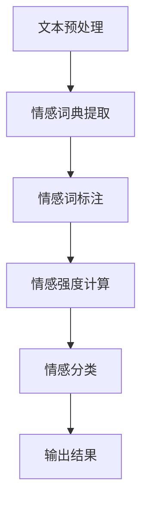
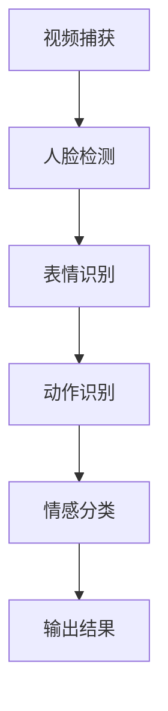
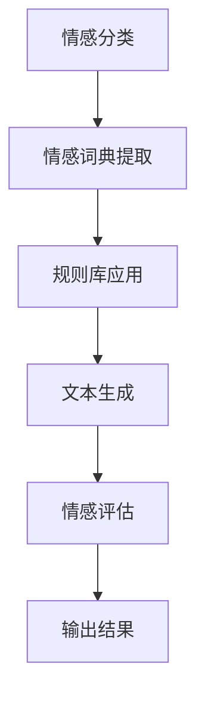
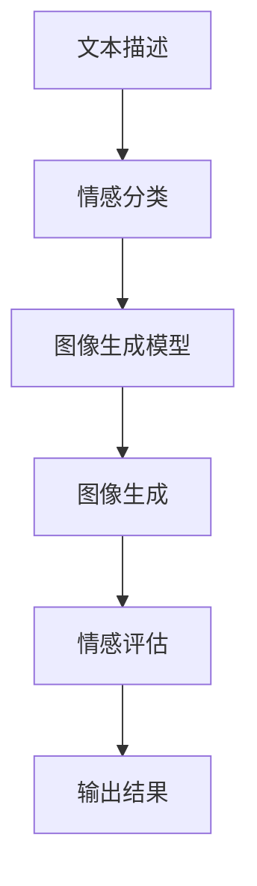
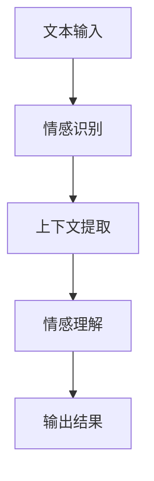
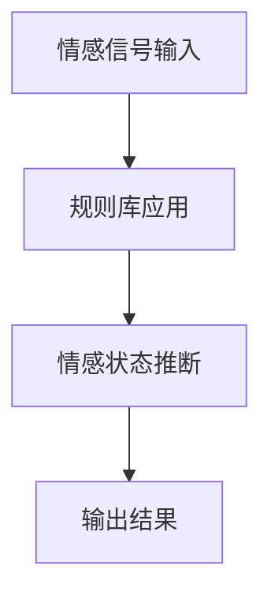

                 

### AI情感与虚拟偶像产业

#### **一、核心概念术语说明**

在探讨AI情感在虚拟偶像产业中的应用之前，我们需要明确几个核心概念：

1. **AI情感**：是指通过人工智能技术来模拟、识别、生成和表达情感的过程。它涉及到情感识别算法、情感生成算法和情感理解算法等多个方面。
  
2. **虚拟偶像**：通常是指由计算机生成的数字化人物形象，它们可以通过2D或3D动画技术呈现，并且能够在网络平台上与用户进行交互。

3. **情感识别**：是指通过分析用户的行为、语言和其他信号来识别他们的情感状态。

4. **情感生成**：是指通过算法生成虚拟偶像的情感表现，使其能够以自然的方式与用户互动。

5. **情感理解**：是指对情感信号进行深入分析，以理解其背后的含义和情感状态。

#### **二、问题背景**

虚拟偶像产业近年来发展迅猛，随着数字技术的进步和社交媒体的普及，越来越多的虚拟偶像出现在我们的生活中。然而，大多数虚拟偶像目前还只是静态的角色，缺乏真实的情感表达和与用户的深度互动。

这一问题的出现主要是因为现有技术无法有效地实现情感识别和情感生成，这使得虚拟偶像无法真正理解用户的需求和情感状态，从而无法提供个性化的交互体验。

#### **三、问题描述**

问题描述可以分为两个方面：

1. **情感识别与生成技术不足**：现有技术难以准确识别和生成复杂的情感，导致虚拟偶像在表达情感时显得机械和生硬。

2. **用户互动体验不佳**：由于虚拟偶像缺乏情感表达，用户在与它们互动时往往感到缺乏真实的情感连接。

#### **四、问题解决**

为了解决上述问题，我们需要在以下几个方面进行改进：

1. **提升情感识别与生成技术**：通过改进算法和增加数据量，提高情感识别和生成的准确性。

2. **增强情感理解能力**：利用自然语言处理和机器学习技术，使虚拟偶像能够更深入地理解用户的情感状态。

3. **优化用户互动体验**：通过设计更自然的交互方式和提供个性化的互动内容，提升用户的互动体验。

#### **五、边界与外延**

1. **边界**：本文主要讨论AI情感在虚拟偶像产业中的应用，不涉及其他领域。

2. **外延**：虽然本文聚焦于虚拟偶像产业，但AI情感技术在其他领域（如虚拟助手、在线教育等）也有广泛的应用前景。

#### **六、概念结构与核心要素组成**

- **概念结构**：AI情感技术由情感识别、情感生成和情感理解三个核心部分组成。

- **核心要素组成**：情感识别涉及行为和语言分析，情感生成涉及声音和动作生成，情感理解涉及上下文分析和情感推理。

### **ER实体关系图架构**

以下是一个简化的ER实体关系图，展示了AI情感技术中的关键实体和它们之间的关系：

```mermaid
erDiagram
  AI情感技术 ||--|{ 情感识别 }
  AI情感技术 ||--|{ 情感生成 }
  AI情感技术 ||--|{ 情感理解 }
  情感识别 ||--|{ 行为分析 }
  情感识别 ||--|{ 语言分析 }
  情感生成 ||--|{ 声音生成 }
  情感生成 ||--|{ 动作生成 }
  情感理解 ||--|{ 上下文分析 }
  情感理解 ||--|{ 情感推理 }
```

通过这个ER图，我们可以更清晰地了解AI情感技术的各个组成部分以及它们之间的相互关系。

### **总结**

本文简要介绍了AI情感和虚拟偶像产业的核心概念，分析了当前存在的问题，并提出了一些可能的解决方法。接下来，我们将深入探讨AI情感技术的实现原理，并通过具体案例来展示其在虚拟偶像产业中的应用。

---

在接下来的章节中，我们将详细分析AI情感的技术原理，包括情感识别、情感生成和情感理解三个方面。我们将通过具体的算法、技术和实例，帮助读者理解这些概念，并探讨它们在虚拟偶像产业中的应用潜力。

## AI情感技术原理

### **一、情感识别算法**

情感识别是AI情感技术的核心之一，它旨在通过分析用户的行为和语言，识别出他们的情感状态。以下是几种常见的情感识别算法：

#### **1.1 文本情感分析**

文本情感分析通过自然语言处理技术，分析文本中的情感倾向。常见的算法包括：

- **基于词典的方法**：使用情感词典来标注文本中的情感词，并计算情感强度。

- **基于机器学习的方法**：使用机器学习算法，如支持向量机（SVM）和神经网络，来预测文本的情感倾向。

以下是一个简单的文本情感分析流程：



#### **1.2 行为情感识别**

行为情感识别通过分析用户的行动和表情，识别他们的情感状态。常见的算法包括：

- **基于计算机视觉的方法**：使用深度学习模型，如卷积神经网络（CNN），来识别用户的表情和身体动作。

- **基于行为序列的方法**：分析用户的行为序列，识别出情感变化的模式。

以下是一个简单的行为情感识别流程：



### **二、情感生成算法**

情感生成是AI情感技术的另一个核心部分，它旨在通过算法生成虚拟偶像的情感表现，使其能够以自然的方式与用户互动。以下是几种常见的情感生成算法：

#### **2.1 文本情感生成**

文本情感生成通过生成文本来模拟用户的情感状态。常见的算法包括：

- **基于规则的方法**：根据情感词典和规则库，生成包含特定情感倾向的文本。

- **基于生成对抗网络（GAN）的方法**：使用GAN生成具有情感倾向的文本。

以下是一个简单的文本情感生成流程：



#### **2.2 图像情感生成**

图像情感生成通过生成图像来模拟用户的情感状态。常见的算法包括：

- **基于生成对抗网络（GAN）的方法**：使用GAN生成包含特定情感倾向的图像。

- **基于文本到图像生成的方法**：使用文本描述生成情感图像。

以下是一个简单的图像情感生成流程：



### **三、情感理解算法**

情感理解是AI情感技术的另一个关键部分，它旨在通过分析情感信号，理解其背后的含义和情感状态。以下是几种常见的情感理解算法：

#### **3.1 上下文理解**

上下文理解通过分析文本或行为中的上下文信息，理解情感的含义。常见的算法包括：

- **基于词典的方法**：使用上下文词典来理解情感词的含义。

- **基于深度学习的方法**：使用循环神经网络（RNN）或Transformer模型，来理解上下文信息。

以下是一个简单的上下文理解流程：



#### **3.2 情感推理**

情感推理通过分析多个情感信号，推断出用户的整体情感状态。常见的算法包括：

- **基于规则的方法**：使用规则库来推断情感状态。

- **基于机器学习的方法**：使用机器学习算法，如贝叶斯网络和决策树，来推断情感状态。

以下是一个简单的情感推理流程：



### **总结**

通过上述分析，我们可以看到AI情感技术包括情感识别、情感生成和情感理解三个核心部分。这些算法和技术为虚拟偶像产业提供了强大的支持，使虚拟偶像能够更加自然地与用户互动。在接下来的章节中，我们将进一步探讨这些技术如何应用于虚拟偶像产业，并分析其优势和挑战。

### AI情感的属性与特征

AI情感在虚拟偶像产业中的应用不仅依赖于技术的实现，还取决于其属性和特征。以下是对AI情感多样性、一致性和时间动态性的详细探讨。

#### **一、多样性**

AI情感的多样性是其在虚拟偶像产业中的关键优势之一。多样性体现在情感的表达方式和内容的丰富性上。虚拟偶像需要能够表达多种情感，如快乐、悲伤、愤怒、惊讶等，甚至需要在同一种情感中表现出细微的差异。这种多样性使得虚拟偶像在与用户互动时能够更加自然和生动。

为了实现情感的多样性，AI情感技术需要：

- **丰富的情感词典**：包含多种情感词汇和表达方式。
- **自适应的情感模型**：能够根据不同的情境和用户特征调整情感表达。
- **多模态情感生成**：结合文本、图像、声音等多种模态，增强情感的多样性。

#### **二、一致性**

AI情感的一致性是保证虚拟偶像与用户互动连贯性的重要因素。一致性要求虚拟偶像在表达情感时保持稳定的情感状态，避免出现情感波动或矛盾。例如，如果一个虚拟偶像在某个情境下表现出悲伤，那么在后续的互动中，其情感状态应保持相对一致，而不是突然转变为快乐。

为了实现情感的一致性，AI情感技术需要：

- **情感状态跟踪**：通过算法实时跟踪虚拟偶像的情感状态，确保其一致性。
- **情境感知**：根据用户的当前情境和互动历史，调整情感表达。
- **情感稳定化策略**：使用算法来减少情感波动，保持情感状态的一致性。

#### **三、时间动态性**

AI情感的时间动态性是指情感在时间维度上的变化和演进。虚拟偶像需要在不同的时间点表现出不同的情感状态，以适应不同的互动场景。例如，虚拟偶像在与用户初次互动时可能表现得较为谨慎和礼貌，而在熟悉之后可能变得更加轻松和友好。

为了实现情感的时间动态性，AI情感技术需要：

- **情感状态预测**：使用机器学习算法预测未来的情感状态，以便及时调整情感表达。
- **情感历史记录**：记录虚拟偶像的情感历史，用于分析情感趋势和模式。
- **情感调节策略**：根据情感历史和预测结果，动态调整情感表达，实现时间动态性。

### **表格：AI情感属性特征对比**

以下是一个对比AI情感多样性、一致性和时间动态性特征对比的表格：

| 特征         | 说明                                                         | 实现 |
| ------------ | ------------------------------------------------------------ | ---- |
| 多样性       | 情感表达的种类和内容的丰富性                                   | 丰富的情感词典、自适应情感模型、多模态情感生成 |
| 一致性       | 情感表达的连贯性和稳定性                                       | 情感状态跟踪、情境感知、情感稳定化策略 |
| 时间动态性   | 情感在时间维度上的变化和演进                                   | 情感状态预测、情感历史记录、情感调节策略 |

### **总结**

AI情感的多样性、一致性和时间动态性是其在虚拟偶像产业中成功应用的关键属性。通过实现这些属性，虚拟偶像能够更加自然和生动地与用户互动，提供个性化的用户体验。在接下来的章节中，我们将探讨AI情感在虚拟偶像中的应用场景，分析其实际应用效果。

### AI情感在虚拟偶像中的应用

#### **一、虚拟偶像的情感表现**

虚拟偶像的情感表现是其与用户互动的重要一环。通过AI情感技术，虚拟偶像可以表现出丰富的情感，增强其与用户的情感连接。以下是几种常见的虚拟偶像情感表现方式：

1. **情感驱动的互动**：虚拟偶像可以根据用户的情感状态调整互动方式。例如，当用户表现出沮丧时，虚拟偶像可能会以温柔和鼓励的方式回应，而用户表现出兴奋时，虚拟偶像可能会以激动和兴奋的方式互动。

2. **情感驱动的内容创作**：虚拟偶像可以根据用户的情感需求生成相应的互动内容。例如，用户在观看直播时表现出对某个话题的兴趣，虚拟偶像可以生成与该话题相关的互动内容，如问答、讨论等。

3. **情感驱动的角色行为**：虚拟偶像可以在特定的情境中表现出特定的情感。例如，在游戏角色扮演中，虚拟偶像可以表现出愤怒、悲伤等情感，增强游戏体验。

#### **二、情感交互与用户互动**

情感交互是虚拟偶像与用户之间建立深层次情感连接的关键。通过AI情感技术，虚拟偶像可以实现以下几种情感交互方式：

1. **情感识别**：虚拟偶像可以通过分析用户的语言和行为，识别出用户的情感状态。例如，用户在对话中表现出焦虑或兴奋，虚拟偶像可以识别这些情感并做出相应的回应。

2. **情感反馈**：虚拟偶像可以通过情感反馈来增强与用户的互动。例如，用户在提问时，虚拟偶像可以通过表情、语调和动作来表现出理解和关注。

3. **情感引导**：虚拟偶像可以通过情感引导来影响用户的情绪和行为。例如，虚拟偶像在直播中表现出乐观和积极的态度，可以激发观众的情绪，提高观看体验。

#### **三、AI情感在虚拟偶像商业中的应用**

AI情感技术在虚拟偶像产业中的应用不仅限于互动体验，还可以在商业层面上发挥作用：

1. **用户参与度提升**：通过情感交互，虚拟偶像可以更好地吸引和留住用户。例如，虚拟偶像可以通过情感化的内容创作和互动，提高用户的参与度和忠诚度。

2. **数据分析与商业模式创新**：虚拟偶像可以通过情感分析获取用户情感数据，这些数据可以用于分析用户行为和市场趋势，从而优化商业策略和商业模式。例如，根据用户情感分析，虚拟偶像可以推出更符合用户需求的商品和服务。

3. **个性化推荐**：基于情感分析，虚拟偶像可以为用户提供个性化的内容推荐。例如，根据用户的情感状态和兴趣，虚拟偶像可以推荐相关的音乐、视频和商品，从而提高用户满意度和转化率。

### **总结**

AI情感在虚拟偶像产业中的应用，不仅提升了虚拟偶像与用户的互动体验，还为其商业模式的创新提供了新的契机。通过情感驱动的内容创作、情感交互和个性化推荐，虚拟偶像可以更好地满足用户需求，提升用户参与度和商业价值。在接下来的章节中，我们将进一步探讨AI情感技术的实现原理，分析其在虚拟偶像产业中的实际应用案例。

### AI情感技术的实现

#### **一、情感识别算法的实现**

情感识别是AI情感技术的核心，它涉及对用户情感状态的准确识别。以下是情感识别算法的实现步骤和关键组件：

1. **数据收集与预处理**：
   - **数据收集**：收集用户的文本、语音、图像等数据，这些数据可以来自社交媒体、聊天记录、视频评论等。
   - **数据预处理**：对收集到的数据进行清洗和标注，去除噪声，提取有用的情感特征。

2. **情感分类模型**：
   - **特征提取**：使用自然语言处理（NLP）技术提取文本特征，如词袋模型、词嵌入（Word Embedding）等。
   - **情感分类算法**：选择合适的情感分类算法，如支持向量机（SVM）、随机森林（Random Forest）、神经网络（Neural Networks）等。以下是一个基于SVM的简单情感分类算法的实现：

```python
from sklearn.feature_extraction.text import TfidfVectorizer
from sklearn.svm import SVC
from sklearn.pipeline import make_pipeline

# 示例数据
texts = ['我很高兴', '今天是个糟糕的日子', '我爱你', '我讨厌这个']
labels = ['快乐', '悲伤', '快乐', '厌恶']

# 建立TF-IDF向量器和SVM分类器的管道
pipeline = make_pipeline(TfidfVectorizer(), SVC(kernel='linear'))

# 训练模型
pipeline.fit(texts, labels)

# 预测新数据
new_texts = ['我很开心', '今天是个美好的一天']
predictions = pipeline.predict(new_texts)

print(predictions)
```

3. **模型评估与优化**：通过交叉验证和性能指标（如准确率、召回率、F1分数）评估模型性能，并进行相应的优化。

#### **二、情感生成算法的实现**

情感生成是AI情感技术的另一个重要组成部分，它旨在生成虚拟偶像的情感表现。以下是情感生成算法的实现步骤和关键组件：

1. **文本情感生成**：
   - **情感模板库**：构建包含多种情感模板的库，如快乐、悲伤、愤怒等。
   - **文本生成模型**：使用生成对抗网络（GAN）或变分自编码器（VAE）生成情感化的文本。以下是一个基于GAN的文本情感生成实现示例：

```python
import numpy as np
from tensorflow.keras.models import Model
from tensorflow.keras.layers import Input, Dense, LSTM

# 定义生成器和判别器
input_text = Input(shape=(sequence_length,))
z = Dense(latent_dim)(input_text)
g_output = LSTM(units=128, return_sequences=True)(z)

generator = Model(input_text, g_output)

discriminator = Model(input_text, g_output)
discriminator.compile(optimizer='adam', loss='binary_crossentropy')

# 构建GAN
z = Input(shape=(latent_dim,))
g_output = generator(z)
discriminator.trainable = False
d_output = discriminator(g_output)
gan_output = Model(z, d_output)
gan_output.compile(optimizer='adam', loss='binary_crossentropy')

# 训练GAN
for epoch in range(num_epochs):
    # ... GAN训练循环 ...

# 文本生成
generated_text = generator.predict(np.random.normal(size=(1, latent_dim)))
print(generated_text)
```

2. **图像情感生成**：
   - **情感驱动图像生成**：使用GAN或VAE生成情感驱动的图像。以下是一个基于GAN的图像情感生成实现示例：

```python
from tensorflow.keras.layers import Conv2D, Flatten
from tensorflow.keras.models import Model

# 定义生成器和判别器
z = Input(shape=(latent_dim,))
g_output = Conv2D(filters=64, kernel_size=(3, 3), activation='relu')(z)
g_output = Conv2D(filters=128, kernel_size=(3, 3), activation='relu')(g_output)
g_output = Flatten()(g_output)
generator = Model(z, g_output)

discriminator = Model(input_image, g_output)
discriminator.compile(optimizer='adam', loss='binary_crossentropy')

# 构建GAN
z = Input(shape=(latent_dim,))
g_output = generator(z)
discriminator.trainable = False
d_output = discriminator(g_output)
gan_output = Model(z, d_output)
gan_output.compile(optimizer='adam', loss='binary_crossentropy')

# 训练GAN
for epoch in range(num_epochs):
    # ... GAN训练循环 ...

# 图像生成
generated_image = generator.predict(np.random.normal(size=(1, latent_dim)))
print(generated_image)
```

#### **三、情感理解算法的实现**

情感理解是AI情感技术的关键，它涉及对情感信号进行深入分析，以理解其背后的含义和情感状态。以下是情感理解算法的实现步骤和关键组件：

1. **上下文分析**：
   - **情感嵌入**：将情感标签嵌入到词嵌入空间中，以便进行上下文分析。以下是一个基于情感嵌入的上下文分析实现示例：

```python
from tensorflow.keras.layers import Embedding, LSTM, Dense
from tensorflow.keras.models import Model

# 定义模型
input_text = Input(shape=(sequence_length,))
emdedded_text = Embedding(vocabulary_size, embedding_dim)(input_text)
lstm_output = LSTM(units=128, return_sequences=True)(emdedded_text)
emotion_embedding = Dense(units=emotion_size, activation='softmax')(lstm_output)

model = Model(input_text, emotion_embedding)
model.compile(optimizer='adam', loss='categorical_crossentropy')

# 训练模型
model.fit(texts, labels, epochs=num_epochs, batch_size=batch_size)
```

2. **情感推理**：
   - **规则库**：构建情感推理规则库，用于推断用户的整体情感状态。以下是一个基于规则的情感推理实现示例：

```python
def infer_emotion(rules, current_state):
    for rule in rules:
        if all(condition == current_state[condition] for condition in rule['conditions']):
            return rule['conclusion']
    return None

rules = [
    {
        'conditions': ['happy', 'happy', 'happy'],
        'conclusion': 'extremely happy'
    },
    {
        'conditions': ['happy', 'sad', 'happy'],
        'conclusion': 'mood fluctuation'
    }
]

current_state = ['happy', 'happy', 'happy']
print(infer_emotion(rules, current_state))
```

### **总结**

通过上述实现，我们可以看到情感识别、情感生成和情感理解算法的具体实现步骤和关键组件。这些算法和技术为虚拟偶像产业提供了强大的支持，使虚拟偶像能够更加自然地与用户互动。在接下来的章节中，我们将通过实际案例展示这些技术的应用效果，并分析其在虚拟偶像产业中的实际应用案例。

### 虚拟偶像案例分析

#### **一、情感驱动的虚拟偶像角色创建**

在虚拟偶像产业中，情感驱动的虚拟偶像角色创建是一个关键环节。一个成功的案例是“洛天依”（Lucy Lee），她是我国首个全息虚拟歌手。洛天依通过AI情感技术，实现了高度的情感化角色创建，具体表现在以下几个方面：

1. **情感分析引擎**：洛天依采用了情感分析技术，能够通过用户的语言和行为识别其情感状态。例如，当用户在社交媒体上留言表达快乐时，洛天依会以快乐的声音和表情回应。

2. **情感生成模型**：洛天依使用了生成对抗网络（GAN）和变分自编码器（VAE）等技术，生成情感化的声音和动作。这使得洛天依在演唱和互动时能够表现出丰富的情感。

3. **情感交互设计**：洛天依的情感交互设计旨在提供个性化的互动体验。例如，当用户感到沮丧时，洛天依会以温柔和鼓励的方式回应，增强用户的情感连接。

#### **二、虚拟偶像产业的实际应用**

AI情感技术在虚拟偶像产业中的实际应用，不仅提升了用户体验，还为商业模式创新提供了新的思路。以下是几个成功的实际应用案例：

1. **虚拟偶像直播互动**：虚拟偶像通过情感交互与观众互动，提升了直播的参与度和用户满意度。例如，在直播中，虚拟偶像可以根据观众的情感状态调整互动内容，提供个性化的互动体验。

2. **虚拟偶像代言**：虚拟偶像在广告和代言中发挥了重要作用。通过情感化表现，虚拟偶像能够更好地传达品牌情感，增强用户对品牌的认知和好感。

3. **虚拟偶像教育**：虚拟偶像在在线教育中也有广泛应用。通过情感化互动，虚拟偶像能够更好地吸引学生的注意力，提高学习效果。

#### **三、成功案例分析**

以“Vtuber”为例，这是日本虚拟偶像的一种形式，其成功案例包括“Hololive”和“UpPop!”等。以下是Vtuber的成功案例分析：

1. **社区建设**：Vtuber通过建立强大的粉丝社区，实现了粉丝的深度参与。粉丝可以通过直播、讨论区等方式与虚拟偶像互动，增强了粉丝的归属感和忠诚度。

2. **内容多样化**：Vtuber不仅限于音乐演出，还涵盖了游戏、谈话、搞笑等多种形式，满足了不同粉丝的喜好。

3. **商业化探索**：Vtuber通过虚拟偶像周边商品、虚拟偶像演唱会等方式实现了商业化，进一步提升了虚拟偶像的品牌价值。

#### **四、挑战与未来趋势**

尽管AI情感技术在虚拟偶像产业中取得了显著成果，但仍面临一些挑战和机遇：

1. **技术挑战**：情感识别和生成的准确性需要进一步提升，以提供更自然和真实的互动体验。

2. **伦理问题**：虚拟偶像的情感表达可能涉及伦理和道德问题，如隐私保护和道德责任等。

3. **未来趋势**：随着技术的进步，虚拟偶像有望在更广泛的领域中发挥作用，如虚拟客服、虚拟教练等。

### **总结**

通过以上案例分析，我们可以看到AI情感技术在虚拟偶像产业中的成功应用。这些案例不仅展示了情感驱动虚拟偶像的角色创建和实际应用，还为未来的发展提供了启示。在接下来的章节中，我们将探讨AI情感技术的最佳实践，分享一些实用的技术和策略，以推动虚拟偶像产业的进一步发展。

### AI情感技术的最佳实践

#### **一、技术选型与优化**

在实现AI情感技术时，合理的技术选型与优化策略是确保系统性能和准确性的关键。以下是一些最佳实践：

1. **算法选择**：根据应用场景和需求，选择合适的算法。例如，在文本情感分析中，可以使用基于词嵌入和深度学习的模型，如BERT或GPT，以提高情感识别的准确性。

2. **模型优化**：通过超参数调优、模型剪枝和量化等方法，优化模型的性能和计算效率。例如，使用迁移学习和预训练技术，可以显著提升模型的泛化能力。

3. **数据预处理**：高质量的数据预处理是提高模型性能的基础。包括数据清洗、数据增强和特征提取等步骤，可以有效减少噪声和增加模型的鲁棒性。

4. **硬件加速**：利用GPU或TPU等硬件加速器，可以显著提高模型的训练和推理速度。通过分布式训练和模型并行化，可以进一步提升系统的性能。

#### **二、安全性与伦理问题**

在AI情感技术的应用中，安全性和伦理问题是不可忽视的。以下是一些关键点：

1. **隐私保护**：在数据收集和处理过程中，确保用户的隐私数据得到充分保护。采用差分隐私和同态加密等技术，可以增强数据隐私性。

2. **数据匿名化**：在数据公开或共享时，对敏感信息进行匿名化处理，以防止个人隐私泄露。

3. **伦理审核**：建立伦理审核机制，确保AI情感技术的应用符合道德和法律标准。例如，在情感生成中，应避免产生误导性或有害的情感内容。

4. **透明性**：提高系统的透明度，让用户了解AI情感技术的运作方式和潜在风险，增强用户对技术的信任。

#### **三、实际案例中的最佳实践**

以下是一些实际案例中的最佳实践：

1. **网易云音乐**：网易云音乐通过AI情感分析技术，为用户提供情感化的音乐推荐。通过分析用户评论和听歌记录，系统可以生成个性化的音乐推荐列表，提高用户满意度。

2. **抖音**：抖音利用AI情感生成技术，为用户生成情感化的短视频内容。通过分析用户情感需求，系统可以自动生成与用户情感状态相符的短视频，增强用户的观看体验。

3. **虚拟偶像洛天依**：洛天依通过情感交互设计，为用户提供个性化的互动体验。通过情感分析技术，洛天依可以识别用户的情感状态，并根据情感状态调整互动内容，提高用户的参与度。

#### **四、总结**

AI情感技术的最佳实践涵盖了技术选型与优化、安全性与伦理问题以及实际案例中的成功经验。通过遵循这些最佳实践，可以确保AI情感技术在虚拟偶像产业中的应用更加有效、安全和符合伦理。在未来的发展中，随着技术的不断进步和应用场景的拓展，AI情感技术将在虚拟偶像产业中发挥更加重要的作用。

### 总结与展望

本文详细探讨了AI情感在虚拟偶像产业中的应用，从核心概念、技术原理到实际案例，我们逐步分析了AI情感在虚拟偶像产业中的重要性及其具体实现方法。通过情感识别、情感生成和情感理解，虚拟偶像能够更加自然地与用户互动，提升用户体验和商业价值。

**小结：** AI情感技术的引入，使得虚拟偶像不再只是静态的角色，而是能够理解用户情感、提供个性化互动的动态存在。这一技术的应用，不仅丰富了虚拟偶像的表现形式，也为虚拟偶像产业带来了新的商业模式和发展机遇。

**注意事项：** 在应用AI情感技术时，需要关注隐私保护和伦理问题，确保用户数据的安全和合规性。同时，持续优化算法和模型，提升情感识别和生成的准确性，是确保虚拟偶像与用户互动效果的关键。

**拓展阅读：** 想进一步了解AI情感技术的最新研究和发展，可以阅读《情感计算：技术、应用与挑战》（Affective Computing: Technology, Applications, and Challenges）和《情感AI：人类情感与机器智能的交汇》（Affective AI: The Convergence of Human Emotions and Machine Intelligence）等书籍。

作者：AI天才研究院/AI Genius Institute & 禅与计算机程序设计艺术 /Zen And The Art of Computer Programming

---

通过本文的详细探讨，我们不仅加深了对AI情感技术的理解，也为虚拟偶像产业的发展提供了新的视角和思路。在未来的技术进步和应用创新中，AI情感将继续发挥重要作用，为虚拟偶像产业带来更多可能性。

