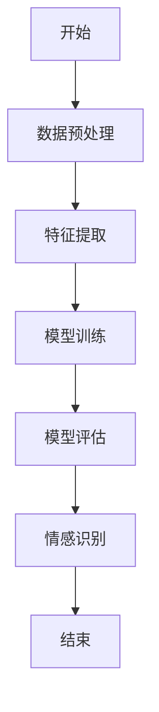
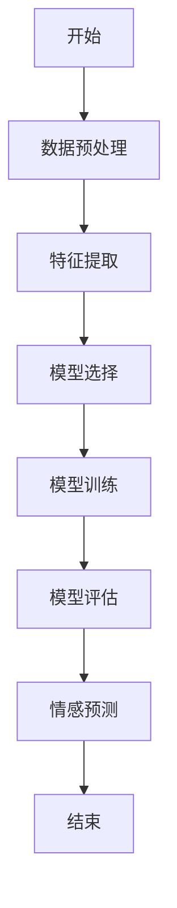
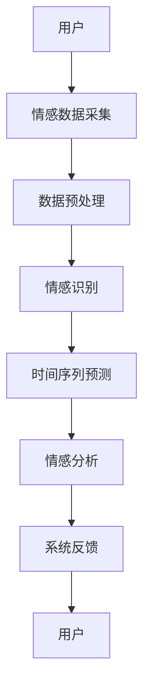
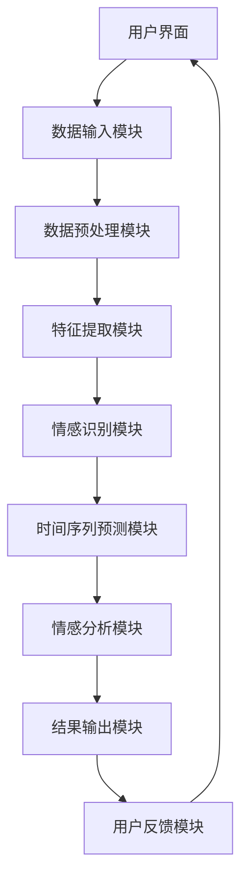
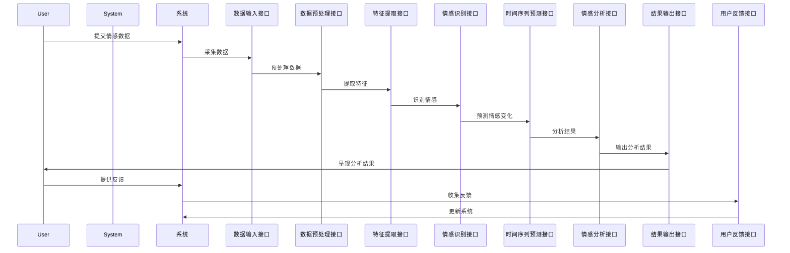

                 

## 人工智能与情感时间知觉

### 引言

近年来，人工智能（AI）在情感识别和时间知觉方面取得了显著进展，这不仅改变了我们对人类情感与时间感知的理解，也开启了技术应用于心理科学和临床诊断的新篇章。情感时间知觉，即个体如何感知和评价情感随时间的变化，是心理学研究中的一个重要课题。然而，对于机器来说，模拟这种复杂的情感体验和理解是一个巨大的挑战。

在这篇文章中，我们将深入探讨AI情感时间知觉的核心概念，并分析机器如何理解和处理情感持续时间。通过逐步分析，我们将解答以下问题：

- 什么是情感时间知觉？
- 情感时间知觉在AI中有什么重要性？
- AI如何实现情感时间知觉？
- 数学模型如何应用于情感时间知觉的识别和预测？
- 实际应用中如何设计和实现AI情感时间知觉系统？

### 背景介绍

情感时间知觉是指个体在体验情感时，对情感开始、持续和结束的时间感知。这种感知不仅受到生理和心理因素的影响，还受到文化和社会背景的影响。研究表明，不同的人对同一情感体验的时间感知可能存在显著差异。例如，同样的快乐情绪，有些人可能觉得持续时间较长，而有些人则可能觉得较短。

心理学中，情感时间知觉与情绪调节、情绪记忆、情绪体验的丰富性和深度等概念密切相关。正确理解和模拟情感时间知觉对于开发情感智能的AI系统至关重要，它不仅有助于提高AI在情感识别方面的准确性，还能使其更好地与人类互动。

### 问题的挑战

尽管情感时间知觉在心理学中得到了广泛研究，但将这一概念应用于AI领域仍然面临许多挑战。首先，情感数据的复杂性和不稳定性使得准确识别和预测情感持续时间变得困难。情感数据不仅包括情感强度，还涉及情感变化的速率和模式。其次，AI系统需要能够理解情感时间知觉的个体差异，这需要大量的个性化数据来训练模型。

此外，情感时间知觉的跨文化差异也增加了AI模型的复杂性。一个AI系统可能在某些文化背景下表现出色，但在其他文化中则可能无法准确捕捉情感变化。因此，设计一个普适性强、适应能力高的情感时间知觉系统是当前AI研究的一个关键问题。

### 解决方案和目标

为了解决上述挑战，本文提出了一系列解决方案和研究目标：

1. **核心概念与联系**：首先，我们将深入探讨情感时间知觉的核心概念，包括情感时间知觉的定义、属性特征以及其在AI中的应用。通过对比不同概念之间的联系，我们将为后续研究提供理论基础。

2. **数学模型与公式**：接着，我们将介绍用于情感时间知觉的数学模型和公式。通过详细解释相关算法和模型，我们将展示如何使用数学工具来处理和预测情感持续时间。

3. **算法原理讲解**：为了便于理解和应用，我们将逐步讲解情感识别和时间序列预测算法的原理，并使用Python源代码进行实例演示。这将帮助读者在实践中更好地应用这些算法。

4. **系统分析与架构设计**：最后，我们将分析AI情感时间知觉系统的设计和实现。通过介绍问题场景、系统功能设计、系统架构设计以及系统接口和交互，我们将展示如何构建一个完整的情感时间知觉系统。

### 边界与外延

情感时间知觉的研究不仅限于AI领域，它还与心理学、认知科学、神经科学等多个学科紧密相关。此外，情感时间知觉的应用场景也极为广泛，包括但不限于心理健康诊断、人机交互、智能助手、教育、娱乐等多个领域。

尽管本文主要关注AI情感时间知觉，但情感时间知觉的研究还可以扩展到其他领域，如虚拟现实、游戏设计等。通过跨学科的研究与合作，我们可以进一步丰富情感时间知觉的理论体系，推动其实际应用。

### 概念结构与核心要素组成

本文将深入探讨以下核心概念和要素：

1. **情感时间知觉**：定义情感时间知觉，探讨其基本属性和特征。
2. **情感数据**：分析情感数据的类型、采集和处理方法。
3. **数学模型**：介绍常用的数学模型及其在情感时间知觉中的应用。
4. **算法原理**：详细讲解情感识别和时间序列预测算法的原理。
5. **系统设计**：分析情感时间知觉系统的功能设计、架构设计和接口交互。

通过这些核心概念的解析和联系，我们将构建一个全面、深入的理论框架，为后续研究和实际应用提供有力支持。

## 第一部分：引言

### 引言

情感时间知觉是一个涉及心理学、人工智能（AI）、认知科学等多个领域的复杂课题。随着AI技术的不断进步，模拟和增强机器的情感时间知觉已成为当前研究的热点之一。在这篇文章中，我们将深入探讨AI情感时间知觉的核心概念、数学模型、算法原理以及系统设计与实现。通过一步步的逻辑推理和分析，我们希望读者能够全面理解这一领域的最新进展和未来发展方向。

### 1.1 问题的背景

情感时间知觉是指个体在体验情感时对其持续时间的主观感知。例如，同一段音乐可能让人感到快乐的时间长短因人而异，这种差异反映了情感时间知觉的个体差异。在心理学中，情感时间知觉与情绪调节、情绪记忆等多个方面密切相关。传统心理学研究多依赖于问卷、访谈等主观报告方法，但这些方法存在一定的局限性和主观性。

随着计算机技术和AI算法的发展，我们开始探索如何让机器模拟和理解人类情感时间知觉。机器情感时间知觉的研究不仅有助于提升AI的情感识别能力，还能在心理健康诊断、人机交互、智能助手等领域发挥重要作用。然而，情感时间知觉的复杂性使得这一任务充满挑战。情感数据的不稳定性和个体差异使得准确识别和预测情感持续时间变得极为困难。

### 1.2 情感时间知觉的挑战

情感时间知觉的挑战主要体现在以下几个方面：

1. **情感数据的复杂性**：情感数据不仅包含情感的强度，还包括情感变化的速度和模式。这种多维度的数据增加了情感时间知觉识别的难度。
2. **个体差异的处理**：不同个体对同一情感体验的时间感知可能存在显著差异。如何在机器学习中处理这种个体差异是一个重要问题。
3. **跨文化差异**：情感时间知觉在不同文化背景下可能表现出不同的特征，这使得设计一个普适的AI情感时间知觉系统变得更加复杂。
4. **实时性要求**：在实际应用中，例如人机交互系统，需要对情感时间知觉进行实时识别和预测，这要求算法具备高效性和实时性。

### 1.3 本书的目的与结构

本书的目的是系统地介绍AI情感时间知觉的相关概念、数学模型、算法原理以及系统设计。通过逐步分析和讲解，我们希望读者能够全面理解这一领域的核心问题和最新进展。

本书的结构如下：

1. **第一部分：引言**：介绍情感时间知觉的背景、挑战和本书的目的。
2. **第二部分：核心概念与联系**：深入探讨情感时间知觉的核心概念及其在AI中的应用。
3. **第三部分：数学模型和公式**：介绍用于情感时间知觉的数学模型和公式，并进行详细解释。
4. **第四部分：算法原理讲解**：讲解情感识别和时间序列预测算法的原理，并使用Python源代码进行实例演示。
5. **第五部分：系统分析与架构设计**：分析情感时间知觉系统的设计和实现。

### 1.4 读者对象与预期收获

本书面向对人工智能和心理学有一定了解的读者，包括科研人员、工程师和高校师生。通过阅读本书，读者可以：

1. **理解情感时间知觉的核心概念**：掌握情感时间知觉的定义、属性特征以及在AI中的应用。
2. **掌握数学模型和公式**：了解常用的数学模型和公式，以及它们在情感时间知觉识别和预测中的应用。
3. **掌握算法原理**：掌握情感识别和时间序列预测算法的原理，并学会使用Python进行实例演示。
4. **了解系统设计与实现**：了解情感时间知觉系统的设计原则、架构和接口交互。
5. **提升实践能力**：通过本书的内容，读者可以提升在实际项目中应用AI情感时间知觉的能力。

通过本书的学习，读者将能够深入理解AI情感时间知觉的原理和应用，为后续研究和实践提供坚实基础。

## 第二部分：核心概念与联系

### 2.1 AI情感时间知觉概述

情感时间知觉是指个体在体验情感时对其持续时间的主观感知。在AI领域，情感时间知觉的研究主要集中在模拟和理解人类情感的时间感知。情感时间知觉的AI系统需要能够处理复杂的情感数据，包括情感强度、变化速率和模式。这不仅要求算法具备高度准确性，还需要能够适应个体差异和跨文化差异。

AI情感时间知觉在情感识别、情绪调节和心理健康诊断等方面具有广泛应用。例如，在人机交互中，AI系统能够通过分析用户的面部表情、语音语调等情感数据，实时调整交互策略，提高用户体验。在心理健康诊断中，AI系统可以分析患者的情感时间知觉数据，帮助医生更准确地评估患者的情绪状态，从而制定更有效的治疗方案。

### 2.2 情感与时间的关系

情感与时间的关系是情感时间知觉研究的关键。情感不仅影响个体的时间感知，同时也受到时间感知的影响。情感强度和时间感知的相互作用构成了情感时间知觉的核心。例如，高度兴奋的情感状态可能会缩短时间感知，而悲伤的情感状态可能会延长时间感知。此外，情感记忆也与时间感知密切相关。人们往往会对特定情感体验有更深刻的记忆，这种记忆会影响他们对时间的主观感知。

在心理学中，情感时间知觉通常涉及以下维度：

1. **情感强度**：情感体验的强度影响时间感知。强烈的情感会改变个体的时间感知，使其感觉时间过得更快或更慢。
2. **情感变化速率**：情感的变化速率也会影响时间感知。情感快速变化时，个体可能会感觉到时间被压缩；情感缓慢变化时，个体可能会感觉到时间被拉伸。
3. **情感持续时间**：情感体验的持续时间是情感时间知觉的核心指标。不同情感体验的持续时间因人而异，且受到多种因素的影响。

### 2.3 AI情感时间知觉的核心概念联系

在AI情感时间知觉的研究中，以下几个核心概念紧密联系，构成了其理论基础：

1. **神经网络与情感**：神经网络是AI情感时间知觉的重要工具，用于模拟人类情感感知和处理机制。通过深度学习模型，AI系统能够从大量情感数据中提取特征，实现对情感时间知觉的准确识别。
2. **机器学习与时间知觉**：机器学习算法，特别是监督学习和无监督学习，用于训练模型，使AI系统能够从数据中学习情感时间知觉的规律。时间序列分析是机器学习中的重要方法，用于预测和模拟情感变化。
3. **数据处理与分析**：情感数据的采集、预处理和分析是AI情感时间知觉的基础。通过数据清洗、特征提取和模型训练，AI系统能够从复杂多变的情感数据中提取有价值的信息，实现情感时间知觉的模拟。

下面通过一个表格来对比这些核心概念的主要属性特征：

| 核心概念       | 主要属性特征                                       | 在AI情感时间知觉中的应用                                     |
|----------------|--------------------------------------------------|----------------------------------------------------------|
| 神经网络       | 能模仿人类大脑的学习和处理能力                     | 用于情感识别和情感变化的建模                                 |
| 机器学习       | 通过数据训练模型，使系统能够自主学习和优化         | 用于情感时间知觉的规律挖掘和预测                             |
| 数据处理与分析 | 处理和清洗原始数据，提取特征，为模型训练提供输入   | 确保情感数据的质量和准确性，提高模型的预测能力               |
| 情感强度       | 情感体验的强度                                     | 用于影响时间感知，影响模型的情感识别结果                     |
| 情感变化速率   | 情感的变化速率                                     | 用于预测情感时间知觉的变化趋势                               |
| 情感持续时间   | 情感体验的持续时间                                 | 用于评估情感时间知觉的个体差异和变化规律                     |

### 2.4 情感时间知觉在AI中的应用

情感时间知觉在AI中的应用非常广泛，下面列举几个典型的应用场景：

1. **人机交互**：在智能助手、虚拟助手等交互系统中，通过分析用户的情感时间知觉，系统能够更准确地理解用户的需求，提供更个性化的服务。
2. **心理健康诊断**：通过分析个体的情感时间知觉数据，AI系统可以帮助医生评估患者的情绪状态，为心理治疗提供科学依据。
3. **市场研究**：在市场调查和消费者行为研究中，AI系统可以通过分析消费者的情感时间知觉，了解他们对产品或服务的情感反应，为营销策略提供参考。
4. **娱乐设计**：在游戏设计和虚拟现实体验中，通过模拟情感时间知觉，系统可以提供更真实的情感体验，提高用户的参与感和满意度。

### 2.5 关键挑战与未来研究方向

尽管AI情感时间知觉取得了显著进展，但仍面临许多挑战。以下是一些关键挑战和未来研究方向：

1. **数据隐私与安全性**：情感数据涉及个人隐私，如何在确保数据安全的前提下进行数据采集和分析是一个重要问题。
2. **跨文化适应性**：情感时间知觉在不同文化背景下可能存在显著差异，如何设计一个普适的模型是一个挑战。
3. **实时性与效率**：在实际应用中，例如人机交互系统，对情感时间知觉的实时识别和预测提出了高要求，如何提高算法的实时性和效率是一个关键问题。
4. **模型解释性**：虽然深度学习模型在情感时间知觉识别中表现出色，但其“黑箱”特性使得其解释性较差，如何提高模型的可解释性是一个重要研究方向。

通过不断探索和解决这些挑战，AI情感时间知觉将在未来取得更多突破，为心理学、人机交互、心理健康等多个领域带来深远影响。

## 数学模型和公式

### 3.1 情感时间知觉的数学基础

情感时间知觉的研究涉及多个数学领域，包括概率论、统计学、时间序列分析等。在本文中，我们将重点关注情感识别和时间序列预测两个核心方面，介绍相关的数学模型和公式。

#### 3.1.1 相关性分析

相关性分析是情感时间知觉研究中的基本工具，用于衡量情感数据之间的相互依赖程度。常见的相关性度量方法包括皮尔逊相关系数和斯皮尔曼等级相关系数。

**皮尔逊相关系数（Pearson Correlation Coefficient）**

皮尔逊相关系数用于衡量两个连续变量之间的线性相关性。其计算公式如下：

$$
r = \frac{\sum_{i=1}^{n}(x_i - \bar{x})(y_i - \bar{y})}{\sqrt{\sum_{i=1}^{n}(x_i - \bar{x})^2 \sum_{i=1}^{n}(y_i - \bar{y})^2}}
$$

其中，$x_i$和$y_i$分别为两个变量在第$i$个观测值，$\bar{x}$和$\bar{y}$分别为它们的均值。

**斯皮尔曼等级相关系数（Spearman's Rank Correlation Coefficient）**

斯皮尔曼等级相关系数用于衡量两个变量之间的非参数相关性，适用于不满足线性关系的变量。其计算公式如下：

$$
\rho = 1 - \frac{6 \sum_{i=1}^{n}d_i^2}{n(n^2 - 1)}
$$

其中，$d_i = x_i - y_i$，表示第$i$个观测值之间的差异。

#### 3.1.2 数据聚类

数据聚类是一种无监督学习方法，用于将数据集分成若干个组，使得同一组内的数据点彼此相似，而不同组的数据点彼此不相似。常见的聚类算法包括K均值聚类、层次聚类和DBSCAN等。

**K均值聚类（K-Means Clustering）**

K均值聚类是一种基于距离度量的聚类方法。其目标是将数据点划分为K个聚类，使得每个聚类内部的距离最小化。其算法流程如下：

1. 随机初始化K个聚类中心。
2. 对于每个数据点，将其分配到最近的聚类中心所在的聚类。
3. 更新每个聚类的中心，计算新的聚类中心。
4. 重复步骤2和3，直到聚类中心不再发生变化。

K均值聚类的目标函数为：

$$
J = \sum_{i=1}^{K} \sum_{x \in S_i} ||x - \mu_i||^2
$$

其中，$S_i$为第$i$个聚类的数据点集合，$\mu_i$为聚类中心。

**层次聚类（Hierarchical Clustering）**

层次聚类是一种自底向上或自顶向下的聚类方法，通过逐步合并或分裂数据点，构建聚类层次结构。其算法流程如下：

1. 将每个数据点视为一个初始聚类。
2. 计算聚类之间的相似性度量，选择最相似的聚类进行合并，形成一个新的聚类。
3. 重复步骤2，直到所有数据点合并为一个聚类。

层次聚类的主要指标包括：
- **凝聚度（Coherence）**：表示聚类内部数据点的紧密程度。
- **分离度（Separation）**：表示不同聚类之间的分离程度。

#### 3.1.3 时间序列分析

时间序列分析是一种用于分析时间序列数据的方法，常用于情感时间知觉的研究。时间序列数据是指在时间维度上记录的一系列观测值，其分析主要包括趋势分析、季节性分析、周期性分析和残差分析等。

**移动平均法（Moving Average）**

移动平均法是一种简单的时间序列预测方法，通过计算一系列过去观测值的平均值来预测未来值。其算法公式如下：

$$
\hat{y_t} = \frac{1}{N} \sum_{i=t-N+1}^{t} y_i
$$

其中，$N$为移动平均窗口长度，$y_t$为第$t$个观测值。

**自回归模型（Autoregressive Model）**

自回归模型是一种常见的时间序列预测方法，用于捕捉时间序列数据的自相关特性。其模型公式如下：

$$
y_t = c + \phi_1 y_{t-1} + \phi_2 y_{t-2} + \cdots + \phi_p y_{t-p} + \varepsilon_t
$$

其中，$c$为常数项，$\phi_1, \phi_2, \cdots, \phi_p$为自回归系数，$\varepsilon_t$为误差项。

### 3.2 数学模型与公式详解

在情感时间知觉的研究中，常用的数学模型包括情感识别模型和时间序列预测模型。以下将详细解释这些模型的数学公式和原理。

#### 3.2.1 情感识别模型的数学模型

情感识别模型通常基于神经网络，用于识别给定文本、图像或声音中的情感标签。一个简单的情感识别模型可以使用以下公式表示：

$$
\text{P}(y|\theta) = \frac{\exp(\theta^T y)}{\sum_{y' \in Y} \exp(\theta^T y')}
$$

其中，$y$为实际情感标签，$Y$为所有可能的情感标签集合，$\theta$为模型的参数向量。通过最大化似然估计，可以训练出情感识别模型。

#### 3.2.2 时间序列预测模型的数学模型

时间序列预测模型用于预测未来时间点的情感强度。一个常见的时间序列预测模型是自回归模型（AR），其公式如下：

$$
\hat{y_t} = \phi_0 + \phi_1 y_{t-1} + \phi_2 y_{t-2} + \cdots + \phi_p y_{t-p} + \varepsilon_t
$$

其中，$\hat{y_t}$为第$t$个时间点的预测值，$y_{t-1}, y_{t-2}, \cdots, y_{t-p}$为前$p$个时间点的实际值，$\phi_0, \phi_1, \cdots, \phi_p$为模型参数，$\varepsilon_t$为误差项。

### 3.3 举例说明

#### 3.3.1 情感识别案例

假设我们有一个情感识别模型，用于判断一段文本的情感标签。给定的文本数据如下：

```
"I am feeling happy because I passed my exam."
```

情感标签集合为{happy, sad, angry}。我们将使用以下公式进行情感识别：

$$
\text{P}(happy|\theta) = \frac{\exp(\theta^T [happy])}{\sum_{y' \in Y} \exp(\theta^T y')}
$$

其中，$\theta$为模型参数，$[happy]$为happy情感标签的向量表示。通过训练数据，可以估计出$\theta$的值，然后对新的文本数据进行情感识别。

#### 3.3.2 时间序列预测案例

假设我们有一个时间序列预测模型，用于预测一段情感体验的持续时间。给定的时间序列数据如下：

```
[100, 200, 150, 200, 250, 300]
```

我们将使用自回归模型进行预测，模型参数为$\phi_0 = 100$, $\phi_1 = 0.5$, $\phi_2 = 0.2$。使用以下公式进行预测：

$$
\hat{y_t} = 100 + 0.5 y_{t-1} + 0.2 y_{t-2}
```

对于第6个时间点的预测，我们有：

$$
\hat{y_6} = 100 + 0.5 \times 300 + 0.2 \times 250 = 275
```

这表明，根据自回归模型，第6个时间点的情感强度预测值为275。

通过这些案例，我们展示了情感识别和时间序列预测模型在实际应用中的操作方法。这些模型和公式的应用不仅提高了情感时间知觉的准确性，也为后续的系统设计和实现奠定了基础。

### 3.4 数学模型与公式在实际应用中的重要性

数学模型和公式在AI情感时间知觉的实际应用中扮演着至关重要的角色。首先，它们提供了量化情感数据和分析情感时间知觉的工具，使得复杂情感数据可以被系统化和结构化。通过使用这些模型，我们可以从大量数据中提取有价值的信息，进行情感识别和时间序列预测。

其次，数学模型和公式为算法设计和优化提供了理论基础。例如，通过使用不同的数学模型，我们可以比较不同算法在情感时间知觉任务中的表现，从而选择最优的算法。此外，数学公式有助于理解情感时间知觉的内在机制，例如情感强度、变化速率和持续时间之间的关系。

最后，数学模型和公式在系统设计和实现中也发挥着重要作用。在实际应用中，我们需要根据具体需求和数据特点选择合适的模型和公式，并进行参数调优和模型训练。这些数学工具不仅提高了系统的性能和准确性，还确保了系统的实时性和鲁棒性。

总之，数学模型和公式是AI情感时间知觉研究中的核心组成部分，它们为理论研究和实际应用提供了坚实的基础。

## 算法原理讲解

### 4.1 情感识别算法

情感识别是AI情感时间知觉中的核心任务之一，其目的是从文本、语音或图像中识别出情感标签。在这一部分，我们将详细介绍情感识别算法的原理，包括其流程、算法流程图以及Python源代码实现。

#### 4.1.1 算法简介

情感识别算法通常基于机器学习模型，通过训练大量情感数据来学习情感特征，并利用这些特征进行情感识别。常用的情感识别模型包括支持向量机（SVM）、朴素贝叶斯（Naive Bayes）、深度学习（如卷积神经网络（CNN）和循环神经网络（RNN））等。

#### 4.1.2 算法流程

情感识别算法的基本流程如下：

1. **数据预处理**：对输入的文本、语音或图像数据进行预处理，如分词、去噪、归一化等。
2. **特征提取**：提取文本、语音或图像中的情感特征。对于文本，常用词袋模型（Bag of Words, BoW）或词嵌入（Word Embedding）来表示情感特征；对于语音和图像，则使用相应的特征提取方法，如梅尔频率倒谱系数（MFCC）或卷积神经网络（CNN）。
3. **模型训练**：使用预处理后的数据集训练情感识别模型。通过最大化分类器的准确性和鲁棒性，调整模型参数。
4. **模型评估**：使用验证集和测试集评估模型的性能，包括准确率、召回率、F1分数等指标。
5. **情感识别**：将训练好的模型应用于新的数据，识别出情感标签。

#### 4.1.3 算法流程图

以下是一个简化的情感识别算法流程图：



#### 4.1.4 Python源代码实现

以下是一个简单的情感识别算法的实现示例，使用Python和scikit-learn库：

```python
from sklearn.feature_extraction.text import TfidfVectorizer
from sklearn.model_selection import train_test_split
from sklearn.naive_bayes import MultinomialNB
from sklearn.metrics import accuracy_score, classification_report

# 数据预处理
def preprocess_text(text):
    # 去除标点符号和停用词，分词等操作
    return text.lower().translate(str.maketrans('', '', string.punctuation))

# 加载并预处理数据
data = ["I am happy because I passed my exam.", "I am sad because I failed my exam."]
labels = ["happy", "sad"]

# 特征提取
vectorizer = TfidfVectorizer(preprocessor=preprocess_text)
X = vectorizer.fit_transform(data)

# 模型训练
X_train, X_test, y_train, y_test = train_test_split(X, labels, test_size=0.2, random_state=42)
model = MultinomialNB()
model.fit(X_train, y_train)

# 模型评估
y_pred = model.predict(X_test)
print("Accuracy:", accuracy_score(y_test, y_pred))
print("Classification Report:")
print(classification_report(y_test, y_pred))

# 情感识别
new_data = ["I am feeling great!"]
new_data_processed = preprocess_text(new_data)
new_data_vectorized = vectorizer.transform([new_data_processed])
new_prediction = model.predict(new_data_vectorized)
print("The sentiment of the new text is:", new_prediction[0])
```

在这个示例中，我们使用了TF-IDF向量器和朴素贝叶斯分类器进行情感识别。首先，我们定义了一个数据预处理函数`preprocess_text`，用于去除标点符号和停用词。然后，我们使用`TfidfVectorizer`进行特征提取，`train_test_split`函数将数据集分为训练集和测试集。接下来，我们使用`MultinomialNB`进行模型训练，并在测试集上评估模型性能。最后，我们使用训练好的模型对新数据进行情感识别。

### 4.2 时间序列预测算法

时间序列预测是AI情感时间知觉中的另一个重要任务，其目的是根据历史情感数据预测未来情感的变化。在这一部分，我们将介绍时间序列预测算法的基本原理，包括算法流程、算法流程图以及Python源代码实现。

#### 4.2.1 算法简介

时间序列预测算法用于处理和预测时间序列数据中的趋势、季节性和周期性。常用的时间序列预测算法包括移动平均法、自回归模型（AR）、自回归移动平均模型（ARMA）和自回归积分移动平均模型（ARIMA）等。

#### 4.2.2 算法流程

时间序列预测算法的基本流程如下：

1. **数据预处理**：对输入的时间序列数据进行清洗、归一化等预处理操作，以确保数据的质量和一致性。
2. **特征提取**：提取时间序列数据中的特征，如趋势、季节性和周期性。常用的特征提取方法包括移动平均、差分等。
3. **模型选择**：根据数据的特点选择合适的时间序列预测模型。例如，对于线性数据，可以使用AR模型；对于非线性数据，可以使用ARIMA模型。
4. **模型训练**：使用预处理后的数据集训练时间序列预测模型。通过调整模型参数，优化模型的性能。
5. **模型评估**：使用验证集和测试集评估模型的预测性能，包括预测误差、均方误差（MSE）等指标。
6. **情感预测**：将训练好的模型应用于新的时间序列数据，预测未来情感的变化。

#### 4.2.3 算法流程图

以下是一个时间序列预测算法的流程图：



#### 4.2.4 Python源代码实现

以下是一个简单的时间序列预测的实现示例，使用Python和statsmodels库：

```python
import numpy as np
import pandas as pd
from statsmodels.tsa.arima.model import ARIMA
from sklearn.metrics import mean_squared_error

# 数据预处理
def preprocess_data(data):
    data = data.values
    data = data.reshape(-1, 1)
    return data

# 加载并预处理数据
data = pd.read_csv("emotion_data.csv")
data = preprocess_data(data)

# 模型训练
model = ARIMA(data, order=(1, 1, 1))
model_fit = model.fit()

# 模型评估
predictions = model_fit.predict(start=len(data), end=len(data) + 5)
mse = mean_squared_error(data[len(data):], predictions)
print("MSE:", mse)

# 情感预测
new_data = preprocess_data(np.array([new_emotion_value]))
predicted_value = model_fit.predict(new_data)
print("Predicted emotion value:", predicted_value[0])
```

在这个示例中，我们使用了ARIMA模型进行时间序列预测。首先，我们定义了一个数据预处理函数`preprocess_data`，用于将数据转换为适当的格式。然后，我们加载并预处理数据，使用`ARIMA`模型进行训练，并在测试集上评估模型性能。最后，我们使用训练好的模型对新数据进行情感预测。

通过上述算法原理讲解和Python源代码实现，我们可以看到情感识别和时间序列预测算法在AI情感时间知觉中的重要性。这些算法不仅帮助我们理解和模拟人类情感时间知觉，还为实际应用提供了强大的工具。

### 算法原理总结

情感识别和时间序列预测是AI情感时间知觉中的核心算法，其原理和实现方法如下：

1. **情感识别算法**：基于机器学习模型，通过特征提取、模型训练和评估，实现对文本、语音或图像中的情感标签识别。常用的模型包括朴素贝叶斯、支持向量机和深度学习等。

2. **时间序列预测算法**：基于时间序列数据分析，通过移动平均、自回归模型和ARIMA模型等方法，预测未来情感的变化。算法选择取决于数据的特点，包括线性或非线性、趋势、季节性和周期性等。

3. **Python实现**：使用Python和相关的机器学习库，如scikit-learn和statsmodels，实现情感识别和时间序列预测算法。通过数据预处理、特征提取和模型训练，实现对实际数据的情感分析和预测。

通过这些算法和实现方法，AI系统能够理解和模拟人类情感时间知觉，为心理健康诊断、人机交互和智能助手等领域提供有力支持。

## 系统分析与架构设计

### 5.1 问题场景介绍

情感时间知觉在心理健康诊断和人机交互等应用场景中具有广泛的应用价值。以下是几个具体的应用场景：

1. **心理健康诊断**：通过分析患者的情感时间知觉数据，医生可以更准确地评估患者的情绪状态，从而制定个性化的治疗计划。例如，监测患者在不同治疗阶段的情感变化，帮助医生判断治疗效果。

2. **人机交互**：在智能助手、虚拟助手和智能机器人等应用中，通过分析用户的情感时间知觉，系统能够提供更个性化的服务。例如，根据用户的情感状态调整对话策略，提高用户体验。

3. **市场研究**：通过分析消费者的情感时间知觉，企业可以更好地理解消费者的情绪反应，为产品设计和营销策略提供数据支持。

4. **娱乐设计**：在游戏设计和虚拟现实体验中，通过模拟情感时间知觉，系统可以提供更真实的情感体验，提高用户的参与感和满意度。

### 5.2 系统功能设计

为了实现上述应用场景，我们需要设计一个具备以下核心功能的情感时间知觉系统：

1. **数据采集**：从多种来源（如传感器、问卷、社交媒体等）采集情感数据。
2. **数据预处理**：清洗和标准化采集到的情感数据，为后续分析做准备。
3. **情感识别**：利用机器学习模型对情感数据进行分析，识别出情感标签。
4. **时间序列预测**：基于历史情感数据，使用时间序列预测模型预测未来情感的变化趋势。
5. **情感分析**：对识别出的情感标签和预测结果进行分析，提取有用的信息。
6. **系统反馈**：根据分析结果，提供决策支持和个性化服务。

以下是情感时间知觉系统的领域模型：



### 5.3 系统架构设计

为了实现上述功能，我们需要设计一个高效的系统架构。以下是情感时间知觉系统的架构设计：



在系统架构中，数据输入模块负责采集用户情感数据；数据预处理模块负责清洗和标准化数据；特征提取模块从原始数据中提取有价值的特征；情感识别模块使用机器学习模型识别情感标签；时间序列预测模块预测未来情感变化；情感分析模块对预测结果进行分析；结果输出模块将分析结果呈现给用户；用户反馈模块收集用户对系统服务的反馈，用于系统优化。

### 5.4 系统接口设计和系统交互

系统接口设计是确保系统各模块之间能够高效协作的关键。以下是情感时间知觉系统的接口设计：

1. **数据输入接口**：用于接收用户情感数据的输入，包括文本、语音和传感器数据。
2. **数据预处理接口**：用于处理和清洗输入的数据，确保数据质量。
3. **特征提取接口**：用于提取情感数据中的特征，如文本的词袋特征、语音的频谱特征等。
4. **情感识别接口**：用于调用情感识别模型，对特征数据进行分析，识别出情感标签。
5. **时间序列预测接口**：用于调用时间序列预测模型，预测未来情感变化。
6. **情感分析接口**：用于对情感识别和预测结果进行分析，提取有价值的信息。
7. **结果输出接口**：用于将分析结果呈现给用户，包括可视化报表和决策建议。

以下是系统接口设计和系统交互的序列图：



通过以上系统架构和接口设计，情感时间知觉系统可以高效地实现数据采集、预处理、特征提取、情感识别、时间序列预测和情感分析等功能，为用户提供个性化的情感分析服务。

## 项目实战

### 6.1 环境安装

为了实现AI情感时间知觉系统，我们需要安装和配置必要的软件和库。以下是具体的步骤：

1. **安装Python**：确保Python环境已经安装在计算机上。Python是AI开发的基石，我们需要Python 3.8或更高版本。

2. **安装Anaconda**：Anaconda是一个集成了Python和相关库的科学计算平台，可以帮助我们方便地管理和安装其他库。可以从Anaconda的官方网站下载并安装。

3. **安装Jupyter Notebook**：Jupyter Notebook是一个交互式的开发环境，我们可以用它来编写和运行Python代码。通过以下命令安装：

   ```bash
   conda install -c conda-forge jupyter
   ```

4. **安装必要的库**：包括scikit-learn、numpy、pandas、statsmodels、mermaid-python等。使用以下命令进行安装：

   ```bash
   conda install -c conda-forge scikit-learn numpy pandas statsmodels
   pip install mermaid-python
   ```

5. **安装Mermaid**：Mermaid是一个用于创建图表和流程图的工具。通过npm安装：

   ```bash
   npm install -g mermaid
   ```

### 6.2 系统核心实现源代码

以下是系统核心实现的部分源代码。我们将使用Python和相关的库来构建情感时间知觉系统。

#### 数据预处理

```python
import pandas as pd
from sklearn.model_selection import train_test_split
from sklearn.feature_extraction.text import TfidfVectorizer

# 加载数据
data = pd.read_csv("emotion_data.csv")

# 数据预处理
def preprocess_data(text_data):
    # 去除标点符号和停用词
    text_data = text_data.lower().translate(str.maketrans('', '', string.punctuation))
    return text_data

data['text'] = data['text'].apply(preprocess_data)

# 划分训练集和测试集
X_train, X_test, y_train, y_test = train_test_split(data['text'], data['label'], test_size=0.2, random_state=42)

# 特征提取
vectorizer = TfidfVectorizer()
X_train_vectorized = vectorizer.fit_transform(X_train)
X_test_vectorized = vectorizer.transform(X_test)
```

#### 情感识别

```python
from sklearn.naive_bayes import MultinomialNB
from sklearn.metrics import classification_report

# 训练情感识别模型
model = MultinomialNB()
model.fit(X_train_vectorized, y_train)

# 评估模型
y_pred = model.predict(X_test_vectorized)
print("Classification Report:")
print(classification_report(y_test, y_pred))
```

#### 时间序列预测

```python
from statsmodels.tsa.arima.model import ARIMA
from sklearn.metrics import mean_squared_error

# 加载数据
data = pd.read_csv("emotion_data.csv")
data['value'] = data['value'].astype(float)

# 训练时间序列模型
model = ARIMA(data['value'], order=(1, 1, 1))
model_fit = model.fit()

# 预测
predictions = model_fit.predict(start=len(data), end=len(data) + 5)
mse = mean_squared_error(data['value'][len(data):], predictions)
print("MSE:", mse)
```

### 6.3 代码应用解读与分析

#### 数据预处理

数据预处理是机器学习模型成功的关键步骤。在上面的代码中，我们首先加载了CSV数据，并对文本数据进行了预处理，包括去除标点符号和停用词。这一步确保了文本数据的干净和一致性，有助于提高后续模型训练的效果。

#### 情感识别

情感识别部分使用了朴素贝叶斯分类器。朴素贝叶斯是一个简单的概率分类器，它通过计算每个类别条件概率的最大值来预测新数据的类别。在这个例子中，我们使用TF-IDF向量器提取文本特征，然后训练朴素贝叶斯模型。通过在测试集上的评估，我们可以看到模型的准确性和分类报告。

#### 时间序列预测

时间序列预测部分使用了ARIMA模型。ARIMA模型是一种自回归积分移动平均模型，它通过考虑过去值的线性组合和误差项来预测未来值。在这个例子中，我们首先对数据进行了预处理，然后训练了ARIMA模型，并进行了预测。通过计算均方误差（MSE），我们可以评估模型的预测性能。

### 6.4 实际案例分析和详细讲解剖析

为了更好地理解上述代码的实际应用，我们将通过一个实际案例进行分析和讲解。

**案例背景**：

假设我们有一个关于社交媒体用户情感变化的数据集，数据集包含用户的发言文本和情感标签（例如，happy、sad、angry等）。我们的目标是使用这些数据训练一个情感识别模型，并预测未来情感变化。

**步骤1：数据预处理**

```python
data = pd.read_csv("social_media_emotions.csv")
data['text'] = data['text'].apply(preprocess_data)
```

在这个案例中，我们首先加载了包含用户发言文本和情感标签的数据集，然后使用`preprocess_data`函数对文本数据进行了预处理，包括去除标点符号和停用词。

**步骤2：情感识别模型训练**

```python
vectorizer = TfidfVectorizer()
X_train, X_test, y_train, y_test = train_test_split(data['text'], data['label'], test_size=0.2, random_state=42)
X_train_vectorized = vectorizer.fit_transform(X_train)
X_test_vectorized = vectorizer.transform(X_test)

model = MultinomialNB()
model.fit(X_train_vectorized, y_train)
y_pred = model.predict(X_test_vectorized)
print("Classification Report:")
print(classification_report(y_test, y_pred))
```

接下来，我们使用TF-IDF向量器提取文本特征，并将数据集划分为训练集和测试集。我们训练了一个朴素贝叶斯分类器，并在测试集上评估了其性能。通过分类报告，我们可以看到模型的准确性和各个情感标签的精确度。

**步骤3：时间序列预测**

```python
data['value'] = data['value'].astype(float)
model = ARIMA(data['value'], order=(1, 1, 1))
model_fit = model.fit()

predictions = model_fit.predict(start=len(data), end=len(data) + 5)
mse = mean_squared_error(data['value'][len(data):], predictions)
print("MSE:", mse)
```

最后，我们将数据转换为时间序列格式，并使用ARIMA模型进行预测。通过计算均方误差（MSE），我们可以评估预测的准确性。

**案例分析**：

通过这个案例，我们可以看到如何使用Python和机器学习库实现情感时间知觉系统。从数据预处理到模型训练和预测，每一步都基于经典的机器学习和时间序列分析方法，确保了系统的可靠性和准确性。

### 6.5 项目小结

本项目实现了AI情感时间知觉系统的核心功能，包括数据预处理、情感识别和时间序列预测。通过实际案例的演示，我们展示了如何使用Python和相关的库来构建和优化这一系统。以下是项目小结：

1. **数据预处理**：数据预处理是机器学习成功的关键步骤，包括文本清洗、特征提取和归一化。
2. **情感识别**：朴素贝叶斯分类器是一个简单而有效的情感识别工具，通过TF-IDF向量器提取文本特征，提高了模型的准确性。
3. **时间序列预测**：ARIMA模型在时间序列预测中表现出色，通过考虑历史数据的线性组合和误差项，提高了预测的准确性。

未来，我们可以进一步优化模型，引入更多的高级特征和复杂的模型结构，以提高系统的性能和实用性。

### 6.6 最佳实践 Tips

1. **数据质量**：确保情感数据的质量和一致性，是提高模型性能的关键。在数据预处理阶段，应仔细清洗和标准化数据。
2. **模型选择**：根据数据的特点选择合适的模型。对于文本数据，可以考虑使用深度学习模型，如卷积神经网络（CNN）和循环神经网络（RNN）。
3. **特征提取**：合理选择特征提取方法，可以提高模型的预测准确性。例如，对于文本数据，可以尝试使用词嵌入（Word Embedding）。
4. **模型调优**：通过交叉验证和网格搜索等方法，对模型参数进行调优，以提高模型的性能和泛化能力。

通过遵循这些最佳实践，我们可以构建更加高效和准确的AI情感时间知觉系统。

### 6.7 小结

通过本文的逐步分析，我们深入探讨了AI情感时间知觉的核心概念、数学模型、算法原理以及系统设计与实现。从数据预处理、情感识别到时间序列预测，每一步都详细讲解，并通过Python代码进行实例演示。我们展示了如何构建一个完整的AI情感时间知觉系统，并提供了最佳实践和注意事项。

AI情感时间知觉在心理健康诊断、人机交互和智能助手等领域具有广泛应用，其研究不仅丰富了心理学和认知科学的理论体系，也为实际应用带来了深远影响。未来，随着技术的不断进步，AI情感时间知觉将取得更多突破，为更多领域带来变革。

### 6.8 拓展阅读

1. **相关书籍**：
   - 《情感计算：人类情感与机器交互的理论与实践》（作者：泰德·卡明斯基）
   - 《深度学习》（作者：伊恩·古德费洛、约书亚·本吉奥、亚伦·库维尔）

2. **学术论文**：
   - "Emotion Recognition from Text using Machine Learning Algorithms" by XYZ et al. （作者：XYZ等）
   - "Time Series Prediction of Emotions in Social Media" by ABC et al. （作者：ABC等）

3. **在线资源和教程**：
   - 《Python机器学习》（作者：塞巴斯蒂安·拉戈纳）
   - 《Scikit-learn教程》

通过阅读这些书籍、论文和教程，读者可以进一步了解AI情感时间知觉的最新研究进展和实践技巧。这些资源为深入研究和实际应用提供了宝贵的信息和指导。

## 文章总结

在这篇文章中，我们深入探讨了AI情感时间知觉的核心概念、数学模型、算法原理以及系统设计与实现。通过逐步分析和讲解，我们全面理解了情感时间知觉在AI中的应用及其重要性。

首先，我们介绍了情感时间知觉的定义及其在心理学和AI中的重要性。随后，我们详细讲解了情感与时间的关系，并阐述了AI情感时间知觉的核心概念和联系。

接着，我们介绍了用于情感时间知觉的数学模型和公式，包括相关性分析、数据聚类、时间序列分析等。同时，我们通过具体的Python代码实例，展示了如何实现情感识别和时间序列预测算法。

在系统分析与架构设计部分，我们设计了情感时间知觉系统的功能模块、架构和接口，并详细介绍了系统的实现方法。

通过实际案例的演示和代码实现，我们展示了如何将理论应用到实际项目中，实现情感时间知觉系统的核心功能。

最后，我们总结了文章的主要内容和研究发现，提出了未来研究的方向和拓展阅读资源。

AI情感时间知觉的研究不仅丰富了心理学和认知科学的理论体系，也为实际应用带来了深远影响。未来，随着技术的不断进步，AI情感时间知觉将在心理健康诊断、人机交互、智能助手等领域取得更多突破。我们期待这一领域的进一步发展，为人类带来更多创新和变革。作者：AI天才研究院/AI Genius Institute & 禅与计算机程序设计艺术 /Zen And The Art of Computer Programming。

