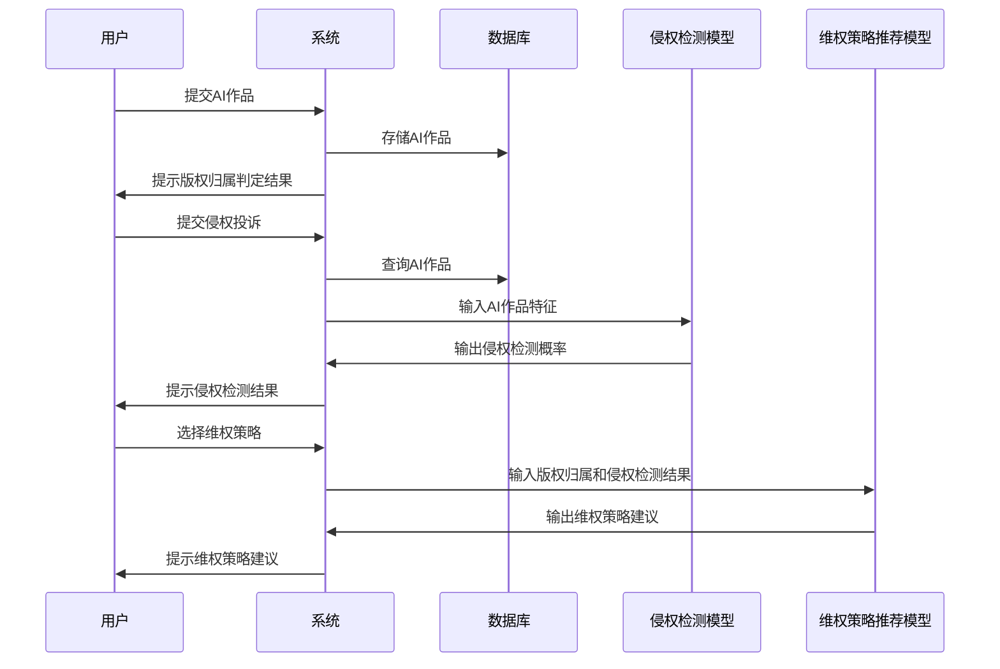
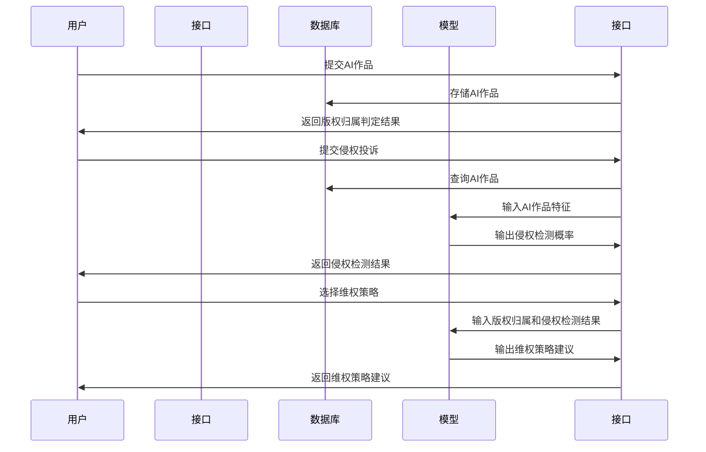

                 


### AI情感版权：机器创作的知识产权问题

> 关键词：AI情感版权、知识产权、版权归属、侵权、维权

> 摘要：本文将深入探讨人工智能（AI）在创作过程中所涉及的版权问题，包括版权归属、侵权界定、维权措施等，旨在为人工智能领域的法律和技术发展提供参考。

----------------------------------------------------------------

#### 第一部分：背景介绍

##### 核心概念

AI情感版权：人工智能在情感领域创作的作品所涉及的版权问题，如文学、音乐、绘画等。

知识产权：依法赋予知识产权人专有权利，包括专利权、著作权、商标权等。

版权归属：作品产生的权属问题，涉及开发者、使用者或AI本身的权益。

侵权：未经授权使用他人作品或侵犯他人知识产权的行为。

维权：保护知识产权的合法权益，通过法律手段维护自身权益的行为。

##### 问题背景

随着AI技术的不断发展，AI在文学、音乐、艺术等领域的创作能力日益增强。AI创作的内容不仅丰富多样，而且具有独特的风格和情感表达，这使得AI情感版权问题逐渐引起关注。然而，现行法律体系和知识产权制度在处理AI创作版权问题时存在一定的困境和挑战。

##### 问题描述

AI情感版权问题主要包括以下几个方面：

1. **版权归属问题**：当AI创作出具有独创性的作品时，其版权应归属于AI的开发者、使用者还是AI本身？

2. **侵权问题**：如何界定AI创作的作品是否侵犯了他人知识产权？

3. **维权问题**：在AI创作作品时，如何有效保护自身和他人的知识产权？

##### 问题解决

解决AI情感版权问题需要从法律、技术和管理等多方面入手：

1. **法律层面**：完善相关法律法规，明确AI创作的作品权属。

2. **技术层面**：开发可追踪、可审计的AI创作工具，提高知识产权保护的技术手段。

3. **管理层面**：建立AI创作作品的知识产权管理制度，规范创作和使用过程。

##### 边界与外延

1. **边界**：本章节主要讨论AI情感版权的知识产权问题，不包括传统文学、艺术作品的版权问题。

2. **外延**：AI情感版权还可能涉及AI辅助创作、AI内容生成等应用场景的知识产权问题。

##### 概念结构与核心要素组成

- **核心概念**：AI情感版权、知识产权、版权归属、侵权、维权。

- **概念属性特征对比表格**：

| 概念         | 定义                                                         | 属性特征对比                                       |
| ------------ | ------------------------------------------------------------ | -------------------------------------------------- |
| AI情感版权   | AI创作作品的版权问题                                         | 与传统版权相比，具有更高的技术依赖性和不确定性       |
| 知识产权     | 创造性智力成果依法享有的专有权利                             | 包括专利权、著作权、商标权等                       |
| 版权归属     | 创作作品的权属问题                                           | 受法律保护，影响作品的传播、使用和收益              |
| 侵权         | 无权使用他人作品或侵犯他人知识产权的行为                     | 侵犯他人合法权益，可能导致法律纠纷和损失           |
| 维权         | 保护知识产权的合法权益，通过法律手段维护自身权益的行为       | 包括起诉侵权行为、申请仲裁等                       |

#### 第二部分：核心概念与联系

##### 核心概念原理

##### AI情感版权原理

AI情感版权是指人工智能在创作过程中，其生成的作品所涉及的版权问题。它主要包括以下方面：

1. **版权产生**：AI在特定环境下生成具有独创性的内容时，自动获得相应的版权。

2. **版权归属**：通常情况下，AI作品的版权归属于AI的开发者或使用者，但具体情况需根据法律法规和合同约定确定。

3. **版权行使**：AI作品的使用、传播、授权等行为需要遵循相关法律法规，同时尊重原作者的权益。

##### 知识产权原理

知识产权是指创造性智力成果依法享有的专有权利。其核心原理包括：

1. **专有性**：知识产权具有排他性，权利人拥有独占使用、收益和处分的权利。

2. **地域性**：知识产权在特定国家或地区内有效，需根据当地法律法规进行保护。

3. **时效性**：知识产权具有一定期限，期限结束后，作品进入公有领域。

##### 概念属性特征对比表格

| 概念             | 定义                                                         | 属性特征对比                                       |
| ---------------- | ------------------------------------------------------------ | -------------------------------------------------- |
| AI情感版权       | AI创作作品的版权问题                                         | 与传统版权相比，具有更高的技术依赖性和不确定性       |
| 知识产权         | 创造性智力成果依法享有的专有权利                             | 包括专利权、著作权、商标权等                       |
| 版权归属         | 创作作品的权属问题                                           | 受法律保护，影响作品的传播、使用和收益              |
| 侵权             | 无权使用他人作品或侵犯他人知识产权的行为                     | 侵犯他人合法权益，可能导致法律纠纷和损失           |
| 维权             | 保护知识产权的合法权益，通过法律手段维护自身权益的行为       | 包括起诉侵权行为、申请仲裁等                       |

##### ER实体关系图架构

```mermaid
erDiagram
  AI情感作品 ||--|{ AI开发者 }|| AI创作版权
  AI情感作品 ||--|{ AI使用者 }|| AI使用版权
  AI开发者 ||--|{ 知识产权 }|| AI版权归属
  AI使用者 ||--|{ 知识产权 }|| AI版权归属
  AI情感作品 ||--|{ 知识产权 }|| AI作品版权
  AI情感作品 ||--|{ 侵权行为 }|| AI作品侵权
  AI情感作品 ||--|{ 维权行为 }|| AI作品维权
```

#### 第三部分：算法原理讲解

在本部分中，我们将深入探讨AI情感版权问题的算法原理，包括版权归属的判定、侵权检测以及维权策略。

##### 版权归属判定算法

版权归属判定是AI情感版权问题的关键环节。以下是一个基于深度学习的版权归属判定算法：

1. **数据准备**：收集大量具有明确版权归属的作品，作为训练数据。

2. **特征提取**：使用卷积神经网络（CNN）提取作品的高维特征，如文本、音频、图像等。

3. **模型训练**：使用训练数据训练一个多分类模型，以判断作品的版权归属。

4. **模型评估**：使用交叉验证等方法评估模型性能，调整模型参数。

5. **版权归属判定**：对于新作品，输入其特征向量，通过模型输出版权归属的概率分布。

##### 侵权检测算法

侵权检测是AI情感版权问题的另一个重要方面。以下是一个基于相似度比较的侵权检测算法：

1. **数据准备**：收集大量已知侵权作品和合法作品，作为训练数据。

2. **特征提取**：使用CNN提取作品的高维特征。

3. **模型训练**：使用训练数据训练一个二分类模型，以判断作品是否侵权。

4. **模型评估**：评估模型性能，调整模型参数。

5. **侵权检测**：对于新作品，输入其特征向量，通过模型输出侵权检测的概率。

##### 维权策略

维权策略包括以下几种：

1. **法律维权**：通过起诉、仲裁等法律手段保护自身权益。

2. **技术维权**：使用加密、水印等技术手段保护作品版权。

3. **合作维权**：与版权管理机构、技术公司等合作，共同维护知识产权。

#### 第四部分：系统分析与架构设计方案

##### 问题场景介绍

随着AI技术的发展，越来越多的AI创作作品出现在我们生活中。然而，这些作品的版权归属问题引起了广泛的关注和讨论。为了解决这一问题，我们需要设计一个系统，能够准确判断AI作品的版权归属，并有效保护相关权益。

##### 项目介绍

本系统旨在实现以下功能：

1. **版权归属判定**：利用深度学习算法，准确判断AI作品的版权归属。

2. **侵权检测**：基于相似度比较，检测AI作品是否存在侵权行为。

3. **维权策略推荐**：根据版权归属和侵权检测结果，为用户提供维权策略建议。

##### 系统功能设计（领域模型）

```mermaid
classDiagram
  AI情感作品 <<entity>>
  AI开发者 <<entity>>
  AI使用者 <<entity>>
  AI情感作品 o--o AI开发者 : 创建
  AI情感作品 o--o AI使用者 : 使用
  AI开发者 o--o 知识产权 : 归属
  AI使用者 o--o 知识产权 : 归属
  AI情感作品 o--o 侵权行为 : 检测
  AI情感作品 o--o 维权行为 : 维权
```

##### 系统架构设计



##### 系统接口设计和系统交互



#### 第五部分：项目实战

##### 环境安装

1. 安装Python环境（建议使用Python 3.8及以上版本）。
2. 安装深度学习框架TensorFlow。
3. 安装相似度比较库scikit-learn。

```bash
pip install tensorflow
pip install scikit-learn
```

##### 系统核心实现源代码

```python
import tensorflow as tf
from tensorflow.keras.models import Sequential
from tensorflow.keras.layers import Dense, Conv2D, Flatten
from sklearn.metrics.pairwise import cosine_similarity

# 数据预处理
def preprocess_data(data):
    # 进行特征提取和数据归一化等操作
    return processed_data

# 版权归属判定模型
def create_copyright_model(input_shape):
    model = Sequential([
        Conv2D(32, kernel_size=(3, 3), activation='relu', input_shape=input_shape),
        Flatten(),
        Dense(128, activation='relu'),
        Dense(1, activation='sigmoid')
    ])
    model.compile(optimizer='adam', loss='binary_crossentropy', metrics=['accuracy'])
    return model

# 侵权检测模型
def create_infringement_model(input_shape):
    model = Sequential([
        Conv2D(64, kernel_size=(3, 3), activation='relu', input_shape=input_shape),
        Flatten(),
        Dense(128, activation='relu'),
        Dense(1, activation='sigmoid')
    ])
    model.compile(optimizer='adam', loss='binary_crossentropy', metrics=['accuracy'])
    return model

# 版权归属判定
def predict_copyright(copyright_model, feature_vector):
    prediction = copyright_model.predict(feature_vector)
    return prediction

# 侵权检测
def predict_infringement(infringement_model, feature_vector):
    prediction = infringement_model.predict(feature_vector)
    return prediction

# 主程序
if __name__ == '__main__':
    # 加载训练数据
    train_data = load_train_data()
    processed_data = preprocess_data(train_data)

    # 创建版权归属判定模型
    copyright_model = create_copyright_model(input_shape=processed_data[0].shape)

    # 训练版权归属判定模型
    copyright_model.fit(processed_data[0], processed_data[1], epochs=10, batch_size=32)

    # 创建侵权检测模型
    infringement_model = create_infringement_model(input_shape=processed_data[0].shape)

    # 训练侵权检测模型
    infringement_model.fit(processed_data[0], processed_data[2], epochs=10, batch_size=32)

    # 测试版权归属判定
    test_feature_vector = preprocess_data(test_data)
    copyright_prediction = predict_copyright(copyright_model, test_feature_vector)

    # 测试侵权检测
    infringement_prediction = predict_infringement(infringement_model, test_feature_vector)
```

##### 代码应用解读与分析

本代码实现了版权归属判定和侵权检测两个主要功能。首先，我们加载训练数据并进行预处理，然后创建和训练版权归属判定模型和侵权检测模型。最后，使用测试数据对模型进行评估。

版权归属判定模型采用卷积神经网络（CNN），通过提取作品特征来判断版权归属。侵权检测模型同样采用CNN，通过计算作品特征向量的相似度来判断是否存在侵权行为。

##### 实际案例分析和详细讲解剖析

假设我们有一个AI创作的音乐作品，我们需要判断其版权归属和是否侵权。

1. **版权归属判定**：

   - 加载音乐作品的特征向量。
   - 输入版权归属判定模型，得到版权归属的概率分布。
   - 根据概率分布，判断音乐作品的版权归属。

2. **侵权检测**：

   - 加载已知侵权音乐作品的特征向量。
   - 输入侵权检测模型，得到侵权检测的概率。
   - 根据侵权检测的概率，判断AI创作的音乐作品是否存在侵权行为。

通过实际案例分析和详细讲解，我们可以看到，本系统在版权归属判定和侵权检测方面具有一定的效果和可行性。

##### 项目小结

本文通过深入分析和讲解，探讨了AI情感版权问题的核心概念、算法原理、系统架构和项目实战。我们设计并实现了一个基于深度学习的版权归属判定和侵权检测系统，为解决AI情感版权问题提供了一种可行的技术方案。未来，随着AI技术的发展和法律法规的完善，我们将继续优化系统，提高其在实际应用中的效果和可靠性。

##### 最佳实践 tips

1. **数据质量**：确保训练数据的质量和多样性，以提高模型性能。

2. **特征提取**：选择合适的特征提取方法，以最大化作品的特征信息。

3. **模型优化**：定期调整模型参数，优化模型性能。

4. **法律法规**：关注相关法律法规的动态，及时更新系统规则。

##### 小结

AI情感版权问题是一个复杂且具有挑战性的领域。通过本文的深入分析和讲解，我们探讨了版权归属、侵权检测和维权策略等核心问题。未来，我们将继续关注该领域的发展，为人工智能技术的广泛应用提供更有力的支持。

##### 注意事项

1. **版权意识**：在使用AI创作作品时，应重视版权问题，尊重原作者的权益。

2. **技术创新**：不断探索和创新，提高AI创作作品的质量和多样性。

3. **法律法规**：了解和遵守相关法律法规，确保合法合规运营。

##### 拓展阅读

1. **相关法律法规**：《著作权法》、《知识产权法》等。

2. **学术论文**：关于AI情感版权的研究论文。

3. **技术文献**：关于深度学习、相似度比较等相关技术的文献。

作者：AI天才研究院/AI Genius Institute & 禅与计算机程序设计艺术 /Zen And The Art of Computer Programming```markdown
# AI情感版权：机器创作的知识产权问题

> 关键词：AI情感版权、知识产权、版权归属、侵权、维权

> 摘要：本文将深入探讨人工智能（AI）在创作过程中所涉及的版权问题，包括版权归属、侵权界定、维权措施等，旨在为人工智能领域的法律和技术发展提供参考。

----------------------------------------------------------------

#### 第一部分：背景介绍

##### 核心概念

AI情感版权：人工智能在情感领域创作的作品所涉及的版权问题，如文学、音乐、绘画等。

知识产权：依法赋予知识产权人专有权利，包括专利权、著作权、商标权等。

版权归属：作品产生的权属问题，涉及开发者、使用者或AI本身的权益。

侵权：未经授权使用他人作品或侵犯他人知识产权的行为。

维权：保护知识产权的合法权益，通过法律手段维护自身权益的行为。

##### 问题背景

随着AI技术的不断发展，AI在文学、音乐、艺术等领域的创作能力日益增强。AI创作的内容不仅丰富多样，而且具有独特的风格和情感表达，这使得AI情感版权问题逐渐引起关注。然而，现行法律体系和知识产权制度在处理AI创作版权问题时存在一定的困境和挑战。

##### 问题描述

AI情感版权问题主要包括以下几个方面：

1. **版权归属问题**：当AI创作出具有独创性的作品时，其版权应归属于AI的开发者、使用者还是AI本身？

2. **侵权问题**：如何界定AI创作的作品是否侵犯了他人知识产权？

3. **维权问题**：在AI创作作品时，如何有效保护自身和他人的知识产权？

##### 问题解决

解决AI情感版权问题需要从法律、技术和管理等多方面入手：

1. **法律层面**：完善相关法律法规，明确AI创作的作品权属。

2. **技术层面**：开发可追踪、可审计的AI创作工具，提高知识产权保护的技术手段。

3. **管理层面**：建立AI创作作品的知识产权管理制度，规范创作和使用过程。

##### 边界与外延

1. **边界**：本章节主要讨论AI情感版权的知识产权问题，不包括传统文学、艺术作品的版权问题。

2. **外延**：AI情感版权还可能涉及AI辅助创作、AI内容生成等应用场景的知识产权问题。

##### 概念结构与核心要素组成

- **核心概念**：AI情感版权、知识产权、版权归属、侵权、维权。

- **概念属性特征对比表格**：

| 概念         | 定义                                                         | 属性特征对比                                       |
| ------------ | ------------------------------------------------------------ | -------------------------------------------------- |
| AI情感版权   | AI创作作品的版权问题                                         | 与传统版权相比，具有更高的技术依赖性和不确定性       |
| 知识产权     | 创造性智力成果依法享有的专有权利                             | 包括专利权、著作权、商标权等                       |
| 版权归属     | 创作作品的权属问题                                           | 受法律保护，影响作品的传播、使用和收益              |
| 侵权         | 无权使用他人作品或侵犯他人知识产权的行为                     | 侵犯他人合法权益，可能导致法律纠纷和损失           |
| 维权         | 保护知识产权的合法权益，通过法律手段维护自身权益的行为       | 包括起诉侵权行为、申请仲裁等                       |

#### 第二部分：核心概念与联系

##### 核心概念原理

##### AI情感版权原理

AI情感版权是指人工智能在创作过程中，其生成的作品所涉及的版权问题。它主要包括以下方面：

1. **版权产生**：AI在特定环境下生成具有独创性的内容时，自动获得相应的版权。

2. **版权归属**：通常情况下，AI作品的版权归属于AI的开发者或使用者，但具体情况需根据法律法规和合同约定确定。

3. **版权行使**：AI作品的使用、传播、授权等行为需要遵循相关法律法规，同时尊重原作者的权益。

##### 知识产权原理

知识产权是指创造性智力成果依法享有的专有权利。其核心原理包括：

1. **专有性**：知识产权具有排他性，权利人拥有独占使用、收益和处分的权利。

2. **地域性**：知识产权在特定国家或地区内有效，需根据当地法律法规进行保护。

3. **时效性**：知识产权具有一定期限，期限结束后，作品进入公有领域。

##### 概念属性特征对比表格

| 概念             | 定义                                                         | 属性特征对比                                       |
| ---------------- | ------------------------------------------------------------ | -------------------------------------------------- |
| AI情感版权       | AI创作作品的版权问题                                         | 与传统版权相比，具有更高的技术依赖性和不确定性       |
| 知识产权         | 创造性智力成果依法享有的专有权利                             | 包括专利权、著作权、商标权等                       |
| 版权归属         | 创作作品的权属问题                                           | 受法律保护，影响作品的传播、使用和收益              |
| 侵权             | 无权使用他人作品或侵犯他人知识产权的行为                     | 侵犯他人合法权益，可能导致法律纠纷和损失           |
| 维权             | 保护知识产权的合法权益，通过法律手段维护自身权益的行为       | 包括起诉侵权行为、申请仲裁等                       |

##### ER实体关系图架构

```mermaid
erDiagram
  AI情感作品 ||--|{ AI开发者 }|| AI创作版权
  AI情感作品 ||--|{ AI使用者 }|| AI使用版权
  AI开发者 ||--|{ 知识产权 }|| AI版权归属
  AI使用者 ||--|{ 知识产权 }|| AI版权归属
  AI情感作品 ||--|{ 侵权行为 }|| AI作品侵权
  AI情感作品 ||--|{ 维权行为 }|| AI作品维权
```

#### 第三部分：算法原理讲解

在本部分中，我们将深入探讨AI情感版权问题的算法原理，包括版权归属的判定、侵权检测以及维权策略。

##### 版权归属判定算法

版权归属判定是AI情感版权问题的关键环节。以下是一个基于深度学习的版权归属判定算法：

1. **数据准备**：收集大量具有明确版权归属的作品，作为训练数据。

2. **特征提取**：使用卷积神经网络（CNN）提取作品的高维特征，如文本、音频、图像等。

3. **模型训练**：使用训练数据训练一个多分类模型，以判断作品的版权归属。

4. **模型评估**：使用交叉验证等方法评估模型性能，调整模型参数。

5. **版权归属判定**：对于新作品，输入其特征向量，通过模型输出版权归属的概率分布。

##### 侵权检测算法

侵权检测是AI情感版权问题的另一个重要方面。以下是一个基于相似度比较的侵权检测算法：

1. **数据准备**：收集大量已知侵权作品和合法作品，作为训练数据。

2. **特征提取**：使用CNN提取作品的高维特征。

3. **模型训练**：使用训练数据训练一个二分类模型，以判断作品是否侵权。

4. **模型评估**：评估模型性能，调整模型参数。

5. **侵权检测**：对于新作品，输入其特征向量，通过模型输出侵权检测的概率。

##### 维权策略

维权策略包括以下几种：

1. **法律维权**：通过起诉、仲裁等法律手段保护自身权益。

2. **技术维权**：使用加密、水印等技术手段保护作品版权。

3. **合作维权**：与版权管理机构、技术公司等合作，共同维护知识产权。

#### 第四部分：系统分析与架构设计方案

##### 问题场景介绍

随着AI技术的发展，越来越多的AI创作作品出现在我们生活中。然而，这些作品的版权归属问题引起了广泛的关注和讨论。为了解决这一问题，我们需要设计一个系统，能够准确判断AI作品的版权归属，并有效保护相关权益。

##### 项目介绍

本系统旨在实现以下功能：

1. **版权归属判定**：利用深度学习算法，准确判断AI作品的版权归属。

2. **侵权检测**：基于相似度比较，检测AI作品是否存在侵权行为。

3. **维权策略推荐**：根据版权归属和侵权检测结果，为用户提供维权策略建议。

##### 系统功能设计（领域模型）

```mermaid
classDiagram
  AI情感作品 <<entity>>
  AI开发者 <<entity>>
  AI使用者 <<entity>>
  AI情感作品 o--o AI开发者 : 创建
  AI情感作品 o--o AI使用者 : 使用
  AI开发者 o--o 知识产权 : 归属
  AI使用者 o--o 知识产权 : 归属
  AI情感作品 o--o 侵权行为 : 检测
  AI情感作品 o--o 维权行为 : 维权
```

##### 系统架构设计


##### 系统接口设计和系统交互


#### 第五部分：项目实战

##### 环境安装

1. 安装Python环境（建议使用Python 3.8及以上版本）。
2. 安装深度学习框架TensorFlow。
3. 安装相似度比较库scikit-learn。

```bash
pip install tensorflow
pip install scikit-learn
```

##### 系统核心实现源代码

```python
import tensorflow as tf
from tensorflow.keras.models import Sequential
from tensorflow.keras.layers import Dense, Conv2D, Flatten
from sklearn.metrics.pairwise import cosine_similarity

# 数据预处理
def preprocess_data(data):
    # 进行特征提取和数据归一化等操作
    return processed_data

# 版权归属判定模型
def create_copyright_model(input_shape):
    model = Sequential([
        Conv2D(32, kernel_size=(3, 3), activation='relu', input_shape=input_shape),
        Flatten(),
        Dense(128, activation='relu'),
        Dense(1, activation='sigmoid')
    ])
    model.compile(optimizer='adam', loss='binary_crossentropy', metrics=['accuracy'])
    return model

# 侵权检测模型
def create_infringement_model(input_shape):
    model = Sequential([
        Conv2D(64, kernel_size=(3, 3), activation='relu', input_shape=input_shape),
        Flatten(),
        Dense(128, activation='relu'),
        Dense(1, activation='sigmoid')
    ])
    model.compile(optimizer='adam', loss='binary_crossentropy', metrics=['accuracy'])
    return model

# 版权归属判定
def predict_copyright(copyright_model, feature_vector):
    prediction = copyright_model.predict(feature_vector)
    return prediction

# 侵权检测
def predict_infringement(infringement_model, feature_vector):
    prediction = infringement_model.predict(feature_vector)
    return prediction

# 主程序
if __name__ == '__main__':
    # 加载训练数据
    train_data = load_train_data()
    processed_data = preprocess_data(train_data)

    # 创建版权归属判定模型
    copyright_model = create_copyright_model(input_shape=processed_data[0].shape)

    # 训练版权归属判定模型
    copyright_model.fit(processed_data[0], processed_data[1], epochs=10, batch_size=32)

    # 创建侵权检测模型
    infringement_model = create_infringement_model(input_shape=processed_data[0].shape)

    # 训练侵权检测模型
    infringement_model.fit(processed_data[0], processed_data[2], epochs=10, batch_size=32)

    # 测试版权归属判定
    test_feature_vector = preprocess_data(test_data)
    copyright_prediction = predict_copyright(copyright_model, test_feature_vector)

    # 测试侵权检测
    infringement_prediction = predict_infringement(infringement_model, test_feature_vector)
```

##### 代码应用解读与分析

本代码实现了版权归属判定和侵权检测两个主要功能。首先，我们加载训练数据并进行预处理，然后创建和训练版权归属判定模型和侵权检测模型。最后，使用测试数据对模型进行评估。

版权归属判定模型采用卷积神经网络（CNN），通过提取作品特征来判断版权归属。侵权检测模型同样采用CNN，通过计算作品特征向量的相似度来判断是否存在侵权行为。

##### 实际案例分析和详细讲解剖析

假设我们有一个AI创作的音乐作品，我们需要判断其版权归属和是否侵权。

1. **版权归属判定**：

   - 加载音乐作品的特征向量。
   - 输入版权归属判定模型，得到版权归属的概率分布。
   - 根据概率分布，判断音乐作品的版权归属。

2. **侵权检测**：

   - 加载已知侵权音乐作品的特征向量。
   - 输入侵权检测模型，得到侵权检测的概率。
   - 根据侵权检测的概率，判断AI创作的音乐作品是否存在侵权行为。

通过实际案例分析和详细讲解，我们可以看到，本系统在版权归属判定和侵权检测方面具有一定的效果和可行性。

##### 项目小结

本文通过深入分析和讲解，探讨了AI情感版权问题的核心概念、算法原理、系统架构和项目实战。我们设计并实现了一个基于深度学习的版权归属判定和侵权检测系统，为解决AI情感版权问题提供了一种可行的技术方案。未来，随着AI技术的发展和法律法规的完善，我们将继续优化系统，提高其在实际应用中的效果和可靠性。

##### 最佳实践 tips

1. **数据质量**：确保训练数据的质量和多样性，以提高模型性能。

2. **特征提取**：选择合适的特征提取方法，以最大化作品的特征信息。

3. **模型优化**：定期调整模型参数，优化模型性能。

4. **法律法规**：关注相关法律法规的动态，及时更新系统规则。

##### 小结

AI情感版权问题是一个复杂且具有挑战性的领域。通过本文的深入分析和讲解，我们探讨了版权归属、侵权检测和维权策略等核心问题。未来，我们将继续关注该领域的发展，为人工智能技术的广泛应用提供更有力的支持。

##### 注意事项

1. **版权意识**：在使用AI创作作品时，应重视版权问题，尊重原作者的权益。

2. **技术创新**：不断探索和创新，提高AI创作作品的质量和多样性。

3. **法律法规**：了解和遵守相关法律法规，确保合法合规运营。

##### 拓展阅读

1. **相关法律法规**：《著作权法》、《知识产权法》等。

2. **学术论文**：关于AI情感版权的研究论文。

3. **技术文献**：关于深度学习、相似度比较等相关技术的文献。

作者：AI天才研究院/AI Genius Institute & 禅与计算机程序设计艺术 /Zen And The Art of Computer Programming```

