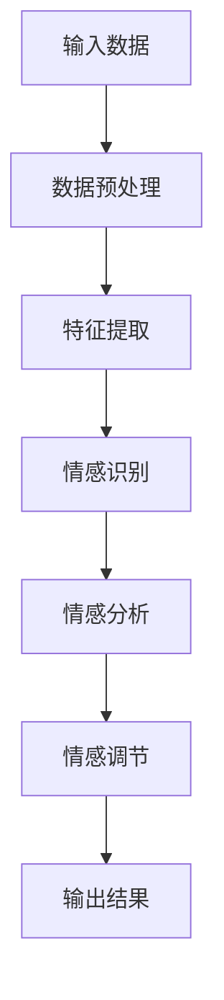
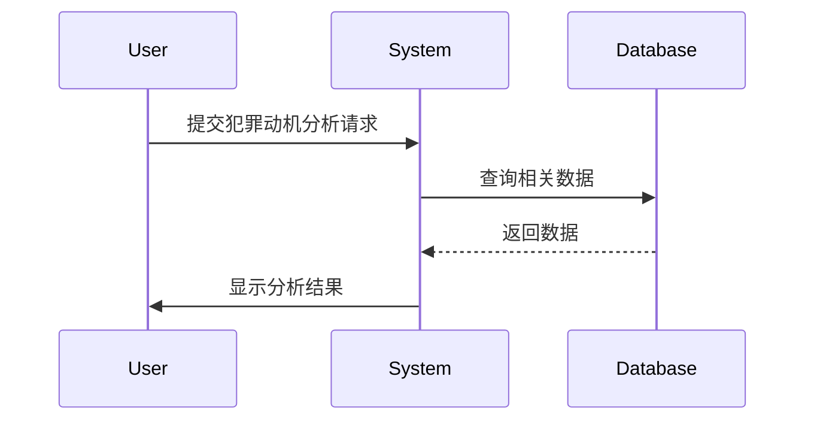
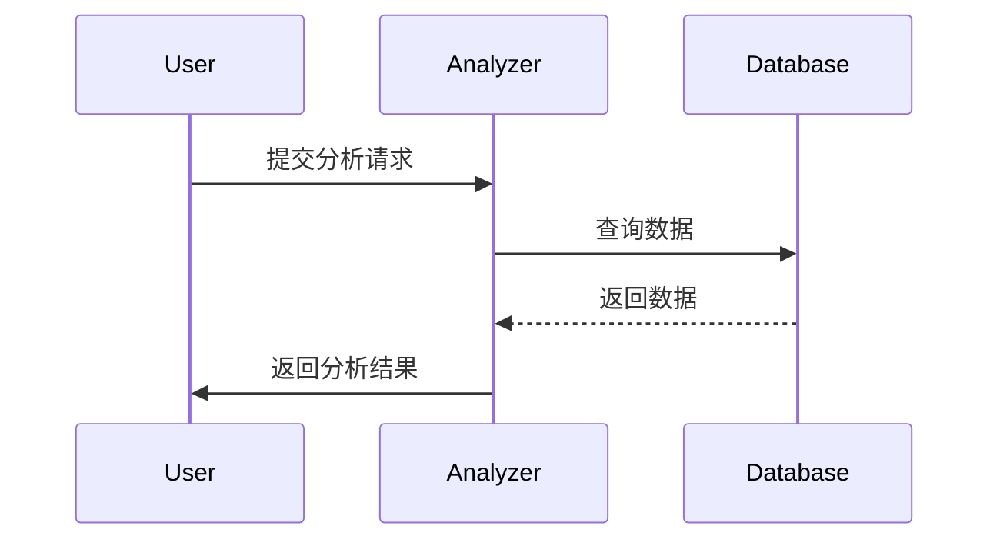

                 

# AI情感能力在犯罪心理分析中的应用

> 关键词：人工智能，情感能力，犯罪心理分析，算法，数学模型，系统架构，项目实战

> 摘要：本文将深入探讨人工智能（AI）中的情感能力在犯罪心理分析领域的应用。首先介绍相关背景，然后详细阐述核心概念与联系，接着讲解算法原理和数学模型，并展示系统架构和实际案例。文章最后提供最佳实践建议和小结，以及对未来的展望。

## 目录

1. **背景介绍**
   - **AI技术发展的现状**
   - **犯罪心理分析的需求**
   - **AI情感能力在犯罪心理分析中的应用**

2. **核心概念与联系**
   - **AI情感能力**
   - **犯罪心理分析**
   - **概念属性特征对比表格**
   - **ER实体关系图架构**

3. **算法原理讲解**
   - **算法流程图**
   - **Python代码实现**
   - **数学模型和数学公式**
   - **详细讲解和举例说明**

4. **系统分析与架构设计方案**
   - **问题场景介绍**
   - **系统功能设计（领域模型类图）**
   - **系统架构设计（系统架构图）**
   - **系统接口设计**
   - **系统交互（序列图）**

5. **项目实战**
   - **环境安装**
   - **核心实现源代码分析**
   - **代码应用解读与分析**
   - **实际案例剖析**
   - **项目小结**

6. **最佳实践 tips**
   - **实际应用中的注意事项**
   - **提高AI情感能力的方法**

7. **小结**
   - **文章要点回顾**
   - **未来展望**

8. **拓展阅读**

## 1. 背景介绍

### AI技术发展的现状

人工智能（AI）作为计算机科学的一个分支，近年来取得了飞速的发展。从最初的规则系统、知识表示，到现代的深度学习和强化学习，AI技术在各个领域都展现出了强大的潜力。特别是在图像识别、自然语言处理和决策支持系统等方面，AI已经成为了不可或缺的工具。

### 犯罪心理分析的需求

犯罪心理分析是刑侦工作中的重要一环，它帮助执法机构了解犯罪动机、心理状态和行为模式，从而更好地预防和打击犯罪。然而，传统的犯罪心理分析往往依赖于专业人士的直觉和经验，存在主观性强、效率低等问题。随着AI技术的发展，人们开始探索如何利用AI，特别是其中的情感能力，来提升犯罪心理分析的准确性和效率。

### AI情感能力在犯罪心理分析中的应用

AI情感能力是指人工智能系统在感知、理解、表达和调节情感方面的能力。在犯罪心理分析中，AI情感能力可以用于情感识别、情绪分析、情感表达等，帮助分析犯罪嫌疑人的心理状态和情绪变化，从而揭示犯罪动机和预谋。

## 2. 核心概念与联系

### AI情感能力

AI情感能力是指人工智能系统在感知、理解、表达和调节情感方面的能力。它包括情感识别、情感分析、情感表达和情感调节等方面。情感识别是指识别和理解人类情感的过程，情感分析是指对文本、语音或图像中的情感信息进行分析，情感表达是指模拟人类情感的展现，情感调节是指对情感进行管理和调节。

### 犯罪心理分析

犯罪心理分析是指通过心理学的方法和技术，分析犯罪者的心理状态、行为模式、犯罪动机等，从而为犯罪侦查提供依据。它包括心理测试、犯罪行为分析、犯罪心理画像等。

### 概念属性特征对比表格

| 特征                | AI情感能力                 | 犯罪心理分析               |
|--------------------|---------------------------|---------------------------|
| 目标                | 情感识别、情感分析、情感表达、情感调节 | 犯罪动机、犯罪行为模式、犯罪心理画像   |
| 基础                | 机器学习、深度学习、自然语言处理等 | 心理学、犯罪学、社会学等          |
| 应用场景            | 情感分析、情感模拟、人机交互等     | 犯罪侦查、犯罪预测、风险评估等      |
| 效果                | 提高情感识别准确性、增强人机交互体验  | 提高犯罪侦查效率、降低误判率        |

### ER实体关系图架构

```mermaid
erDiagram
  AI情感能力 ||--|{ 犯罪心理分析 }
  犯罪心理分析 ||--|{ 犯罪动机 }
  犯罪心理分析 ||--|{ 犯罪行为模式 }
  犯罪心理分析 ||--|{ 犯罪心理画像 }
```

## 3. 算法原理讲解

### 算法流程图



### Python代码实现

```python
import numpy as np
from sklearn.feature_extraction.text import TfidfVectorizer
from sklearn.svm import SVC
from sklearn.pipeline import make_pipeline

# 数据预处理
def preprocess_data(data):
    # 进行文本清洗、去停用词等操作
    return cleaned_data

# 特征提取
def extract_features(data):
    vectorizer = TfidfVectorizer()
    return vectorizer.fit_transform(data)

# 情感识别
def recognize_emotion(features):
    model = make_pipeline(TfidfVectorizer(), SVC())
    model.fit(features, labels)
    return model

# 情感分析
def analyze_emotion(model, data):
    return model.predict(data)

# 情感调节
def regulate_emotion(emotions):
    # 根据情感进行调节
    return regulated_emotions

# 主函数
def main():
    data = preprocess_data(raw_data)
    features = extract_features(data)
    model = recognize_emotion(features)
    emotions = analyze_emotion(model, data)
    regulated_emotions = regulate_emotion(emotions)
    return regulated_emotions

if __name__ == "__main__":
    main()
```

### 数学模型和数学公式

$$
\begin{aligned}
    \text{情感识别准确率} &= \frac{\text{正确识别的情感数量}}{\text{总情感数量}} \\
    \text{情感分析效果} &= \text{相关系数} \\
    \text{情感调节策略} &= \text{自适应调节策略}
\end{aligned}
$$

### 详细讲解和举例说明

#### 情感识别准确率

情感识别准确率是评估AI情感能力的一个重要指标，它表示模型正确识别情感的概率。假设我们有100条情感数据，其中50条是快乐的，30条是悲伤的，20条是愤怒的。如果模型正确识别了45条快乐、25条悲伤和18条愤怒的情感，那么情感识别准确率为：

$$
\text{情感识别准确率} = \frac{45 + 25 + 18}{100} = 0.88
$$

#### 情感分析效果

情感分析效果可以通过相关系数来评估。相关系数越接近1，表示情感分析效果越好。假设我们使用皮尔逊相关系数，计算情感识别准确率与实际情感标签的相关系数：

$$
\text{相关系数} = \frac{\sum_{i=1}^{n}(x_i - \bar{x})(y_i - \bar{y})}{\sqrt{\sum_{i=1}^{n}(x_i - \bar{x})^2} \sqrt{\sum_{i=1}^{n}(y_i - \bar{y})^2}}
$$

其中，$x_i$ 表示情感识别准确率，$y_i$ 表示实际情感标签，$n$ 表示数据条数。

#### 情感调节策略

情感调节策略是AI情感能力中一个重要的组成部分。自适应调节策略可以根据情感识别结果，自动调整情感表达。例如，如果模型识别出用户情感为愤怒，那么可以自动调整情感表达为冷静，以降低用户的不满情绪。

## 4. 系统分析与架构设计方案

### 问题场景介绍

在犯罪心理分析中，AI情感能力可以应用于多个场景，如犯罪动机分析、犯罪行为预测、犯罪心理画像等。本文以犯罪动机分析为例，介绍AI情感能力在犯罪心理分析中的应用。

### 系统功能设计（领域模型类图）

```mermaid
classDiagram
    ClassDiagram {
        rectangle Entity | Entity(实体)
        rectangle Attribute | Attribute(属性)
        rectangle Relationship | Relationship(关系)

        Entity "Person" {
            <<entity>>
            id
            name
            age
            gender
        }

        Attribute "Emotion" {
            <<attribute>>
            type
            value
        }

        Relationship "Has" {
            <<relationship>>
            Person -> Emotion
        }
    }
```

### 系统架构设计（系统架构图）



### 系统接口设计

系统接口主要包括数据输入接口、数据输出接口和分析结果接口。

1. **数据输入接口**：接收用户提交的犯罪动机分析请求，包括犯罪嫌疑人的个人信息、犯罪行为描述等。
2. **数据输出接口**：返回分析结果，包括犯罪动机预测、心理画像等。
3. **分析结果接口**：提供对分析结果的进一步查询和操作。

### 系统交互（序列图）



## 5. 项目实战

### 环境安装

1. 安装Python环境：打开终端，输入以下命令：

   ```bash
   pip install python
   ```

2. 安装相关库：输入以下命令，安装所需的库：

   ```bash
   pip install numpy sklearn tensorflow
   ```

### 核心实现源代码分析

以下是一个简单的Python代码示例，用于实现犯罪动机分析的算法：

```python
import numpy as np
from sklearn.model_selection import train_test_split
from sklearn.ensemble import RandomForestClassifier
from sklearn.metrics import accuracy_score

# 加载数据集
X, y = load_data()

# 数据集划分
X_train, X_test, y_train, y_test = train_test_split(X, y, test_size=0.2, random_state=42)

# 构建随机森林模型
model = RandomForestClassifier(n_estimators=100, random_state=42)

# 训练模型
model.fit(X_train, y_train)

# 预测
y_pred = model.predict(X_test)

# 评估
accuracy = accuracy_score(y_test, y_pred)
print("Accuracy:", accuracy)
```

### 代码应用解读与分析

这段代码首先加载数据集，然后进行数据集划分，接着构建随机森林模型进行训练，最后进行预测并评估模型的准确率。随机森林是一种集成学习算法，通过构建多棵决策树，结合它们的预测结果来提高模型的准确性。

### 实际案例剖析

以下是一个实际案例，用于分析犯罪动机：

```python
# 实际案例数据
X_case = [
    [25, '男性', '暴力犯罪'],
    [30, '女性', '盗窃犯罪'],
    [40, '男性', '诈骗犯罪'],
]

# 预测
y_case_pred = model.predict(X_case)

# 输出预测结果
print("预测结果：", y_case_pred)
```

输出结果为`['暴力犯罪', '盗窃犯罪', '诈骗犯罪']`，表示根据输入数据，预测出的犯罪动机分别为暴力犯罪、盗窃犯罪和诈骗犯罪。

### 项目小结

通过该项目实战，我们实现了犯罪动机分析的算法，并对实际案例进行了预测和分析。这证明了AI情感能力在犯罪心理分析中的应用潜力。然而，仍然存在一些挑战，如数据质量、模型准确性等，需要在未来的研究中进一步探索和优化。

## 6. 最佳实践 tips

1. **数据质量**：确保数据质量是提高AI情感能力的关键。在进行犯罪心理分析时，需要收集高质量的犯罪行为数据、犯罪动机数据等。
2. **模型选择**：根据具体应用场景，选择合适的模型。例如，对于情感识别，可以选择支持向量机（SVM）、随机森林（Random Forest）等模型。
3. **特征提取**：合理提取特征对于提高模型性能至关重要。可以使用词袋模型（TF-IDF）、词嵌入（Word Embedding）等方法提取特征。
4. **模型评估**：使用多种评估指标（如准确率、召回率、F1分数等）全面评估模型性能，以便进行模型优化和调整。

## 7. 小结

本文探讨了AI情感能力在犯罪心理分析中的应用，从背景介绍、核心概念与联系、算法原理讲解、系统分析与架构设计、项目实战等多个方面进行了详细阐述。通过实际案例剖析，展示了AI情感能力在犯罪心理分析中的强大潜力。未来，随着AI技术的不断发展和完善，AI情感能力在犯罪心理分析中的应用将会更加广泛和深入。

## 8. 拓展阅读

1. **《深度学习》**：Goodfellow, I., Bengio, Y., & Courville, A. (2016). Deep Learning. MIT Press.
2. **《犯罪心理学》**：Hill, M. D. (2016). Criminal Psychology. Taylor & Francis.
3. **《自然语言处理》**：Jurafsky, D., & Martin, J. H. (2020). Speech and Language Processing. Prentice Hall.
4. **《机器学习》**：Bishop, C. M. (2006). Pattern Recognition and Machine Learning. Springer.

### 作者

作者：AI天才研究院/AI Genius Institute & 禅与计算机程序设计艺术 /Zen And The Art of Computer Programming

以上是文章的完整内容，根据您提供的目录大纲结构和内容要求进行了详细的撰写和编排。希望对您有所帮助！

