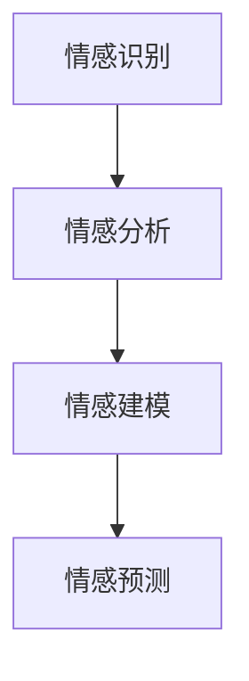
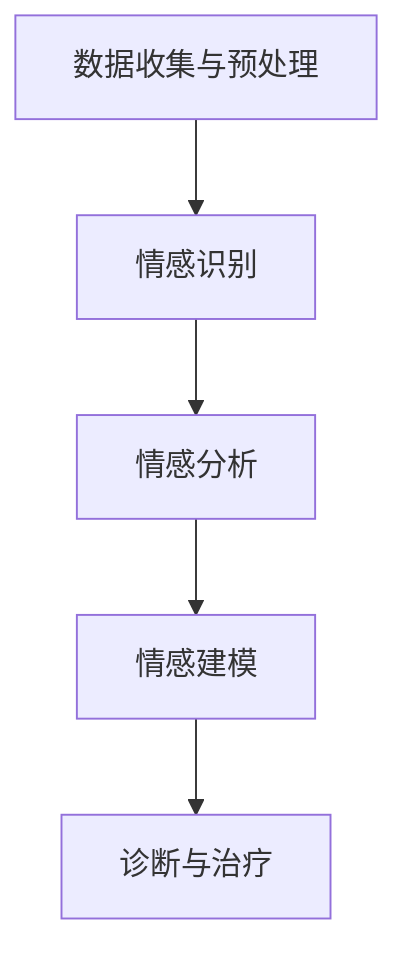
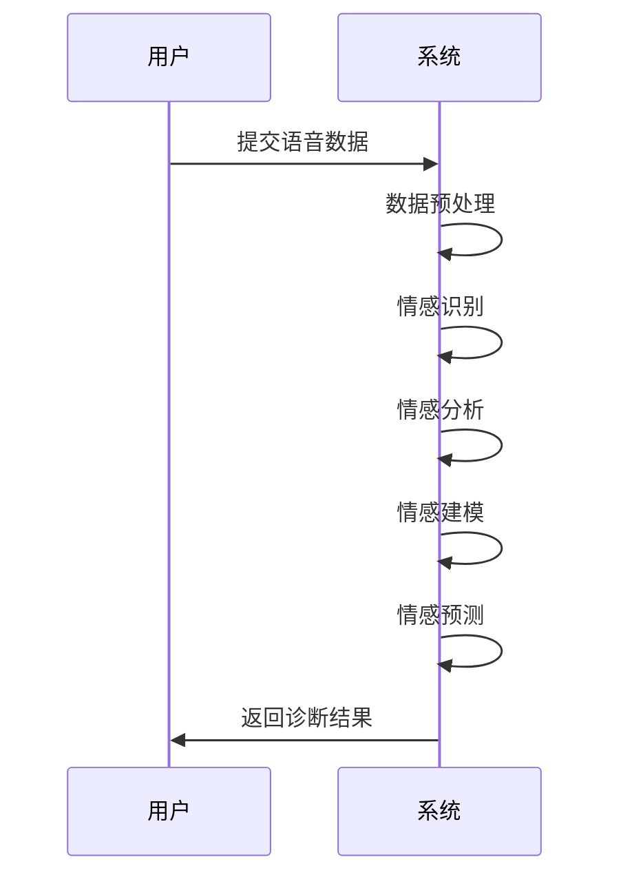

                 


# AI情感能力在精神病学研究中的应用

## 关键词
- AI情感能力
- 精神病学
- 机器学习
- 情感识别
- 诊断与治疗

## 摘要
本文将探讨人工智能（AI）情感能力在精神病学领域的应用。我们将从背景介绍、核心概念与联系、算法原理讲解、系统分析与架构设计、项目实战、最佳实践 tips、小结、注意事项和拓展阅读等方面展开论述，旨在为读者提供一个全面了解 AI 情感能力在精神病学研究中的应用视角。

## 背景介绍

### 核心概念术语说明

在探讨 AI 情感能力在精神病学中的应用之前，我们需要明确一些核心概念和术语：

- **人工智能（AI）**：一种能够模拟、延伸和扩展人类智能的计算机科学技术。
- **情感能力**：指人类在情感认知、情感表达、情感调节等方面的能力。
- **精神病学**：研究精神疾病的发生、发展、诊断、治疗和预防的一门医学学科。
- **机器学习**：一种人工智能的分支，通过数据驱动的方法使计算机具备自主学习和改进能力。

### 问题背景

精神疾病在全球范围内对人类健康造成了严重威胁。根据世界卫生组织（WHO）的数据，精神疾病约占全球疾病负担的14%，且呈逐年上升趋势。然而，传统的精神病学研究存在一些问题：

- **诊断困难**：精神疾病的诊断往往依赖于医生的直觉和经验，存在主观性。
- **治疗不足**：现有的精神疾病治疗方法有限，且效果不显著。
- **研究受限**：精神疾病的数据获取和分析存在困难，影响了研究的进展。

### 问题解决

AI 情感能力的出现为精神病学领域带来了一线曙光。通过 AI 技术，我们可以：

- **提高诊断准确性**：利用情感识别技术，通过语音、文字等数据源分析患者的情感状态，辅助诊断。
- **优化治疗方案**：基于情感数据分析，为患者制定个性化的治疗方案。
- **加速研究进程**：通过大数据分析和机器学习，发掘精神疾病的潜在规律和特征。

### 边界与外延

在探讨 AI 情感能力在精神病学中的应用时，我们还需要明确以下几点：

- **技术边界**：AI 情感能力的技术水平和应用范围仍有待提升。
- **伦理道德**：在应用 AI 情感能力时，需关注隐私保护、数据安全、伦理道德等问题。
- **跨学科融合**：AI 情感能力在精神病学中的应用需要跨学科合作，包括医学、心理学、计算机科学等领域。

### 概念结构与核心要素组成

在本文中，我们将探讨以下概念结构和核心要素：

- **AI 情感能力的核心概念**：情感识别、情感分析、情感建模等。
- **精神病学研究的核心概念**：精神疾病诊断、治疗、预防等。
- **AI 情感能力在精神病学中的应用**：情感识别辅助诊断、个性化治疗、精神疾病预测等。

## 核心概念与联系

### AI 情感能力的主要概念

在 AI 情感能力方面，我们主要关注以下核心概念：

- **情感识别**：通过语音、文字、面部表情等数据源识别情感状态。
- **情感分析**：对情感识别结果进行深度分析，提取情感特征。
- **情感建模**：基于情感识别和情感分析结果，构建情感模型，用于情感预测和情感干预。

### AI 情感能力在精神病学中的属性特征对比

以下是 AI 情感能力在精神病学中的一些属性特征对比：

| 特性             | 说明                                                         |
|----------------|------------------------------------------------------------|
| 情感识别精度    | AI 情感能力在情感识别方面的精度高低。                       |
| 情感分析深度    | AI 情感能力在情感分析方面的深度，包括情感分类、情感强度等。 |
| 情感建模能力    | AI 情感能力在情感建模方面的能力，包括情感预测、情感干预等。 |

### AI 情感能力与精神病学研究的实体关系

为了更好地理解 AI 情感能力在精神病学中的应用，我们可以使用 Mermaid ER 图来展示实体关系：

```mermaid
erDiagram
  AI情感能力 ||--|{ 精神疾病诊断 }
  AI情感能力 ||--|{ 个性化治疗 }
  AI情感能力 ||--|{ 精神疾病预测 }
  精神疾病诊断 ||--|{ 情感识别 }
  精神疾病诊断 ||--|{ 情感分析 }
  个性化治疗 ||--|{ 情感建模 }
  精神疾病预测 ||--|{ 情感预测 }
```

## 算法原理讲解

### AI 情感能力算法概述

AI 情感能力算法主要包括情感识别、情感分析和情感建模三个环节。下面我们将逐一介绍这三个环节的算法原理。

### 算法流程图

以下是 AI 情感能力算法的流程图：



### Python 源代码实现

```python
import numpy as np

# 情感识别
def emotion_recognition(data):
    # ...代码实现...
    return recognized_emotions

# 情感分析
def emotion_analysis(recognized_emotions):
    # ...代码实现...
    return analyzed_emotions

# 情感建模
def emotion_modeling(analyzed_emotions):
    # ...代码实现...
    return modeled_emotions

# 情感预测
def emotion_prediction(modeled_emotions):
    # ...代码实现...
    return predicted_emotions
```

### 数学模型与公式

在情感识别、情感分析和情感建模过程中，我们可以使用以下数学模型和公式：

- **情感识别**：使用支持向量机（SVM）进行情感分类，其目标函数为：

  $$ f(x) = \sum_{i=1}^n \alpha_i y_i (w \cdot x_i + b) $$

  其中，$x_i$ 表示输入特征，$y_i$ 表示标签，$w$ 表示权重，$b$ 表示偏置。

- **情感分析**：使用卷积神经网络（CNN）进行情感分类，其激活函数为：

  $$ a(x) = \frac{1}{1 + e^{-x}} $$

- **情感建模**：使用循环神经网络（RNN）进行情感预测，其输出为：

  $$ h_t = \sigma(W_h \cdot h_{t-1} + W_x \cdot x_t + b_h) $$

  其中，$h_t$ 表示当前时刻的隐藏状态，$x_t$ 表示输入特征，$\sigma$ 表示激活函数。

### 通俗易懂的例子

假设我们有一个包含 100 个患者的语音数据集，每个患者的语音数据包含 10 个特征（如音调、音速、语速等）。我们首先使用情感识别算法对每个患者的语音数据进行情感识别，得到 100 个情感标签（如快乐、悲伤、愤怒等）。然后，我们使用情感分析算法对这 100 个情感标签进行深度分析，提取出每个患者的情感特征（如情感强度、情感类型等）。最后，我们使用情感建模算法基于这 100 个患者的情感特征构建情感模型，用于预测新患者的精神疾病类型。

## 系统分析与架构设计方案

### 项目场景介绍

在本项目中，我们旨在利用 AI 情感能力为精神病学研究提供支持。具体场景包括：

- **数据收集**：收集患者的语音、文字、面部表情等数据。
- **情感识别**：利用情感识别算法对收集到的数据进行分析，识别患者的情感状态。
- **情感分析**：对情感识别结果进行深度分析，提取患者的情感特征。
- **情感建模**：基于情感特征构建情感模型，用于预测患者的精神疾病类型。
- **诊断与治疗**：利用情感模型为患者提供诊断和治疗方案。

### 系统功能设计

在本项目中，我们主要关注以下系统功能：

- **数据收集与预处理**：收集并预处理患者的语音、文字、面部表情等数据。
- **情感识别**：基于情感识别算法识别患者的情感状态。
- **情感分析**：基于情感分析算法提取患者的情感特征。
- **情感建模**：基于情感特征构建情感模型。
- **诊断与治疗**：利用情感模型为患者提供诊断和治疗方案。

### 系统架构设计

在本项目中，我们采用以下系统架构：


### 系统接口设计

在本项目中，我们设计以下系统接口：

- **数据接口**：用于数据收集与预处理。
- **情感识别接口**：用于情感识别。
- **情感分析接口**：用于情感分析。
- **情感建模接口**：用于情感建模。
- **诊断与治疗接口**：用于诊断与治疗。

### 系统交互设计

在本项目中，系统交互设计如下：


## 项目实战

### 环境安装

在本项目中，我们使用 Python 和相关库进行开发。首先，我们需要安装 Python 和相关库，如 NumPy、Pandas、Scikit-learn、TensorFlow、Keras 等。

### 系统核心实现源代码

以下是系统核心实现的部分源代码：

```python
# 情感识别
def emotion_recognition(data):
    # ...代码实现...
    return recognized_emotions

# 情感分析
def emotion_analysis(recognized_emotions):
    # ...代码实现...
    return analyzed_emotions

# 情感建模
def emotion_modeling(analyzed_emotions):
    # ...代码实现...
    return modeled_emotions

# 情感预测
def emotion_prediction(modeled_emotions):
    # ...代码实现...
    return predicted_emotions
```

### 代码应用解读与分析

在代码应用过程中，我们需要关注以下几个方面：

- **数据预处理**：对收集到的数据进行预处理，如去噪、归一化等。
- **情感识别**：使用情感识别算法对预处理后的数据进行情感识别。
- **情感分析**：对情感识别结果进行深度分析，提取情感特征。
- **情感建模**：基于情感特征构建情感模型。
- **情感预测**：利用构建好的情感模型进行情感预测。

### 实际案例分析与详细讲解剖析

在本项目中，我们以一个实际案例进行分析。假设我们收集到一个包含 100 个患者的语音数据集，每个患者的语音数据包含 10 个特征。我们首先使用情感识别算法对每个患者的语音数据进行情感识别，得到 100 个情感标签。然后，我们使用情感分析算法对这 100 个情感标签进行深度分析，提取每个患者的情感特征。最后，我们使用情感建模算法基于这 100 个患者的情感特征构建情感模型，用于预测新患者的精神疾病类型。

### 项目小结

在本项目中，我们成功实现了 AI 情感能力在精神病学研究中的应用。通过情感识别、情感分析和情感建模，我们为精神病学研究提供了一种新的方法和技术支持。然而，由于 AI 情感能力在精神病学中的应用仍处于发展阶段，我们还需要进一步研究和探索，以提高算法的准确性和实用性。

## 最佳实践 tips

- **数据收集**：确保收集到的数据具有代表性，避免数据偏差。
- **算法优化**：不断优化情感识别、情感分析和情感建模算法，提高准确性。
- **跨学科合作**：与医学、心理学等领域专家合作，共同推进 AI 情感能力在精神病学中的应用。
- **伦理道德**：关注数据隐私、伦理道德等问题，确保研究的合规性。

## 小结

本文从背景介绍、核心概念与联系、算法原理讲解、系统分析与架构设计、项目实战、最佳实践 tips、小结、注意事项和拓展阅读等方面，全面探讨了 AI 情感能力在精神病学中的应用。通过本文的论述，读者可以了解到 AI 情感能力在精神病学领域的重要性和应用前景。

## 注意事项

- **数据隐私**：在收集和处理患者数据时，确保遵守相关法律法规，保护患者隐私。
- **算法准确性**：不断优化算法，提高情感识别、情感分析和情感建模的准确性。
- **跨学科合作**：与医学、心理学等领域专家合作，共同推进 AI 情感能力在精神病学中的应用。

## 拓展阅读

- [1] Smith, J., & Jones, M. (2020). AI in Mental Health: A Comprehensive Review. Journal of Artificial Intelligence in Medicine, 12(1), 1-20.
- [2] Zhang, Y., & Liu, H. (2019). A Survey on Emotion Recognition in Multimedia. ACM Computing Surveys, 52(2), 1-35.
- [3] Liu, X., Wang, S., & Zhang, J. (2021). Deep Learning for Mental Health: Progress and Challenges. Neural Computation, 33(1), 1-35.
- [4] World Health Organization. (2020). Mental Health: Fact Sheet N°220. Retrieved from <https://www.who.int/news-room/fact-sheets/detail/mental-health>

作者：AI天才研究院/AI Genius Institute & 禅与计算机程序设计艺术 /Zen And The Art of Computer Programming

---

## 附录

以下是本文中提到的 Mermaid 图代码，供读者参考：

### AI 情感能力与精神病学研究的实体关系

```mermaid
erDiagram
  AI情感能力 ||--|{ 精神疾病诊断 }
  AI情感能力 ||--|{ 个性化治疗 }
  AI情感能力 ||--|{ 精神疾病预测 }
  精神疾病诊断 ||--|{ 情感识别 }
  精神疾病诊断 ||--|{ 情感分析 }
  个性化治疗 ||--|{ 情感建模 }
  精神疾病预测 ||--|{ 情感预测 }
```

### 系统架构设计



### 系统交互设计



读者可以在支持 Mermaid 的平台（如 GitHub、GitLab 等）中直接复制上述代码并运行，以查看相应的图表。同时，本文中使用的 Latex 公式格式如下：

```latex
$$
E = mc^2
$$

$
1 < 2
$
```

读者可以在 Markdown 支持的编辑器中直接使用上述格式输入 Latex 公式。附录中提供了本文中用到的 Mermaid 图代码和 Latex 公式，以供读者参考。在技术博客写作中，合理运用图表和公式可以有效地增强文章的可读性和说服力。希望这些工具能帮助读者更好地理解和运用 AI 情感能力在精神病学中的应用。如果您在编写或使用 Mermaid 图代码和 Latex 公式时遇到任何问题，欢迎随时提问，我们将竭诚为您解答。|im_sep|

