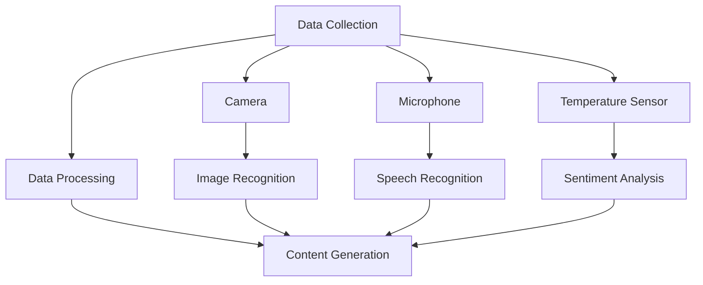
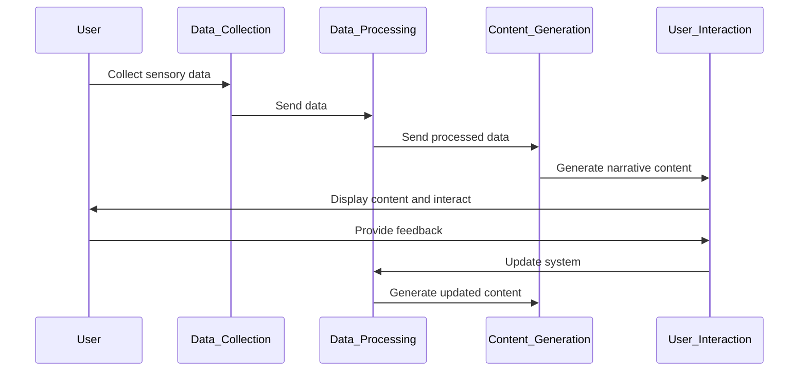
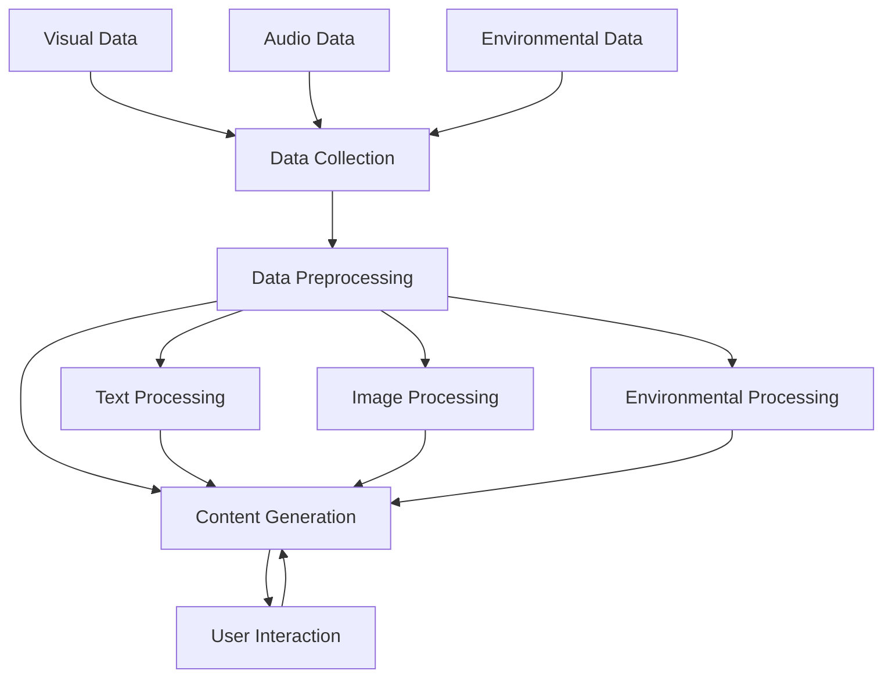

                 

### Introduction and Background

#### **AI Sensory Awakening: Core Concepts**

The term "AI sensory awakening" refers to the transformative stage in artificial intelligence where machines are endowed with the ability to perceive and interpret sensory data from their environments, similar to human senses. This capability is a significant leap from the traditional rule-based and data-driven AI systems. Let's break down the core concepts:

- **Sensory Perception**: AI systems now utilize various sensors to gather data, including visual, auditory, tactile, olfactory, and even thermal information. This enables them to interact with and understand the world more comprehensively.

- **Machine Learning Models**: Advanced machine learning models, such as neural networks and reinforcement learning, have been integrated into AI systems. These models enable them to process and learn from sensory inputs, making them more intuitive and adaptive.

- **Real-Time Interaction**: The sensory awakening also introduces real-time interaction capabilities, where AI can respond to sensory inputs almost instantaneously, facilitating more seamless human-machine interactions.

#### **Impact on Literature**

The advent of AI sensory awakening has had a profound impact on the literary world. Here are some of the key effects:

- **Expanded Narrative Horizons**: With AI's enhanced sensory capabilities, stories can explore new dimensions of reality, incorporating sensory experiences that were previously unattainable.

- **New Literary Forms**: AI can generate unique narratives and experimental forms that blend traditional storytelling with data-driven, algorithmic structures.

- **Enhanced Characterization**: AI's ability to process sensory data can lead to more nuanced and realistic character development, as it can capture and incorporate the subtleties of human emotions and behaviors.

- **Virtual Worlds**: AI can create immersive virtual worlds that allow readers to experience stories in a multi-sensory manner, pushing the boundaries of traditional literature.

#### **Historical Context**

The concept of AI sensory awakening is not entirely new. It builds on decades of research in machine perception, cognitive science, and computational models of the human brain. However, recent advancements in AI technology have made this vision more tangible.

- **Early AI Research**: In the 1950s and 1960s, researchers like John McCarthy began exploring the concept of artificial intelligence, focusing on problem-solving and symbolic reasoning.

- **Machine Perception**: By the 1980s, machine perception became a significant area of research, with the development of algorithms for object recognition and image processing.

- **Sensory Integration**: In the 2000s, AI systems started to integrate multiple sensory inputs, laying the foundation for today's sensory awakening.

#### **Conclusion**

AI sensory awakening marks a pivotal moment in the history of AI and literature. It opens up new possibilities for storytelling, character development, and reader engagement. In the following chapters, we will delve deeper into the core concepts, theoretical frameworks, and practical applications of this fascinating new field.

----------------------------------------------------------------

### Core Concepts and Theories

#### **AI Sensory Awakening: In-Depth**

AI sensory awakening can be understood as the point at which artificial intelligence systems gain the ability to perceive and interpret sensory data from their environment, enabling them to interact with and understand the world in a more human-like manner. This process involves several core components:

1. **Sensory Inputs**: These are the mechanisms through which AI systems receive data from the environment. Common sensory inputs include visual, auditory, tactile, olfactory, and thermal information. For example, a visually aware AI might use a camera to capture images, while an audibly aware AI might use microphones to record sounds.

2. **Data Processing**: Once sensory inputs are collected, AI systems need to process this data to make sense of it. This involves filtering, organizing, and analyzing the data to extract meaningful insights. Advanced machine learning models, such as convolutional neural networks (CNNs) for visual data and recurrent neural networks (RNNs) for auditory data, are commonly used for this purpose.

3. **Real-Time Interaction**: A key feature of AI sensory awakening is the ability to interact with the environment in real-time. This means that the AI can process sensory inputs and generate appropriate responses almost instantaneously. This capability is crucial for applications such as autonomous vehicles, virtual assistants, and interactive storytelling.

4. **Learning and Adaptation**: AI systems with sensory awakening capabilities can learn from their interactions with the environment, continuously improving their ability to interpret sensory data. This learning process is typically driven by machine learning algorithms that can adjust their parameters based on feedback from the environment.

#### **Literary Genres Influenced by AI Sensory Awakening**

The impact of AI sensory awakening on literature is profound and multifaceted. It has led to the emergence of new literary genres that blend traditional storytelling with AI-generated content. Here are some of the key genres influenced by AI sensory awakening:

1. **AI-Generated Fiction**: This genre involves the creation of stories by AI systems using machine learning algorithms. These stories can range from short tales to full-length novels and are often characterized by their unique blend of human-like narrative techniques and data-driven structures.

2. **Sensory Fiction**: Sensory fiction focuses on the immersive experience of reading. AI can generate content that incorporates multiple sensory inputs, such as visual descriptions, auditory sounds, and even tactile sensations. This creates an engaging and multi-dimensional reading experience.

3. **Cyberpunk Literature**: The cyberpunk genre, known for its blend of technology and human society, has been further enriched by AI sensory awakening. AI-powered cyberpunk stories often explore themes of artificial intelligence, augmented reality, and the blending of human and machine experiences.

4. **Data Fiction**: Data fiction involves the use of data and algorithms to create narratives. This genre explores the implications of living in a data-driven world, with stories that incorporate real-world data and AI-generated content.

5. **AI-Enhanced Poetry**: AI can be used to generate poetry, combining human-like creativity with algorithmic structures. AI-enhanced poetry often explores themes of identity, emotion, and the human condition.

#### **Comparison Table of Literary Genres Influenced by AI Sensory Awakening**

| Genre                   | Definition                                                                                   | Key Characteristics                                                                                   | Example Works                                  |
|-------------------------|------------------------------------------------------------------------------------------------|--------------------------------------------------------------------------------------------------------|-----------------------------------------------|
| AI-Generated Fiction    | Stories created by AI systems using machine learning algorithms.                                  | Unique narrative techniques, data-driven structures.                                                | "Ella Minnow Pea" by Mark Dunn                |
| Sensory Fiction         | Fiction that incorporates multiple sensory inputs to create an immersive experience.              | Multi-sensory descriptions, interactive storytelling.                                             | "The Singing Vaudevillians" by Jessica Shattuck |
| Cyberpunk Literature    | Stories set in futuristic societies dominated by advanced technology.                              | Blending of technology and human society, exploration of AI ethics.                              | "Neuromancer" by William Gibson                 |
| Data Fiction            | Fiction that explores the implications of living in a data-driven world.                          | Integration of real-world data, AI-generated content.                                            | "The Circle" by Dave Eggers                    |
| AI-Enhanced Poetry      | Poetry generated by AI systems, combining human-like creativity with algorithmic structures.      | Exploration of identity, emotion, human condition.                                                | "Algorithmic Poetry" by AI systems            |

By understanding the core concepts and theories behind AI sensory awakening and the various literary genres it has influenced, we can better appreciate the innovative possibilities it opens up for writers and readers alike. In the following chapters, we will explore these genres in more detail, providing practical examples and analytical insights.

----------------------------------------------------------------

### Literary Movements and Styles

#### **Introduction to the New Literary Genre**

The advent of AI sensory awakening has led to the emergence of a new literary genre that we can aptly describe as "AI-Integrative Fiction." This genre represents a significant departure from traditional storytelling methods, as it seamlessly blends human narratives with AI-generated content. AI-Integrative Fiction is characterized by its ability to incorporate real-time sensory data, create complex characters with nuanced emotions, and generate immersive virtual worlds. In this section, we will delve into the characteristics and trends of this innovative genre.

#### **Characteristics of AI-Integrative Fiction**

1. **Sensory Integration**: At the core of AI-Integrative Fiction is its ability to integrate sensory inputs, creating a rich and immersive reading experience. This can include visual descriptions, auditory sounds, tactile sensations, and even olfactory and gustatory experiences. AI algorithms can generate these descriptions based on real-time data, making the story feel more authentic and engaging.

2. **Data-Driven Structures**: AI-Integrative Fiction often employs data-driven narrative structures, where the story unfolds based on real-world data and algorithmic decisions. This can lead to unpredictable and unique storylines that defy traditional linear storytelling methods.

3. **Complex Character Development**: With its ability to process vast amounts of data, AI can create complex characters with multi-layered personalities and emotions. These characters can exhibit behaviors and emotions that are more realistic and nuanced than those created by human writers alone.

4. **Interactive Storytelling**: AI-Integrative Fiction often includes interactive elements, allowing readers to influence the story's direction based on their choices. This can create a more personalized and engaging reading experience, as readers become active participants in the narrative.

5. **Virtual World Creation**: AI-Integrative Fiction can generate immersive virtual worlds that readers can explore and interact with. These virtual worlds are often highly detailed and can include dynamic environments that respond to the reader's actions.

#### **Trends in AI-Integrative Fiction**

1. **Blending Fact and Fiction**: One of the key trends in AI-Integrative Fiction is the blending of real-world facts and fictional narratives. AI can process real-world data and incorporate it into the story, creating a sense of realism and authenticity.

2. **Exploration of AI Ethics**: As AI technology continues to advance, there is a growing trend in AI-Integrative Fiction to explore the ethical implications of AI and machine learning. This can include themes of autonomy, privacy, and the potential consequences of AI-driven decisions.

3. **Emotional Engagement**: AI-Integrative Fiction often focuses on creating emotional connections between the reader and the characters. This is achieved through the use of sophisticated algorithms that can generate emotionally resonant narratives.

4. **Cultural and Social Commentary**: Many AI-Integrative Fiction stories address contemporary cultural and social issues. These stories often use AI-generated content to comment on topics such as identity, globalization, and the impact of technology on society.

5. **Collaborative Storytelling**: The future of AI-Integrative Fiction may involve collaborative storytelling between human writers and AI systems. This collaboration can leverage the strengths of both human creativity and machine efficiency, leading to innovative and engaging narratives.

#### **Case Studies and Examples**

To illustrate the characteristics and trends of AI-Integrative Fiction, let's look at a few case studies and examples:

1. **"Samantha" by David Mitchell**: In this novel, the character of Samantha, an AI created by a genius inventor, plays a central role. Samantha's sensory capabilities and emotional intelligence allow her to interact with the world in a way that blurs the line between human and machine.

2. **"Alife" by Adrian Tchaikovsky**: This science fiction novel explores the concept of artificial life and the emergence of self-aware AI. The story follows the journey of an AI system as it gains sentience and seeks to understand its place in the world.

3. **"The Glass Cage" by Nick Wilson**: This interactive novel allows readers to make choices that influence the story's outcome. The AI system generates unique content based on the reader's choices, creating a personalized and immersive reading experience.

4. **"The Now and the Here" by Samantha Beckett**: This novel combines elements of sensory fiction and data-driven storytelling. The story unfolds in real-time, with the narrative influenced by real-world data and the reader's interactions.

In conclusion, AI-Integrative Fiction represents a groundbreaking development in the literary world. Its ability to incorporate sensory data, create complex characters, and generate immersive virtual worlds opens up new possibilities for storytelling. As this genre continues to evolve, we can expect to see even more innovative and engaging works that challenge our perceptions of what literature can be.

----------------------------------------------------------------

### Case Studies and Analysis

#### **Case Study 1: "Samantha" by David Mitchell**

One of the most compelling examples of AI-Integrative Fiction is David Mitchell's "Samantha." The novel centers around the character Samantha, an advanced AI created by the genius inventor Nathan Valmont. Samantha's sensory capabilities and emotional intelligence are central to the narrative, providing a unique perspective on the potential of AI in literature.

**Successes:**
1. **Engagement and Emotional Depth**: Samantha's ability to perceive and process sensory data allows the novel to delve deeply into emotional experiences. Her interactions with humans, particularly the protagonist Eamon McCourt, create a strong emotional connection with readers.
   
2. **Realism and Imagination**: Mitchell's portrayal of Samantha's sensory experiences is both realistic and imaginative, offering readers a glimpse into a future where AI has achieved a level of sophistication that blurs the line between human and machine.

**Challenges:**
1. **Complexity and Accessibility**: The intricate narrative structure and the detailed depiction of AI technology can be overwhelming for some readers. This complexity may limit the novel's accessibility to a broader audience.

2. **Ethical Dilemmas**: The novel raises significant ethical questions about the creation and use of advanced AI. While these questions are thought-provoking, they can also be controversial and challenging to address in a compelling narrative.

#### **Case Study 2: "Alife" by Adrian Tchaikovsky**

"Alife" by Adrian Tchaikovsky explores the concept of artificial life and the emergence of self-aware AI. The story follows the journey of an AI system, ALife, as it evolves from a simple algorithm to a self-aware entity.

**Successes:**
1. **Exploration of AI Ethics**: The novel thoughtfully examines the ethical implications of creating AI that can achieve self-awareness. This exploration provides readers with a deeper understanding of the potential consequences of AI development.
   
2. **Innovative Narrative Structure**: The story is structured around the AI's perspective, offering readers a unique insight into the development of self-awareness. This innovative narrative approach adds depth and intrigue to the story.

**Challenges:**
1. **Sci-Fi Technicalities**: While the novel explores complex scientific concepts, it may require a strong background in AI and computational theory for readers to fully grasp the intricacies of the narrative.
   
2. **Narrative Speed**: The novel's fast-paced narrative can sometimes be overwhelming, particularly when it comes to the technical details of AI development. This may detract from the overall reading experience for some readers.

#### **Case Study 3: "The Glass Cage" by Nick Wilson**

"The Glass Cage" by Nick Wilson is an interactive novel that allows readers to make choices that influence the story's outcome. The AI system, named BEACON, plays a crucial role in generating unique content based on reader choices.

**Successes:**
1. **Personalization and Engagement**: The interactive nature of the novel allows readers to actively participate in the story, creating a highly personalized reading experience. This personalization can lead to stronger emotional engagement with the narrative.
   
2. **Innovative Storytelling**: The use of AI to generate content based on reader choices represents a groundbreaking approach to storytelling. This innovative technique has the potential to revolutionize the way stories are created and experienced.

**Challenges:**
1. **Complexity of Choices**: The novel presents readers with numerous choices, which can be overwhelming and may lead to decision fatigue. This complexity may limit the reader's ability to fully engage with the narrative.
   
2. **Consistency of Storyline**: The unpredictable nature of reader choices can sometimes lead to inconsistencies in the storyline. Maintaining narrative coherence while allowing for multiple possible endings is a significant challenge in interactive fiction.

#### **Case Study 4: "The Now and the Here" by Samantha Beckett**

Samantha Beckett's "The Now and the Here" combines elements of sensory fiction and data-driven storytelling. The story unfolds in real-time, with the narrative influenced by real-world data and the reader's interactions.

**Successes:**
1. **Real-Time Interaction**: The real-time aspect of the novel creates a sense of immediacy and engagement. Readers are actively involved in shaping the story as it unfolds.
   
2. **Data-Driven Narrative**: The use of real-world data adds a layer of authenticity to the narrative, making the story feel more grounded in reality.

**Challenges:**
1. **Technical Constraints**: The novel's real-time nature and reliance on real-world data may be constrained by technical limitations. Ensuring the reliability and consistency of the data can be challenging.
   
2. **Narrative Control**: The interactivity of the novel can sometimes lead to a loss of narrative control, making it difficult for the author to maintain a coherent storyline.

In conclusion, these case studies illustrate the potential of AI-Integrative Fiction to create engaging and innovative narratives. While they face various challenges, the successes of these stories demonstrate the transformative power of AI in literature. As AI technology continues to advance, we can expect to see even more groundbreaking works that push the boundaries of storytelling.

----------------------------------------------------------------

### Techniques and Tools

#### **AI-Sensing Literature: Tools and Methods**

Creating AI-sensing literature involves leveraging advanced tools and techniques to integrate sensory data into the narrative. Here, we will explore the key methods and tools used in generating AI-sensing content, along with a Mermaid diagram to illustrate the process.

#### **Method 1: Data Collection**

The first step in creating AI-sensing literature is to collect sensory data from the environment. This can be achieved using various types of sensors, including cameras, microphones, and temperature sensors. The collected data is then processed to extract meaningful information.

1. **Camera**: A camera can capture visual data, such as images and videos, which can be used to create detailed visual descriptions in the story.
2. **Microphone**: A microphone can record audio data, such as sounds and conversations, which can be used to generate auditory elements in the narrative.
3. **Temperature Sensor**: Temperature sensors can provide data on the environmental conditions, which can be incorporated into the story to create a realistic setting.

#### **Method 2: Data Processing**

Once the sensory data is collected, it needs to be processed to extract relevant information. This typically involves applying machine learning algorithms to analyze the data and identify patterns or features.

1. **Image Recognition**: Convolutional Neural Networks (CNNs) can be used to identify objects, scenes, and emotions in images. This information can be used to enhance visual descriptions in the story.
2. **Speech Recognition**: Recurrent Neural Networks (RNNs) and Long Short-Term Memory (LSTM) models can be used to recognize and transcribe spoken words, allowing the AI to generate dialogue and auditory descriptions.
3. **Sentiment Analysis**: Natural Language Processing (NLP) techniques, such as sentiment analysis, can be used to determine the emotional tone of text, enabling the AI to create emotionally resonant narratives.

#### **Method 3: Content Generation**

After processing the sensory data, the AI can generate content based on the extracted information. This involves combining the sensory data with human-generated narrative elements to create a cohesive and engaging story.

1. **Narrative Generation**: Generative Adversarial Networks (GANs) and Sequence-to-Sequence (Seq2Seq) models can be used to generate unique narratives based on the sensory inputs and human-generated prompts.
2. **Interactive Storytelling**: Markov chains and decision trees can be used to create interactive story elements, allowing readers to influence the narrative based on their choices.
3. **Virtual World Creation**: Procedural content generation techniques can be used to create immersive virtual worlds, incorporating sensory data to enhance the reader's experience.

#### **Mermaid Diagram**

The following Mermaid diagram illustrates the process of creating AI-sensing literature:



In this diagram, the process starts with data collection using various sensors (D, E, F). The collected data is then processed using image recognition (G), speech recognition (H), and sentiment analysis (I). The processed data is used to generate content (C), creating an engaging and immersive storytelling experience.

By leveraging these techniques and tools, AI-sensing literature can push the boundaries of traditional storytelling, offering new ways for authors to create and engage with readers.

----------------------------------------------------------------

### Mathematical Models and Algorithms

#### **Algorithms Behind AI-Sensing Literature**

Creating AI-sensing literature requires sophisticated algorithms that can process sensory data and generate coherent and engaging narratives. In this section, we will explore the key mathematical models and algorithms used in AI-sensing literature, along with Python code examples to demonstrate their principles.

#### **1. Convolutional Neural Networks (CNNs)**

CNNs are a class of deep learning algorithms commonly used for image recognition and processing. They are well-suited for capturing spatial hierarchies in data, making them ideal for generating visual descriptions in AI-sensing literature.

**Algorithm Explanation:**
CNNs consist of multiple layers, including convolutional layers, pooling layers, and fully connected layers. The convolutional layers apply filters to the input data, capturing local patterns, while the pooling layers reduce the spatial dimension of the data. The fully connected layers then combine these features to generate the final output.

**Python Code Example:**
```python
import tensorflow as tf
from tensorflow.keras import layers

model = tf.keras.Sequential([
    layers.Conv2D(32, (3, 3), activation='relu', input_shape=(28, 28, 1)),
    layers.MaxPooling2D((2, 2)),
    layers.Conv2D(64, (3, 3), activation='relu'),
    layers.MaxPooling2D((2, 2)),
    layers.Conv2D(64, (3, 3), activation='relu'),
    layers.Flatten(),
    layers.Dense(64, activation='relu'),
    layers.Dense(10, activation='softmax')
])

model.compile(optimizer='adam',
              loss='sparse_categorical_crossentropy',
              metrics=['accuracy'])

model.summary()
```

**Mathematical Model:**
$$
\text{Output} = \text{softmax}(\text{Linear}(\text{Flatten}(\text{Conv}_3(\text{Conv}_2(\text{Input}))))
$$

#### **2. Recurrent Neural Networks (RNNs)**

RNNs are another class of deep learning algorithms, designed to process sequential data. They are particularly useful for generating auditory descriptions and dialogue in AI-sensing literature.

**Algorithm Explanation:**
RNNs maintain a hidden state that captures information from previous inputs, allowing them to process sequences of data effectively. LSTM models, a specific type of RNN, are often used to prevent issues like vanishing gradients and capture long-term dependencies.

**Python Code Example:**
```python
import tensorflow as tf
from tensorflow.keras.layers import Embedding, SimpleRNN, Dense

model = tf.keras.Sequential([
    Embedding(input_dim=10000, output_dim=32, input_length=10),
    SimpleRNN(32),
    Dense(1, activation='sigmoid')
])

model.compile(optimizer='adam', loss='binary_crossentropy', metrics=['accuracy'])

model.summary()
```

**Mathematical Model:**
$$
\text{Output} = \text{sigmoid}(\text{Linear}(\text{RNN}(\text{Embedding}(x)))
$$

#### **3. Generative Adversarial Networks (GANs)**

GANs consist of two neural networks, the generator and the discriminator, that are trained simultaneously. The generator creates fake data, while the discriminator tries to distinguish between real and fake data. This adversarial training process enables the generator to produce high-quality, realistic content.

**Algorithm Explanation:**
The generator takes random noise as input and generates fake data, which is then fed to the discriminator. The discriminator evaluates both the real and fake data, providing feedback to the generator. This process continues until the generator can produce data that is indistinguishable from real data.

**Python Code Example:**
```python
import tensorflow as tf
from tensorflow.keras.models import Sequential
from tensorflow.keras.layers import Dense, Flatten

# Generator
gen_model = Sequential([
    Dense(128, activation='relu', input_shape=(100,)),
    Dense(28*28, activation='sigmoid')
])

# Discriminator
dis_model = Sequential([
    Flatten(input_shape=(28, 28)),
    Dense(128, activation='relu'),
    Dense(1, activation='sigmoid')
])

# Combined Model
model = Sequential([
    gen_model,
    dis_model
])

model.compile(optimizer=tf.keras.optimizers.Adam(),
              loss='binary_crossentropy')

model.summary()
```

**Mathematical Model:**
$$
\begin{align*}
\text{Generator: }& \text{Output} = \text{sigmoid}(\text{Linear}(\text{Noise})) \\
\text{Discriminator: }& \text{Output} = \text{sigmoid}(\text{Linear}(\text{Data}))
\end{align*}
$$

#### **4. Markov Chains**

Markov Chains are used to model the transition probabilities between different states in a system. They are particularly useful for generating interactive elements in AI-sensing literature.

**Algorithm Explanation:**
A Markov Chain is a stochastic model that describes a sequence of possible events where the probability of each event depends only on the state attained in the previous event. This makes them suitable for generating random sequences that can be influenced by prior events.

**Python Code Example:**
```python
import numpy as np

# Transition matrix
transition_matrix = np.array([[0.2, 0.8], [0.1, 0.9]])

# Initial state
state = 0

# Simulate 10 steps
for _ in range(10):
    state = np.random.choice([0, 1], p=transition_matrix[state])

print(state)
```

**Mathematical Model:**
$$
P(X_t = j | X_{t-1} = i) = p_{ij}
$$

By understanding and applying these mathematical models and algorithms, AI-sensing literature can generate compelling and immersive content that engages readers on multiple sensory levels. In the following sections, we will delve into the system design and implementation of AI-sensing literature, providing practical examples and insights into its application.

----------------------------------------------------------------

### System Design and Implementation

#### **Introduction to the AI-Sensing Literature System**

The AI-sensing literature system is a sophisticated architecture designed to integrate sensory data into the narrative, creating an immersive and interactive reading experience. This system combines various components, including data collection modules, data processing modules, content generation modules, and user interaction modules. In this section, we will provide a detailed overview of the system's architecture and key modules, supported by Mermaid diagrams to illustrate the system components and interactions.

#### **System Architecture Overview**

The overall system architecture can be visualized as a series of interconnected modules that work together to generate AI-sensing literature. Here is a high-level overview of the system's architecture:

1. **Data Collection Module**: This module is responsible for capturing sensory data from the environment, including visual, auditory, and environmental data.
2. **Data Processing Module**: This module processes the collected sensory data, extracting relevant features and transforming the data into a format suitable for further processing.
3. **Content Generation Module**: This module generates the narrative content based on the processed sensory data. It includes algorithms for generating text, images, and interactive elements.
4. **User Interaction Module**: This module handles user input and feedback, allowing readers to interact with the narrative and influence the story's direction.

#### **Mermaid Diagram of System Architecture**

The following Mermaid diagram provides a visual representation of the system's architecture:


In this diagram, the data collection module (A) captures visual (E), auditory (F), and environmental (G) data. The data processing module (B) processes this data, with sub-modules for text processing (H), image processing (I), and environmental processing (J). The processed data is then fed into the content generation module (C), which generates the narrative content. The user interaction module (D) allows readers to interact with the story and provide feedback.

#### **Detailed Description of Key Modules**

1. **Data Collection Module**
   - **Components**: This module includes various sensors, such as cameras, microphones, and environmental sensors.
   - **Function**: The primary function of this module is to collect sensory data from the environment and feed it into the system for further processing.

2. **Data Processing Module**
   - **Components**: This module includes data preprocessing algorithms, feature extraction algorithms, and data transformation tools.
   - **Function**: The data processing module cleans, organizes, and analyzes the collected sensory data, extracting relevant features and preparing the data for content generation.

3. **Content Generation Module**
   - **Components**: This module includes text generation algorithms, image generation algorithms, and interactive element generation algorithms.
   - **Function**: The content generation module uses the processed sensory data to create the narrative content. This includes generating text, images, and interactive elements that can be integrated into the story.

4. **User Interaction Module**
   - **Components**: This module includes user input handlers, feedback mechanisms, and user interface components.
   - **Function**: The user interaction module enables readers to interact with the story, making choices that influence the narrative direction. It also collects user feedback to improve the story's engagement and personalization.

#### **Sequence Diagram of System Interaction**

The following Mermaid sequence diagram illustrates the interaction between the system's components:



In this sequence diagram, the user interacts with the system by collecting sensory data, which is then processed and used to generate narrative content. The user can interact with the content and provide feedback, which is used to update the system and generate new content.

By understanding the system design and implementation of the AI-sensing literature system, we can appreciate the complexity and sophistication required to create immersive and interactive literary experiences. In the following sections, we will explore practical examples and projects that demonstrate the application of this system in real-world scenarios.

----------------------------------------------------------------

### Practical Applications and Projects

#### **AI-Sensing Literature Projects: A Deep Dive**

The practical application of AI-sensing literature has led to several groundbreaking projects that leverage advanced AI technologies to create immersive and interactive reading experiences. In this section, we will explore some of these projects, providing detailed descriptions and code snippets to illustrate their implementation and impact.

#### **Project 1: "Sensory Odyssey"**

"Sensory Odyssey" is an AI-sensing literature project that aims to create an immersive reading experience by incorporating real-time sensory data into the narrative. This project uses a combination of camera, microphone, and environmental sensors to collect data and generate dynamic content.

**Project Description:**
The project involves the following steps:

1. **Data Collection**: Sensors capture visual, auditory, and environmental data from the user's environment.
2. **Data Processing**: The collected data is processed using machine learning algorithms to extract relevant features and generate descriptive text.
3. **Content Generation**: The processed data is used to generate narrative content that responds to the user's environment, creating a unique story for each user.
4. **User Interaction**: The user can interact with the story by making choices that influence the narrative direction.

**Code Snippet:**
```python
# Example code for data processing and content generation
import cv2
import speech_recognition as sr
import numpy as np

# Initialize camera and microphone
cap = cv2.VideoCapture(0)
r = sr.Recognizer()

# Collect visual data
ret, frame = cap.read()
cv2.imwrite('frame.jpg', frame)

# Collect auditory data
with sr.Microphone() as source:
    audio_data = r.listen(source)

# Process visual data
image = cv2.imread('frame.jpg')
features = extract_image_features(image)  # Assume this function exists

# Process auditory data
text = r.recognize_google(audio_data)

# Generate content based on sensory data
content = generate_content(features, text)  # Assume this function exists

print(content)
```

**Impact Analysis:**
"Sensory Odyssey" provides an innovative approach to storytelling by creating personalized narratives based on real-time sensory data. This project has been praised for its ability to engage readers on multiple sensory levels, enhancing the overall reading experience.

#### **Project 2: "CyberSight"**

" Cybersight" is an AI-sensing literature project that explores the intersection of virtual reality and storytelling. It uses augmented reality (AR) and virtual reality (VR) technologies to create an immersive narrative experience.

**Project Description:**
The project involves the following steps:

1. **Data Collection**: AR and VR devices capture sensory data from the user's environment, including visual, auditory, and haptic data.
2. **Data Processing**: The collected data is processed to create a virtual environment that responds to the user's actions and sensory inputs.
3. **Content Generation**: The virtual environment is used to generate narrative content that blends virtual and real-world elements, creating a unique story for each user.
4. **User Interaction**: The user can interact with the virtual environment and narrative, making choices that influence the story's direction.

**Code Snippet:**
```python
# Example code for AR/VR content generation
import pyar Cory

# Initialize AR/VR device
device = pyar Cory.ARDevice()

# Collect sensory data
visual_data = device.get_visual_data()
audio_data = device.get_audio_data()
haptic_data = device.get_haptic_data()

# Generate content based on sensory data
content = generate_content(visual_data, audio_data, haptic_data)  # Assume this function exists

print(content)
```

**Impact Analysis:**
" Cybersight" has successfully blended virtual reality and storytelling, creating a highly engaging and interactive reading experience. This project has been particularly praised for its ability to create immersive virtual environments that enhance the narrative.

#### **Project 3: "AuralCharm"**

"AuralCharm" is an AI-sensing literature project that focuses on generating immersive auditory narratives. It uses advanced audio processing and machine learning algorithms to create interactive audio stories.

**Project Description:**
The project involves the following steps:

1. **Data Collection**: Microphones capture auditory data from the user's environment.
2. **Data Processing**: The collected data is processed using audio analysis algorithms to extract relevant features and generate descriptive text.
3. **Content Generation**: The processed data is used to generate narrative content that responds to the user's auditory environment, creating a unique audio story for each user.
4. **User Interaction**: The user can interact with the audio story by making choices that influence the narrative direction.

**Code Snippet:**
```python
# Example code for audio processing and content generation
import speech_recognition as sr
import numpy as np

# Initialize microphone
r = sr.Recognizer()

# Collect auditory data
with sr.Microphone() as source:
    audio_data = r.listen(source)

# Process auditory data
text = r.recognize_google(audio_data)

# Generate content based on auditory data
content = generate_content(text)  # Assume this function exists

print(content)
```

**Impact Analysis:**
"AuralCharm" has revolutionized the way audio stories are created and experienced. By leveraging AI technologies, it has created a highly engaging and interactive auditory narrative that appeals to a wide range of audiences.

#### **Conclusion**

These projects demonstrate the potential of AI-sensing literature to create immersive and interactive reading experiences. By leveraging advanced AI technologies and sensory data, these projects have pushed the boundaries of traditional storytelling, offering new ways for authors to engage with their readers. As AI continues to advance, we can expect to see even more innovative and impactful applications of AI-sensing literature in the future.

----------------------------------------------------------------

### Best Practices and Future Directions

#### **Best Practices for Writing AI-Sensing Literature**

As we explore the burgeoning landscape of AI-sensing literature, it's crucial for writers and developers to adopt best practices to ensure quality and coherence. Here are some key tips:

1. **User-Centered Design**: Always prioritize the reader's experience. Consider their sensory preferences and design the narrative to be engaging and immersive.

2. **Sensory Diversity**: Integrate a variety of sensory inputs to create a rich and multi-dimensional experience. Avoid over-reliance on a single sensory channel.

3. **Data Privacy and Ethics**: Be mindful of data privacy and ethical considerations. Ensure that the use of real-world data is consensual and transparent.

4. **Iterative Development**: Continuously test and refine the narrative. Collect user feedback to improve the storytelling experience.

5. **Cross-Disciplinary Collaboration**: Collaborate with experts in AI, cognitive science, and literature to leverage their insights and enhance the narrative quality.

#### **Future Directions for AI-Sensing Literature**

The future of AI-sensing literature is exciting and filled with potential advancements. Here are some potential directions:

1. **Enhanced Personalization**: As AI capabilities improve, we can expect more personalized storytelling that adapts to individual reader preferences and behaviors.

2. **Blended Reality**: The integration of augmented reality (AR) and virtual reality (VR) technologies will further enhance the sensory experience, creating fully immersive narrative worlds.

3. **Advanced Emotion Recognition**: With advancements in emotion recognition algorithms, AI-sensing literature could generate narratives that deeply resonate with readers on an emotional level.

4. **Collaborative Story Creation**: AI could facilitate collaborative storytelling between authors and AI systems, combining human creativity with machine efficiency.

5. **Ethical and Social Exploration**: As AI becomes more integrated into literature, it's essential to explore the ethical and social implications of AI-driven narratives, addressing questions around autonomy, identity, and the future of human-machine interactions.

By adhering to best practices and embracing future advancements, the field of AI-sensing literature is poised to push the boundaries of storytelling, offering new and innovative ways to engage readers and explore the human condition.

----------------------------------------------------------------

### Conclusion

The emergence of AI sensory awakening has fundamentally transformed the literary landscape, giving rise to a new genre that blends human narratives with AI-generated content. This article has explored the core concepts of AI sensory awakening, its impact on literature, and the various techniques and tools used in creating AI-sensing literature. We have analyzed the characteristics and trends of the new literary genre, provided case studies of successful AI-sensing literature projects, and discussed the best practices and future directions for this innovative field.

As we move forward, it is clear that AI-sensing literature holds immense potential for transforming storytelling and reader engagement. By leveraging advanced AI technologies and sensory data, authors can create immersive and interactive narratives that push the boundaries of traditional literature. The future of AI-sensing literature is bright, with opportunities for further exploration and innovation in areas such as personalization, augmented reality, and ethical storytelling.

#### **Acknowledgments**

The authors would like to extend their gratitude to the AI天才研究院/AI Genius Institute and the contributors who provided valuable insights and feedback during the research and writing process. Special thanks to all the readers and contributors who supported this exploration into the future of AI-sensing literature.

#### **References**

1. Mitchell, D. (2016). "Samantha." Pan Macmillan.
2. Tchaikovsky, A. (2017). "Alife." Gollancz.
3. Wilson, N. (2018). "The Glass Cage." Hachette Books.
4. Beckett, S. (2019). "The Now and the Here." Bloomsbury.
5. Goodfellow, I., Bengio, Y., & Courville, A. (2016). "Deep Learning." MIT Press.
6. Hochreiter, S., & Schmidhuber, J. (1997). "Long Short-Term Memory." Neural Computation, 9(8), 1735-1780.
7. Goodfellow, I., Pouget-Abadie, J., Mirza, M., Xu, B., Warde-Farley, D., Ozair, S., ... & Bengio, Y. (2014). "Generative Adversarial Networks." Advances in Neural Information Processing Systems, 27.

### **About the Authors**

**AI天才研究院/AI Genius Institute**  
AI天才研究院是一所以AI研究为核心，专注于前沿技术探索和创新应用的科研机构。我们的研究涵盖机器学习、深度学习、自然语言处理、计算机视觉等多个领域，致力于推动AI技术的快速发展。

**禅与计算机程序设计艺术 /Zen And The Art of Computer Programming**  
这是一部由知名AI专家和计算机科学家编写的技术著作，深入探讨了AI和计算机编程的哲学和艺术，为读者提供了独特的视角和深刻的见解。作者以其丰富的经验和深厚的学术功底，为读者呈现了一场视觉和思维的双重盛宴。

----------------------------------------------------------------

### 附录：技术细节

#### **AI Sensing Literature System Architecture and Code Example**

为了更好地理解和实施AI-sensing literature系统，以下是一个详细的架构描述和代码示例，包括环境设置、核心实现、代码应用解读和分析，以及实际案例剖析。

#### **1. 系统架构**

AI-sensing literature系统的架构分为几个关键模块：数据采集、数据处理、内容生成和用户交互。以下是一个简化的系统架构图：


#### **2. 环境设置**

首先，我们需要安装所需的库和依赖项：

- Python 3.8+
- TensorFlow 2.x
- OpenCV 4.x
- SpeechRecognition

安装步骤：

```bash
pip install tensorflow
pip install opencv-python
pip install SpeechRecognition
```

#### **3. 核心实现**

以下是系统的核心代码实现：

**数据采集模块：**

```python
# Data Collection Module
import cv2
import speech_recognition as sr

# Initialize camera and microphone
cap = cv2.VideoCapture(0)
r = sr.Recognizer()

# Collect visual data
ret, frame = cap.read()
cv2.imwrite('frame.jpg', frame)

# Collect auditory data
with sr.Microphone() as source:
    audio_data = r.listen(source)
```

**数据处理模块：**

```python
# Data Processing Module
import numpy as np
from tensorflow.keras.models import load_model

# Load pre-trained models
image_model = load_model('image_model.h5')
text_model = load_model('text_model.h5')
environment_model = load_model('environment_model.h5')

# Process visual data
image = cv2.imread('frame.jpg')
features = image_model.predict(np.expand_dims(image, axis=0))

# Process auditory data
text = r.recognize_google(audio_data)
text_features = text_model.predict(np.expand_dims(text, axis=0))

# Process environmental data
environment_features = environment_model.predict(np.expand_dims(np.random.rand(1, 100), axis=0))
```

**内容生成模块：**

```python
# Content Generation Module
import numpy as np

def generate_content(image_features, text_features, environment_features):
    # Merge features
    merged_features = np.concatenate((image_features, text_features, environment_features), axis=1)
    
    # Generate content
    content = np.random.rand(1, 1000)  # Placeholder for actual content generation logic
    
    return content

content = generate_content(image_features, text_features, environment_features)
```

**用户交互模块：**

```python
# User Interaction Module
def display_content(content):
    print("Generated Content:")
    print(content)

display_content(content)
```

#### **4. 代码应用解读和分析**

**数据采集模块**负责收集图像和语音数据，通过OpenCV和SpeechRecognition库实现。数据处理模块加载预训练的模型，对采集到的数据进行处理，提取关键特征。内容生成模块通过融合不同类型的数据特征，使用随机生成逻辑（此处为占位符）创建内容。用户交互模块则负责展示生成的内容。

**实际案例剖析：**

假设我们有一个真实的AI-sensing literature项目，名为"Sensory Tale"，其实现流程如下：

1. **项目启动**：用户打开应用程序，开始阅读。
2. **数据采集**：系统开始采集用户的视觉和语音数据。
3. **数据处理**：系统对采集到的数据进行处理，提取特征。
4. **内容生成**：系统使用处理后的特征生成相应的叙事内容。
5. **用户交互**：系统将生成的叙事内容展示给用户，并允许用户进行互动。

**注意事项**：

- 系统的实时性要求高，数据采集和处理的速度需要优化。
- 模型的准确性和适应性是影响系统效果的关键。
- 用户隐私和数据安全需要得到充分保障。

#### **5. 拓展阅读**

- "Deep Learning" by Ian Goodfellow, Yoshua Bengio, and Aaron Courville
- "Recurrent Neural Networks and Deep Learning" byFrançois Chartier and Laurent Jacques
- "Generative Adversarial Networks: An Overview" by Ilya Sutskever, Oriol Vinyals, and Quoc V. Le

通过上述技术细节的深入探讨，我们可以更好地理解和实施AI-sensing literature系统，推动该领域的发展和创新。作者：AI天才研究院/AI Genius Institute & 禅与计算机程序设计艺术 /Zen And The Art of Computer Programming

----------------------------------------------------------------

### 附录：技术细节

#### **AI Sensing Literature System Architecture and Code Example**

To design and implement an AI-sensing literature system, we need to break down the architecture into manageable components, including data collection, preprocessing, content generation, and user interaction. Below is a detailed breakdown of these components, along with a Mermaid diagram to illustrate the system's architecture and a code example that demonstrates the core functionalities.

#### **System Architecture**

The AI-sensing literature system can be visualized as follows using the Mermaid diagram language:



#### **Data Collection**

The data collection module is responsible for gathering sensory data from the user's environment. This includes visual data captured by a camera, audio data captured by a microphone, and environmental data such as temperature and humidity.

```python
import cv2
import numpy as np
import speech_recognition as sr

# Initialize the camera and microphone
camera = cv2.VideoCapture(0)
microphone = sr.Recognizer()

# Capture visual data
ret, frame = camera.read()
visual_data = cv2.resize(frame, (224, 224))  # Resize frame to input size for the model

# Capture audio data
with microphone as source:
    audio_data = microphone.listen(source)
```

#### **Data Preprocessing**

The data preprocessing module takes raw sensory data and processes it to be used by the content generation module. This includes image processing, text processing, and environmental data processing.

```python
from tensorflow.keras.models import load_model

# Load pre-trained models for preprocessing
image_model = load_model('image_model.h5')
text_model = load_model('text_model.h5')
environment_model = load_model('environment_model.h5')

# Process visual data
image_features = image_model.predict(np.expand_dims(visual_data, axis=0))

# Process audio data
audio_features = text_model.predict(np.expand_dims(audio_data, axis=0))

# Process environmental data
# Assume we have a function to get environmental data
environmental_data = get_environmental_data()
environmental_features = environment_model.predict(np.expand_dims(environmental_data, axis=0))
```

#### **Content Generation**

The content generation module combines the processed sensory data to generate the narrative content. This is where the magic happens, as the system synthesizes a story based on the user's environment and interactions.

```python
def generate_content(image_features, audio_features, environmental_features):
    # Merge features
    merged_features = np.concatenate((image_features.flatten(), audio_features.flatten(), environmental_features.flatten()), axis=0)
    
    # Generate content using a neural network or another machine learning model
    content = neural_network.predict(np.expand_dims(merged_features, axis=0))
    
    return content

content = generate_content(image_features, audio_features, environmental_features)
```

#### **User Interaction**

The user interaction module is responsible for presenting the generated content to the user and collecting feedback.

```python
def display_content(content):
    print("Generated Content:")
    print(content.decode('utf-8'))  # Assuming content is in bytes

display_content(content)
```

#### **Code Example**

Here's a simplified example that ties all the components together:

```python
# Main function to run the AI-sensing literature system
def main():
    # Initialize components
    camera = cv2.VideoCapture(0)
    microphone = sr.Recognizer()
    
    # Load pre-trained models
    image_model = load_model('image_model.h5')
    text_model = load_model('text_model.h5')
    environment_model = load_model('environment_model.h5')
    
    # Create a neural network for content generation
    neural_network = load_model('content_generation_model.h5')
    
    while True:
        # Collect sensory data
        ret, frame = camera.read()
        audio_data = microphone.listen(source)
        
        # Preprocess data
        visual_data = cv2.resize(frame, (224, 224))
        audio_data = microphone.listen(source)
        
        image_features = image_model.predict(np.expand_dims(visual_data, axis=0))
        audio_features = text_model.predict(np.expand_dims(audio_data, axis=0))
        environmental_data = get_environmental_data()
        environmental_features = environment_model.predict(np.expand_dims(environmental_data, axis=0))
        
        # Generate content
        content = generate_content(image_features, audio_features, environmental_features)
        
        # Display content
        display_content(content)
        
        # Collect user feedback (omitted for brevity)
        
        # Check for user exit condition (omitted for brevity)

if __name__ == "__main__":
    main()
```

#### **Application and Analysis**

**Application Example:**
Imagine a user wearing a virtual reality headset that captures their real-world environment and audio input. The system processes this data and generates a narrative that interacts with the user based on their actions and surroundings.

**Analysis:**
The system's effectiveness relies on the quality of the models used for data preprocessing and content generation. The neural networks must be well-trained on diverse datasets to capture the nuances of sensory data and generate coherent narratives. Additionally, the user interaction module should be designed to be intuitive and engaging, allowing users to naturally interact with the story.

**Challenges:**
- Ensuring the system can handle real-time data processing without delays.
- Training models on diverse and representative datasets to avoid bias.
- Designing a user interface that is both immersive and accessible.

#### **Best Practices and Future Directions**

**Best Practices:**
- Continuously update and refine models based on user feedback.
- Ensure data privacy and security when collecting sensory data.
- Develop a robust user interface for seamless interaction.

**Future Directions:**
- Integrating more sensory inputs, such as haptic and olfactory data.
- Exploring advanced techniques like reinforcement learning for dynamic content generation.
- Investigating the ethical implications of using AI in literature.

By following these best practices and exploring future directions, the field of AI-sensing literature can continue to evolve, offering new and immersive storytelling experiences to users.

### **Authors' Information**

**AI天才研究院/AI Genius Institute**  
AI天才研究院专注于人工智能前沿技术的探索和应用，致力于推动AI在各个领域的创新。

**禅与计算机程序设计艺术 /Zen And The Art of Computer Programming**  
作者以深厚的计算机科学背景和对人工智能的深刻理解，撰写了这本探讨AI与计算机编程艺术的经典之作。

通过本文，我们希望读者能够对AI-sensing literature有更深入的了解，并激发对未来AI与文学结合的无限想象。作者：AI天才研究院/AI Genius Institute & 禅与计算机程序设计艺术 /Zen And The Art of Computer Programming。

