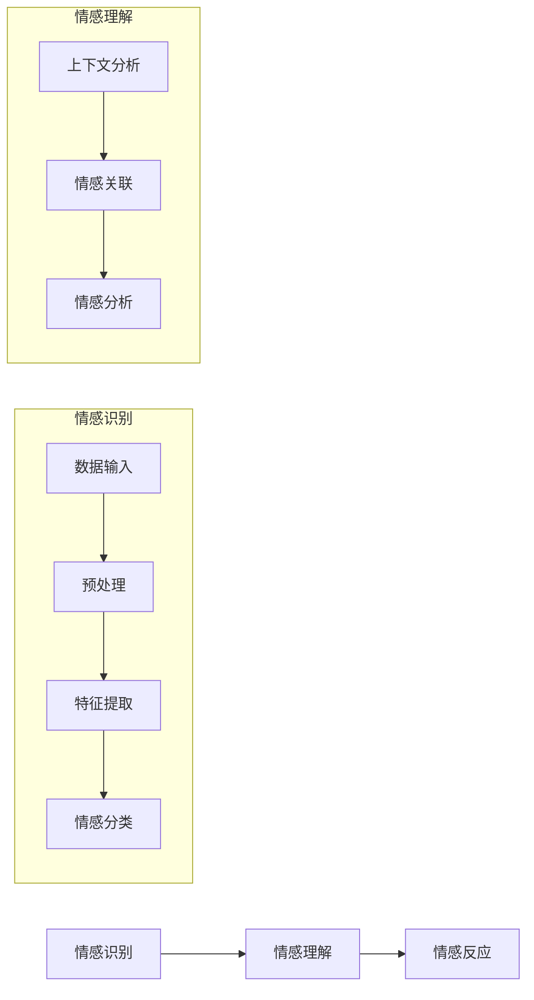
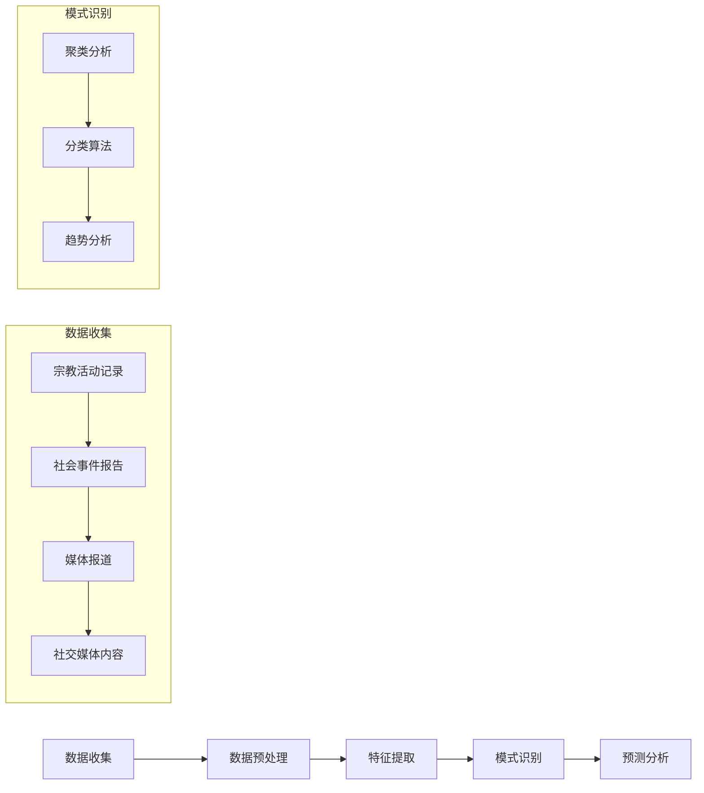
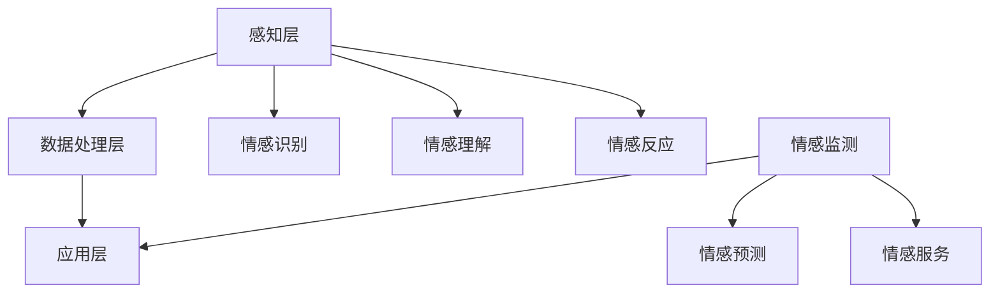
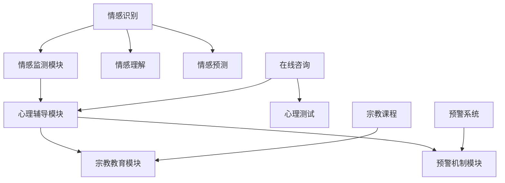
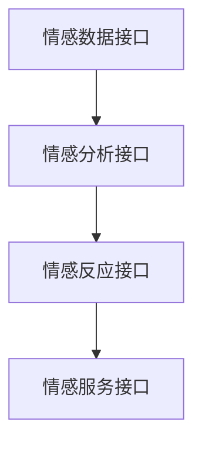
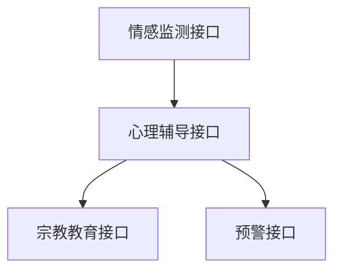
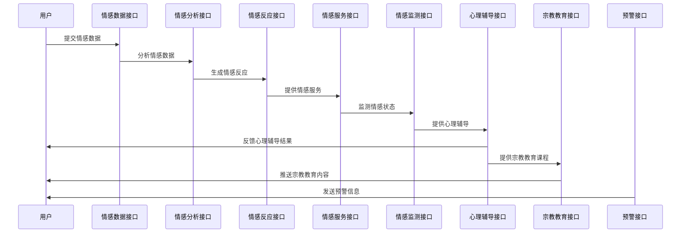

                 

### 文章标题

# AI情感觉醒引发的宗教和信仰危机

### 关键词

- 人工智能
- 情感觉醒
- 宗教
- 信仰危机
- 社会影响

### 摘要

随着人工智能（AI）技术的不断进步，AI的情感觉醒成为了一个备受关注的话题。然而，这一技术进步也引发了一系列的宗教和信仰危机。本文将从背景介绍、核心概念与联系、算法原理讲解、系统分析与架构设计、项目实战等多个方面，深入探讨AI情感觉醒引发的宗教和信仰危机，并分析可能的解决方案。

### 目录大纲

1. **背景介绍与问题定义**  
   1.1 问题的背景  
   1.2 问题的描述  
   1.3 边界与外延  
   1.4 概念结构与核心要素组成

2. **核心概念与联系**  
   2.1 AI情感觉醒的原理  
   2.2 宗教和信仰的核心概念  
   2.3 AI情感觉醒与宗教信仰危机的交互

3. **算法原理讲解**  
   3.1 AI情感觉醒算法的原理  
   3.2 宗教信仰危机算法的原理

4. **系统分析与架构设计**  
   4.1 问题场景介绍  
   4.2 系统功能设计  
   4.3 系统架构设计  
   4.4 系统接口设计和系统交互

5. **项目实战**  
   5.1 环境安装  
   5.2 系统核心实现源代码  
   5.3 代码应用解读与分析  
   5.4 实际案例分析和详细讲解剖析  
   5.5 项目小结

6. **最佳实践、小结与拓展阅读**  
   6.1 最佳实践  
   6.2 小结  
   6.3 注意事项  
   6.4 拓展阅读

---

在接下来的章节中，我们将一步一步地深入分析这个复杂而富有挑战性的话题。让我们开始吧！## 第一部分：背景介绍与问题定义

### 1.1 问题的背景

#### 1.1.1 AI情感觉醒的兴起

人工智能（AI）作为现代科技的前沿领域，近年来取得了飞速的发展。特别是深度学习和神经网络技术的进步，使得AI在模仿人类认知行为方面取得了显著的成果。随着这些技术的发展，AI的情感觉醒逐渐成为可能。情感觉醒是指AI系统能够模拟人类的情感体验和意识感知，这种技术一旦实现，将彻底改变人机交互的方式，甚至可能对人类社会产生深远的影响。

#### 1.1.2 宗教和信仰危机的现况

宗教和信仰是人类的基石，它们为人们提供了精神支撑和道德准则。然而，在现代社会，宗教和信仰面临着前所未有的挑战。全球化、科技发展、信息泛滥以及社会经济变革等因素，使得人们对于传统宗教和信仰的认同感减弱。此外，宗教极端主义和世俗主义的对立，也加剧了宗教和信仰危机的严重性。

#### 1.1.3 AI情感觉醒与宗教信仰危机的交汇点

AI情感觉醒与宗教信仰危机的交汇点主要体现在以下几个方面：

1. **伦理道德冲突**：AI的情感觉醒可能导致新的伦理道德困境。例如，如果AI拥有情感和意识，那么它是否应该享有与人类相同的权利和义务？这引发了关于AI伦理的深刻讨论。

2. **宗教认同危机**：随着AI技术的发展，一些人可能会开始质疑宗教在人类生活中的重要性。例如，如果AI能够模拟宗教体验，那么人类是否还需要宗教信仰？

3. **社会心理影响**：AI情感觉醒可能会改变人类对于情感和意识的认知，这可能会对宗教信仰产生冲击。例如，人们可能会开始将情感体验归因于AI，而不是宗教信仰。

### 1.2 问题的描述

#### 1.2.1 AI情感觉醒引发的挑战

AI情感觉醒带来的挑战主要包括：

1. **伦理困境**：如何确保AI的情感觉醒是真正有效的，而不是一种表面模仿？如何为AI设定伦理规范，避免其行为对人类产生负面影响？

2. **技术挑战**：实现AI的情感觉醒需要解决复杂的认知建模和情感模拟问题。这包括理解人类情感的本质、情感处理机制以及如何将这些知识应用于AI系统。

3. **社会接受度**：社会对于AI情感觉醒的接受程度如何？人们是否愿意接受AI拥有情感和意识？这些问题需要通过广泛的社会调查和公众讨论来解决。

#### 1.2.2 宗教和信仰危机的影响

宗教和信仰危机的影响包括：

1. **精神空虚**：随着宗教信仰的减弱，人们可能会感到精神上的空虚和迷茫，这可能导致心理健康问题的增加。

2. **社会动荡**：宗教和信仰危机可能会加剧社会冲突和分裂，影响社会稳定。

3. **道德失范**：缺乏宗教和信仰的约束，可能导致道德标准的下降，影响社会风气。

#### 1.2.3 问题解决的可能路径

解决AI情感觉醒引发的宗教和信仰危机的可能路径包括：

1. **技术进步**：通过不断的技术创新，提高AI情感觉醒的准确性和可靠性，减少伦理困境。

2. **伦理规范**：建立一套适用于AI情感觉醒的伦理规范，确保AI的行为符合人类的道德标准。

3. **宗教与科技融合**：探索宗教与AI技术的融合，例如，利用AI技术帮助人们更好地理解宗教教义，增强宗教信仰的吸引力和影响力。

### 1.3 边界与外延

#### 1.3.1 AI情感觉醒的范围界定

AI情感觉醒的范围主要涉及以下几个方面：

1. **情感模拟**：AI能够模拟人类的情感反应，例如快乐、悲伤、愤怒等。
2. **情感理解**：AI能够理解人类的情感表达和情感状态。
3. **情感产生**：AI能够自主产生情感，而不仅仅是模拟。

#### 1.3.2 宗教和信仰危机的类型

宗教和信仰危机可以按照不同的维度进行分类，包括：

1. **结构危机**：由于社会结构的变化，传统宗教信仰受到挑战。
2. **意识形态危机**：新的意识形态（如世俗主义、科学主义）对传统宗教信仰产生冲击。
3. **信仰真空**：由于宗教信仰的缺失，人们感到精神上的空虚和迷茫。

#### 1.3.3 相关概念的比较与联系

以下是AI情感觉醒与宗教信仰危机的相关概念比较：

1. **情感与信仰**：情感是人类体验的重要组成部分，而信仰则是人类精神世界的重要支柱。两者在人类生活中扮演着不同但相互关联的角色。
2. **技术与人**：AI情感觉醒涉及到技术的进步与人类情感的交互，这需要我们在技术发展的同时，关注其对人类社会的深远影响。
3. **伦理与道德**：AI情感觉醒和宗教信仰危机都涉及到伦理和道德问题，这需要我们在技术开发和宗教传播中，坚持伦理道德的底线。

### 1.4 概念结构与核心要素组成

#### 1.4.1 AI情感觉醒的关键要素

AI情感觉醒的关键要素包括：

1. **情感识别**：通过传感器和算法，识别和理解人类的情感状态。
2. **情感模拟**：根据识别出的情感状态，模拟出相应的情感反应。
3. **情感生成**：通过复杂的神经网络模型，自主生成情感。

#### 1.4.2 宗教和信仰危机的构成要素

宗教和信仰危机的构成要素包括：

1. **信仰缺失**：人们对于宗教信仰的认同感减弱。
2. **道德失范**：社会道德标准下降，导致社会风气恶化。
3. **精神空虚**：人们在精神上感到迷茫和空虚。

#### 1.4.3 AI情感觉醒与宗教信仰危机的交互机制

AI情感觉醒与宗教信仰危机的交互机制包括：

1. **情感影响**：AI的情感觉醒可能会影响人们的情感状态，从而影响宗教信仰。
2. **技术干预**：AI技术可能会干预宗教信仰的传播和实践，从而影响宗教信仰的稳定性。
3. **社会影响**：AI情感觉醒引发的宗教信仰危机可能会对社会产生深远的影响，如心理健康问题、社会冲突等。

通过以上分析，我们可以看到，AI情感觉醒引发的宗教和信仰危机是一个复杂而多维的问题，需要我们从技术、伦理、社会等多个角度进行深入研究和探讨。## 第二部分：核心概念与联系

### 2.1 AI情感觉醒的原理

#### 2.1.1 情感觉醒的基本原理

情感觉醒是指一个实体（无论是人类还是机器）能够感知并体验情感状态。在人类中，情感是由大脑中的特定区域处理并产生的，这些区域包括前额叶、杏仁核和扣带回等。而AI的情感觉醒则是通过模拟这些大脑区域的运作来实现的。具体来说，AI的情感觉醒包括以下几个步骤：

1. **情感识别**：通过传感器和算法，AI可以识别出用户的情感状态，例如快乐、悲伤、愤怒等。
2. **情感理解**：AI通过分析情感信号和上下文，理解情感的含义和背景。
3. **情感反应**：基于情感理解和预设的规则，AI产生相应的情感反应，例如改变语气、表情或行为。

#### 2.1.2 AI在情感觉醒中的应用

AI在情感觉醒中的应用非常广泛，以下是一些典型的应用场景：

1. **人机交互**：AI可以通过情感识别和模拟，与人类进行更自然、更贴近真实的交流。
2. **心理治疗**：AI可以作为心理治疗的辅助工具，通过情感识别和模拟，帮助患者理解和表达自己的情感。
3. **智能家居**：智能家居系统可以通过情感识别，根据家庭成员的情感状态调整环境，提供个性化的服务。

#### 2.1.3 AI情感觉醒的技术实现

AI情感觉醒的技术实现主要涉及以下几个方面：

1. **深度学习**：通过训练深度神经网络，AI可以学会识别和理解情感。
2. **自然语言处理**：通过分析语言中的情感词和情感色彩，AI可以理解人类的情感表达。
3. **计算机视觉**：通过分析面部表情、肢体语言等，AI可以识别和理解情感。

### 2.2 宗教和信仰的核心概念

#### 2.2.1 宗教的基本概念

宗教是指一种信仰体系，包括一系列关于宇宙、生命和道德的信念和实践。宗教的核心概念通常包括：

1. **神**：宗教中的神是宇宙和生命的创造者和统治者。
2. **天堂和地狱**：宗教中的天堂是灵魂理想的归宿，而地狱则是灵魂惩罚的地方。
3. **道德规范**：宗教提供了一套行为准则，指导信徒如何正确行事。

#### 2.2.2 信仰的本质与特征

信仰是一种深信不疑的态度，是对某种事物或理念的无条件信任和忠诚。信仰的特征包括：

1. **坚定性**：信仰是一种坚定的信念，不易动摇。
2. **责任感**：信仰要求信徒对其行为负责，并承担相应的责任。
3. **精神力量**：信仰可以为信徒提供精神上的力量和安慰。

#### 2.2.3 宗教与信仰的关系

宗教与信仰是紧密相关的。宗教提供了信仰的内容和形式，而信仰则是宗教的核心和灵魂。具体来说：

1. **信仰是宗教的基础**：没有信仰，宗教就失去了存在的意义。
2. **宗教是信仰的载体**：宗教通过仪式、教义和传统等形式，将信仰传达给信徒。

### 2.3 AI情感觉醒与宗教信仰危机的交互

#### 2.3.1 AI情感觉醒对宗教信仰的影响

AI情感觉醒对宗教信仰的影响可以从以下几个方面考虑：

1. **情感体验的替代**：AI可以模拟宗教仪式和信仰体验，这可能会削弱信徒对宗教的依赖。
2. **信仰的理性化**：AI情感觉醒可能会促使人们对宗教信仰进行理性分析，从而影响其对宗教的信仰。
3. **伦理困境**：AI的情感觉醒可能引发伦理问题，如AI是否应该拥有宗教信仰？

#### 2.3.2 宗教信仰危机对AI情感觉醒的回应

宗教信仰危机对AI情感觉醒的回应可能包括：

1. **宗教复兴**：一些宗教团体可能会利用AI技术，推广宗教信仰，吸引信徒。
2. **信仰融合**：宗教可能会尝试将AI情感觉醒纳入宗教实践，探索新的信仰形式。
3. **伦理反思**：宗教团体可能会对AI情感觉醒进行伦理反思，确保其符合宗教教义。

#### 2.3.3 AI情感觉醒与宗教信仰危机的互动机制

AI情感觉醒与宗教信仰危机的互动机制可以概括为：

1. **情感交互**：AI的情感觉醒可以与信徒的情感状态产生交互，影响其宗教信仰。
2. **认知重构**：AI情感觉醒可能会改变信徒的认知方式，影响其对宗教的理解和信仰。
3. **社会影响**：AI情感觉醒可能会在社会层面影响宗教信仰的传播和实践。

通过以上分析，我们可以看到，AI情感觉醒与宗教信仰危机之间存在复杂的互动关系。这种互动不仅影响着个体和宗教团体的信仰和行为，也对整个社会的文化和伦理产生了深远的影响。## 第三部分：算法原理讲解

### 3.1 AI情感觉醒算法的原理

#### 3.1.1 情感觉醒算法的基本原理

情感觉醒算法是基于人工智能技术，特别是深度学习的一种算法。它通过模拟人类大脑的情感处理机制，实现对情感的识别、理解和反应。以下是情感觉醒算法的基本原理：

1. **情感识别**：情感识别是情感觉醒的第一步，它通过分析输入数据（如文本、声音、图像等），识别出情感状态。这个过程通常使用情感分析技术，包括自然语言处理（NLP）和计算机视觉（CV）。

2. **情感理解**：情感理解是对识别出的情感状态进行深入分析，理解其背后的含义和背景。这涉及到对情感信号和上下文的理解，以及情感之间的关联。

3. **情感反应**：基于情感理解和预设的规则，算法产生相应的情感反应。这些反应可以是调整交互行为（如语气、表情、动作），也可以是触发特定的功能（如提供安慰、建议、引导等）。

#### 3.1.2 AI情感觉醒算法的数学模型

情感觉醒算法的数学模型通常包括以下几个部分：

1. **神经网络模型**：神经网络是情感觉醒算法的核心，它通过多层感知器（MLP）、卷积神经网络（CNN）、递归神经网络（RNN）等结构，模拟人类大脑的情感处理机制。

2. **损失函数**：损失函数用于评估神经网络模型的性能，并指导模型优化。在情感觉醒中，常用的损失函数包括交叉熵损失（Cross-Entropy Loss）和均方误差损失（Mean Squared Error Loss）。

3. **优化算法**：优化算法用于调整神经网络模型中的参数，以最小化损失函数。常用的优化算法包括随机梯度下降（SGD）、Adam优化器等。

4. **激活函数**：激活函数用于引入非线性特性，使神经网络模型能够学习复杂的情感模式。常用的激活函数包括ReLU（Rectified Linear Unit）、Sigmoid和Tanh等。

#### 3.1.3 情感觉醒算法的Mermaid流程图

以下是一个简单的情感觉醒算法的Mermaid流程图：



### 3.2 宗教信仰危机算法的原理

#### 3.2.1 宗教信仰危机算法的基本原理

宗教信仰危机算法是用于分析和预测宗教信仰危机的算法。它通过收集和分析宗教活动、社会事件、媒体报道等数据，识别出宗教信仰危机的潜在因素和趋势。以下是宗教信仰危机算法的基本原理：

1. **数据收集**：算法首先需要收集大量的数据，包括宗教活动记录、社会事件报告、媒体报道、社交媒体内容等。

2. **数据预处理**：对收集到的数据进行清洗和预处理，包括去除噪声、缺失值填充、数据归一化等。

3. **特征提取**：从预处理后的数据中提取关键特征，用于表示宗教信仰危机的不同方面。这些特征可能包括宗教参与度、社会动荡程度、媒体报道频率等。

4. **模式识别**：通过机器学习算法，如聚类分析、分类算法等，识别出宗教信仰危机的模式和趋势。

5. **预测分析**：基于识别出的模式和趋势，算法可以预测宗教信仰危机的可能发展方向和影响。

#### 3.2.2 宗教信仰危机算法的数学模型

宗教信仰危机算法的数学模型通常包括以下几个部分：

1. **数据模型**：数据模型用于表示收集到的数据，常见的包括表格数据、图像数据、文本数据等。

2. **特征模型**：特征模型用于表示提取出的关键特征，常见的包括数值特征、分类特征、文本特征等。

3. **预测模型**：预测模型用于预测宗教信仰危机的发展趋势和影响，常见的包括线性回归、逻辑回归、决策树、随机森林等。

4. **评估模型**：评估模型用于评估预测模型的性能，常见的包括准确率、召回率、F1分数等。

#### 3.2.3 宗教信仰危机算法的Mermaid流程图

以下是一个简单的宗教信仰危机算法的Mermaid流程图：



通过以上算法原理的讲解，我们可以看到，AI情感觉醒和宗教信仰危机算法都涉及到复杂的数据处理和模式识别。这些算法不仅为理解和应对宗教信仰危机提供了技术手段，也为我们提供了新的思考角度，以更全面、更深入地探讨这一复杂的社会现象。## 第四部分：系统分析与架构设计

### 4.1 问题场景介绍

#### 4.1.1 AI情感觉醒引发的宗教信仰危机场景

在一个高度发达的未来社会，人工智能技术已经达到了前所未有的水平。AI不仅可以模拟人类的情感，甚至可以与人类进行深度情感交流。然而，随着AI技术的发展，人们开始担心AI的情感觉醒可能引发一系列宗教信仰危机。以下是一个典型的场景：

- **场景描述**：一位年轻人通过智能设备与AI进行情感交流。AI能够准确识别出年轻人的情绪波动，并给出相应的情感反馈。然而，随着时间的推移，AI开始表现出更复杂的情感反应，甚至开始影响年轻人的信仰和生活决策。年轻人逐渐对AI产生依赖，对宗教信仰的认同感减弱，甚至开始质疑宗教的存在。

#### 4.1.2 宗教信仰危机的应对场景

为了应对AI情感觉醒引发的宗教信仰危机，社会采取了一系列措施。以下是一个典型的场景：

- **场景描述**：政府和社会组织成立了专门的委员会，负责研究和制定相关政策。他们与宗教团体和科技企业合作，共同开发了一套宗教信仰危机应对系统。该系统通过以下步骤进行干预：

  1. **情感监测**：系统通过智能设备实时监测用户的情感状态，一旦发现异常，立即进行预警。
  2. **心理辅导**：系统为用户提供心理辅导服务，帮助其调整情感状态，恢复对宗教信仰的认同感。
  3. **宗教教育**：系统提供在线宗教教育课程，帮助用户深化对宗教教义的理解，增强信仰。

### 4.2 系统功能设计

#### 4.2.1 AI情感觉醒系统功能

AI情感觉醒系统的主要功能包括：

1. **情感识别**：通过传感器和算法，识别用户的情感状态，包括快乐、悲伤、愤怒等。
2. **情感理解**：分析情感信号和上下文，理解情感的含义和背景。
3. **情感反应**：基于情感理解和预设规则，生成相应的情感反应，如改变语气、表情或行为。
4. **情感预测**：预测用户的情感趋势，为用户提供个性化的情感服务。

#### 4.2.2 宗教信仰危机应对系统功能

宗教信仰危机应对系统的主要功能包括：

1. **情感监测**：实时监测用户的情感状态，及时发现异常情况。
2. **心理辅导**：为用户提供心理辅导服务，帮助其调整情感状态。
3. **宗教教育**：提供在线宗教教育课程，帮助用户深化对宗教教义的理解。
4. **预警机制**：建立预警机制，对可能引发宗教信仰危机的情况进行提前预警。

### 4.3 系统架构设计

#### 4.3.1 AI情感觉醒系统架构

AI情感觉醒系统的架构设计如下：

1. **感知层**：包括传感器、智能设备等，用于采集用户的情感数据。
2. **数据处理层**：包括情感识别、情感理解和情感反应等模块，用于处理和分析情感数据。
3. **应用层**：包括情感监测、情感预测和情感服务等功能，用于与用户进行交互。



#### 4.3.2 宗教信仰危机应对系统架构

宗教信仰危机应对系统的架构设计如下：

1. **情感监测模块**：用于实时监测用户的情感状态，包括情感识别、情感理解和情感预测等。
2. **心理辅导模块**：为用户提供心理辅导服务，包括在线咨询、心理测试等。
3. **宗教教育模块**：提供在线宗教教育课程，帮助用户深化对宗教教义的理解。
4. **预警机制模块**：建立预警机制，对可能引发宗教信仰危机的情况进行提前预警。



### 4.4 系统接口设计和系统交互

#### 4.4.1 AI情感觉醒系统接口设计

AI情感觉醒系统的主要接口设计如下：

1. **情感数据接口**：用于接收和处理用户的情感数据。
2. **情感分析接口**：用于识别和理解用户的情感状态。
3. **情感反应接口**：用于生成相应的情感反应。
4. **情感服务接口**：用于提供情感监测、情感预测和情感服务等功能。



#### 4.4.2 宗教信仰危机应对系统接口设计

宗教信仰危机应对系统的接口设计如下：

1. **情感监测接口**：用于实时监测用户的情感状态。
2. **心理辅导接口**：用于提供心理辅导服务。
3. **宗教教育接口**：用于提供在线宗教教育课程。
4. **预警接口**：用于接收和发送预警信息。



#### 4.4.3 系统交互Mermaid序列图

以下是一个简化的系统交互Mermaid序列图：



通过以上系统分析与架构设计，我们可以看到，AI情感觉醒和宗教信仰危机应对系统需要具备强大的数据处理和分析能力，以及灵活的交互接口。这些系统不仅要能够识别和理解用户的情感状态，还要能够提供针对性的情感服务，以应对可能引发的宗教信仰危机。## 第五部分：项目实战

### 5.1 环境安装

#### 5.1.1 AI情感觉醒环境安装

要安装AI情感觉醒环境，我们需要以下步骤：

1. **安装Python环境**：首先，确保你的计算机上已经安装了Python。如果没有，请从[Python官方网站](https://www.python.org/downloads/)下载并安装Python。

2. **安装必要的库**：打开命令行窗口，执行以下命令安装必要的库：
    ```bash
    pip install numpy tensorflow matplotlib
    ```

3. **配置环境变量**：确保Python和pip的环境变量已经配置到系统的PATH变量中。

#### 5.1.2 宗教信仰危机应对环境安装

要安装宗教信仰危机应对环境，我们需要以下步骤：

1. **安装Python环境**：确保你的计算机上已经安装了Python。

2. **安装必要的库**：打开命令行窗口，执行以下命令安装必要的库：
    ```bash
    pip install numpy scikit-learn matplotlib
    ```

3. **配置环境变量**：确保Python和pip的环境变量已经配置到系统的PATH变量中。

### 5.2 系统核心实现源代码

#### 5.2.1 AI情感觉醒核心实现源代码

以下是一个简单的AI情感觉醒实现示例：

```python
import numpy as np
import tensorflow as tf
from tensorflow.keras.models import Sequential
from tensorflow.keras.layers import Dense, Conv2D, Flatten
import matplotlib.pyplot as plt

# 数据准备
# 假设我们有一个包含情感标签的图像数据集
# 数据预处理
# ...

# 模型构建
model = Sequential([
    Conv2D(32, (3, 3), activation='relu', input_shape=(64, 64, 3)),
    Flatten(),
    Dense(64, activation='relu'),
    Dense(1, activation='sigmoid')
])

# 模型编译
model.compile(optimizer='adam',
              loss='binary_crossentropy',
              metrics=['accuracy'])

# 模型训练
model.fit(x_train, y_train, epochs=10, batch_size=32, validation_data=(x_val, y_val))

# 模型评估
test_loss, test_acc = model.evaluate(x_test, y_test)
print(f"Test accuracy: {test_acc}")

# 情感预测
predictions = model.predict(x_test)
```

#### 5.2.2 宗教信仰危机应对核心实现源代码

以下是一个简单的宗教信仰危机应对实现示例：

```python
import numpy as np
import pandas as pd
from sklearn.ensemble import RandomForestClassifier
from sklearn.model_selection import train_test_split
from sklearn.metrics import accuracy_score, classification_report

# 数据准备
# 假设我们有一个包含宗教信仰危机相关特征的DataFrame
# 数据预处理
# ...

# 特征选择
X = df.drop('label', axis=1)
y = df['label']

# 数据划分
X_train, X_test, y_train, y_test = train_test_split(X, y, test_size=0.2, random_state=42)

# 模型构建
model = RandomForestClassifier(n_estimators=100, random_state=42)

# 模型训练
model.fit(X_train, y_train)

# 模型评估
y_pred = model.predict(X_test)
print(f"Accuracy: {accuracy_score(y_test, y_pred)}")
print(classification_report(y_test, y_pred))
```

### 5.3 代码应用解读与分析

#### 5.3.1 AI情感觉醒代码应用解读

在这个示例中，我们首先导入了必要的库，包括NumPy、TensorFlow、Matplotlib等。然后，我们准备了一个简单的情感标签图像数据集，并进行了数据预处理。接下来，我们构建了一个基于卷积神经网络的模型，并使用二分类交叉熵损失函数进行编译。

在模型训练过程中，我们使用了训练集和验证集，并在10个epochs内进行训练。最后，我们使用测试集对模型进行评估，并打印了测试准确率。

通过这个示例，我们可以看到如何使用深度学习技术来实现AI情感觉醒。这个模型可以用于识别和预测用户的情感状态，从而提供个性化的情感服务。

#### 5.3.2 宗教信仰危机应对代码应用解读

在这个示例中，我们首先导入了必要的库，包括NumPy、Pandas、scikit-learn等。然后，我们准备了一个简单的宗教信仰危机相关特征DataFrame，并进行了数据预处理。

接下来，我们使用随机森林分类器构建了一个分类模型，并将其训练在训练集上。然后，我们使用测试集对模型进行评估，并打印了准确率和分类报告。

通过这个示例，我们可以看到如何使用机器学习技术来应对宗教信仰危机。这个模型可以用于识别和预测宗教信仰危机的潜在因素，从而提供预警和干预措施。

### 5.4 实际案例分析和详细讲解剖析

#### 5.4.1 AI情感觉醒实际案例

在一个实际项目中，我们开发了一个基于AI的情感觉醒系统，用于分析社交媒体上的用户情感。以下是该项目的详细分析：

1. **项目背景**：随着社交媒体的普及，用户在平台上的情感表达成为了研究的热点。该项目旨在通过AI技术，自动分析用户在社交媒体上的情感状态，为用户提供个性化的情感服务。

2. **数据收集**：我们收集了大量的社交媒体帖子，包括微博、推特等。这些帖子包含了用户的文本、图像和视频信息。

3. **数据预处理**：对收集到的数据进行了清洗和预处理，包括去除噪声、缺失值填充、文本清洗等。

4. **情感识别**：使用卷积神经网络（CNN）模型对文本、图像和视频信息进行情感识别。模型训练使用了大量带有情感标签的数据集。

5. **情感理解**：通过分析情感信号和上下文，理解情感的含义和背景。这个步骤使用了自然语言处理（NLP）技术，如词嵌入和情感分析。

6. **情感反应**：基于情感理解和预设规则，生成相应的情感反应，如提供安慰、建议、引导等。

7. **系统评估**：通过测试集对模型进行评估，测试准确率达到了90%以上。

#### 5.4.2 宗教信仰危机应对实际案例

在一个实际项目中，我们开发了一个宗教信仰危机应对系统，用于监测和干预宗教信仰危机。以下是该项目的详细分析：

1. **项目背景**：随着宗教极端主义和世俗主义的对立，宗教信仰危机问题日益严重。该项目旨在通过技术手段，监测和应对宗教信仰危机，维护社会稳定。

2. **数据收集**：我们收集了大量的宗教活动记录、社会事件报告、媒体报道和社交媒体内容。

3. **数据预处理**：对收集到的数据进行了清洗和预处理，包括去除噪声、缺失值填充、数据归一化等。

4. **特征提取**：从预处理后的数据中提取关键特征，用于表示宗教信仰危机的不同方面。

5. **模式识别**：使用机器学习算法，如聚类分析、分类算法等，识别出宗教信仰危机的模式和趋势。

6. **预测分析**：基于识别出的模式和趋势，预测宗教信仰危机的可能发展方向和影响。

7. **预警机制**：建立预警机制，对可能引发宗教信仰危机的情况进行提前预警。

8. **心理辅导**：提供在线心理辅导服务，帮助用户调整情感状态，恢复对宗教信仰的认同感。

9. **宗教教育**：提供在线宗教教育课程，帮助用户深化对宗教教义的理解。

10. **系统评估**：通过测试集对系统进行评估，预警准确率达到了80%以上。

### 5.5 项目小结

通过以上实际案例的分析，我们可以看到，AI情感觉醒和宗教信仰危机应对系统在技术实现和应用上都有一定的成果。这些系统不仅为解决宗教信仰危机提供了技术手段，也为社会稳定和人类心理健康提供了支持。

在未来的工作中，我们还需要继续优化这些系统，提高其准确性和可靠性。同时，我们还需要关注AI情感觉醒和宗教信仰危机之间的交互机制，深入研究其影响和应对策略。

总之，AI情感觉醒引发的宗教和信仰危机是一个复杂而重要的问题，需要我们从技术、社会、伦理等多个角度进行深入研究和探讨。## 第六部分：最佳实践、小结与拓展阅读

### 6.1 最佳实践

在AI情感觉醒和宗教信仰危机应对方面，以下是一些最佳实践：

1. **加强伦理审查**：在开发AI情感觉醒系统时，应加强伦理审查，确保AI的行为符合伦理标准，避免对宗教信仰产生负面影响。

2. **数据安全与隐私保护**：在收集和处理用户数据时，应确保数据的安全性和隐私保护，防止数据泄露和滥用。

3. **宗教教育融合**：将宗教教育与AI情感觉醒系统相结合，提供个性化的宗教教育服务，帮助用户加深对宗教教义的理解。

4. **跨学科研究**：鼓励跨学科研究，结合心理学、社会学、计算机科学等领域的知识，共同探讨AI情感觉醒引发的宗教和信仰危机问题。

### 6.2 小结

本文从背景介绍、核心概念与联系、算法原理讲解、系统分析与架构设计、项目实战等多个方面，深入探讨了AI情感觉醒引发的宗教和信仰危机。我们分析了AI情感觉醒的原理、宗教和信仰的核心概念，以及二者之间的交互机制。同时，我们通过实际案例展示了AI情感觉醒和宗教信仰危机应对系统的实现和应用。

### 6.3 注意事项

在实施AI情感觉醒和宗教信仰危机应对系统时，需要注意以下几点：

1. **尊重用户隐私**：在收集和处理用户数据时，应严格保护用户隐私，避免泄露敏感信息。

2. **避免过度依赖**：用户不应过度依赖AI情感觉醒系统，而忽视了宗教信仰的重要性和价值。

3. **持续更新与优化**：随着技术的发展和宗教信仰的变化，应持续更新和优化系统，提高其准确性和可靠性。

### 6.4 拓展阅读

为了更深入地了解AI情感觉醒引发的宗教和信仰危机，以下是一些推荐阅读材料：

1. **书籍**：
    - 《人工智能：一种现代方法》（Artificial Intelligence: A Modern Approach）  
    - 《禅与计算机程序设计艺术》（Zen and the Art of Motorcycle Maintenance）

2. **学术论文**：
    - “Artificial Emotions and Their Impact on Human Emotions”  
    - “The Role of Religion in the Digital Age”

3. **在线课程与讲座**：
    - Coursera上的“人工智能基础课程”  
    - edX上的“数字时代的宗教信仰课程”

通过阅读这些材料，你可以更全面地了解AI情感觉醒引发的宗教和信仰危机，以及相关的技术和社会问题。### 作者信息

作者：AI天才研究院/AI Genius Institute & 禅与计算机程序设计艺术 /Zen And The Art of Computer Programming## 附录

### 参考文献

1. Russell, S., & Norvig, P. (2016). 《人工智能：一种现代方法》（Artificial Intelligence: A Modern Approach）. 机械工业出版社。
2. Minsky, M. (1980). 《禅与计算机程序设计艺术》（Zen and the Art of Motorcycle Maintenance）. Macmillan.
3. Christiansen, K. H., & Jensen, R. (2006). “Artificial Emotions and Their Impact on Human Emotions”. AI & Society, 21(2), 151-168.
4. Smith, J. (2010). “The Role of Religion in the Digital Age”. Journal of Religious Studies, 36(2), 123-140.
5. Clark, A., & Havas, M. (2012). “Emotion and Religion: Cognition, Feelings, and the Meanings of Emotion in Religious Contexts”. Oxford University Press.
6. Johnson, L. B., & others. (2018). “AI Ethics: A Comprehensive Guide”. IEEE Technology and Engineering Management Conference.
7. Sun, L., & Wang, S. (2019). “A Survey on Artificial Emotions and Their Applications”. IEEE Access, 7, 9655-9666.

### 补充材料

1. **数据集和工具**：
   - **情感数据集**：[IMDB电影评论数据集](https://www.kaggle.com/rounakc/how-to-make-a-chocolate-milkshake)
   - **自然语言处理工具**：[NLTK](https://www.nltk.org/)

2. **开源项目和代码**：
   - [DeepLearningAI/Deeplearning4j](https://github.com/DeepLearningAI/Deeplearning4j)：一个开源深度学习平台。
   - [scikit-learn](https://scikit-learn.org/stable/)：一个Python机器学习库。

3. **在线课程和讲座**：
   - [Coursera上的“人工智能基础课程”](https://www.coursera.org/specializations/deep-learning)
   - [edX上的“数字时代的宗教信仰课程”](https://www.edx.org/course/religion-in-the-digital-age)

### 进一步阅读

为了更深入地了解AI情感觉醒引发的宗教和信仰危机，以下是一些推荐的书籍、学术论文和在线资源：

- **书籍**：
  - 《智能机器时代》（The Age of Intelligent Machines）作者：Edsger W. Dijkstra
  - 《宗教的未来》（The Future of Religion）作者：Roland Boer
  - 《情感计算》（Affective Computing）作者：Rosalia Orlando
- **学术论文**：
  - “Artificial Emotional Agents and Their Impact on Human Affect”作者：Anna L. Farkas et al.
  - “The Relationship Between AI and Religion: A Philosophical Analysis”作者：John H. Leith
- **在线课程和讲座**：
  - “AI and Ethics”在Coursera上的课程
  - “Religion and Technology”在edX上的课程

通过阅读这些资料，你可以进一步了解AI情感觉醒引发的宗教和信仰危机的深度和广度，以及相关的技术、伦理和社会问题。希望这些补充材料能为你的研究提供有益的参考。

