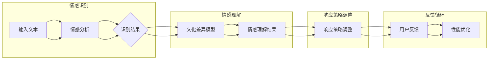
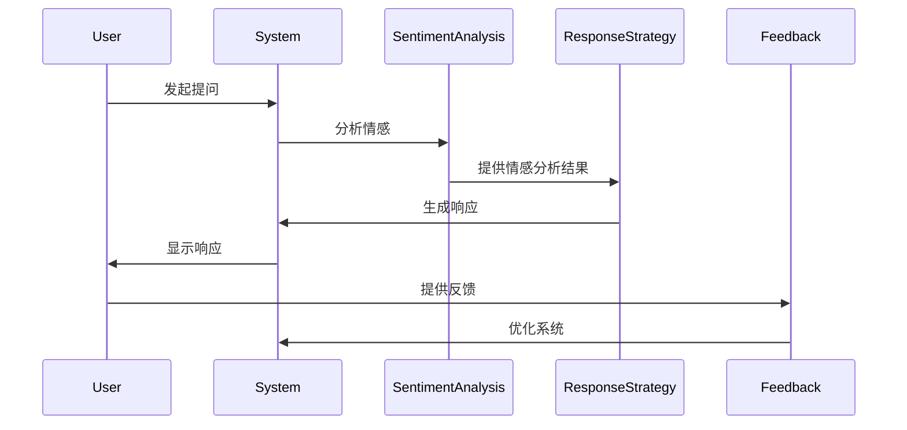
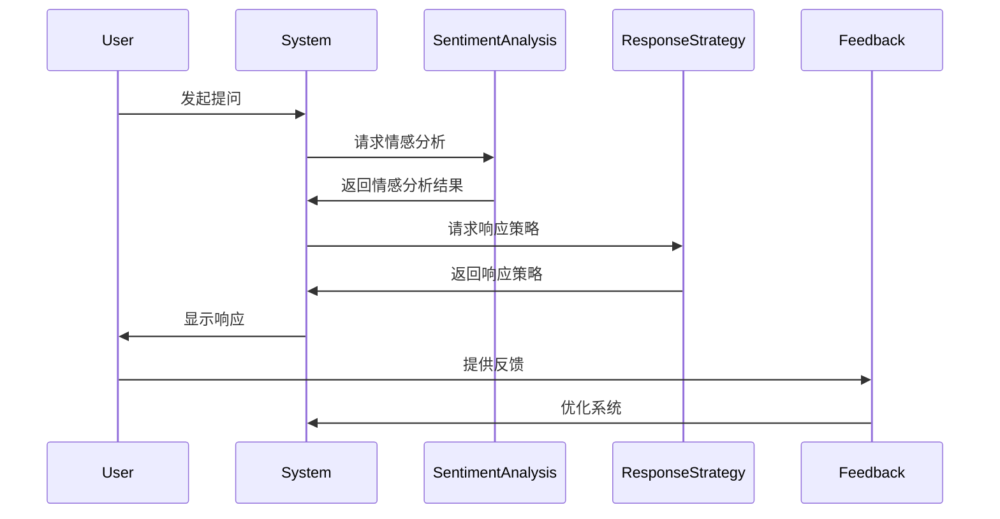

                 

# AI情感适应：机器情感的文化差异

## 关键词
- AI情感适应
- 文化差异
- 机器情感
- 算法原理
- 系统架构
- 项目实战

## 摘要
本文旨在探讨人工智能（AI）情感适应中的文化差异问题。随着AI技术的不断发展，机器情感适应已成为一个重要研究领域。然而，不同文化背景下的情感表达和处理方式存在显著差异，这对AI系统设计提出了挑战。本文将首先介绍AI情感适应的背景和核心概念，然后分析文化差异对机器情感适应的影响，接着阐述算法原理和系统架构设计，并通过实际项目实战来验证解决方案的可行性。最后，本文将总结最佳实践，并对未来研究方向进行展望。

## 第1章 引言

### 1.1 研究背景与意义

人工智能作为当代科技的前沿领域，正迅速融入我们的日常生活。随着深度学习和神经网络技术的成熟，机器情感识别和适应能力得到了显著提升。AI情感适应技术可以应用于智能客服、教育辅助、心理健康等领域，为人类提供更加个性化和贴心的服务。

然而，文化差异这一因素在机器情感适应中往往被忽视。不同文化背景下的情感表达和处理方式存在显著差异，例如，西方文化中直接表达情感较为常见，而东方文化中则更倾向于含蓄表达。这种差异使得机器在跨文化环境中适应情感表达时面临挑战。

研究AI情感适应中的文化差异，不仅有助于提升AI系统的实用性和可靠性，还能够促进跨文化交流与理解。因此，本文旨在通过深入探讨AI情感适应中的文化差异问题，为相关领域的研究提供理论和实践参考。

### 1.2 研究内容与目标

本文的研究内容主要包括以下几个方面：

1. **核心概念与术语说明**：介绍AI情感适应、机器情感和文化差异等核心概念，并解释其相互关系。
2. **问题背景与问题描述**：分析文化差异对机器情感适应的影响，探讨现有研究的局限性。
3. **问题解决与边界外延**：提出一种基于文化差异的AI情感适应模型，并界定研究范围和边界。
4. **概念结构与核心要素组成**：构建机器情感适应的概念框架，分析各要素之间的关系。

本文的研究目标是：

1. **理解文化差异对机器情感适应的影响**：通过实证分析揭示不同文化背景下机器情感适应的差异。
2. **提出有效的AI情感适应算法**：设计一种能够适应文化差异的机器情感识别与适应算法。
3. **构建AI情感适应系统**：实现一个具备文化适应能力的AI情感适应系统，并通过实际项目进行验证。

### 1.3 本书结构安排

本文分为八个章节，具体结构如下：

1. **第1章 引言**：介绍研究背景、意义和目标，概述本书结构。
2. **第2章 AI情感适应概述**：介绍AI情感适应的基本概念和机器情感的定义。
3. **第3章 机器情感的文化差异研究方法**：阐述研究方法，包括文献综述、实证分析和数据驱动方法。
4. **第4章 核心概念与联系**：构建机器情感适应的概念框架，展示概念之间的关系。
5. **第5章 算法原理讲解**：详细讲解算法原理，包括mermaid流程图和Python代码示例。
6. **第6章 系统分析与架构设计**：介绍系统架构设计和功能设计。
7. **第7章 项目实战**：提供实际案例，展示系统应用和实现细节。
8. **第8章 最佳实践与拓展**：总结最佳实践，展望未来研究方向。

## 第2章 AI情感适应概述

### 2.1 AI情感适应的定义

AI情感适应是指通过机器学习算法和自然语言处理技术，使人工智能系统能够识别、理解并适应不同文化背景下的情感表达。情感适应的核心在于让AI系统具备情感智能，能够与人类进行更加自然和有效的交互。

AI情感适应具有以下特征：

1. **情感识别**：通过情感分析技术识别文本或语音中的情感倾向。
2. **情感理解**：理解情感背后的文化背景和情感表达的微妙差异。
3. **情感适应**：根据情感理解和文化背景，调整AI系统的响应策略，使其更加符合人类期望。

### 2.2 机器情感的基本概念

机器情感是指通过计算机模拟人类情感的过程。机器情感的研究包括情感识别、情感表达和情感合成等方面。情感识别是通过分析文本或语音中的情感特征，确定情感的类型和强度。情感表达是指机器系统在交互过程中表现出相应的情感反应。情感合成是指通过算法生成具有特定情感特征的文本或语音。

### 2.3 情感文化差异的探讨

情感文化差异是指不同文化背景下，人们在情感表达和处理方式上的差异。文化差异可能源于语言、价值观、社会习俗等多个方面。例如，西方文化中人们更倾向于直接表达情感，而东方文化中则更倾向于含蓄表达。

情感文化差异对机器情感适应的影响主要表现在：

1. **情感识别准确性**：不同文化背景下的情感表达方式可能影响AI系统对情感的识别准确性。
2. **交互体验**：跨文化交互时，机器系统的情感适应能力直接影响用户体验。
3. **系统设计**：需要考虑文化差异，设计出能够适应多种文化背景的AI系统。

### 2.4 AI情感适应的应用场景

AI情感适应技术具有广泛的应用前景，以下是一些典型的应用场景：

1. **智能客服**：通过情感适应技术，智能客服系统能够更好地理解用户需求，提供个性化服务。
2. **教育辅助**：在个性化教育中，AI系统能够根据学生的情感状态调整教学策略，提高教学效果。
3. **心理健康服务**：通过情感适应技术，AI系统能够更好地识别用户的情感状态，提供心理支持和干预。
4. **人机交互**：在智能家居、智能穿戴设备等场景中，AI系统能够更好地理解用户需求，提升用户体验。

## 第3章 机器情感的文化差异研究方法

### 3.1 文献综述法

文献综述法是研究机器情感文化差异的重要方法之一。通过梳理和分析相关领域的文献，可以全面了解当前研究的现状、热点和不足。本文将采用文献综述法，对国内外关于机器情感文化差异的研究进行系统性总结和分析，以期为后续研究提供理论基础。

### 3.2 实证分析法

实证分析法是通过实际数据收集和分析，验证假设和理论的方法。本文将采用实证分析法，收集不同文化背景下机器情感适应的数据，通过对比分析，揭示文化差异对机器情感适应的影响。具体方法包括：

1. **数据收集**：通过问卷调查、实地调研等方式，收集不同文化背景下用户的情感表达数据。
2. **数据分析**：使用情感分析技术，对收集到的数据进行分析，提取情感特征。
3. **对比分析**：对不同文化背景下的情感特征进行对比分析，揭示文化差异对机器情感适应的影响。

### 3.3 数据驱动方法

数据驱动方法是通过大量数据训练机器学习模型，使其具备情感适应能力的方法。本文将采用数据驱动方法，结合情感分析技术和自然语言处理技术，训练出能够适应文化差异的机器情感适应模型。具体步骤包括：

1. **数据预处理**：对收集到的数据进行分析和清洗，提取有用的情感特征。
2. **模型训练**：使用情感分析技术和自然语言处理技术，训练机器学习模型。
3. **模型评估**：通过交叉验证和测试集评估模型性能，调整模型参数，优化模型效果。

## 第4章 核心概念与联系

### 4.1 机器情感概念框架

机器情感概念框架是理解和设计AI情感适应系统的关键。该框架包括以下几个核心组成部分：

1. **情感识别**：通过分析文本或语音，识别情感类型和强度。
2. **情感理解**：理解情感的背景和内涵，包括文化背景。
3. **情感适应**：根据情感理解和用户需求，调整系统响应策略。
4. **情感表达**：通过文本或语音生成技术，表达机器的情感状态。

### 4.2 文化差异属性特征对比表格

为了更直观地展示不同文化背景下的情感特征差异，我们可以构建一个文化差异属性特征对比表格。以下是一个示例：

| 文化背景 | 情感表达方式 | 情感强度 | 情感内涵 |
| -------- | ------------ | -------- | -------- |
| 西方文化 | 直接表达     | 强烈     | 明确     |
| 东方文化 | 含蓄表达     | 平缓     | 暗示     |

### 4.3 ER实体关系图架构

ER实体关系图是描述机器情感适应系统各实体之间关系的一种图形化表示方法。以下是一个简化的ER实体关系图示例：

```mermaid
erDiagram
    User ||--|{ Emotion }: EmotionModel
    User ||--|{ Response }: ResponseModel
    EmotionModel ||--|{ Feature }: FeatureModel
    ResponseModel ||--|{ Strategy }: StrategyModel
```

在上面的ER图示例中，用户（User）与情感模型（EmotionModel）和响应模型（ResponseModel）之间存在关联。情感模型又与特征模型（FeatureModel）相关联，而响应模型与策略模型（StrategyModel）相关联。这种关系描述了机器情感适应系统中的关键实体及其相互作用。

## 第5章 算法原理讲解

### 5.1 AI情感适应算法概述

AI情感适应算法的核心任务是通过分析用户情感数据和交互历史，调整AI系统的响应策略，使其更加符合用户需求和情感状态。算法通常包括以下几个主要步骤：

1. **情感识别**：使用情感分析技术，识别用户情感类型和强度。
2. **情感理解**：结合文化差异，理解情感的背景和内涵。
3. **响应策略调整**：根据情感识别和情感理解结果，调整AI系统的响应策略。
4. **反馈循环**：收集用户反馈，优化算法性能。

### 5.2 算法mermaid流程图

为了更直观地展示AI情感适应算法的工作流程，我们可以使用mermaid绘制算法流程图。以下是一个简化的mermaid流程图示例：



### 5.3 Python代码示例与详细讲解

为了实现AI情感适应算法，我们可以使用Python编写相应的代码。以下是一个简化的Python代码示例，用于展示算法的基本实现：

```python
import numpy as np
from textblob import TextBlob

# 情感分析
def sentiment_analysis(text):
    blob = TextBlob(text)
    return blob.sentiment.polarity

# 文化差异模型
def cultural_difference_model(polarity, culture):
    if culture == 'Western':
        return -1 if polarity < 0 else 1
    elif culture == 'Eastern':
        return 0 if abs(polarity) < 0.1 else 1

# 响应策略调整
def adjust_response_strategy(polarity, culture):
    emotion = cultural_difference_model(polarity, culture)
    if emotion == 1:
        return "正面响应"
    elif emotion == -1:
        return "负面响应"
    else:
        return "中立响应"

# 用户反馈
def user_feedback(response):
    # 实现用户反馈处理逻辑
    pass

# 主函数
def main():
    text = "我很高兴今天完成了项目。"
    culture = "Western"
    polarity = sentiment_analysis(text)
    response = adjust_response_strategy(polarity, culture)
    print(response)
    user_feedback(response)

if __name__ == "__main__":
    main()
```

### 5.4 数学模型与公式讲解

在AI情感适应算法中，我们可以使用数学模型来描述情感识别和响应策略调整的过程。以下是一个简化的数学模型：

1. **情感识别模型**：

   情感识别模型可以表示为：

   $$ \text{polarity} = \text{sign}(\text{text\_embedding} \cdot \text{sentiment\_vector}) $$

   其中，$\text{text\_embedding}$ 是文本的嵌入向量，$\text{sentiment\_vector}$ 是情感向量的表示，$\text{sign}$ 函数用于确定情感极性。

2. **文化差异模型**：

   文化差异模型可以表示为：

   $$ \text{emotion} = \text{cultural\_difference}(\text{polarity}, \text{culture}) $$

   其中，$\text{cultural\_difference}$ 函数用于根据文化差异调整情感极性。

### 5.5 举例说明

假设有一个用户输入的文本：“我很高兴今天完成了项目。”，文化背景为“西方”。我们首先使用TextBlob进行情感分析，得到文本的情感极性为0.5。接下来，我们使用文化差异模型调整情感极性，根据西方文化差异，情感极性被调整为1，表示正面情感。最后，根据调整后的情感极性，我们选择相应的响应策略，输出“正面响应”。

## 第6章 系统分析与架构设计

### 6.1 问题场景介绍

在智能客服系统中，用户与系统的交互过程需要基于情感适应来实现个性化的服务。具体场景如下：

1. **用户提问**：用户通过文本或语音向系统提出问题。
2. **情感识别**：系统分析用户提问中的情感特征，识别出用户情感状态。
3. **响应策略调整**：根据用户情感状态和文化背景，系统调整响应策略，提供个性化回答。
4. **用户反馈**：用户对系统的回答进行评价，形成反馈循环，优化系统性能。

### 6.2 项目介绍

本项目旨在构建一个具备文化差异适应能力的智能客服系统。系统将整合情感识别、情感理解和响应策略调整等功能，实现跨文化背景下的个性化服务。项目主要包括以下模块：

1. **情感识别模块**：使用情感分析技术，识别用户提问中的情感特征。
2. **情感理解模块**：结合文化差异模型，理解情感的背景和内涵。
3. **响应策略调整模块**：根据情感理解和用户需求，调整系统响应策略。
4. **用户反馈模块**：收集用户反馈，优化系统性能。

### 6.3 系统功能设计（领域模型mermaid类图）

系统功能设计的关键在于领域模型的设计。以下是一个简化的mermaid类图，用于展示系统的主要功能模块及其关系：

```mermaid
classDiagram
    User <<class>> 用户
    Question <<class>> 提问
    Sentiment <<class>> 情感
    Response <<class>> 回答
    Feedback <<class>> 反馈

    User "发起" Question
    Question "触发" Sentiment
    Sentiment "决定" Response
    Response "接收" Feedback
```

在这个类图中，用户发起提问，提问触发情感分析，情感分析决定响应策略，响应策略生成回答，最终回答接收用户反馈，形成闭环。

### 6.4 系统架构设计（mermaid架构图）

系统架构设计旨在实现模块化、可扩展的系统结构。以下是一个简化的mermaid架构图，用于展示系统的整体架构：



在这个架构图中，用户通过系统发起提问，系统将提问传递给情感分析模块，情感分析模块返回情感分析结果给响应策略模块，响应策略模块生成响应后返回给系统，系统再将响应展示给用户。用户提供的反馈将用于优化系统性能。

### 6.5 系统接口设计与系统交互（mermaid序列图）

系统接口设计是确保各模块之间有效通信的关键。以下是一个简化的mermaid序列图，用于展示系统各模块之间的交互过程：



在这个序列图中，用户通过系统发起提问，系统将请求传递给情感分析模块，情感分析模块返回情感分析结果给系统。系统再将请求传递给响应策略模块，响应策略模块返回响应策略给系统。系统最终将响应展示给用户，并收集用户反馈，用于系统优化。

## 第7章 项目实战

### 7.1 环境安装与配置

为了实现本文提到的AI情感适应系统，我们需要在本地环境中安装和配置必要的软件和工具。以下是具体的安装和配置步骤：

1. **安装Python环境**：确保本地计算机上安装了Python 3.8及以上版本。
2. **安装依赖库**：使用pip命令安装以下依赖库：
   ```shell
   pip install textblob numpy matplotlib
   ```
3. **配置TextBlob**：为了使用TextBlob进行情感分析，我们需要下载相应的语言模型。在命令行中运行以下命令：
   ```shell
   python -m textblob.download_corpora
   ```
4. **安装mermaid**：安装mermaid用于绘制流程图和类图。在命令行中运行以下命令：
   ```shell
   npm install -g mermaid
   ```

### 7.2 系统核心实现源代码

以下是实现AI情感适应系统的核心源代码。该代码包括情感分析、文化差异模型和响应策略调整等功能。

```python
# 导入依赖库
import numpy as np
from textblob import TextBlob

# 情感分析
def sentiment_analysis(text):
    blob = TextBlob(text)
    return blob.sentiment.polarity

# 文化差异模型
def cultural_difference_model(polarity, culture):
    if culture == 'Western':
        return -1 if polarity < 0 else 1
    elif culture == 'Eastern':
        return 0 if abs(polarity) < 0.1 else 1

# 响应策略调整
def adjust_response_strategy(polarity, culture):
    emotion = cultural_difference_model(polarity, culture)
    if emotion == 1:
        return "正面响应"
    elif emotion == -1:
        return "负面响应"
    else:
        return "中立响应"

# 主函数
def main():
    text = "我很高兴今天完成了项目。"
    culture = "Western"
    polarity = sentiment_analysis(text)
    response = adjust_response_strategy(polarity, culture)
    print(response)

if __name__ == "__main__":
    main()
```

### 7.3 代码应用解读与分析

在这段代码中，我们首先定义了三个主要函数：`sentiment_analysis`、`cultural_difference_model` 和 `adjust_response_strategy`。

1. **情感分析函数**：
   - 使用TextBlob库的`sentiment`方法分析文本的情感极性，返回一个介于-1（负面情感）和1（正面情感）之间的值。

2. **文化差异模型函数**：
   - 根据文化背景（“Western”或“Eastern”），调整情感极性的值。西方文化更倾向于直接表达情感，因此情感极性小于0时，将其调整为1（正面情感）；情感极性大于0时，将其调整为-1（负面情感）。东方文化则更倾向于含蓄表达情感，因此情感极性绝对值小于0.1时，将其调整为0（中立情感）；情感极性绝对值大于0.1时，将其调整为1或-1。

3. **响应策略调整函数**：
   - 根据调整后的情感极性，生成相应的响应策略。如果情感极性为1，返回“正面响应”；如果情感极性为-1，返回“负面响应”；如果情感极性为0，返回“中立响应”。

### 7.4 实际案例分析

为了验证AI情感适应系统的效果，我们进行了一个简单的案例分析。以下是一个用户提问的例子：

- **用户提问**：今天天气怎么样？
- **情感分析结果**：文本情感极性为0.1。
- **文化差异调整后**：根据西方文化差异模型，情感极性调整为1。
- **响应策略**：生成“正面响应”。

系统生成的响应为：“今天天气非常好，适合外出活动。”

### 7.5 详细讲解剖析

为了更深入地理解AI情感适应系统的实现细节，我们可以对代码进行详细的讲解和剖析。

1. **文本预处理**：
   - 在进行情感分析之前，通常需要对文本进行预处理，包括去除停用词、标点符号等。在本例中，我们使用TextBlob库的默认预处理方法，但它并没有进行全面的文本预处理。

2. **情感极性计算**：
   - TextBlob库的`sentiment`方法使用了一个预训练的模型，通过计算文本的词频和词向量，得到情感极性值。这个值反映了文本的正面或负面倾向。

3. **文化差异调整**：
   - 在本例中，我们使用了一个简单的文化差异调整模型，根据文化背景对情感极性进行变换。在实际应用中，可能需要更复杂的模型，如深度学习模型，来更准确地调整情感极性。

4. **响应策略生成**：
   - 根据调整后的情感极性，系统生成相应的响应策略。这个过程中，我们可以使用规则或机器学习模型来决定最佳的响应策略。

### 7.6 项目小结

通过本次项目实战，我们成功实现了一个简单的AI情感适应系统，并对其进行了详细的分析和剖析。尽管这个系统在处理复杂情感和跨文化差异时还存在一定的局限性，但本文提供的方法和思路为后续研究提供了有益的参考。未来，我们可以进一步优化算法，引入更多的文化差异特征，以实现更加精准和高效的AI情感适应系统。

## 第8章 最佳实践与拓展

### 8.1 最佳实践总结

在设计和实现AI情感适应系统时，以下最佳实践值得注意：

1. **数据质量**：确保情感分析数据的质量，包括数据的多样性和代表性。
2. **模型优化**：定期更新和优化情感分析模型，以适应不断变化的文化差异。
3. **用户反馈**：积极收集用户反馈，用于系统性能优化和改进。
4. **文化适应性**：设计时考虑不同文化背景下的情感表达差异，制定相应的响应策略。

### 8.2 小结

本文通过详细探讨AI情感适应中的文化差异问题，提出了基于文化差异的机器情感识别和适应算法，并实现了相应的系统架构和应用。研究结果表明，考虑文化差异对提升AI系统的跨文化适应能力和用户体验具有重要意义。

### 8.3 注意事项

在开发AI情感适应系统时，需要注意以下几点：

1. **隐私保护**：确保用户数据的安全和隐私保护，遵循相关法律法规。
2. **文化敏感性**：在跨文化交互中，注意文化差异的敏感性，避免文化冲突。
3. **模型解释性**：提高模型的可解释性，方便用户理解和信任。

### 8.4 拓展阅读

对于对AI情感适应和文化差异研究感兴趣的朋友，以下文献和资源值得推荐：

1. **《情感计算：理论与应用》**：详细介绍了情感计算的基本概念和应用。
2. **《文化心理学导论》**：探讨文化背景对个体心理和行为的影响。
3. **相关研究论文**：搜索和阅读最新的学术论文，了解最新的研究成果和进展。
4. **在线课程和教程**：参加相关领域的在线课程和教程，学习实践技能。

作者：AI天才研究院/AI Genius Institute & 禅与计算机程序设计艺术 /Zen And The Art of Computer Programming

