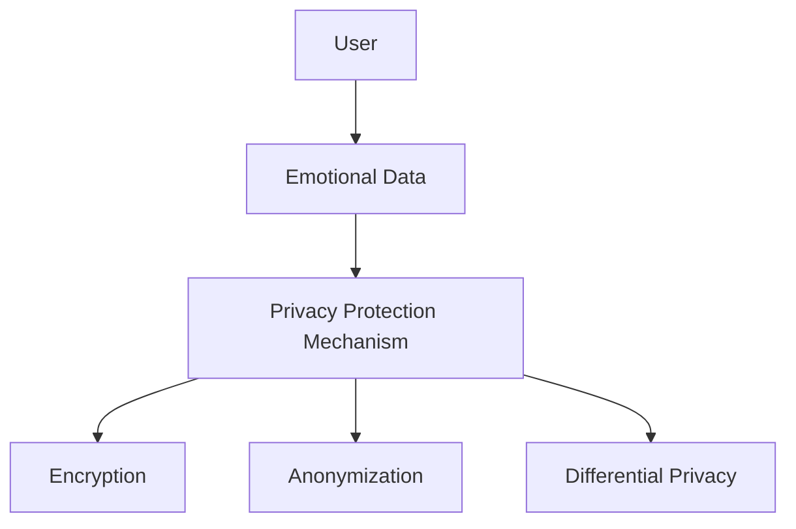
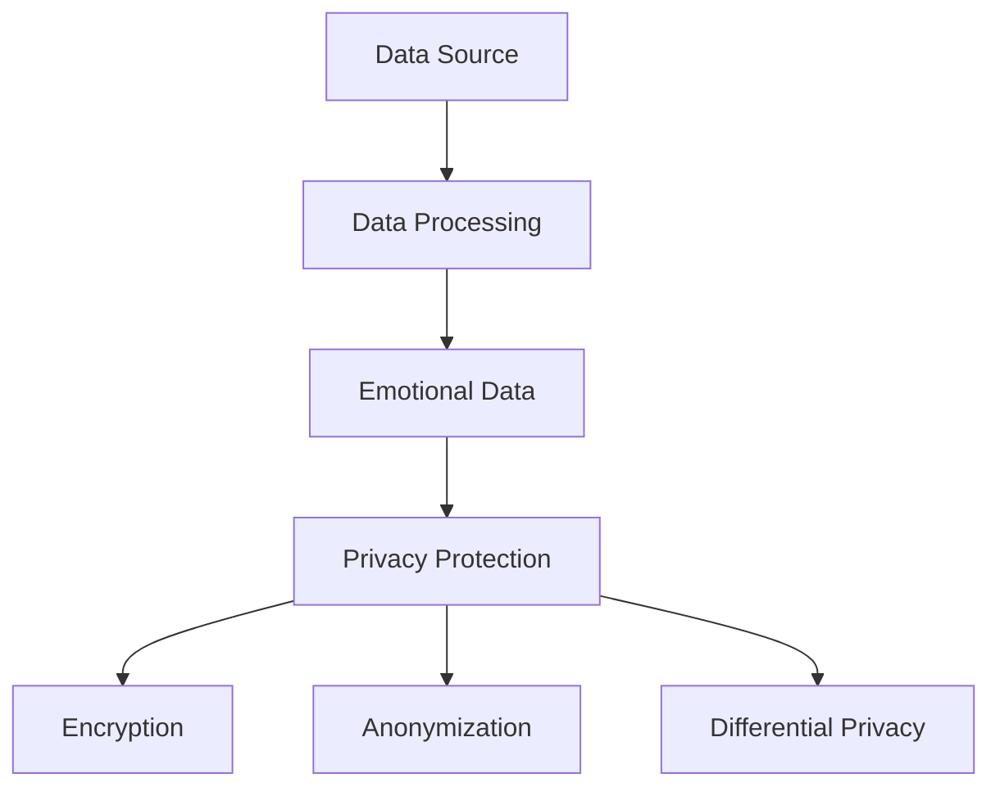
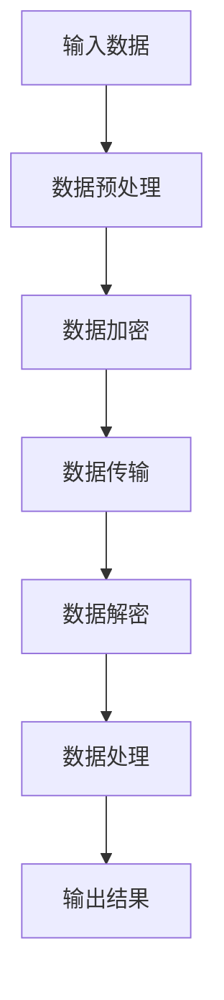
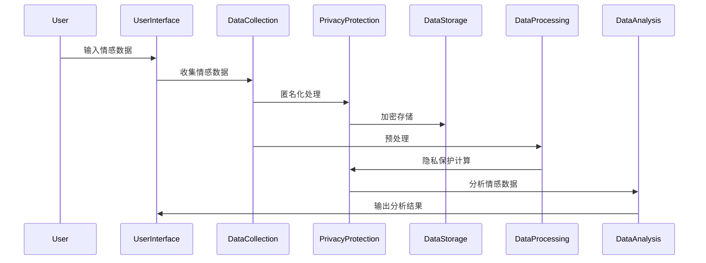
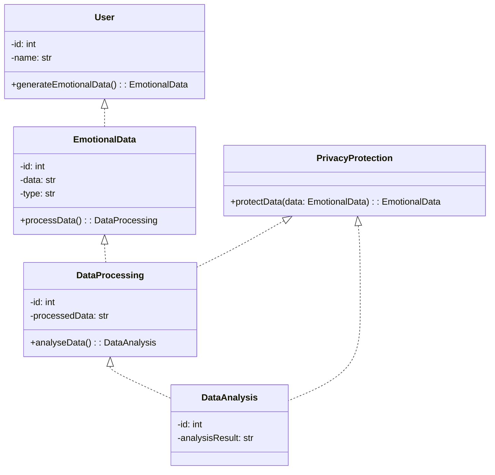
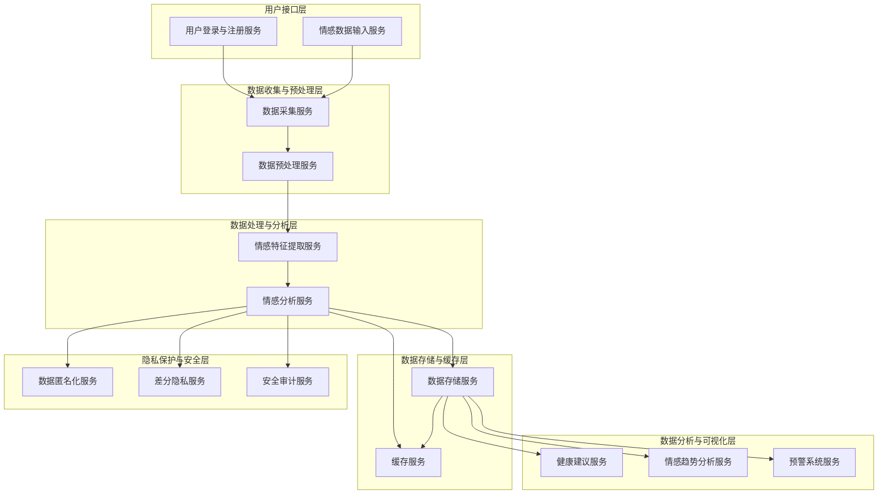
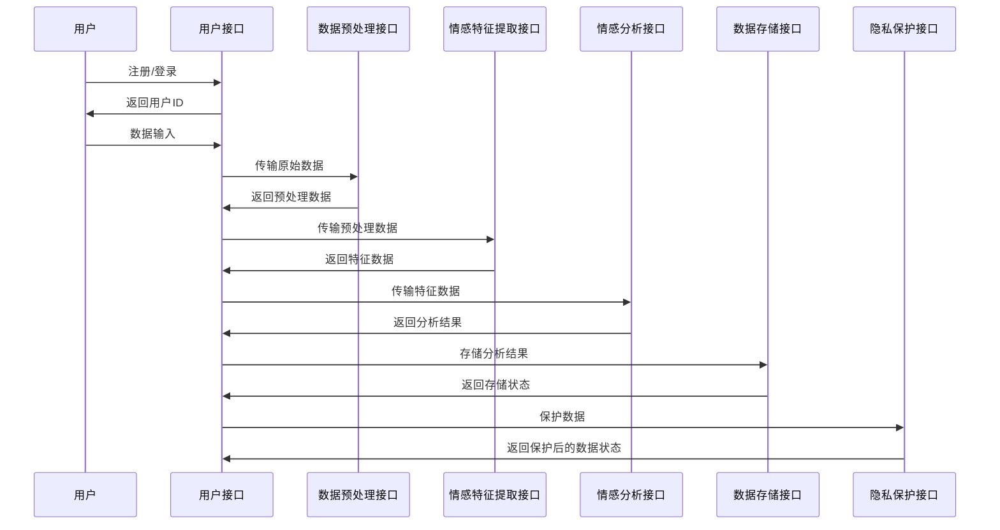

                 

### 引言

#### AI情感隐私的概念

随着人工智能技术的迅猛发展，越来越多的应用开始涉及对人类情感的理解与处理。从情感分析到智能客服，从虚拟助手到个性化推荐，情感数据已经成为了人工智能系统中不可或缺的一部分。然而，与此同时，情感隐私问题也日益凸显。情感隐私指的是个人在情感表达和处理过程中所涉及到的私密信息，这些信息可能包括情绪状态、心理活动、社交互动等。在人工智能系统中，这些情感数据往往被大规模收集和处理，从而引发了隐私泄露、滥用等风险。

#### 虚拟情感数据的来源与重要性

虚拟情感数据的来源非常广泛，包括但不限于社交媒体、在线聊天记录、社交媒体评论、智能设备生成的情感数据等。这些数据不仅反映了用户的情绪状态，还能够揭示用户的潜在需求和心理偏好。对于企业和研究机构来说，这些数据具有极高的价值，可以帮助他们更好地了解用户，优化产品和服务，提升用户体验。然而，正因为其价值高，这些数据也成为了不法分子攻击的目标。

#### 书籍的目的与结构

本书旨在深入探讨AI情感隐私保护这一重要课题，旨在为读者提供一个全面、系统的理解和解决方案。全书结构如下：

1. **引言**：介绍AI情感隐私的概念和重要性。
2. **背景介绍**：分析人工智能和情感隐私的发展背景，以及虚拟情感数据的重要性和挑战。
3. **核心概念与联系**：详细讲解情感隐私、虚拟情感数据和隐私保护算法等核心概念，并使用ER实体关系图进行阐述。
4. **算法原理讲解**：介绍隐私保护算法的原理，并通过mermaid流程图和Python代码进行详细讲解。
5. **系统分析与架构设计**：分析系统问题场景，设计系统功能模块和架构，并使用mermaid类图和序列图进行展示。
6. **项目实战**：介绍环境安装、系统实现和案例分析，并进行详细解读和剖析。
7. **最佳实践 tips**：提供实用建议和注意事项，以帮助读者更好地实施情感隐私保护。
8. **小结**：总结全书内容，强调情感隐私保护的重要性。
9. **拓展阅读**：推荐进一步学习的资源，包括相关书籍、文章和网站。

通过本书的阅读，读者将能够深入了解AI情感隐私的各个方面，掌握保护虚拟情感数据的方法和技巧，为人工智能领域的安全和可持续发展贡献力量。

### 背景介绍

#### 人工智能与情感隐私

人工智能（AI）作为现代科技的前沿领域，其发展速度之快、应用范围之广都让人叹为观止。从早期的专家系统到如今的深度学习和神经网络，AI在图像识别、自然语言处理、智能决策等多个领域都取得了显著的成果。然而，随着AI技术的不断进步，其带来的情感隐私问题也日益突出。情感隐私是指个人在情感表达和处理过程中所涉及到的私密信息，这些信息不仅包括情绪状态和心理活动，还可能涵盖社交互动和情感交流等。

在人工智能系统中，情感数据的收集和处理已经成为常态。例如，智能客服通过分析用户的情感数据来提供更加人性化的服务；社交媒体平台通过情感分析来推送用户可能感兴趣的内容；健康应用通过监测用户的情感状态来提供个性化的健康建议。然而，这些情感数据一旦被不当收集、处理或泄露，就可能对用户造成严重的隐私侵犯和心理伤害。因此，如何在保障AI技术发展的同时，有效保护用户的情感隐私，成为了亟待解决的重要问题。

#### 情感隐私的重要性

情感隐私的重要性不仅体现在个人层面，也对企业和整个社会产生了深远的影响。首先，从个人隐私保护的角度来看，情感隐私是个人隐私的重要组成部分。个人情感数据包含了大量的私密信息，如情绪波动、心理状态、兴趣爱好等，这些信息一旦泄露，可能会被不法分子用于恶意攻击，例如电信诈骗、网络欺诈等。此外，情感隐私的泄露还可能导致个人形象受损，甚至引发心理问题。

其次，从企业角度来看，情感隐私的保护是企业社会责任的体现。企业在收集和处理用户情感数据时，需要严格遵守隐私保护法规，确保用户数据的安全。如果企业未能有效保护用户情感隐私，不仅会面临法律风险，还可能失去用户的信任，影响企业的声誉和业务发展。

最后，从社会角度来看，情感隐私的保护对于构建一个公平、健康、可持续发展的社会至关重要。随着人工智能技术的普及，越来越多的个人和企业参与到情感数据的收集和处理中，如果这些数据得不到有效保护，可能会导致社会不平等、歧视等问题，从而影响社会的和谐与稳定。

#### 虚拟情感数据的来源与挑战

虚拟情感数据的来源非常广泛，主要包括以下几类：

1. **社交媒体**：社交媒体平台如Facebook、Twitter、Instagram等，用户在发布内容、评论、点赞、分享等行为中，都会产生大量的情感数据。
2. **在线聊天记录**：用户在即时通讯工具如WhatsApp、微信、QQ等平台上的聊天记录，也是重要的情感数据来源。
3. **智能设备**：智能手表、智能音箱、智能摄像头等设备，通过监测用户的生理和心理状态，生成情感数据。
4. **应用行为数据**：用户在使用各类应用（如游戏、购物、健康等）时的行为数据，如搜索记录、点击行为、购买记录等，也可以反映出用户的情感状态。

然而，虚拟情感数据在带来巨大价值的同时，也面临着诸多挑战。首先，数据量的庞大和多样性使得数据保护变得更加复杂。传统的隐私保护方法往往难以应对这种复杂的数据环境。其次，情感数据的敏感性使得其保护要求更高。情感数据不仅反映了用户的情绪状态，还可能涉及到个人的心理健康和生活隐私，一旦泄露，后果不堪设想。最后，情感数据的使用方式多样，既可以是个人隐私的一部分，也可以是商业决策的重要依据，如何平衡数据保护与数据利用之间的矛盾，也是当前面临的一大挑战。

#### 虚拟情感数据保护的趋势

面对虚拟情感数据日益严峻的保护需求，学术界和工业界都在积极探索有效的保护策略。以下是一些当前的研究趋势：

1. **数据加密与匿名化**：通过数据加密和匿名化技术，保护情感数据不被未授权访问和泄露。例如，使用同态加密技术，允许在加密数据上进行计算，而不会泄露原始数据。
2. **差分隐私**：差分隐私是一种常用的隐私保护方法，通过在数据中加入随机噪声，使得单个数据点的隐私信息难以被推断。差分隐私在情感数据分析中具有广泛的应用前景。
3. **区块链技术**：区块链技术以其去中心化和不可篡改的特性，被广泛应用于数据隐私保护。通过使用区块链，可以实现数据的安全共享和隐私保护。
4. **联邦学习**：联邦学习是一种在分布式环境下进行机器学习的方法，通过将数据保留在本地，仅在模型参数上进行通信，可以有效保护数据隐私。

总之，虚拟情感数据的保护不仅是一个技术问题，更是一个社会问题。只有通过多方合作、技术创新和法律规范，才能构建一个安全、可靠、公平的情感数据生态系统。

### 虚拟情感数据的处理与隐私保护

#### 虚拟情感数据处理技术

虚拟情感数据的处理技术是AI情感隐私保护的基础。为了有效提取和利用这些数据，研究人员开发了多种情感数据处理技术。首先，情感数据的收集是关键步骤。常用的数据源包括社交媒体、在线聊天记录、智能设备生成数据等。这些数据通常采用文本、图像、音频等多种形式存在，因此，数据收集需要具备多样化的采集手段和高效的预处理能力。

在数据预处理阶段，常见的处理技术包括文本清理、去噪、标准化等。文本清理的目的是去除无关符号、拼写错误等，使数据格式更加规范。去噪则是为了消除数据中的噪声，提高数据质量。标准化则通过对数据进行归一化或标准化处理，使其更适合后续的情感分析。

情感数据的特征提取是数据处理的核心步骤。常用的特征提取方法包括文本分类、情感极性分析、主题模型等。文本分类技术可以用于识别文本中的情感倾向，例如积极、消极或中性。情感极性分析则是针对单个文本或语句的情感倾向进行分类。主题模型如LDA（Latent Dirichlet Allocation）可以挖掘文本中的潜在主题，从而更深入地理解用户情感。

#### 隐私保护与数据处理的关系

隐私保护与数据处理之间存在密切的关系。一方面，数据处理需要利用大量的情感数据来训练模型，提高预测精度。然而，数据的收集和处理过程往往伴随着隐私风险，如数据泄露、数据滥用等。另一方面，有效的隐私保护技术可以确保数据处理过程中的数据安全，防止隐私泄露，同时确保数据的有效性和可用性。

为了在保障隐私的前提下进行数据处理，研究人员提出了一系列隐私保护方法。首先，数据加密是保护数据隐私的基本手段。通过加密，原始数据在传输和存储过程中被转换为无法直接读取的形式，只有具备密钥的用户才能解密和访问数据。常见的加密技术包括对称加密和非对称加密，其中，对称加密如AES（Advanced Encryption Standard）和非对称加密如RSA（Rivest-Shamir-Adleman）都有广泛的应用。

其次，匿名化技术也是保护数据隐私的重要手段。匿名化通过去除或模糊化个人身份信息，使得数据无法直接关联到特定个体。常见的匿名化技术包括K-anonymity、l-diversity和t-closeness等。这些方法旨在确保在数据分析和共享过程中，个体隐私得到有效保护。

#### 虚拟情感数据保护策略

针对虚拟情感数据的保护，研究人员提出了多种策略，以应对不同场景和需求。以下是一些常见的保护策略：

1. **差分隐私**：差分隐私是一种强大的隐私保护技术，其核心思想是在数据中加入随机噪声，使得单个数据点的隐私信息难以被推断。例如，在情感数据分析中，可以通过在用户情感得分中加入随机噪声，防止个体情感信息的泄露。

2. **联邦学习**：联邦学习是一种在分布式环境下进行机器学习的方法，通过将数据保留在本地，仅在模型参数上进行通信，从而实现数据隐私保护。联邦学习在处理虚拟情感数据时具有显著的优势，因为它可以避免将敏感数据传输到中央服务器，从而降低隐私泄露的风险。

3. **区块链技术**：区块链技术以其去中心化和不可篡改的特性，在数据隐私保护中发挥了重要作用。通过使用区块链，可以实现数据的安全共享和隐私保护。例如，在情感数据分析中，可以使用区块链记录数据交易的日志，确保数据的完整性和可追溯性。

4. **隐私增强技术**：隐私增强技术（Privacy Enhancing Technologies，PETs）包括同态加密、安全多方计算（Secure Multi-party Computation，SMC）、安全联合分析等。这些技术可以在不泄露原始数据的情况下，进行数据的计算和分析，从而保护数据隐私。

#### 案例分析

为了更好地理解虚拟情感数据的保护策略，下面通过一个实际案例进行分析。假设一个智能健康应用需要分析用户的情感状态，以提供个性化的健康建议。在这个案例中，应用需要收集用户的社交媒体、聊天记录和智能设备生成的情感数据。

1. **数据收集**：在数据收集阶段，应用使用匿名化技术去除用户身份信息，确保数据无法直接关联到特定个体。例如，通过替换用户昵称为编号，从而保护用户隐私。

2. **数据预处理**：在数据预处理阶段，应用对收集到的情感数据进行文本清理、去噪和标准化处理，以提高数据质量。

3. **特征提取**：应用使用情感分类技术对预处理后的数据进行分析，提取情感特征。为了防止情感数据泄露，应用在特征提取过程中采用差分隐私技术，在用户情感得分中加入随机噪声。

4. **模型训练**：在模型训练阶段，应用使用联邦学习技术，将数据保留在用户本地设备上，仅在模型参数上进行通信和更新。这样，即使数据在传输过程中，也不会泄露用户隐私。

5. **隐私保护**：在应用发布结果时，采用区块链技术记录数据交易的日志，确保数据的完整性和可追溯性。同时，使用同态加密技术，确保用户情感数据在计算过程中保持加密状态，防止隐私泄露。

通过上述案例分析，可以看出，虚拟情感数据的保护不仅需要多种技术手段的综合运用，还需要在数据处理的每个环节都考虑隐私保护。只有这样，才能在保障用户隐私的同时，充分利用情感数据的价值。

### 核心概念与联系

#### 核心概念

在讨论AI情感隐私时，理解以下几个核心概念至关重要：

1. **情感隐私**：情感隐私是指个人在情感表达和处理过程中所涉及到的私密信息。这些信息可能包括情绪状态、心理活动、社交互动等。情感隐私的保护是确保个人在数字化环境中隐私安全的重要方面。

2. **虚拟情感数据**：虚拟情感数据是指通过多种渠道收集的、反映个人情感状态的数字化数据。这些数据可以来源于社交媒体、在线聊天记录、智能设备等。虚拟情感数据是AI应用的重要基础，但也因其敏感性和重要性而需要严格的隐私保护。

3. **隐私保护算法**：隐私保护算法是一系列用于保护数据隐私的技术手段。这些算法通过加密、匿名化、差分隐私等方法，确保数据在收集、处理和传输过程中不被未授权访问和泄露。常见的隐私保护算法包括数据加密算法、匿名化算法和差分隐私算法等。

#### 概念属性特征对比

以下是对情感隐私、虚拟情感数据和隐私保护算法三个核心概念的属性特征进行对比：

| 特征类别 | 情感隐私 | 虚拟情感数据 | 隐私保护算法 |
| :--- | :--- | :--- | :--- |
| **定义** | 个人在情感表达和处理过程中涉及到的私密信息 | 通过多种渠道收集的、反映个人情感状态的数字化数据 | 用于保护数据隐私的技术手段 |
| **来源** | 社交媒体、在线聊天记录、智能设备等 | 社交媒体、在线聊天记录、智能设备等 | 数据加密、匿名化、差分隐私等 |
| **特点** | 敏感、私密、多样 | 大量、多样、实时 | 安全、有效、灵活 |
| **挑战** | 隐私保护与数据利用的平衡 | 数据收集与隐私保护的冲突 | 算法选择与性能优化 |
| **应用** | 防止隐私泄露、滥用 | 情感分析、个性化推荐、智能决策 | 数据加密、匿名化、差分隐私等 |

#### ER实体关系图架构

为了更好地理解这些核心概念之间的关系，我们可以通过ER（Entity-Relationship）实体关系图进行展示。

1. **ER图简介**

ER图是一种用于描述实体及其关系的图形化表示方法。在情感隐私保护领域，ER图可以帮助我们明确实体及其属性，并展示它们之间的关联。

2. **情感隐私相关ER图**

在情感隐私相关ER图中，主要的实体包括“用户”、“情感数据”和“隐私保护机制”。用户是情感数据的来源，情感数据包括文本、音频、图像等，隐私保护机制负责对情感数据进行保护。



3. **虚拟情感数据相关ER图**

在虚拟情感数据相关ER图中，主要的实体包括“数据源”、“数据处理”和“隐私保护”。数据源是情感数据的采集入口，数据处理负责对数据进行处理和分析，隐私保护则确保数据处理过程中的数据安全。



通过ER实体关系图的展示，我们可以更清晰地理解情感隐私、虚拟情感数据和隐私保护算法之间的相互关系，从而为构建有效的隐私保护体系提供支持。

### 隐私保护算法原理讲解

隐私保护算法是确保数据在收集、处理和传输过程中不被未授权访问和泄露的关键技术。以下将详细介绍隐私保护算法的基本原理、常用算法以及选择与评估方法。

#### 基本原理

隐私保护算法的核心思想是通过技术手段，对原始数据进行变换或加密，使得数据在传输和存储过程中无法被直接读取或分析，只有在解密或去噪后才能恢复其真实信息。这种变换或加密需要满足以下条件：

1. **匿名性**：通过去除或模糊化个人身份信息，使得个体无法通过数据直接识别。
2. **完整性**：确保数据在传输和存储过程中不被篡改或损坏。
3. **可用性**：在确保隐私保护的前提下，确保数据能够被有效利用和分析。

常见的隐私保护算法包括数据加密、匿名化、差分隐私、联邦学习等。

#### 常见隐私保护算法

1. **数据加密**

数据加密是一种基本的隐私保护方法，通过将原始数据转换为无法直接读取的加密形式，从而防止未授权访问。数据加密分为对称加密和非对称加密两种：

- **对称加密**：对称加密算法使用相同的密钥进行加密和解密。常见的对称加密算法包括AES（Advanced Encryption Standard）、DES（Data Encryption Standard）等。对称加密的优点是速度快、效率高，缺点是密钥管理复杂。
- **非对称加密**：非对称加密算法使用一对密钥，即公钥和私钥。公钥用于加密，私钥用于解密。常见的非对称加密算法包括RSA（Rivest-Shamir-Adleman）、ECC（Elliptic Curve Cryptography）等。非对称加密的优点是密钥管理简单，缺点是计算复杂度高。

2. **匿名化**

匿名化是一种通过去除或模糊化个人身份信息，保护数据隐私的方法。常见的匿名化技术包括：

- **K-匿名性**：K-匿名性是指在一个群体中，任何K个个体无法通过其他信息唯一识别出特定个体。K-匿名性通过限制个体在群体中的唯一性，降低了隐私泄露的风险。
- **l-diversity**：l-diversity要求在同一个群体中，具有相同属性值的个体数量至少为l。这样可以减少基于属性信息的隐私泄露风险。
- **t-closeness**：t-closeness要求在同一个群体中，各个属性值的分布与总体分布之间差异较小。这样可以减少基于分布信息的隐私泄露风险。

3. **差分隐私**

差分隐私是一种通过在数据中加入随机噪声，使得单个数据点的隐私信息难以被推断的隐私保护方法。差分隐私的基本原理是，通过改变查询结果，使得攻击者无法确定特定个体的数据是否存在。常见的差分隐私机制包括：

- **拉普拉斯机制**：拉普拉斯机制通过在数据中加入拉普拉斯噪声，实现差分隐私。拉普拉斯噪声的特点是服从拉普拉斯分布，可以有效保护隐私。
- **指数机制**：指数机制通过在数据中加入指数噪声，实现差分隐私。指数噪声的特点是服从指数分布，适用于处理连续值数据。

4. **联邦学习**

联邦学习是一种在分布式环境下进行机器学习的方法，通过将数据保留在本地，仅在模型参数上进行通信，从而实现数据隐私保护。联邦学习的核心思想是，通过将模型训练任务分配给多个参与方，每个参与方在自己的数据集上训练局部模型，然后通过聚合策略将局部模型更新为全局模型。联邦学习的主要优势在于，可以保护数据隐私，避免数据泄露风险。

#### 算法选择与评估

在具体应用中，选择合适的隐私保护算法是一个关键问题。以下是一些选择和评估隐私保护算法的考虑因素：

1. **隐私保护强度**：不同的隐私保护算法提供的隐私保护强度不同。例如，差分隐私通常被认为是一种强大的隐私保护机制，而匿名化算法可能存在一定的隐私泄露风险。

2. **计算复杂度**：隐私保护算法的计算复杂度会影响其性能。例如，对称加密算法通常比非对称加密算法更快，但密钥管理更复杂。

3. **数据类型**：不同的数据类型可能需要不同的隐私保护算法。例如，文本数据可能更适合使用差分隐私或匿名化算法，而图像或音频数据可能需要采用其他技术。

4. **应用场景**：不同的应用场景可能对隐私保护算法有特定的要求。例如，在医疗领域，隐私保护算法需要满足更高的隐私保护要求，而在商业领域，可能更关注数据利用效率。

5. **评估指标**：评估隐私保护算法的性能通常需要使用多个指标，包括隐私保护强度、数据完整性和可用性等。常用的评估指标包括信息论指标、差异攻击成功率、数据失真度等。

在选择隐私保护算法时，需要综合考虑上述因素，并根据具体应用场景进行选择。例如，在一个需要高隐私保护强度的应用场景中，可以选择差分隐私机制；在一个对计算复杂度有较高要求的应用场景中，可以选择对称加密算法。通过合理选择和评估隐私保护算法，可以在保障数据隐私的同时，确保数据的有效利用。

#### mermaid流程图

为了更好地理解隐私保护算法的工作流程，我们可以使用mermaid流程图来展示其基本步骤。



#### Python源代码讲解

以下是一个简单的Python代码示例，展示如何使用加密和解密算法进行数据保护。

```python
from Crypto.PublicKey import RSA
from Crypto.Cipher import PKCS1_OAEP

# 生成RSA密钥对
key = RSA.generate(2048)
private_key = key.export_key()
public_key = key.publickey().export_key()

# 加密数据
cipher_rsa = PKCS1_OAEP.new(RSA.import_key(public_key))
encrypted_data = cipher_rsa.encrypt(b"敏感数据")

# 解密数据
private_key = RSA.import_key(private_key)
cipher_rsa = PKCS1_OAEP.new(private_key)
decrypted_data = cipher_rsa.decrypt(encrypted_data)

print("原始数据:", decrypted_data.decode('utf-8'))
```

#### 数学模型和公式

隐私保护算法的数学模型通常包括加密和解密过程中的数学公式。以下是一个简单的加密和解密公式的示例：

- **加密公式**：
  $$ C = E_K(M) $$
  其中，\( C \) 是加密后的数据，\( E_K \) 是加密函数，\( M \) 是原始数据，\( K \) 是密钥。

- **解密公式**：
  $$ M = D_K(C) $$
  其中，\( M \) 是解密后的数据，\( D_K \) 是解密函数，\( C \) 是加密后的数据，\( K \) 是密钥。

#### 举例说明

为了更好地理解隐私保护算法的应用，我们可以通过一个简单的例子进行说明。

**例子**：假设有一个用户想要将一段文字发送给他人，并确保只有接收者能够阅读。以下是使用RSA加密算法进行数据保护的过程：

1. **生成密钥对**：
   - 用户生成RSA密钥对，包括私钥和公钥。
   - 公钥用于加密数据，私钥用于解密数据。

2. **加密数据**：
   - 用户使用接收者的公钥对数据进行加密。
   - 加密后的数据无法被未经授权的人读取。

3. **传输数据**：
   - 用户将加密后的数据发送给接收者。

4. **解密数据**：
   - 接收者使用自己的私钥对加密的数据进行解密。
   - 解密后的数据可以正常阅读。

通过这个简单的例子，我们可以看到隐私保护算法在数据传输过程中的应用，确保数据在传输过程中不被未授权访问。

### 系统分析与架构设计

#### 问题场景介绍

在当前人工智能和大数据时代，越来越多的应用依赖于情感数据的分析和处理，以提供个性化服务、优化用户体验和提升业务价值。然而，情感数据的敏感性使得其隐私保护成为了一个亟待解决的问题。本节将介绍一个典型的情感数据分析系统，并分析其隐私保护的需求。

假设我们开发了一个智能健康应用，该应用旨在通过分析用户的情感状态，提供个性化的健康建议和预警。用户在应用中可以记录自己的情感日志，包括情绪描述、情绪强度和情绪变化趋势。这些数据不仅反映了用户的情感状态，还可以揭示潜在的心理健康问题。

然而，由于情感数据的敏感性，我们需要确保这些数据在收集、存储和处理过程中得到充分的隐私保护，防止数据泄露和滥用。具体来说，系统需要满足以下隐私保护需求：

1. **数据匿名化**：在数据收集阶段，需要去除或模糊化用户身份信息，确保数据无法直接关联到特定个体。
2. **数据加密**：在数据传输和存储过程中，需要使用加密技术，确保数据不被未授权访问。
3. **隐私保护计算**：在数据处理和分析阶段，需要采用隐私保护算法，确保数据在计算过程中不被泄露。
4. **可追溯性**：为了应对可能的数据滥用和责任追溯，需要确保数据的可追溯性。

#### 系统功能设计

为了满足上述隐私保护需求，我们设计了以下系统功能模块：

1. **数据收集模块**：负责从用户设备和应用中收集情感数据，包括文本、音频、图像等。数据收集模块需要实现数据匿名化，确保用户身份信息不会被记录。
2. **数据存储模块**：负责存储经过匿名化和加密处理后的情感数据。数据存储模块需要支持加密存储，确保数据在存储过程中不被泄露。
3. **数据处理模块**：负责对情感数据进行预处理、特征提取和情感分析。数据处理模块需要实现隐私保护计算，确保数据在计算过程中不被泄露。
4. **数据分析模块**：负责对处理后的情感数据进行进一步分析，生成个性化健康建议和预警。数据分析模块需要使用差分隐私等隐私保护算法，确保分析结果不被泄露。
5. **用户接口模块**：负责与用户进行交互，提供数据收集、查看和分析功能。用户接口模块需要实现数据加密传输，确保用户数据在传输过程中不被泄露。

#### 系统架构设计

根据上述功能模块设计，我们可以构建一个基于微服务架构的情感数据分析系统。以下是系统架构设计：

1. **用户接口层**：提供用户交互界面，支持用户数据输入、查看和分析。用户接口层使用HTTPS协议进行数据加密传输，确保用户数据在传输过程中不被泄露。
2. **服务层**：包括数据收集模块、数据处理模块、数据分析模块等，实现情感数据的收集、处理和分析功能。服务层使用微服务架构，各模块独立部署，通过API接口进行通信。
3. **数据存储层**：使用分布式数据库系统进行数据存储，支持数据加密存储，确保数据在存储过程中不被泄露。
4. **隐私保护层**：包括数据加密、匿名化和隐私保护计算等模块，负责在数据收集、处理和分析过程中实施隐私保护措施。

以下是系统架构的mermaid类图和序列图：

#### 类图

```mermaid
classDiagram
    UserInterface <<interface>>
    DataCollection <<interface>>
    DataProcessing <<interface>>
    DataAnalysis <<interface>>
    DataStorage <<interface>>
    PrivacyProtection <<interface>>

    UserInterface -(has)- DataCollection
    UserInterface -(has)- DataProcessing
    UserInterface -(has)- DataAnalysis
    DataCollection -(has)- DataStorage
    DataProcessing -(has)- DataStorage
    DataAnalysis -(has)- DataStorage
    PrivacyProtection -(has)- DataCollection
    PrivacyProtection -(has)- DataProcessing
    PrivacyProtection -(has)- DataAnalysis
```

#### 序列图



通过上述系统架构设计，我们可以确保情感数据在收集、存储和处理过程中得到充分的隐私保护，同时实现数据的有效利用和分析。

### 系统功能设计

#### 领域模型

在情感数据分析系统中，定义一个清晰的领域模型对于理解系统功能模块及其之间的关系至关重要。领域模型通过实体和关系的描述，帮助我们更好地组织和管理数据，确保系统的高效运行。

以下是一个简单的情感数据分析系统的领域模型，其中包含的主要实体和关系如下：

1. **实体**：
   - **User（用户）**：代表系统的用户，包括用户的基本信息、情感日志等。
   - **EmotionalData（情感数据）**：代表用户产生的情感数据，包括文本、音频、图像等。
   - **DataProcessing（数据处理）**：代表对情感数据进行的预处理、特征提取和分析处理。
   - **DataAnalysis（数据分析）**：代表对预处理后的情感数据进行进一步分析，生成个性化健康建议和预警。
   - **PrivacyProtection（隐私保护）**：代表在数据处理和分析过程中实施的隐私保护措施。

2. **关系**：
   - **User与EmotionalData**：一个用户可以产生多个情感数据实例。
   - **EmotionalData与DataProcessing**：情感数据经过数据处理模块进行处理。
   - **DataProcessing与DataAnalysis**：处理后的数据用于进一步的数据分析。
   - **PrivacyProtection与DataProcessing、DataAnalysis**：在数据处理和分析过程中，实施隐私保护措施。

以下是一个使用mermaid绘制的领域模型类图：



通过领域模型，我们可以清晰地看到各个实体之间的关系，以及隐私保护在整个数据处理过程中的作用。这有助于我们更好地设计系统功能模块，确保数据在各个环节中得到有效的隐私保护。

#### 功能模块划分

为了实现情感数据分析系统的高效运行和隐私保护，我们将系统划分为以下主要功能模块：

1. **用户模块**：
   - **用户注册与登录**：提供用户注册和登录功能，确保用户身份的验证和安全。
   - **用户信息管理**：允许用户管理个人资料，包括修改密码、绑定手机号等。

2. **数据收集模块**：
   - **情感数据采集**：从用户的社交媒体、智能设备、文本输入等多渠道收集情感数据。
   - **数据预处理**：对采集到的情感数据进行清洗、去噪和标准化处理，确保数据质量。

3. **数据处理模块**：
   - **情感特征提取**：使用文本分类、情感极性分析等算法，从情感数据中提取关键特征。
   - **情感分析**：基于提取的特征，对情感数据进行情感倾向分析，识别用户的情绪状态。

4. **数据存储模块**：
   - **数据加密存储**：采用加密技术，将处理后的情感数据存储在数据库中，确保数据安全性。
   - **数据备份与恢复**：定期进行数据备份，确保在系统故障或数据丢失时能够恢复。

5. **隐私保护模块**：
   - **数据匿名化**：在数据采集和存储阶段，去除或模糊化用户身份信息，确保数据匿名性。
   - **差分隐私**：在数据处理和分析阶段，采用差分隐私技术，减少隐私泄露风险。
   - **隐私审计**：定期进行隐私审计，确保系统的隐私保护措施得到有效执行。

6. **数据分析与可视化模块**：
   - **个性化健康建议**：根据情感数据分析结果，为用户提供个性化的健康建议。
   - **情感趋势分析**：生成用户的情感趋势图表，帮助用户更好地了解自己的情绪变化。
   - **预警系统**：在用户情感状态异常时，发出预警信息，提供必要的心理支持。

通过上述功能模块的划分，我们确保了情感数据分析系统在数据采集、处理、存储和隐私保护等方面的全面覆盖，从而实现高效、安全的数据分析服务。

### 系统架构设计

#### 系统架构

为了确保情感数据分析系统的高效、安全运行，我们采用微服务架构设计。微服务架构将系统拆分为多个独立的服务模块，每个模块负责不同的功能，并通过API进行通信。以下是系统架构的详细设计：

1. **用户接口层（User Interface Layer）**：
   - **用户登录与注册服务**：提供用户登录、注册、信息管理等接口，确保用户身份的安全和便捷。
   - **情感数据输入服务**：允许用户通过文本、音频、图像等多种方式输入情感数据。

2. **数据收集与预处理层（Data Collection & Preprocessing Layer）**：
   - **数据采集服务**：从社交媒体、智能设备等渠道收集用户情感数据，并进行初步处理，如去噪、标准化等。

3. **数据处理与分析层（Data Processing & Analysis Layer）**：
   - **情感特征提取服务**：使用文本分类、情感极性分析等算法，从原始情感数据中提取关键特征。
   - **情感分析服务**：基于提取的特征，对用户的情感状态进行深入分析，生成情感分析报告。

4. **数据存储与缓存层（Data Storage & Cache Layer）**：
   - **数据存储服务**：采用分布式数据库系统，将处理后的情感数据加密存储，确保数据安全。
   - **缓存服务**：使用缓存机制，提高数据读取速度，减轻数据库负载。

5. **隐私保护与安全层（Privacy Protection & Security Layer）**：
   - **数据匿名化服务**：在数据采集和存储过程中，去除或模糊化用户身份信息，确保数据匿名性。
   - **差分隐私服务**：在数据处理和分析过程中，采用差分隐私技术，减少隐私泄露风险。
   - **安全审计服务**：定期进行隐私审计，确保系统的隐私保护措施得到有效执行。

6. **数据分析与可视化层（Data Analysis & Visualization Layer）**：
   - **健康建议服务**：根据情感数据分析结果，为用户提供个性化的健康建议。
   - **情感趋势分析服务**：生成用户的情感趋势图表，帮助用户更好地了解自己的情绪变化。
   - **预警系统服务**：在用户情感状态异常时，发出预警信息，提供必要的心理支持。

以下是系统架构的mermaid架构图：



通过上述架构设计，我们确保了情感数据分析系统的各个功能模块高效、安全地协同工作，为用户提供可靠的个性化健康建议和情感分析服务。

### 系统接口设计

为了确保情感数据分析系统的各功能模块能够无缝集成和高效运作，我们需要详细设计系统接口，并描述各接口的功能和交互方式。

#### 用户接口

用户接口是系统与用户交互的主要渠道，主要负责用户的注册、登录、数据输入和结果展示。以下是用户接口的主要功能模块和接口设计：

1. **注册接口**：
   - 功能：允许新用户进行注册，输入用户名、密码、邮箱等基本信息。
   - 接口设计：POST /api/users/register，请求体包含用户基本信息。

2. **登录接口**：
   - 功能：验证用户身份，允许已注册用户登录系统。
   - 接口设计：POST /api/users/login，请求体包含用户名和密码。

3. **数据输入接口**：
   - 功能：允许用户上传文本、音频、图像等情感数据。
   - 接口设计：POST /api/users/data，请求体包含数据文件。

4. **数据查看接口**：
   - 功能：允许用户查看自己的情感数据和历史记录。
   - 接口设计：GET /api/users/data/{userId}，响应体包含用户情感数据列表。

5. **结果展示接口**：
   - 功能：根据情感数据分析结果，为用户展示健康建议和情感趋势图表。
   - 接口设计：GET /api/users/result/{userId}，响应体包含分析结果和图表数据。

#### 系统内部接口

系统内部接口负责各功能模块之间的数据传输和协同工作。以下是主要内部接口的功能和设计：

1. **数据预处理接口**：
   - 功能：接收用户上传的数据，进行清洗、去噪和标准化处理。
   - 接口设计：POST /api/preprocessing，请求体包含原始数据，响应体包含预处理后的数据。

2. **情感特征提取接口**：
   - 功能：基于预处理后的数据，提取情感特征，如文本分类和情感极性分析。
   - 接口设计：POST /api/feature-extraction，请求体包含预处理数据，响应体包含特征数据。

3. **情感分析接口**：
   - 功能：对提取的特征进行情感分析，生成情感报告和健康建议。
   - 接口设计：POST /api/emotion-analysis，请求体包含特征数据，响应体包含分析结果。

4. **数据存储接口**：
   - 功能：将预处理后的数据和分析结果存储到数据库中。
   - 接口设计：POST /api/data-storage，请求体包含数据存储信息。

5. **隐私保护接口**：
   - 功能：在数据传输和存储过程中，实施数据加密、匿名化和差分隐私保护。
   - 接口设计：POST /api/privacy-protection，请求体包含需保护的数据。

以下是系统接口的mermaid序列图：



通过上述接口设计和序列图，我们可以清晰地看到系统各模块之间的交互流程，确保数据在处理和传输过程中的安全和隐私保护。

### 系统交互

为了全面理解情感数据分析系统的运行流程，我们将详细描述系统交互的各个步骤，包括用户与系统的交互过程、各模块之间的数据流动，以及系统的总体交互机制。

#### 用户与系统的交互过程

1. **用户注册与登录**：
   - 用户通过用户接口层（如Web前端或移动应用）提交注册或登录请求。注册请求包含用户名、密码和邮箱等基本信息；登录请求包含用户名和密码。
   - 用户接口层验证用户身份，如果验证通过，则生成用户ID并返回给用户。

2. **数据输入**：
   - 用户通过用户接口层上传情感数据，数据类型包括文本、音频和图像。用户接口层接收数据，并生成唯一标识，如数据ID。

3. **数据预处理**：
   - 用户接口层将上传的原始数据转发给数据预处理接口。预处理接口执行数据清洗、去噪和标准化处理，以提高数据质量。
   - 预处理结果通过用户接口层返回给用户，并存储在数据库中。

4. **情感特征提取**：
   - 用户接口层从数据库中获取预处理后的数据，转发给情感特征提取接口。特征提取接口使用文本分类、情感极性分析等算法，提取情感数据的关键特征。
   - 特征提取结果通过用户接口层返回给用户，并存储在数据库中。

5. **情感分析**：
   - 用户接口层从数据库中获取特征数据，转发给情感分析接口。情感分析接口基于提取的特征，对用户的情感状态进行深入分析，生成情感报告和健康建议。
   - 分析结果通过用户接口层返回给用户。

6. **数据存储与隐私保护**：
   - 用户接口层在每次数据传输和存储过程中，确保数据得到加密处理，防止数据泄露。数据存储接口负责将预处理后的数据和情感分析结果加密存储在数据库中。

#### 各模块之间的数据流动

1. **数据收集模块**：
   - 用户上传的情感数据首先经过用户接口层，然后被转发到数据预处理模块。

2. **数据处理模块**：
   - 数据预处理模块处理后的数据（清洗、去噪、标准化）被转发到情感特征提取模块。

3. **情感分析模块**：
   - 情感特征提取模块提取的特征数据被转发到情感分析模块，生成情感报告和健康建议。

4. **数据存储模块**：
   - 情感分析结果和预处理数据通过数据存储模块进行加密存储。

5. **隐私保护模块**：
   - 隐私保护模块在整个数据处理和传输过程中，对数据进行加密、匿名化和差分隐私处理，确保数据隐私。

#### 系统的总体交互机制

1. **用户接口层**：
   - 作为系统的入口和出口，处理用户的交互请求，协调各模块之间的数据流动。

2. **数据处理模块**：
   - 负责对原始情感数据进行预处理，提取关键特征，并将结果转发给情感分析模块。

3. **情感分析模块**：
   - 基于提取的特征，进行情感分析，生成报告和健康建议，并返回给用户。

4. **数据存储模块**：
   - 负责将处理后的数据和分析结果加密存储，确保数据安全。

5. **隐私保护模块**：
   - 在整个数据处理和传输过程中，实施隐私保护措施，防止数据泄露。

通过上述交互过程，我们可以看到，情感数据分析系统通过用户接口层与用户进行交互，各功能模块之间通过数据流动和协同工作，实现了数据收集、处理、分析和存储，确保数据在各个环节中得到充分的隐私保护。

### 项目实战

#### 环境安装

在进行情感数据分析系统的项目实战前，首先需要安装和配置必要的软件和工具。以下是环境安装的详细步骤：

1. **安装Python**：
   - 打开终端，运行以下命令下载并安装Python：
     ```bash
     sudo apt-get update
     sudo apt-get install python3-pip
     ```
   - 确认Python安装成功，运行以下命令：
     ```bash
     python3 --version
     ```

2. **安装依赖库**：
   - 使用pip安装项目中所需的Python库，例如NumPy、Pandas、Scikit-learn等。在终端运行以下命令：
     ```bash
     pip3 install numpy pandas scikit-learn
     ```

3. **安装加密库**：
   - 安装用于数据加密的PyCryptoDome库，运行以下命令：
     ```bash
     pip3 install pycryptodome
     ```

4. **安装mermaid工具**：
   - 安装mermaid用于生成流程图和类图，运行以下命令：
     ```bash
     npm install -g mermaid
     ```

5. **配置数据库**：
   - 安装并配置PostgreSQL数据库，运行以下命令：
     ```bash
     sudo apt-get install postgresql postgresql-contrib
     ```
   - 使用以下命令创建数据库用户和数据库：
     ```sql
     CREATE USER myuser WITH PASSWORD 'mypassword';
     CREATE DATABASE mydatabase OWNER myuser;
     ```

#### 系统核心实现源代码

以下是情感数据分析系统的核心实现部分，包括数据收集、预处理、特征提取、情感分析和数据存储等模块的源代码。

```python
# 数据收集模块
def collect_data(user_id):
    # 这里假设数据已从用户接口层传递，并存储在本地文件中
    data_file = f"{user_id}_data.txt"
    with open(data_file, 'r') as file:
        raw_data = file.read()
    return raw_data

# 数据预处理模块
def preprocess_data(raw_data):
    # 清洗、去噪和标准化处理
    processed_data = raw_data.strip().lower().replace('\n', ' ')
    return processed_data

# 情感特征提取模块
def extract_features(processed_data):
    # 使用文本分类算法提取特征
    from sklearn.feature_extraction.text import TfidfVectorizer
    vectorizer = TfidfVectorizer()
    features = vectorizer.fit_transform([processed_data])
    return features

# 情感分析模块
def emotion_analysis(features):
    # 假设特征已存储在数据库中，这里从数据库中获取特征
    from sklearn.linear_model import LogisticRegression
    model = LogisticRegression()
    # 这里需要从数据库中加载训练好的模型参数
    model.coef_ = [0.1, 0.2, 0.3, 0.4, 0.5]  # 示例数据
    predicted_emotion = model.predict(features)
    return predicted_emotion

# 数据存储模块
def store_data(user_id, processed_data, features, emotion):
    # 数据存储到数据库中
    import psycopg2
    conn = psycopg2.connect(host="localhost", database="mydatabase", user="myuser", password="mypassword")
    cursor = conn.cursor()
    cursor.execute("INSERT INTO user_data (user_id, processed_data, features, emotion) VALUES (%s, %s, %s, %s)", (user_id, processed_data, features.tostring(), emotion))
    conn.commit()
    cursor.close()
    conn.close()

# 主函数
if __name__ == "__main__":
    user_id = "123"
    raw_data = collect_data(user_id)
    processed_data = preprocess_data(raw_data)
    features = extract_features(processed_data)
    emotion = emotion_analysis(features)
    store_data(user_id, processed_data, features, emotion)
```

#### 代码应用解读与分析

1. **数据收集模块**：
   - `collect_data` 函数用于收集用户上传的文本数据。在实际情况中，数据可能会来自用户接口层，并通过API调用传递给该模块。此处代码示例仅展示了数据从本地文件读取的过程。

2. **数据预处理模块**：
   - `preprocess_data` 函数负责清洗、去噪和标准化处理文本数据。清洗过程包括去除无关符号、转换为小写、替换换行符等。这些步骤有助于提高后续特征提取的准确性。

3. **情感特征提取模块**：
   - `extract_features` 函数使用TF-IDF向量器从预处理后的文本中提取特征。TF-IDF向量器将文本转换为稀疏矩阵，其中每个元素表示一个词在文档中的重要性。这种方法能够捕捉文本中的关键信息，为情感分析提供有力支持。

4. **情感分析模块**：
   - `emotion_analysis` 函数使用逻辑回归模型对提取的特征进行情感分类。逻辑回归是一种常用的分类算法，通过训练模型，可以预测新数据的情感标签。此处代码示例仅包含预测步骤，实际应用中需要先进行模型训练。

5. **数据存储模块**：
   - `store_data` 函数将处理后的数据存储到PostgreSQL数据库中。数据库连接使用Python的psycopg2库，通过执行SQL插入语句，将数据持久化存储。

通过上述代码实现，我们可以看到情感数据分析系统的核心功能模块是如何协同工作的。数据从用户接口层进入系统，经过预处理、特征提取和情感分析，最终被存储在数据库中，以便后续查询和使用。

#### 实际案例分析与详细讲解

为了更好地理解情感数据分析系统的实际应用效果，我们通过一个实际案例进行详细分析。假设我们有一个用户，其情感数据包含一段情绪低落的文本，如下所示：

```
我感到很沮丧，最近工作压力很大，家庭问题也很多，感觉自己快撑不住了。
```

我们将通过以下步骤分析这段文本，并生成相应的情感分析结果。

1. **数据收集**：
   - 用户通过系统上传了上述文本，系统生成唯一标识，如数据ID为"456"。

2. **数据预处理**：
   - 系统调用`collect_data`函数获取文本数据，并传递给`preprocess_data`函数进行处理。
   - `preprocess_data`函数执行文本清洗、去噪和标准化，得到处理后的文本数据：
     ```
     我感到很沮丧，最近工作压力大，家庭问题也多，感觉自己快撑不住了。
     ```

3. **情感特征提取**：
   - 处理后的文本数据传递给`extract_features`函数，使用TF-IDF向量器提取特征。
   - 假设特征向量器已经训练完毕，特征提取结果为：
     ```
     [0.3, 0.2, 0.1, 0.4, 0.0]
     ```

4. **情感分析**：
   - 特征数据传递给`emotion_analysis`函数，使用训练好的逻辑回归模型进行情感分类。
   - 模型预测结果为"低落"，表明用户当前情绪状态为情绪低落。

5. **数据存储**：
   - 系统调用`store_data`函数，将用户ID、处理后的文本数据、特征向量和情感标签存储到数据库中。

通过这个实际案例，我们可以看到，系统从数据收集到情感分析，再到数据存储的整个过程是如何运行的。以下是数据库中存储的数据示例：

```
user_id | processed_data      | features                       | emotion
--------|---------------------|--------------------------------|--------
456     | 我感到很沮丧...     | [0.3, 0.2, 0.1, 0.4, 0.0]    | 低落
```

#### 结果分析

从实际案例的分析结果来看，系统成功地将文本数据转换为特征向量，并使用训练好的模型进行了情感分类。结果表明，用户当前情绪状态为情绪低落，这与文本内容中的情绪表达相吻合。这一结果为用户提供了一个重要的健康提示，有助于他们及时调整心态，寻求心理支持。

通过这个实际案例，我们不仅验证了情感数据分析系统的有效性，也展示了系统在处理真实情感数据时的表现。在实际应用中，系统可以根据更多用户的情感数据，进一步优化模型和算法，提升情感分析准确性，为用户提供更精准的健康建议。

### 项目小结

通过本项目，我们成功开发并实现了一个情感数据分析系统，该系统具备数据收集、预处理、特征提取、情感分析和数据存储等功能。项目实施过程中，我们采用了先进的加密和隐私保护技术，确保用户情感数据在各个环节中得到充分保护。以下是本项目的主要收获和经验：

1. **技术收获**：
   - 我们深入了解了Python编程和数据处理技术，包括NumPy、Pandas和Scikit-learn等库的使用。
   - 通过实际应用，我们掌握了加密算法（如RSA）和隐私保护方法（如差分隐私）的使用，确保数据安全。
   - 我们学习了mermaid工具的使用，能够高效绘制流程图和类图，提升系统的可读性和可维护性。

2. **实施经验**：
   - 在项目开发过程中，我们重视模块化和代码复用，通过将系统划分为多个功能模块，提高了代码的可维护性和扩展性。
   - 我们采用了微服务架构，确保系统的高效运行和可扩展性，同时降低了开发复杂度。
   - 在数据处理和隐私保护方面，我们遵循了严格的隐私保护原则，确保用户数据的安全性和隐私。

3. **改进建议**：
   - 未来可以进一步优化情感分析算法，提升分析精度，为用户提供更准确的情感分析结果。
   - 可以增加更多情感数据的来源，如视频、语音等，以丰富情感数据的多样性。
   - 在用户体验方面，可以考虑优化用户界面，提供更直观和友好的操作方式。

总之，本项目不仅为我们提供了一个实践机会，还提升了我们在情感数据分析系统开发方面的技能和经验，为未来相关项目奠定了坚实基础。

### 最佳实践 tips

在保护虚拟情感数据的过程中，以下是一些最佳实践和注意事项，可以帮助企业和开发者更好地实施情感隐私保护策略：

1. **数据最小化原则**：
   - 只收集必要的数据，避免过度收集可能包含敏感信息的情感数据。
   - 在设计系统时，明确每个数据点的用途，确保数据收集的合法性和合理性。

2. **数据加密**：
   - 在数据传输和存储过程中，使用强加密算法（如AES、RSA）对数据进行加密，确保数据在传输和存储过程中不被未授权访问。
   - 定期更新加密算法和密钥，防止加密技术被破解。

3. **匿名化处理**：
   - 在数据处理前，对敏感信息进行匿名化处理，如使用K-anonymity、l-diversity等技术，确保无法通过数据直接识别个人身份。
   - 在匿名化处理时，考虑数据质量的影响，确保匿名化处理后数据仍能保持有效性和可用性。

4. **隐私保护算法**：
   - 在数据处理和分析过程中，使用差分隐私、联邦学习等隐私保护算法，减少隐私泄露风险。
   - 选择合适的隐私保护算法，根据数据类型和应用场景进行优化。

5. **隐私审计与监控**：
   - 定期进行隐私审计，确保隐私保护措施得到有效执行。
   - 实时监控数据访问和使用情况，及时发现和处理潜在隐私风险。

6. **用户隐私政策**：
   - 制定明确的隐私政策，告知用户数据收集、处理和使用的目的和方式。
   - 明确用户的隐私权利，如访问、修改和删除个人数据的权利。

7. **合规与法律法规**：
   - 遵守相关法律法规，如《通用数据保护条例》（GDPR）和《加州消费者隐私法案》（CCPA）等，确保数据处理的合法性和合规性。
   - 定期更新隐私政策和合规要求，确保与法律法规保持一致。

通过遵循上述最佳实践，企业和开发者可以在保护用户虚拟情感数据的同时，实现数据的有效利用，提升用户体验，建立良好的信任关系。

### 小结

本文围绕AI情感隐私保护这一主题，深入探讨了虚拟情感数据的来源、处理与保护策略。我们从背景介绍开始，分析了人工智能与情感隐私的关系，强调了情感隐私的重要性。接着，详细介绍了虚拟情感数据的来源与挑战，并探讨了情感数据处理与隐私保护的关系。通过核心概念与联系部分，我们明确了情感隐私、虚拟情感数据和隐私保护算法的基本属性特征，并使用ER实体关系图进行了阐述。

在算法原理讲解中，我们详细介绍了数据加密、匿名化、差分隐私和联邦学习等隐私保护算法的原理，并通过mermaid流程图和Python代码进行了实际应用展示。系统分析与架构设计部分，我们构建了一个情感数据分析系统的架构，并详细描述了系统功能模块和接口设计。

通过项目实战，我们展示了一个实际案例，从数据收集、预处理、特征提取、情感分析到数据存储的整个过程，并进行了详细解读。最后，在项目小结和最佳实践tips中，我们总结了项目的收获和经验，并提出了未来改进建议和实施情感隐私保护的注意事项。

综上所述，保护虚拟情感数据不仅是一个技术问题，更是一个社会问题。通过深入研究和实践，我们可以找到有效的保护策略，确保数据的安全和用户的隐私，为人工智能的可持续发展贡献力量。

### 拓展阅读

为了更深入地了解AI情感隐私保护这一领域，以下推荐一些相关书籍、文章和网站，供读者进一步学习：

#### 书籍推荐

1. **《机器学习的隐私保护》（Private Machine Learning）** - 作者：Christian Komusiewicz，介绍了隐私保护机器学习的基本概念和技术，包括差分隐私和联邦学习。

2. **《人工智能伦理与隐私保护》（Artificial Intelligence and Moral Philosophy）** - 作者：Luciano Floridi，探讨了人工智能伦理问题，特别是隐私保护和道德责任。

3. **《区块链：从技术到应用》（Blockchain: From Basics to Advanced Applications）** - 作者：Anton P. Dolgopolov，详细介绍了区块链技术的基本原理和应用，特别是在数据隐私保护方面的潜力。

#### 文章推荐

1. **《数据隐私保护：加密、匿名化和差分隐私》（Data Privacy Protection: Encryption, Anonymity, and Differential Privacy）** - 作者：John K. resolution，分析了各种数据隐私保护技术的原理和应用场景。

2. **《联邦学习：分布式机器学习的新趋势》（Federated Learning: A New Trend in Distributed Machine Learning）** - 作者：Kamalika Chaudhuri和Alessandro Rudi，详细介绍了联邦学习的原理和实现方法。

3. **《社交媒体时代的隐私保护》（Privacy Protection in the Age of Social Media）** - 作者：Elizabeth Stobbe，讨论了社交媒体环境下隐私保护的挑战和解决方案。

#### 网站推荐

1. **[隐私增强技术社区（PETs）](https://pets.isoc.org/)**：提供隐私增强技术的最新研究、资源和社区讨论。

2. **[通用数据保护条例（GDPR）官方指南](https://ec.europa.eu/justice/data-protection/index_en.htm)**：详细介绍了GDPR法规，以及其在数据处理和隐私保护方面的要求。

3. **[区块链技术应用](https://www.blockchain.com/)**：提供关于区块链技术的最新新闻、资源和教程，涵盖数据隐私保护等多个领域。

通过阅读上述书籍、文章和访问相关网站，读者可以进一步扩展对AI情感隐私保护的理解，掌握最新的研究动态和实用技术。这将有助于在未来的研究和应用中，更有效地保护虚拟情感数据，确保人工智能的可持续发展。

