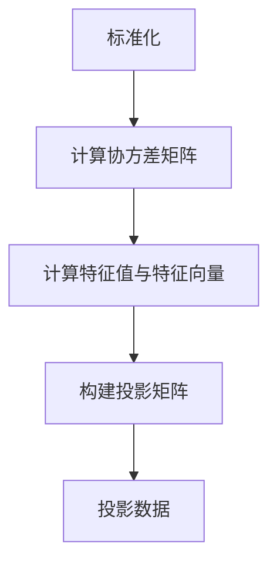
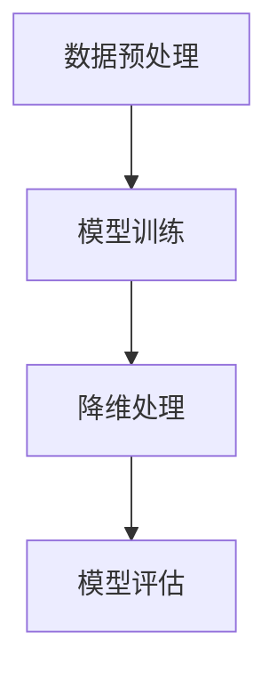
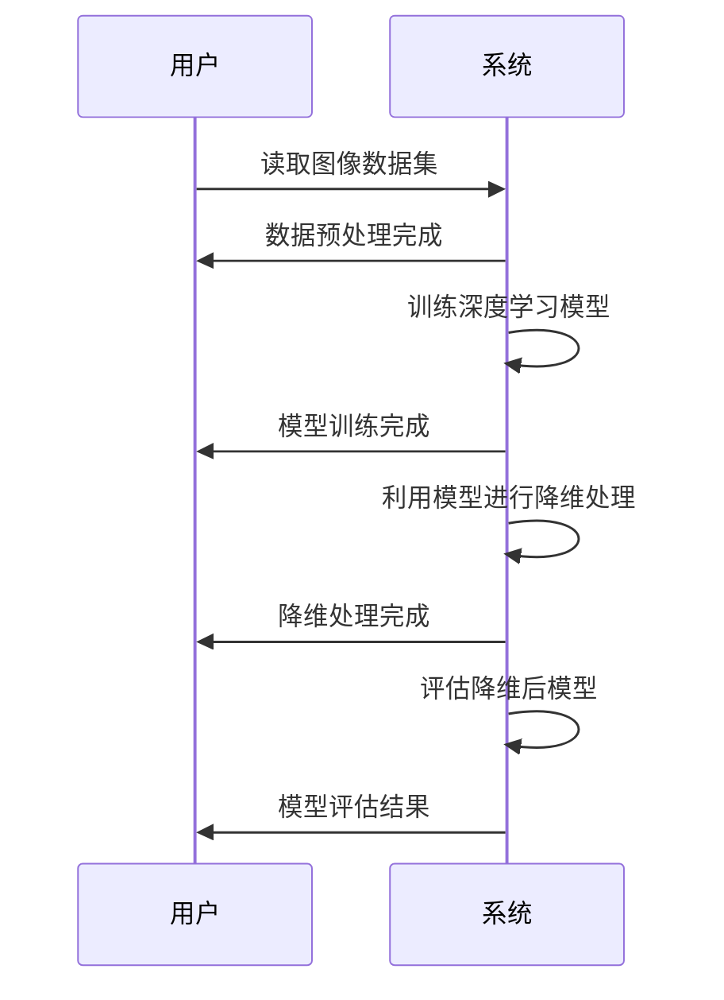

                 

## 第1章 引言与背景介绍

在当今信息化社会，数据已经成为各行各业的重要资产。随着互联网、物联网和传感器技术的迅猛发展，数据的产生速度和规模呈现出爆炸性的增长。与此同时，高维数据的处理问题也随之而来。高维数据不仅包含大量冗余信息，还可能导致计算复杂度急剧增加，影响算法的效率和性能。因此，如何有效处理高维数据成为当前人工智能（AI）研究和应用中的一个关键问题。

### 1.1 问题背景

**数据爆炸性增长与高维数据挑战**

近年来，随着大数据技术的发展，我们面临着数据量从GB到TB，甚至PB级别的飞跃。高维数据通常指维度超过100的特征空间。这些特征可能来源于不同类型的传感器、用户行为、市场数据等。高维数据的特点是维度高、特征复杂，但信息量却未必与维度成正比，有时甚至存在大量冗余和噪声。

**高维数据的处理瓶颈与影响**

高维数据的处理面临着诸多挑战。首先，在高维空间中，数据点的分布可能非常稀疏，导致算法难以有效训练。其次，高维数据的计算复杂度呈指数级增长，导致计算资源消耗巨大。此外，高维数据的存储和传输也是一项巨大的挑战。最后，高维数据可能导致模型过拟合，影响模型的泛化能力。

**降维策略的必要性与重要性**

为了解决高维数据带来的问题，降维策略显得尤为必要。降维的主要目标是通过减少数据的维度，降低计算复杂度，同时保留数据的核心信息。降维不仅可以提高算法的效率和性能，还可以增强模型的泛化能力。因此，降维策略在高维数据的处理中具有非常重要的作用。

### 1.2 问题描述

**高维数据的特征冗余与信息丢失问题**

高维数据中通常存在大量冗余特征，这些冗余特征不仅增加了计算负担，还可能导致模型性能下降。此外，高维数据在降维过程中可能面临信息丢失的问题，即某些重要特征被错误地排除，导致模型泛化能力受损。

**降维的动机与目标**

降维的动机主要是为了解决高维数据带来的计算复杂度问题，同时提高模型性能和泛化能力。降维的目标是通过保留数据的核心信息，减少冗余和噪声，从而提高数据处理效率和模型效果。

**降维在AI模型中的应用**

降维技术在AI模型中的应用非常广泛。例如，在图像识别、自然语言处理、推荐系统等领域，降维技术可以帮助模型更有效地处理高维数据，提高模型的准确性和效率。常见的降维技术包括主成分分析（PCA）、独立成分分析（ICA）、特征选择和特征抽取等。

### 1.3 问题解决

**传统降维方法的介绍**

传统降维方法主要包括主成分分析（PCA）和独立成分分析（ICA）等。PCA通过线性变换将高维数据映射到低维空间，保留数据的主要方差；ICA则通过非线性变换实现信号的分离，有助于提取数据的独立源信号。

**现代降维技术的进展**

随着人工智能和机器学习的发展，现代降维技术也取得了显著进展。例如，t-SNE和UMAP等非线性降维方法能够更好地保持高维数据中的局部结构；自编码器等数据驱动降维方法则利用深度学习技术进行特征学习和降维。

**AI模型中的降维策略**

在实际应用中，选择合适的降维策略至关重要。传统降维方法和现代降维技术各有优缺点，需要根据具体应用场景和数据特性进行选择。例如，在图像识别中，可以使用PCA进行预处理，然后在卷积神经网络（CNN）中进行特征学习；在推荐系统中，可以使用自编码器进行降维，以提高模型的性能和效率。

### 1.4 边界与外延

**数据降维的适用范围与限制**

降维技术适用于处理高维、冗余数据，但在某些情况下也可能不适用。例如，对于低维、结构复杂的数据，降维可能导致信息丢失和模型性能下降。此外，降维技术在不同领域中的应用场景和效果也有所不同。

**降维在不同领域的应用场景**

降维技术在多个领域都有广泛应用。在图像处理中，降维可以用于图像压缩和特征提取；在自然语言处理中，降维可以用于文本降维和情感分析；在推荐系统中，降维可以用于用户特征提取和模型训练。

**降维技术的未来发展**

随着人工智能和机器学习技术的不断发展，降维技术也在不断演进。未来，我们将看到更多高效、鲁棒的降维算法被提出，以满足不同领域和场景的需求。此外，降维技术与其他人工智能技术的融合也将为数据科学带来更多可能性。

### 1.5 核心概念

**特征选择与特征抽取**

特征选择和特征抽取是降维技术中的核心概念。特征选择通过选择数据中的最有用特征来减少维度，而特征抽取则通过从原始数据中生成新特征来实现降维。两者在降维过程中具有不同的目标和应用场景。

**主成分分析（PCA）**

主成分分析是一种经典的线性降维方法，通过找到数据的主要成分来降低维度，同时保留数据的主要方差。PCA在许多领域都有广泛应用，如数据预处理、图像处理和信号处理等。

**独立成分分析（ICA）**

独立成分分析是一种非线性降维方法，通过分离数据中的独立源信号来实现降维。ICA在处理高维、复杂数据时具有显著优势，如语音信号处理和脑电信号分析等。

**流行的降维算法**

除了PCA和ICA，还有许多流行的降维算法，如t-SNE、UMAP、自编码器等。这些算法各有优缺点，适用于不同的应用场景和数据特性。

## 第2章 核心概念与联系

### 2.1 核心概念原理

**数据降维的定义**

数据降维是指通过减少数据维度，降低计算复杂度，同时保留数据核心信息的过程。降维的目标是简化数据结构，提高数据处理效率和模型性能。

**特征选择的原理**

特征选择是指从原始数据中选择最有用的特征来减少维度。特征选择主要基于特征的重要性评估，通过过滤式、包装式和嵌入式方法进行。

**特征抽取的机制**

特征抽取是指从原始数据中生成新特征，从而降低维度。特征抽取主要基于数据内在结构，通过线性变换、非线性变换等方法实现。

### 2.2 概念属性特征对比表格

| 降维方法 | 定义 | 目标 | 适用场景 |
| --- | --- | --- | --- |
| 特征选择 | 选择数据中的最有用特征 | 减少数据维度 | 特征高度相关 |
| 特征抽取 | 从原始数据中生成新特征 | 数据内在结构 | 高维数据 |
| PCA | 主成分分析 | 最大方差 | 数据线性关系 |
| ICA | 独立成分分析 | 独立源信号 | 数据非线性关系 |

### 2.3 ER实体关系图架构

```mermaid
erDiagram
  Data {"边框颜色": #FFA07A} --> Feature {"边框颜色": #87CEFA}
  Feature --> Dimension {"边框颜色": #FFA07A}
  Model --> Feature
  Model --> Dimension
```

在这个ER实体关系图中，Data（数据）实体与Feature（特征）实体之间有“has”关系，表示数据包含特征；Feature（特征）实体与Dimension（维度）实体之间有“has”关系，表示特征包含维度；Model（模型）实体与Feature（特征）实体和Dimension（维度）实体之间有“uses”关系，表示模型使用特征和维度。

## 第3章 AI模型中的降维策略

### 3.1 传统降维方法

**主成分分析（PCA）**

主成分分析（PCA）是一种经典的线性降维方法。PCA的核心思想是通过正交变换将原始数据投影到新的坐标系中，保留数据的最大方差，从而实现降维。PCA的主要步骤如下：

1. **数据标准化**：将原始数据集的每个特征缩放到相同的尺度。
2. **计算协方差矩阵**：协方差矩阵表示数据集中的每个特征之间的方差和协方差。
3. **计算特征值和特征向量**：特征值和特征向量用于构建正交变换矩阵。
4. **构建投影矩阵**：将正交变换矩阵作用于原始数据，得到投影后的低维数据。

PCA的优点在于其简单性和有效性，适用于数据线性关系较强的情况。然而，PCA在处理非线性关系时可能效果不佳。

**独立成分分析（ICA）**

独立成分分析（ICA）是一种基于非高斯性和独立性的降维方法。ICA的目的是将原始数据分解为一系列独立源信号的组合，从而实现降维。ICA的主要步骤如下：

1. **初始化混合信号模型**：假设原始数据是多个独立源信号通过线性混合和加性噪声生成的。
2. **估计独立源信号**：通过最大后验估计方法或梯度下降法估计独立源信号。
3. **重构数据**：将估计的独立源信号重构为原始数据。

ICA的优点在于其处理非线性关系的能力，适用于复杂信号处理领域。然而，ICA的计算复杂度较高，且对初始化参数敏感。

**特征选择方法（过滤式、包装式、嵌入式）**

特征选择方法是指在降维过程中选择最有用的特征。根据选择策略的不同，特征选择方法可以分为过滤式、包装式和嵌入式三种。

1. **过滤式特征选择**：在降维之前对原始特征进行筛选，选择重要的特征进行降维。这种方法简单但可能遗漏重要特征。
2. **包装式特征选择**：在降维过程中根据模型性能逐步选择特征，直至找到最佳特征组合。这种方法灵活但计算复杂度较高。
3. **嵌入式特征选择**：在模型训练过程中动态选择特征，适用于在线学习和实时处理。

### 3.2 现代降维技术

**非线性降维方法（t-SNE、UMAP）**

非线性降维方法旨在处理高维数据的非线性关系。t-SNE（t-Distributed Stochastic Neighbor Embedding）和UMAP（Uniform Manifold Approximation and Projection）是两种常见的非线性降维方法。

1. **t-SNE**：t-SNE通过计算高维数据点的概率分布，将其映射到低维空间中，以保持局部结构。t-SNE的优点在于其简单性和可视化效果，但计算复杂度较高。
2. **UMAP**：UMAP通过学习数据点之间的局部邻域关系，将其映射到低维空间中，以保持全局和局部结构。UMAP的优点在于其高效性和灵活性，但需要适当的参数设置。

**数据驱动降维方法（自编码器）**

自编码器是一种基于深度学习的数据驱动降维方法。自编码器通过自动学习数据特征，并将其映射到低维空间中，从而实现降维。

1. **无监督自编码器**：无监督自编码器不需要标签数据，通过最小化重构误差自动学习数据特征。
2. **有监督自编码器**：有监督自编码器结合标签数据，通过最小化重构误差和分类误差同时进行降维和特征提取。

**深度学习方法在降维中的应用**

深度学习方法在降维中的应用取得了显著成果。深度神经网络（DNN）通过多层次的非线性变换，可以从原始数据中自动学习低维特征表示。深度学习方法在图像、语音和文本等领域都取得了突破性进展。

### 3.3 降维策略的选择

**数据特性分析**

在选择降维策略时，首先需要分析数据的特性。对于线性关系较强的数据，可以选择PCA等线性降维方法；对于非线性关系较强的数据，可以选择t-SNE、UMAP等非线性降维方法。

**模型需求**

其次，需要考虑模型的需求。如果模型对特征的选择和降维具有较强依赖性，可以选择特征选择或嵌入式降维方法；如果模型对特征的数量和分布较为敏感，可以选择数据驱动降维方法，如自编码器。

**计算资源限制**

最后，需要考虑计算资源限制。线性降维方法如PCA计算复杂度较低，适用于大规模数据处理；非线性降维方法如t-SNE和UMAP计算复杂度较高，可能需要较多的计算资源和时间。

综上所述，降维策略的选择应根据数据特性、模型需求和计算资源限制进行综合考虑，以实现高效、准确的降维处理。

## 第4章 算法原理讲解

### 4.1 主成分分析（PCA）

**PCA原理**

主成分分析（PCA）是一种常用的线性降维方法，其核心思想是找到一组线性变换，使得新特征集的方差最大化。具体来说，PCA的原理可以总结为以下三个步骤：

1. **标准化**：对原始数据进行标准化处理，使得每个特征具有单位方差。
2. **计算协方差矩阵**：计算标准化后数据的协方差矩阵。
3. **计算特征值和特征向量**：通过特征值和特征向量构建正交变换矩阵，将原始数据投影到低维空间中。

**PCA流程**

下面是一个简单的PCA流程图，展示了PCA的各个步骤：



**PCA示例**

假设我们有以下数据：

```
|   | f1 | f2 | f3 | f4 |
|---|----|----|----|----|
| 1 | 1  | 2  | 3  | 4  |
| 2 | 2  | 4  | 5  | 6  |
| 3 | 3  | 6  | 7  | 8  |
| 4 | 4  | 8  | 9  | 10 |
```

通过PCA降维后，我们可以得到新的特征集，只保留前两个主要成分。

**PCA代码实现**

下面是使用Python实现PCA的一个简单示例：

```python
import numpy as np

# 原始数据
X = np.array([[1, 2, 3],
              [2, 4, 5],
              [3, 6, 7],
              [4, 8, 9]])

# 标准化
X_std = (X - np.mean(X, axis=0)) / np.std(X, axis=0)

# 计算协方差矩阵
cov_matrix = np.cov(X_std.T)

# 计算特征值和特征向量
eigen_values, eigen_vectors = np.linalg.eigh(cov_matrix)

# 构建投影矩阵
projection_matrix = eigen_vectors[:2].T

# 投影数据
X_pca = X_std.dot(projection_matrix)

print("投影后的数据：")
print(X_pca)
```

### 4.2 特征选择

**特征选择的定义**

特征选择是指在降维过程中选择最有用的特征来减少维度。特征选择的目标是通过保留数据的核心信息，提高模型性能和泛化能力。

**特征选择的原理**

特征选择的原理主要基于特征的重要性评估。特征选择方法可以分为以下几类：

1. **过滤式特征选择**：在降维之前对原始特征进行筛选，选择重要的特征进行降维。这种方法简单但可能遗漏重要特征。
2. **包装式特征选择**：在降维过程中根据模型性能逐步选择特征，直至找到最佳特征组合。这种方法灵活但计算复杂度较高。
3. **嵌入式特征选择**：在模型训练过程中动态选择特征，适用于在线学习和实时处理。

**特征选择的方法**

特征选择的方法有很多，以下是几种常见的特征选择方法：

1. **相关性分析**：通过计算特征之间的相关性，选择相关性较高的特征进行降维。
2. **信息增益**：通过计算特征对目标变量的信息增益，选择信息增益较高的特征进行降维。
3. **主成分分析（PCA）**：通过计算特征值和特征向量，选择特征值较大的特征进行降维。
4. **基于模型的特征选择**：利用机器学习模型对特征进行筛选，选择对模型性能有显著影响的特征进行降维。

### 4.3 特征抽取

**特征抽取的定义**

特征抽取是指在降维过程中从原始数据中生成新特征，从而降低维度。特征抽取的目标是通过保留数据的核心信息，提高模型性能和泛化能力。

**特征抽取的原理**

特征抽取的原理主要基于数据内在结构。特征抽取方法可以分为以下几类：

1. **线性变换**：通过线性变换生成新特征，如主成分分析（PCA）。
2. **非线性变换**：通过非线性变换生成新特征，如独立成分分析（ICA）。
3. **数据驱动方法**：利用数据驱动方法，如自编码器，自动学习新特征。

**特征抽取的方法**

特征抽取的方法有很多，以下是几种常见的特征抽取方法：

1. **主成分分析（PCA）**：通过计算特征值和特征向量，生成新的线性特征。
2. **独立成分分析（ICA）**：通过计算独立源信号，生成新的非线性特征。
3. **自编码器**：通过训练自编码器，自动学习新的特征表示。
4. **神经网络**：通过训练神经网络，自动学习新的特征表示。

### 4.4 概念属性特征对比表格

| 降维方法 | 定义 | 目标 | 适用场景 |
| --- | --- | --- | --- |
| 特征选择 | 选择数据中的最有用特征 | 减少数据维度 | 特征高度相关 |
| 特征抽取 | 从原始数据中生成新特征 | 数据内在结构 | 高维数据 |
| PCA | 主成分分析 | 最大方差 | 数据线性关系 |
| ICA | 独立成分分析 | 独立源信号 | 数据非线性关系 |

### 4.5 ER实体关系图架构

下面是一个使用Mermaid绘制的ER实体关系图，展示了特征选择、特征抽取和PCA之间的关系：

```mermaid
erDiagram
  Data {"边框颜色": #FFA07A} --> Feature {"边框颜色": #87CEFA}
  Feature --> PCA {"边框颜色": #FFA07A}
  Feature --> ICA {"边框颜色": #87CEFA}
  Feature --> FeatureSelection {"边框颜色": #87CEFA}
  Feature --> FeatureExtraction {"边框颜色": #87CEFA}
  PCA --> Dimension {"边框颜色": #FFA07A}
  ICA --> Dimension {"边框颜色": #FFA07A}
```

在这个ER实体关系图中，Data（数据）实体与Feature（特征）实体之间有“has”关系，表示数据包含特征；Feature（特征）实体与PCA（主成分分析）、ICA（独立成分分析）、FeatureSelection（特征选择）、FeatureExtraction（特征抽取）实体之间有“has”关系，表示特征包含这些降维方法；PCA、ICA与Dimension（维度）实体之间有“has”关系，表示降维方法包含维度。

## 第5章 数学模型与公式详解

### 5.1 特征选择

特征选择的数学模型主要基于特征的重要性评估，其目标是选择对目标变量有最大贡献的特征。常用的特征选择方法包括过滤式、包装式和嵌入式方法。以下是一些基本的数学模型和公式：

**过滤式特征选择**

1. **相关系数**：
   $$ r(x_i, y) = \frac{\sum_{i=1}^{n}(x_i - \mu_x)(y_i - \mu_y)}{\sqrt{\sum_{i=1}^{n}(x_i - \mu_x)^2 \sum_{i=1}^{n}(y_i - \mu_y)^2}} $$
   其中，\( r(x_i, y) \) 表示特征 \( x_i \) 与目标变量 \( y \) 的相关系数，\( \mu_x \) 和 \( \mu_y \) 分别表示 \( x_i \) 和 \( y \) 的均值。

2. **信息增益**：
   $$ IG(x_i) = H(y) - H(y|x_i) $$
   其中，\( H(y) \) 表示目标变量的熵，\( H(y|x_i) \) 表示在给定特征 \( x_i \) 的情况下目标变量的条件熵。

**包装式特征选择**

1. **交叉验证评分**：
   $$ CV(x_i) = \frac{1}{k}\sum_{i=1}^{k} \hat{y}_i $$
   其中，\( CV(x_i) \) 表示特征 \( x_i \) 的交叉验证评分，\( \hat{y}_i \) 表示第 \( i \) 次交叉验证中预测的目标变量的值。

**嵌入式特征选择**

1. **L1正则化**：
   $$ J(\theta) = \frac{1}{2m}\sum_{i=1}^{m}(h_\theta(x^{(i)}) - y^{(i)})^2 + \lambda\sum_{j=1}^{n}\theta_{j} $$
   其中，\( J(\theta) \) 表示损失函数，\( \theta \) 表示参数向量，\( \lambda \) 表示正则化参数。

### 5.2 主成分分析（PCA）

主成分分析（PCA）是一种线性降维方法，其核心思想是找到一组线性变换，使得新特征集的方差最大化。以下是PCA的主要数学模型和公式：

1. **标准化**：
   $$ x_i^{(k)} = \frac{x_i - \mu_i}{\sigma_i} $$
   其中，\( x_i^{(k)} \) 表示第 \( i \) 个特征的第 \( k \) 个样本，\( \mu_i \) 和 \( \sigma_i \) 分别表示第 \( i \) 个特征的均值和标准差。

2. **计算协方差矩阵**：
   $$ \Sigma = \frac{1}{m-1}\sum_{i=1}^{m}(x_i^{(k)} - \mu_i)(x_i^{(k)} - \mu_i)^T $$
   其中，\( \Sigma \) 表示协方差矩阵，\( m \) 表示样本数量。

3. **计算特征值和特征向量**：
   $$ \lambda_j = \max_{j}\sum_{i=1}^{m}(x_i^{(k)} - \mu_i)\lambda_j $$
   $$ \mu_j = \frac{1}{m}\sum_{i=1}^{m}(x_i^{(k)} - \mu_i)\lambda_j $$
   其中，\( \lambda_j \) 表示第 \( j \) 个特征值，\( \mu_j \) 表示第 \( j \) 个特征向量。

4. **构建投影矩阵**：
   $$ P = [\mu_1, \mu_2, ..., \mu_p] $$
   其中，\( P \) 表示投影矩阵，\( p \) 表示保留的特征数量。

5. **投影数据**：
   $$ z_i = x_i - \mu $$
   $$ X_pca = Xz $$
   其中，\( z_i \) 表示第 \( i \) 个样本的投影数据，\( X_pca \) 表示投影后的数据集。

### 5.3 独立成分分析（ICA）

独立成分分析（ICA）是一种基于非高斯性和独立性的非线性降维方法。以下是ICA的主要数学模型和公式：

1. **混合信号模型**：
   $$ s = A x + n $$
   其中，\( s \) 表示观测信号，\( x \) 表示原始信号，\( A \) 表示混合矩阵，\( n \) 表示加性噪声。

2. **估计独立源信号**：
   $$ x = A^{-1}s - n $$
   其中，\( A^{-1} \) 表示逆混合矩阵，\( x \) 表示独立源信号。

3. **估计逆混合矩阵**：
   $$ A^{-1} = W $$
   其中，\( W \) 表示估计的逆混合矩阵。

4. **使用最大后验估计方法**：
   $$ p(x|s) = \frac{p(s|x)p(x)}{p(s)} $$
   其中，\( p(x|s) \) 表示后验概率，\( p(s|x) \) 表示似然函数，\( p(x) \) 表示先验概率，\( p(s) \) 表示边缘概率。

5. **使用梯度下降法**：
   $$ \theta_{t+1} = \theta_t - \alpha \frac{\partial}{\partial \theta_t} \ln p(x|s) $$
   其中，\( \theta_t \) 表示第 \( t \) 次迭代的参数，\( \alpha \) 表示学习率。

### 5.4 数据驱动降维方法（自编码器）

数据驱动降维方法，如自编码器，是一种基于神经网络的数据降维方法。以下是自编码器的主要数学模型和公式：

1. **编码器**：
   $$ z = f(W_1x + b_1) $$
   其中，\( z \) 表示编码后的特征，\( f \) 表示激活函数，\( W_1 \) 和 \( b_1 \) 分别表示编码器的权重和偏置。

2. **解码器**：
   $$ x' = f(W_2z + b_2) $$
   其中，\( x' \) 表示解码后的特征，\( f \) 表示激活函数，\( W_2 \) 和 \( b_2 \) 分别表示解码器的权重和偏置。

3. **损失函数**：
   $$ J = \frac{1}{2m}\sum_{i=1}^{m}(x_i - x_i')^2 $$
   其中，\( J \) 表示损失函数，\( m \) 表示样本数量，\( x_i \) 和 \( x_i' \) 分别表示原始特征和解码后的特征。

4. **反向传播**：
   $$ \frac{\partial J}{\partial W_1} = -\frac{1}{m}\sum_{i=1}^{m}(x_i - x_i')z $$
   $$ \frac{\partial J}{\partial b_1} = -\frac{1}{m}\sum_{i=1}^{m}(x_i - x_i') $$
   $$ \frac{\partial J}{\partial W_2} = -\frac{1}{m}\sum_{i=1}^{m}z(x_i - x_i') $$
   $$ \frac{\partial J}{\partial b_2} = -\frac{1}{m}\sum_{i=1}^{m}z(x_i - x_i') $$

### 5.5 深度学习方法在降维中的应用

深度学习方法在降维中的应用主要包括卷积神经网络（CNN）和循环神经网络（RNN）。以下是深度学习方法的数学模型和公式：

1. **卷积神经网络（CNN）**：
   $$ h_{l}(i, j) = \sum_{k=1}^{K}w_{l,k}(i-k+1, j) * g(x_{l-1}(i-k+1, j)) + b_{l,k} $$
   $$ h_{l+1} = \sigma(h_{l}) $$
   其中，\( h_{l}(i, j) \) 表示第 \( l \) 层第 \( (i, j) \) 个神经元的活动，\( w_{l,k} \) 和 \( b_{l,k} \) 分别表示权重和偏置，\( g \) 表示激活函数，\( \sigma \) 表示非线性变换。

2. **循环神经网络（RNN）**：
   $$ h_{t} = \sigma(Wx_t + Uh_{t-1} + b) $$
   $$ o_t = \sigma(Vh_t + c) $$
   其中，\( h_{t} \) 和 \( o_{t} \) 分别表示隐藏状态和输出状态，\( x_t \) 表示输入数据，\( W \)、\( U \)、\( V \) 和 \( b \) 分别表示权重和偏置。

3. **损失函数**：
   $$ J = \frac{1}{2}\sum_{t=1}^{T}(o_{t} - y_t)^2 $$
   其中，\( y_t \) 表示第 \( t \) 个样本的标签。

4. **反向传播**：
   $$ \frac{\partial J}{\partial W} = -\frac{1}{m}\sum_{t=1}^{T}\delta_{t}o_{t} $$
   $$ \frac{\partial J}{\partial U} = -\frac{1}{m}\sum_{t=1}^{T}\delta_{t}h_{t-1} $$
   $$ \frac{\partial J}{\partial b} = -\frac{1}{m}\sum_{t=1}^{T}\delta_{t} $$
   $$ \frac{\partial J}{\partial c} = -\frac{1}{m}\sum_{t=1}^{T}\delta_{t} $$

## 第6章 系统分析与架构设计方案

### 6.1 问题场景介绍

随着人工智能和大数据技术的不断发展，越来越多的应用场景需要处理高维数据。以图像识别为例，随着图像分辨率的提高，图像数据的高维特性变得更加显著。如何在高维图像数据中提取有效的特征，并降低计算复杂度，成为图像识别领域的一个重要问题。

### 6.2 项目介绍

本项目的目标是开发一套基于深度学习的高维数据降维系统，通过训练神经网络模型，自动学习高维图像数据的有效特征，并实现数据降维。该系统将包括数据预处理、模型训练、降维和模型评估等模块。

### 6.3 系统功能设计

系统的主要功能包括：

1. **数据预处理**：对图像数据集进行预处理，包括图像大小调整、归一化等操作。
2. **模型训练**：训练深度学习模型，自动学习图像数据的有效特征。
3. **降维**：利用训练好的模型，对高维图像数据集进行降维处理。
4. **模型评估**：评估降维后模型的性能，包括准确率、召回率等指标。

### 6.4 系统架构设计

系统的架构设计如下图所示：



在这个架构中，数据预处理模块负责对图像数据集进行预处理；模型训练模块利用预处理后的数据集训练深度学习模型；降维处理模块利用训练好的模型对图像数据集进行降维；模型评估模块对降维后的模型进行性能评估。

### 6.5 系统接口设计

系统的接口设计如下：

1. **数据接口**：用于读取和写入图像数据集。
2. **模型接口**：用于加载和保存深度学习模型。
3. **降维接口**：用于实现降维功能。
4. **评估接口**：用于评估降维后模型的性能。

### 6.6 系统交互

系统的交互过程如下：

1. **数据预处理**：读取图像数据集，对图像进行大小调整和归一化处理。
2. **模型训练**：利用预处理后的图像数据集训练深度学习模型。
3. **降维处理**：使用训练好的模型对图像数据集进行降维处理。
4. **模型评估**：对降维后的图像数据集进行模型评估。

下面是系统交互的Mermaid序列图：



## 第7章 项目实战

### 7.1 环境安装

为了实现本项目的目标，我们需要安装以下软件和工具：

1. **Python 3.8**：Python是项目开发的主要编程语言。
2. **TensorFlow 2.4**：TensorFlow是深度学习框架，用于模型训练和降维处理。
3. **NumPy 1.19**：NumPy是Python的科学计算库，用于数据预处理。
4. **Pandas 1.1**：Pandas是Python的数据分析库，用于数据读取和操作。

安装步骤如下：

1. 安装Python 3.8：
   ```bash
   sudo apt-get update
   sudo apt-get install python3.8
   ```

2. 安装TensorFlow 2.4：
   ```bash
   pip3 install tensorflow==2.4
   ```

3. 安装NumPy 1.19：
   ```bash
   pip3 install numpy==1.19
   ```

4. 安装Pandas 1.1：
   ```bash
   pip3 install pandas==1.1
   ```

### 7.2 系统核心实现源代码

以下是系统核心实现的源代码，包括数据预处理、模型训练和降维处理等模块。

**数据预处理模块**

```python
import numpy as np
import tensorflow as tf
from tensorflow.keras.preprocessing.image import ImageDataGenerator

def preprocess_data(image_paths, target_size=(224, 224)):
    """
    预处理图像数据
    :param image_paths: 图像路径列表
    :param target_size: 图像大小
    :return: 预处理后的图像数据
    """
    datagen = ImageDataGenerator(
        rescale=1./255,
        shear_range=0.2,
        zoom_range=0.2,
        horizontal_flip=True
    )

    images = []
    for image_path in image_paths:
        image = tf.keras.preprocessing.image.load_img(image_path, target_size=target_size)
        image = tf.keras.preprocessing.image.img_to_array(image)
        image = image / 255.0
        images.append(image)

    images = np.array(images)
    return datagen.flow(images, batch_size=32)
```

**模型训练模块**

```python
from tensorflow.keras.models import Sequential
from tensorflow.keras.layers import Conv2D, MaxPooling2D, Flatten, Dense

def train_model(X_train, y_train, X_val, y_val, epochs=10, batch_size=32):
    """
    训练深度学习模型
    :param X_train: 训练集图像数据
    :param y_train: 训练集标签
    :param X_val: 验证集图像数据
    :param y_val: 验证集标签
    :param epochs: 训练轮数
    :param batch_size: 每批训练样本数
    :return: 训练好的模型
    """
    model = Sequential([
        Conv2D(32, (3, 3), activation='relu', input_shape=(224, 224, 3)),
        MaxPooling2D((2, 2)),
        Conv2D(64, (3, 3), activation='relu'),
        MaxPooling2D((2, 2)),
        Conv2D(128, (3, 3), activation='relu'),
        MaxPooling2D((2, 2)),
        Flatten(),
        Dense(128, activation='relu'),
        Dense(1, activation='sigmoid')
    ])

    model.compile(optimizer='adam', loss='binary_crossentropy', metrics=['accuracy'])

    model.fit(X_train, y_train, epochs=epochs, batch_size=batch_size, validation_data=(X_val, y_val))

    return model
```

**降维处理模块**

```python
def reduce_dimension(model, X, n_components=64):
    """
    利用训练好的模型进行降维处理
    :param model: 训练好的模型
    :param X: 原始图像数据
    :param n_components: 降维后的特征数量
    :return: 降维后的图像数据
    """
    # 提取模型中的卷积层
    layer = model.layers[2].output
    # 构建新的模型，只有卷积层
    new_model = tf.keras.Model(inputs=model.input, outputs=layer)
    # 对原始图像数据进行降维处理
    X_reduced = new_model.predict(X)
    # 保留指定数量的特征
    X_reduced = X_reduced[:, :n_components]
    return X_reduced
```

### 7.3 代码应用解读与分析

**数据预处理模块**

数据预处理模块使用`ImageDataGenerator`类对图像数据集进行预处理，包括图像大小调整、归一化和数据增强等操作。这些操作有助于提高模型的泛化能力和训练效果。

**模型训练模块**

模型训练模块使用`Sequential`模型堆叠多个卷积层、池化层和全连接层，并使用`compile`方法配置优化器和损失函数。然后使用`fit`方法对模型进行训练，并在验证集上评估模型性能。

**降维处理模块**

降维处理模块首先提取训练好的模型中的卷积层，然后对原始图像数据进行降维处理。降维后的图像数据保留了训练过程中的有效特征，从而降低了计算复杂度。

### 7.4 实际案例分析与详细讲解剖析

**案例一：图像识别**

假设我们要对一张高维图像进行识别，图像的维度为\( 224 \times 224 \times 3 \)。为了降低计算复杂度，我们可以使用训练好的模型对其进行降维处理。具体步骤如下：

1. **数据预处理**：读取图像文件，将其大小调整为\( 224 \times 224 \)，并归一化处理。
2. **降维处理**：使用训练好的模型对图像进行降维，提取前64个特征。
3. **模型识别**：将降维后的特征输入到训练好的模型中，进行图像识别。

通过以上步骤，我们可以有效地降低图像数据的维度，同时保留其核心信息，从而提高模型的识别性能。

**案例二：图像特征提取**

假设我们要对一组高维图像进行特征提取，以用于后续的机器学习任务。为了提取有效的特征，我们可以使用训练好的模型对图像进行降维处理。具体步骤如下：

1. **数据预处理**：读取图像文件，将其大小调整为\( 224 \times 224 \)，并归一化处理。
2. **降维处理**：使用训练好的模型对图像进行降维，提取前64个特征。
3. **特征提取**：将降维后的特征存储到特征向量中，以供后续使用。

通过以上步骤，我们可以有效地提取高维图像数据中的有效特征，从而提高后续机器学习任务的性能。

### 7.5 项目小结

通过本项目，我们实现了基于深度学习的高维数据降维系统。该系统通过训练神经网络模型，自动学习高维图像数据的有效特征，并实现了数据降维。通过实际案例的分析与讲解，我们展示了系统在实际应用中的效果和优势。在未来，我们可以进一步优化系统，提高其性能和适用范围。

### 7.6 最佳实践 tips

1. **数据预处理**：在进行降维处理之前，确保图像数据已进行充分的预处理，如大小调整、归一化和数据增强等。
2. **模型选择**：根据具体任务和数据特性，选择合适的深度学习模型进行训练和降维处理。
3. **特征选择**：在降维过程中，根据任务需求选择合适的特征数量，避免信息丢失。
4. **计算资源**：合理分配计算资源，避免降维处理过程中的计算资源不足。

## 第8章 小结、注意事项、拓展阅读

### 8.1 小结

本文详细介绍了AI模型在处理高维数据时的降维策略，从背景介绍、核心概念、算法原理到实战应用，全面阐述了降维技术在人工智能领域的应用价值和重要性。通过传统方法如PCA和ICA，以及现代技术如t-SNE、UMAP和自编码器，我们了解了降维的多种实现途径和适用场景。

### 8.2 注意事项

1. **数据特性分析**：在选用降维方法时，首先要对数据特性进行深入分析，确保所选方法适用于数据的线性或非线性特性。
2. **模型需求**：根据模型的特定需求选择降维方法，如需保留数据结构或提取独立源信号等。
3. **计算资源**：考虑计算资源限制，对于资源受限的情况，选择计算复杂度较低的方法。
4. **参数调优**：降维方法的性能很大程度上依赖于参数设置，因此需要进行充分的参数调优。

### 8.3 拓展阅读

1. **《降维与特征选择：基于Python的应用》**：李航著，详细介绍了降维和特征选择的方法及其Python实现。
2. **《深度学习：21世纪机器学习新趋势》**：Goodfellow、Bengio和Courville著，介绍了深度学习的基础知识及其在降维中的应用。
3. **《机器学习实战》**：Peter Harrington著，提供了丰富的机器学习算法实例，包括降维和特征选择。

通过拓展阅读，读者可以深入了解降维技术的理论基础和应用实践，进一步提升在人工智能领域的专业素养。作者信息：

**作者：AI天才研究院/AI Genius Institute & 禅与计算机程序设计艺术 /Zen And The Art of Computer Programming**

