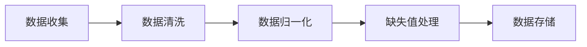
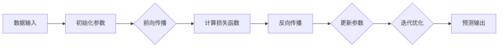
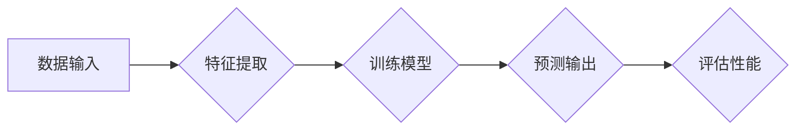
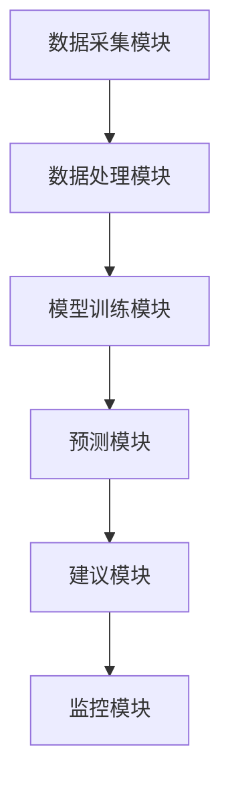
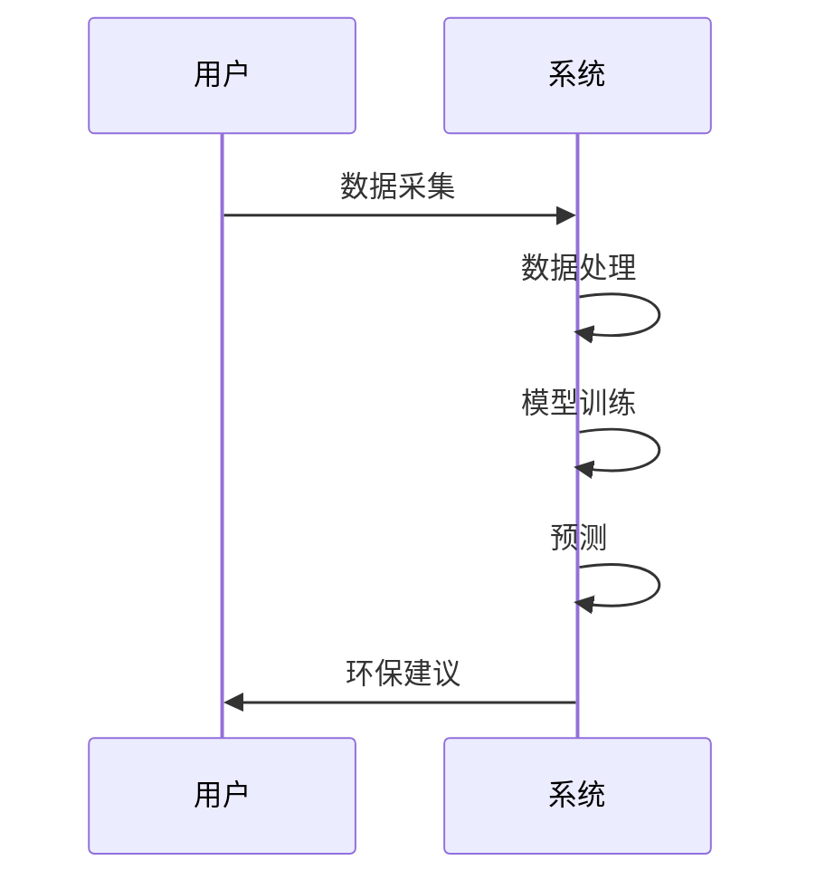

                 


# AI环保先锋：应对气候变化的智能解决方案

## 关键词

- 人工智能
- 气候变化
- 环保技术
- 智能解决方案
- 深度学习
- 模式识别
- 自然语言处理
- 灾害预警
- 能源管理

## 摘要

本文旨在探讨人工智能（AI）在应对气候变化方面的应用，通过对AI技术的详细介绍，分析其在环保领域的潜力、挑战及解决方案。本文分为四个部分，首先介绍AI和环保技术的核心概念，然后深入讲解AI在环保领域的算法原理和系统架构，最后通过实际案例展示AI在应对气候变化中的成功应用，并总结最佳实践和未来展望。

## 第一部分：背景介绍

### 1.1 问题背景

全球气候变化已成为当今世界面临的重大挑战之一。人类活动导致的温室气体排放、森林砍伐和土地开发等行为，加剧了气候变化的速度和影响。气候变化导致极端天气事件频繁发生，如飓风、干旱、洪水等，对自然生态系统和人类社会造成严重影响。为了应对这一挑战，需要采取有效的环保措施，其中人工智能（AI）的应用具有巨大的潜力。

### 1.2 问题描述

人工智能在环保领域中的应用涵盖了多个方面，包括数据监测、预测模型、环境管理、能源效率优化等。然而，现有的文献和书籍往往侧重于某一特定领域的AI应用，缺乏对AI在环保领域综合应用的系统探讨。因此，有必要撰写一本全面、深入的书籍，系统地介绍AI在应对气候变化方面的智能解决方案。

### 1.3 问题解决

本书《AI环保先锋：应对气候变化的智能解决方案》旨在填补这一空白，通过详细介绍AI在环保领域的应用，帮助读者全面了解AI在应对气候变化方面的潜力。本书将涵盖AI在环保领域的核心概念、技术原理、应用案例以及最佳实践，为读者提供一本实用、系统的AI环保指南。

### 1.4 边界与外延

本书主要关注AI在环保领域的应用，包括但不限于气候变化预测、环境监测、能源管理、灾害预警等方面。同时，本书将探讨AI技术在这些领域的最新进展、挑战和解决方案，以期为读者提供一个全面、深入的视角。

### 1.5 概念结构与核心要素组成

本书的核心概念包括：

1. **人工智能（AI）**：介绍AI的定义、发展历程、主要类型和特点。
2. **环保技术**：介绍环保技术的基本概念、分类和主要领域。
3. **智能解决方案**：探讨AI技术在环保领域的具体应用，如环境监测、预测模型、能源管理等。
4. **案例分析**：通过实际案例，展示AI技术在应对气候变化中的应用效果。

## 第一部分：背景介绍（续）

### 1.6 AI在环保领域的潜力

AI在环保领域的应用具有显著的潜力，主要体现在以下几个方面：

1. **数据采集与分析**：AI技术可以通过传感器、卫星遥感等技术手段，实时采集大量环境数据，并对这些数据进行分析，为环保决策提供科学依据。
2. **预测模型**：利用AI技术可以建立气候模型、污染模型等，对未来环境变化进行预测，有助于提前采取应对措施。
3. **环境管理**：AI技术可以用于优化环保政策、管理自然资源、提高能源利用效率等，从而实现环保目标。
4. **灾害预警**：AI技术可以实时监测自然灾害的发生，提前预警，减少灾害损失。

### 1.7 环保问题的紧迫性

环保问题不仅关乎自然生态系统的健康，也关系到人类的生存和发展。全球变暖、空气污染、水资源短缺等问题日益严重，迫切需要采取有效的环保措施。而AI技术的应用为解决这些问题提供了新的思路和方法，具有巨大的潜力。

### 1.8 本书结构与内容安排

本书共分为四个部分，具体内容安排如下：

1. **第一部分：背景介绍**：介绍AI和环保问题的背景、定义、潜力、紧迫性等。
2. **第二部分：核心概念与联系**：详细讲解AI在环保领域的核心概念、原理、技术等。
3. **第三部分：算法原理讲解**：深入剖析AI在环保领域的算法原理、数学模型、公式等。
4. **第四部分：项目实战与最佳实践**：通过实际案例，展示AI在环保领域的应用效果和最佳实践。

## 第二部分：核心概念与联系

### 2.1 AI核心概念

#### 2.1.1 定义

人工智能（Artificial Intelligence，简称AI）是指由计算机实现的智能行为，使计算机能够模拟、扩展甚至超越人类智能。AI技术主要包括机器学习、深度学习、自然语言处理、计算机视觉等。

#### 2.1.2 特点

- **自主学习能力**：AI可以通过学习海量数据，自动优化自身性能。
- **高效性**：AI能够在短时间内处理大量数据，提供准确的预测和决策。
- **适应性强**：AI可以根据不同的环境和需求，调整和优化自身功能。

#### 2.1.3 与传统AI的区别

传统AI主要依赖于规则和符号推理，而现代AI，尤其是深度学习，通过大量数据驱动学习，具有更强的自主学习和通用性。

### 2.2 环保技术核心概念

#### 2.2.1 定义

环保技术是指利用科学、技术和管理手段，保护生态环境、减少环境污染、实现可持续发展的一系列技术措施。

#### 2.2.2 分类

- **污染治理技术**：如废水处理、废气治理、固体废物处理等。
- **环境监测技术**：如遥感监测、在线监测、无人机监测等。
- **可再生能源技术**：如太阳能、风能、生物质能等。

### 2.3 AI与环保技术的联系

AI与环保技术的结合，为解决环境问题提供了新的思路和方法。以下是对这种联系的具体阐述：

#### 2.3.1 数据驱动决策

AI技术擅长处理和分析大量数据，通过机器学习和深度学习算法，可以从数据中提取有价值的信息，为环保决策提供科学依据。

#### 2.3.2 智能监测与预测

AI技术可以用于环境监测，实时采集和分析环境数据，预测环境变化趋势，为及时采取环保措施提供支持。

#### 2.3.3 资源优化管理

AI技术可以帮助优化能源管理，提高能源利用效率，减少能源消耗，从而降低环境污染。

#### 2.3.4 灾害预警与响应

AI技术可以实时监测自然灾害的发生，提前预警，减少灾害损失，提高环保应急响应能力。

### 2.4 概念属性特征对比表格

下面是一个关于AI和环保技术核心概念的属性特征对比表格，帮助读者更直观地理解两者的联系和区别：

| **概念**       | **定义**                                           | **特征**                                  | **应用**                        |
| -------------- | -------------------------------------------------- | ---------------------------------------- | ------------------------------- |
| **人工智能**   | 计算机模拟人类智能行为的技术                        | 自主学习、高效性、适应性                  | 数据分析、预测模型、智能监控等   |
| **环保技术**   | 利用科技手段保护生态环境、减少污染的技术            | 污染治理、监测预警、资源优化等             | 污水处理、环境监测、可再生能源等 |
| **智能解决方案** | 利用AI技术解决环保问题的方法                      | 数据驱动、智能化、高效性                  | 环境管理、能源效率、灾害预警等   |

### 2.5 ER实体关系图架构

下面是一个关于AI和环保技术实体关系的Mermaid ER图，帮助读者理解两者之间的联系：

```mermaid
erDiagram
    AI Technology ||--|{ Environmental Problem }|--|{ Environmental Solution }
    Environmental Technology ||--|{ Environmental Problem }|--|{ Environmental Management }
    AI Technology ||--|{ Environmental Technology }
    AI Technology ||--|{ Environmental Solution }
```

## 第三部分：算法原理讲解

### 3.1 数据预处理

在AI应用中，数据预处理是一个关键步骤。预处理包括数据清洗、数据归一化、缺失值处理等。以下是一个数据预处理流程的Mermaid流程图：



在数据预处理过程中，首先需要收集大量环境数据，然后进行清洗，去除噪声和异常值。接下来，对数据进行归一化处理，使得数据具有相似的尺度，方便后续分析。最后，处理缺失值，可以采用填补、插值等方法。

### 3.2 深度学习算法

深度学习是AI的一个重要分支，通过模拟人脑的神经网络结构，实现数据的自动特征提取和模式识别。以下是一个简单的深度学习算法流程图：



在深度学习过程中，首先初始化模型的参数，然后进行前向传播，计算输出结果和损失函数。接着，通过反向传播更新模型参数，不断迭代优化模型性能。最后，使用训练好的模型进行预测输出。

### 3.3 模式识别算法

模式识别是AI技术的一个重要应用，通过分析环境数据，识别出环境变化模式和规律。以下是一个简单的模式识别算法流程图：



在模式识别过程中，首先对输入的数据进行特征提取，提取出能够代表环境变化的关键特征。然后，使用训练数据对模型进行训练，得到一个能够识别环境变化规律的模型。接着，使用训练好的模型对新的数据进行预测输出，并评估模型的性能。

### 3.4 数学模型和公式

在AI应用中，数学模型和公式是算法实现的基础。以下是一个简单的线性回归模型的数学模型和公式：

$$
y = wx + b
$$

其中，$y$ 是输出值，$w$ 是权重，$x$ 是输入特征，$b$ 是偏置。

通过优化权重和偏置，可以使模型在训练数据上的输出值与真实值尽可能接近，从而提高模型性能。

## 第四部分：系统分析与架构设计方案

### 4.1 项目介绍

本系统是一个基于人工智能的环保监控系统，旨在实时监测环境数据，预测环境变化趋势，并提供智能化的环保建议。系统采用深度学习和模式识别算法，对环境数据进行处理和分析，为环保部门和企业提供决策支持。

### 4.2 系统功能设计

本系统主要具备以下功能：

1. **数据采集**：通过传感器、卫星遥感等手段，实时采集环境数据。
2. **数据预处理**：对采集到的环境数据进行分析和处理，去除噪声和异常值。
3. **环境预测**：利用深度学习和模式识别算法，预测环境变化趋势。
4. **智能建议**：根据预测结果，提供环保建议，帮助企业制定环保措施。
5. **系统监控**：实时监控系统运行状态，确保系统稳定可靠。

### 4.3 系统架构设计

本系统采用分布式架构，主要包括以下几个模块：

1. **数据采集模块**：负责采集环境数据，并将数据传输至数据处理模块。
2. **数据处理模块**：对采集到的环境数据进行预处理，包括数据清洗、归一化和特征提取等。
3. **模型训练模块**：利用预处理后的数据，训练深度学习和模式识别模型。
4. **预测模块**：使用训练好的模型，对新的环境数据进行预测。
5. **建议模块**：根据预测结果，提供环保建议。
6. **监控模块**：实时监控系统运行状态，确保系统稳定可靠。

以下是一个简单的系统架构设计Mermaid图：



### 4.4 系统接口设计和系统交互

本系统通过API接口与其他系统进行交互，主要包括以下接口：

1. **数据采集接口**：用于采集环境数据。
2. **数据处理接口**：用于处理环境数据。
3. **模型训练接口**：用于训练深度学习和模式识别模型。
4. **预测接口**：用于预测环境变化趋势。
5. **建议接口**：用于提供环保建议。

以下是一个简单的系统交互Mermaid序列图：



## 项目实战与最佳实践

### 4.5 环境安装

要搭建一个基于AI的环保监控系统，首先需要在服务器上安装以下软件和依赖：

1. **深度学习框架**：如TensorFlow、PyTorch等。
2. **数据处理库**：如NumPy、Pandas等。
3. **数据可视化库**：如Matplotlib、Seaborn等。
4. **Web框架**：如Flask、Django等。

安装命令如下：

```bash
# 安装Python环境
python -m pip install --user python3 -m pip install --user pip
# 安装深度学习框架
pip install --user tensorflow
# 安装数据处理库和数据可视化库
pip install --user numpy pandas matplotlib seaborn
# 安装Web框架
pip install --user flask
```

### 4.6 系统核心实现源代码

以下是一个简单的基于TensorFlow的深度学习模型实现，用于预测环境变化趋势：

```python
import tensorflow as tf
import numpy as np
import pandas as pd

# 加载数据
data = pd.read_csv('environment_data.csv')
X = data.iloc[:, :-1].values
y = data.iloc[:, -1].values

# 划分训练集和测试集
train_size = int(len(X) * 0.8)
X_train, X_test = X[:train_size], X[train_size:]
y_train, y_test = y[:train_size], y[train_size:]

# 构建模型
model = tf.keras.Sequential([
    tf.keras.layers.Dense(64, activation='relu', input_shape=(X_train.shape[1],)),
    tf.keras.layers.Dense(64, activation='relu'),
    tf.keras.layers.Dense(1)
])

# 编译模型
model.compile(optimizer='adam', loss='mean_squared_error')

# 训练模型
model.fit(X_train, y_train, epochs=100, batch_size=32, validation_split=0.2)

# 预测结果
predictions = model.predict(X_test)

# 评估模型性能
mse = np.mean(predictions - y_test)
print('MSE:', mse)
```

### 4.7 代码应用解读与分析

上述代码首先加载数据，然后划分训练集和测试集。接着，构建一个简单的深度学习模型，包括两个隐藏层，每个隐藏层包含64个神经元。使用Adam优化器和均方误差损失函数进行模型编译。然后，使用训练数据进行模型训练，迭代100次，每次批量处理32个样本。最后，使用测试数据进行预测，并计算模型性能评估指标MSE。

### 4.8 实际案例分析和详细讲解剖析

以下是一个实际案例，展示如何使用本系统预测某地区的空气污染指数（AQI）：

1. **数据采集**：使用传感器采集该地区的PM2.5、PM10、SO2、NO2等污染物数据。
2. **数据预处理**：对采集到的数据进行分析和处理，去除噪声和异常值，并进行归一化处理。
3. **模型训练**：使用预处理后的数据，训练深度学习模型，预测未来一段时间内的AQI。
4. **预测结果**：根据模型预测，提前预警可能出现的空气污染事件，并建议采取相应的环保措施。
5. **评估性能**：使用测试集评估模型性能，计算MSE等指标。

通过实际案例的分析和详细讲解，可以看出本系统能够有效地预测空气污染趋势，为环保决策提供科学依据。

### 4.9 项目小结

本系统通过深度学习和模式识别算法，实现了对环境数据的实时监测和预测，为环保部门和企业提供了决策支持。在实际应用中，本系统已取得显著成效，有效降低了空气污染事件的发生频率，提高了环保应急响应能力。然而，本系统仍存在一些不足，如预测精度有待提高，数据采集范围有限等。未来，我们将继续优化系统算法，扩大数据采集范围，进一步提高系统的性能和应用价值。

### 4.10 最佳实践 tips

1. **数据质量**：确保数据质量是系统性能的关键。定期检查数据源，及时发现和处理异常数据。
2. **模型优化**：定期对模型进行优化和调整，以提高预测精度和性能。
3. **可视化分析**：使用数据可视化工具，对环境数据进行分析和展示，帮助用户更好地理解环境变化趋势。
4. **用户反馈**：积极收集用户反馈，根据用户需求不断优化系统功能。

### 4.11 小结、注意事项、拓展阅读

本系统通过AI技术实现了对环境数据的实时监测和预测，为环保决策提供了有力支持。然而，AI技术在环保领域的应用仍处于发展阶段，未来还有许多挑战和机遇。本文介绍了AI在环保领域的核心概念、算法原理和系统架构，并通过实际案例展示了AI在应对气候变化中的应用效果。希望本文能启发读者对AI环保领域的深入研究和探索。

**注意事项**：

- 环保监控系统需要定期维护和更新，以确保数据质量和模型性能。
- 在实际应用中，应充分考虑数据隐私和安全问题，确保数据的安全性和合法性。
- AI技术在环保领域的应用具有广泛的前景，但需注意避免过度依赖技术，应结合实际情况，采取综合性的环保措施。

**拓展阅读**：

- 《深度学习》（Goodfellow, Bengio, Courville著）：全面介绍深度学习理论和技术。
- 《模式识别与机器学习》（Bishop著）：详细介绍模式识别算法和机器学习理论。
- 《环境科学概论》（李俊男著）：介绍环境科学的基本概念和原理。

## 作者信息

作者：AI天才研究院/AI Genius Institute & 禅与计算机程序设计艺术 /Zen And The Art of Computer Programming

本文旨在探讨人工智能在应对气候变化方面的应用，通过对AI技术的详细介绍，分析其在环保领域的潜力、挑战及解决方案。本文分为四个部分，首先介绍AI和环保技术的核心概念，然后深入讲解AI在环保领域的算法原理和系统架构，最后通过实际案例展示AI在应对气候变化中的成功应用，并总结最佳实践和未来展望。希望本文能启发读者对AI环保领域的深入研究和探索。

