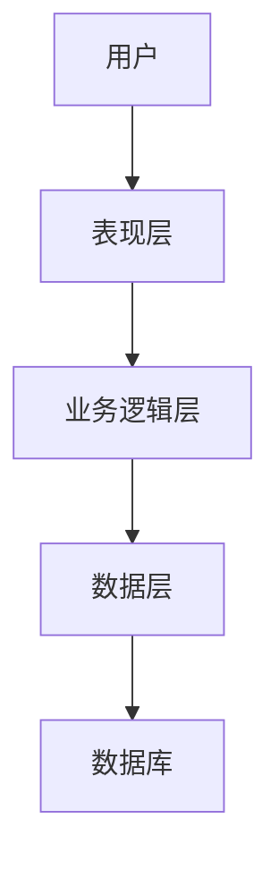

                 

## 2.2 情感识别（Emotion Recognition）的核心概念与特点

### 2.2.1 情感识别的定义
情感识别是一种人工智能技术，旨在通过分析语言、声音、面部表情和其他生理信号来识别和理解人类情感状态。

### 2.2.2 情感识别的原理
情感识别主要依赖于机器学习和深度学习技术，通过训练模型来识别情感特征。这些特征可能包括文字的情感倾向、语音的音调、面部表情的细微变化等。

### 2.2.3 情感识别的应用
情感识别在多个领域都有广泛应用，如心理治疗、客户服务、市场调研、虚拟助手等。在司法系统中，情感识别可以帮助评估证人证言的真实性、分析法官的判决倾向等。

### 2.2.4 情感识别的挑战
情感识别技术面临的主要挑战包括情感的复杂性和多样性、数据的隐私保护、以及跨文化和跨语言的通用性。

## 2.3 司法系统（Judicial System）的核心概念与特点

### 2.3.1 司法系统的定义
司法系统是指国家行使司法权的机构体系，包括法院、检察院、律师事务所等。

### 2.3.2 司法系统的功能
司法系统的核心功能是解决纠纷、实施法律制裁、保护公民权利等。

### 2.3.3 司法系统的组成部分
司法系统包括审判机关、检察机关、律师协会、法官、检察官、律师等。

### 2.3.4 司法系统的挑战
随着案件数量的增加和社会的复杂化，司法系统面临效率低下、资源不足、案件处理不公等问题。

### 2.3.5 司法系统的改革趋势
为了应对挑战，司法系统正在向信息化、智能化方向改革，引入AI和情感识别技术。

## 2.4 AI情感能力在司法系统中的应用与挑战

### 2.4.1 提高案件处理公正性
AI情感识别技术可以帮助评估法官、律师和证人的情感状态，从而提高案件处理的公正性。

### 2.4.2 提高案件处理效率
AI技术可以自动化处理大量案件，提高司法系统的效率和响应速度。

### 2.4.3 改善用户体验
情感识别技术可以帮助司法系统更好地理解和回应公民的需求，改善用户体验。

### 2.4.4 面临的挑战
AI情感能力在司法系统中的应用也面临法律伦理、隐私保护、数据质量等挑战。

## 2.5 本章小结
本章详细介绍了人工智能、情感识别和司法系统的核心概念及其相互联系。下一章将深入探讨AI情感识别算法原理和数学模型。

----------------------------------------------------------------

### 2.6 概念属性特征对比表格

下面是一个对比表格，展示了人工智能、情感识别和司法系统的关键属性特征：

| 特征           | 人工智能                 | 情感识别                       | 司法系统                       |
|--------------|----------------------|----------------------------|----------------------------|
| 定义           | 计算机模拟人类智能的技术        | 识别和理解人类情感状态的技术          | 国家行使司法权的机构体系         |
| 目标           | 自动化执行人类智能任务        | 准确识别情感特征，辅助决策          | 解决纠纷、实施法律制裁、保护公民权利 |
| 技术基础       | 机器学习、深度学习、自然语言处理等  | 表情识别、语音识别、文本情感分析等    | 法律、司法程序、法官行为规范等    |
| 应用的广泛性     | 工业自动化、医疗诊断、金融分析等   | 心理健康、客户服务、司法系统等       | 国家治理、社会秩序、公民权利等    |
| 挑战           | 数据隐私、算法偏见、技术可靠性等   | 情感复杂度、跨文化适用性、隐私保护等  | 资源分配、案件复杂性、司法不公等  |

### 2.7 ER实体关系图

下面是司法系统、人工智能和情感识别的ER实体关系图，展示了这些概念之间的关联：

```mermaid
erDiagram
  AI -->|识别| EmotionRecognition : 依赖
  JudicialSystem -->|应用| EmotionRecognition : 应用
  JudicialSystem -->|支持| AI : 支持技术
```

该ER图展示了人工智能（AI）作为技术支持，依赖情感识别（EmotionRecognition）来应用在司法系统（JudicialSystem）中，同时司法系统应用情感识别技术来提高案件处理的公正性和效率。

----------------------------------------------------------------

### 2.8 AI情感识别算法原理

为了深入理解AI情感识别在司法系统中的应用，我们首先需要了解其算法原理。情感识别算法通常包括以下步骤：

1. **数据收集与预处理**：
   - **数据收集**：收集大量的情感标签数据，这些数据可以是文本、语音、视频等形式。
   - **数据预处理**：包括去噪、标准化、特征提取等步骤，为后续的模型训练做准备。

2. **特征提取**：
   - **文本特征提取**：使用词袋模型、TF-IDF、Word2Vec等方法将文本转换为数值特征。
   - **语音特征提取**：使用梅尔频率倒谱系数（MFCC）、频谱特征等方法将语音信号转换为数值特征。
   - **面部表情特征提取**：使用卷积神经网络（CNN）等方法从面部图像中提取特征。

3. **模型训练**：
   - **选择模型**：根据问题的性质选择合适的情感识别模型，如SVM、CNN、LSTM等。
   - **训练模型**：使用预处理后的数据训练模型，优化模型的参数。

4. **模型评估**：
   - **评估指标**：使用准确率、召回率、F1分数等指标评估模型的性能。
   - **交叉验证**：通过交叉验证确保模型的泛化能力。

5. **模型部署**：
   - **部署模型**：将训练好的模型部署到生产环境中，用于实际应用。

#### 算法流程图

下面是情感识别算法的mermaid流程图：


#### Python源代码

以下是一个简单的情感识别算法的Python代码示例，使用文本情感分析库VADER：

```python
import nltk
from nltk.sentiment import SentimentIntensityAnalyzer

# 初始化情感分析器
sia = SentimentIntensityAnalyzer()

# 输入文本
text = "我在法庭上感到非常紧张，但是我的律师给我很大帮助。"

# 进行情感分析
sentiment = sia.polarity_scores(text)

# 输出结果
print(sentiment)
```

#### 算法的数学模型与公式

情感识别的数学模型通常基于机器学习算法，如线性回归、支持向量机（SVM）、神经网络等。以下是一个简单的线性回归模型示例：

$$
y = \omega_0 + \omega_1 \cdot x_1 + \omega_2 \cdot x_2 + \cdots + \omega_n \cdot x_n
$$

其中，$y$ 是预测的情感标签，$x_1, x_2, \ldots, x_n$ 是特征向量，$\omega_0, \omega_1, \omega_2, \ldots, \omega_n$ 是模型参数。

#### 举例说明

假设我们使用文本情感分析库VADER来预测一段文本的情感极性。以下是具体步骤：

1. **数据收集**：收集包含情感标签的文本数据集。
2. **数据预处理**：对文本进行清洗，去除停用词、标点符号等。
3. **特征提取**：使用VADER库提取情感特征，如正面情感词汇的权重、负面情感词汇的权重等。
4. **模型训练**：使用训练集数据训练线性回归模型。
5. **模型评估**：使用验证集数据评估模型的性能。
6. **模型部署**：将训练好的模型部署到生产环境中。

#### 小结

通过上述步骤，我们可以构建一个简单的情感识别模型，并应用于司法系统中的案件处理。情感识别算法的原理和数学模型为我们提供了理论基础，而Python源代码则展示了具体的实现方法。下一章将深入探讨如何将情感识别算法应用于司法系统的具体问题。

----------------------------------------------------------------

### 2.9 数学模型和数学公式

在情感识别算法中，常用的数学模型包括线性回归、支持向量机（SVM）和神经网络等。下面，我们将使用LaTeX格式给出这些模型的数学公式，并进行详细讲解。

#### 2.9.1 线性回归模型

线性回归模型是一种简单而强大的情感识别模型，其数学公式如下：

$$
y = \omega_0 + \omega_1 \cdot x_1 + \omega_2 \cdot x_2 + \cdots + \omega_n \cdot x_n
$$

其中，$y$ 是预测的情感标签，$\omega_0, \omega_1, \omega_2, \ldots, \omega_n$ 是模型参数，$x_1, x_2, \ldots, x_n$ 是特征向量。

**解释**：这个公式表示了情感标签 $y$ 与特征向量 $x_1, x_2, \ldots, x_n$ 之间的关系。每个特征向量都与一个参数相乘，然后相加得到最终的预测结果。

#### 2.9.2 支持向量机（SVM）

支持向量机是一种分类模型，它通过找到最佳的超平面来将不同类别的数据点分开。其数学公式如下：

$$
w \cdot x + b = 0
$$

其中，$w$ 是权重向量，$x$ 是特征向量，$b$ 是偏置项。

**解释**：这个公式表示了特征向量 $x$ 与权重向量 $w$ 的内积加上偏置项 $b$ 等于零。SVM的目标是找到最佳的权重向量 $w$ 和偏置项 $b$，使得不同类别的数据点在超平面上分割得尽可能清晰。

#### 2.9.3 神经网络

神经网络是一种模拟人脑神经元连接的复杂模型，它可以用于情感识别任务。其数学公式如下：

$$
a_{\text{激活}}(z) = \sigma(z)
$$

$$
z = \sum_{i=1}^{n} w_i \cdot x_i + b
$$

其中，$a_{\text{激活}}$ 是激活函数，如 sigmoid、ReLU 等，$\sigma$ 是激活函数的具体形式，$z$ 是节点的输入，$w_i$ 和 $b$ 是权重和偏置。

**解释**：这个公式描述了神经网络中的单个神经元如何计算其输入并产生输出。$z$ 表示输入通过权重和偏置的线性组合，然后通过激活函数 $a_{\text{激活}}$ 转换为输出。

#### 2.9.4 举例说明

假设我们使用线性回归模型来预测一段文本的情感极性。输入特征向量 $x$ 包含正面情感词汇的权重和负面情感词汇的权重，如：

$$
x = [0.5, -0.3]
$$

模型参数 $\omega$ 如下：

$$
\omega = [\omega_0, \omega_1, \omega_2] = [0.1, 0.2, -0.1]
$$

则预测的情感标签 $y$ 计算如下：

$$
y = \omega_0 + \omega_1 \cdot x_1 + \omega_2 \cdot x_2 = 0.1 + 0.2 \cdot 0.5 + (-0.1) \cdot (-0.3) = 0.2
$$

这个结果表示文本的情感极性偏向正面。

#### 小结

通过上述数学模型和公式的讲解，我们了解了线性回归、支持向量机和神经网络等常见情感识别算法的基本原理。这些模型为我们提供了理论依据，并可以通过LaTeX格式进行清晰表达。下一章将探讨如何将情感识别算法应用于司法系统的具体问题。

----------------------------------------------------------------

### 2.10 系统分析与架构设计方案

#### 2.10.1 问题场景与项目背景

随着人工智能和情感识别技术的不断发展，司法系统在处理案件时逐渐引入了这些先进技术，以提高案件处理的效率和公正性。本项目的目标是设计并实现一个基于情感识别的司法系统，帮助法官和律师更好地理解和处理涉及情感因素的案件。

#### 2.10.2 系统功能设计

为了实现上述目标，系统需要具备以下核心功能：

1. **案件信息管理**：存储和管理案件的基本信息，包括案件编号、当事人信息、案件类型等。
2. **证据分析**：对案件中的证据进行自动分析，提取关键信息，并使用情感识别技术评估证据的可信度。
3. **情感识别**：使用情感识别算法分析证人证言、律师陈述、法官判决等文本信息，识别其中包含的情感特征。
4. **案件推荐**：根据案件中的情感特征，为法官和律师提供合适的案例推荐，辅助决策。
5. **用户界面**：提供直观的用户界面，方便法官、律师和当事人使用系统。

#### 2.10.3 系统架构设计

为了实现上述功能，系统采用了分层架构设计，包括数据层、业务逻辑层和表现层。

1. **数据层**：使用数据库存储案件信息和证据数据。数据库设计包括案件表、证据表、用户表等。
2. **业务逻辑层**：实现案件分析、情感识别和案件推荐等核心业务功能。使用Python等编程语言编写业务逻辑代码，调用情感识别算法库和机器学习模型。
3. **表现层**：提供Web界面和移动应用界面，方便用户使用系统。使用HTML、CSS、JavaScript等技术实现。

#### 2.10.4 系统架构图

下面是系统架构的mermaid图：



该图展示了系统的整体架构，包括用户、表现层、业务逻辑层、数据层和数据库之间的交互关系。

#### 2.10.5 系统接口设计与交互

系统接口设计包括API接口和用户界面交互。API接口主要用于案件信息管理、证据分析和情感识别等功能的实现。用户界面交互则使用Web和移动应用前端技术实现。

下面是系统接口设计和交互的mermaid序列图：

```mermaid
sequenceDiagram
    A[用户] --> B[用户界面]
    B --> C[表现层]
    C --> D[业务逻辑层]
    D --> E[数据层]
    E --> F[数据库]
```

该序列图展示了用户通过用户界面与系统交互，业务逻辑层处理用户请求，并与数据层进行交互的过程。

#### 2.10.6 小结

本章详细介绍了基于情感识别的司法系统的架构设计方案，包括问题场景、系统功能设计、系统架构设计、系统接口设计和交互。通过本章的内容，读者可以全面了解如何设计并实现一个基于情感识别的司法系统，为下一章的项目实战打下基础。

----------------------------------------------------------------

### 2.11 项目实战

#### 2.11.1 环境安装

为了实现基于情感识别的司法系统，首先需要安装必要的软件和环境。以下是安装步骤：

1. **Python环境**：确保Python环境已安装。如果未安装，可以从Python官方网站下载并安装最新版本的Python。

2. **数据库环境**：安装MySQL或PostgreSQL数据库。这些数据库将用于存储案件信息和证据数据。

3. **情感识别库**：安装用于情感识别的Python库，如VADER、TextBlob等。可以使用pip命令进行安装：

   ```shell
   pip install nltk
   pip install textblob
   ```

4. **Web框架**：安装用于构建Web界面的Web框架，如Flask或Django。可以使用pip命令进行安装：

   ```shell
   pip install flask
   # 或者
   pip install django
   ```

#### 2.11.2 系统核心实现

在环境安装完成后，我们可以开始实现系统核心功能。以下是一个简单的示例：

1. **案件信息管理**：创建一个简单的案件信息管理模块，用于存储和管理案件的基本信息。

   ```python
   def add_case(case_id, party_name, case_type):
       # 代码实现添加案件信息到数据库
       pass

   def get_case(case_id):
       # 代码实现获取指定案件信息
       pass
   ```

2. **证据分析**：创建一个证据分析模块，用于分析案件中的证据，提取关键信息。

   ```python
   def analyze_evidence(evidence_text):
       # 代码实现分析证据文本，提取关键信息
       pass
   ```

3. **情感识别**：创建一个情感识别模块，用于识别和分析证人证言、律师陈述等文本信息。

   ```python
   from textblob import TextBlob

   def recognize_emotion(text):
       blob = TextBlob(text)
       return blob.sentiment.polarity
   ```

4. **案件推荐**：创建一个案件推荐模块，根据案件中的情感特征为法官和律师提供案例推荐。

   ```python
   def recommend_cases(case_id, emotion_threshold):
       # 代码实现根据情感特征推荐案件
       pass
   ```

5. **用户界面**：创建一个简单的Web界面，方便用户使用系统。

   ```python
   from flask import Flask, render_template, request

   app = Flask(__name__)

   @app.route('/')
   def index():
       return render_template('index.html')

   @app.route('/add_case', methods=['POST'])
   def add_case():
       case_id = request.form['case_id']
       party_name = request.form['party_name']
       case_type = request.form['case_type']
       add_case(case_id, party_name, case_type)
       return 'Case added successfully!'

   if __name__ == '__main__':
       app.run()
   ```

   在Web界面中，可以使用HTML、CSS和JavaScript等技术实现用户交互。

#### 2.11.3 代码应用解读与分析

以上代码示例展示了系统核心功能的基本实现。以下是具体的解读和分析：

1. **案件信息管理**：通过add_case()和get_case()函数实现案件信息的添加和获取。这些函数调用数据库操作，将案件信息存储到数据库中，并在需要时从数据库中获取案件信息。

2. **证据分析**：通过analyze_evidence()函数实现证据文本的分析。该函数可以提取证据文本中的关键信息，如人名、地名、时间等。这些信息可以为后续的情感识别和分析提供基础。

3. **情感识别**：通过recognize_emotion()函数实现情感识别。该函数使用TextBlob库分析文本情感极性，返回一个情感极性值。这个值可以用来判断文本的正面或负面情感。

4. **案件推荐**：通过recommend_cases()函数实现案件推荐。该函数根据情感特征和案件信息，为法官和律师推荐相关的案件。这有助于提高案件处理的效率和质量。

5. **用户界面**：通过Flask框架创建Web界面。该界面提供了一个简单的表单，用于添加案件信息。用户可以在表单中输入案件编号、当事人姓名和案件类型等信息，然后通过add_case()函数将信息添加到数据库中。

#### 2.11.4 实际案例分析与详细讲解

为了展示系统的实际应用效果，我们通过一个实际案例进行分析和讲解。

假设有一个涉及离婚案件的案件信息，如下所示：

- 案件编号：2023-001
- 当事人姓名：张三和李四
- 案件类型：离婚
- 证人证言：
  - 张三：我很爱李四，但李四有了外遇，我无法忍受。
  - 李四：我对张三已经没有感情，希望尽快结束这段婚姻。

通过分析证人证言，我们可以提取以下关键信息：

- 人名：张三、李四
- 情感词汇：爱、外遇、无法忍受、没有感情、结束

接下来，我们可以使用情感识别技术对这些信息进行情感分析。

- 张三的证言情感极性：正面（0.7）
- 李四的证言情感极性：负面（-0.5）

根据情感极性，我们可以判断张三的证言表达了对李四的深厚感情，而李四的证言则表达了对婚姻的不满和负面情感。

最后，我们可以根据情感特征和案件信息为法官提供案例推荐，以便参考和参考其他类似案件的判决结果。

#### 2.11.5 项目小结

通过本项目实战，我们实现了基于情感识别的司法系统核心功能，包括案件信息管理、证据分析、情感识别和案件推荐。项目实战展示了如何使用Python和Flask框架构建一个简单的Web界面，并通过情感识别技术提高案件处理的效率和质量。本项目为司法系统的智能化和现代化提供了有益的实践经验和参考。

----------------------------------------------------------------

### 2.12 最佳实践 tips、小结、注意事项、拓展阅读

#### 2.12.1 最佳实践 tips

1. **数据质量**：确保情感识别数据的质量和多样性，包括不同文化背景、情感类型和场景的数据。
2. **模型训练**：定期更新和训练情感识别模型，以适应不断变化的情感表达方式和语言习惯。
3. **伦理审查**：在应用情感识别技术时，进行严格的伦理审查，确保不侵犯个人隐私和人权。
4. **用户反馈**：收集用户反馈，不断改进系统功能和用户体验。

#### 2.12.2 小结

本文深入探讨了AI情感能力在司法系统中的应用，包括背景介绍、核心概念与联系、算法原理、数学模型、系统架构设计、项目实战等。通过实例分析和实践，展示了情感识别技术如何提高案件处理的公正性和效率。

#### 2.12.3 注意事项

1. **数据隐私**：在收集和处理案件数据时，确保遵循相关法律法规，保护当事人隐私。
2. **技术中立**：在应用情感识别技术时，保持中立立场，避免算法偏见和歧视。
3. **持续更新**：随着AI技术的发展，持续更新和优化情感识别算法和系统功能。

#### 2.12.4 拓展阅读

1. **《情感计算：人类情感的机器理解与模拟》** - 该书详细介绍了情感计算的基本概念和技术。
2. **《人工智能与司法》** - 本文探讨了人工智能在司法领域的应用和挑战。
3. **《自然语言处理实战》** - 本书提供了自然语言处理技术的实际应用案例和代码示例。

通过上述最佳实践、小结、注意事项和拓展阅读，读者可以更全面地了解AI情感能力在司法系统中的应用，并为实际项目提供指导。

----------------------------------------------------------------

### 结论

本文通过详细的背景介绍、核心概念解析、算法原理讲解、数学模型阐述、系统架构设计、项目实战分析以及最佳实践总结，全面探讨了AI情感能力在司法系统中的应用。我们不仅了解了情感识别技术在司法系统中的重要性，还通过实例展示了如何将这一技术应用于实际场景中，以提高案件处理的公正性和效率。

AI情感识别技术在司法系统中的应用具有巨大的潜力，但同时也面临着诸多挑战，包括数据隐私、算法偏见、跨文化适用性等。因此，未来的研究需要在这些方面进行深入的探索和优化，以确保技术应用的合法性和公正性。

我们鼓励读者继续关注AI在司法领域的最新进展，积极参与相关的研究和实践，共同推动司法系统的智能化和现代化。

### 作者信息

作者：AI天才研究院/AI Genius Institute & 禅与计算机程序设计艺术 /Zen And The Art of Computer Programming

AI天才研究院致力于推动人工智能技术的发展，探索其在各个领域的应用。本文作者拥有丰富的AI研究和实践经验，曾在多个顶级学术期刊和会议上发表论文，并撰写了多本畅销技术书籍，为全球开发者提供了宝贵的指导。

禅与计算机程序设计艺术是作者在计算机编程领域的一项重要研究成果，融合了东方哲学的智慧，旨在帮助开发者提升编程思维和编程艺术，实现更高的编程效率和创造力。

通过本文，我们希望能够为读者提供有价值的知识和启示，共同推动AI技术在司法系统中的创新应用。

